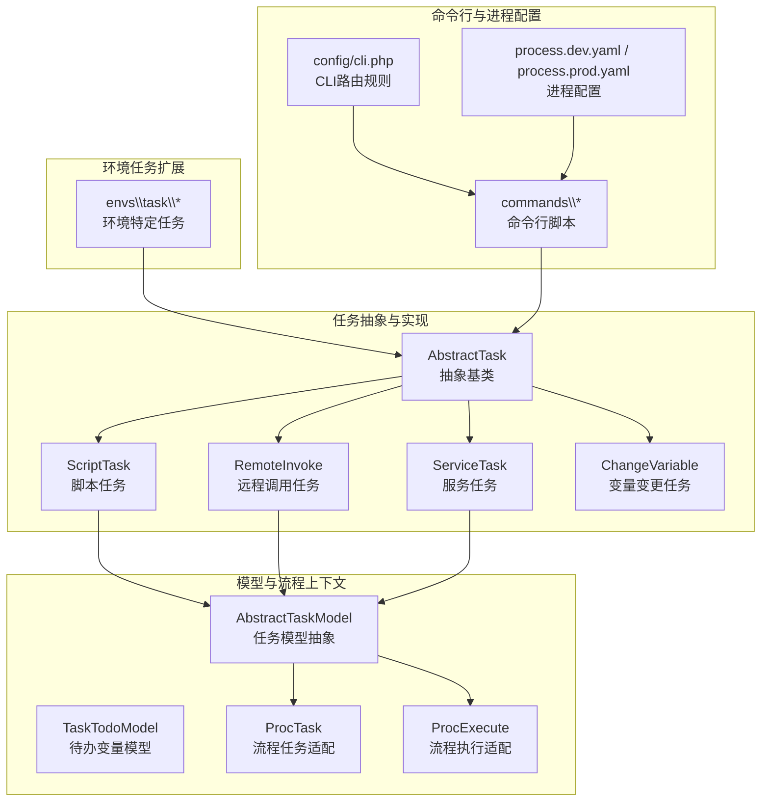
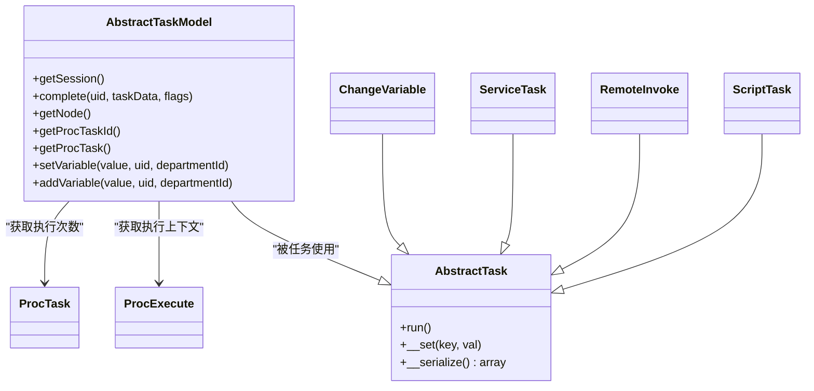
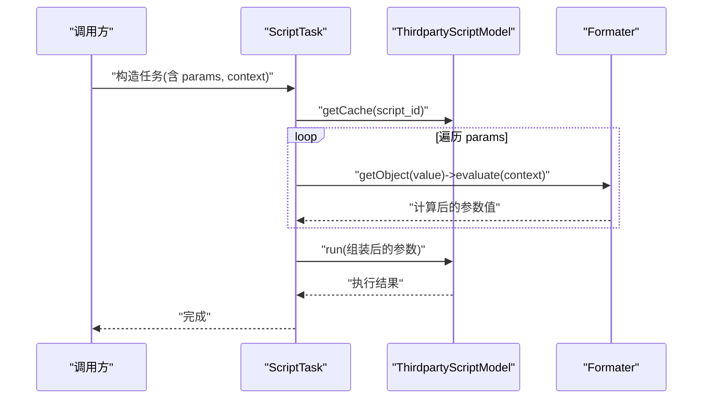
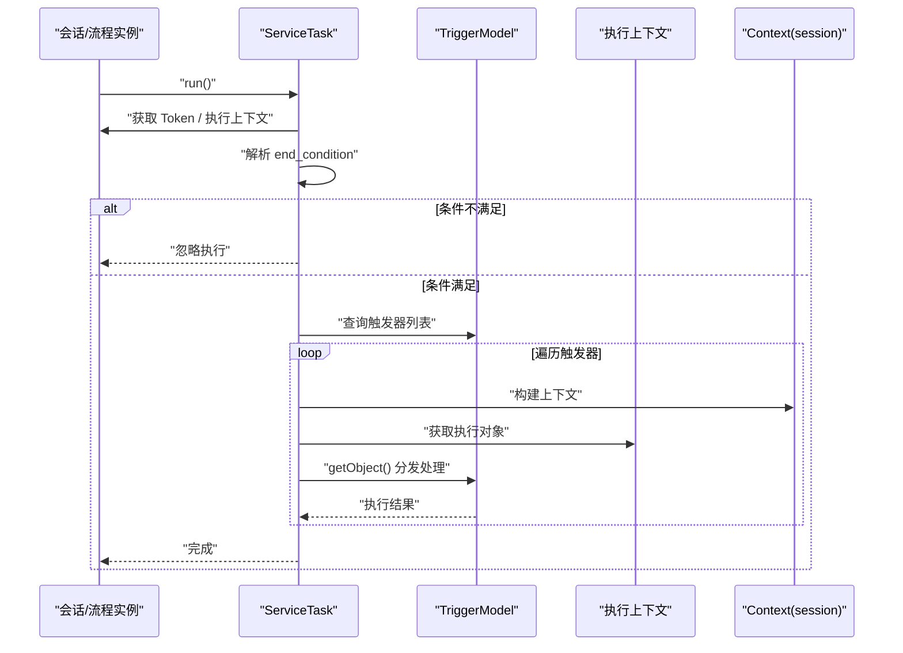
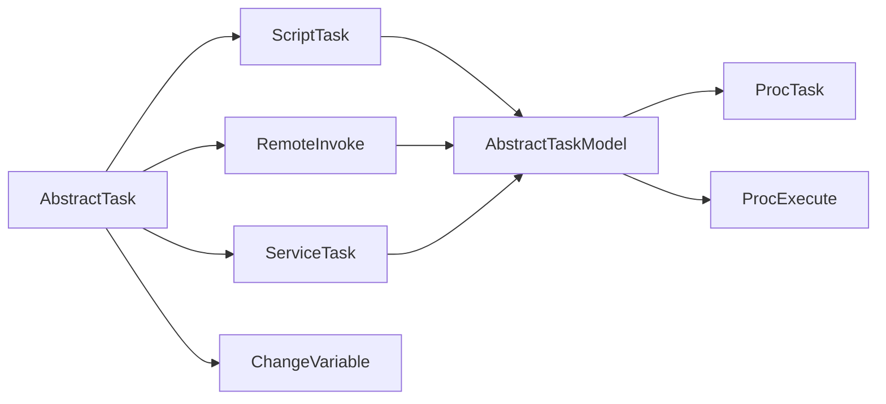

# 任务基础概念

<cite>
**本文引用的文件**
- [process\src\services\task\AbstractTask.php](file://process/src/services/task/AbstractTask.php)
- [process\src\models\AbstractTaskModel.php](file://process/src/models/AbstractTaskModel.php)
- [process\src\models\TaskTodoModel.php](file://process/src/models/TaskTodoModel.php)
- [process\src\engine\ProcTask.php](file://process/src/engine/ProcTask.php)
- [process\src\engine\ProcExecute.php](file://process/src/engine/ProcExecute.php)
- [process\src\services\task\ServiceTask.php](file://process\src\services\task\ServiceTask.php)
- [process\src\services\task\ScriptTask.php](file://process\src\services\task\ScriptTask.php)
- [process\src\services\task\RemoteInvoke.php](file://process\src\services\task\RemoteInvoke.php)
- [process\src\services\task\ChangeVariable.php](file://process\src\services\task\ChangeVariable.php)
- [process_envs\sdu\product\task\L_datacube_push.php](file://process_envs\sdu\product\task\L_datacube_push.php)
- [process\src\commands\Common.php](file://process\src\commands\Common.php)
- [process\src\commands\Demo.php](file://process\src\commands\Demo.php)
- [process\src\config\process.dev.yaml](file://process\src\config/process.dev.yaml)
- [process\src\config\process.prod.yaml](file://process\src\config/process.prod.yaml)
- [process\src\config\cli.php](file://process\src\config/cli.php)
- [process\docs\sql\database.sql](file://process/docs/sql/database.sql)
</cite>

## 目录
1. [引言](#引言)
2. [项目结构](#项目结构)
3. [核心组件](#核心组件)
4. [架构总览](#架构总览)
5. [详细组件分析](#详细组件分析)
6. [依赖关系分析](#依赖关系分析)
7. [性能考量](#性能考量)
8. [故障排查指南](#故障排查指南)
9. [结论](#结论)
10. [附录](#附录)

## 引言
本文件面向 htdNew 项目中“任务系统”的基础概念与实践，目标是帮助开发者快速理解任务体系的整体架构、抽象基类设计理念、任务与命令行脚本的区别与价值、任务的基本属性与生命周期、执行环境与序列化机制，并给出任务开发的前置条件与最佳实践。文中所有技术细节均基于仓库源码进行归纳总结，配合图示帮助非专业读者也能顺畅理解。

## 项目结构
任务系统主要分布在以下位置：
- 任务抽象与具体任务实现：process/src/services/task/
- 任务模型与流程上下文：process/src/models/
- 流程引擎适配层：process/src/engine/
- 环境特定的任务扩展：process_envs/*/product/task/
- 命令行入口与脚本调用：process/src/commands/
- 进程与运行配置：process/src/config/

下图展示任务系统在工程中的组织关系与关键交互：

图表来源
- [process/src/services/task/AbstractTask.php](file://process/src/services/task/AbstractTask.php#L1-L30)
- [process/src/services/task/ScriptTask.php](file://process/src/services/task/ScriptTask.php#L1-L23)
- [process/src/services/task/RemoteInvoke.php](file://process/src/services/task/RemoteInvoke.php#L1-L19)
- [process/src/services/task/ServiceTask.php](file://process/src/services/task/ServiceTask.php#L45-L108)
- [process/src/services/task/ChangeVariable.php](file://process/src/services/task/ChangeVariable.php#L1-L15)
- [process/src/models/AbstractTaskModel.php](file://process/src/models/AbstractTaskModel.php#L1-L76)
- [process/src/models/TaskTodoModel.php](file://process/src/models/TaskTodoModel.php#L114-L149)
- [process/src/engine/ProcTask.php](file://process/src/engine/ProcTask.php#L1-L11)
- [process/src/engine/ProcExecute.php](file://process/src/engine/ProcExecute.php#L1-L11)
- [process_envs/sdu/product/task/L_datacube_push.php](file://process_envs/sdu/product/task/L_datacube_push.php#L1-L17)
- [process/src/commands/Common.php](file://process/src/commands/Common.php#L1-L65)
- [process/src/commands/Demo.php](file://process/src/commands/Demo.php#L1-L100)
- [process/src/config/cli.php](file://process/src/config/cli.php#L1-L17)
- [process/src/config/process.dev.yaml](file://process/src/config/process.dev.yaml#L1-L89)
- [process/src/config/process.prod.yaml](file://process/src/config/process.prod.yaml#L1-L80)

章节来源
- [process/src/services/task/AbstractTask.php](file://process/src/services/task/AbstractTask.php#L1-L30)
- [process/src/config/process.dev.yaml](file://process/src/config/process.dev.yaml#L1-L89)
- [process/src/config/process.prod.yaml](file://process/src/config/process.prod.yaml#L1-L80)
- [process/src/config/cli.php](file://process/src/config/cli.php#L1-L17)

## 核心组件
- 抽象基类 AbstractTask：定义任务统一接口与序列化机制，屏蔽具体实现差异，支持计划任务、队列消费与流程节点执行。
- 任务模型 AbstractTaskModel：封装任务与流程节点、会话、执行次数的关系，提供变量写入与临时变量设置能力。
- 流程引擎适配：ProcTask 与 ProcExecute 作为对底层引擎的薄封装，确保序列化持久化兼容性。
- 具体任务类型：
  - ScriptTask：执行第三方脚本，支持参数格式化与上下文求值。
  - RemoteInvoke：远程数据调用，按 id 与上下文参数触发。
  - ServiceTask：流程节点服务任务，按触发器列表执行并支持事务与条件判断。
  - ChangeVariable：直接修改会话变量，便于流程控制。
- 环境任务扩展：在 process_envs 下按机构/产品划分的具体任务实现，继承 AbstractTask 并注入会话或业务上下文。
- 命令行脚本：commands 下的脚本通过实例化任务并调用 run() 执行，体现“命令行脚本”与“任务”的关系。

章节来源
- [process/src/services/task/AbstractTask.php](file://process/src/services/task/AbstractTask.php#L1-L30)
- [process/src/models/AbstractTaskModel.php](file://process/src/models/AbstractTaskModel.php#L1-L76)
- [process/src/engine/ProcTask.php](file://process/src/engine/ProcTask.php#L1-L11)
- [process/src/engine/ProcExecute.php](file://process/src/engine/ProcExecute.php#L1-L11)
- [process/src/services/task/ScriptTask.php](file://process/src/services/task/ScriptTask.php#L1-L23)
- [process/src/services/task/RemoteInvoke.php](file://process/src/services/task/RemoteInvoke.php#L1-L19)
- [process/src/services/task/ServiceTask.php](file://process/src/services/task/ServiceTask.php#L45-L108)
- [process/src/services/task/ChangeVariable.php](file://process/src/services/task/ChangeVariable.php#L1-L15)
- [process_envs/sdu/product/task/L_datacube_push.php](file://process_envs/sdu/product/task/L_datacube_push.php#L1-L17)
- [process/src/commands/Common.php](file://process/src/commands/Common.php#L1-L65)
- [process/src/commands/Demo.php](file://process/src/commands/Demo.php#L1-L100)

## 架构总览
任务系统围绕“抽象基类 + 模型 + 引擎适配 + 具体任务实现 + 环境扩展 + 命令行入口”的分层设计展开。其核心价值在于：
- 统一任务接口与生命周期管理，便于计划任务、队列与流程节点复用同一套执行框架。
- 将流程上下文（会话、节点、令牌、执行次数）与任务解耦，通过模型抽象实现灵活的数据读写与状态维护。
- 支持参数序列化与上下文求值，满足复杂场景下的动态参数传递与远程调用。

图表来源
- [process/src/services/task/AbstractTask.php](file://process/src/services/task/AbstractTask.php#L1-L30)
- [process/src/models/AbstractTaskModel.php](file://process/src/models/AbstractTaskModel.php#L1-L76)
- [process/src/engine/ProcTask.php](file://process/src/engine/ProcTask.php#L1-L11)
- [process/src/engine/ProcExecute.php](file://process/src/engine/ProcExecute.php#L1-L11)
- [process/src/services/task/ScriptTask.php](file://process/src/services/task/ScriptTask.php#L1-L23)
- [process/src/services/task/RemoteInvoke.php](file://process/src/services/task/RemoteInvoke.php#L1-L19)
- [process/src/services/task/ServiceTask.php](file://process/src/services/task/ServiceTask.php#L45-L108)
- [process/src/services/task/ChangeVariable.php](file://process/src/services/task/ChangeVariable.php#L1-L15)

## 详细组件分析

### 抽象基类 AbstractTask
- 设计理念
  - 统一任务接口：所有任务必须实现 run()，保证可调度与可执行。
  - 序列化兼容：通过 __serialize() 自动收集公共实例属性，确保任务对象可安全序列化存储于会话或计划任务表中。
  - 容错处理：__set() 忽略未知属性，降低配置变更带来的兼容性风险。
- 核心接口
  - run()：任务执行入口，由计划任务、队列或流程节点触发。
  - __serialize()：返回公共实例属性数组，用于持久化与跨进程传输。
- 适用场景
  - 计划任务、队列消费、流程节点执行、命令行脚本调用等。

章节来源
- [process/src/services/task/AbstractTask.php](file://process/src/services/task/AbstractTask.php#L1-L30)

### 任务模型 AbstractTaskModel
- 职责
  - 提供任务与流程节点、会话、执行次数的关联访问方法。
  - 支持两类变量写入：
    - setVariable：仅写入临时变量，用于条件判断。
    - addVariable：将操作人、部门、时间等写入会话变量，支持竞争与会签两种模式。
- 关键方法
  - getSession()/getNode()/getProcTaskId()/getProcTask()：获取流程上下文。
  - setVariable()/addVariable()：写入变量，区分临时与持久化。
- 生命周期
  - 任务实例在执行前绑定会话与节点；执行后根据活动类型更新会话变量。

章节来源
- [process/src/models/AbstractTaskModel.php](file://process/src/models/AbstractTaskModel.php#L1-L76)
- [process/src/models/TaskTodoModel.php](file://process/src/models/TaskTodoModel.php#L114-L149)

### 流程引擎适配
- ProcTask 与 ProcExecute
  - 作为对底层引擎的薄封装，保留序列化兼容性，避免因类删除导致历史会话不可恢复。
  - 任务通过模型获取执行次数与执行上下文，支撑变量写入与条件判断。

章节来源
- [process/src/engine/ProcTask.php](file://process/src/engine/ProcTask.php#L1-L11)
- [process/src/engine/ProcExecute.php](file://process/src/engine/ProcExecute.php#L1-L11)

### 具体任务类型

#### ScriptTask（脚本任务）
- 功能：加载第三方脚本，按参数键值对与上下文求值后执行。
- 参数传递：params 中包含 key/value，value 通过表达式求值器在 context 上下文中计算。
- 适用场景：对接外部脚本或工具链，统一参数格式与求值策略。

图表来源
- [process/src/services/task/ScriptTask.php](file://process/src/services/task/ScriptTask.php#L1-L23)

章节来源
- [process/src/services/task/ScriptTask.php](file://process/src/services/task/ScriptTask.php#L1-L23)

#### RemoteInvoke（远程调用任务）
- 功能：按 id 获取远程数据模型，传入 context 与 params 执行调用。
- 适用场景：跨系统或微服务的远程调用编排。

章节来源
- [process/src/services/task/RemoteInvoke.php](file://process/src/services/task/RemoteInvoke.php#L1-L19)

#### ServiceTask（服务任务）
- 功能：在流程节点中按触发器列表执行，支持测试/正式开关、事务控制、事件派发与条件判断。
- 关键点：
  - 从会话获取 Token 与执行上下文。
  - 解析 end_condition 决定是否忽略执行。
  - 遍历 service_task_list，按触发器类型分发到不同处理分支（如消息、服务等）。

图表来源
- [process/src/services/task/ServiceTask.php](file://process/src/services/task/ServiceTask.php#L45-L108)

章节来源
- [process/src/services/task/ServiceTask.php](file://process/src/services/task/ServiceTask.php#L45-L108)

#### ChangeVariable（变量变更任务）
- 功能：直接修改会话变量，常用于流程控制或状态标记。
- 使用场景：在流程节点中快速写入标志位或中间态变量。

章节来源
- [process/src/services/task/ChangeVariable.php](file://process/src/services/task/ChangeVariable.php#L1-L15)

### 环境特定任务
- 在 process_envs/*/product/task/ 下，按机构/产品命名空间提供具体任务实现，继承 AbstractTask 并注入会话或业务上下文。
- 示例：L_datacube_push 通过会话保存数据组件任务。

章节来源
- [process_envs/sdu/product/task/L_datacube_push.php](file://process_envs/sdu/product/task/L_datacube_push.php#L1-L17)

### 任务与命令行脚本的区别与价值
- 区别
  - 命令行脚本：通过 commands/* 提供 CLI 入口，通常直接实例化任务并调用 run()，适合一次性执行或运维场景。
  - 任务：以 AbstractTask 为抽象，具备统一接口、序列化能力与流程上下文集成，适合计划任务、队列消费与流程节点执行。
- 价值
  - 统一调度与生命周期管理，便于监控、重试与回溯。
  - 与流程引擎深度集成，支持变量写入、条件判断与事务控制。
  - 参数序列化与上下文求值，提升灵活性与可维护性。

章节来源
- [process/src/commands/Common.php](file://process/src/commands/Common.php#L1-L65)
- [process/src/commands/Demo.php](file://process/src/commands/Demo.php#L1-L100)
- [process/src/services/task/AbstractTask.php](file://process/src/services/task/AbstractTask.php#L1-L30)

## 依赖关系分析
- 组件耦合
  - AbstractTask 为上层任务实现的唯一抽象，低耦合高内聚。
  - AbstractTaskModel 与 ProcTask/ProcExecute 存在弱耦合，仅通过方法访问执行上下文。
  - 具体任务实现依赖模型与上下文，但不直接依赖业务细节。
- 外部依赖
  - 第三方脚本模型、格式化器、触发器模型等通过依赖注入或静态缓存访问。
- 循环依赖
  - 未发现循环依赖迹象；若新增任务需遵循单向依赖原则。

图表来源
- [process/src/services/task/AbstractTask.php](file://process/src/services/task/AbstractTask.php#L1-L30)
- [process/src/models/AbstractTaskModel.php](file://process/src/models/AbstractTaskModel.php#L1-L76)
- [process/src/engine/ProcTask.php](file://process/src/engine/ProcTask.php#L1-L11)
- [process/src/engine/ProcExecute.php](file://process/src/engine/ProcExecute.php#L1-L11)
- [process/src/services/task/ScriptTask.php](file://process/src/services/task/ScriptTask.php#L1-L23)
- [process/src/services/task/RemoteInvoke.php](file://process/src/services/task/RemoteInvoke.php#L1-L19)
- [process/src/services/task/ServiceTask.php](file://process/src/services/task/ServiceTask.php#L45-L108)
- [process/src/services/task/ChangeVariable.php](file://process/src/services/task/ChangeVariable.php#L1-L15)

## 性能考量
- 序列化开销
  - 任务对象通过 __serialize() 仅序列化公共实例属性，建议避免在任务中存放大对象或频繁变更的字段。
- 变量写入成本
  - addVariable 会根据活动类型选择不同的写入路径（竞争/会签），注意批量写入时的事务与锁竞争。
- 触发器与事件
  - ServiceTask 在遍历触发器时可能产生多次 IO 或远程调用，建议合理拆分与限流。
- 进程与并发
  - 进程配置中队列、HTTP、计划任务等进程数量可按负载调整，避免 CPU/IO 瓶颈。

[本节为通用性能建议，不直接分析具体文件]

## 故障排查指南
- 任务未执行或被忽略
  - 检查 ServiceTask 的 end_condition 是否导致忽略执行。
  - 确认触发器 enable 标志与当前会话 is_test 是否匹配。
- 变量未写入或写入异常
  - 确认活动类型（竞争/会签）与 addVariable 的分支逻辑一致。
  - 检查会话变量命名规范与执行次数（execute）是否正确。
- 参数求值失败
  - 确认 ScriptTask 的 params 键值与上下文是否存在，表达式求值器是否可用。
- 远程调用失败
  - 检查 RemoteInvoke 的 id 与上下文参数是否正确，远程数据模型是否可用。
- 命令行脚本执行异常
  - 查看命令行路由规则与 CLI 组件配置，确认命令映射是否正确。

章节来源
- [process/src/services/task/ServiceTask.php](file://process/src/services/task/ServiceTask.php#L45-L108)
- [process/src/models/TaskTodoModel.php](file://process/src/models/TaskTodoModel.php#L114-L149)
- [process/src/services/task/ScriptTask.php](file://process/src/services/task/ScriptTask.php#L1-L23)
- [process/src/services/task/RemoteInvoke.php](file://process/src/services/task/RemoteInvoke.php#L1-L19)
- [process/src/config/cli.php](file://process/src/config/cli.php#L1-L17)

## 结论
htdNew 的任务系统以 AbstractTask 为核心抽象，结合任务模型与流程引擎适配，实现了统一的任务接口、灵活的参数传递与强大的流程集成能力。通过 ScriptTask、RemoteInvoke、ServiceTask、ChangeVariable 等具体实现，任务系统既能覆盖命令行脚本的一次性执行需求，又能胜任计划任务、队列与流程节点的长期稳定运行。建议在开发新任务时遵循统一接口、最小化序列化字段、明确变量命名与执行次数，以获得更好的可维护性与性能表现。

[本节为总结性内容，不直接分析具体文件]

## 附录

### 任务基本属性与生命周期
- 基本属性
  - run()：任务执行入口。
  - __serialize()：序列化公共实例属性，便于持久化与跨进程传输。
  - 公共实例属性：由 __serialize() 自动收集，避免硬编码字段遗漏。
- 生命周期
  - 实例化 -> 绑定上下文（会话/节点/令牌）-> 条件判断 -> 执行 -> 写入变量/状态 -> 完成或忽略。

章节来源
- [process/src/services/task/AbstractTask.php](file://process/src/services/task/AbstractTask.php#L1-L30)

### 任务序列化机制与参数传递
- 序列化机制
  - 通过反射收集公共实例属性，生成数组用于持久化。
- 参数传递方式
  - ScriptTask：params 键值对 + 上下文求值。
  - RemoteInvoke：id + context + params。
  - ServiceTask：触发器列表 + 会话上下文 + 执行对象。
  - ChangeVariable：直接设置会话变量。

章节来源
- [process/src/services/task/AbstractTask.php](file://process/src/services/task/AbstractTask.php#L1-L30)
- [process/src/services/task/ScriptTask.php](file://process/src/services/task/ScriptTask.php#L1-L23)
- [process/src/services/task/RemoteInvoke.php](file://process/src/services/task/RemoteInvoke.php#L1-L19)
- [process/src/services/task/ServiceTask.php](file://process/src/services/task/ServiceTask.php#L45-L108)
- [process/src/services/task/ChangeVariable.php](file://process/src/services/task/ChangeVariable.php#L1-L15)

### 开发环境与前置条件
- 进程与配置
  - 本地开发与生产环境分别提供进程配置文件，包含 HTTP、队列、计划任务等进程定义与数量。
  - CLI 路由规则定义命令映射，便于命令行脚本调用任务。
- 数据库与计划任务表
  - 计划任务表包含规则、启用状态、任务内容等字段，支持命令行任务类型。
- 建议
  - 新增任务前先确定所属进程（计划任务/队列/流程），并在对应配置中预留资源。
  - 严格控制任务对象大小与序列化字段，避免影响持久化与传输性能。

章节来源
- [process/src/config/process.dev.yaml](file://process/src/config/process.dev.yaml#L1-L89)
- [process/src/config/process.prod.yaml](file://process/src/config/process.prod.yaml#L1-L80)
- [process/src/config/cli.php](file://process/src/config/cli.php#L1-L17)
- [process/docs/sql/database.sql](file://process/docs/sql/database.sql#L434-L465)