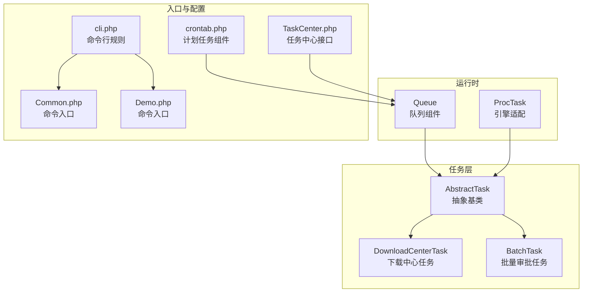
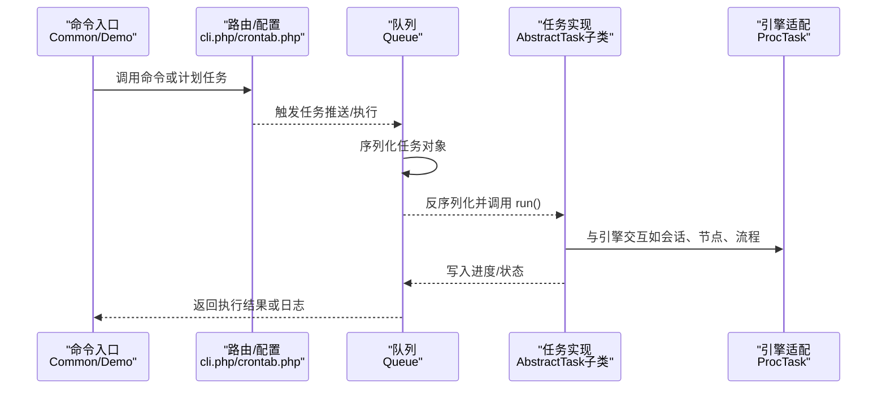
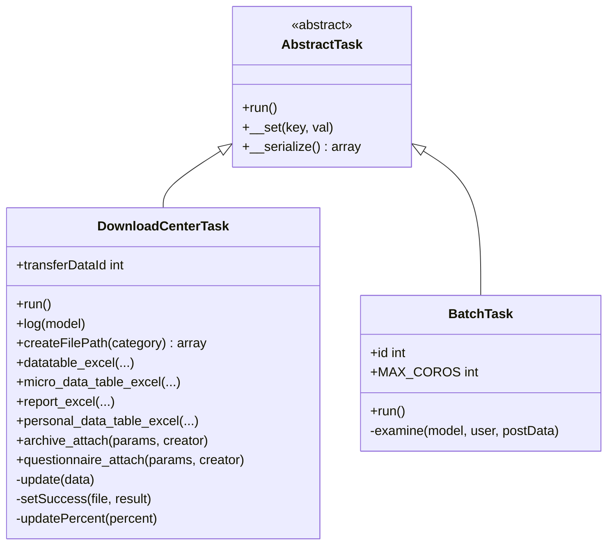
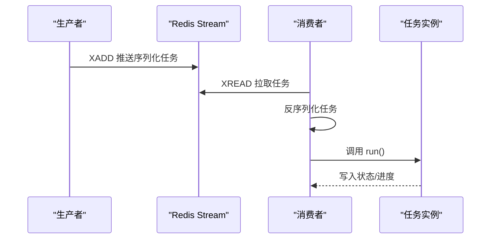
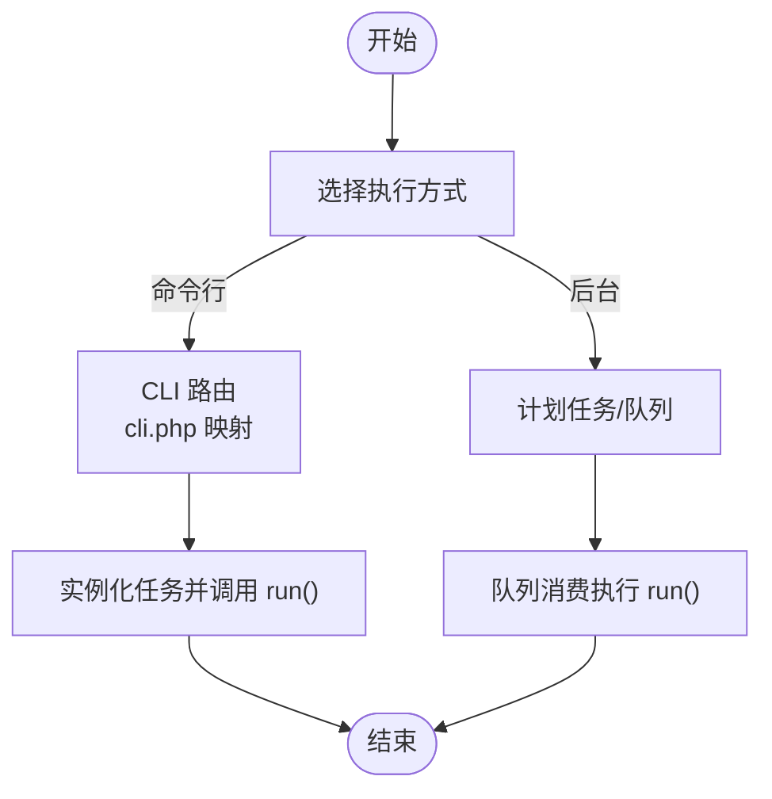
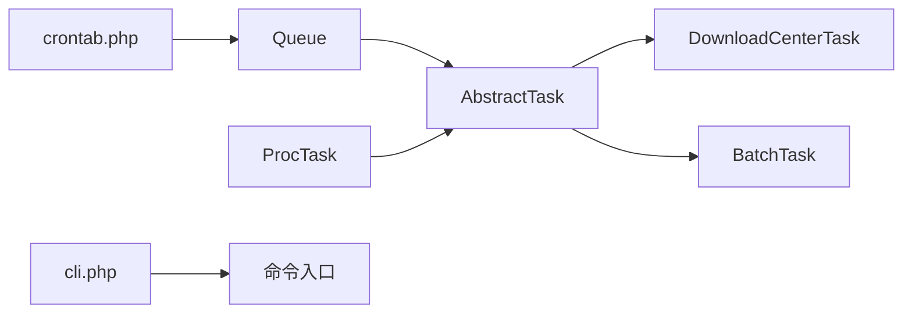

# 任务开发指南

<cite>
**本文引用的文件**
- [AbstractTask.php](file://process/src/services/task/AbstractTask.php)
- [BatchTask.php](file://process/src/services/task/BatchTask.php)
- [DownloadCenterTask.php](file://process/src/services/task/DownloadCenterTask.php)
- [Queue.php](file://process/src/components/Queue.php)
- [ProcTask.php](file://process/src/engine/ProcTask.php)
- [cli.php](file://process/src/config/cli.php)
- [crontab.php](file://process/src/config/crontab.php)
- [Common.php](file://process/src/commands/Common.php)
- [Demo.php](file://process/src/commands/Demo.php)
- [TaskCenter.php](file://process/src/http/system/TaskCenter.php)
</cite>

## 目录
1. [引言](#引言)
2. [项目结构](#项目结构)
3. [核心组件](#核心组件)
4. [架构总览](#架构总览)
5. [详细组件分析](#详细组件分析)
6. [依赖分析](#依赖分析)
7. [性能考虑](#性能考虑)
8. [故障排查指南](#故障排查指南)
9. [结论](#结论)
10. [附录](#附录)

## 引言
本指南面向 htdNew 项目中的任务开发者，系统讲解如何基于 AbstractTask 基类进行自定义任务开发，涵盖 run 方法实现、参数传递机制、任务注册与配置、命令行与后台任务差异、最佳实践、性能优化、错误处理、测试与调试、上线检查清单，以及常见任务类型的开发模板与示例路径。

## 项目结构
任务体系主要分布在以下目录与文件：
- 任务基类与具体任务：process/src/services/task/
- 队列与消费：process/src/components/Queue.php
- 引擎适配：process/src/engine/ProcTask.php
- 命令行路由与组件：process/src/config/cli.php、process/src/config/crontab.php
- 示例命令入口：process/src/commands/Common.php、process/src/commands/Demo.php
- 任务中心管理接口：process/src/http/system/TaskCenter.php

图表来源
- [AbstractTask.php](file://process/src/services/task/AbstractTask.php#L1-L30)
- [DownloadCenterTask.php](file://process/src/services/task/DownloadCenterTask.php#L1-L120)
- [BatchTask.php](file://process/src/services/task/BatchTask.php#L1-L135)
- [Queue.php](file://process/src/components/Queue.php#L1-L52)
- [ProcTask.php](file://process/src/engine/ProcTask.php#L1-L11)
- [cli.php](file://process/src/config/cli.php#L1-L17)
- [crontab.php](file://process/src/config/crontab.php#L1-L10)
- [Common.php](file://process/src/commands/Common.php#L1-L65)
- [Demo.php](file://process/src/commands/Demo.php#L1-L100)
- [TaskCenter.php](file://process/src/http/system/TaskCenter.php#L773-L861)

章节来源
- [AbstractTask.php](file://process/src/services/task/AbstractTask.php#L1-L30)
- [Queue.php](file://process/src/components/Queue.php#L1-L52)
- [cli.php](file://process/src/config/cli.php#L1-L17)
- [crontab.php](file://process/src/config/crontab.php#L1-L10)
- [Common.php](file://process/src/commands/Common.php#L1-L65)
- [Demo.php](file://process/src/commands/Demo.php#L1-L100)
- [TaskCenter.php](file://process/src/http/system/TaskCenter.php#L773-L861)

## 核心组件
- 任务基类 AbstractTask
  - 责任：定义统一的 run 接口，提供序列化支持与无效属性忽略能力，便于队列传输与持久化。
  - 关键点：run 抽象方法必须在子类中实现；__serialize 自动收集公共非静态属性，利于跨进程/队列传递状态。
- 队列组件 Queue
  - 责任：向 Redis Stream 推送任务对象，消费时反序列化并调用 run。
  - 关键点：支持 topic 分级（低/普通/高）；消费者数量通过 YAML 配置并热加载生效。
- 引擎适配 ProcTask
  - 责任：对底层引擎任务进行适配，保证与业务任务模型的一致性。
- 命令行与计划任务
  - 责任：通过 cli.php 将命令映射到控制器或服务；crontab.php 注入组件供计划任务使用。
- 示例命令入口
  - 责任：演示如何实例化任务并调用 run，便于本地验证与集成测试。

章节来源
- [AbstractTask.php](file://process/src/services/task/AbstractTask.php#L1-L30)
- [Queue.php](file://process/src/components/Queue.php#L1-L52)
- [ProcTask.php](file://process/src/engine/ProcTask.php#L1-L11)
- [cli.php](file://process/src/config/cli.php#L1-L17)
- [crontab.php](file://process/src/config/crontab.php#L1-L10)
- [Common.php](file://process/src/commands/Common.php#L1-L65)
- [Demo.php](file://process/src/commands/Demo.php#L1-L100)

## 架构总览
任务从“入口”进入，经“队列/计划任务”调度，最终由“任务基类实现”执行。命令行与后台任务在“触发方式”上不同，但执行路径一致。

图表来源
- [Common.php](file://process/src/commands/Common.php#L1-L65)
- [Demo.php](file://process/src/commands/Demo.php#L1-L100)
- [cli.php](file://process/src/config/cli.php#L1-L17)
- [crontab.php](file://process/src/config/crontab.php#L1-L10)
- [Queue.php](file://process/src/components/Queue.php#L1-L52)
- [AbstractTask.php](file://process/src/services/task/AbstractTask.php#L1-L30)
- [ProcTask.php](file://process/src/engine/ProcTask.php#L1-L11)

## 详细组件分析

### AbstractTask 基类与派生任务
- 继承关系与职责
  - AbstractTask 提供 run 抽象方法，所有任务必须实现该方法。
  - __set 忽略无效属性，防止序列化/反序列化时出现异常。
  - __serialize 自动收集公共非静态属性，确保任务状态可跨进程传递。
- 典型派生任务
  - DownloadCenterTask：根据 transferDataId 执行各类导出/归档任务，包含进度更新、事件分发、权限校验与错误处理。
  - BatchTask：并发批处理审批任务，使用并行执行器与事务控制，分别记录成功/失败/忽略状态。

图表来源
- [AbstractTask.php](file://process/src/services/task/AbstractTask.php#L1-L30)
- [DownloadCenterTask.php](file://process/src/services/task/DownloadCenterTask.php#L1-L120)
- [BatchTask.php](file://process/src/services/task/BatchTask.php#L1-L135)

章节来源
- [AbstractTask.php](file://process/src/services/task/AbstractTask.php#L1-L30)
- [DownloadCenterTask.php](file://process/src/services/task/DownloadCenterTask.php#L1-L120)
- [BatchTask.php](file://process/src/services/task/BatchTask.php#L1-L135)

### 队列与消费流程
- 推送与消费
  - push(topic, task, isTest=false)：将任务对象序列化后推送到 Redis Stream。
  - execute(data)：从 Stream 拉取消息并反序列化，若实例为 AbstractTask，则调用 run。
- 消费者配置
  - setConsumerNum(config)：将消费者数量写入缓存并通过 YAML 热加载生效。
  - getConsumerNum()：读取消费者数量配置。

图表来源
- [Queue.php](file://process/src/components/Queue.php#L1-L52)

章节来源
- [Queue.php](file://process/src/components/Queue.php#L1-L52)

### 命令行任务与后台任务
- 命令行任务
  - 通过 cli.php 的路由规则将命令映射到控制器或服务，适合一次性执行与手动触发。
  - 示例：Common.php、Demo.php 中直接实例化任务并调用 run，便于本地验证。
- 后台任务
  - 通过队列与计划任务组件实现异步/定时执行，适合周期性或高并发场景。
  - 配置：crontab.php 注入组件，Queue 负责消费。

图表来源
- [cli.php](file://process/src/config/cli.php#L1-L17)
- [crontab.php](file://process/src/config/crontab.php#L1-L10)
- [Common.php](file://process/src/commands/Common.php#L1-L65)
- [Demo.php](file://process/src/commands/Demo.php#L1-L100)
- [Queue.php](file://process/src/components/Queue.php#L1-L52)

章节来源
- [cli.php](file://process/src/config/cli.php#L1-L17)
- [crontab.php](file://process/src/config/crontab.php#L1-L10)
- [Common.php](file://process/src/commands/Common.php#L1-L65)
- [Demo.php](file://process/src/commands/Demo.php#L1-L100)
- [Queue.php](file://process/src/components/Queue.php#L1-L52)

### 参数传递机制
- 构造函数注入
  - 通过构造函数接收任务参数（如 DownloadCenterTask 的 transferDataId），并在 run 中使用。
- 属性传递
  - AbstractTask::__serialize 会收集公共非静态属性，确保任务状态随对象一起序列化。
- 事件与上下文
  - 任务执行过程中可通过事件分发器通知外部系统（如任务中心），并携带上下文信息。

章节来源
- [DownloadCenterTask.php](file://process/src/services/task/DownloadCenterTask.php#L1-L120)
- [AbstractTask.php](file://process/src/services/task/AbstractTask.php#L1-L30)

### 错误处理策略
- 任务内部捕获
  - 使用 try/catch 捕获异常，记录日志并更新任务状态（如失败、错误）。
- 事务与回滚
  - 并发批处理任务中，对每个明细使用独立事务，失败时回滚并记录错误原因。
- 任务中心联动
  - 任务中心接口提供失败重试配置与错误查询能力，便于运维定位问题。

章节来源
- [BatchTask.php](file://process/src/services/task/BatchTask.php#L1-L135)
- [TaskCenter.php](file://process/src/http/system/TaskCenter.php#L773-L861)

### 性能优化技巧
- 并发与限流
  - 批量任务使用并行执行器限制最大协程数，平衡吞吐与资源占用。
- 读写分离与事务
  - 在任务开始阶段禁用从库读取，减少一致性问题；对失败明细进行精确回滚。
- 进度与中间态
  - 通过 Redis 记录百分比进度，结合事件分发，提升可观测性与用户体验。

章节来源
- [BatchTask.php](file://process/src/services/task/BatchTask.php#L1-L135)
- [DownloadCenterTask.php](file://process/src/services/task/DownloadCenterTask.php#L1-L120)

### 测试方法与调试工具
- 单元测试与集成测试
  - 建议针对任务 run 的关键分支编写测试用例，覆盖正常路径、异常路径与边界条件。
- 本地验证
  - 使用命令入口（如 Demo.php）快速验证任务逻辑，确认参数传递与执行结果。
- 调试建议
  - 使用日志记录关键步骤与异常堆栈；利用任务中心查看失败详情与重试配置。

章节来源
- [Demo.php](file://process/src/commands/Demo.php#L1-L100)
- [TaskCenter.php](file://process/src/http/system/TaskCenter.php#L773-L861)

### 上线检查清单
- 任务参数校验
  - 确认构造参数与属性满足 run 执行要求。
- 队列与消费者
  - 检查消费者数量配置与热加载是否生效。
- 权限与安全
  - 确保任务执行涉及的权限校验完整，避免越权访问。
- 监控与告警
  - 验证进度上报、事件分发与日志采集是否正常。

章节来源
- [Queue.php](file://process/src/components/Queue.php#L1-L52)
- [DownloadCenterTask.php](file://process/src/services/task/DownloadCenterTask.php#L1-L120)
- [TaskCenter.php](file://process/src/http/system/TaskCenter.php#L773-L861)

## 依赖分析
- 组件耦合
  - 任务实现依赖 AbstractTask 与引擎适配（ProcTask），通过队列解耦生产与消费。
  - 命令行与计划任务通过配置文件与路由规则接入任务执行链路。
- 外部依赖
  - Redis Stream 用于队列存储；YAML 用于消费者数量配置热加载。
- 潜在风险
  - 任务序列化需确保属性可序列化且无敏感信息泄露。
  - 并发批处理需注意锁竞争与事务隔离级别。

图表来源
- [AbstractTask.php](file://process/src/services/task/AbstractTask.php#L1-L30)
- [DownloadCenterTask.php](file://process/src/services/task/DownloadCenterTask.php#L1-L120)
- [BatchTask.php](file://process/src/services/task/BatchTask.php#L1-L135)
- [Queue.php](file://process/src/components/Queue.php#L1-L52)
- [ProcTask.php](file://process/src/engine/ProcTask.php#L1-L11)
- [cli.php](file://process/src/config/cli.php#L1-L17)
- [crontab.php](file://process/src/config/crontab.php#L1-L10)

章节来源
- [AbstractTask.php](file://process/src/services/task/AbstractTask.php#L1-L30)
- [Queue.php](file://process/src/components/Queue.php#L1-L52)
- [cli.php](file://process/src/config/cli.php#L1-L17)
- [crontab.php](file://process/src/config/crontab.php#L1-L10)

## 性能考虑
- 并发控制：合理设置最大协程数，避免 CPU/IO 抢占。
- 事务粒度：按明细拆分事务，失败最小化影响面。
- 缓存与进度：使用 Redis 记录进度，降低重复计算成本。
- I/O 优化：批量导出/归档时注意内存与磁盘 I/O，必要时启用临时文件与分块处理。

## 故障排查指南
- 查看任务中心失败详情
  - 使用任务中心接口查询失败日志与重试配置，定位异常原因。
- 检查队列消费者
  - 确认消费者数量配置与热加载状态，核对 Redis Stream 是否积压。
- 日志与异常
  - 关注任务 run 中的日志记录与异常捕获，结合堆栈信息快速定位。

章节来源
- [TaskCenter.php](file://process/src/http/system/TaskCenter.php#L773-L861)
- [Queue.php](file://process/src/components/Queue.php#L1-L52)

## 结论
通过 AbstractTask 基类与队列/计划任务机制，htdNew 实现了统一、可扩展的任务执行框架。开发者应遵循参数传递、错误处理与性能优化规范，结合命令行与后台任务的不同特性，构建稳定高效的自动化流程。

## 附录

### 开发模板与示例路径
- 自定义任务模板
  - 继承 AbstractTask，实现 run 方法；在构造函数中接收参数；必要时重写 __set/__serialize。
  - 示例路径参考：[AbstractTask.php](file://process/src/services/task/AbstractTask.php#L1-L30)
- 下载中心任务示例
  - 依据 transferDataId 执行导出/归档，包含进度更新与事件分发。
  - 示例路径参考：[DownloadCenterTask.php](file://process/src/services/task/DownloadCenterTask.php#L1-L120)
- 批量任务示例
  - 使用并行执行器与事务控制，分别记录成功/失败/忽略状态。
  - 示例路径参考：[BatchTask.php](file://process/src/services/task/BatchTask.php#L1-L135)
- 命令行入口示例
  - 直接实例化任务并调用 run，便于本地验证。
  - 示例路径参考：[Common.php](file://process/src/commands/Common.php#L1-L65)、[Demo.php](file://process/src/commands/Demo.php#L1-L100)
- 队列消费示例
  - 从 Stream 拉取任务并反序列化执行。
  - 示例路径参考：[Queue.php](file://process/src/components/Queue.php#L1-L52)