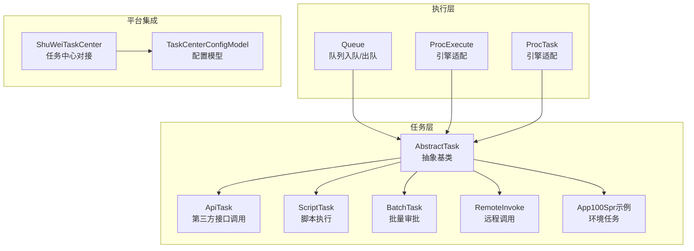
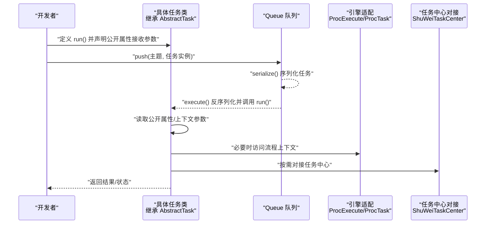
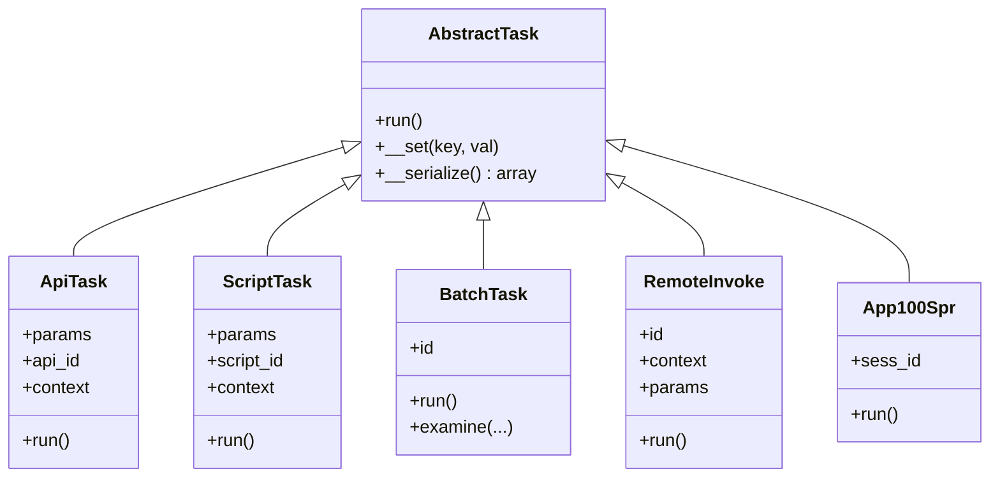
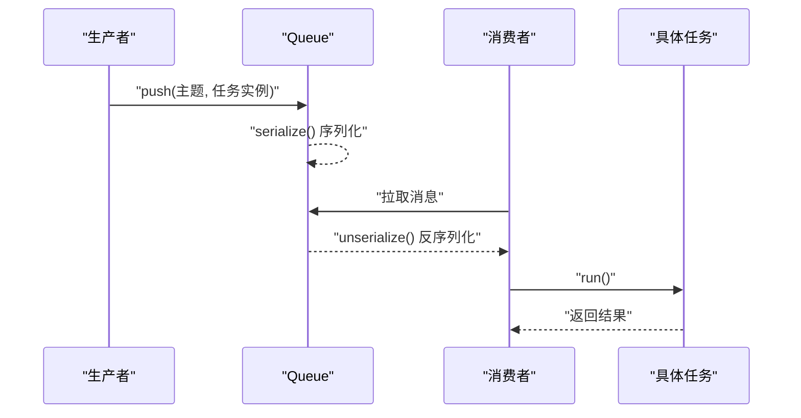
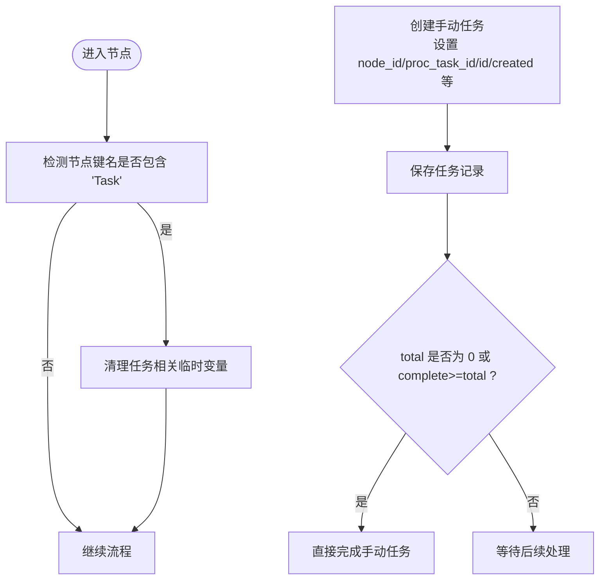
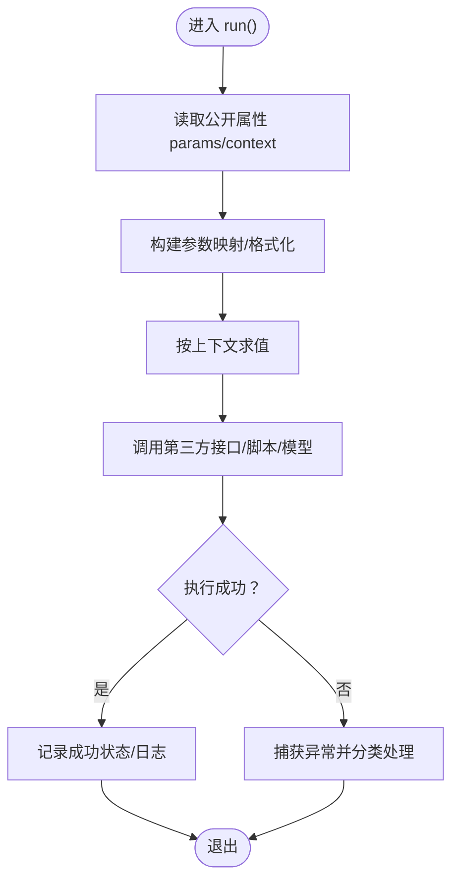
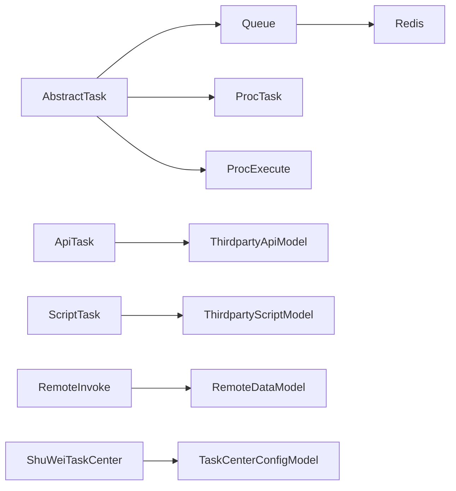

# 任务开发流程

<cite>
**本文引用的文件**
- [AbstractTask.php](file://process/src/services/task/AbstractTask.php)
- [Queue.php](file://process/src/components/Queue.php)
- [ProcTask.php](file://process/src/engine/ProcTask.php)
- [ProcExecute.php](file://process/src/engine/ProcExecute.php)
- [App100Spr.php（环境示例）](file://process_envs/demo/product/task/App100Spr.php)
- [ApiTask.php](file://process/src/services/task/ApiTask.php)
- [ScriptTask.php](file://process/src/services/task/ScriptTask.php)
- [BatchTask.php](file://process/src/services/task/BatchTask.php)
- [RemoteInvoke.php](file://process/src/services/task/RemoteInvoke.php)
- [EngineEventHandler.php](file://process/src/modules/process/EngineEventHandler.php)
- [TaskCenterConfigModel.php](file://process/src/models/TaskCenterConfigModel.php)
- [ShuWeiTaskCenter.php](file://process/src/services/platform/ShuWeiTaskCenter.php)
- [AbstractTaskModel.php](file://process/src/models/AbstractTaskModel.php)
</cite>

## 目录
1. [引言](#引言)
2. [项目结构](#项目结构)
3. [核心组件](#核心组件)
4. [架构总览](#架构总览)
5. [详细组件分析](#详细组件分析)
6. [依赖关系分析](#依赖关系分析)
7. [性能考虑](#性能考虑)
8. [故障排查指南](#故障排查指南)
9. [结论](#结论)
10. [附录](#附录)

## 引言
本文件面向 htdNew 项目中的“任务”开发场景，系统性阐述如何从零创建一个任务类，继承 AbstractTask 基类并实现 run() 方法，说明任务参数的接收与处理机制（构造函数参数传递与属性注入），以及完整的开发步骤：创建文件、编写代码、注册任务、配置参数、测试验证。文档同时给出基于仓库现有实现的参考路径与最佳实践建议，帮助开发者快速上手。

## 项目结构
任务体系主要由以下层次构成：
- 任务基类与具体任务实现：位于 process/src/services/task 下，提供统一的 run() 接口与序列化支持。
- 队列与执行：位于 process/src/components/Queue.php，负责任务入队、出队与反序列化执行。
- 引擎适配层：process/src/engine 下的 ProcTask、ProcExecute 作为引擎适配类存在，保证序列化对象的兼容性。
- 环境示例：process_envs/*/product/task 下提供不同业务场景的任务示例。
- 平台对接与配置：与任务中心对接的服务与配置模型位于 process/src/services/platform 与 process/src/models。

图表来源
- [AbstractTask.php](file://process/src/services/task/AbstractTask.php#L1-L30)
- [Queue.php](file://process/src/components/Queue.php#L1-L52)
- [ProcExecute.php](file://process/src/engine/ProcExecute.php#L1-L11)
- [ProcTask.php](file://process/src/engine/ProcTask.php#L1-L11)
- [ApiTask.php](file://process/src/services/task/ApiTask.php#L1-L23)
- [ScriptTask.php](file://process/src/services/task/ScriptTask.php#L1-L23)
- [BatchTask.php](file://process/src/services/task/BatchTask.php#L1-L135)
- [RemoteInvoke.php](file://process/src/services/task/RemoteInvoke.php#L1-L19)
- [App100Spr.php（环境示例）](file://process_envs/demo/product/task/App100Spr.php#L1-L20)
- [ShuWeiTaskCenter.php](file://process/src/services/platform/ShuWeiTaskCenter.php#L762-L802)
- [TaskCenterConfigModel.php](file://process/src/models/TaskCenterConfigModel.php#L1-L62)

章节来源
- [AbstractTask.php](file://process/src/services/task/AbstractTask.php#L1-L30)
- [Queue.php](file://process/src/components/Queue.php#L1-L52)
- [ProcExecute.php](file://process/src/engine/ProcExecute.php#L1-L11)
- [ProcTask.php](file://process/src/engine/ProcTask.php#L1-L11)

## 核心组件
- 抽象任务基类 AbstractTask
  - 提供统一的 run() 接口，所有具体任务必须实现该方法。
  - 提供 __set() 的空实现以忽略无效参数，避免误传导致异常。
  - 提供 __serialize() 实现，仅序列化公共实例属性，确保队列持久化与反序列化安全。
  - 参考路径：[AbstractTask.php](file://process/src/services/task/AbstractTask.php#L1-L30)

- 队列组件 Queue
  - push(topic, AbstractTask, isTest)：将任务对象序列化后推送到指定主题。
  - execute(data)：从消息中反序列化任务对象并调用其 run() 执行。
  - setConsumerNum(config)/getConsumerNum()：管理消费者数量与动态重载。
  - 参考路径：[Queue.php](file://process/src/components/Queue.php#L1-L52)

- 引擎适配类
  - ProcExecute/ProcTask：对底层引擎类进行轻量封装，确保序列化对象在 app_session 等表中稳定存储。
  - 参考路径：[ProcExecute.php](file://process/src/engine/ProcExecute.php#L1-L11)、[ProcTask.php](file://process/src/engine/ProcTask.php#L1-L11)

- 任务示例与实现模式
  - 示例任务 App100Spr：展示如何通过公开属性接收上下文并在 run() 中读取。
    - 参考路径：[App100Spr.php（环境示例）](file://process_envs/demo/product/task/App100Spr.php#L1-L20)
  - 第三方接口任务 ApiTask：演示参数格式化与上下文求值。
    - 参考路径：[ApiTask.php](file://process/src/services/task/ApiTask.php#L1-L23)
  - 脚本任务 ScriptTask：演示参数键值映射与上下文求值。
    - 参考路径：[ScriptTask.php](file://process/src/services/task/ScriptTask.php#L1-L23)
  - 批量任务 BatchTask：展示复杂业务流程、事务控制与错误分类处理。
    - 参考路径：[BatchTask.php](file://process/src/services/task/BatchTask.php#L1-L135)
  - 远程调用任务 RemoteInvoke：演示通过 ID 与上下文参数驱动远程数据模型执行。
    - 参考路径：[RemoteInvoke.php](file://process/src/services/task/RemoteInvoke.php#L1-L19)

章节来源
- [AbstractTask.php](file://process/src/services/task/AbstractTask.php#L1-L30)
- [Queue.php](file://process/src/components/Queue.php#L1-L52)
- [ProcExecute.php](file://process/src/engine/ProcExecute.php#L1-L11)
- [ProcTask.php](file://process/src/engine/ProcTask.php#L1-L11)
- [App100Spr.php（环境示例）](file://process_envs/demo/product/task/App100Spr.php#L1-L20)
- [ApiTask.php](file://process/src/services/task/ApiTask.php#L1-L23)
- [ScriptTask.php](file://process/src/services/task/ScriptTask.php#L1-L23)
- [BatchTask.php](file://process/src/services/task/BatchTask.php#L1-L135)
- [RemoteInvoke.php](file://process/src/services/task/RemoteInvoke.php#L1-L19)

## 架构总览
下图展示了任务从创建到执行的关键路径，包括参数注入、队列入队、反序列化执行与平台对接。

图表来源
- [AbstractTask.php](file://process/src/services/task/AbstractTask.php#L1-L30)
- [Queue.php](file://process/src/components/Queue.php#L1-L52)
- [ProcExecute.php](file://process/src/engine/ProcExecute.php#L1-L11)
- [ProcTask.php](file://process/src/engine/ProcTask.php#L1-L11)
- [ShuWeiTaskCenter.php](file://process/src/services/platform/ShuWeiTaskCenter.php#L762-L802)

## 详细组件分析

### 抽象任务基类与参数接收机制
- 继承关系
  - 所有任务类应直接继承 AbstractTask，并实现 run()。
  - 参考路径：[AbstractTask.php](file://process/src/services/task/AbstractTask.php#L1-L30)

- 参数接收与属性注入
  - 通过在任务类中声明公开实例属性来接收参数（如 sess_id、api_id、params 等）。
  - AbstractTask::__set() 默认忽略未知属性，避免误传引发问题。
  - AbstractTask::__serialize() 仅序列化公共实例属性，确保队列传输安全。
  - 参考路径：[AbstractTask.php](file://process/src/services/task/AbstractTask.php#L1-L30)

- 典型实现模式
  - 示例任务 App100Spr：通过公开属性接收 sess_id，在 run() 中获取会话并返回用户 UID 列表。
    - 参考路径：[App100Spr.php（环境示例）](file://process_envs/demo/product/task/App100Spr.php#L1-L20)
  - 第三方接口任务 ApiTask：通过 params 与 context 在 run() 中对参数进行格式化与求值后调用第三方接口。
    - 参考路径：[ApiTask.php](file://process/src/services/task/ApiTask.php#L1-L23)
  - 脚本任务 ScriptTask：通过 params 键值映射与上下文求值，驱动脚本模型执行。
    - 参考路径：[ScriptTask.php](file://process/src/services/task/ScriptTask.php#L1-L23)
  - 批量任务 BatchTask：通过 id 定位批次任务，内部并行处理明细，结合事务与错误分类。
    - 参考路径：[BatchTask.php](file://process/src/services/task/BatchTask.php#L1-L135)
  - 远程调用任务 RemoteInvoke：通过 id、context、params 驱动远程数据模型执行。
    - 参考路径：[RemoteInvoke.php](file://process/src/services/task/RemoteInvoke.php#L1-L19)

图表来源
- [AbstractTask.php](file://process/src/services/task/AbstractTask.php#L1-L30)
- [ApiTask.php](file://process/src/services/task/ApiTask.php#L1-L23)
- [ScriptTask.php](file://process/src/services/task/ScriptTask.php#L1-L23)
- [BatchTask.php](file://process/src/services/task/BatchTask.php#L1-L135)
- [RemoteInvoke.php](file://process/src/services/task/RemoteInvoke.php#L1-L19)
- [App100Spr.php（环境示例）](file://process_envs/demo/product/task/App100Spr.php#L1-L20)

章节来源
- [AbstractTask.php](file://process/src/services/task/AbstractTask.php#L1-L30)
- [ApiTask.php](file://process/src/services/task/ApiTask.php#L1-L23)
- [ScriptTask.php](file://process/src/services/task/ScriptTask.php#L1-L23)
- [BatchTask.php](file://process/src/services/task/BatchTask.php#L1-L135)
- [RemoteInvoke.php](file://process/src/services/task/RemoteInvoke.php#L1-L19)
- [App100Spr.php（环境示例）](file://process_envs/demo/product/task/App100Spr.php#L1-L20)

### 队列入队与执行流程
- 入队
  - 调用 Queue::push(topic, task, isTest)，将任务实例序列化后推送到指定主题。
  - 参考路径：[Queue.php](file://process/src/components/Queue.php#L1-L52)

- 出队与执行
  - 消费端从队列拉取消息，调用 Queue::execute(data)，反序列化后执行 run()。
  - 参考路径：[Queue.php](file://process/src/components/Queue.php#L1-L52)

图表来源
- [Queue.php](file://process/src/components/Queue.php#L1-L52)

章节来源
- [Queue.php](file://process/src/components/Queue.php#L1-L52)

### 引擎事件与手动任务创建
- 引擎事件处理器在进入含“Task”关键字的节点时，会清理相关任务变量，确保任务执行前的上下文干净。
- 当创建手动任务时，会设置任务的 node_id、proc_task_id、id、created 等字段，并在必要时直接完成手动任务。
- 参考路径：
  - [EngineEventHandler.php](file://process/src/modules/process/EngineEventHandler.php#L275-L302)

图表来源
- [EngineEventHandler.php](file://process/src/modules/process/EngineEventHandler.php#L275-L302)

章节来源
- [EngineEventHandler.php](file://process/src/modules/process/EngineEventHandler.php#L275-L302)

### 任务中心对接与配置
- 任务中心对接服务会根据会话与任务数据生成推送请求，包含处理人、发起人、节点信息、流水号与任务 ID 等关键字段。
- 任务中心配置模型提供重试次数与重试间隔等参数的读取与更新能力。
- 参考路径：
  - [ShuWeiTaskCenter.php](file://process/src/services/platform/ShuWeiTaskCenter.php#L762-L802)
  - [TaskCenterConfigModel.php](file://process/src/models/TaskCenterConfigModel.php#L1-L62)

章节来源
- [ShuWeiTaskCenter.php](file://process/src/services/platform/ShuWeiTaskCenter.php#L762-L802)
- [TaskCenterConfigModel.php](file://process/src/models/TaskCenterConfigModel.php#L1-L62)

### 任务参数处理算法流程
以下流程图总结了典型任务在 run() 中对参数的处理思路（以 ApiTask 为例）：

图表来源
- [ApiTask.php](file://process/src/services/task/ApiTask.php#L1-L23)
- [ScriptTask.php](file://process/src/services/scriptTask.php#L1-L23)

章节来源
- [ApiTask.php](file://process/src/services/task/ApiTask.php#L1-L23)
- [ScriptTask.php](file://process/src/services/task/ScriptTask.php#L1-L23)

## 依赖关系分析
- 组件耦合
  - 具体任务类依赖 AbstractTask 的统一接口与序列化机制。
  - Queue 依赖 AbstractTask 的序列化契约，确保跨进程/协程安全。
  - 引擎适配类与任务类解耦，通过上下文与会话模型间接交互。
  - 任务中心对接服务与任务配置模型独立于任务实现，通过数据结构进行协作。

- 外部依赖
  - Redis：队列消息存储与消费者配置缓存。
  - 数据库：任务历史、批次任务明细、任务中心配置等。
  - 第三方接口/脚本模型：ApiTask/ScriptTask/RemoteInvoke 依赖对应模型的缓存与执行能力。

图表来源
- [AbstractTask.php](file://process/src/services/task/AbstractTask.php#L1-L30)
- [Queue.php](file://process/src/components/Queue.php#L1-L52)
- [ProcTask.php](file://process/src/engine/ProcTask.php#L1-L11)
- [ProcExecute.php](file://process/src/engine/ProcExecute.php#L1-L11)
- [ApiTask.php](file://process/src/services/task/ApiTask.php#L1-L23)
- [ScriptTask.php](file://process/src/services/task/ScriptTask.php#L1-L23)
- [RemoteInvoke.php](file://process/src/services/task/RemoteInvoke.php#L1-L19)
- [ShuWeiTaskCenter.php](file://process/src/services/platform/ShuWeiTaskCenter.php#L762-L802)
- [TaskCenterConfigModel.php](file://process/src/models/TaskCenterConfigModel.php#L1-L62)

章节来源
- [AbstractTask.php](file://process/src/services/task/AbstractTask.php#L1-L30)
- [Queue.php](file://process/src/components/Queue.php#L1-L52)
- [ProcTask.php](file://process/src/engine/ProcTask.php#L1-L11)
- [ProcExecute.php](file://process/src/engine/ProcExecute.php#L1-L11)
- [ApiTask.php](file://process/src/services/task/ApiTask.php#L1-L23)
- [ScriptTask.php](file://process/src/services/task/ScriptTask.php#L1-L23)
- [RemoteInvoke.php](file://process/src/services/task/RemoteInvoke.php#L1-L19)
- [ShuWeiTaskCenter.php](file://process/src/services/platform/ShuWeiTaskCenter.php#L762-L802)
- [TaskCenterConfigModel.php](file://process/src/models/TaskCenterConfigModel.php#L1-L62)

## 性能考虑
- 并发与批处理
  - 批量任务采用并发协程处理明细，合理设置最大并发数以平衡吞吐与资源占用。
  - 参考路径：[BatchTask.php](file://process/src/services/task/BatchTask.php#L1-L135)

- 序列化开销
  - 仅序列化公共实例属性，避免携带冗余状态，降低队列消息体积。
  - 参考路径：[AbstractTask.php](file://process/src/services/task/AbstractTask.php#L1-L30)

- 事务与回滚
  - 对每个明细使用独立事务，失败时回滚并统计失败计数，成功时提交并更新汇总。
  - 参考路径：[BatchTask.php](file://process/src/services/task/BatchTask.php#L1-L135)

- 上下文求值
  - 参数求值应在 run() 内按需进行，避免重复计算；必要时缓存中间结果。
  - 参考路径：[ApiTask.php](file://process/src/services/task/ApiTask.php#L1-L23)、[ScriptTask.php](file://process/src/services/task/ScriptTask.php#L1-L23)

## 故障排查指南
- 任务未执行或执行异常
  - 检查队列主题与消费者配置是否正确，确认消息已入队且被消费。
  - 参考路径：[Queue.php](file://process/src/components/Queue.php#L1-L52)

- 反序列化失败或属性缺失
  - 确保任务类公开属性完整，且 __serialize() 不包含不应序列化的状态。
  - 参考路径：[AbstractTask.php](file://process/src/services/task/AbstractTask.php#L1-L30)

- 手动任务状态异常
  - 核查引擎事件处理器在进入含“Task”的节点时是否清理了任务变量，以及手动任务创建时字段是否正确设置。
  - 参考路径：[EngineEventHandler.php](file://process/src/modules/process/EngineEventHandler.php#L275-L302)

- 任务中心对接失败
  - 检查任务中心配置模型中的重试次数与重试间隔，核对推送请求字段是否完整。
  - 参考路径：[TaskCenterConfigModel.php](file://process/src/models/TaskCenterConfigModel.php#L1-L62)、[ShuWeiTaskCenter.php](file://process/src/services/platform/ShuWeiTaskCenter.php#L762-L802)

章节来源
- [Queue.php](file://process/src/components/Queue.php#L1-L52)
- [AbstractTask.php](file://process/src/services/task/AbstractTask.php#L1-L30)
- [EngineEventHandler.php](file://process/src/modules/process/EngineEventHandler.php#L275-L302)
- [TaskCenterConfigModel.php](file://process/src/models/TaskCenterConfigModel.php#L1-L62)
- [ShuWeiTaskCenter.php](file://process/src/services/platform/ShuWeiTaskCenter.php#L762-L802)

## 结论
通过继承 AbstractTask 并实现 run()，开发者可以快速构建可序列化、可队列化的任务类。配合队列组件的入队/出队机制、引擎适配层的兼容性保障以及任务中心对接能力，任务可以在分布式环境中稳定运行。建议遵循“公开属性接收参数、按需格式化与求值、最小化序列化状态、合理处理异常与事务”的最佳实践，以获得更高的可靠性与可维护性。

## 附录

### 开发步骤清单（从创建到测试）
- 创建任务文件
  - 在合适目录创建任务类文件，命名遵循业务语义，如 App100Spr.php。
  - 参考路径：[App100Spr.php（环境示例）](file://process_envs/demo/product/task/App100Spr.php#L1-L20)

- 编写任务代码
  - 继承 AbstractTask，实现 run()。
  - 声明必要的公开属性用于接收参数（如 sess_id、api_id、params、context 等）。
  - 参考路径：
    - [AbstractTask.php](file://process/src/services/task/AbstractTask.php#L1-L30)
    - [ApiTask.php](file://process/src/services/task/ApiTask.php#L1-L23)
    - [ScriptTask.php](file://process/src/services/task/ScriptTask.php#L1-L23)
    - [BatchTask.php](file://process/src/services/task/BatchTask.php#L1-L135)
    - [RemoteInvoke.php](file://process/src/services/task/RemoteInvoke.php#L1-L19)

- 注册与配置
  - 将任务类纳入队列消费范围，确保消费者能识别并执行该任务。
  - 如需对接任务中心，配置 TaskCenterConfigModel 中的重试策略。
  - 参考路径：
    - [Queue.php](file://process/src/components/Queue.php#L1-L52)
    - [TaskCenterConfigModel.php](file://process/src/models/TaskCenterConfigModel.php#L1-L62)

- 测试验证
  - 构造任务实例，填充公开属性，调用 push() 入队，观察执行日志与结果。
  - 对批量任务，验证并发与事务处理、失败回滚与计数更新。
  - 参考路径：
    - [Queue.php](file://process/src/components/Queue.php#L1-L52)
    - [BatchTask.php](file://process/src/services/task/BatchTask.php#L1-L135)