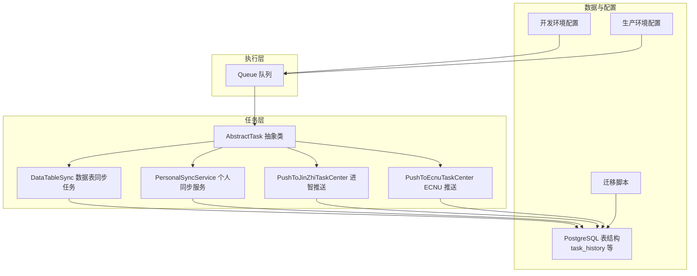
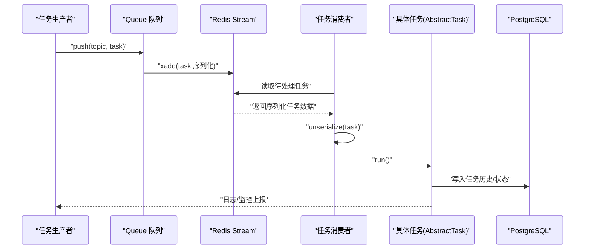
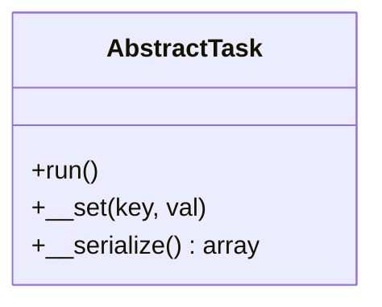
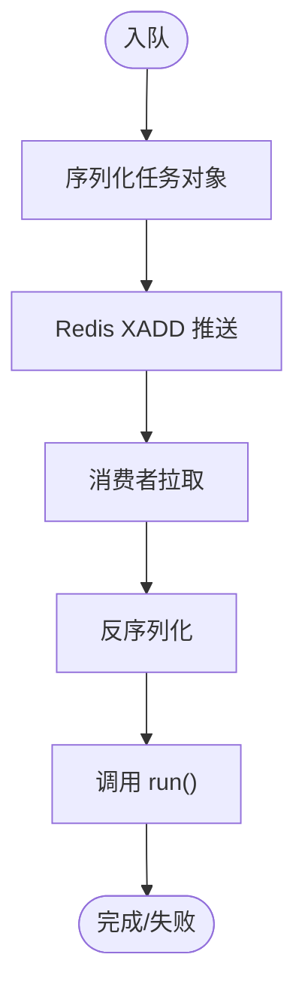
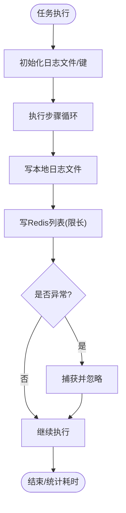
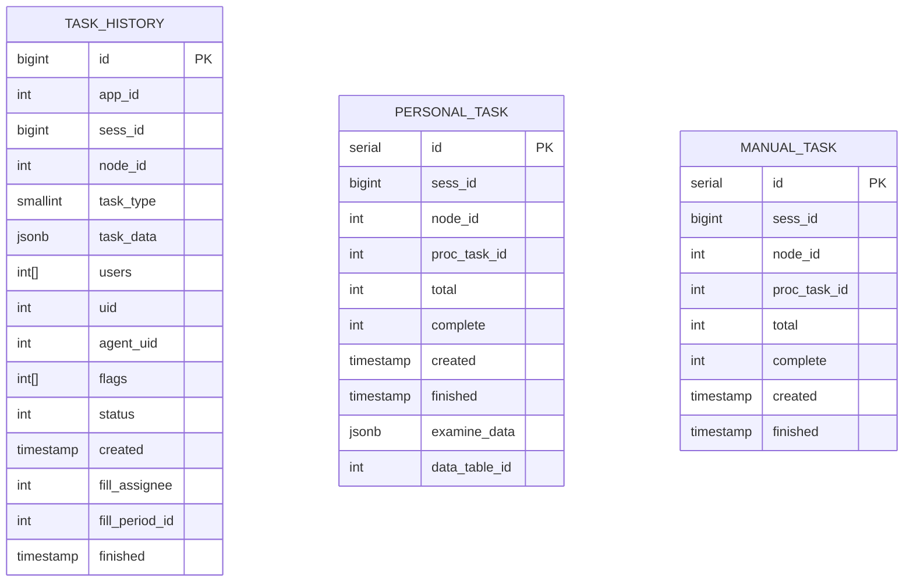
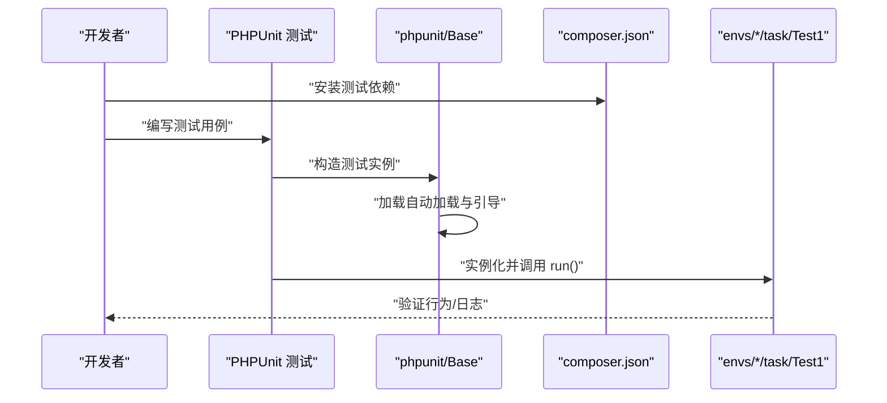
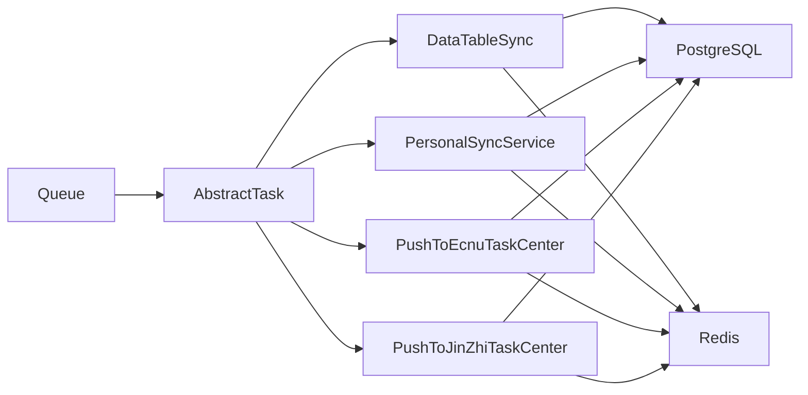

# 任务测试与调试

<cite>
**本文引用的文件**
- [composer.json](file://process/composer.json)
- [Base.php](file://process/src/phpunit/Base.php)
- [AbstractTask.php](file://process/src/services/task/AbstractTask.php)
- [Queue.php](file://process/src/components/Queue.php)
- [PushToJinZhiTaskCenter.php](file://process/src/services/task/PushToJinZhiTaskCenter.php)
- [PushToEcnuTaskCenter.php](file://process/src/services/task/PushToEcnuTaskCenter.php)
- [DataTableSync.php](file://process/src/services/task/DataTableSync.php)
- [PersonalSyncService.php](file://process/src/services/desktopManage/PersonalSyncService.php)
- [database.sql](file://process/docs/sql/database.sql)
- [migration_20250730_102435_personal_v2.php](file://process/src/migrations/migration_20250730_102435_personal_v2.php)
- [dev.env](file://process/docker/dev.env)
- [prod.env](file://process/docker/prod.env)
- [Test1.php](file://process_envs/gdut/product/task/Test1.php)
</cite>

## 目录
1. [简介](#简介)
2. [项目结构](#项目结构)
3. [核心组件](#核心组件)
4. [架构总览](#架构总览)
5. [详细组件分析](#详细组件分析)
6. [依赖关系分析](#依赖关系分析)
7. [性能考虑](#性能考虑)
8. [故障排查指南](#故障排查指南)
9. [结论](#结论)
10. [附录](#附录)

## 简介
本文件面向 htdNew 项目的任务体系，提供系统化的“任务测试与调试”指导，覆盖以下方面：
- 任务单元测试的编写方法：模拟环境搭建、测试用例设计、断言策略
- 任务调试技巧：日志记录、断点调试、性能分析
- 任务执行监控与状态跟踪：基于数据库与缓存的观测手段
- 常见问题诊断与解决方案：内存泄漏、超时处理、并发冲突
- 测试工具使用与自动化测试流程：PHPUnit 集成与 Docker 环境
- 上线前质量检查清单与性能基准测试方法

## 项目结构
任务相关代码主要分布在以下区域：
- 任务抽象与实现：src/services/task
- 队列与执行：src/components/Queue.php
- 日志与监控：各 Task 类中的日志与 Redis 缓存
- 数据模型与迁移：docs/sql 与 src/migrations
- 测试框架与入口：src/phpunit/Base.php、composer.json 中的测试依赖
- 开发与生产环境配置：docker/dev.env、docker/prod.env
- 示例任务：process_envs/*/product/task/*.php

**图表来源**
- [AbstractTask.php](file://process/src/services/task/AbstractTask.php#L1-L30)
- [Queue.php](file://process/src/components/Queue.php#L1-L52)
- [DataTableSync.php](file://process/src/services/task/DataTableSync.php#L510-L547)
- [PersonalSyncService.php](file://process/src/services/desktopManage/PersonalSyncService.php#L506-L539)
- [PushToJinZhiTaskCenter.php](file://process/src/services/task/PushToJinZhiTaskCenter.php#L46-L87)
- [PushToEcnuTaskCenter.php](file://process/src/services/task/PushToEcnuTaskCenter.php#L48-L91)
- [database.sql](file://process/docs/sql/database.sql#L335-L368)
- [migration_20250730_102435_personal_v2.php](file://process/src/migrations/migration_20250730_102435_personal_v2.php#L123-L148)
- [dev.env](file://process/docker/dev.env#L1-L50)
- [prod.env](file://process/docker/prod.env#L1-L46)

**章节来源**
- [composer.json](file://process/composer.json#L1-L70)
- [dev.env](file://process/docker/dev.env#L1-L50)
- [prod.env](file://process/docker/prod.env#L1-L46)

## 核心组件
- 任务抽象与序列化
  - 任务统一继承自抽象基类，定义 run() 执行入口，并通过魔术方法与序列化机制保证可持久化与传输。
- 队列与消费者
  - 队列负责将任务对象序列化后推送到 Redis Stream，消费者从队列拉取并反序列化执行。
- 任务日志与监控
  - 多个任务实现中包含日志输出与 Redis 缓存写入，便于运行时观测与回溯。
- 数据模型与迁移
  - 提供任务历史、个人任务、手动任务等表结构与索引，支撑任务状态持久化与查询。

**章节来源**
- [AbstractTask.php](file://process/src/services/task/AbstractTask.php#L1-L30)
- [Queue.php](file://process/src/components/Queue.php#L1-L52)
- [DataTableSync.php](file://process/src/services/task/DataTableSync.php#L510-L547)
- [PersonalSyncService.php](file://process/src/services/desktopManage/PersonalSyncService.php#L506-L539)
- [database.sql](file://process/docs/sql/database.sql#L335-L368)
- [migration_20250730_102435_personal_v2.php](file://process/src/migrations/migration_20250730_102435_personal_v2.php#L123-L148)

## 架构总览
任务从“产生—入队—消费—落库—观测”的完整链路如下：

**图表来源**
- [Queue.php](file://process/src/components/Queue.php#L1-L52)
- [AbstractTask.php](file://process/src/services/task/AbstractTask.php#L1-L30)
- [database.sql](file://process/docs/sql/database.sql#L335-L368)

## 详细组件分析

### 组件一：任务抽象与序列化（AbstractTask）
- 设计要点
  - 统一 run() 入口，便于队列调度与测试调用
  - 自定义序列化逻辑，仅序列化非静态公共属性，减少冗余与循环引用风险
- 测试关注点
  - run() 的幂等性与边界条件
  - 属性序列化是否完整且可反序列化
- 调试建议
  - 在 run() 内部加入细粒度日志，定位执行阶段
  - 使用断点观察属性状态变化

**图表来源**
- [AbstractTask.php](file://process/src/services/task/AbstractTask.php#L1-L30)

**章节来源**
- [AbstractTask.php](file://process/src/services/task/AbstractTask.php#L1-L30)

### 组件二：队列与执行（Queue）
- 设计要点
  - 支持多主题（高/中/低优先级）入队
  - 执行时反序列化并调用任务 run()
  - 消费者数量可通过缓存配置热更新
- 测试关注点
  - 入队/出队的原子性与一致性
  - 反序列化失败的兜底处理
  - 多消费者并发下的重复消费控制
- 调试建议
  - 观察 Redis Stream 长度与消费者组进度
  - 在 execute() 前后打点，统计耗时

**图表来源**
- [Queue.php](file://process/src/components/Queue.php#L1-L52)

**章节来源**
- [Queue.php](file://process/src/components/Queue.php#L1-L52)

### 组件三：任务日志与监控（DataTableSync、PersonalSyncService、PushToEcnuTaskCenter、PushToJinZhiTaskCenter）
- 设计要点
  - 统一日志格式，包含任务标识与上下文
  - 将关键日志写入本地文件与 Redis 列表，支持实时查看
  - 对异常进行 try/catch 并“吞掉”，避免阻断主流程
- 测试关注点
  - 日志文件路径与权限
  - Redis 键命名与长度限制（仅保留最近若干条）
  - 异常分支的覆盖
- 调试建议
  - 通过 Redis 列表快速定位最近错误
  - 结合本地日志文件进行回放

**图表来源**
- [DataTableSync.php](file://process/src/services/task/DataTableSync.php#L510-L547)
- [PersonalSyncService.php](file://process/src/services/desktopManage/PersonalSyncService.php#L506-L539)
- [PushToEcnuTaskCenter.php](file://process/src/services/task/PushToEcnuTaskCenter.php#L48-L91)
- [PushToJinZhiTaskCenter.php](file://process/src/services/task/PushToJinZhiTaskCenter.php#L46-L87)

**章节来源**
- [DataTableSync.php](file://process/src/services/task/DataTableSync.php#L510-L547)
- [PersonalSyncService.php](file://process/src/services/desktopManage/PersonalSyncService.php#L506-L539)
- [PushToEcnuTaskCenter.php](file://process/src/services/task/PushToEcnuTaskCenter.php#L48-L91)
- [PushToJinZhiTaskCenter.php](file://process/src/services/task/PushToJinZhiTaskCenter.php#L46-L87)

### 组件四：数据模型与迁移（task_history、personal_task、manual_task）
- 设计要点
  - 任务历史表记录任务全生命周期
  - 个人任务与手动任务表支持不同维度的统计与查询
  - 迁移脚本包含索引优化，提升查询效率
- 测试关注点
  - 插入/更新语义正确性
  - 索引命中情况与慢查询定位
- 调试建议
  - 通过任务 ID 查询历史表核对状态流转
  - 使用 EXPLAIN 分析复杂查询

**图表来源**
- [database.sql](file://process/docs/sql/database.sql#L335-L368)
- [migration_20250730_102435_personal_v2.php](file://process/src/migrations/migration_20250730_102435_personal_v2.php#L123-L148)

**章节来源**
- [database.sql](file://process/docs/sql/database.sql#L335-L368)
- [migration_20250730_102435_personal_v2.php](file://process/src/migrations/migration_20250730_102435_personal_v2.php#L123-L148)

### 组件五：示例任务与测试基座（Test1.php、Base.php、composer.json）
- 设计要点
  - 示例任务继承 AbstractTask，最小化实现 run() 以验证执行链路
  - 测试基类加载自动加载与测试引导，确保测试环境可用
  - composer.json 声明 PHPUnit 作为开发依赖
- 测试关注点
  - 示例任务能否被队列正确消费
  - 测试基类是否能正确初始化运行时
- 调试建议
  - 使用示例任务快速验证队列与消费者连通性

**图表来源**
- [Test1.php](file://process_envs/gdut/product/task/Test1.php#L1-L10)
- [Base.php](file://process/src/phpunit/Base.php#L1-L15)
- [composer.json](file://process/composer.json#L1-L70)

**章节来源**
- [Test1.php](file://process_envs/gdut/product/task/Test1.php#L1-L10)
- [Base.php](file://process/src/phpunit/Base.php#L1-L15)
- [composer.json](file://process/composer.json#L1-L70)

## 依赖关系分析
- 组件耦合
  - Queue 与 AbstractTask 强耦合（序列化/反序列化与 run() 调用）
  - 任务实现依赖 PostgreSQL 与 Redis（日志与状态）
- 外部依赖
  - PHPUnit 用于单元测试
  - Docker 环境提供 Redis、Postgres、Nginx、Chrome 等服务
- 潜在环路
  - 无直接循环依赖；日志与监控通过外部存储（文件/Redis）解耦

**图表来源**
- [Queue.php](file://process/src/components/Queue.php#L1-L52)
- [AbstractTask.php](file://process/src/services/task/AbstractTask.php#L1-L30)
- [DataTableSync.php](file://process/src/services/task/DataTableSync.php#L510-L547)
- [PersonalSyncService.php](file://process/src/services/desktopManage/PersonalSyncService.php#L506-L539)
- [PushToEcnuTaskCenter.php](file://process/src/services/task/PushToEcnuTaskCenter.php#L48-L91)
- [PushToJinZhiTaskCenter.php](file://process/src/services/task/PushToJinZhiTaskCenter.php#L46-L87)

**章节来源**
- [composer.json](file://process/composer.json#L1-L70)
- [dev.env](file://process/docker/dev.env#L1-L50)
- [prod.env](file://process/docker/prod.env#L1-L46)

## 性能考虑
- 队列与序列化
  - 任务对象尽量保持轻量，避免大对象频繁序列化
  - 控制 Redis Stream 长度，防止消息堆积导致内存压力
- 日志与 IO
  - 本地日志文件按天轮转与清理，避免磁盘膨胀
  - Redis 列表仅保留最近若干条，降低内存占用
- 数据库
  - 为高频查询字段建立索引，结合 EXPLAIN 定位慢查询
  - 批量写入与事务合并，减少往返开销
- 监控与告警
  - 基于任务历史表统计成功率与耗时分布
  - 通过 Redis 实时观测任务积压与失败率

[本节为通用性能建议，不直接分析具体文件]

## 故障排查指南
- 内存泄漏
  - 现象：长时间运行后内存持续增长
  - 排查：检查任务对象是否持有大数组或资源句柄；确认日志文件与 Redis 列表未无限增长
  - 解决：限制日志条数、及时释放资源、拆分大任务
- 超时处理
  - 现象：任务执行超时或阻塞
  - 排查：在任务内部关键节点埋点，定位耗时环节；检查数据库连接池与 Redis 超时配置
  - 解决：引入分片与异步化；设置合理超时阈值与重试策略
- 并发冲突
  - 现象：多消费者重复消费或状态不一致
  - 排查：确认 Redis Stream 消费者组配置；检查任务幂等性
  - 解决：使用唯一键去重；在数据库层面加锁或采用乐观锁
- 日志与可观测性
  - 使用 Redis 列表查看最近日志；检查本地日志文件是否可写
  - 通过任务历史表核对状态流转与失败原因

**章节来源**
- [DataTableSync.php](file://process/src/services/task/DataTableSync.php#L510-L547)
- [PersonalSyncService.php](file://process/src/services/desktopManage/PersonalSyncService.php#L506-L539)
- [database.sql](file://process/docs/sql/database.sql#L335-L368)

## 结论
通过对任务抽象、队列执行、日志监控与数据模型的系统化梳理，可以构建稳定可靠的测试与调试体系。建议在日常开发中坚持：
- 以最小可运行任务验证链路
- 以幂等与可观测为核心设计原则
- 以索引与缓存优化为抓手提升性能
- 以自动化测试与环境隔离保障质量

[本节为总结性内容，不直接分析具体文件]

## 附录

### A. 单元测试编写指南
- 测试基座
  - 使用测试基类加载自动加载与引导，确保测试环境可用
- 用例设计
  - 验证 run() 的执行路径与异常分支
  - 验证序列化/反序列化前后对象一致性
  - 验证日志输出与 Redis 写入行为
- 断言策略
  - 对关键状态字段进行断言
  - 对异常场景进行否定断言

**章节来源**
- [Base.php](file://process/src/phpunit/Base.php#L1-L15)
- [composer.json](file://process/composer.json#L1-L70)

### B. 调试技巧速查
- 日志
  - 本地日志文件：按天轮转与清理
  - Redis 列表：查看最近若干条日志
- 断点调试
  - 在任务 run() 入口与关键节点设置断点
  - 结合队列执行器观察反序列化与执行过程
- 性能分析
  - 使用埋点统计各阶段耗时
  - 关注数据库慢查询与索引命中

**章节来源**
- [PersonalSyncService.php](file://process/src/services/desktopManage/PersonalSyncService.php#L506-L539)
- [DataTableSync.php](file://process/src/services/task/DataTableSync.php#L510-L547)

### C. 自动化测试流程
- 环境准备
  - 使用 Docker Compose 启动 Redis、Postgres、Nginx、Chrome 等服务
  - 加载开发配置，确保端口与数据卷映射正确
- 运行测试
  - 安装测试依赖后执行 PHPUnit
  - 针对任务链路编写集成测试，验证入队/出队/执行/落库
- 报告与回归
  - 生成测试报告并归档
  - 将关键测试纳入 CI 回归

**章节来源**
- [dev.env](file://process/docker/dev.env#L1-L50)
- [prod.env](file://process/docker/prod.env#L1-L46)
- [composer.json](file://process/composer.json#L1-L70)

### D. 上线前质量检查清单
- 代码质量
  - 任务实现是否幂等、可重入
  - 是否存在未捕获异常与资源泄漏
- 性能基线
  - 任务平均耗时、P95/P99 耗时
  - 数据库慢查询与索引缺失
- 可观测性
  - 日志完整性与可检索性
  - Redis 列表长度与失败率
- 安全与合规
  - 密钥与敏感信息脱敏
  - 权限与访问控制校验

[本节为通用检查清单，不直接分析具体文件]