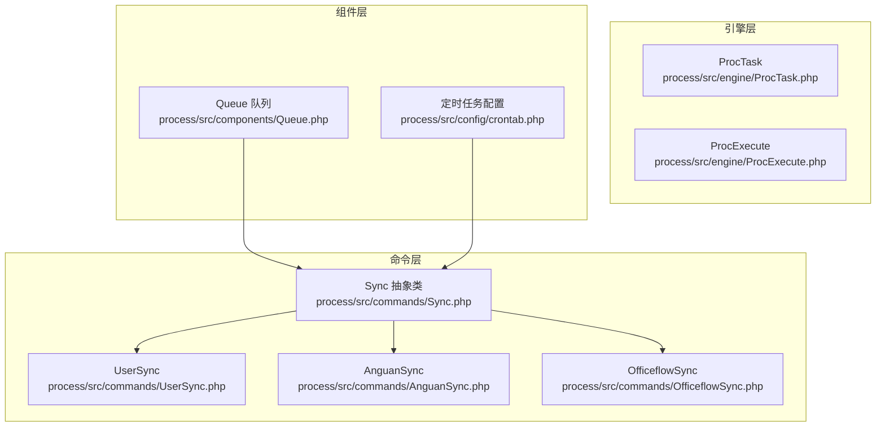
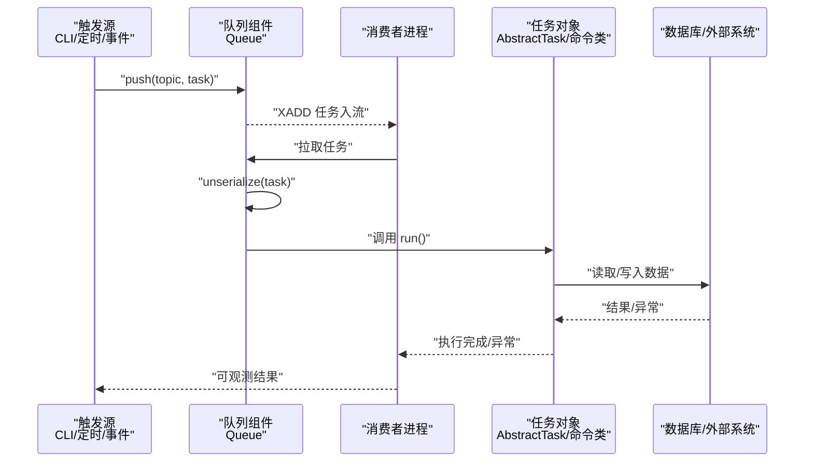
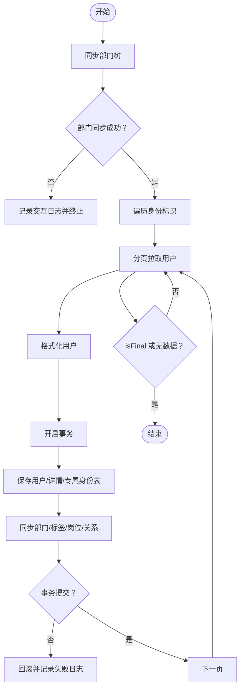
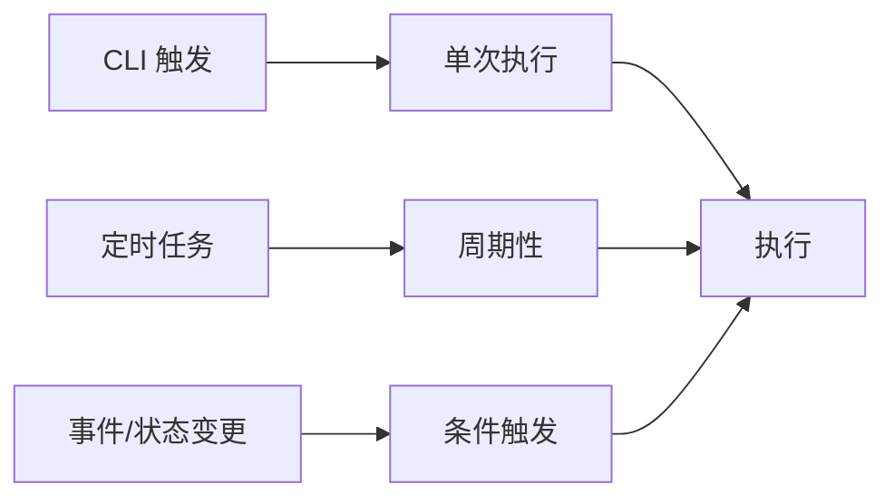
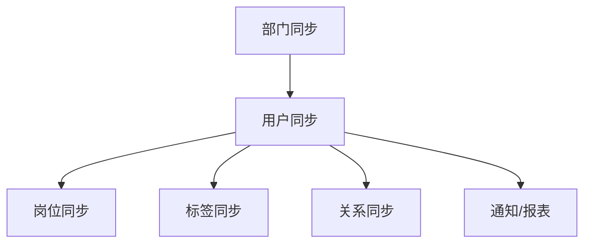
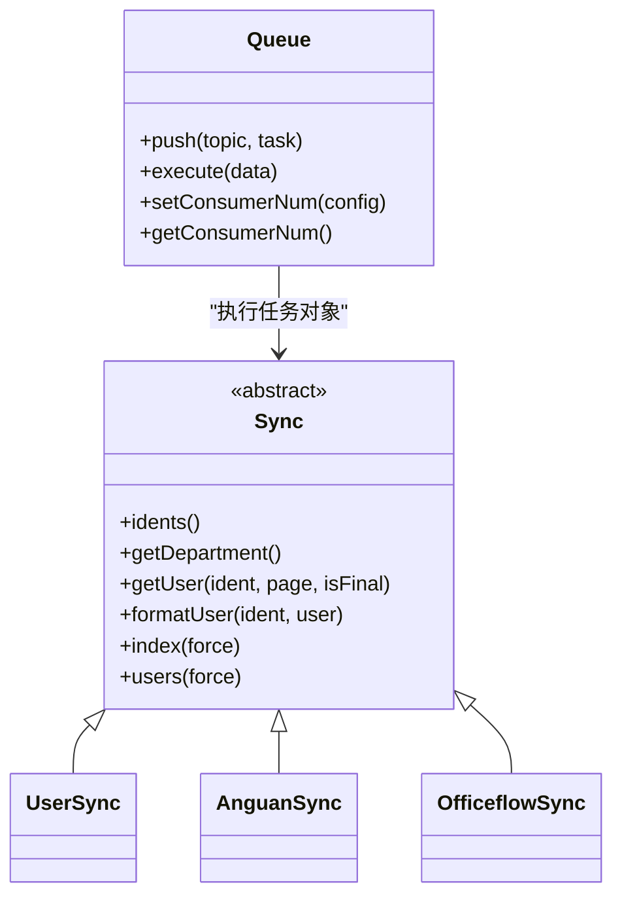

# 任务类型与模式

<cite>
**本文引用的文件**
- [process/src/engine/ProcTask.php](file://process/src/engine/ProcTask.php)
- [process/src/engine/ProcExecute.php](file://process/src/engine/ProcExecute.php)
- [process/src/commands/Sync.php](file://process/src/commands/Sync.php)
- [process/src/commands/UserSync.php](file://process/src/commands/UserSync.php)
- [process/src/commands/AnguanSync.php](file://process/src/commands/AnguanSync.php)
- [process/src/commands/OfficeflowSync.php](file://process/src/commands/OfficeflowSync.php)
- [process/src/components/Queue.php](file://process/src/components/Queue.php)
- [process/src/config/crontab.php](file://process/src/config/crontab.php)
</cite>

## 目录
1. [简介](#简介)
2. [项目结构](#项目结构)
3. [核心组件](#核心组件)
4. [架构总览](#架构总览)
5. [详细组件分析](#详细组件分析)
6. [依赖关系分析](#依赖关系分析)
7. [性能考量](#性能考量)
8. [故障排查指南](#故障排查指南)
9. [结论](#结论)
10. [附录](#附录)

## 简介
本文件面向 htdNew 项目，系统化梳理“任务类型与模式”的设计与实现，覆盖以下主题：
- 任务类型：数据同步任务、报表生成任务、通知推送任务等的职责边界与适用场景
- 任务模式：单次执行、周期性、条件触发
- 代码模板与实现示例：基于现有命令类与队列组件的可复用模式
- 任务间依赖与并发控制：锁、批处理、协程与消费者配置
- 失败重试与异常处理：幂等、回滚、告警与可观测性

## 项目结构
围绕任务体系的关键目录与文件：
- 引擎层：进程/流程引擎适配类，承接上层任务调度与执行
- 命令层：具体任务实现（同步、报表、通知等）
- 组件层：队列、缓存、错误处理等基础设施
- 配置层：定时任务组件注册与加载

**图表来源**
- [process/src/engine/ProcTask.php](file://process/src/engine/ProcTask.php#L1-L11)
- [process/src/engine/ProcExecute.php](file://process/src/engine/ProcExecute.php#L1-L11)
- [process/src/commands/Sync.php](file://process/src/commands/Sync.php#L1-L587)
- [process/src/commands/UserSync.php](file://process/src/commands/UserSync.php#L1-L221)
- [process/src/commands/AnguanSync.php](file://process/src/commands/AnguanSync.php#L1-L198)
- [process/src/commands/OfficeflowSync.php](file://process/src/commands/OfficeflowSync.php#L1-L495)
- [process/src/components/Queue.php](file://process/src/components/Queue.php#L1-L173)
- [process/src/config/crontab.php](file://process/src/config/crontab.php#L1-L10)

**章节来源**
- [process/src/engine/ProcTask.php](file://process/src/engine/ProcTask.php#L1-L11)
- [process/src/engine/ProcExecute.php](file://process/src/engine/ProcExecute.php#L1-L11)
- [process/src/commands/Sync.php](file://process/src/commands/Sync.php#L1-L587)
- [process/src/commands/UserSync.php](file://process/src/commands/UserSync.php#L1-L221)
- [process/src/commands/AnguanSync.php](file://process/src/commands/AnguanSync.php#L1-L198)
- [process/src/commands/OfficeflowSync.php](file://process/src/commands/OfficeflowSync.php#L1-L495)
- [process/src/components/Queue.php](file://process/src/components/Queue.php#L1-L173)
- [process/src/config/crontab.php](file://process/src/config/crontab.php#L1-L10)

## 核心组件
- 任务抽象与执行
  - 引擎适配类：继承自底层引擎，保留序列化兼容性注释，确保历史会话/状态可恢复
  - 命令基类：提供统一的同步流程骨架（部门/用户/关系/标签/岗位），支持断点续传、协程并发、事务回滚与交互日志
- 队列与消费
  - 队列组件：基于 Redis Stream 的任务投递与反序列化执行；支持消费者数量动态配置与热重载
  - 任务对象编码：自动序列化任务对象及其嵌套对象，要求无参构造或全部参数具备默认值
- 定时任务
  - 定时任务配置：合并 CLI 组件，统一注册到调度器

**章节来源**
- [process/src/engine/ProcTask.php](file://process/src/engine/ProcTask.php#L1-L11)
- [process/src/engine/ProcExecute.php](file://process/src/engine/ProcExecute.php#L1-L11)
- [process/src/commands/Sync.php](file://process/src/commands/Sync.php#L1-L587)
- [process/src/components/Queue.php](file://process/src/components/Queue.php#L1-L173)
- [process/src/config/crontab.php](file://process/src/config/crontab.php#L1-L10)

## 架构总览
任务从“被触发”到“被执行”的端到端流程如下：

**图表来源**
- [process/src/components/Queue.php](file://process/src/components/Queue.php#L1-L173)
- [process/src/commands/Sync.php](file://process/src/commands/Sync.php#L1-L587)

## 详细组件分析

### 数据同步任务
- 职责与特点
  - 统一的同步骨架：部门树构建、身份枚举、分页拉取、格式化、事务落库、关系/标签/岗位同步
  - 断点续传：按身份+页码持久化历史，支持跨进程/跨轮次续跑
  - 并发控制：协程通道与屏障，限制并发度，避免下游压力过大
  - 交互日志：对每次拉取与入库进行交互日志记录，便于审计与追踪
- 典型实现
  - 抽象同步基类：定义 idents/getDepartment/getUser/formatUser 等钩子
  - 用户同步：UserSync 在不同同步类型（部门/岗位/标签）下委派具体服务
  - 第三方平台同步：AnguanSync/OfficeflowSync 重写数据源与格式化策略
- 适用场景
  - 用户主数据同步（组织架构、身份、标签、岗位）
  - 外部平台数据对齐（OA/人事/资产平台）

**图表来源**
- [process/src/commands/Sync.php](file://process/src/commands/Sync.php#L1-L587)
- [process/src/commands/UserSync.php](file://process/src/commands/UserSync.php#L1-L221)
- [process/src/commands/AnguanSync.php](file://process/src/commands/AnguanSync.php#L1-L198)
- [process/src/commands/OfficeflowSync.php](file://process/src/commands/OfficeflowSync.php#L1-L495)

**章节来源**
- [process/src/commands/Sync.php](file://process/src/commands/Sync.php#L1-L587)
- [process/src/commands/UserSync.php](file://process/src/commands/UserSync.php#L1-L221)
- [process/src/commands/AnguanSync.php](file://process/src/commands/AnguanSync.php#L1-L198)
- [process/src/commands/OfficeflowSync.php](file://process/src/commands/OfficeflowSync.php#L1-L495)

### 报表生成任务
- 职责与特点
  - 以“数据导出/聚合统计”为核心，通常为单次执行或周期性任务
  - 输出格式可多样化（CSV/PDF/Excel），建议结合异步队列与下载链接通知
- 实现要点
  - 输入参数校验与范围限定
  - 分段/分页生成，避免内存峰值
  - 失败重试与断点续传（可借鉴同步任务的历史文件策略）
  - 生成完成后通过通知任务发送结果

[本节为概念性说明，不直接分析具体文件]

### 通知推送任务
- 职责与特点
  - 以“消息/邮件/短信/站内信”为主要输出，强调幂等与去重
  - 建议采用队列异步化，配合重试与死信处理
- 实现要点
  - 任务对象封装通知上下文（接收人、模板、变量）
  - 幂等键（如业务单号+模板标识）避免重复推送
  - 失败重试与人工干预入口

[本节为概念性说明，不直接分析具体文件]

### 任务模式与触发机制
- 单次执行任务
  - 由 CLI 或事件触发，执行后结束
  - 适合一次性迁移、补数据、临时报表
- 周期性任务
  - 通过定时任务组件注册，按配置周期运行
  - 适合数据同步、指标统计、清理任务
- 条件触发任务
  - 基于事件/状态变更触发，如用户状态变化、数据变更
  - 适合通知、审批流转、数据对账

**图表来源**
- [process/src/config/crontab.php](file://process/src/config/crontab.php#L1-L10)

**章节来源**
- [process/src/config/crontab.php](file://process/src/config/crontab.php#L1-L10)

### 代码模板与实现示例（路径指引）
- 同步任务模板（参考）
  - 抽象同步骨架：[process/src/commands/Sync.php](file://process/src/commands/Sync.php#L1-L587)
  - 用户同步入口与锁控制：[process/src/commands/UserSync.php](file://process/src/commands/UserSync.php#L1-L221)
  - 第三方平台同步（部门/用户/岗位/标签）：[process/src/commands/OfficeflowSync.php](file://process/src/commands/OfficeflowSync.php#L1-L495)，[process/src/commands/AnguanSync.php](file://process/src/commands/AnguanSync.php#L1-L198)
- 队列任务模板（参考）
  - 任务入队与执行：[process/src/components/Queue.php](file://process/src/components/Queue.php#L1-L173)
  - 任务对象编码/解码约束：构造参数默认值、可序列化字段
- 报表/通知任务模板（建议）
  - 报表：以“输入参数 + 分页生成 + 下载链接”为主
  - 通知：以“幂等键 + 重试 + 死信”为主

**章节来源**
- [process/src/commands/Sync.php](file://process/src/commands/Sync.php#L1-L587)
- [process/src/commands/UserSync.php](file://process/src/commands/UserSync.php#L1-L221)
- [process/src/commands/OfficeflowSync.php](file://process/src/commands/OfficeflowSync.php#L1-L495)
- [process/src/commands/AnguanSync.php](file://process/src/commands/AnguanSync.php#L1-L198)
- [process/src/components/Queue.php](file://process/src/components/Queue.php#L1-L173)

### 任务间依赖关系与并发控制
- 依赖管理
  - 部门树必须先于用户同步，否则用户归属缺失
  - 岗位/标签/关系依赖用户存在，需在用户落库后再行同步
- 并发控制
  - 协程通道与屏障：限制同一身份下的并发，避免下游限流
  - Redis 锁：全局/局部锁避免重复执行与资源竞争
  - 队列消费者数量：通过配置热更新，按资源弹性扩容

**图表来源**
- [process/src/commands/Sync.php](file://process/src/commands/Sync.php#L1-L587)
- [process/src/commands/UserSync.php](file://process/src/commands/UserSync.php#L1-L221)
- [process/src/commands/OfficeflowSync.php](file://process/src/commands/OfficeflowSync.php#L1-L495)

**章节来源**
- [process/src/commands/Sync.php](file://process/src/commands/Sync.php#L1-L587)
- [process/src/commands/UserSync.php](file://process/src/commands/UserSync.php#L1-L221)
- [process/src/commands/OfficeflowSync.php](file://process/src/commands/OfficeflowSync.php#L1-L495)

### 失败重试与异常处理最佳实践
- 幂等与断点
  - 历史文件/Redis 键记录已完成的分页，避免重复
  - 事务回滚与交互日志，便于定位失败原因
- 锁与隔离
  - 全局锁避免并发重复执行；按模式（全量/增量）设置不同超时
  - Redis 锁释放放在 finally，确保异常场景也能释放
- 重试与退避
  - 对瞬时性错误采用指数退避重试
  - 对不可恢复错误（如数据不合法）快速失败并告警
- 观测与告警
  - 交互日志与错误日志双轨记录
  - 失败率/耗时监控与告警阈值

**章节来源**
- [process/src/commands/Sync.php](file://process/src/commands/Sync.php#L1-L587)
- [process/src/commands/UserSync.php](file://process/src/commands/UserSync.php#L1-L221)
- [process/src/commands/OfficeflowSync.php](file://process/src/commands/OfficeflowSync.php#L1-L495)

## 依赖关系分析
- 命令类依赖
  - UserSync/OfficeflowSync/AnguanSync 均继承自 Sync，共享骨架能力
  - 通过服务类（如 SyncServiceUser/Job/Team）实现差异化业务
- 队列与任务对象
  - Queue 负责序列化/反序列化与执行
  - 任务对象需满足编码约束（构造参数默认值、可序列化字段）
- 定时任务
  - crontab.php 合并 CLI 组件，统一注册到调度器

**图表来源**
- [process/src/commands/Sync.php](file://process/src/commands/Sync.php#L1-L587)
- [process/src/commands/UserSync.php](file://process/src/commands/UserSync.php#L1-L221)
- [process/src/commands/AnguanSync.php](file://process/src/commands/AnguanSync.php#L1-L198)
- [process/src/commands/OfficeflowSync.php](file://process/src/commands/OfficeflowSync.php#L1-L495)
- [process/src/components/Queue.php](file://process/src/components/Queue.php#L1-L173)

**章节来源**
- [process/src/commands/Sync.php](file://process/src/commands/Sync.php#L1-L587)
- [process/src/commands/UserSync.php](file://process/src/commands/UserSync.php#L1-L221)
- [process/src/commands/AnguanSync.php](file://process/src/commands/AnguanSync.php#L1-L198)
- [process/src/commands/OfficeflowSync.php](file://process/src/commands/OfficeflowSync.php#L1-L495)
- [process/src/components/Queue.php](file://process/src/components/Queue.php#L1-L173)

## 性能考量
- 并发与限流
  - 协程通道容量与屏障控制并发度，避免下游抖动
  - Redis 锁与消费者数量配置协同，平衡吞吐与稳定性
- I/O 优化
  - 分页/批处理写入，降低单次事务大小
  - 交互日志与事务分离，减少阻塞
- 缓存与去重
  - 关系映射/字典缓存（如 Redis）减少重复查询
  - 去重与幂等键避免重复计算

[本节提供一般性指导，不直接分析具体文件]

## 故障排查指南
- 常见问题定位
  - 断点续传：检查历史文件/键是否存在、是否过期
  - 并发冲突：检查 Redis 锁是否正确释放、消费者数量是否合理
  - 事务失败：查看回滚日志与交互日志，定位具体用户/部门/岗位
- 排障步骤
  - 重放单页/单身份，缩小范围
  - 查看队列长度与消费者配置，确认积压情况
  - 检查外部系统接口状态与限流策略

**章节来源**
- [process/src/commands/Sync.php](file://process/src/commands/Sync.php#L1-L587)
- [process/src/components/Queue.php](file://process/src/components/Queue.php#L1-L173)

## 结论
htdNew 的任务体系以“命令类 + 队列 + 定时任务”为核心，通过统一的同步骨架与严格的并发/异常治理，实现了高可靠的任务编排。建议在新任务开发中遵循：
- 优先使用现有命令骨架，按需扩展钩子
- 通过队列实现异步化与削峰填谷
- 以锁与断点续传保障幂等与可恢复
- 以观测与告警完善运维闭环

[本节为总结性内容，不直接分析具体文件]

## 附录
- 术语
  - 断点续传：记录已完成的分页，支持重启后继续
  - 幂等：相同输入多次执行产生相同结果
  - 交互日志：对上游/下游交互进行记录，便于审计
- 参考路径
  - 同步骨架：[process/src/commands/Sync.php](file://process/src/commands/Sync.php#L1-L587)
  - 用户同步入口：[process/src/commands/UserSync.php](file://process/src/commands/UserSync.php#L1-L221)
  - 队列组件：[process/src/components/Queue.php](file://process/src/components/Queue.php#L1-L173)
  - 定时任务配置：[process/src/config/crontab.php](file://process/src/config/crontab.php#L1-L10)