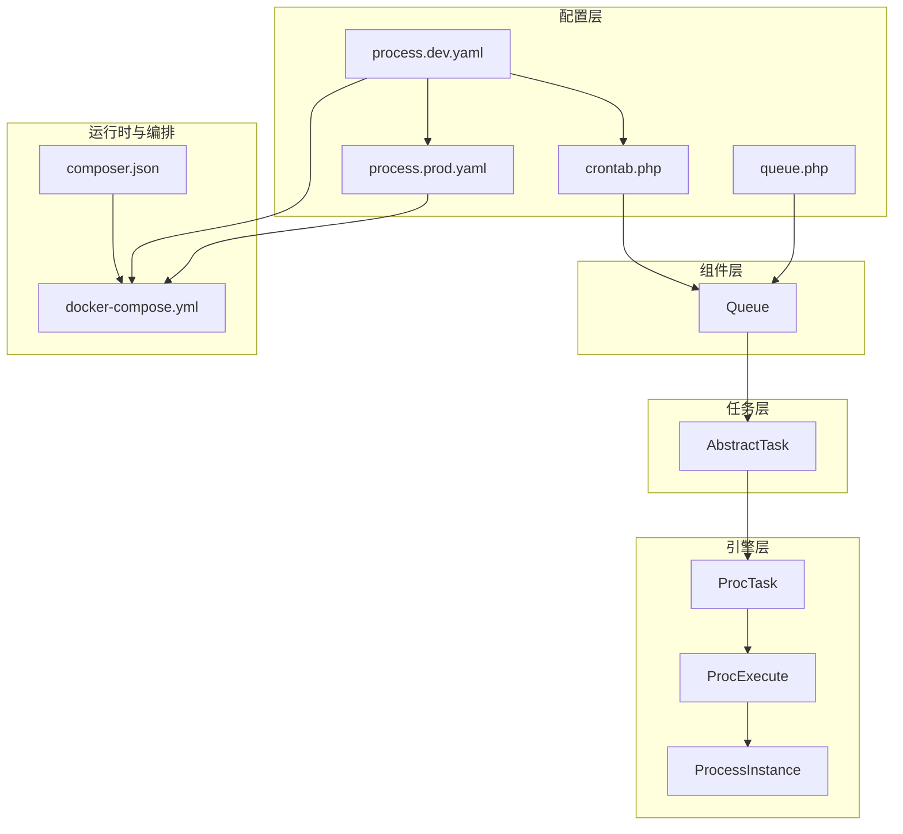
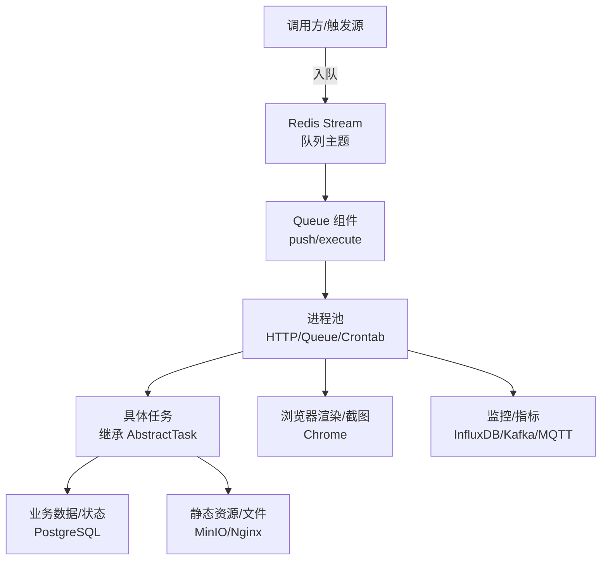
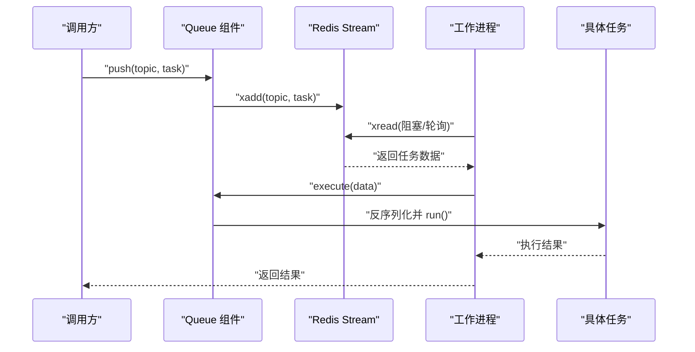
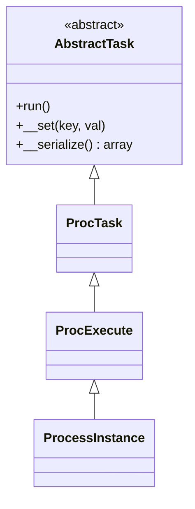
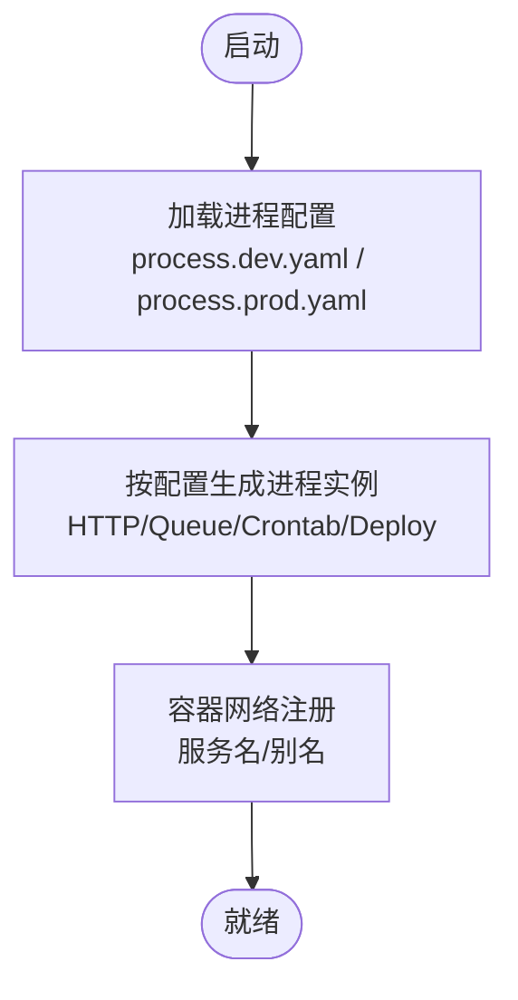
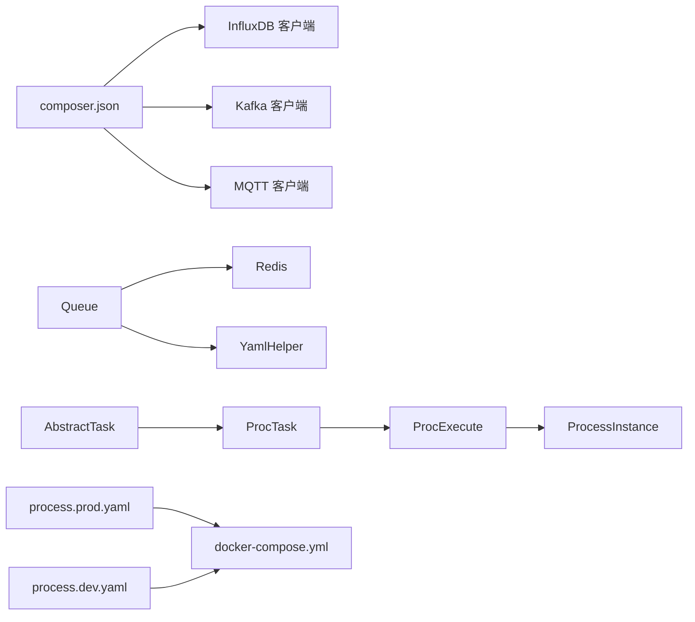

# 任务部署与监控

<cite>
**本文引用的文件**
- [process/dev 环境配置](file://process/src/config/process.dev.yaml)
- [process/prod 环境配置](file://process/src/config/process.prod.yaml)
- [计划任务配置](file://process/src/config/crontab.php)
- [队列组件](file://process/src/components/Queue.php)
- [任务抽象基类](file://process/src/services/task/AbstractTask.php)
- [任务引擎-ProcTask](file://process/src/engine/ProcTask.php)
- [任务引擎-ProcExecute](file://process/src/engine/ProcExecute.php)
- [任务引擎-ProcessInstance](file://process/src/engine/ProcessInstance.php)
- [Docker 编排](file://process/docker/docker-compose.yml)
- [依赖清单](file://process/composer.json)
</cite>

## 目录
1. [引言](#引言)
2. [项目结构](#项目结构)
3. [核心组件](#核心组件)
4. [架构总览](#架构总览)
5. [详细组件分析](#详细组件分析)
6. [依赖关系分析](#依赖关系分析)
7. [性能考虑](#性能考虑)
8. [故障排查指南](#故障排查指南)
9. [结论](#结论)
10. [附录](#附录)

## 引言
本文件面向 htdNew 项目中的“任务”子系统，围绕任务部署、进程管理、服务注册、监控指标采集、日志与告警、性能优化、扩容与负载均衡、以及回滚与版本管理等方面进行系统化说明。目标是帮助运维与开发团队在生产环境中稳定、可观测地运行任务体系。

## 项目结构
任务相关能力由以下层次构成：
- 配置层：进程与任务的运行参数、进程数量、CPU 亲和性、业务配置路径等
- 引擎层：封装任务生命周期与执行模型（任务实例、执行器、任务包装）
- 组件层：队列组件负责任务入队、出队、消费者数量动态调整与长度查询
- 任务层：具体任务实现继承统一抽象基类，具备可序列化特性以便持久化与跨进程传递
- 运行时与编排：Docker Compose 提供 Redis、PostgreSQL、PHP、Nginx、Chrome、MinIO 等基础服务；前端通过 PM2 容器化托管
- 依赖层：通过 Composer 引入 InfluxDB 客户端、Kafka、MQTT 等观测与消息中间件能力

图表来源
- [process/dev 环境配置](file://process/src/config/process.dev.yaml#L1-L89)
- [process/prod 环境配置](file://process/src/config/process.prod.yaml#L1-L80)
- [计划任务配置](file://process/src/config/crontab.php#L1-L10)
- [队列组件](file://process/src/components/Queue.php#L1-L173)
- [任务抽象基类](file://process/src/services/task/AbstractTask.php#L1-L30)
- [任务引擎-ProcTask](file://process/src/engine/ProcTask.php#L1-L11)
- [任务引擎-ProcExecute](file://process/src/engine/ProcExecute.php#L1-L11)
- [任务引擎-ProcessInstance](file://process/src/engine/ProcessInstance.php#L1-L11)
- [Docker 编排](file://process/docker/docker-compose.yml#L1-L150)
- [依赖清单](file://process/composer.json#L1-L70)

章节来源
- [process/dev 环境配置](file://process/src/config/process.dev.yaml#L1-L89)
- [process/prod 环境配置](file://process/src/config/process.prod.yaml#L1-L80)
- [Docker 编排](file://process/docker/docker-compose.yml#L1-L150)

## 核心组件
- 进程与任务配置
  - 开发与生产环境分别提供进程模板与默认参数，支持 HTTP、队列、计划任务等进程类型，可配置进程数量与 CPU 亲和性
  - 计划任务通过独立进程加载组件集合，便于按需扩展
- 队列组件
  - 提供入队、出队、消费者数量动态调整、队列长度查询等能力
  - 使用 Redis Stream 实现任务流式存储，支持序列化任务对象
- 任务抽象基类
  - 统一任务接口与可序列化行为，确保任务可在不同进程间传输与恢复
- 任务引擎
  - 对外暴露任务实例、执行器与进程包装，承载任务生命周期管理
- Docker 编排
  - 提供 Redis、PostgreSQL、PHP、Nginx、Chrome、MinIO、前端 PM2 等服务编排与端口映射

章节来源
- [process/dev 环境配置](file://process/src/config/process.dev.yaml#L1-L89)
- [process/prod 环境配置](file://process/src/config/process.prod.yaml#L1-L80)
- [队列组件](file://process/src/components/Queue.php#L1-L173)
- [任务抽象基类](file://process/src/services/task/AbstractTask.php#L1-L30)
- [任务引擎-ProcTask](file://process/src/engine/ProcTask.php#L1-L11)
- [任务引擎-ProcExecute](file://process/src/engine/ProcExecute.php#L1-L11)
- [任务引擎-ProcessInstance](file://process/src/engine/ProcessInstance.php#L1-L11)
- [Docker 编排](file://process/docker/docker-compose.yml#L1-L150)

## 架构总览
下图展示任务从“入队”到“执行”的全链路，以及与外部系统的交互点（Redis、PostgreSQL、Nginx、MinIO、Chrome）：

图表来源
- [队列组件](file://process/src/components/Queue.php#L1-L173)
- [Docker 编排](file://process/docker/docker-compose.yml#L1-L150)
- [依赖清单](file://process/composer.json#L1-L70)

## 详细组件分析

### 队列组件与任务执行流程
- 入队与出队
  - 入队：向 Redis Stream 指定主题写入序列化后的任务对象
  - 出队：从 Redis Stream 读取任务并反序列化，交由任务对象执行
- 动态消费者数量
  - 通过缓存键保存消费者配置，支持热更新后触发主进程 reload 生效
- 队列长度监控
  - 提供按主题查询队列长度的能力，便于告警阈值设定

图表来源
- [队列组件](file://process/src/components/Queue.php#L1-L173)

章节来源
- [队列组件](file://process/src/components/Queue.php#L1-L173)

### 任务抽象与序列化
- 抽象基类定义统一接口与可序列化逻辑，确保任务对象可被安全传输与持久化
- 通过反射提取公开非静态属性，避免不可序列化字段影响传输

图表来源
- [任务抽象基类](file://process/src/services/task/AbstractTask.php#L1-L30)
- [任务引擎-ProcTask](file://process/src/engine/ProcTask.php#L1-L11)
- [任务引擎-ProcExecute](file://process/src/engine/ProcExecute.php#L1-L11)
- [任务引擎-ProcessInstance](file://process/src/engine/ProcessInstance.php#L1-L11)

章节来源
- [任务抽象基类](file://process/src/services/task/AbstractTask.php#L1-L30)
- [任务引擎-ProcTask](file://process/src/engine/ProcTask.php#L1-L11)
- [任务引擎-ProcExecute](file://process/src/engine/ProcExecute.php#L1-L11)
- [任务引擎-ProcessInstance](file://process/src/engine/ProcessInstance.php#L1-L11)

### 进程与服务注册
- 进程类型
  - HTTP：对外提供服务，支持多进程与 CPU 亲和性配置
  - Queue：消费队列任务
  - Crontab：执行计划任务
  - Deploy：部署相关进程（生产可用）
- 服务注册与发现
  - 通过 Docker 网络别名与服务名实现容器间通信
  - Nginx 作为入口网关，转发请求至 PHP 服务

图表来源
- [process/dev 环境配置](file://process/src/config/process.dev.yaml#L1-L89)
- [process/prod 环境配置](file://process/src/config/process.prod.yaml#L1-L80)
- [Docker 编排](file://process/docker/docker-compose.yml#L1-L150)

章节来源
- [process/dev 环境配置](file://process/src/config/process.dev.yaml#L1-L89)
- [process/prod 环境配置](file://process/src/config/process.prod.yaml#L1-L80)
- [Docker 编排](file://process/docker/docker-compose.yml#L1-L150)

### 计划任务配置与组件加载
- 计划任务进程加载组件集合，支持 CLI 与 HTTP 组件合并
- 通过独立进程运行，便于隔离与扩展

章节来源
- [计划任务配置](file://process/src/config/crontab.php#L1-L10)

## 依赖关系分析
- 外部依赖
  - InfluxDB 客户端：用于指标采集与上报
  - Kafka：消息通道，可用于任务事件或审计日志
  - MQTT：协议适配，可用于设备或桥接场景
- 内部耦合
  - Queue 依赖 Redis 与 YAML 辅助工具
  - 任务引擎依赖底层执行模型
  - 运行时依赖 Docker 编排与 Composer 依赖

图表来源
- [依赖清单](file://process/composer.json#L1-L70)
- [队列组件](file://process/src/components/Queue.php#L1-L173)
- [任务抽象基类](file://process/src/services/task/AbstractTask.php#L1-L30)
- [任务引擎-ProcTask](file://process/src/engine/ProcTask.php#L1-L11)
- [任务引擎-ProcExecute](file://process/src/engine/ProcExecute.php#L1-L11)
- [任务引擎-ProcessInstance](file://process/src/engine/ProcessInstance.php#L1-L11)
- [process/prod 环境配置](file://process/src/config/process.prod.yaml#L1-L80)
- [process/dev 环境配置](file://process/src/config/process.dev.yaml#L1-L89)
- [Docker 编排](file://process/docker/docker-compose.yml#L1-L150)

章节来源
- [依赖清单](file://process/composer.json#L1-L70)
- [队列组件](file://process/src/components/Queue.php#L1-L173)

## 性能考虑
- 进程与 CPU 亲和性
  - 生产环境建议为 HTTP 进程分配独立 CPU 核心，保障高并发稳定性
  - 队列与计划任务进程可根据负载动态增减
- 队列与消费者
  - 通过缓存键动态调整消费者数量，结合队列长度阈值进行弹性伸缩
- 执行时间与吞吐
  - 将耗时任务拆分为小颗粒任务，减少单次执行时间波动
  - 合理设置 Redis Stream 主题优先级（高/中/低），保障关键任务优先处理
- 资源监控
  - 结合 InfluxDB 客户端采集执行时延、队列长度、错误率等指标
  - 利用 Kafka/MQTT 记录任务事件流，便于问题追踪与审计

[本节为通用性能建议，不直接分析具体文件]

## 故障排查指南
- 队列堆积
  - 检查队列长度与消费者数量是否匹配；必要时临时提升消费者数量或增加进程数
  - 排查任务执行异常导致的重复入队或死信
- 进程异常重启
  - 开发环境可通过文件变更监控自动重启；生产环境应检查日志与健康检查
  - 关注 CPU 亲和性配置是否与宿主机核数一致
- 任务反序列化失败
  - 确保任务类未被删除或重命名；序列化仅依赖类名与公开属性
- 外部依赖异常
  - Redis/PostgreSQL/MinIO/Chrome 状态检查；确认 Docker 端口映射与网络连通性

章节来源
- [队列组件](file://process/src/components/Queue.php#L1-L173)
- [process/dev 环境配置](file://process/src/config/process.dev.yaml#L1-L89)
- [process/prod 环境配置](file://process/src/config/process.prod.yaml#L1-L80)
- [Docker 编排](file://process/docker/docker-compose.yml#L1-L150)

## 结论
通过清晰的进程配置、可靠的队列与任务抽象、完善的 Docker 编排与可观测依赖，htdNew 的任务体系能够在生产环境中实现稳定、可扩展与可监控的运行。建议在上线前完成资源规划、监控阈值与告警策略的配置，并建立标准化的回滚与版本管理流程以保障变更安全。

[本节为总结性内容，不直接分析具体文件]

## 附录

### 任务部署流程（配置-进程-服务注册）
- 准备环境变量与配置文件（开发/生产）
- 启动 Docker 服务（Redis、PostgreSQL、PHP、Nginx、Chrome、MinIO、Frontend）
- 部署任务组件与业务配置
- 注册服务与对外暴露端口
- 观察进程健康状态与队列长度

章节来源
- [process/dev 环境配置](file://process/src/config/process.dev.yaml#L1-L89)
- [process/prod 环境配置](file://process/src/config/process.prod.yaml#L1-L80)
- [Docker 编排](file://process/docker/docker-compose.yml#L1-L150)

### 任务监控指标与采集
- 关键指标
  - 执行时间：任务从入队到完成的总耗时
  - 成功率/失败率：成功/失败任务计数与占比
  - 队列长度：各主题积压任务数
  - 消费者数量：当前消费者实例数
- 采集方式
  - 使用 InfluxDB 客户端上报指标
  - 使用 Kafka/MQTT 记录事件流
- 告警建议
  - 队列长度超阈值、失败率突增、执行时间超时等

章节来源
- [依赖清单](file://process/composer.json#L1-L70)
- [队列组件](file://process/src/components/Queue.php#L1-L173)

### 日志管理策略
- 日志目录与运行目录分离，便于持久化与清理
- 分进程分主题记录，区分业务日志与系统日志
- 结合 Nginx/PHP/MinIO/Chrome 的日志输出，统一采集与归档

章节来源
- [process/dev 环境配置](file://process/src/config/process.dev.yaml#L1-L89)
- [process/prod 环境配置](file://process/src/config/process.prod.yaml#L1-L80)
- [Docker 编排](file://process/docker/docker-compose.yml#L1-L150)

### 扩容与负载均衡
- 进程扩容：按 CPU 核心数与业务负载调整 HTTP/Queue/Crontab 进程数量
- 负载均衡：Nginx 作为入口，后端 PHP 进程多实例横向扩展
- 队列扩展：多主题分流与消费者并行处理

章节来源
- [process/dev 环境配置](file://process/src/config/process.dev.yaml#L1-L89)
- [process/prod 环境配置](file://process/src/config/process.prod.yaml#L1-L80)
- [Docker 编排](file://process/docker/docker-compose.yml#L1-L150)

### 回滚与版本管理最佳实践
- 版本发布
  - 使用 Git 标签与分支管理版本
  - 发布前在测试环境验证任务序列化兼容性
- 回滚策略
  - 保留最近一次可回滚版本的镜像与配置
  - 回滚时先降级消费者数量，再切换镜像与配置，最后恢复消费者
- 变更评审
  - 任务类新增/修改需评估对历史序列化的影响

[本节为通用实践建议，不直接分析具体文件]