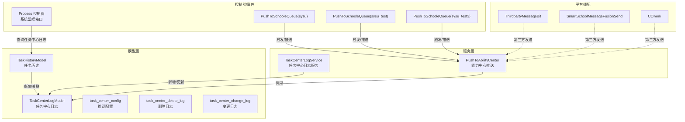
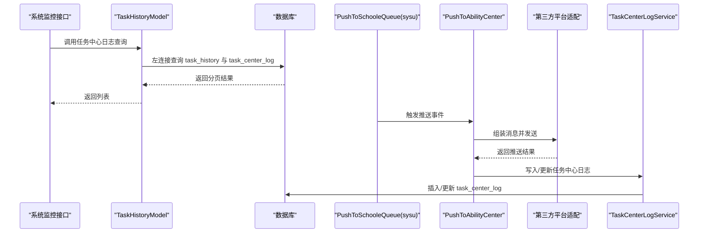
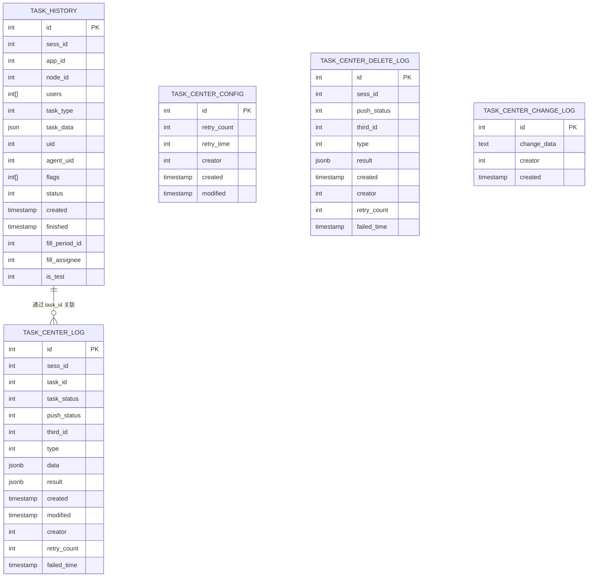
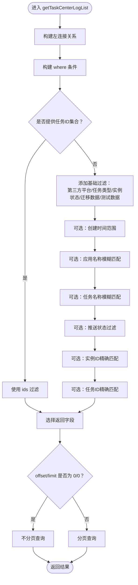
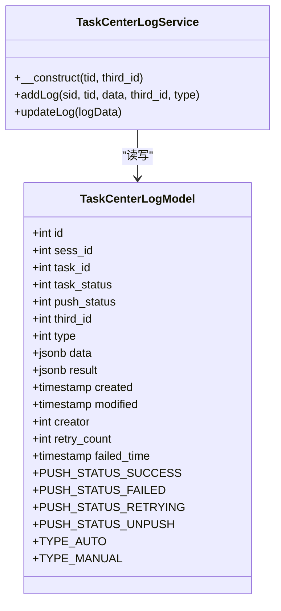
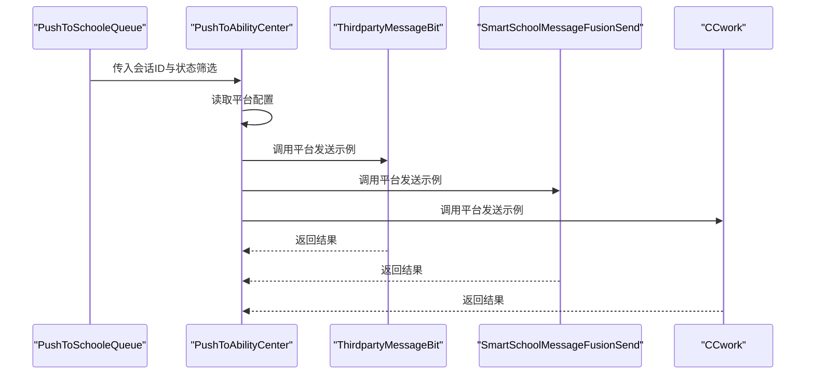
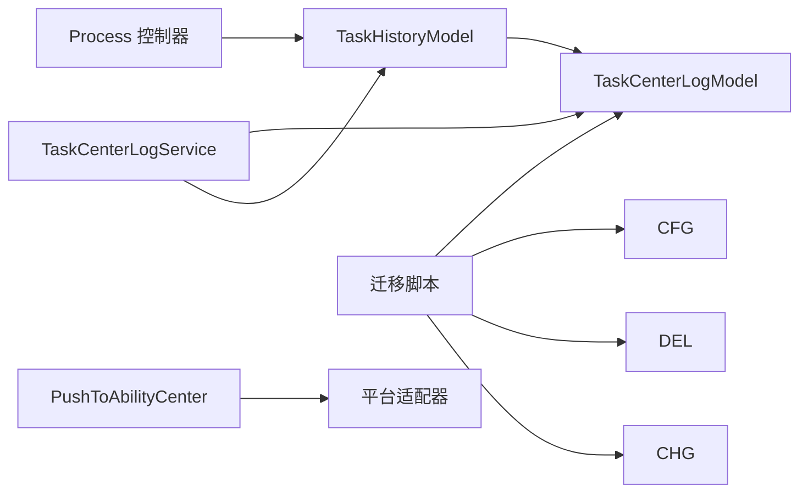

# 任务中心日志

<cite>
**本文引用的文件**
- [TaskHistoryModel.php](file://process/src/models/TaskHistoryModel.php)
- [TaskCenterLogModel.php](file://process/src/models/TaskCenterLogModel.php)
- [TaskCenterLogService.php](file://process/src/services/taskCenter/TaskCenterLogService.php)
- [migration_20250820_171300_create_task_center_log.php](file://process/src/migrations/migration_20250820_171300_create_task_center_log.php)
- [migration_20230709_135023_runtime_log_add.php](file://process/src/migrations/migration_20230709_135023_runtime_log_add.php)
- [migration_20240727_123331_form_data_log.php](file://process/src/migrations/migration_20240727_123331_form_data_log.php)
- [Process.php](file://process/src/http/system/Process.php)
- [PushToSchooleQueue.php（sysu）](file://process_envs/sysu/product/task/push/PushToSchooleQueue.php)
- [PushToSchooleQueue.php（sysu_test）](file://process_envs/sysu_test/product/task/push/PushToSchooleQueue.php)
- [PushToSchooleQueue.php（sysu_test3）](file://process_envs/sysu_test3/product/task/push/PushToSchooleQueue.php)
- [PushToAbilityCenter.php](file://process/src/services/task/PushToAbilityCenter.php)
- [ThirdpartyMessageBit.php](file://process/src/services/platform/ThirdpartyMessageBit.php)
- [SmartSchoolMessageFusionSend.php](file://process/src/services/platform/SmartSchoolMessageFusionSend.php)
- [CCwork.php](file://process/src/services/platform/CCwork.php)
</cite>

## 目录
1. [引言](#引言)
2. [项目结构](#项目结构)
3. [核心组件](#核心组件)
4. [架构总览](#架构总览)
5. [详细组件分析](#详细组件分析)
6. [依赖分析](#依赖分析)
7. [性能考虑](#性能考虑)
8. [故障排查指南](#故障排查指南)
9. [结论](#结论)
10. [附录](#附录)

## 引言
本文件面向任务中心日志系统，围绕数据结构、存储机制、查询接口、日志类型与推送状态管理、第三方平台集成、配置与清理、审计追踪、查询条件与分页、性能优化与备份、以及与任务历史的关联与同步进行系统化说明。目标是帮助开发者与运维人员快速理解并高效维护该子系统。

## 项目结构
任务中心日志相关代码主要分布在以下模块：
- 数据模型层：任务历史、任务中心日志、配置与删除/变更日志
- 服务层：任务中心日志服务、平台推送服务
- 迁移脚本：建表与索引初始化
- 控制器与事件：系统监控接口、推送队列触发
- 第三方平台适配：统一消息发送平台实现

图表来源
- [TaskHistoryModel.php](file://process/src/models/TaskHistoryModel.php#L170-L270)
- [TaskCenterLogModel.php](file://process/src/models/TaskCenterLogModel.php#L1-L74)
- [TaskCenterLogService.php](file://process/src/services/taskCenter/TaskCenterLogService.php#L1-L78)
- [migration_20250820_171300_create_task_center_log.php](file://process/src/migrations/migration_20250820_171300_create_task_center_log.php#L1-L79)
- [Process.php](file://process/src/http/system/Process.php#L1-L154)
- [PushToSchooleQueue.php（sysu）](file://process_envs/sysu/product/task/push/PushToSchooleQueue.php#L37-L48)
- [PushToSchooleQueue.php（sysu_test）](file://process_envs/sysu_test/product/task/push/PushToSchooleQueue.php#L37-L48)
- [PushToSchooleQueue.php（sysu_test3）](file://process_envs/sysu_test3/product/task/push/PushToSchooleQueue.php#L37-L48)
- [PushToAbilityCenter.php](file://process/src/services/task/PushToAbilityCenter.php#L48-L81)
- [ThirdpartyMessageBit.php](file://process/src/services/platform/ThirdpartyMessageBit.php#L1-L47)
- [SmartSchoolMessageFusionSend.php](file://process/src/services/platform/SmartSchoolMessageFusionSend.php#L47-L81)
- [CCwork.php](file://process/src/services/platform/CCwork.php#L85-L132)

章节来源
- [TaskHistoryModel.php](file://process/src/models/TaskHistoryModel.php#L170-L270)
- [TaskCenterLogModel.php](file://process/src/models/TaskCenterLogModel.php#L1-L74)
- [TaskCenterLogService.php](file://process/src/services/taskCenter/TaskCenterLogService.php#L1-L78)
- [migration_20250820_171300_create_task_center_log.php](file://process/src/migrations/migration_20250820_171300_create_task_center_log.php#L1-L79)
- [Process.php](file://process/src/http/system/Process.php#L1-L154)

## 核心组件
- 任务历史模型：提供任务中心日志查询接口，支持按时间、应用、任务名、推送状态、实例/任务ID等条件过滤，并支持分页。
- 任务中心日志模型：记录推送结果、重试次数、失败时间、创建/修改时间、第三方平台ID、推送类型等。
- 任务中心日志服务：负责新增与更新日志记录，兼容空结果与状态不一致场景，自动累加重试次数与失败时间。
- 迁移脚本：创建任务中心日志表、推送配置表、删除日志表、变更日志表，并注册重试推送定时任务。
- 第三方平台适配：统一消息发送平台实现，支持不同平台的能力与参数格式。
- 能力中心推送：根据平台配置与事件上下文，向第三方平台推送任务或删除实例。

章节来源
- [TaskHistoryModel.php](file://process/src/models/TaskHistoryModel.php#L170-L270)
- [TaskCenterLogModel.php](file://process/src/models/TaskCenterLogModel.php#L1-L74)
- [TaskCenterLogService.php](file://process/src/services/taskCenter/TaskCenterLogService.php#L1-L78)
- [migration_20250820_171300_create_task_center_log.php](file://process/src/migrations/migration_20250820_171300_create_task_center_log.php#L1-L79)

## 架构总览
任务中心日志贯穿“查询—推送—记录—重试—审计”的闭环：
- 查询入口：系统监控接口与业务逻辑通过任务历史模型查询任务中心日志。
- 推送入口：推送队列触发能力中心推送，平台适配器执行具体发送。
- 记录入口：任务中心日志服务在新增/更新阶段写入日志表。
- 重试入口：定时任务周期性扫描失败/未推送日志并重推。
- 审计入口：删除日志与变更日志记录关键操作轨迹。

图表来源
- [Process.php](file://process/src/http/system/Process.php#L1-L154)
- [TaskHistoryModel.php](file://process/src/models/TaskHistoryModel.php#L170-L270)
- [PushToSchooleQueue.php（sysu）](file://process_envs/sysu/product/task/push/PushToSchooleQueue.php#L37-L48)
- [PushToAbilityCenter.php](file://process/src/services/task/PushToAbilityCenter.php#L48-L81)
- [TaskCenterLogService.php](file://process/src/services/taskCenter/TaskCenterLogService.php#L1-L78)

## 详细组件分析

### 数据模型与表结构
- 任务历史表：记录任务生命周期状态、节点、用户、创建/完成时间等，作为查询主表。
- 任务中心日志表：记录每次推送的第三方平台ID、推送类型、推送状态、重试次数、失败时间、创建/修改时间、推送明细与结果等。
- 推送配置表：记录重试次数上限、重试间隔等全局配置。
- 删除日志表：记录对实例的删除推送结果与重试情况。
- 变更日志表：记录任务中心相关变更内容与操作人。

图表来源
- [TaskHistoryModel.php](file://process/src/models/TaskHistoryModel.php#L1-L120)
- [TaskCenterLogModel.php](file://process/src/models/TaskCenterLogModel.php#L1-L74)
- [migration_20250820_171300_create_task_center_log.php](file://process/src/migrations/migration_20250820_171300_create_task_center_log.php#L1-L79)

章节来源
- [TaskHistoryModel.php](file://process/src/models/TaskHistoryModel.php#L1-L120)
- [TaskCenterLogModel.php](file://process/src/models/TaskCenterLogModel.php#L1-L74)
- [migration_20250820_171300_create_task_center_log.php](file://process/src/migrations/migration_20250820_171300_create_task_center_log.php#L1-L79)

### 查询接口与过滤规则
- 查询主表：任务历史表
- 左连接表：任务中心日志表、应用表、应用会话表、升级ID关系表
- 过滤条件：
  - 第三方平台ID：支持精确匹配或“未推送”（日志表为空）
  - 任务类型：流程任务
  - 实例状态：排除已删除实例
  - 迁移数据：排除升级ID关系存在的数据
  - 测试数据：默认过滤
  - 时间范围：创建时间起止
  - 应用名称：模糊匹配多语言字段
  - 任务名称：模糊匹配会话任务名
  - 推送状态：成功/失败/重试中/未推送
  - 实例ID与任务ID：精确匹配
- 字段选择：支持返回精简字段或完整任务历史字段
- 分页：支持 offset/limit；当两者均为0时返回全部（非分页）

图表来源
- [TaskHistoryModel.php](file://process/src/models/TaskHistoryModel.php#L170-L270)

章节来源
- [TaskHistoryModel.php](file://process/src/models/TaskHistoryModel.php#L170-L270)

### 日志类型与推送状态管理
- 推送类型：自动/手动
- 推送状态：成功/失败/重试推送中/未推送
- 重试策略：失败时累加重试次数与失败时间，定时任务周期扫描重试
- 结果兼容：若返回为空或仍处于重试中状态，则判定为失败并更新失败时间

图表来源
- [TaskCenterLogModel.php](file://process/src/models/TaskCenterLogModel.php#L1-L74)
- [TaskCenterLogService.php](file://process/src/services/taskCenter/TaskCenterLogService.php#L1-L78)

章节来源
- [TaskCenterLogModel.php](file://process/src/models/TaskCenterLogModel.php#L1-L74)
- [TaskCenterLogService.php](file://process/src/services/taskCenter/TaskCenterLogService.php#L1-L78)

### 第三方平台集成
- 统一平台接口：各平台实现发送能力，如 Bit、融合推送（移动校园）、企业微信等
- 能力中心推送：根据平台配置与事件上下文，组装消息并调用对应平台发送
- 推送队列：系统环境下的推送触发器，按场景拉取待推送任务并触发推送

图表来源
- [PushToSchooleQueue.php（sysu）](file://process_envs/sysu/product/task/push/PushToSchooleQueue.php#L37-L48)
- [PushToSchooleQueue.php（sysu_test）](file://process_envs/sysu_test/product/task/push/PushToSchooleQueue.php#L37-L48)
- [PushToSchooleQueue.php（sysu_test3）](file://process_envs/sysu_test3/product/task/push/PushToSchooleQueue.php#L37-L48)
- [PushToAbilityCenter.php](file://process/src/services/task/PushToAbilityCenter.php#L48-L81)
- [ThirdpartyMessageBit.php](file://process/src/services/platform/ThirdpartyMessageBit.php#L1-L47)
- [SmartSchoolMessageFusionSend.php](file://process/src/services/platform/SmartSchoolMessageFusionSend.php#L47-L81)
- [CCwork.php](file://process/src/services/platform/CCwork.php#L85-L132)

章节来源
- [PushToSchooleQueue.php（sysu）](file://process_envs/sysu/product/task/push/PushToSchooleQueue.php#L37-L48)
- [PushToSchooleQueue.php（sysu_test）](file://process_envs/sysu_test/product/task/push/PushToSchooleQueue.php#L37-L48)
- [PushToSchooleQueue.php（sysu_test3）](file://process_envs/sysu_test3/product/task/push/PushToSchooleQueue.php#L37-L48)
- [PushToAbilityCenter.php](file://process/src/services/task/PushToAbilityCenter.php#L48-L81)
- [ThirdpartyMessageBit.php](file://process/src/services/platform/ThirdpartyMessageBit.php#L1-L47)
- [SmartSchoolMessageFusionSend.php](file://process/src/services/platform/SmartSchoolMessageFusionSend.php#L47-L81)
- [CCwork.php](file://process/src/services/platform/CCwork.php#L85-L132)

### 配置管理与删除日志、审计追踪
- 推送配置：记录重试次数与重试间隔，供重试任务使用
- 删除日志：记录对实例的删除推送结果与重试情况
- 变更日志：记录任务中心相关变更内容与操作人
- 定时任务：注册“任务中心重试推送”定时任务，周期扫描并重推

章节来源
- [migration_20250820_171300_create_task_center_log.php](file://process/src/migrations/migration_20250820_171300_create_task_center_log.php#L1-L79)

### 与任务历史的关联关系与数据同步
- 关联字段：任务中心日志通过 task_id 关联任务历史
- 同步点：新增日志时读取任务历史状态写入日志；查询时通过左连接返回最新推送状态
- 业务联动：系统监控接口在展示待办任务时，也会基于任务历史与会话信息进行渲染

章节来源
- [TaskHistoryModel.php](file://process/src/models/TaskHistoryModel.php#L170-L270)
- [Process.php](file://process/src/http/system/Process.php#L1-L154)

## 依赖分析
- 模型依赖：TaskHistoryModel 依赖 TaskCenterLogModel 进行查询；TaskCenterLogService 依赖 TaskHistoryModel 读取任务状态
- 服务依赖：PushToAbilityCenter 依赖平台适配器；平台适配器依赖外部平台接口
- 控制器依赖：系统监控接口依赖 TaskHistoryModel 的查询方法
- 迁移依赖：建表脚本创建任务中心日志表、配置表、删除日志表、变更日志表，并注册定时任务

图表来源
- [TaskHistoryModel.php](file://process/src/models/TaskHistoryModel.php#L170-L270)
- [TaskCenterLogModel.php](file://process/src/models/TaskCenterLogModel.php#L1-L74)
- [TaskCenterLogService.php](file://process/src/services/taskCenter/TaskCenterLogService.php#L1-L78)
- [PushToAbilityCenter.php](file://process/src/services/task/PushToAbilityCenter.php#L48-L81)
- [Process.php](file://process/src/http/system/Process.php#L1-L154)
- [migration_20250820_171300_create_task_center_log.php](file://process/src/migrations/migration_20250820_171300_create_task_center_log.php#L1-L79)

章节来源
- [TaskHistoryModel.php](file://process/src/models/TaskHistoryModel.php#L170-L270)
- [TaskCenterLogModel.php](file://process/src/models/TaskCenterLogModel.php#L1-L74)
- [TaskCenterLogService.php](file://process/src/services/taskCenter/TaskCenterLogService.php#L1-L78)
- [PushToAbilityCenter.php](file://process/src/services/task/PushToAbilityCenter.php#L48-L81)
- [Process.php](file://process/src/http/system/Process.php#L1-L154)
- [migration_20250820_171300_create_task_center_log.php](file://process/src/migrations/migration_20250820_171300_create_task_center_log.php#L1-L79)

## 性能考虑
- 查询性能
  - 使用左连接减少多次查询开销
  - 对 sess_id、task_id、third_id 等高频过滤字段建立索引（迁移脚本已创建）
  - 分页查询避免一次性返回大量数据
- 存储性能
  - JSON/JSONB 字段用于灵活存储推送明细与结果，注意控制单条记录大小
  - 重试日志频繁更新，建议定期归档旧日志
- 推送性能
  - 平台适配器应具备超时与并发控制
  - 重试任务按分钟级扫描，避免过密导致抖动
- 缓存与锁
  - 任务互斥锁用于防止并发处理同一任务
  - 令牌缓存用于平台鉴权，降低外部请求频率

章节来源
- [TaskCenterLogModel.php](file://process/src/models/TaskCenterLogModel.php#L1-L74)
- [TaskCenterLogService.php](file://process/src/services/taskCenter/TaskCenterLogService.php#L1-L78)
- [migration_20250820_171300_create_task_center_log.php](file://process/src/migrations/migration_20250820_171300_create_task_center_log.php#L1-L79)

## 故障排查指南
- 推送失败但状态未更新
  - 检查任务中心日志服务是否正确设置失败状态与失败时间
  - 确认定时重试任务是否启用且正常运行
- 未推送状态显示异常
  - 确认查询条件中“未推送”分支是否正确匹配日志表为空的情况
- 查询结果为空
  - 检查过滤条件：任务类型、实例状态、迁移数据、测试数据、时间范围
  - 确认第三方平台ID是否正确
- 平台适配器异常
  - 查看平台适配器日志输出，确认鉴权与参数格式
  - 核对平台能力与分类配置

章节来源
- [TaskCenterLogService.php](file://process/src/services/taskCenter/TaskCenterLogService.php#L1-L78)
- [TaskHistoryModel.php](file://process/src/models/TaskHistoryModel.php#L170-L270)
- [migration_20250820_171300_create_task_center_log.php](file://process/src/migrations/migration_20250820_171300_create_task_center_log.php#L1-L79)
- [ThirdpartyMessageBit.php](file://process/src/services/platform/ThirdpartyMessageBit.php#L1-L47)
- [SmartSchoolMessageFusionSend.php](file://process/src/services/platform/SmartSchoolMessageFusionSend.php#L47-L81)
- [CCwork.php](file://process/src/services/platform/CCwork.php#L85-L132)

## 结论
任务中心日志系统通过清晰的数据模型、完善的查询接口、可靠的推送与重试机制、以及详尽的审计日志，实现了对任务推送全流程的可观测与可追溯。配合第三方平台适配与定时重试，能够稳定支撑大规模任务推送场景。

## 附录
- 表结构与字段说明
  - 任务历史表：包含任务生命周期关键字段
  - 任务中心日志表：包含推送明细、结果、状态与重试信息
  - 推送配置表：包含重试策略
  - 删除日志表：记录删除推送轨迹
  - 变更日志表：记录任务中心变更
- 运行日志与辅助表
  - 运行时日志扩展：为运行时日志增加任务ID字段
  - 表单数据日志：按会话维度记录表单数据快照，便于审计与回溯

章节来源
- [migration_20230709_135023_runtime_log_add.php](file://process/src/migrations/migration_20230709_135023_runtime_log_add.php#L1-L18)
- [migration_20240727_123331_form_data_log.php](file://process/src/migrations/migration_20240727_123331_form_data_log.php#L1-L33)