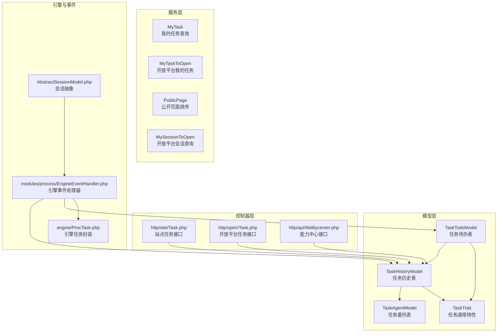
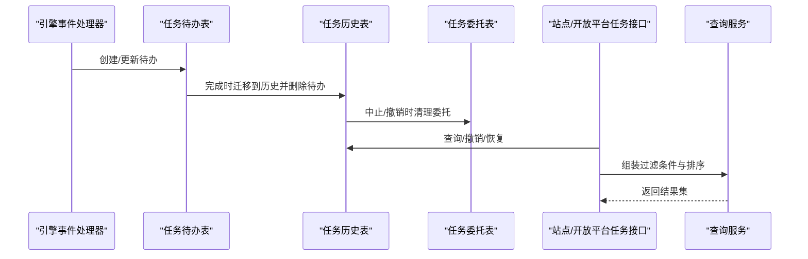
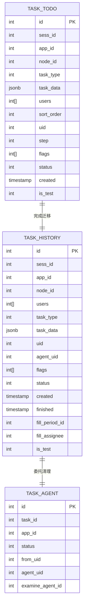
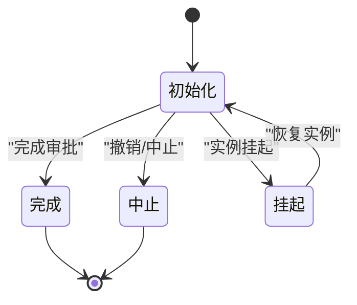
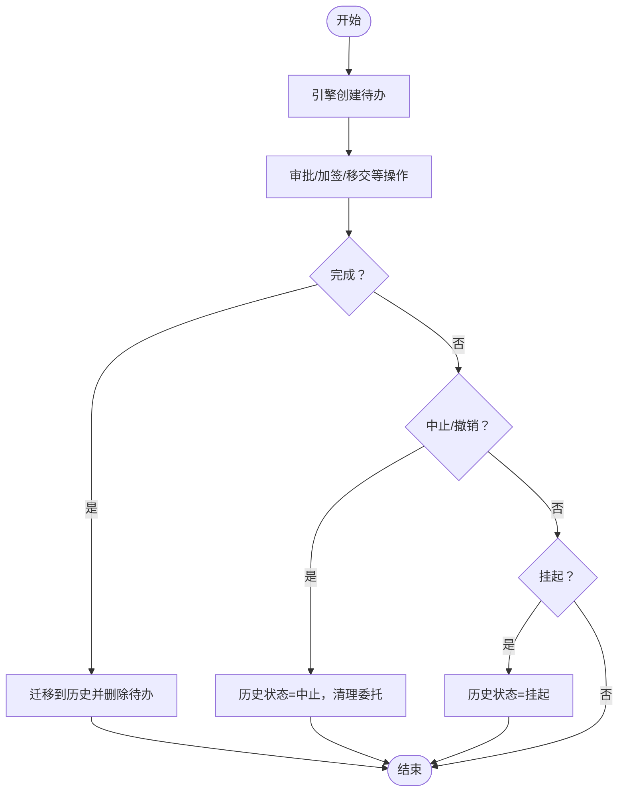
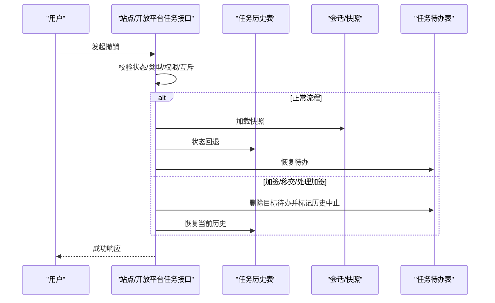
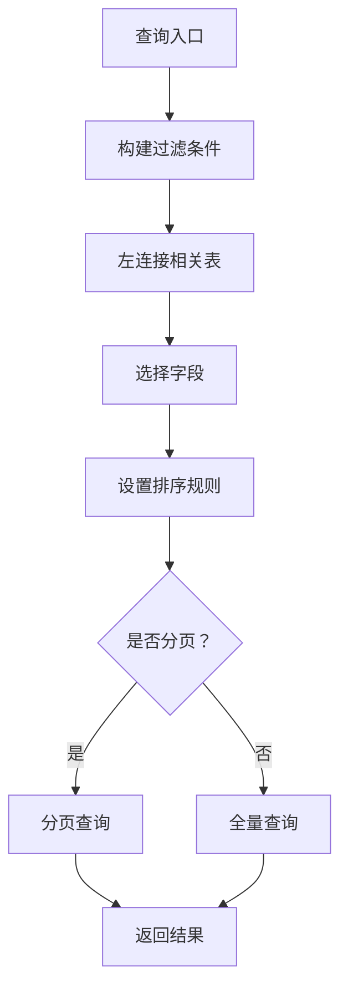
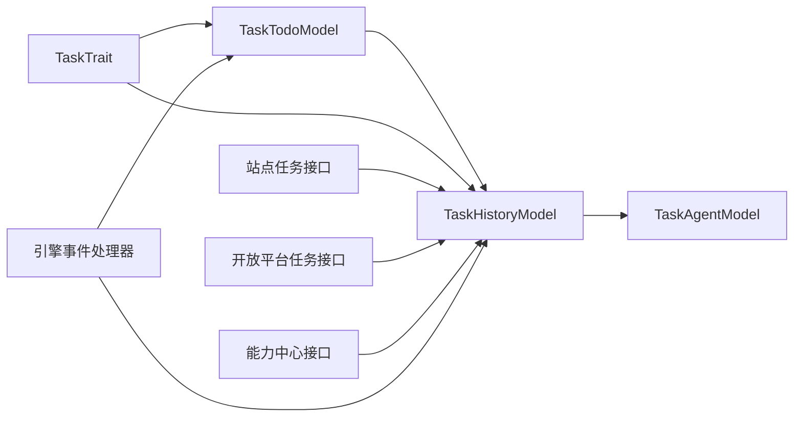

# 任务历史管理

<cite>
**本文引用的文件**
- [TaskHistoryModel.php](file://process/src/models/TaskHistoryModel.php)
- [TaskTodoModel.php](file://process/src/models/TaskTodoModel.php)
- [TaskAgentModel.php](file://process/src/models/TaskAgentModel.php)
- [TaskTrait.php](file://process/src/models/TaskTrait.php)
- [ProcTask.php](file://process/src/engine/ProcTask.php)
- [EngineEventHandler.php](file://process/src/modules/process/EngineEventHandler.php)
- [Task.php（站点）](file://process/src/http/site/Task.php)
- [Task.php（开放平台）](file://process/src/http/open/Task.php)
- [Abilitycenter.php](file://process/src/http/api/Abilitycenter.php)
- [MyTask.php](file://process/src/services/MyTask.php)
- [MyTaskToOpen.php](file://process/src/services/MyTaskToOpen.php)
- [PublicPage.php](file://process/src/services/PublicPage.php)
- [MySessionToOpen.php](file://process/src/services/MySessionToOpen.php)
- [migration_20240817_101927_suspend.php](file://process/src/migrations/migration_20240817_101927_suspend.php)
- [migration_20250330_193120_allow_self_examine.php](file://process/src/migrations/migration_20250330_193120_allow_self_examine.php)
- [AbstractSessionModel.php](file://process/src/models/AbstractSessionModel.php)
- [PushFinishFillTaskListener.php（gzucm）](file://process_envs/gzucm/product/listeners/PushFinishFillTaskListener.php)
- [PushFinishArchiveDelDataListener.php（tmmu）](file://process_envs/tmmu/product/listeners/PushFinishArchiveDelDataListener.php)
</cite>

## 目录
1. [引言](#引言)
2. [项目结构](#项目结构)
3. [核心组件](#核心组件)
4. [架构总览](#架构总览)
5. [详细组件分析](#详细组件分析)
6. [依赖关系分析](#依赖关系分析)
7. [性能考量](#性能考量)
8. [故障排查指南](#故障排查指南)
9. [结论](#结论)
10. [附录](#附录)

## 引言
本文件围绕“任务历史管理系统”进行系统化技术文档整理，重点覆盖以下方面：
- 任务历史记录的数据结构与字段语义
- 任务类型分类（流程任务、加签任务、填报任务）
- 状态管理与生命周期控制（初始化、完成、中止、挂起）
- 权限控制机制（审批人、委托人、监控人、测试用户）
- 回退（撤销）、重新执行与恢复机制
- 任务历史查询接口、过滤条件与排序规则
- 任务状态监控、异常处理与数据一致性保障

## 项目结构
任务历史管理涉及模型层、服务层与控制器层的协同：
- 模型层：任务待办与历史记录模型、任务委托模型、任务通用特性
- 服务层：我的任务查询、公开页面排序、开放平台会话查询
- 控制器层：站点与开放平台的任务接口，能力中心接口
- 引擎事件：引擎事件处理器对任务生命周期的关键节点进行联动

图表来源
- [TaskHistoryModel.php](file://process/src/models/TaskHistoryModel.php#L1-L120)
- [TaskTodoModel.php](file://process/src/models/TaskTodoModel.php#L1-L120)
- [TaskAgentModel.php](file://process/src/models/TaskAgentModel.php#L1-L47)
- [TaskTrait.php](file://process/src/models/TaskTrait.php#L1-L102)
- [ProcTask.php](file://process/src/engine/ProcTask.php#L1-L11)
- [EngineEventHandler.php](file://process/src/modules/process/EngineEventHandler.php#L46-L121)
- [Task.php（站点）](file://process/src/http/site/Task.php#L311-L338)
- [Task.php（开放平台）](file://process/src/http/open/Task.php#L106-L146)
- [Abilitycenter.php](file://process/src/http/api/Abilitycenter.php#L254-L290)
- [MyTask.php](file://process/src/services/MyTask.php#L501-L533)
- [MyTaskToOpen.php](file://process/src/services/MyTaskToOpen.php#L335-L375)
- [PublicPage.php](file://process/src/services/PublicPage.php#L145-L174)
- [MySessionToOpen.php](file://process/src/services/MySessionToOpen.php#L73-L112)

章节来源
- [TaskHistoryModel.php](file://process/src/models/TaskHistoryModel.php#L1-L120)
- [TaskTodoModel.php](file://process/src/models/TaskTodoModel.php#L1-L120)
- [EngineEventHandler.php](file://process/src/modules/process/EngineEventHandler.php#L46-L121)

## 核心组件
- 任务历史表（TaskHistoryModel）
  - 任务类型：流程任务、加签任务、填报任务
  - 状态：初始化、完成、中止、挂起
  - 关键字段：会话ID、应用ID、节点ID、任务类型、任务数据、参与者、发起人、委托人、标记、状态、创建/完成时间、填报期次、部门、测试标记等
  - 权限判定：审批人、委托人、监控人、测试用户
  - 生命周期方法：中止、恢复（revert）、撤销（回退）入口
- 任务待办表（TaskTodoModel）
  - 任务类型与历史一致
  - 状态：初始化、校验、完成、锁定、挂起
  - 标记：催办、驳回、超时、异常、重报、禁止收回、节点标记、会签加签等
  - 完成流程：更新历史、删除待办、通知申请人、智能审批状态更新
- 任务委托表（TaskAgentModel）
  - 记录委托关系与状态，完成时清理
- 任务通用特性（TaskTrait）
  - 提供节点、会话、应用访问器，以及变量解析（如审批链接、等待时间、剩余时间、人工号等）

章节来源
- [TaskHistoryModel.php](file://process/src/models/TaskHistoryModel.php#L1-L120)
- [TaskTodoModel.php](file://process/src/models/TaskTodoModel.php#L1-L120)
- [TaskAgentModel.php](file://process/src/models/TaskAgentModel.php#L1-L47)
- [TaskTrait.php](file://process/src/models/TaskTrait.php#L1-L102)

## 架构总览
任务历史管理贯穿“引擎事件 → 待办/历史模型 → 控制器接口 → 查询服务”的链路。

图表来源
- [EngineEventHandler.php](file://process/src/modules/process/EngineEventHandler.php#L93-L121)
- [TaskTodoModel.php](file://process/src/models/TaskTodoModel.php#L164-L211)
- [TaskHistoryModel.php](file://process/src/models/TaskHistoryModel.php#L100-L168)
- [TaskAgentModel.php](file://process/src/models/TaskAgentModel.php#L29-L47)
- [Task.php（站点）](file://process/src/http/site/Task.php#L311-L338)
- [MyTask.php](file://process/src/services/MyTask.php#L501-L533)

## 详细组件分析

### 数据结构与字段语义
- 任务历史表（TaskHistoryModel）
  - 任务类型：流程任务、加签任务、填报任务
  - 状态：初始化、完成、中止、挂起
  - 任务数据（task_data）：流程引擎任务ID、加签/移交来源UID、源任务ID、操作上下文、标记等
  - 关键字段：会话ID、应用ID、节点ID、参与者数组、发起人、委托人、标记数组、状态、创建/完成时间、填报期次、部门、测试标记
- 任务待办表（TaskTodoModel）
  - 任务类型与历史一致
  - 状态：初始化、校验、完成、锁定、挂起
  - 标记：催办、驳回、超时、异常、重报、禁止收回、节点标记、会签加签等
  - 任务数据（task_data）：流程引擎任务ID、加签/移交来源UID、源任务ID、操作上下文、标记等
- 任务委托表（TaskAgentModel）
  - 字段：任务ID、应用ID、状态、委托人、受托人、审批委托ID

图表来源
- [TaskHistoryModel.php](file://process/src/models/TaskHistoryModel.php#L24-L64)
- [TaskTodoModel.php](file://process/src/models/TaskTodoModel.php#L46-L87)
- [TaskAgentModel.php](file://process/src/models/TaskAgentModel.php#L11-L20)

章节来源
- [TaskHistoryModel.php](file://process/src/models/TaskHistoryModel.php#L24-L64)
- [TaskTodoModel.php](file://process/src/models/TaskTodoModel.php#L46-L87)
- [TaskAgentModel.php](file://process/src/models/TaskAgentModel.php#L11-L20)

### 任务类型分类与状态管理
- 任务类型
  - 流程任务：由引擎任务驱动，包含流程引擎任务ID
  - 加签任务：包含加签来源UID、源任务ID、目标任务ID等
  - 填报任务：与填报期次、部门相关
- 状态管理
  - 初始化：待处理
  - 完成：审批完成，写入完成时间
  - 中止：流程中止或撤销，写入完成时间并清理委托
  - 挂起：实例挂起时批量挂起任务

图表来源
- [TaskTodoModel.php](file://process/src/models/TaskTodoModel.php#L16-L21)
- [TaskHistoryModel.php](file://process/src/models/TaskHistoryModel.php#L19-L23)
- [migration_20240817_101927_suspend.php](file://process/src/migrations/migration_20240817_101927_suspend.php#L12-L17)

章节来源
- [TaskTodoModel.php](file://process/src/models/TaskTodoModel.php#L16-L21)
- [TaskHistoryModel.php](file://process/src/models/TaskHistoryModel.php#L19-L23)
- [migration_20240817_101927_suspend.php](file://process/src/migrations/migration_20240817_101927_suspend.php#L12-L17)

### 生命周期控制与权限控制
- 生命周期关键点
  - 创建：引擎事件创建待办
  - 完成：待办迁移到历史并删除自身
  - 中止：历史状态更新为中止，清理委托
  - 撤销（回退）：从历史恢复到待办，必要时回滚引擎快照
- 权限控制
  - 审批人：参与者数组或发起人
  - 委托人：委托关系有效且状态为初始化
  - 监控人：会话具备流程监控权限
  - 测试用户：测试数据下允许测试用户访问

图表来源
- [EngineEventHandler.php](file://process/src/modules/process/EngineEventHandler.php#L93-L121)
- [TaskTodoModel.php](file://process/src/models/TaskTodoModel.php#L164-L211)
- [TaskHistoryModel.php](file://process/src/models/TaskHistoryModel.php#L100-L168)
- [TaskAgentModel.php](file://process/src/models/TaskAgentModel.php#L29-L47)

章节来源
- [TaskHistoryModel.php](file://process/src/models/TaskHistoryModel.php#L71-L86)
- [TaskTodoModel.php](file://process/src/models/TaskTodoModel.php#L213-L226)
- [TaskAgentModel.php](file://process/src/models/TaskAgentModel.php#L38-L47)

### 回退（撤销）、撤销与重新执行
- 回退（撤销）入口
  - 站点接口：校验状态、任务类型、权限、是否允许收回、互斥锁、快照一致性
  - 开放平台接口：逻辑与站点一致
  - 能力中心接口：事务包裹，记录撤销日志
- 回退分支
  - 正常流程：加载快照、历史状态回退、删除历史中的加签/待处理任务、恢复待办
  - 加签/移交/处理加签：检查目标任务是否存在，存在则删除目标任务并标记其为中止，再恢复当前历史任务

图表来源
- [Task.php（站点）](file://process/src/http/site/Task.php#L311-L338)
- [Task.php（开放平台）](file://process/src/http/open/Task.php#L106-L146)
- [Abilitycenter.php](file://process/src/http/api/Abilitycenter.php#L254-L290)
- [TaskHistoryModel.php](file://process/src/models/TaskHistoryModel.php#L131-L168)
- [TaskTodoModel.php](file://process/src/models/TaskTodoModel.php#L164-L211)

章节来源
- [Task.php（站点）](file://process/src/http/site/Task.php#L311-L338)
- [Task.php（开放平台）](file://process/src/http/open/Task.php#L106-L146)
- [Abilitycenter.php](file://process/src/http/api/Abilitycenter.php#L254-L290)
- [TaskHistoryModel.php](file://process/src/models/TaskHistoryModel.php#L131-L168)

### 任务历史查询接口、过滤条件与排序规则
- 我的任务（历史）
  - 过滤条件：任务类型（流程任务）、非测试、非迁移数据、实例状态有效、时间范围、应用名、任务名、推送状态、会话ID、任务ID
  - 排序规则：按历史ID降序，推送日志ID降序；支持按完成时间、接收时间、自定义排序
- 开放平台我的任务
  - 过滤条件：关键词（姓名/工号/任务名）、时间范围、完成时间、任务类型、是否历史
  - 排序规则：根据任务类型决定是否使用自定义排序
- 公开页面排序
  - 支持按任务创建时间、完成时间、自定义排序字段
- 会话查询（开放平台）
  - 过滤条件：任务类型、关键词、时间范围、完成时间等

图表来源
- [MyTask.php](file://process/src/services/MyTask.php#L501-L533)
- [MyTaskToOpen.php](file://process/src/services/MyTaskToOpen.php#L335-L375)
- [PublicPage.php](file://process/src/services/PublicPage.php#L145-L174)
- [MySessionToOpen.php](file://process/src/services/MySessionToOpen.php#L73-L112)
- [TaskHistoryModel.php](file://process/src/models/TaskHistoryModel.php#L181-L269)

章节来源
- [MyTask.php](file://process/src/services/MyTask.php#L501-L533)
- [MyTaskToOpen.php](file://process/src/services/MyTaskToOpen.php#L335-L375)
- [PublicPage.php](file://process/src/services/PublicPage.php#L145-L174)
- [MySessionToOpen.php](file://process/src/services/MySessionToOpen.php#L73-L112)
- [TaskHistoryModel.php](file://process/src/models/TaskHistoryModel.php#L181-L269)

### 任务状态监控与异常处理
- 状态监控
  - 挂起：批量将实例挂起对应的历史任务置为挂起
  - 自查：允许自查配置迁移
- 异常处理
  - 完成时事务内发送通知、更新智能审批状态
  - 引擎事件中捕获异常并回滚，同时设置会话标志位
- 数据一致性
  - 事务包裹撤销流程，确保历史/待办/委托状态一致
  - 快照一致性校验，防止并发撤销导致的状态错乱

章节来源
- [migration_20240817_101927_suspend.php](file://process/src/migrations/migration_20240817_101927_suspend.php#L12-L17)
- [migration_20250330_193120_allow_self_examine.php](file://process/src/migrations/migration_20250330_193120_allow_self_examine.php#L11-L15)
- [TaskTodoModel.php](file://process/src/models/TaskTodoModel.php#L193-L211)
- [Task.php（站点）](file://process/src/http/site/Task.php#L269-L338)
- [EngineEventHandler.php](file://process/src/modules/process/EngineEventHandler.php#L46-L84)

### 填报任务与推送监听
- 填报任务状态与推送
  - 填报任务完成时，不同机构监听器推送任务完成数据，包含实例ID、任务ID、节点ID、状态、时间等
- 状态映射
  - 不同监听器对任务状态的映射可能不同，需结合业务配置

章节来源
- [PushFinishFillTaskListener.php（gzucm）](file://process_envs/gzucm/product/listeners/PushFinishFillTaskListener.php#L62-L94)
- [PushFinishArchiveDelDataListener.php（tmmu）](file://process_envs/tmmu/product/listeners/PushFinishArchiveDelDataListener.php#L65-L95)

## 依赖关系分析
- 模型间依赖
  - TaskTodoModel 完成后写入 TaskHistoryModel 并删除自身
  - TaskHistoryModel 中止/撤销时清理 TaskAgentModel
  - TaskTrait 为两类模型提供通用访问器与变量解析
- 控制器依赖
  - 站点/开放平台任务接口依赖 TaskHistoryModel 的回退逻辑
  - 查询服务依赖 TaskHistoryModel 的联表查询能力
- 引擎事件依赖
  - 引擎事件处理器在任务创建/中止/结束时联动更新会话与消息

图表来源
- [TaskTodoModel.php](file://process/src/models/TaskTodoModel.php#L164-L211)
- [TaskHistoryModel.php](file://process/src/models/TaskHistoryModel.php#L100-L168)
- [TaskAgentModel.php](file://process/src/models/TaskAgentModel.php#L29-L47)
- [TaskTrait.php](file://process/src/models/TaskTrait.php#L35-L102)
- [Task.php（站点）](file://process/src/http/site/Task.php#L311-L338)
- [Task.php（开放平台）](file://process/src/http/open/Task.php#L106-L146)
- [Abilitycenter.php](file://process/src/http/api/Abilitycenter.php#L254-L290)
- [EngineEventHandler.php](file://process/src/modules/process/EngineEventHandler.php#L93-L121)

章节来源
- [TaskTodoModel.php](file://process/src/models/TaskTodoModel.php#L164-L211)
- [TaskHistoryModel.php](file://process/src/models/TaskHistoryModel.php#L100-L168)
- [TaskAgentModel.php](file://process/src/models/TaskAgentModel.php#L29-L47)
- [TaskTrait.php](file://process/src/models/TaskTrait.php#L35-L102)
- [EngineEventHandler.php](file://process/src/modules/process/EngineEventHandler.php#L93-L121)

## 性能考量
- 查询优化
  - 历史查询采用左连接与条件裁剪，避免不必要的字段读取
  - 对高频过滤字段建立索引（如会话ID、任务ID、状态、创建时间）
- 并发控制
  - 互斥锁用于防止并发撤销导致的状态错乱
  - 事务包裹关键路径，确保一致性
- 缓存与变量
  - 会话变量缓存减少重复查询
  - 节点配置缓存提升权限与超时判断效率

## 故障排查指南
- 撤销失败
  - 检查任务是否已完成、是否为填报任务、是否允许收回、是否被他人修改、是否处于挂起状态
  - 核对快照一致性与目标任务是否存在
- 状态异常
  - 挂起/中止后未正确恢复：检查迁移脚本与事件处理器
  - 委托未清理：确认历史中止/撤销流程是否执行
- 查询无结果
  - 核对过滤条件（测试数据、迁移数据、实例状态、时间范围、关键词）
  - 检查排序字段是否合法

章节来源
- [Task.php（站点）](file://process/src/http/site/Task.php#L311-L338)
- [Task.php（开放平台）](file://process/src/http/open/Task.php#L106-L146)
- [Abilitycenter.php](file://process/src/http/api/Abilitycenter.php#L254-L290)
- [migration_20240817_101927_suspend.php](file://process/src/migrations/migration_20240817_101927_suspend.php#L12-L17)
- [TaskHistoryModel.php](file://process/src/models/TaskHistoryModel.php#L100-L168)

## 结论
本系统通过“待办→历史”的双表设计与严格的生命周期控制，实现了对流程任务、加签任务与填报任务的统一管理。配合完善的权限控制、撤销回退机制、查询过滤与排序规则，以及状态监控与异常处理，能够满足复杂场景下的任务历史管理需求。建议在生产环境中持续完善索引策略、并发控制与监控告警，以进一步提升稳定性与可维护性。

## 附录
- 术语
  - 会话：一次流程实例的运行上下文
  - 历史任务：已完成或中止的任务记录
  - 待办任务：尚未完成的任务
  - 委托：受托人代理审批的委托关系
- 参考实现位置
  - 任务历史查询：[TaskHistoryModel.php](file://process/src/models/TaskHistoryModel.php#L181-L269)
  - 我的任务查询：[MyTask.php](file://process/src/services/MyTask.php#L501-L533)
  - 开放平台我的任务：[MyTaskToOpen.php](file://process/src/services/MyTaskToOpen.php#L335-L375)
  - 公开页面排序：[PublicPage.php](file://process/src/services/PublicPage.php#L145-L174)
  - 会话查询：[MySessionToOpen.php](file://process/src/services/MySessionToOpen.php#L73-L112)
  - 引擎事件：[EngineEventHandler.php](file://process/src/modules/process/EngineEventHandler.php#L93-L121)