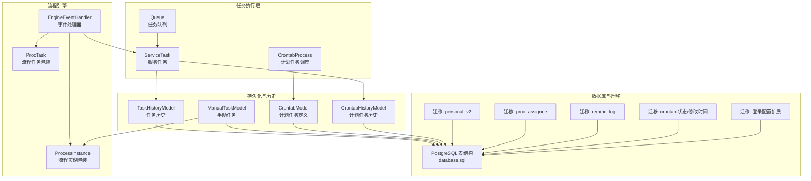
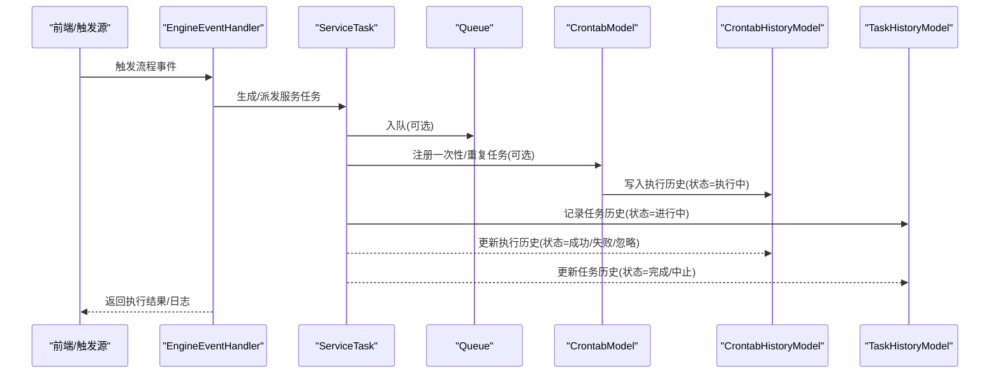
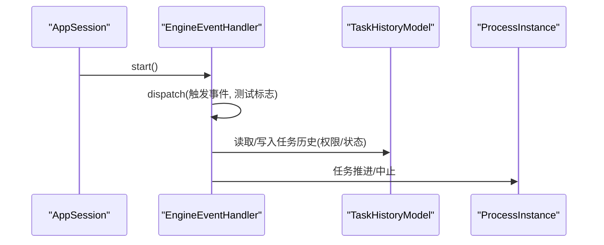
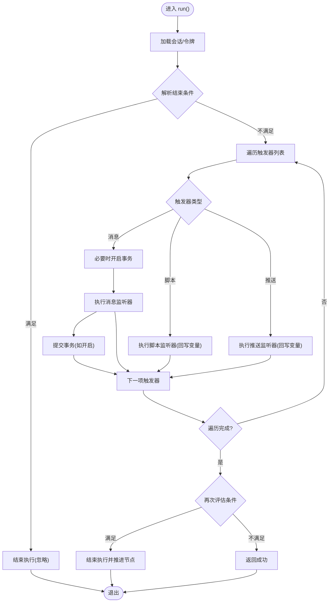
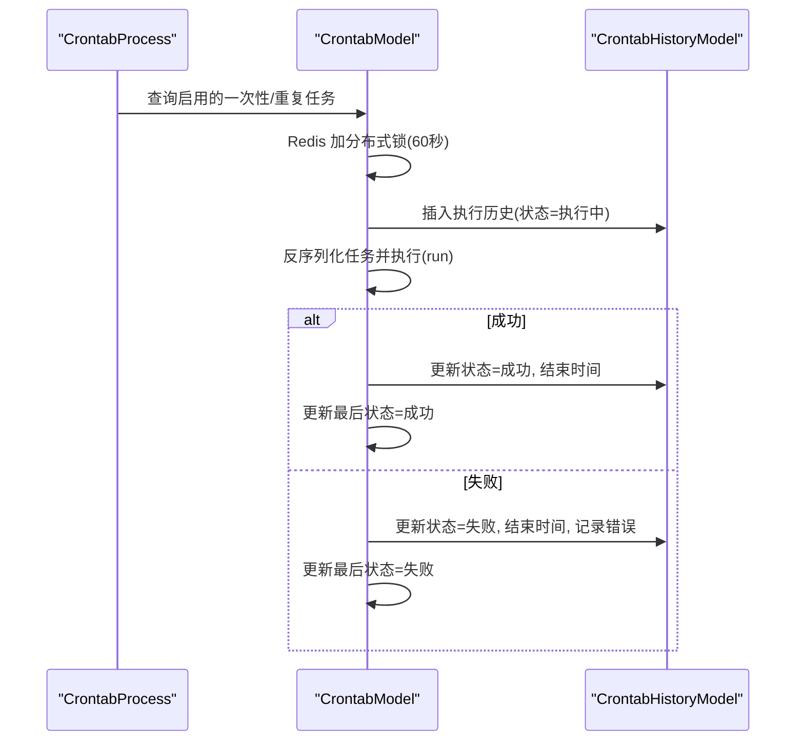
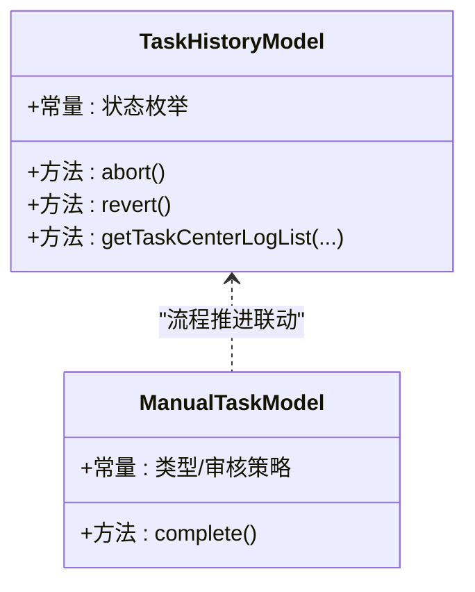
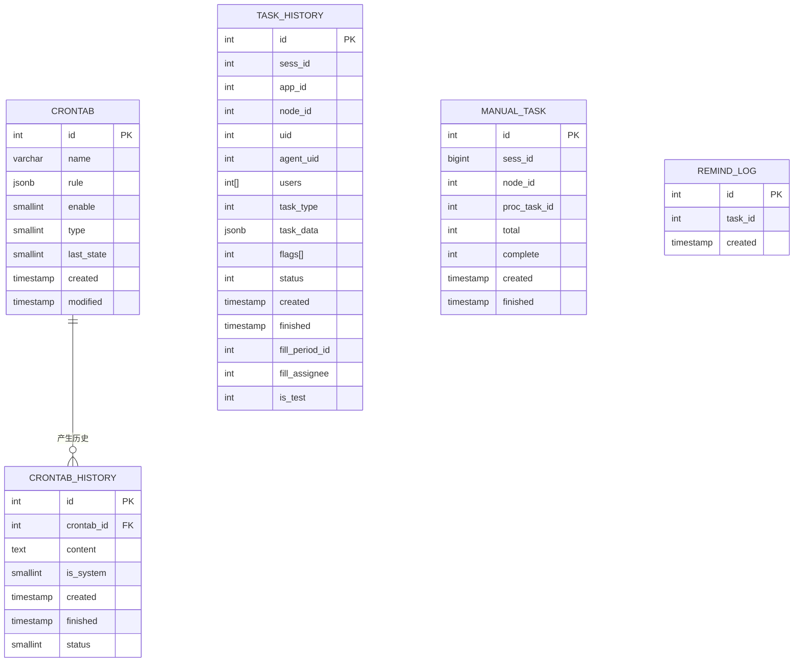
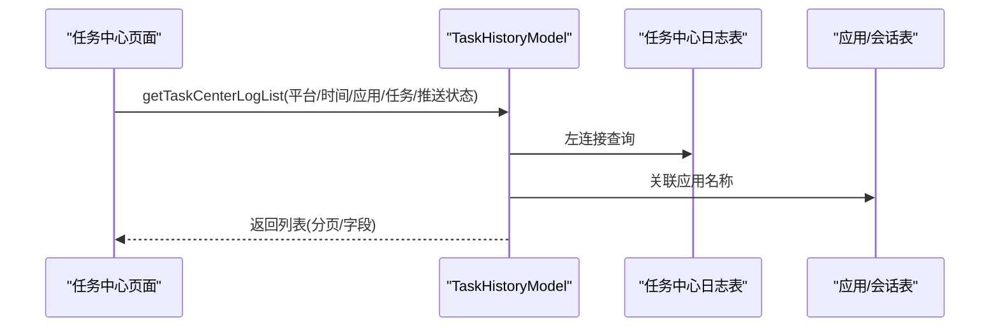
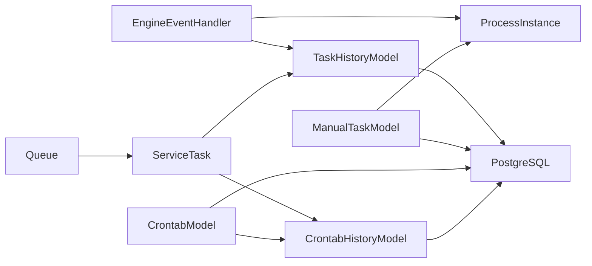

# 任务监控系统

<cite>
**本文引用的文件**
- [EngineEventHandler.php](file://process/src/modules/process/EngineEventHandler.php)
- [Queue.php](file://process/src/components/Queue.php)
- [ServiceTask.php](file://process/src/services/task/ServiceTask.php)
- [CrontabModel.php](file://process/src/models/CrontabModel.php)
- [CrontabHistoryModel.php](file://process/src/models/CrontabHistoryModel.php)
- [CrontabProcess.php](file://process/src/services/crontab/CrontabProcess.php)
- [TaskHistoryModel.php](file://process/src/models/TaskHistoryModel.php)
- [ManualTaskModel.php](file://process/src/models/ManualTaskModel.php)
- [ProcTask.php](file://process/src/engine/ProcTask.php)
- [ProcessInstance.php](file://process/src/engine/ProcessInstance.php)
- [database.sql](file://process/docs/sql/database.sql)
- [migration_20250730_102435_personal_v2.php](file://process/src/migrations/migration_20250730_102435_personal_v2.php)
- [migration_20251119_090014_proc_assignee.php](file://process/src/migrations/migration_20251119_090014_proc_assignee.php)
- [migration_20250416_remind.php](file://process/src/migrations/migration_20250416_remind.php)
- [migration_20230703_105223_crontab_add_state.php](file://process/src/migrations/migration_20230703_105223_crontab_add_state.php)
- [migration_20230702_162124_crontab_add_modified.php](file://process/src/migrations/migration_20230702_162124_crontab_add_modified.php)
- [migration_20250904_112321_login_config.php](file://process/src/migrations/migration_20250904_112321_login_config.php)
- [MapConfigModel.php](file://process/src/models/MapConfigModel.php)
- [ValidateListener.php](file://process/src/services/listeners/ValidateListener.php)
</cite>

## 目录
1. [引言](#引言)
2. [项目结构](#项目结构)
3. [核心组件](#核心组件)
4. [架构总览](#架构总览)
5. [详细组件分析](#详细组件分析)
6. [依赖关系分析](#依赖关系分析)
7. [性能考量](#性能考量)
8. [故障排查指南](#故障排查指南)
9. [结论](#结论)
10. [附录](#附录)

## 引言
本文件面向 htdNew 项目的任务监控系统，围绕任务生命周期监控、执行状态跟踪与性能指标采集展开，覆盖任务历史记录管理、执行日志存储、异常告警机制，以及任务中心日志、审核流程与统计分析能力。文档同时给出监控指标定义、告警规则配置思路与可视化展示方案，并提供监控配置指南、故障诊断方法与性能调优建议。

## 项目结构
任务监控系统由“流程引擎事件处理器”“任务队列与服务任务”“计划任务与历史记录”“任务历史与手动任务模型”“数据库与迁移脚本”“前端导航配置与校验监听器”等模块协同构成。整体采用“事件驱动 + 队列/计划任务 + 历史归档 + 统计报表”的架构模式。

图表来源
- [EngineEventHandler.php](file://process/src/modules/process/EngineEventHandler.php#L1-L51)
- [Queue.php](file://process/src/components/Queue.php#L1-L173)
- [ServiceTask.php](file://process/src/services/task/ServiceTask.php#L1-L222)
- [CrontabProcess.php](file://process/src/services/crontab/CrontabProcess.php#L1-L46)
- [CrontabModel.php](file://process/src/models/CrontabModel.php#L1-L223)
- [CrontabHistoryModel.php](file://process/src/models/CrontabHistoryModel.php#L1-L40)
- [TaskHistoryModel.php](file://process/src/models/TaskHistoryModel.php#L1-L270)
- [ManualTaskModel.php](file://process/src/models/ManualTaskModel.php#L1-L47)
- [database.sql](file://process/docs/sql/database.sql#L434-L465)
- [migration_20250730_102435_personal_v2.php](file://process/src/migrations/migration_20250730_102435_personal_v2.php#L123-L148)
- [migration_20251119_090014_proc_assignee.php](file://process/src/migrations/migration_20251119_090014_proc_assignee.php#L1-L32)
- [migration_20250416_remind.php](file://process/src/migrations/migration_20250416_remind.php#L1-L24)
- [migration_20230703_105223_crontab_add_state.php](file://process/src/migrations/migration_20230703_105223_crontab_add_state.php#L1-L25)
- [migration_20230702_162124_crontab_add_modified.php](file://process/src/migrations/migration_20230702_162124_crontab_add_modified.php#L1-L19)
- [migration_20250904_112321_login_config.php](file://process/src/migrations/migration_20250904_112321_login_config.php#L33-L71)

章节来源
- [EngineEventHandler.php](file://process/src/modules/process/EngineEventHandler.php#L1-L51)
- [Queue.php](file://process/src/components/Queue.php#L1-L173)
- [ServiceTask.php](file://process/src/services/task/ServiceTask.php#L1-L222)
- [CrontabProcess.php](file://process/src/services/crontab/CrontabProcess.php#L1-L46)
- [CrontabModel.php](file://process/src/models/CrontabModel.php#L1-L223)
- [CrontabHistoryModel.php](file://process/src/models/CrontabHistoryModel.php#L1-L40)
- [TaskHistoryModel.php](file://process/src/models/TaskHistoryModel.php#L1-L270)
- [ManualTaskModel.php](file://process/src/models/ManualTaskModel.php#L1-L47)
- [database.sql](file://process/docs/sql/database.sql#L434-L465)
- [migration_20250730_102435_personal_v2.php](file://process/src/migrations/migration_20250730_102435_personal_v2.php#L123-L148)
- [migration_20251119_090014_proc_assignee.php](file://process/src/migrations/migration_20251119_090014_proc_assignee.php#L1-L32)
- [migration_20250416_remind.php](file://process/src/migrations/migration_20250416_remind.php#L1-L24)
- [migration_20230703_105223_crontab_add_state.php](file://process/src/migrations/migration_20230703_105223_crontab_add_state.php#L1-L25)
- [migration_20230702_162124_crontab_add_modified.php](file://process/src/migrations/migration_20230702_162124_crontab_add_modified.php#L1-L19)
- [migration_20250904_112321_login_config.php](file://process/src/migrations/migration_20250904_112321_login_config.php#L33-L71)

## 核心组件
- 流程引擎事件处理器：负责在流程启动、任务中断等关键节点派发事件，联动任务中心日志与审核权限判定。
- 任务队列与服务任务：通过队列承载异步任务，服务任务按触发器类型执行消息、脚本、推送等动作，并支持条件判断与变量回写。
- 计划任务与历史记录：定义一次性/重复性任务，执行时落库记录历史，带状态机与去重锁。
- 任务历史与手动任务：记录流程任务全生命周期，支持撤销、恢复、测试过滤、任务中心日志联查；手动任务支持完成态回写并推进流程。
- 数据库与迁移：提供任务中心日志、提醒日志、统计表、计划任务表及索引等结构支撑。

章节来源
- [EngineEventHandler.php](file://process/src/modules/process/EngineEventHandler.php#L1-L51)
- [Queue.php](file://process/src/components/Queue.php#L1-L173)
- [ServiceTask.php](file://process/src/services/task/ServiceTask.php#L1-L222)
- [CrontabModel.php](file://process/src/models/CrontabModel.php#L1-L223)
- [CrontabHistoryModel.php](file://process/src/models/CrontabHistoryModel.php#L1-L40)
- [TaskHistoryModel.php](file://process/src/models/TaskHistoryModel.php#L1-L270)
- [ManualTaskModel.php](file://process/src/models/ManualTaskModel.php#L1-L47)

## 架构总览
任务监控系统以“事件驱动 + 队列/计划任务 + 历史归档 + 统计报表”为核心，形成从任务创建、执行、推进、完成/中止到历史归档与统计分析的闭环。

图表来源
- [EngineEventHandler.php](file://process/src/modules/process/EngineEventHandler.php#L1-L51)
- [ServiceTask.php](file://process/src/services/task/ServiceTask.php#L1-L222)
- [Queue.php](file://process/src/components/Queue.php#L1-L173)
- [CrontabModel.php](file://process/src/models/CrontabModel.php#L1-L223)
- [CrontabHistoryModel.php](file://process/src/models/CrontabHistoryModel.php#L1-L40)
- [TaskHistoryModel.php](file://process/src/models/TaskHistoryModel.php#L1-L270)

## 详细组件分析

### 事件处理器与任务生命周期
- 作用：在流程启动、任务中断等节点派发事件，联动任务中心日志与权限判定。
- 关键点：弱引用持有会话，派发事件携带触发数据上下文；任务中止时更新历史与待办。

图表来源
- [EngineEventHandler.php](file://process/src/modules/process/EngineEventHandler.php#L1-L51)
- [TaskHistoryModel.php](file://process/src/models/TaskHistoryModel.php#L1-L270)
- [ProcessInstance.php](file://process/src/engine/ProcessInstance.php#L1-L11)

章节来源
- [EngineEventHandler.php](file://process/src/modules/process/EngineEventHandler.php#L1-L51)
- [TaskHistoryModel.php](file://process/src/models/TaskHistoryModel.php#L1-L270)
- [ProcessInstance.php](file://process/src/engine/ProcessInstance.php#L1-L11)

### 任务队列与服务任务
- 作用：统一承载任务序列化、入队、出队与执行；服务任务按触发器类型执行消息、脚本、推送等动作。
- 关键点：支持条件判断、事务控制、变量回写、异常捕获与同步/异步策略。

图表来源
- [ServiceTask.php](file://process/src/services/task/ServiceTask.php#L1-L222)

章节来源
- [Queue.php](file://process/src/components/Queue.php#L1-L173)
- [ServiceTask.php](file://process/src/services/task/ServiceTask.php#L1-L222)

### 计划任务与历史记录
- 作用：定义一次性/重复性任务，执行时写入历史记录，带状态机与去重锁，失败/成功/忽略状态分别记录。
- 关键点：Redis 锁避免重复执行；单次任务执行后禁用；历史记录包含开始/结束时间与状态。

图表来源
- [CrontabProcess.php](file://process/src/services/crontab/CrontabProcess.php#L1-L46)
- [CrontabModel.php](file://process/src/models/CrontabModel.php#L1-L223)
- [CrontabHistoryModel.php](file://process/src/models/CrontabHistoryModel.php#L1-L40)

章节来源
- [CrontabProcess.php](file://process/src/services/crontab/CrontabProcess.php#L1-L46)
- [CrontabModel.php](file://process/src/models/CrontabModel.php#L1-L223)
- [CrontabHistoryModel.php](file://process/src/models/CrontabHistoryModel.php#L1-L40)

### 任务历史与手动任务
- 作用：记录流程任务全生命周期，支持撤销、恢复、测试过滤、任务中心日志联查；手动任务完成态回写并推进流程。
- 关键点：任务历史表含状态、创建/完成时间、用户与代理信息；手动任务表含进度与完成时间。

图表来源
- [TaskHistoryModel.php](file://process/src/models/TaskHistoryModel.php#L1-L270)
- [ManualTaskModel.php](file://process/src/models/ManualTaskModel.php#L1-L47)

章节来源
- [TaskHistoryModel.php](file://process/src/models/TaskHistoryModel.php#L1-L270)
- [ManualTaskModel.php](file://process/src/models/ManualTaskModel.php#L1-L47)

### 数据库与迁移
- 作用：提供任务中心日志、提醒日志、统计表、计划任务表及索引等结构支撑。
- 关键点：统计表包含应用/节点/用户的任务量与时长统计；计划任务表含规则、状态与修改时间；提醒日志用于追踪提醒行为。

图表来源
- [database.sql](file://process/docs/sql/database.sql#L434-L465)
- [database.sql](file://process/docs/sql/database.sql#L1313-L1379)
- [migration_20250730_102435_personal_v2.php](file://process/src/migrations/migration_20250730_102435_personal_v2.php#L123-L148)
- [migration_20251119_090014_proc_assignee.php](file://process/src/migrations/migration_20251119_090014_proc_assignee.php#L1-L32)
- [migration_20250416_remind.php](file://process/src/migrations/migration_20250416_remind.php#L1-L24)
- [migration_20230703_105223_crontab_add_state.php](file://process/src/migrations/migration_20230703_105223_crontab_add_state.php#L1-L25)
- [migration_20230702_162124_crontab_add_modified.php](file://process/src/migrations/migration_20230702_162124_crontab_add_modified.php#L1-L19)

章节来源
- [database.sql](file://process/docs/sql/database.sql#L434-L465)
- [database.sql](file://process/docs/sql/database.sql#L1313-L1379)
- [migration_20250730_102435_personal_v2.php](file://process/src/migrations/migration_20250730_102435_personal_v2.php#L123-L148)
- [migration_20251119_090014_proc_assignee.php](file://process/src/migrations/migration_20251119_090014_proc_assignee.php#L1-L32)
- [migration_20250416_remind.php](file://process/src/migrations/migration_20250416_remind.php#L1-L24)
- [migration_20230703_105223_crontab_add_state.php](file://process/src/migrations/migration_20230703_105223_crontab_add_state.php#L1-L25)
- [migration_20230702_162124_crontab_add_modified.php](file://process/src/migrations/migration_20230702_162124_crontab_add_modified.php#L1-L19)

### 任务中心日志、审核流程与统计分析
- 任务中心日志：通过任务历史表与任务中心日志表联查，支持按平台、应用、任务名、推送状态、时间范围等筛选。
- 审核流程：任务历史表提供权限判定方法，支持测试数据过滤与流程监控权限。
- 统计分析：提供应用/节点/用户维度的统计表，包含待办/完成数量、时长、最大/最小耗时等字段。

图表来源
- [TaskHistoryModel.php](file://process/src/models/TaskHistoryModel.php#L170-L270)

章节来源
- [TaskHistoryModel.php](file://process/src/models/TaskHistoryModel.php#L1-L270)
- [database.sql](file://process/docs/sql/database.sql#L1313-L1379)
- [MapConfigModel.php](file://process/src/models/MapConfigModel.php#L391-L397)

### 异常告警机制
- 计划任务异常：执行失败时记录历史并更新最后状态；可通过状态字段触发告警。
- 校验监听器异常：验证失败抛出用户异常或弹框异常，便于前端提示与审计。
- 登录配置扩展：通知发送明细与变更日志表可用于追踪告警发送链路。

章节来源
- [CrontabModel.php](file://process/src/models/CrontabModel.php#L162-L216)
- [CrontabHistoryModel.php](file://process/src/models/CrontabHistoryModel.php#L1-L40)
- [ValidateListener.php](file://process/src/services/listeners/ValidateListener.php#L1-L48)
- [migration_20250904_112321_login_config.php](file://process/src/migrations/migration_20250904_112321_login_config.php#L33-L71)

## 依赖关系分析
- 组件耦合：事件处理器依赖会话与模型；服务任务依赖触发器与上下文；队列依赖序列化工具；计划任务依赖模型与历史记录。
- 外部依赖：Redis 用于队列与分布式锁；PostgreSQL 存储任务历史、计划任务与统计表。
- 循环依赖：未见明显循环依赖；各模块职责清晰。

图表来源
- [EngineEventHandler.php](file://process/src/modules/process/EngineEventHandler.php#L1-L51)
- [ServiceTask.php](file://process/src/services/task/ServiceTask.php#L1-L222)
- [Queue.php](file://process/src/components/Queue.php#L1-L173)
- [CrontabModel.php](file://process/src/models/CrontabModel.php#L1-L223)
- [CrontabHistoryModel.php](file://process/src/models/CrontabHistoryModel.php#L1-L40)
- [TaskHistoryModel.php](file://process/src/models/TaskHistoryModel.php#L1-L270)
- [ManualTaskModel.php](file://process/src/models/ManualTaskModel.php#L1-L47)

## 性能考量
- 队列与序列化：队列采用序列化入队，减少跨进程传输开销；对复杂对象进行编码/解码，注意构造函数参数默认值要求。
- 计划任务去重：Redis 分布式锁避免重复执行，建议锁时长与任务最长执行时间匹配。
- 索引优化：个人任务与手动任务表包含 sess_id、uid、users(GIN)、data_table_id 等索引，提升查询性能。
- 日志与统计：统计表按天/节点/用户聚合，建议定期清理历史数据并维护索引。

章节来源
- [Queue.php](file://process/src/components/Queue.php#L1-L173)
- [CrontabModel.php](file://process/src/models/CrontabModel.php#L162-L216)
- [migration_20250730_102435_personal_v2.php](file://process/src/migrations/migration_20250730_102435_personal_v2.php#L123-L148)

## 故障排查指南
- 任务未执行/重复执行
  - 检查 Redis 分布式锁是否生效与过期时间是否合理。
  - 查看计划任务表 last_state 与历史记录状态。
- 服务任务异常
  - 捕获异常并记录日志；检查触发器类型与参数格式；确认事务边界与变量回写。
- 任务历史缺失/权限问题
  - 校验任务历史表字段与权限判定方法；确认测试数据过滤开关。
- 队列积压
  - 检查消费者数量配置与主题长度；确认任务序列化兼容性。

章节来源
- [CrontabModel.php](file://process/src/models/CrontabModel.php#L162-L216)
- [ServiceTask.php](file://process/src/services/task/ServiceTask.php#L1-L222)
- [TaskHistoryModel.php](file://process/src/models/TaskHistoryModel.php#L1-L270)
- [Queue.php](file://process/src/components/Queue.php#L1-L173)

## 结论
本任务监控系统通过事件驱动、队列与计划任务相结合的方式，实现了任务生命周期的完整可观测性与可追溯性。配合任务历史、手动任务、提醒日志与统计表，能够满足任务中心日志、审核流程与统计分析需求。建议结合状态机与索引策略持续优化性能，并完善告警规则与可视化看板。

## 附录

### 监控指标定义
- 任务执行指标
  - 任务成功率：成功/总执行次数
  - 任务平均耗时：任务完成时间-创建时间的均值
  - 任务失败率：失败/总执行次数
  - 任务忽略率：忽略/总执行次数
- 计划任务指标
  - 计划任务命中率：按规则应执行但未执行次数
  - 计划任务延迟：实际执行时间-计划时间
- 统计分析指标
  - 应用维度：申请数、完成数、进行中数、撤销/终止数
  - 节点维度：待审批数、审批次数、审批时长、最大/最小耗时
  - 用户维度：审批次数、日均审批次数、审批时长、最大/最小耗时

章节来源
- [database.sql](file://process/docs/sql/database.sql#L1313-L1379)

### 告警规则配置（示例）
- 计划任务连续失败阈值：如连续失败超过 N 次，触发告警。
- 任务超时阈值：如平均耗时超过 T 秒，触发告警。
- 队列积压阈值：如主题长度超过 M，触发告警。
- 任务忽略率阈值：如忽略率超过 P%，触发告警。

章节来源
- [CrontabHistoryModel.php](file://process/src/models/CrontabHistoryModel.php#L1-L40)
- [CrontabModel.php](file://process/src/models/CrontabModel.php#L1-L223)

### 可视化展示方案
- 仪表盘：展示任务成功率、失败率、平均耗时、队列长度。
- 折线图：展示应用/节点/用户维度的审批趋势。
- 热力图：展示不同时间段的任务分布与峰值。
- 日志面板：展示任务中心日志与提醒日志，支持筛选与导出。

章节来源
- [MapConfigModel.php](file://process/src/models/MapConfigModel.php#L391-L397)
- [TaskHistoryModel.php](file://process/src/models/TaskHistoryModel.php#L170-L270)

### 监控配置指南
- 队列消费者数量：通过配置项与缓存键动态调整，重启后生效。
- 计划任务规则：在 crontab 表中配置规则与启用状态，确保唯一性与幂等。
- 任务历史保留策略：定期清理历史数据，保留关键字段索引。

章节来源
- [Queue.php](file://process/src/components/Queue.php#L42-L60)
- [CrontabModel.php](file://process/src/models/CrontabModel.php#L1-L223)
- [migration_20230702_162124_crontab_add_modified.php](file://process/src/migrations/migration_20230702_162124_crontab_add_modified.php#L1-L19)