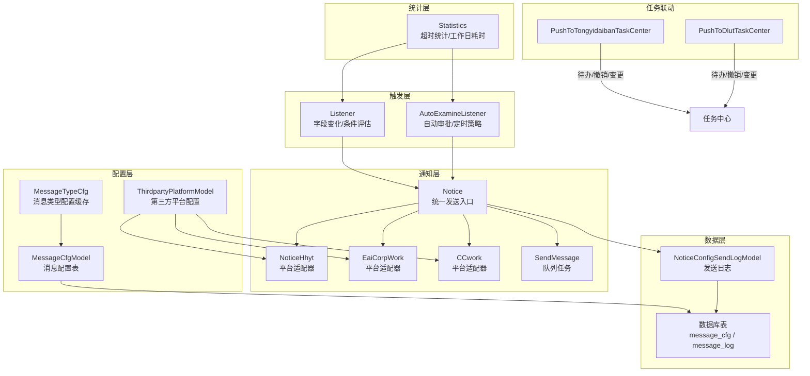
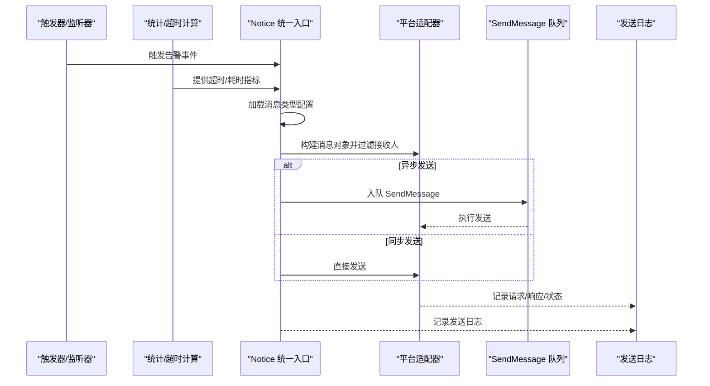
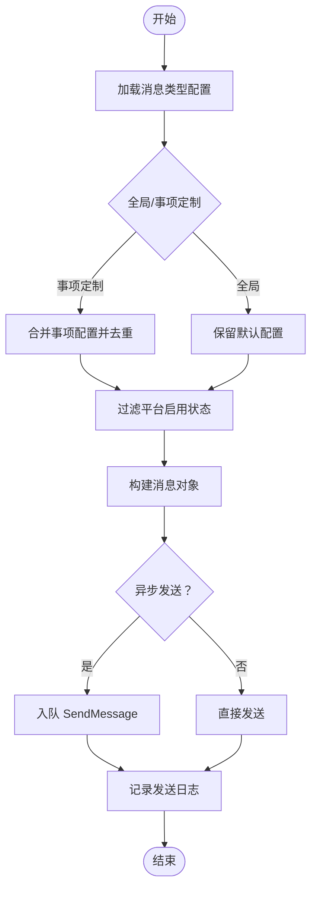
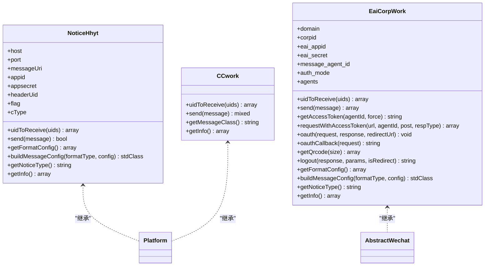
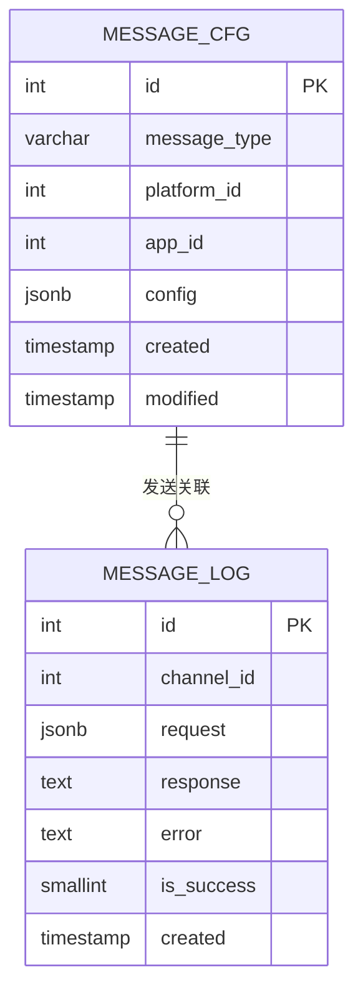
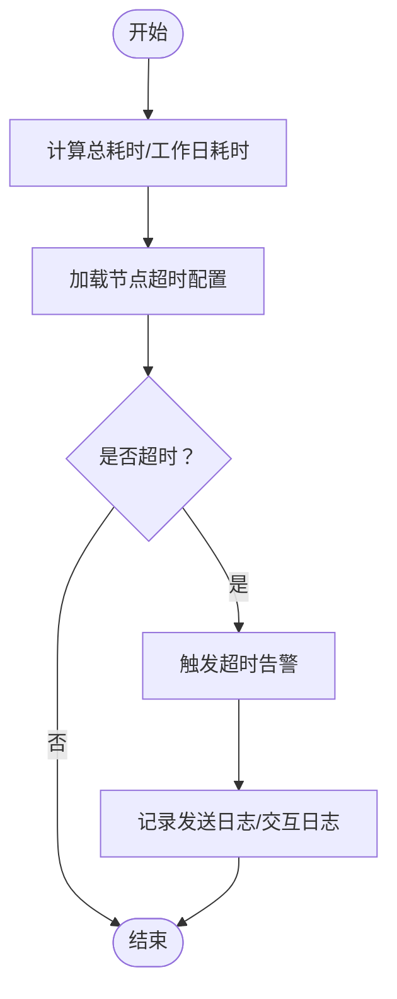
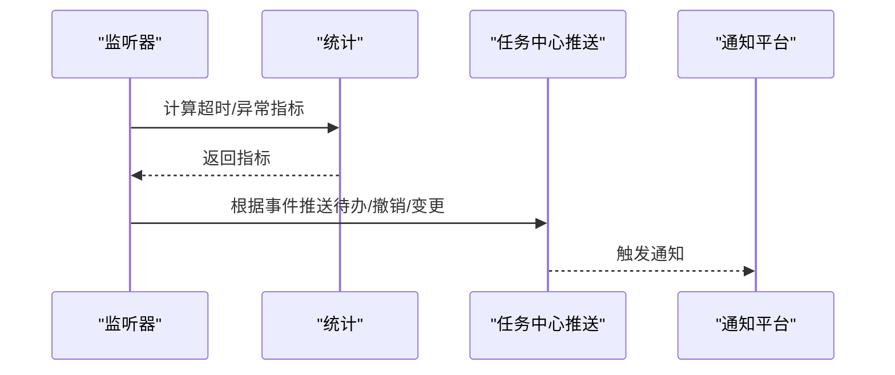
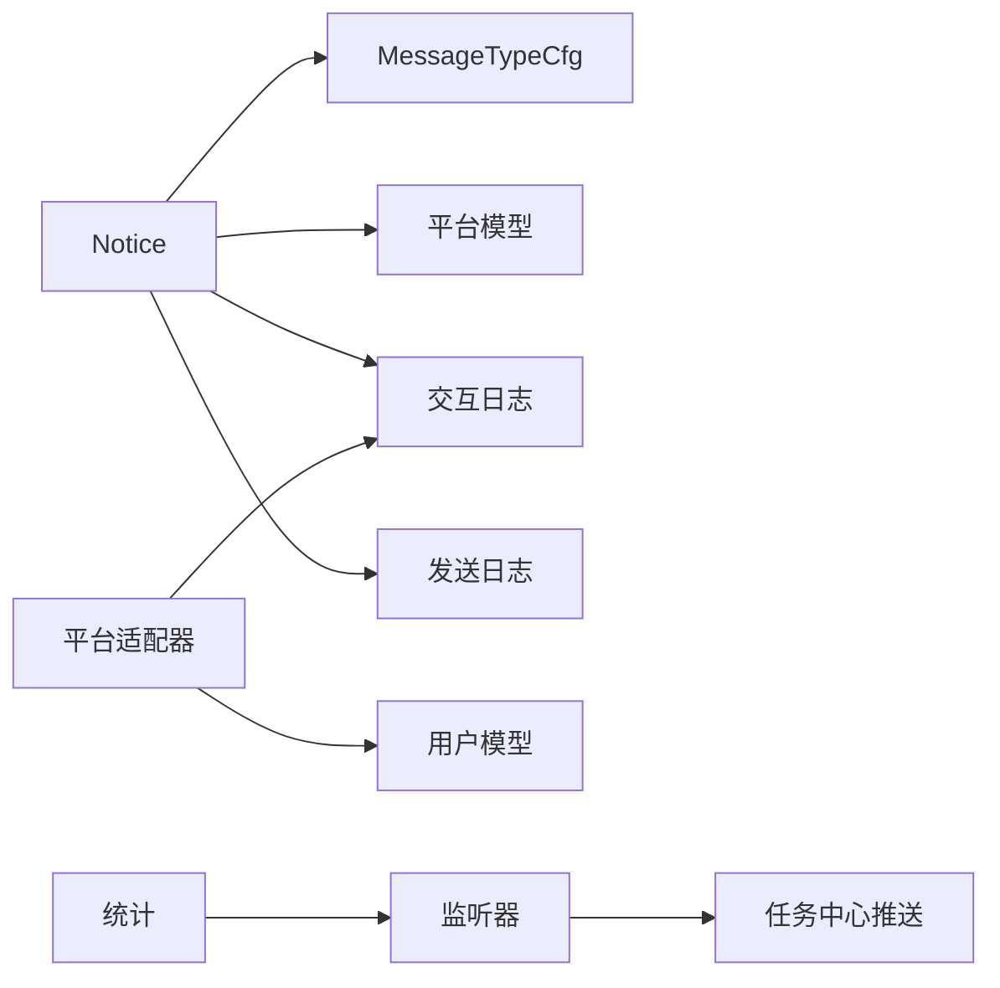
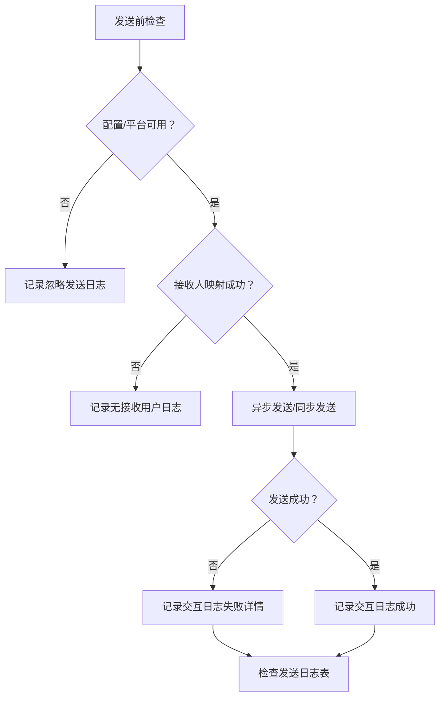

# 告警系统

<cite>
**本文引用的文件**
- [process/src/components/Notice.php](file://process/src/components/Notice.php)
- [process/src/services/cache/MessageTypeCfg.php](file://process/src/services/cache/MessageTypeCfg.php)
- [process/src/models/NoticeConfigSendLogModel.php](file://process/src/models/NoticeConfigSendLogModel.php)
- [process/src/services/platform/NoticeHhyt.php](file://process/src/services/platform/NoticeHhyt.php)
- [process/src/services/platform/EaiCorpWork.php](file://process/src/services/platform/EaiCorpWork.php)
- [process/src/services/platform/CCwork.php](file://process/src/services/platform/CCwork.php)
- [process/src/migrations/migration_20230919_102723_message_cfg.php](file://process/src/migrations/migration_20230919_102723_message_cfg.php)
- [process/docs/sql/database.sql](file://process/docs/sql/database.sql)
- [process/src/services/Statistics.php](file://process/src/services/Statistics.php)
- [process/src/services/listeners/AutoExamineListener.php](file://process/src/services/listeners/AutoExamineListener.php)
- [process/src/services/assignee/Listener.php](file://process/src/services/assignee/Listener.php)
- [process/src/services/task/PushToTongyidaibanTaskCenter.php](file://process/src/services/task/PushToTongyidaibanTaskCenter.php)
- [process/src/services/task/PushToDlutTaskCenter.php](file://process/src/services/task/PushToDlutTaskCenter.php)
</cite>

## 目录
1. [引言](#引言)
2. [项目结构](#项目结构)
3. [核心组件](#核心组件)
4. [架构总览](#架构总览)
5. [详细组件分析](#详细组件分析)
6. [依赖关系分析](#依赖关系分析)
7. [性能考虑](#性能考虑)
8. [故障排查指南](#故障排查指南)
9. [结论](#结论)
10. [附录](#附录)

## 引言
本文件面向任务告警系统，围绕告警规则配置、触发条件、通知机制、告警级别与抑制、升级策略、消息渠道与模板、接收人管理、日志与追踪、效果评估以及与任务监控联动展开。通过对仓库中的通知组件、平台适配器、统计与超时计算、监听器与任务中心推送等模块进行系统性梳理，形成可操作、可扩展、可观测的告警体系文档。

## 项目结构
告警系统主要由以下层次构成：
- 配置层：消息类型配置缓存与持久化、平台能力与启用开关
- 触发层：监听器与事件评估、定时/自动审批策略
- 通知层：统一通知入口、平台适配器、异步发送与重试
- 统计层：任务耗时统计、超时计算、工作日/自然日差异
- 任务联动：向任务中心推送待办/撤销/变更等事件
- 数据层：消息发送日志、交互日志、消息配置表

图表来源
- [process/src/services/cache/MessageTypeCfg.php](file://process/src/services/cache/MessageTypeCfg.php#L1-L31)
- [process/src/components/Notice.php](file://process/src/components/Notice.php#L1-L406)
- [process/src/services/platform/NoticeHhyt.php](file://process/src/services/platform/NoticeHhyt.php#L1-L219)
- [process/src/services/platform/EaiCorpWork.php](file://process/src/services/platform/EaiCorpWork.php#L1-L339)
- [process/src/services/platform/CCwork.php](file://process/src/services/platform/CCwork.php#L85-L132)
- [process/src/services/Statistics.php](file://process/src/services/Statistics.php#L979-L1006)
- [process/src/services/listeners/AutoExamineListener.php](file://process/src/services/listeners/AutoExamineListener.php#L67-L97)
- [process/src/services/assignee/Listener.php](file://process/src/services/assignee/Listener.php#L48-L84)
- [process/src/services/task/PushToTongyidaibanTaskCenter.php](file://process/src/services/task/PushToTongyidaibanTaskCenter.php#L170-L201)
- [process/src/services/task/PushToDlutTaskCenter.php](file://process/src/services/task/PushToDlutTaskCenter.php#L242-L268)
- [process/src/models/NoticeConfigSendLogModel.php](file://process/src/models/NoticeConfigSendLogModel.php#L1-L55)
- [process/docs/sql/database.sql](file://process/docs/sql/database.sql#L502-L539)

章节来源
- [process/src/components/Notice.php](file://process/src/components/Notice.php#L1-L406)
- [process/src/services/cache/MessageTypeCfg.php](file://process/src/services/cache/MessageTypeCfg.php#L1-L31)
- [process/src/models/NoticeConfigSendLogModel.php](file://process/src/models/NoticeConfigSendLogModel.php#L1-L55)
- [process/src/services/platform/NoticeHhyt.php](file://process/src/services/platform/NoticeHhyt.php#L1-L219)
- [process/src/services/platform/EaiCorpWork.php](file://process/src/services/platform/EaiCorpWork.php#L1-L339)
- [process/src/services/platform/CCwork.php](file://process/src/services/platform/CCwork.php#L85-L132)
- [process/src/migrations/migration_20230919_102723_message_cfg.php](file://process/src/migrations/migration_20230919_102723_message_cfg.php#L60-L121)
- [process/docs/sql/database.sql](file://process/docs/sql/database.sql#L502-L539)
- [process/src/services/Statistics.php](file://process/src/services/Statistics.php#L979-L1006)
- [process/src/services/listeners/AutoExamineListener.php](file://process/src/services/listeners/AutoExamineListener.php#L67-L97)
- [process/src/services/assignee/Listener.php](file://process/src/services/assignee/Listener.php#L48-L84)
- [process/src/services/task/PushToTongyidaibanTaskCenter.php](file://process/src/services/task/PushToTongyidaibanTaskCenter.php#L170-L201)
- [process/src/services/task/PushToDlutTaskCenter.php](file://process/src/services/task/PushToDlutTaskCenter.php#L242-L268)

## 核心组件
- 统一通知入口（Notice）：负责按消息类型加载配置、过滤平台、构建消息对象、异步入队发送，并记录发送日志。
- 平台适配器（NoticeHhyt/EaiCorpWork/CCwork）：封装不同渠道的发送协议、鉴权、参数映射与响应处理。
- 消息类型配置缓存（MessageTypeCfg）：从消息配置表加载并缓存消息类型对应的多平台配置。
- 发送日志模型（NoticeConfigSendLogModel）：记录每次发送的平台、重试方法、消息对象序列化、状态与错误信息。
- 统计与超时（Statistics）：计算任务总耗时与工作日耗时，识别超时阈值并输出最大超时。
- 触发与监听（Listener/AutoExamineListener）：基于字段变化与表达式条件评估触发动作；支持定时/自动审批策略。
- 任务中心联动（PushToTongyidaibanTaskCenter/PushToDlutTaskCenter）：根据事件推送待办/撤销/变更等数据至任务中心。

章节来源
- [process/src/components/Notice.php](file://process/src/components/Notice.php#L1-L406)
- [process/src/services/cache/MessageTypeCfg.php](file://process/src/services/cache/MessageTypeCfg.php#L1-L31)
- [process/src/models/NoticeConfigSendLogModel.php](file://process/src/models/NoticeConfigSendLogModel.php#L1-L55)
- [process/src/services/platform/NoticeHhyt.php](file://process/src/services/platform/NoticeHhyt.php#L1-L219)
- [process/src/services/platform/EaiCorpWork.php](file://process/src/services/platform/EaiCorpWork.php#L1-L339)
- [process/src/services/platform/CCwork.php](file://process/src/services/platform/CCwork.php#L85-L132)
- [process/src/services/Statistics.php](file://process/src/services/Statistics.php#L979-L1006)
- [process/src/services/listeners/AutoExamineListener.php](file://process/src/services/listeners/AutoExamineListener.php#L67-L97)
- [process/src/services/assignee/Listener.php](file://process/src/services/assignee/Listener.php#L48-L84)
- [process/src/services/task/PushToTongyidaibanTaskCenter.php](file://process/src/services/task/PushToTongyidaibanTaskCenter.php#L170-L201)
- [process/src/services/task/PushToDlutTaskCenter.php](file://process/src/services/task/PushToDlutTaskCenter.php#L242-L268)

## 架构总览
告警系统以“配置驱动 + 事件触发 + 平台适配 + 异步发送”的方式实现。消息类型配置通过缓存加载，结合平台启用状态与用户偏好设置，动态选择发送渠道。发送过程采用队列异步执行，失败时可重试；同时记录交互日志与发送日志，便于追踪与审计。

图表来源
- [process/src/components/Notice.php](file://process/src/components/Notice.php#L1-L406)
- [process/src/services/platform/NoticeHhyt.php](file://process/src/services/platform/NoticeHhyt.php#L1-L219)
- [process/src/services/platform/EaiCorpWork.php](file://process/src/services/platform/EaiCorpWork.php#L1-L339)
- [process/src/models/NoticeConfigSendLogModel.php](file://process/src/models/NoticeConfigSendLogModel.php#L1-L55)

## 详细组件分析

### 统一通知入口（Notice）
职责与流程
- 按消息类型加载配置，区分全局与事项定制配置，合并去重。
- 过滤平台启用状态与默认发送策略，解析接收人账号（手机号/邮箱/open_id等）。
- 构建消息对象，写入发送日志并入队异步发送；同步模式下直接调用平台发送。
- 记录“忽略发送”的交互日志，便于审计与问题定位。

关键点
- 支持按应用隔离配置（app_id），避免跨事项覆盖。
- 对站内消息与第三方平台分别处理接收人映射与过滤。
- 异步发送通过队列任务执行，失败不影响主流程。

图表来源
- [process/src/components/Notice.php](file://process/src/components/Notice.php#L1-L406)

章节来源
- [process/src/components/Notice.php](file://process/src/components/Notice.php#L1-L406)

### 平台适配器（NoticeHhyt/EaiCorpWork/CCwork）
职责与差异
- NoticeHhyt：对接第三方消息平台，构造请求体、签名与鉴权头，记录交互日志。
- EaiCorpWork：对接企业微信（移动校园），管理 access_token 缓存与刷新、消息应用 agent 选择、鉴权与回调。
- CCwork：对接另一第三方平台，支持站内消息与第三方消息类型，统一消息类加载。

通用能力
- 消息类加载：根据平台定义的消息类构建消息对象。
- 接收人映射：将用户ID映射为平台账号（手机号/工号/open_id等）。
- 发送与回写：发送后记录请求/响应/状态，便于追踪。

图表来源
- [process/src/services/platform/NoticeHhyt.php](file://process/src/services/platform/NoticeHhyt.php#L1-L219)
- [process/src/services/platform/EaiCorpWork.php](file://process/src/services/platform/EaiCorpWork.php#L1-L339)
- [process/src/services/platform/CCwork.php](file://process/src/services/platform/CCwork.php#L85-L132)

章节来源
- [process/src/services/platform/NoticeHhyt.php](file://process/src/services/platform/NoticeHhyt.php#L1-L219)
- [process/src/services/platform/EaiCorpWork.php](file://process/src/services/platform/EaiCorpWork.php#L1-L339)
- [process/src/services/platform/CCwork.php](file://process/src/services/platform/CCwork.php#L85-L132)

### 消息类型配置与模板
- MessageTypeCfg：按消息类型从配置表加载所有平台配置，支持全局与事项定制合并。
- 迁移脚本：在迁移过程中将历史配置转换为标准消息配置表结构，确保平台启用与消息类型一致。
- 数据库表：message_cfg 存储消息类型、平台ID、应用ID与配置JSON；message_log 记录发送请求/响应/错误。

图表来源
- [process/src/services/cache/MessageTypeCfg.php](file://process/src/services/cache/MessageTypeCfg.php#L1-L31)
- [process/src/migrations/migration_20230919_102723_message_cfg.php](file://process/src/migrations/migration_20230919_102723_message_cfg.php#L60-L121)
- [process/docs/sql/database.sql](file://process/docs/sql/database.sql#L502-L539)

章节来源
- [process/src/services/cache/MessageTypeCfg.php](file://process/src/services/cache/MessageTypeCfg.php#L1-L31)
- [process/src/migrations/migration_20230919_102723_message_cfg.php](file://process/src/migrations/migration_20230919_102723_message_cfg.php#L60-L121)
- [process/docs/sql/database.sql](file://process/docs/sql/database.sql#L502-L539)

### 超时告警与统计
- 统计模块计算任务总耗时与工作日耗时，比较超时阈值，输出最大超时与工作日超时，作为告警依据。
- 结合监听器与自动审批策略，对超时节点触发提醒或自动处理。

图表来源
- [process/src/services/Statistics.php](file://process/src/services/Statistics.php#L979-L1006)
- [process/src/services/listeners/AutoExamineListener.php](file://process/src/services/listeners/AutoExamineListener.php#L67-L97)

章节来源
- [process/src/services/Statistics.php](file://process/src/services/Statistics.php#L979-L1006)
- [process/src/services/listeners/AutoExamineListener.php](file://process/src/services/listeners/AutoExamineListener.php#L67-L97)

### 通知渠道与接收人管理
- 渠道选择：根据平台启用状态与默认发送策略决定是否发送；站内消息无需过滤。
- 接收人映射：平台适配器将用户ID映射为对应账号；Notice 层再按平台偏好过滤。
- 模板与格式：平台适配器提供消息格式化参数，统一由消息类加载并构建。

章节来源
- [process/src/components/Notice.php](file://process/src/components/Notice.php#L1-L406)
- [process/src/services/platform/NoticeHhyt.php](file://process/src/services/platform/NoticeHhyt.php#L1-L219)
- [process/src/services/platform/EaiCorpWork.php](file://process/src/services/platform/EaiCorpWork.php#L1-L339)
- [process/src/services/platform/CCwork.php](file://process/src/services/platform/CCwork.php#L85-L132)

### 告警级别、重复抑制与升级策略
- 级别与模板：通过消息类型配置与平台模板参数控制告警级别（如强提醒/待办箱）。
- 重复抑制：通过发送日志与交互日志记录，结合业务策略避免重复发送；必要时可在监听器侧增加去重逻辑。
- 升级策略：在监听器中根据时间阈值与表达式组合实现“升级”（如从提醒到自动审批/终止）。

章节来源
- [process/src/components/Notice.php](file://process/src/components/Notice.php#L1-L406)
- [process/src/services/listeners/AutoExamineListener.php](file://process/src/services/listeners/AutoExamineListener.php#L67-L97)

### 与任务监控的联动与自动化
- 字段变化监听：基于字段变化与表达式评估触发动作，适合“异常/状态变更”类告警。
- 任务中心推送：根据不同学校/机构的任务中心接口，推送待办/撤销/变更等事件，实现闭环联动。

图表来源
- [process/src/services/assignee/Listener.php](file://process/src/services/assignee/Listener.php#L48-L84)
- [process/src/services/Statistics.php](file://process/src/services/Statistics.php#L979-L1006)
- [process/src/services/task/PushToTongyidaibanTaskCenter.php](file://process/src/services/task/PushToTongyidaibanTaskCenter.php#L170-L201)
- [process/src/services/task/PushToDlutTaskCenter.php](file://process/src/services/task/PushToDlutTaskCenter.php#L242-L268)

章节来源
- [process/src/services/assignee/Listener.php](file://process/src/services/assignee/Listener.php#L48-L84)
- [process/src/services/task/PushToTongyidaibanTaskCenter.php](file://process/src/services/task/PushToTongyidaibanTaskCenter.php#L170-L201)
- [process/src/services/task/PushToDlutTaskCenter.php](file://process/src/services/task/PushToDlutTaskCenter.php#L242-L268)

## 依赖关系分析
- Notice 依赖 MessageTypeCfg 与平台模型，间接依赖用户集合与消息对象。
- 平台适配器依赖交互日志模型与用户模型，部分平台依赖缓存与HTTP客户端。
- 统计模块与监听器共同产出告警输入，任务中心推送依赖上下文中的会话与任务模型。
- 数据层通过消息配置表与发送日志表支撑配置管理与审计追踪。

图表来源
- [process/src/components/Notice.php](file://process/src/components/Notice.php#L1-L406)
- [process/src/services/cache/MessageTypeCfg.php](file://process/src/services/cache/MessageTypeCfg.php#L1-L31)
- [process/src/models/NoticeConfigSendLogModel.php](file://process/src/models/NoticeConfigSendLogModel.php#L1-L55)
- [process/src/services/platform/NoticeHhyt.php](file://process/src/services/platform/NoticeHhyt.php#L1-L219)
- [process/src/services/platform/EaiCorpWork.php](file://process/src/services/platform/EaiCorpWork.php#L1-L339)
- [process/src/services/Statistics.php](file://process/src/services/Statistics.php#L979-L1006)
- [process/src/services/assignee/Listener.php](file://process/src/services/assignee/Listener.php#L48-L84)

章节来源
- [process/src/components/Notice.php](file://process/src/components/Notice.php#L1-L406)
- [process/src/services/cache/MessageTypeCfg.php](file://process/src/services/cache/MessageTypeCfg.php#L1-L31)
- [process/src/models/NoticeConfigSendLogModel.php](file://process/src/models/NoticeConfigSendLogModel.php#L1-L55)
- [process/src/services/platform/NoticeHhyt.php](file://process/src/services/platform/NoticeHhyt.php#L1-L219)
- [process/src/services/platform/EaiCorpWork.php](file://process/src/services/platform/EaiCorpWork.php#L1-L339)
- [process/src/services/Statistics.php](file://process/src/services/Statistics.php#L979-L1006)
- [process/src/services/assignee/Listener.php](file://process/src/services/assignee/Listener.php#L48-L84)

## 性能考虑
- 异步发送：通过队列异步发送，降低主流程阻塞风险，提升吞吐。
- 内存管理：部分组件具备内存阈值与检查机制，建议在高并发场景下启用并监控内存使用。
- 缓存利用：消息类型配置与平台配置通过缓存加载，减少数据库压力。
- 日志落盘：交互日志与发送日志异步写入，避免IO阻塞。

章节来源
- [process/src/components/Notice.php](file://process/src/components/Notice.php#L1-L406)
- [process/src/services/platform/EaiCorpWork.php](file://process/src/services/platform/EaiCorpWork.php#L1-L339)

## 故障排查指南
常见问题与定位
- 未配置消息模板：调用 sendType 时若无可用平台配置，抛出异常提示无法发送。
- 接收人为空：若平台映射后无接收账号，记录“无接收用户/账号”日志。
- 平台不可用：平台禁用或未启用通知能力时跳过发送。
- 发送失败：平台返回非成功状态或HTTP异常，交互日志记录失败原因与响应体。
- 发送日志：查看发送日志表，确认平台ID、重试方法、消息对象序列化与错误信息。

图表来源
- [process/src/components/Notice.php](file://process/src/components/Notice.php#L1-L406)
- [process/src/models/NoticeConfigSendLogModel.php](file://process/src/models/NoticeConfigSendLogModel.php#L1-L55)
- [process/src/services/platform/NoticeHhyt.php](file://process/src/services/platform/NoticeHhyt.php#L1-L219)
- [process/src/services/platform/EaiCorpWork.php](file://process/src/services/platform/EaiCorpWork.php#L1-L339)

章节来源
- [process/src/components/Notice.php](file://process/src/components/Notice.php#L1-L406)
- [process/src/models/NoticeConfigSendLogModel.php](file://process/src/models/NoticeConfigSendLogModel.php#L1-L55)
- [process/src/services/platform/NoticeHhyt.php](file://process/src/services/platform/NoticeHhyt.php#L1-L219)
- [process/src/services/platform/EaiCorpWork.php](file://process/src/services/platform/EaiCorpWork.php#L1-L339)

## 结论
本告警系统以配置驱动为核心，结合监听器与统计模块，实现超时、异常、性能等多维度告警，并通过平台适配器与异步队列完成可靠通知。配合任务中心联动与完善的日志体系，能够满足多场景下的告警需求。建议在生产环境中进一步完善重复抑制与升级策略，并持续优化模板与接收人映射以提升命中率与用户体验。

## 附录
- 告警类型建议
  - 超时告警：基于统计模块的总耗时/工作日耗时与阈值对比。
  - 异常告警：基于监听器字段变化与表达式评估，捕捉异常状态。
  - 性能告警：结合内存/资源使用与阈值，触发预警。
- 告警级别与模板
  - 通过消息类型配置与平台模板参数控制告警级别与呈现样式。
- 通知渠道
  - 站内消息、企业微信（移动校园）、第三方平台等，按平台启用与默认策略选择。
- 日志与追踪
  - 交互日志与发送日志双轨记录，支持问题定位与效果评估。