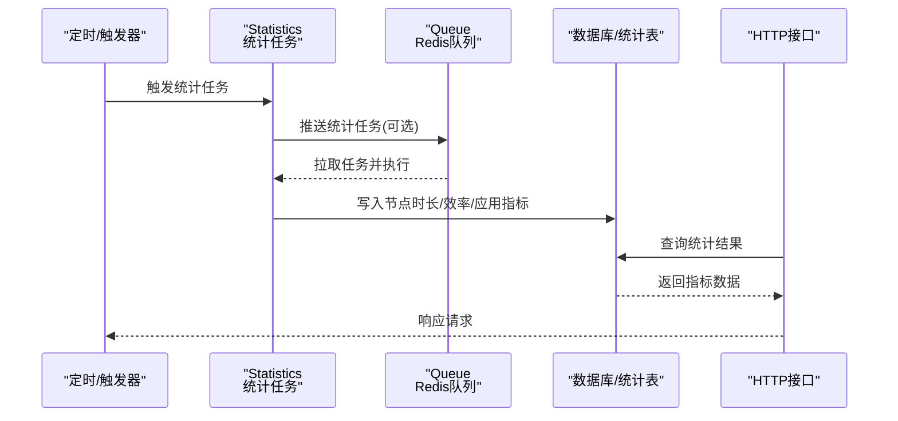
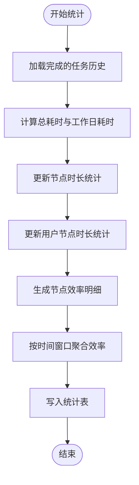
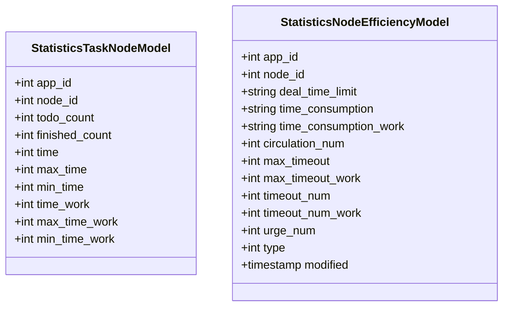
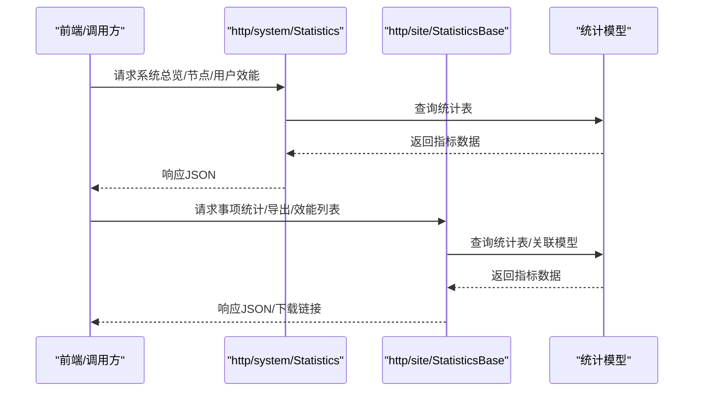
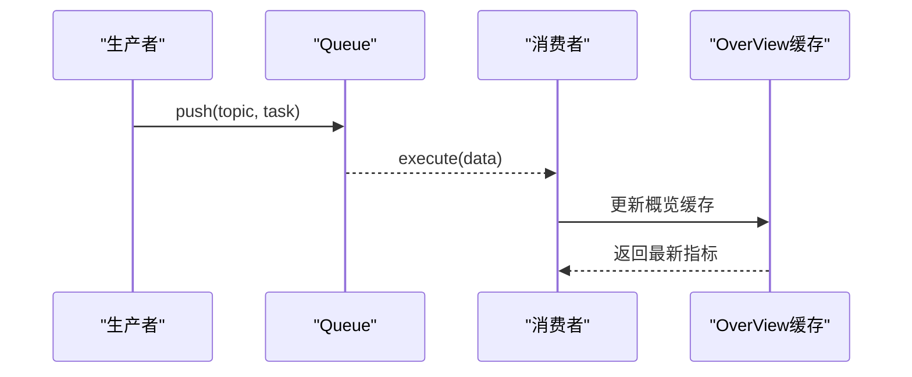
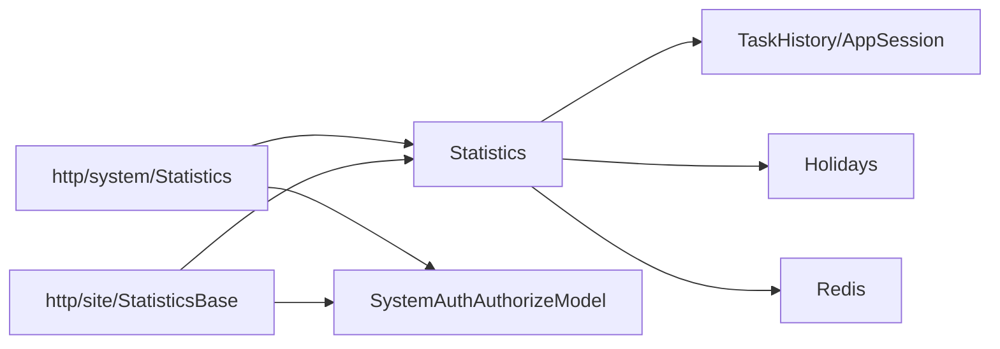

# 性能监控指标

<cite>
**本文引用的文件**
- [process/src/services/Statistics.php](file://process/src/services/Statistics.php)
- [process/src/http/system/Statistics.php](file://process/src/http/system/Statistics.php)
- [process/src/http/site/StatisticsBase.php](file://process/src/http/site/StatisticsBase.php)
- [process/src/models/StatisticsTaskNodeModel.php](file://process/src/models/StatisticsTaskNodeModel.php)
- [process/src/models/StatisticsNodeEfficiencyModel.php](file://process/src/models/StatisticsNodeEfficiencyModel.php)
- [process/src/components/Queue.php](file://process/src/components/Queue.php)
- [process/src/migrations/migration_20240716_170331_statistics.php](file://process/src/migrations/migration_20240716_170331_statistics.php)
- [process/src/config/api.php](file://process/src/config/api.php)
- [process/src/services/cache/OverView.php](file://process/src/services/cache/OverView.php)
- [process/src/services/trait/MemoryManagementTrait.php](file://process/src/services/trait/MemoryManagementTrait.php)
- [process/src/services/StatisticsBaseNotice.php](file://process/src/services/StatisticsBaseNotice.php)
- [process/src/models/AppVersionModel.php](file://process/src/models/AppVersionModel.php)
- [process/src/services/listeners/ValidateListener.php](file://process/src/services/listeners/ValidateListener.php)
- [process/src/models/MapConfigModel.php](file://process/src/models/MapConfigModel.php)
</cite>

## 目录
1. [引言](#引言)
2. [项目结构](#项目结构)
3. [核心组件](#核心组件)
4. [架构总览](#架构总览)
5. [详细组件分析](#详细组件分析)
6. [依赖分析](#依赖分析)
7. [性能考量](#性能考量)
8. [故障排查指南](#故障排查指南)
9. [结论](#结论)
10. [附录](#附录)

## 引言
本文件面向任务性能监控指标系统，围绕“任务节点效率、处理时长、并发度、成功率”等关键指标，系统梳理指标定义、数据采集与统计分析机制、存储策略、可视化与报表、阈值告警与趋势分析、性能优化与容量规划建议，以及实时监控与数据导出能力。文档以仓库现有代码为依据，结合模型与控制器层实现，给出可落地的实践路径。

## 项目结构
该系统由“统计任务调度器”“指标模型”“HTTP 接口控制器”“队列与缓存”四大部分构成：
- 统计任务调度器：负责周期性或按需聚合任务时长、节点效率、应用维度指标。
- 指标模型：承载节点时长、节点效率、应用日累计等统计结果的持久化结构。
- HTTP 接口控制器：提供系统总览、应用详情、节点与用户维度效能、报表导出等接口。
- 队列与缓存：通过 Redis 队列承载任务投递与消费，通过 Redis 缓存热点数据与增量指标。

```mermaid
graph TB
subgraph "统计任务"
ST["Statistics<br/>统计任务调度器"]
Q["Queue<br/>Redis队列"]
end
subgraph "数据存储"
M1["StatisticsTaskNodeModel<br/>节点时长统计"]
M2["StatisticsNodeEfficiencyModel<br/>节点效率统计"]
M3["AppSession/TaskHistory<br/>会话与任务历史"]
end
subgraph "接口层"
SYS["http/system/Statistics<br/>系统统计接口"]
SITE["http/site/StatisticsBase<br/>站点统计接口"]
end
subgraph "缓存与配置"
R["Redis<br/>队列/缓存"]
CFG["MapConfigModel<br/>配置开关"]
end
ST --> Q
Q --> ST
ST --> M1
ST --> M2
ST --> M3
SYS --> M1
SYS --> M2
SYS --> M3
SITE --> M1
SITE --> M2
SITE --> M3
R <- --> ST
R <- --> SYS
R <- --> SITE
CFG --> SYS
CFG --> SITE
```

图示来源
- [process/src/services/Statistics.php](file://process/src/services/Statistics.php#L1-L120)
- [process/src/components/Queue.php](file://process/src/components/Queue.php#L1-L120)
- [process/src/models/StatisticsTaskNodeModel.php](file://process/src/models/StatisticsTaskNodeModel.php#L1-L40)
- [process/src/models/StatisticsNodeEfficiencyModel.php](file://process/src/models/StatisticsNodeEfficiencyModel.php#L1-L48)
- [process/src/http/system/Statistics.php](file://process/src/http/system/Statistics.php#L1-L120)
- [process/src/http/site/StatisticsBase.php](file://process/src/http/site/StatisticsBase.php#L1-L120)

章节来源
- [process/src/services/Statistics.php](file://process/src/services/Statistics.php#L1-L120)
- [process/src/http/system/Statistics.php](file://process/src/http/system/Statistics.php#L1-L120)
- [process/src/http/site/StatisticsBase.php](file://process/src/http/site/StatisticsBase.php#L1-L120)

## 核心组件
- 统计任务调度器（Statistics）
  - 职责：按时间窗口聚合节点时长、用户节点时长、应用维度指标、节点效率明细与汇总；维护缓存更新时间；清理历史统计。
  - 关键方法：节点时长聚合、用户节点时长聚合、应用维度指标、节点效率明细与汇总、工作日时长计算、节假日过滤。
- 指标模型
  - 节点时长统计（StatisticsTaskNodeModel）：记录节点总耗时、最大/最小耗时（含工作日版本）、完成次数、待办数等。
  - 节点效率统计（StatisticsNodeEfficiencyModel）：记录节点总耗时、工作日耗时、流转次数、最大超时、超时数量、催办数、时限配置等。
- HTTP 接口控制器
  - 系统统计（http/system/Statistics）：提供系统总览、申请量/点击量趋势、应用维度指标、节点与用户维度效能列表。
  - 站点统计（http/site/StatisticsBase）：提供事项统计列表、字段自定义、导出、效能统计列表、各类指标聚合。
- 队列与缓存
  - Queue：封装 Redis 队列推送与消费，支持动态消费者配置与队列长度查询。
  - OverView：系统概览缓存，整合访问/点击/完成数等指标。
- 配置与导航
  - MapConfigModel：提供“监控”导航项，支撑前端页面入口。
  - api.php：开放接口清单，包含平台/事项运行情况、流程监控等接口标识。

章节来源
- [process/src/services/Statistics.php](file://process/src/services/Statistics.php#L1-L120)
- [process/src/models/StatisticsTaskNodeModel.php](file://process/src/models/StatisticsTaskNodeModel.php#L1-L40)
- [process/src/models/StatisticsNodeEfficiencyModel.php](file://process/src/models/StatisticsNodeEfficiencyModel.php#L1-L48)
- [process/src/http/system/Statistics.php](file://process/src/http/system/Statistics.php#L1-L120)
- [process/src/http/site/StatisticsBase.php](file://process/src/http/site/StatisticsBase.php#L1-L120)
- [process/src/components/Queue.php](file://process/src/components/Queue.php#L1-L120)
- [process/src/services/cache/OverView.php](file://process/src/services/cache/OverView.php#L1-L71)
- [process/src/models/MapConfigModel.php](file://process/src/models/MapConfigModel.php#L391-L397)
- [process/src/config/api.php](file://process/src/config/api.php#L770-L803)

## 架构总览
系统采用“任务驱动 + 模型持久化 + 控制器接口 + 缓存加速”的分层架构。统计任务通过队列异步执行，按时间窗口扫描任务历史与会话，计算节点时长与效率指标，写入对应统计表；接口层通过模型读取并返回给前端，同时利用 Redis 缓存热点数据提升响应速度。



图示来源
- [process/src/services/Statistics.php](file://process/src/services/Statistics.php#L1-L120)
- [process/src/components/Queue.php](file://process/src/components/Queue.php#L1-L120)
- [process/src/http/system/Statistics.php](file://process/src/http/system/Statistics.php#L1-L120)
- [process/src/http/site/StatisticsBase.php](file://process/src/http/site/StatisticsBase.php#L1-L120)

## 详细组件分析

### 统计任务调度器（Statistics）
- 节点时长聚合（StatisticsTaskNodeModel）
  - 输入：任务历史（完成态、非测试），按应用+节点聚合。
  - 输出：完成次数、总耗时、最大/最小耗时（含工作日版本）、待办数。
  - 关键逻辑：按任务时间段累加总耗时与工作日耗时，维护最大/最小值。
- 用户节点时长聚合（StatisticsTaskUserModel）
  - 输入：任务历史（完成态、非测试），按应用+用户+节点聚合。
  - 输出：完成次数、总耗时、最大/最小耗时（含工作日版本）、活跃天数。
  - 关键逻辑：按用户-节点维度累加，更新最大/最小值。
- 应用维度指标（StatisticsAppModel/StatisticsAppDayModel）
  - 输入：会话、任务历史、评论、待办、催办、超时、驳回等。
  - 输出：申请次数、申请人数、进行中、完成/终止/撤销、办结率、平均时长（总/审批人/节点）、时限、评分等。
  - 关键逻辑：按时间窗口统计日累计与全量指标，计算平均时长与比率。
- 节点效率明细与汇总（StatisticsNodeEfficiencyInfoModel/StatisticsNodeEfficiencyModel）
  - 明细：按会话+节点统计总耗时、工作日耗时、流转次数、最大超时、超时数量、催办数、时限配置。
  - 汇总：按应用+节点+时间窗口（近半年/季度/月）聚合明细，计算最大超时、超时数量、催办数、平均处理时长等。
- 工作日时长计算与节假日过滤
  - 逐小时切片，剔除节假日，计算有效工作时长，确保统计贴近实际工作节奏。
- 缓存与增量更新
  - 使用 Redis 记录上次统计截止时间，仅增量更新，降低全量扫描成本。



图示来源
- [process/src/services/Statistics.php](file://process/src/services/Statistics.php#L220-L435)
- [process/src/services/Statistics.php](file://process/src/services/Statistics.php#L866-L1029)

章节来源
- [process/src/services/Statistics.php](file://process/src/services/Statistics.php#L220-L435)
- [process/src/services/Statistics.php](file://process/src/services/Statistics.php#L866-L1029)

### 指标模型（StatisticsTaskNodeModel / StatisticsNodeEfficiencyModel）
- 节点时长统计（StatisticsTaskNodeModel）
  - 字段：应用ID、节点ID、待办数、完成次数、总耗时、最大/最小耗时（含工作日版本）。
  - 用途：用于“节点处理时长”“并发度”“节点吞吐量”等指标计算。
- 节点效率统计（StatisticsNodeEfficiencyModel）
  - 字段：应用ID、节点ID、时限配置、总耗时/工作日耗时、流转次数、最大超时/超时数量、催办数、统计周期类型、更新时间。
  - 用途：用于“节点效率”“超时率”“催办强度”等指标计算。



图示来源
- [process/src/models/StatisticsTaskNodeModel.php](file://process/src/models/StatisticsTaskNodeModel.php#L1-L40)
- [process/src/models/StatisticsNodeEfficiencyModel.php](file://process/src/models/StatisticsNodeEfficiencyModel.php#L1-L48)

章节来源
- [process/src/models/StatisticsTaskNodeModel.php](file://process/src/models/StatisticsTaskNodeModel.php#L1-L40)
- [process/src/models/StatisticsNodeEfficiencyModel.php](file://process/src/models/StatisticsNodeEfficiencyModel.php#L1-L48)

### HTTP 接口控制器（系统/站点）
- 系统统计（http/system/Statistics）
  - 提供系统总览、申请量/点击量趋势、应用维度指标、节点与用户维度效能列表。
  - 关键接口：今日统计、总览、申请量、点击量、应用详情、节点与用户效能列表。
- 站点统计（http/site/StatisticsBase）
  - 提供事项统计列表、字段自定义、导出、效能统计列表、各类指标聚合。
  - 关键接口：总体运行情况、每日访问/申请、分类服务、部门申请、热门事项、效能统计、导出。



图示来源
- [process/src/http/system/Statistics.php](file://process/src/http/system/Statistics.php#L1-L120)
- [process/src/http/system/Statistics.php](file://process/src/http/system/Statistics.php#L382-L569)
- [process/src/http/site/StatisticsBase.php](file://process/src/http/site/StatisticsBase.php#L1-L120)
- [process/src/http/site/StatisticsBase.php](file://process/src/http/site/StatisticsBase.php#L480-L800)

章节来源
- [process/src/http/system/Statistics.php](file://process/src/http/system/Statistics.php#L1-L120)
- [process/src/http/system/Statistics.php](file://process/src/http/system/Statistics.php#L382-L569)
- [process/src/http/site/StatisticsBase.php](file://process/src/http/site/StatisticsBase.php#L1-L120)
- [process/src/http/site/StatisticsBase.php](file://process/src/http/site/StatisticsBase.php#L480-L800)

### 队列与缓存（Queue / OverView）
- Queue
  - 支持主题（低/中/高）投递与消费，动态设置消费者数量，查询队列长度。
  - 适用于将统计任务异步化，避免阻塞主线程。
- OverView
  - 缓存系统概览指标（访问/点击/完成数等），定期刷新，减少数据库压力。



图示来源
- [process/src/components/Queue.php](file://process/src/components/Queue.php#L1-L120)
- [process/src/services/cache/OverView.php](file://process/src/services/cache/OverView.php#L1-L71)

章节来源
- [process/src/components/Queue.php](file://process/src/components/Queue.php#L1-L120)
- [process/src/services/cache/OverView.php](file://process/src/services/cache/OverView.php#L1-L71)

### 存储策略与数据库迁移
- 统计表结构
  - 节点时长统计、节点效率统计、应用日累计、应用全量等表，均通过迁移脚本创建并建立索引。
- 时间窗口与聚合
  - 通过“时间窗口”（近半年/季度/月）与“按应用+节点+会话”维度聚合，形成高效查询的宽表。

章节来源
- [process/src/migrations/migration_20240716_170331_statistics.php](file://process/src/migrations/migration_20240716_170331_statistics.php#L34-L87)

## 依赖分析
- 组件耦合
  - Statistics 依赖任务历史与会话模型、节假日模型、Redis 缓存键、站点配置。
  - 控制器依赖统计模型与用户授权模型，实现权限控制与分页。
- 外部依赖
  - Redis：队列、缓存、位图计数。
  - PostgreSQL：统计表与聚合查询。
- 可能的循环依赖
  - 统计任务与控制器之间为单向依赖，未见循环导入。



图示来源
- [process/src/services/Statistics.php](file://process/src/services/Statistics.php#L1-L120)
- [process/src/http/system/Statistics.php](file://process/src/http/system/Statistics.php#L1-L120)
- [process/src/http/site/StatisticsBase.php](file://process/src/http/site/StatisticsBase.php#L1-L120)

章节来源
- [process/src/services/Statistics.php](file://process/src/services/Statistics.php#L1-L120)
- [process/src/http/system/Statistics.php](file://process/src/http/system/Statistics.php#L1-L120)
- [process/src/http/site/StatisticsBase.php](file://process/src/http/site/StatisticsBase.php#L1-L120)

## 性能考量
- 时间复杂度
  - 节点时长与用户节点时长聚合：遍历完成任务历史，按应用/节点/用户聚合，时间复杂度近似 O(N)，N 为完成任务数。
  - 工作日时长计算：按小时切片，对每个任务进行小时级遍历，整体复杂度 O(N·H)，H 为任务跨小时数。
- 内存管理
  - 统计任务在执行期可能临时提升内存上限，建议配合 MemoryManagementTrait 的阈值检查与日志输出，避免峰值过高。
- 缓存与增量
  - 使用 Redis 记录上次统计截止时间，仅增量扫描，显著降低全量扫描成本。
- 并发与队列
  - 通过 Queue 将统计任务异步化，合理设置消费者数量，避免堆积。

章节来源
- [process/src/services/Statistics.php](file://process/src/services/Statistics.php#L220-L435)
- [process/src/services/trait/MemoryManagementTrait.php](file://process/src/services/trait/MemoryManagementTrait.php#L42-L83)
- [process/src/components/Queue.php](file://process/src/components/Queue.php#L1-L120)

## 故障排查指南
- 统计未更新或数据滞后
  - 检查 Redis 中统计截止时间键是否存在且正确推进。
  - 确认统计任务是否被队列消费，队列长度是否异常增长。
- 节点时长异常
  - 核对节假日配置与工作日时长计算逻辑，确认任务起止时间与完成状态。
- 超时/催办统计异常
  - 检查任务 flags 中超时与催办标记是否正确写入。
- 导出/接口慢
  - 查看分页参数与排序字段，确认索引是否覆盖查询条件；必要时开启缓存键。

章节来源
- [process/src/services/Statistics.php](file://process/src/services/Statistics.php#L220-L435)
- [process/src/http/site/StatisticsBase.php](file://process/src/http/site/StatisticsBase.php#L480-L800)
- [process/src/components/Queue.php](file://process/src/components/Queue.php#L1-L120)

## 结论
该系统通过“统计任务 + 指标模型 + 接口控制器 + 缓存队列”的组合，实现了对任务节点效率、处理时长、并发度与成功率等关键指标的自动化采集与可视化呈现。工作日时长与节假日过滤提升了统计的真实性；缓存与增量更新保障了性能；导出与权限控制完善了报表与安全。后续可在阈值告警、趋势分析、容量规划方面进一步扩展，以满足更复杂的运营需求。

## 附录

### 关键指标定义与计算方法
- 任务节点效率
  - 定义：节点总耗时/流转次数，或节点平均处理时长。
  - 计算：节点总耗时/流转次数；工作日版本以工作日耗时计算。
- 处理时长
  - 定义：任务完成时间-创建时间；工作日版本剔除节假日。
  - 计算：逐小时切片，累加有效秒数；支持最大/最小/平均。
- 并发度
  - 定义：节点待办数与完成次数的比值或单位时间吞吐。
  - 计算：节点待办数来自统计表；吞吐=完成次数/总耗时。
- 成功率
  - 定义：办结数/申请总数；或节点/应用层面的完成率。
  - 计算：办结数/（申请总数-撤销数）；节点完成率=节点完成次数/节点流转次数。

章节来源
- [process/src/models/StatisticsTaskNodeModel.php](file://process/src/models/StatisticsTaskNodeModel.php#L1-L40)
- [process/src/http/system/Statistics.php](file://process/src/http/system/Statistics.php#L382-L569)
- [process/src/http/site/StatisticsBase.php](file://process/src/http/site/StatisticsBase.php#L480-L800)

### 阈值告警与趋势分析
- 阈值告警
  - 可基于节点效率统计中的“最大超时/超时数量/催办数”与“时限配置”进行阈值判断，结合监听器/事件机制触发告警。
- 趋势分析
  - 通过时间序列（日/月）聚合“平均处理时长”“超时率”“办结率”，结合前端图表展示。

章节来源
- [process/src/services/Statistics.php](file://process/src/services/Statistics.php#L866-L1029)
- [process/src/services/listeners/ValidateListener.php](file://process/src/services/listeners/ValidateListener.php#L1-L48)

### 可视化与报表
- 可视化
  - 节点/用户维度效能列表、应用详情、系统总览等接口返回前端渲染。
- 报表导出
  - 站点统计支持字段自定义与导出，生成 Excel 并记录导出日志。

章节来源
- [process/src/http/site/StatisticsBase.php](file://process/src/http/site/StatisticsBase.php#L480-L800)
- [process/src/services/StatisticsBaseNotice.php](file://process/src/services/StatisticsBaseNotice.php#L402-L428)

### 实时监控与数据导出
- 实时监控
  - OverView 缓存提供访问/点击/完成数等实时指标，定期刷新。
- 数据导出
  - 导出接口生成 Excel 文件并记录导出日志，便于离线分析。

章节来源
- [process/src/services/cache/OverView.php](file://process/src/services/cache/OverView.php#L1-L71)
- [process/src/http/site/StatisticsBase.php](file://process/src/http/site/StatisticsBase.php#L480-L800)

### 性能优化与容量规划建议
- 优化
  - 增量统计：仅扫描新增/变更数据，缩短统计窗口。
  - 索引优化：为高频查询字段（应用ID、节点ID、时间范围）建立索引。
  - 缓存策略：热点指标（系统总览、应用详情）增加短期缓存。
  - 异步化：将重任务放入队列，平滑高峰期负载。
- 容量规划
  - 评估任务历史与会话增长速率，预估统计表规模与查询压力，提前扩容与分表。

章节来源
- [process/src/services/Statistics.php](file://process/src/services/Statistics.php#L220-L435)
- [process/src/components/Queue.php](file://process/src/components/Queue.php#L1-L120)