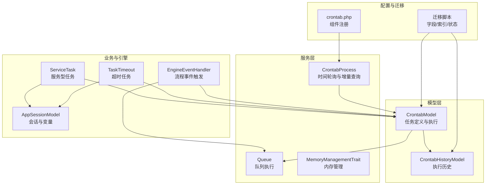
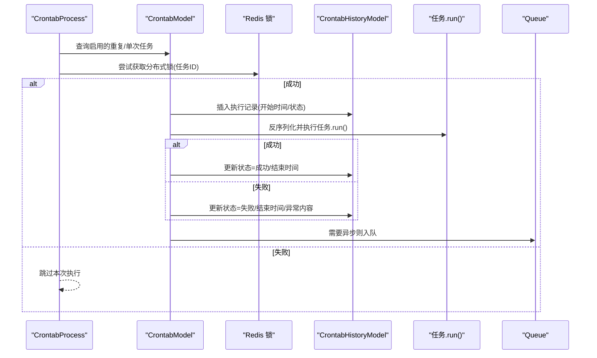
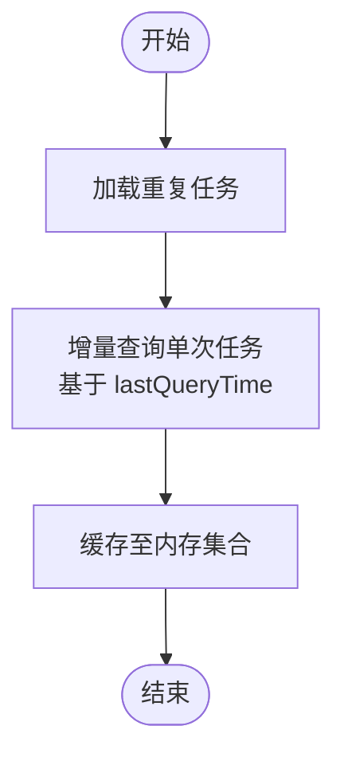
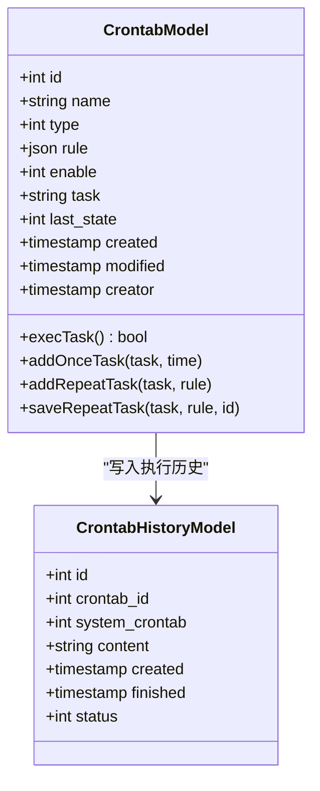
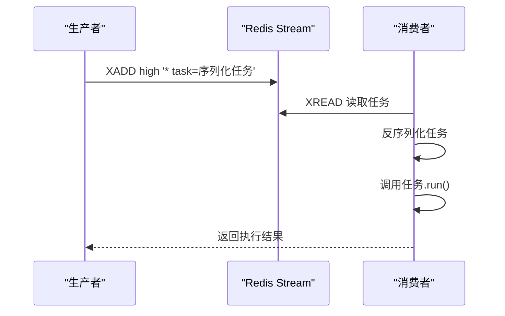
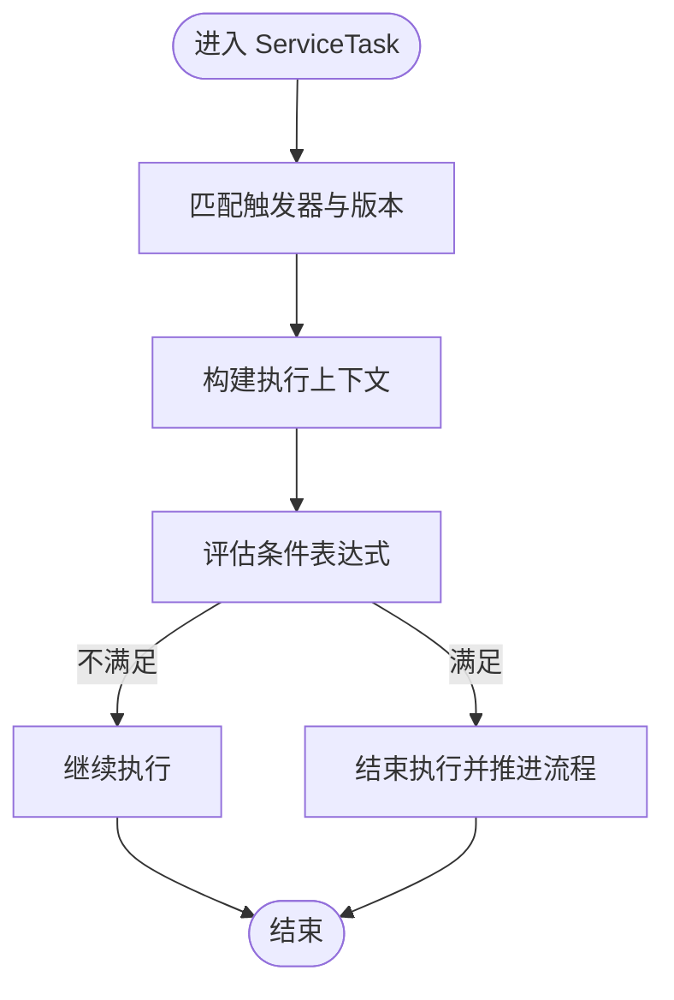
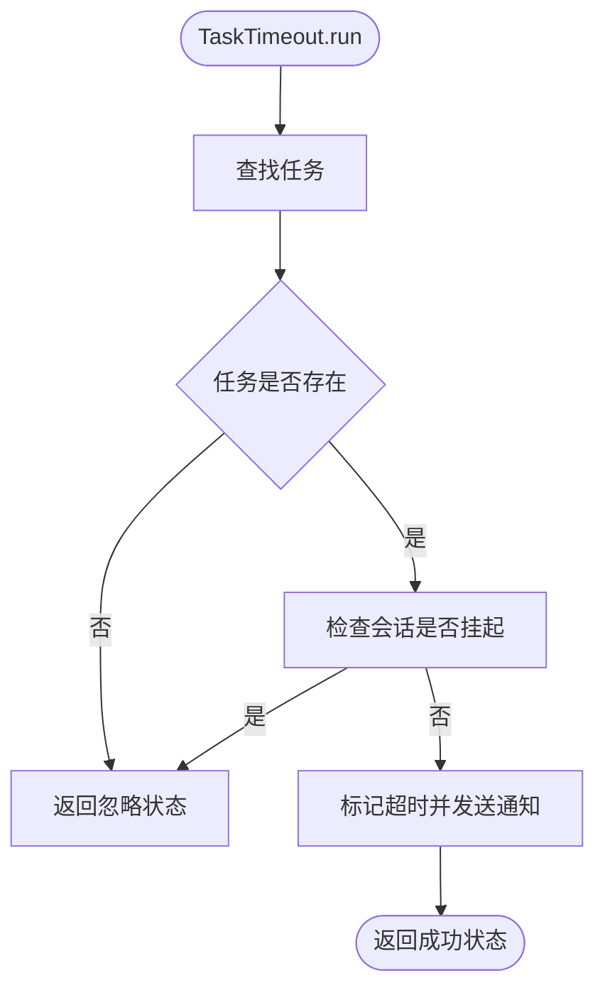
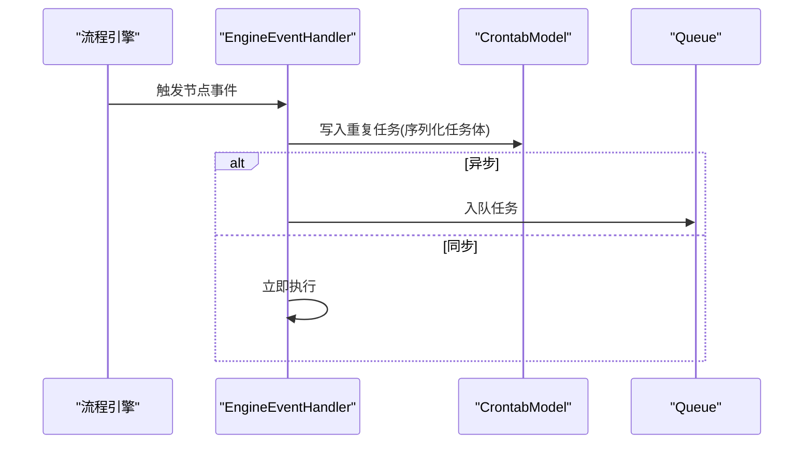
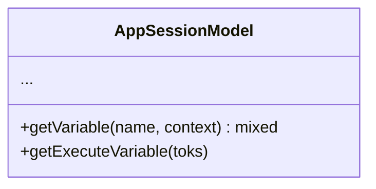
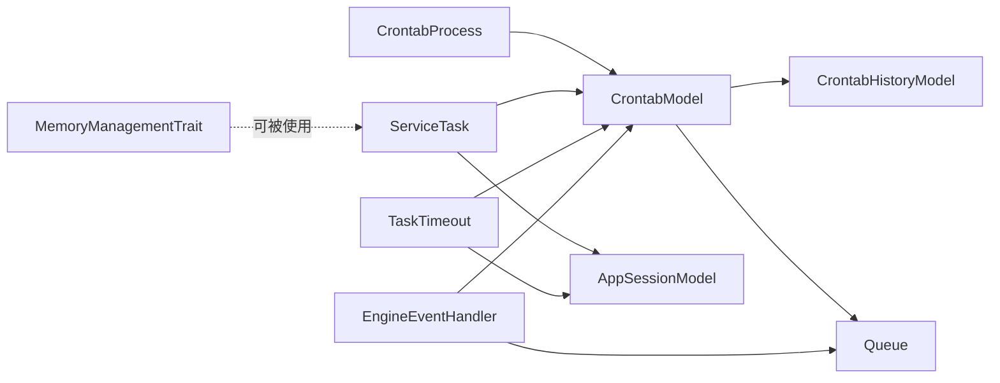

# 定时任务执行

<cite>
**本文引用的文件**
- [process/src/services/crontab/CrontabProcess.php](file://process/src/services/crontab/CrontabProcess.php)
- [process/src/models/CrontabModel.php](file://process/src/models/CrontabModel.php)
- [process/src/models/CrontabHistoryModel.php](file://process/src/models/CrontabHistoryModel.php)
- [process/src/components/Queue.php](file://process/src/components/Queue.php)
- [process/src/config/crontab.php](file://process/src/config/crontab.php)
- [process/src/migrations/migration_20230702_162124_crontab_add_modified.php](file://process/src/migrations/migration_20230702_162124_crontab_add_modified.php)
- [process/src/migrations/migration_20230703_105223_crontab_add_state.php](file://process/src/migrations/migration_20230703_105223_crontab_add_state.php)
- [process/src/migrations/migration_20230912_100642_fix_crontab_tj.php](file://process/src/migrations/migration_20230912_100642_fix_crontab_tj.php)
- [process/src/migrations/migration_20231123_145410_crontab.php](file://process/src/migrations/migration_20231123_145410_crontab.php)
- [process/src/migrations/migration_20250528_144336_up_crontab.php](file://process/src/migrations/migration_20250528_144336_up_crontab.php)
- [process/src/migrations/migration_20250730_194717_repaire_crontabs.php](file://process/src/migrations/migration_20250730_194717_repaire_crontabs.php)
- [process/src/migrations/migration_20251203145531_crontab_statistics.php](file://process/src/migrations/migration_20251203145531_crontab_statistics.php)
- [process/src/services/trait/MemoryManagementTrait.php](file://process/src/services/trait/MemoryManagementTrait.php)
- [process/src/services/task/TaskTimeout.php](file://process/src/services/task/TaskTimeout.php)
- [process/src/services/task/ServiceTask.php](file://process/src/services/task/ServiceTask.php)
- [process/src/modules/process/EngineEventHandler.php](file://process/src/modules/process/EngineEventHandler.php)
- [process/src/engine/ProcTask.php](file://process/src/engine/ProcTask.php)
- [process/src/models/AppSessionModel.php](file://process/src/models/AppSessionModel.php)
</cite>

## 目录
1. [引言](#引言)
2. [项目结构](#项目结构)
3. [核心组件](#核心组件)
4. [架构总览](#架构总览)
5. [详细组件分析](#详细组件分析)
6. [依赖关系分析](#依赖关系分析)
7. [性能考量](#性能考量)
8. [故障排查指南](#故障排查指南)
9. [结论](#结论)
10. [附录](#附录)

## 引言
本文件围绕 htdNew 项目的“定时任务执行”机制进行系统化技术文档整理，重点覆盖以下方面：
- 时间轮询与任务匹配：如何从数据库中发现待执行的单次/重复任务，并进行时间窗口匹配与增量查询。
- 执行调度：单次任务与重复任务的执行路径、历史记录落库、状态机流转与锁控制。
- 上下文管理：任务运行所需的会话、变量、执行上下文传递与隔离。
- 并发控制与资源分配：基于 Redis 分布式锁避免重复执行、基于队列的异步执行与消费者配置。
- 状态跟踪、日志与监控：执行历史、状态码、异常捕获与日志记录。
- 执行策略配置、超时处理与内存管理：任务超时标记、通知、内存阈值与垃圾回收策略。
- 调试方法、性能优化与故障诊断：常见问题定位、参数校验、日志与指标。

## 项目结构
定时任务相关代码主要分布在以下模块：
- 服务层：CrontabProcess（时间轮询与任务拉取）、Queue（队列执行）、MemoryManagementTrait（内存管理）
- 模型层：CrontabModel（任务定义与执行）、CrontabHistoryModel（执行历史）
- 配置层：crontab.php（组件注册）
- 迁移层：多版本迁移脚本（字段演进、索引与状态）
- 业务任务：ServiceTask（服务型任务）、TaskTimeout（超时任务）
- 引擎集成：EngineEventHandler（流程引擎事件触发与任务入队）

**图表来源**
- [process/src/services/crontab/CrontabProcess.php](file://process/src/services/crontab/CrontabProcess.php#L1-L47)
- [process/src/models/CrontabModel.php](file://process/src/models/CrontabModel.php#L1-L223)
- [process/src/models/CrontabHistoryModel.php](file://process/src/models/CrontabHistoryModel.php#L1-L40)
- [process/src/components/Queue.php](file://process/src/components/Queue.php#L1-L52)
- [process/src/config/crontab.php](file://process/src/config/crontab.php#L1-L10)
- [process/src/migrations/migration_20230703_105223_crontab_add_state.php](file://process/src/migrations/migration_20230703_105223_crontab_add_state.php#L1-L25)
- [process/src/services/task/ServiceTask.php](file://process/src/services/task/ServiceTask.php#L79-L222)
- [process/src/services/task/TaskTimeout.php](file://process/src/services/task/TaskTimeout.php#L1-L38)
- [process/src/modules/process/EngineEventHandler.php](file://process/src/modules/process/EngineEventHandler.php#L203-L235)
- [process/src/models/AppSessionModel.php](file://process/src/models/AppSessionModel.php#L873-L929)

**章节来源**
- [process/src/services/crontab/CrontabProcess.php](file://process/src/services/crontab/CrontabProcess.php#L1-L47)
- [process/src/models/CrontabModel.php](file://process/src/models/CrontabModel.php#L1-L223)
- [process/src/models/CrontabHistoryModel.php](file://process/src/models/CrontabHistoryModel.php#L1-L40)
- [process/src/components/Queue.php](file://process/src/components/Queue.php#L1-L52)
- [process/src/config/crontab.php](file://process/src/config/crontab.php#L1-L10)
- [process/src/migrations/migration_20230703_105223_crontab_add_state.php](file://process/src/migrations/migration_20230703_105223_crontab_add_state.php#L1-L25)

## 核心组件
- CrontabProcess：负责拉取启用的重复任务与单次任务（支持增量查询），作为时间轮询入口。
- CrontabModel：任务实体，包含任务类型、规则、序列化任务体、最近状态；提供执行入口与历史记录落库。
- CrontabHistoryModel：执行历史记录，包含任务ID、开始/结束时间、状态码等。
- Queue：基于 Redis Stream 的队列执行器，支持高/中/低三个主题，异步执行任务。
- ServiceTask：服务型任务模板，按触发器与流程上下文执行，支持条件判断与流程推进。
- TaskTimeout：超时任务，对挂起或超时的任务打标并发送通知。
- MemoryManagementTrait：内存监控与清理策略，提供阈值检查、垃圾回收与缓存清理。
- EngineEventHandler：流程引擎事件处理器，将需要定时执行的任务写入计划任务表或入队。

**章节来源**
- [process/src/services/crontab/CrontabProcess.php](file://process/src/services/crontab/CrontabProcess.php#L1-L47)
- [process/src/models/CrontabModel.php](file://process/src/models/CrontabModel.php#L1-L223)
- [process/src/models/CrontabHistoryModel.php](file://process/src/models/CrontabHistoryModel.php#L1-L40)
- [process/src/components/Queue.php](file://process/src/components/Queue.php#L1-L52)
- [process/src/services/task/ServiceTask.php](file://process/src/services/task/ServiceTask.php#L79-L222)
- [process/src/services/task/TaskTimeout.php](file://process/src/services/task/TaskTimeout.php#L1-L38)
- [process/src/services/trait/MemoryManagementTrait.php](file://process/src/services/trait/MemoryManagementTrait.php#L1-L364)
- [process/src/modules/process/EngineEventHandler.php](file://process/src/modules/process/EngineEventHandler.php#L203-L235)

## 架构总览
定时任务执行的整体流程如下：
- 时间轮询：CrontabProcess 从数据库中筛选启用的重复任务与单次任务（单次任务采用增量查询）。
- 任务匹配：根据任务规则（一次性执行时间或重复任务的时间窗与表达式）进行匹配。
- 执行调度：执行前通过 Redis 分布式锁避免重复执行；执行成功或失败均写入 CrontabHistoryModel。
- 异步执行：对于需要异步执行的任务，通过 Queue 推送到 Redis Stream，由消费者异步执行。
- 上下文传递：任务运行时通过 AppSessionModel 提供的变量体系与流程上下文传递所需数据。
- 监控与告警：执行状态、异常信息、超时标记与通知贯穿执行链路。

**图表来源**
- [process/src/services/crontab/CrontabProcess.php](file://process/src/services/crontab/CrontabProcess.php#L1-L47)
- [process/src/models/CrontabModel.php](file://process/src/models/CrontabModel.php#L157-L216)
- [process/src/models/CrontabHistoryModel.php](file://process/src/models/CrontabHistoryModel.php#L1-L40)
- [process/src/components/Queue.php](file://process/src/components/Queue.php#L1-L52)

## 详细组件分析

### 组件一：CrontabProcess（时间轮询与增量查询）
- 重复任务：查询启用的重复任务集合，供时间轮询使用。
- 单次任务：基于上次查询时间进行增量查询，避免全表扫描；将结果缓存至内存集合，便于后续匹配。
- 设计要点：通过 lastQueryTime 实现“只拉增量”的高效策略，降低数据库压力。

**图表来源**
- [process/src/services/crontab/CrontabProcess.php](file://process/src/services/crontab/CrontabProcess.php#L1-L47)

**章节来源**
- [process/src/services/crontab/CrontabProcess.php](file://process/src/services/crontab/CrontabProcess.php#L1-L47)

### 组件二：CrontabModel（任务定义与执行）
- 任务类型：单次（TYPE_ONCE）与重复（TYPE_REPEAT）两类。
- 规则字段：单次任务包含 runtime；重复任务包含 start/end/crontabs；也支持远程数据调用与第三方脚本执行。
- 执行入口：execTask() 中先获取 Redis 分布式锁，再确认任务仍处于启用状态，然后写入执行历史并执行任务。
- 状态管理：维护 last_state 字段，记录最近执行状态（成功/失败/执行中）。
- 序列化存储：任务体以 base64+serialize 方式存储，避免长度截断。

**图表来源**
- [process/src/models/CrontabModel.php](file://process/src/models/CrontabModel.php#L1-L223)
- [process/src/models/CrontabHistoryModel.php](file://process/src/models/CrontabHistoryModel.php#L1-L40)

**章节来源**
- [process/src/models/CrontabModel.php](file://process/src/models/CrontabModel.php#L1-L223)
- [process/src/models/CrontabHistoryModel.php](file://process/src/models/CrontabHistoryModel.php#L1-L40)

### 组件三：Queue（队列执行）
- 主题：high/common/low 三个主题，支持不同优先级的任务。
- 入队：将任务对象序列化后推送到 Redis Stream。
- 消费：从 Stream 中取出任务并反序列化执行，返回执行结果。
- 配置：通过 setConsumerNum 动态设置消费者数量并触发重载。

**图表来源**
- [process/src/components/Queue.php](file://process/src/components/Queue.php#L1-L52)

**章节来源**
- [process/src/components/Queue.php](file://process/src/components/Queue.php#L1-L52)

### 组件四：ServiceTask（服务型任务）
- 触发器：按触发器 ID 与应用版本匹配，过滤测试/正式环境开关。
- 上下文：注入 session 等上下文，支持事件派发与流程推进。
- 条件判断：支持条件表达式，满足条件后结束执行并推进流程。
- 结束执行：可禁用对应计划任务并触发流程节点跳转。

**图表来源**
- [process/src/services/task/ServiceTask.php](file://process/src/services/task/ServiceTask.php#L79-L222)

**章节来源**
- [process/src/services/task/ServiceTask.php](file://process/src/services/task/ServiceTask.php#L79-L222)

### 组件五：TaskTimeout（超时任务）
- 作用：对超时任务打上超时标志，发送超时通知，并返回历史状态码。
- 逻辑：查询任务与会话，若会话挂起则忽略；否则标记超时并通知。

**图表来源**
- [process/src/services/task/TaskTimeout.php](file://process/src/services/task/TaskTimeout.php#L1-L38)

**章节来源**
- [process/src/services/task/TaskTimeout.php](file://process/src/services/task/TaskTimeout.php#L1-L38)

### 组件六：EngineEventHandler（流程引擎事件）
- 作用：在流程节点进入/退出等事件中，将需要定时执行的任务写入计划任务表或入队。
- 关键点：重复任务写入 crontab 表并携带序列化任务体；异步任务入队；事务后入队保证一致性。

**图表来源**
- [process/src/modules/process/EngineEventHandler.php](file://process/src/modules/process/EngineEventHandler.php#L203-L235)

**章节来源**
- [process/src/modules/process/EngineEventHandler.php](file://process/src/modules/process/EngineEventHandler.php#L203-L235)

### 组件七：AppSessionModel（上下文与变量）
- 作用：提供会话级变量解析能力，支持 app/session/form/proc 等命名空间变量。
- 用途：任务执行时通过该模型获取流程变量、URL、操作权限等上下文信息。

**图表来源**
- [process/src/models/AppSessionModel.php](file://process/src/models/AppSessionModel.php#L873-L929)

**章节来源**
- [process/src/models/AppSessionModel.php](file://process/src/models/AppSessionModel.php#L873-L929)

## 依赖关系分析
- CrontabProcess 依赖 CrontabModel 进行任务拉取与执行。
- CrontabModel 依赖 CrontabHistoryModel 记录执行历史，依赖 Queue 进行异步执行。
- ServiceTask 与 TaskTimeout 依赖 CrontabModel 的执行框架与 AppSessionModel 的上下文。
- EngineEventHandler 作为桥接，将流程事件与计划任务/队列打通。
- MemoryManagementTrait 可被具体任务或批处理任务使用，提供内存监控与清理。

**图表来源**
- [process/src/services/crontab/CrontabProcess.php](file://process/src/services/crontab/CrontabProcess.php#L1-L47)
- [process/src/models/CrontabModel.php](file://process/src/models/CrontabModel.php#L1-L223)
- [process/src/models/CrontabHistoryModel.php](file://process/src/models/CrontabHistoryModel.php#L1-L40)
- [process/src/components/Queue.php](file://process/src/components/Queue.php#L1-L52)
- [process/src/services/task/ServiceTask.php](file://process/src/services/task/ServiceTask.php#L79-L222)
- [process/src/services/task/TaskTimeout.php](file://process/src/services/task/TaskTimeout.php#L1-L38)
- [process/src/modules/process/EngineEventHandler.php](file://process/src/modules/process/EngineEventHandler.php#L203-L235)
- [process/src/models/AppSessionModel.php](file://process/src/models/AppSessionModel.php#L873-L929)
- [process/src/services/trait/MemoryManagementTrait.php](file://process/src/services/trait/MemoryManagementTrait.php#L1-L364)

**章节来源**
- [process/src/services/crontab/CrontabProcess.php](file://process/src/services/crontab/CrontabProcess.php#L1-L47)
- [process/src/models/CrontabModel.php](file://process/src/models/CrontabModel.php#L1-L223)
- [process/src/models/CrontabHistoryModel.php](file://process/src/models/CrontabHistoryModel.php#L1-L40)
- [process/src/components/Queue.php](file://process/src/components/Queue.php#L1-L52)
- [process/src/services/task/ServiceTask.php](file://process/src/services/task/ServiceTask.php#L79-L222)
- [process/src/services/task/TaskTimeout.php](file://process/src/services/task/TaskTimeout.php#L1-L38)
- [process/src/modules/process/EngineEventHandler.php](file://process/src/modules/process/EngineEventHandler.php#L203-L235)
- [process/src/models/AppSessionModel.php](file://process/src/models/AppSessionModel.php#L873-L929)
- [process/src/services/trait/MemoryManagementTrait.php](file://process/src/services/trait/MemoryManagementTrait.php#L1-L364)

## 性能考量
- 时间轮询与增量查询：单次任务采用 lastQueryTime 增量拉取，减少全表扫描与网络传输。
- 分布式锁：执行前通过 Redis 锁避免重复执行，提高稳定性与吞吐。
- 队列异步：高/中/低优先级主题分离，结合消费者数量配置，平衡延迟与资源占用。
- 内存管理：MemoryManagementTrait 提供阈值检查、周期性检查、强制 GC 与缓存清理策略，适用于大批量任务场景。
- 数据库索引：迁移脚本新增 crontab_history(crontab_id) 索引，加速历史查询与统计。

**章节来源**
- [process/src/services/crontab/CrontabProcess.php](file://process/src/services/crontab/CrontabProcess.php#L1-L47)
- [process/src/models/CrontabModel.php](file://process/src/models/CrontabModel.php#L157-L216)
- [process/src/components/Queue.php](file://process/src/components/Queue.php#L1-L52)
- [process/src/services/trait/MemoryManagementTrait.php](file://process/src/services/trait/MemoryManagementTrait.php#L1-L364)
- [process/src/migrations/migration_20230703_105223_crontab_add_state.php](file://process/src/migrations/migration_20230703_105223_crontab_add_state.php#L1-L25)

## 故障排查指南
- 任务未执行
  - 检查 CrontabModel.enable 是否为启用状态。
  - 检查 CrontabModel.last_state 是否为执行中且长时间未变更（可能存在锁未释放）。
  - 查看 CrontabHistoryModel 是否有失败记录及异常内容。
- 重复执行或并发冲突
  - 核对 Redis 分布式锁是否正确释放；确认任务执行耗时是否超过锁有效期。
- 异步任务积压
  - 检查 Queue 主题消费速率与消费者数量配置；观察队列长度与消费延迟。
- 超时未触发
  - 确认 TaskTimeout 任务是否被写入计划任务表；检查会话状态是否挂起。
- 内存溢出或性能抖动
  - 使用 MemoryManagementTrait 的阈值与检查间隔策略；必要时启用强制 GC 与缓存清理。

**章节来源**
- [process/src/models/CrontabModel.php](file://process/src/models/CrontabModel.php#L157-L216)
- [process/src/models/CrontabHistoryModel.php](file://process/src/models/CrontabHistoryModel.php#L1-L40)
- [process/src/components/Queue.php](file://process/src/components/Queue.php#L1-L52)
- [process/src/services/task/TaskTimeout.php](file://process/src/services/task/TaskTimeout.php#L1-L38)
- [process/src/services/trait/MemoryManagementTrait.php](file://process/src/services/trait/MemoryManagementTrait.php#L1-L364)

## 结论
htdNew 的定时任务执行机制以 CrontabModel 为核心，结合 CrontabProcess 的时间轮询与增量查询、Redis 分布式锁的并发控制、Queue 的异步执行以及完善的执行历史记录，形成了稳定高效的执行闭环。配合 ServiceTask 的流程上下文与 TaskTimeout 的超时处理，能够满足复杂业务场景下的定时任务需求。通过迁移脚本与内存管理策略，系统具备良好的扩展性与运行时稳定性。

## 附录
- 配置入口：crontab.php 将 CLI 组件合并到组件列表，确保定时任务相关组件可用。
- 迁移要点：字段演进（modified、last_state、type 等）、索引建立（crontab_history.crontab_id）、状态迁移（is_system 标记）。

**章节来源**
- [process/src/config/crontab.php](file://process/src/config/crontab.php#L1-L10)
- [process/src/migrations/migration_20230702_162124_crontab_add_modified.php](file://process/src/migrations/migration_20230702_162124_crontab_add_modified.php#L1-L19)
- [process/src/migrations/migration_20230703_105223_crontab_add_state.php](file://process/src/migrations/migration_20230703_105223_crontab_add_state.php#L1-L25)
- [process/src/migrations/migration_20230912_100642_fix_crontab_tj.php](file://process/src/migrations/migration_20230912_100642_fix_crontab_tj.php)
- [process/src/migrations/migration_20231123_145410_crontab.php](file://process/src/migrations/migration_20231123_145410_crontab.php)
- [process/src/migrations/migration_20250528_144336_up_crontab.php](file://process/src/migrations/migration_20250528_144336_up_crontab.php)
- [process/src/migrations/migration_20250730_194717_repaire_crontabs.php](file://process/src/migrations/migration_20250730_194717_repaire_crontabs.php)
- [process/src/migrations/migration_20251203145531_crontab_statistics.php](file://process/src/migrations/migration_20251203145531_crontab_statistics.php)