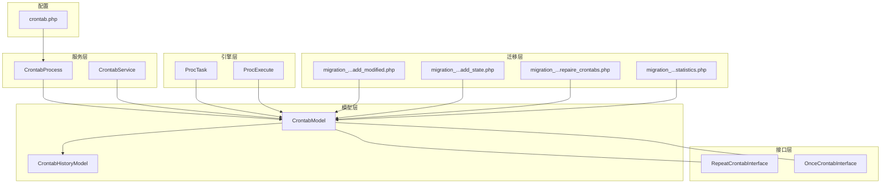
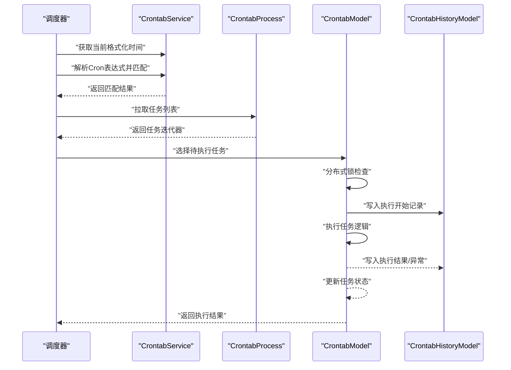
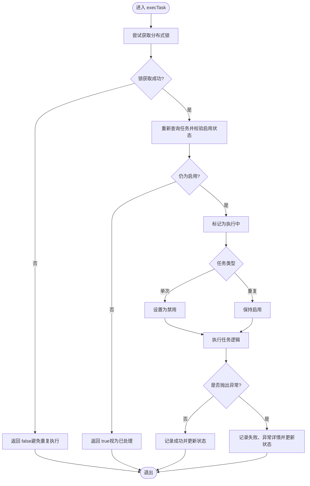
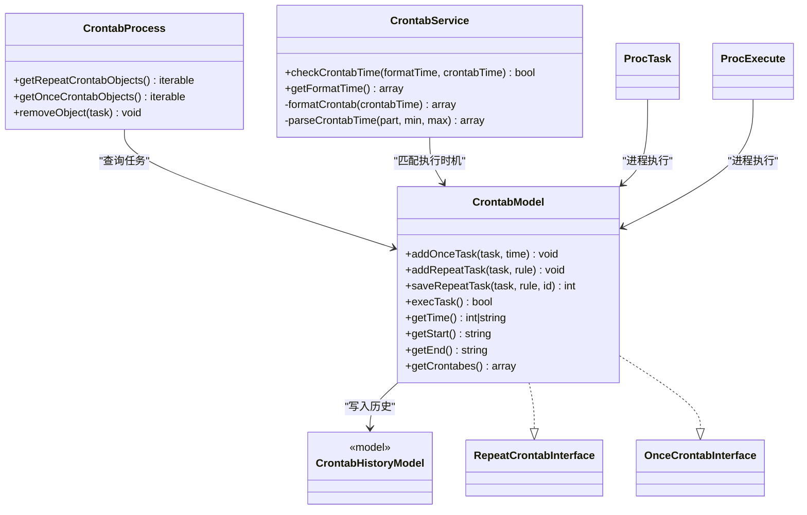

# 定时任务服务

<cite>
**本文引用的文件**
- [CrontabService.php](file://process/src/services/CrontabService.php)
- [CrontabProcess.php](file://process/src/services/crontab/CrontabProcess.php)
- [CrontabModel.php](file://process/src/models/CrontabModel.php)
- [CrontabHistoryModel.php](file://process/src/models/CrontabHistoryModel.php)
- [RepeatCrontabInterface.php](file://process/vendor/lifei/zl/src/process/RepeatCrontabInterface.php)
- [OnceCrontabInterface.php](file://process/vendor/lifei/zl/src/process/OnceCrontabInterface.php)
- [ProcTask.php](file://process/src/engine/ProcTask.php)
- [ProcExecute.php](file://process/src/engine/ProcExecute.php)
- [crontab.php](file://process/src/config/crontab.php)
- [migration_20230702_162124_crontab_add_modified.php](file://process/src/migrations/migration_20230702_162124_crontab_add_modified.php)
- [migration_20230703_105223_crontab_add_state.php](file://process/src/migrations/migration_20230703_105223_crontab_add_state.php)
- [migration_20250730_194717_repaire_crontabs.php](file://process/src/migrations/migration_20250730_194717_repaire_crontabs.php)
- [migration_20251203145531_crontab_statistics.php](file://process/src/migrations/migration_20251203145531_crontab_statistics.php)
</cite>

## 目录
1. [简介](#简介)
2. [项目结构](#项目结构)
3. [核心组件](#核心组件)
4. [架构总览](#架构总览)
5. [详细组件分析](#详细组件分析)
6. [依赖关系分析](#依赖关系分析)
7. [性能考虑](#性能考虑)
8. [故障排查指南](#故障排查指南)
9. [结论](#结论)
10. [附录](#附录)

## 简介
本文件面向 htdNew 项目的 CrontabService 服务层，系统化梳理定时任务服务的职责边界与实现细节，覆盖任务调度算法、执行监控与状态管理、任务注册与执行计划、历史记录与统计分析、执行上下文与异常处理、重试机制、性能监控指标、故障恢复策略，以及服务扩展与集成方法。目标是帮助开发者快速理解并安全地扩展定时任务能力。

## 项目结构
围绕定时任务的关键文件分布如下：
- 服务层：CrontabService（调度解析）、CrontabProcess（任务拉取与增量）
- 模型层：CrontabModel（任务实体与执行）、CrontabHistoryModel（执行历史）
- 接口层：RepeatCrontabInterface、OnceCrontabInterface（任务契约）
- 引擎层：ProcTask、ProcExecute（进程引擎适配）
- 配置层：crontab.php（组件装配）
- 迁移层：多版本迁移脚本（字段演进、修复与统计初始化）

图表来源
- [crontab.php](file://process/src/config/crontab.php#L1-L10)
- [CrontabService.php](file://process/src/services/CrontabService.php#L1-L84)
- [CrontabProcess.php](file://process/src/services/crontab/CrontabProcess.php#L1-L46)
- [CrontabModel.php](file://process/src/models/CrontabModel.php#L1-L223)
- [CrontabHistoryModel.php](file://process/src/models/CrontabHistoryModel.php#L1-L40)
- [RepeatCrontabInterface.php](file://process/vendor/lifei/zl/src/process/RepeatCrontabInterface.php#L1-L16)
- [OnceCrontabInterface.php](file://process/vendor/lifei/zl/src/process/OnceCrontabInterface.php#L1-L18)
- [ProcTask.php](file://process/src/engine/ProcTask.php#L1-L11)
- [ProcExecute.php](file://process/src/engine/ProcExecute.php#L1-L11)
- [migration_20230702_162124_crontab_add_modified.php](file://process/src/migrations/migration_20230702_162124_crontab_add_modified.php#L1-L19)
- [migration_20230703_105223_crontab_add_state.php](file://process/src/migrations/migration_20230703_105223_crontab_add_state.php#L1-L25)
- [migration_20250730_194717_repaire_crontabs.php](file://process/src/migrations/migration_20250730_194717_repaire_crontabs.php#L1-L32)
- [migration_20251203145531_crontab_statistics.php](file://process/src/migrations/migration_20251203145531_crontab_statistics.php#L1-L32)

章节来源
- [crontab.php](file://process/src/config/crontab.php#L1-L10)

## 核心组件
- CrontabService：负责将“标准 Cron 表达式”解析为可比较的时间片段集合，并与当前格式化时间进行匹配判断，用于决定是否触发某条任务。
- CrontabProcess：从数据库中查询启用且符合条件的任务，支持重复任务全量与单次任务增量两种拉取模式，为进程调度器提供任务对象迭代器。
- CrontabModel：任务实体与执行入口，封装任务注册、执行上下文、分布式锁、状态更新、历史记录写入与异常处理。
- CrontabHistoryModel：记录每次任务执行的开始、结束、状态与错误详情。
- 接口层：RepeatCrontabInterface、OnceCrontabInterface 定义重复与单次任务的统一契约。
- 引擎层：ProcTask、ProcExecute 提供进程级任务执行与调度能力。
- 迁移层：维护任务表结构演进、修复历史数据与初始化统计任务。

章节来源
- [CrontabService.php](file://process/src/services/CrontabService.php#L1-L84)
- [CrontabProcess.php](file://process/src/services/crontab/CrontabProcess.php#L1-L46)
- [CrontabModel.php](file://process/src/models/CrontabModel.php#L1-L223)
- [CrontabHistoryModel.php](file://process/src/models/CrontabHistoryModel.php#L1-L40)
- [RepeatCrontabInterface.php](file://process/vendor/lifei/zl/src/process/RepeatCrontabInterface.php#L1-L16)
- [OnceCrontabInterface.php](file://process/vendor/lifei/zl/src/process/OnceCrontabInterface.php#L1-L18)
- [ProcTask.php](file://process/src/engine/ProcTask.php#L1-L11)
- [ProcExecute.php](file://process/src/engine/ProcExecute.php#L1-L11)

## 架构总览
定时任务服务采用“服务层 + 模型层 + 引擎层”的分层设计，通过 CrontabService 的表达式解析与 CrontabProcess 的任务拉取，驱动 CrontabModel 的执行与历史记录，最终形成闭环的执行监控与状态管理。

图表来源
- [CrontabService.php](file://process/src/services/CrontabService.php#L1-L84)
- [CrontabProcess.php](file://process/src/services/crontab/CrontabProcess.php#L1-L46)
- [CrontabModel.php](file://process/src/models/CrontabModel.php#L150-L216)
- [CrontabHistoryModel.php](file://process/src/models/CrontabHistoryModel.php#L1-L40)

## 详细组件分析

### CrontabService：Cron 表达式解析与匹配
- 功能要点
  - 将标准 Cron 表达式按“分、时、日、月、周”拆解为候选集合。
  - 支持“,”（枚举）、“/”（步长）、“-”（范围）、“*”（全部）等语法。
  - 生成当前时间的格式化数组，逐位比对以判定是否命中。
- 关键方法
  - getFormatTime：返回当前时间的格式化数组（分钟、小时、日、月、星期）。
  - checkCrontabTime：对齐当前时间与规则，返回是否应执行。
  - formatCrontab、parseCrontabTime：内部解析器，递归处理多段组合与步长/范围。
- 复杂度
  - 解析单条规则为 O(n)（n 为规则项数量），整体复杂度取决于规则条目数与匹配次数。
- 使用建议
  - 在调度器中先调用 getFormatTime，再对每条任务调用 checkCrontabTime，减少无效计算。

章节来源
- [CrontabService.php](file://process/src/services/CrontabService.php#L1-L84)

### CrontabProcess：任务拉取与增量
- 功能要点
  - 重复任务：查询启用的重复任务集合。
  - 单次任务：基于上次查询时间进行增量查询，避免全量扫描。
  - 维护内存中的单次任务集合，便于后续调度。
- 关键方法
  - getRepeatCrontabObjects：返回启用的重复任务迭代器。
  - getOnceCrontabObjects：返回自上次查询以来新增/变更的单次任务集合，并更新查询时间。
  - removeObject：预留接口（当前为空实现）。
- 性能特性
  - 单次任务使用“modified”字段进行增量拉取，降低数据库压力。
- 注意事项
  - 增量查询依赖“modified”字段，需确保该字段在迁移与业务更新中正确维护。

章节来源
- [CrontabProcess.php](file://process/src/services/crontab/CrontabProcess.php#L1-L46)
- [migration_20230702_162124_crontab_add_modified.php](file://process/src/migrations/migration_20230702_162124_crontab_add_modified.php#L1-L19)

### CrontabModel：任务注册、执行与状态管理
- 任务类型与规则
  - 类型：单次（TYPE_ONCE）、重复（TYPE_REPEAT）。
  - 规则：重复任务包含 start/end/crontabs；单次任务包含 runtime。
  - 任务内容：支持系统任务（序列化对象）、远程数据调用、第三方脚本。
- 注册与保存
  - addOnceTask/addRepeatTask/saveRepeatTask：提供任务注册与更新接口。
- 执行流程
  - 分布式锁：使用缓存键与过期时间避免并发重复执行。
  - 执行前校验：若任务被删除或禁用，则直接返回成功。
  - 状态流转：执行中 -> 成功/失败；单次任务执行后自动禁用。
  - 历史记录：写入开始时间、结束时间、状态与异常详情。
- 异常处理
  - 捕获 Throwable 并记录错误堆栈，设置失败状态与结束时间。
- 关键方法路径
  - 执行入口：[execTask](file://process/src/models/CrontabModel.php#L162-L216)
  - 单次任务运行时间：[getTime](file://process/src/models/CrontabModel.php#L122-L128)
  - 重复任务规则访问：[getStart/getEnd/getCrontabes](file://process/src/models/CrontabModel.php#L136-L149)
  - 状态更新：[setStatus](file://process/src/models/CrontabModel.php#L151-L155)

图表来源
- [CrontabModel.php](file://process/src/models/CrontabModel.php#L162-L216)

章节来源
- [CrontabModel.php](file://process/src/models/CrontabModel.php#L1-L223)

### CrontabHistoryModel：执行历史与状态
- 字段与含义
  - crontab_id：关联任务 ID。
  - created/finished：开始与结束时间。
  - status：执行状态（执行中、成功、失败、忽略）。
  - content：失败时的错误内容。
- 状态语义
  - STATUS_EXECUTING：执行中（由服务端在执行前写入）。
  - STATUS_SUCCESS/STATUS_FAILED/STATUS_IGNORE：执行完成后的状态。

章节来源
- [CrontabHistoryModel.php](file://process/src/models/CrontabHistoryModel.php#L1-L40)

### 接口层：RepeatCrontabInterface 与 OnceCrontabInterface
- RepeatCrontabInterface：提供重复任务的开始时间、结束时间与 cron 列表访问。
- OnceCrontabInterface：提供单次任务的定时器 ID、运行时间与设置接口。
- CrontabModel 实现上述接口，保证统一的契约与可扩展性。

章节来源
- [RepeatCrontabInterface.php](file://process/vendor/lifei/zl/src/process/RepeatCrontabInterface.php#L1-L16)
- [OnceCrontabInterface.php](file://process/vendor/lifei/zl/src/process/OnceCrontabInterface.php#L1-L18)
- [CrontabModel.php](file://process/src/models/CrontabModel.php#L1-L223)

### 引擎层：ProcTask 与 ProcExecute
- 作用
  - ProcTask/ProcExecute 作为进程引擎的适配层，承载任务在进程内的调度与执行。
  - 与 CrontabModel 协作，确保任务在进程生命周期内稳定运行。
- 注意
  - 引擎层仅做适配，具体任务逻辑由 CrontabModel 内部执行。

章节来源
- [ProcTask.php](file://process/src/engine/ProcTask.php#L1-L11)
- [ProcExecute.php](file://process/src/engine/ProcExecute.php#L1-L11)

### 迁移层：结构演进与修复
- 字段演进
  - 添加 modified 时间戳字段，支持增量拉取。
  - 新增 last_state 字段，记录最近执行状态；调整 type 字段语义与索引优化。
- 数据修复
  - 修复重复任务规则字段类型不一致问题，确保 crontabs 为数组。
- 初始化统计
  - 在特定条件下插入统计类任务，绑定规则与执行体。

章节来源
- [migration_20230702_162124_crontab_add_modified.php](file://process/src/migrations/migration_20230702_162124_crontab_add_modified.php#L1-L19)
- [migration_20230703_105223_crontab_add_state.php](file://process/src/migrations/migration_20230703_105223_crontab_add_state.php#L1-L25)
- [migration_20250730_194717_repaire_crontabs.php](file://process/src/migrations/migration_20250730_194717_repaire_crontabs.php#L1-L32)
- [migration_20251203145531_crontab_statistics.php](file://process/src/migrations/migration_20251203145531_crontab_statistics.php#L1-L32)

## 依赖关系分析
- 服务层依赖模型层提供的任务与历史数据访问。
- CrontabProcess 依赖 CrontabModel 查询任务集合。
- CrontabService 与 CrontabModel 通过 Cron 表达式与时间匹配协作。
- 引擎层与模型层通过任务对象序列化与反序列化交互。
- 迁移层保障任务表结构与历史数据一致性。

图表来源
- [CrontabService.php](file://process/src/services/CrontabService.php#L1-L84)
- [CrontabProcess.php](file://process/src/services/crontab/CrontabProcess.php#L1-L46)
- [CrontabModel.php](file://process/src/models/CrontabModel.php#L1-L223)
- [CrontabHistoryModel.php](file://process/src/models/CrontabHistoryModel.php#L1-L40)
- [RepeatCrontabInterface.php](file://process/vendor/lifei/zl/src/process/RepeatCrontabInterface.php#L1-L16)
- [OnceCrontabInterface.php](file://process/vendor/lifei/zl/src/process/OnceCrontabInterface.php#L1-L18)
- [ProcTask.php](file://process/src/engine/ProcTask.php#L1-L11)
- [ProcExecute.php](file://process/src/engine/ProcExecute.php#L1-L11)

## 性能考虑
- 增量拉取：单次任务通过“modified”字段进行增量查询，显著降低全量扫描成本。
- 分布式锁：执行前加锁（带过期时间），避免并发重复执行，提升稳定性。
- 规则解析：Cron 表达式解析为候选集合，匹配时按位比较，复杂度与规则规模线性相关。
- 历史记录：仅记录必要字段，避免冗余存储；索引优化见迁移脚本。
- 建议
  - 控制单条规则的枚举数量，优先使用范围与步长。
  - 对高频任务合理设置执行间隔，避免瞬时并发高峰。
  - 监控历史表增长趋势，定期清理或归档。

[本节为通用性能指导，无需列出章节来源]

## 故障排查指南
- 任务未执行
  - 检查任务是否启用、规则是否有效、当前时间是否匹配。
  - 查看历史记录状态是否为“忽略”，确认 Cron 表达式解析是否正确。
- 重复执行
  - 检查分布式锁是否生效（缓存键是否存在且未过期）。
  - 确认任务执行耗时是否超过锁有效期。
- 执行失败
  - 查看历史记录的错误内容字段，定位异常堆栈。
  - 确认任务对象序列化与反序列化是否正常。
- 增量拉取异常
  - 确认“modified”字段是否更新，检查 CrontabProcess 的查询条件。
- 数据修复
  - 若重复任务规则字段类型异常，参考迁移脚本进行修复。

章节来源
- [CrontabModel.php](file://process/src/models/CrontabModel.php#L162-L216)
- [CrontabHistoryModel.php](file://process/src/models/CrontabHistoryModel.php#L1-L40)
- [migration_20250730_194717_repaire_crontabs.php](file://process/src/migrations/migration_20250730_194717_repaire_crontabs.php#L1-L32)

## 结论
CrontabService 服务层通过清晰的职责划分与稳健的执行链路，实现了对 Cron 表达式的高效解析、对任务的可靠拉取与执行、对执行过程的完整监控与状态管理。配合模型层的状态与历史记录、接口层的契约约束、引擎层的进程执行能力，以及迁移层的结构演进，形成了可扩展、可维护、可观测的定时任务体系。

[本节为总结性内容，无需列出章节来源]

## 附录

### 服务调用示例（步骤说明）
- 注册重复任务
  - 使用 CrontabModel 的 addRepeatTask 或 saveRepeatTask 方法，传入任务对象与规则数组。
  - 参考路径：[addRepeatTask/saveRepeatTask](file://process/src/models/CrontabModel.php#L76-L107)
- 注册单次任务
  - 使用 CrontabModel 的 addOnceTask 方法，指定运行时间戳或时间字符串。
  - 参考路径：[addOnceTask](file://process/src/models/CrontabModel.php#L62-L74)
- 拉取并执行任务
  - 使用 CrontabProcess 的 getRepeatCrontabObjects 与 getOnceCrontabObjects 获取任务集合。
  - 使用 CrontabService 的 checkCrontabTime 判断是否应执行。
  - 调用 CrontabModel 的 execTask 执行任务并记录历史。
  - 参考路径：
    - [CrontabProcess](file://process/src/services/crontab/CrontabProcess.php#L1-L46)
    - [CrontabService](file://process/src/services/CrontabService.php#L1-L84)
    - [CrontabModel.execTask](file://process/src/models/CrontabModel.php#L162-L216)

### 性能监控指标（建议）
- 任务命中率：匹配成功次数 / 轮询次数
- 平均执行时延：任务执行完成时间 - 开始时间
- 失败率：失败次数 / 总执行次数
- 并发冲突率：锁获取失败次数 / 总执行次数
- 历史表大小与增长速率

[本节为通用监控建议，无需列出章节来源]

### 故障恢复策略
- 自动降级：当锁获取失败或异常频繁时，延迟下一轮执行。
- 限流保护：对热点任务增加最小间隔限制，避免资源争用。
- 数据修复：定期运行迁移脚本修复历史数据与结构问题。
- 日志审计：保留关键操作日志，便于回溯与分析。

[本节为通用策略建议，无需列出章节来源]

### 服务扩展指南
- 新增任务类型
  - 在 CrontabModel 中扩展类型常量与规则字段，确保接口层契约不变。
- 自定义执行器
  - 通过 CrontabModel 的任务内容字段支持更多执行方式（如远程调用、脚本执行）。
- 扩展监控维度
  - 在 CrontabHistoryModel 中新增字段记录额外指标（如资源消耗、外部依赖耗时）。
- 集成方法
  - 在 crontab.php 中装配组件，确保 CrontabProcess 与 CrontabService 正常加载。
  - 参考路径：[crontab.php](file://process/src/config/crontab.php#L1-L10)

章节来源
- [crontab.php](file://process/src/config/crontab.php#L1-L10)
- [CrontabModel.php](file://process/src/models/CrontabModel.php#L1-L223)