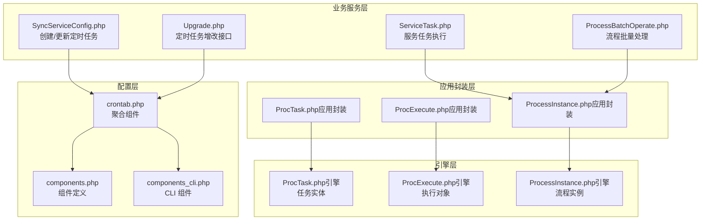
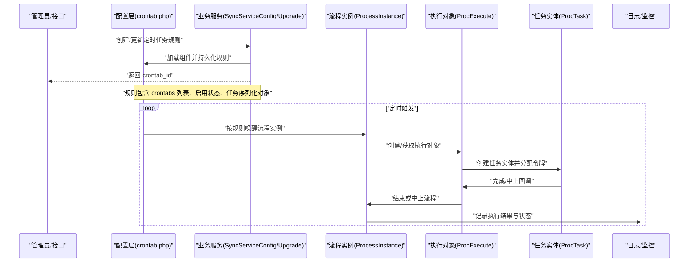
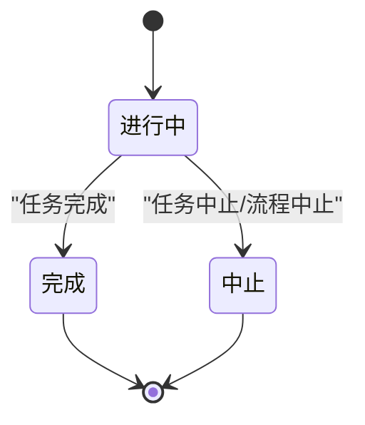
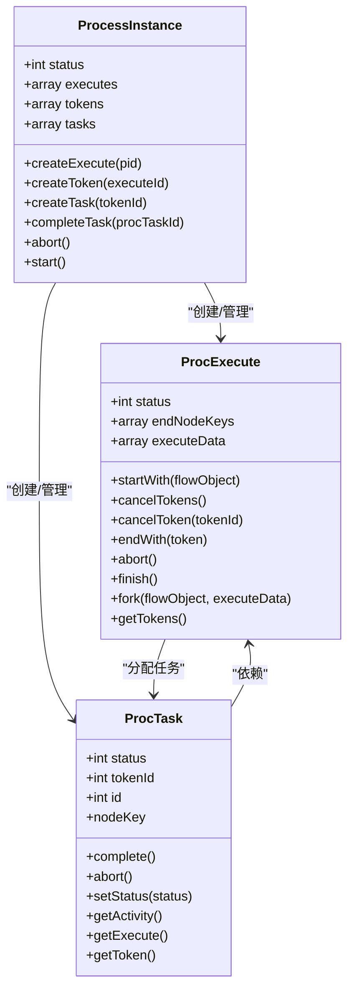
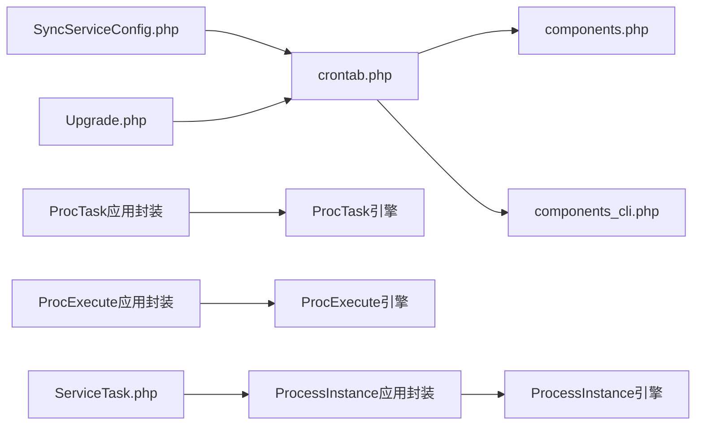

# 定时任务系统

<cite>
**本文引用的文件**
- [crontab.php](file://process/src/config/crontab.php)
- [components.php](file://process/src/config/components.php)
- [components_cli.php](file://process/src/config/components_cli.php)
- [ProcTask.php（引擎）](file://process/vendor/lifei/engine/src/ProcTask.php)
- [ProcExecute.php（引擎）](file://process/vendor/lifei/engine/src/ProcExecute.php)
- [ProcessInstance.php（引擎）](file://process/vendor/lifei/engine/src/ProcessInstance.php)
- [ProcTask.php（应用封装）](file://process/src/engine/ProcTask.php)
- [ProcExecute.php（应用封装）](file://process/src/engine/ProcExecute.php)
- [ProcessInstance.php（应用封装）](file://process/src/engine/ProcessInstance.php)
- [SyncServiceConfig.php](file://process/src/services/user/SyncServiceConfig.php)
- [Upgrade.php](file://process/src/http/system/Upgrade.php)
- [ServiceTask.php](file://process/src/services/task/ServiceTask.php)
- [ProcessBatchOperate.php](file://process/src/services/task/ProcessBatchOperate.php)
</cite>

## 目录
1. [引言](#引言)
2. [项目结构](#项目结构)
3. [核心组件](#核心组件)
4. [架构总览](#架构总览)
5. [详细组件分析](#详细组件分析)
6. [依赖关系分析](#依赖关系分析)
7. [性能考虑](#性能考虑)
8. [故障排除指南](#故障排除指南)
9. [结论](#结论)
10. [附录](#附录)

## 引言
本文件面向 htdNew 项目的“定时任务系统”，聚焦于基于 Crontab 的定时任务调度机制与运行时生命周期管理。文档从任务配置格式、执行周期设置、任务状态管理入手，逐步展开到注册流程、执行监控与日志记录，进一步阐述任务优先级、并发控制与资源限制策略，并给出任务配置模板、调度算法与性能优化建议，最后提供开发指南、调试方法与故障排除技巧。

## 项目结构
定时任务系统由“配置层”“引擎层”“应用封装层”“业务服务层”四部分协同构成：
- 配置层：通过配置文件聚合组件，暴露给 CLI/HTTP 环境使用。
- 引擎层：提供流程执行对象、令牌与任务实体，负责状态流转与序列化持久化。
- 应用封装层：在引擎之上增加命名空间与兼容性注释，确保历史序列化对象可恢复。
- 业务服务层：提供定时任务的创建、更新、启用/禁用、执行与日志记录等能力。

图表来源
- [crontab.php](file://process/src/config/crontab.php#L1-L10)
- [components.php](file://process/src/config/components.php#L1-L34)
- [components_cli.php](file://process/src/config/components_cli.php#L1-L3)
- [ProcTask.php（引擎）](file://process/vendor/lifei/engine/src/ProcTask.php#L1-L81)
- [ProcExecute.php（引擎）](file://process/vendor/lifei/engine/src/ProcExecute.php#L1-L246)
- [ProcessInstance.php（引擎）](file://process/vendor/lifei/engine/src/ProcessInstance.php#L1-L289)
- [ProcTask.php（应用封装）](file://process/src/engine/ProcTask.php#L1-L11)
- [ProcExecute.php（应用封装）](file://process/src/engine/ProcExecute.php#L1-L11)
- [ProcessInstance.php（应用封装）](file://process/src/engine/ProcessInstance.php#L1-L11)
- [SyncServiceConfig.php](file://process/src/services/user/SyncServiceConfig.php#L657-L695)
- [Upgrade.php](file://process/src/http/system/Upgrade.php#L716-L753)
- [ServiceTask.php](file://process/src/services/task/ServiceTask.php#L79-L108)
- [ProcessBatchOperate.php](file://process/src/services/task/ProcessBatchOperate.php#L1-L48)

章节来源
- [crontab.php](file://process/src/config/crontab.php#L1-L10)
- [components.php](file://process/src/config/components.php#L1-L34)
- [components_cli.php](file://process/src/config/components_cli.php#L1-L3)

## 核心组件
- 任务实体（ProcTask）
  - 负责任务状态管理（进行中、完成、中止），关联执行对象与令牌，支持序列化与反序列化。
  - 提供完成与中止操作，驱动流程节点的完成回调。
- 执行对象（ProcExecute）
  - 表示一次流程执行实例，维护执行状态、子执行、令牌集合与执行数据。
  - 支持启动/跳转/取消令牌、结束与中止，以及父子流程的层级关系。
- 流程实例（ProcessInstance）
  - 统一的流程读写入口，持有执行对象、令牌与任务列表，负责 ID 分配与序列化。
  - 提供任务创建、任务完成/跳转/停止、流程开始/结束/中止等核心方法。
- 应用封装
  - 在引擎类基础上增加命名空间与兼容性注释，保证历史序列化对象可恢复。

章节来源
- [ProcTask.php（引擎）](file://process/vendor/lifei/engine/src/ProcTask.php#L1-L81)
- [ProcExecute.php（引擎）](file://process/vendor/lifei/engine/src/ProcExecute.php#L1-L246)
- [ProcessInstance.php（引擎）](file://process/vendor/lifei/engine/src/ProcessInstance.php#L1-L289)
- [ProcTask.php（应用封装）](file://process/src/engine/ProcTask.php#L1-L11)
- [ProcExecute.php（应用封装）](file://process/src/engine/ProcExecute.php#L1-L11)
- [ProcessInstance.php（应用封装）](file://process/src/engine/ProcessInstance.php#L1-L11)

## 架构总览
定时任务的生命周期从“配置与注册”到“调度执行”再到“状态回写与日志归档”，整体流程如下：

图表来源
- [crontab.php](file://process/src/config/crontab.php#L1-L10)
- [components.php](file://process/src/config/components.php#L1-L34)
- [SyncServiceConfig.php](file://process/src/services/user/SyncServiceConfig.php#L657-L695)
- [Upgrade.php](file://process/src/http/system/Upgrade.php#L716-L753)
- [ProcessInstance.php（引擎）](file://process/vendor/lifei/engine/src/ProcessInstance.php#L1-L289)
- [ProcExecute.php（引擎）](file://process/vendor/lifei/engine/src/ProcExecute.php#L1-L246)
- [ProcTask.php（引擎）](file://process/vendor/lifei/engine/src/ProcTask.php#L1-L81)

## 详细组件分析

### 任务配置格式与执行周期
- 规则字段
  - crontabs：字符串或数组，支持多周期表达式；接口侧会将换行分隔的字符串拆分为数组。
  - enable：启用/禁用标志。
  - task：序列化后的任务对象，通常为服务任务类实例。
  - name/type：任务名称与类型（如重复型）。
- 周期设置
  - 支持单个或多个 Cron 表达式，系统按规则扫描触发点，生成执行计划。
- 启用/禁用
  - 通过更新规则中的 enable 字段实现动态启停。

章节来源
- [Upgrade.php](file://process/src/http/system/Upgrade.php#L716-L753)
- [SyncServiceConfig.php](file://process/src/services/user/SyncServiceConfig.php#L657-L695)

### 注册流程与持久化
- 创建/更新
  - 业务服务根据配置生成规则对象，序列化任务对象并写入数据库，返回 crontab_id。
- 关联关系
  - 定时任务与具体业务对象（如升级任务、用户同步任务）通过序列化对象绑定。
- 组件加载
  - 配置文件聚合组件，供 CLI/HTTP 环境使用，确保任务执行上下文可用。

章节来源
- [SyncServiceConfig.php](file://process/src/services/user/SyncServiceConfig.php#L657-L695)
- [Upgrade.php](file://process/src/http/system/Upgrade.php#L716-L753)
- [crontab.php](file://process/src/config/crontab.php#L1-L10)
- [components.php](file://process/src/config/components.php#L1-L34)

### 执行监控与日志记录
- 日志路径
  - 服务任务执行过程中会输出调试日志，包含任务列表、触发器信息与上下文。
- 记录维度
  - 包含会话 ID、节点键、定时任务 ID 等关键标识，便于问题定位与审计。
- 批量处理
  - 提供批量暂停/恢复等流程操作，配合日志与权限校验保障可观测性。

章节来源
- [ServiceTask.php](file://process/src/services/task/ServiceTask.php#L79-L108)
- [ProcessBatchOperate.php](file://process/src/services/task/ProcessBatchOperate.php#L1-L48)

### 任务状态管理与生命周期
- 状态枚举
  - 任务：进行中、完成、中止。
  - 执行：进行中、正常结束、中止。
  - 流程实例：进行中、已完成、中止。
- 生命周期
  - 创建执行对象与令牌 → 分配任务实体 → 执行完成后完成/中止 → 回调流程节点 → 结束或继续。
- 中止与取消
  - 支持取消令牌、中止子流程与令牌上的活动任务，确保状态一致性。

图表来源
- [ProcTask.php（引擎）](file://process/vendor/lifei/engine/src/ProcTask.php#L1-L81)
- [ProcExecute.php（引擎）](file://process/vendor/lifei/engine/src/ProcExecute.php#L1-L246)
- [ProcessInstance.php（引擎）](file://process/vendor/lifei/engine/src/ProcessInstance.php#L1-L289)

### 并发控制与资源限制
- 并发策略
  - 通过令牌与执行对象隔离不同活动实例，避免同一节点并发冲突。
  - 子流程与父子执行对象链路清晰，减少跨实例干扰。
- 资源限制
  - 使用序列化与弱引用降低内存占用，避免循环引用。
  - 通过组件化配置（缓存、队列、通知等）扩展资源管理能力。

章节来源
- [ProcExecute.php（引擎）](file://process/vendor/lifei/engine/src/ProcExecute.php#L1-L246)
- [ProcessInstance.php（引擎）](file://process/vendor/lifei/engine/src/ProcessInstance.php#L1-L289)
- [components.php](file://process/src/config/components.php#L1-L34)

### 调度算法与性能优化
- 调度算法
  - 基于 Cron 表达式的规则扫描与触发，结合任务对象序列化与反序列化，实现稳定恢复。
- 性能优化
  - 仅序列化必要字段，避免大对象频繁序列化。
  - 使用弱引用与延迟初始化，降低内存压力。
  - 将日志与监控分离，避免阻塞主流程。

章节来源
- [ProcTask.php（引擎）](file://process/vendor/lifei/engine/src/ProcTask.php#L1-L81)
- [ProcExecute.php（引擎）](file://process/vendor/lifei/engine/src/ProcExecute.php#L1-L246)
- [ProcessInstance.php（引擎）](file://process/vendor/lifei/engine/src/ProcessInstance.php#L1-L289)

### 类关系图（代码级）

图表来源
- [ProcessInstance.php（引擎）](file://process/vendor/lifei/engine/src/ProcessInstance.php#L1-L289)
- [ProcExecute.php（引擎）](file://process/vendor/lifei/engine/src/ProcExecute.php#L1-L246)
- [ProcTask.php（引擎）](file://process/vendor/lifei/engine/src/ProcTask.php#L1-L81)

## 依赖关系分析
- 配置聚合
  - crontab.php 合并 components.php 与 components_cli.php，形成统一组件视图。
- 引擎依赖
  - 应用封装类依赖引擎类，保持兼容性与可恢复性。
- 业务依赖
  - 业务服务通过配置加载组件，持久化任务规则并驱动流程实例执行。

图表来源
- [crontab.php](file://process/src/config/crontab.php#L1-L10)
- [components.php](file://process/src/config/components.php#L1-L34)
- [components_cli.php](file://process/src/config/components_cli.php#L1-L3)
- [ProcTask.php（应用封装）](file://process/src/engine/ProcTask.php#L1-L11)
- [ProcExecute.php（应用封装）](file://process/src/engine/ProcExecute.php#L1-L11)
- [ProcessInstance.php（应用封装）](file://process/src/engine/ProcessInstance.php#L1-L11)
- [ProcTask.php（引擎）](file://process/vendor/lifei/engine/src/ProcTask.php#L1-L81)
- [ProcExecute.php（引擎）](file://process/vendor/lifei/engine/src/ProcExecute.php#L1-L246)
- [ProcessInstance.php（引擎）](file://process/vendor/lifei/engine/src/ProcessInstance.php#L1-L289)
- [SyncServiceConfig.php](file://process/src/services/user/SyncServiceConfig.php#L657-L695)
- [Upgrade.php](file://process/src/http/system/Upgrade.php#L716-L753)
- [ServiceTask.php](file://process/src/services/task/ServiceTask.php#L79-L108)

章节来源
- [crontab.php](file://process/src/config/crontab.php#L1-L10)
- [components.php](file://process/src/config/components.php#L1-L34)
- [components_cli.php](file://process/src/config/components_cli.php#L1-L3)
- [ProcTask.php（应用封装）](file://process/src/engine/ProcTask.php#L1-L11)
- [ProcExecute.php（应用封装）](file://process/src/engine/ProcExecute.php#L1-L11)
- [ProcessInstance.php（应用封装）](file://process/src/engine/ProcessInstance.php#L1-L11)
- [ProcTask.php（引擎）](file://process/vendor/lifei/engine/src/ProcTask.php#L1-L81)
- [ProcExecute.php（引擎）](file://process/vendor/lifei/engine/src/ProcExecute.php#L1-L246)
- [ProcessInstance.php（引擎）](file://process/vendor/lifei/engine/src/ProcessInstance.php#L1-L289)
- [SyncServiceConfig.php](file://process/src/services/user/SyncServiceConfig.php#L657-L695)
- [Upgrade.php](file://process/src/http/system/Upgrade.php#L716-L753)
- [ServiceTask.php](file://process/src/services/task/ServiceTask.php#L79-L108)

## 性能考虑
- 序列化优化
  - 仅序列化必要字段，避免大对象频繁序列化。
- 内存管理
  - 使用弱引用与延迟初始化，降低内存占用。
- 并发隔离
  - 通过令牌与执行对象隔离不同活动实例，减少锁竞争。
- 日志与监控
  - 将日志与监控分离，避免阻塞主流程执行。

## 故障排除指南
- 常见问题
  - 任务未触发：检查 crontabs 是否正确、enable 是否开启、规则是否持久化成功。
  - 任务执行异常：查看服务任务日志，确认会话 ID、节点键与定时任务 ID 是否匹配。
  - 并发冲突：检查是否存在同节点多令牌并发，必要时调整任务粒度或增加限流。
- 排查步骤
  - 核对配置文件组件是否加载成功。
  - 检查流程实例状态与令牌数量，确认是否存在未结束的执行对象。
  - 对照日志定位失败节点，结合任务完成/中止回调排查。

章节来源
- [ServiceTask.php](file://process/src/services/task/ServiceTask.php#L79-L108)
- [ProcessInstance.php（引擎）](file://process/vendor/lifei/engine/src/ProcessInstance.php#L1-L289)
- [ProcExecute.php（引擎）](file://process/vendor/lifei/engine/src/ProcExecute.php#L1-L246)
- [ProcTask.php（引擎）](file://process/vendor/lifei/engine/src/ProcTask.php#L1-L81)

## 结论
htdNew 的定时任务系统以 Crontab 为核心，结合流程引擎的任务实体、执行对象与流程实例，实现了稳定的周期调度与状态管理。通过配置聚合、序列化持久化与日志监控，系统具备良好的可维护性与可观测性。建议在生产环境中严格控制任务粒度、加强并发隔离与资源限制，并完善告警与回滚机制。

## 附录

### 任务配置模板
- 规则字段
  - name：任务名称
  - type：任务类型（如重复型）
  - rule.crontabs：Cron 表达式数组或逗号分隔字符串
  - enable：启用/禁用
  - task：序列化后的任务对象
- 示例字段结构
  - name: "示例定时任务"
  - type: "重复"
  - rule: { crontabs: ["10 0 * * *", "30 6 * * *"] }
  - enable: true
  - task: "<序列化对象>"

章节来源
- [Upgrade.php](file://process/src/http/system/Upgrade.php#L716-L753)
- [SyncServiceConfig.php](file://process/src/services/user/SyncServiceConfig.php#L657-L695)

### 开发指南
- 新建定时任务
  - 在业务服务中构造规则对象，序列化任务对象，调用持久化接口保存。
- 更新与启停
  - 通过接口更新规则字段，动态启停任务。
- 扩展执行逻辑
  - 在服务任务中编写执行流程，结合日志与事件上报。

章节来源
- [SyncServiceConfig.php](file://process/src/services/user/SyncServiceConfig.php#L657-L695)
- [Upgrade.php](file://process/src/http/system/Upgrade.php#L716-L753)
- [ServiceTask.php](file://process/src/services/task/ServiceTask.php#L79-L108)

### 调试方法
- 日志定位
  - 查看服务任务日志，核对会话 ID、节点键与定时任务 ID。
- 状态检查
  - 检查流程实例状态、令牌数量与任务状态，确认是否存在未结束的执行。
- 触发验证
  - 使用 Cron 表达式验证器检查周期是否符合预期。

章节来源
- [ServiceTask.php](file://process/src/services/task/ServiceTask.php#L79-L108)
- [ProcessInstance.php（引擎）](file://process/vendor/lifei/engine/src/ProcessInstance.php#L1-L289)