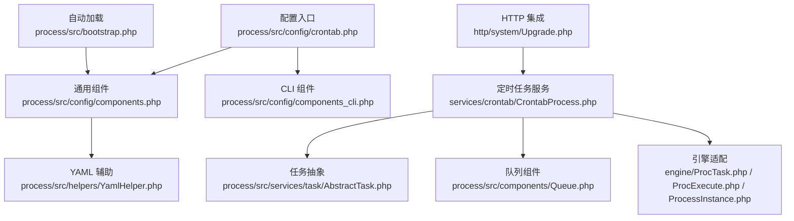
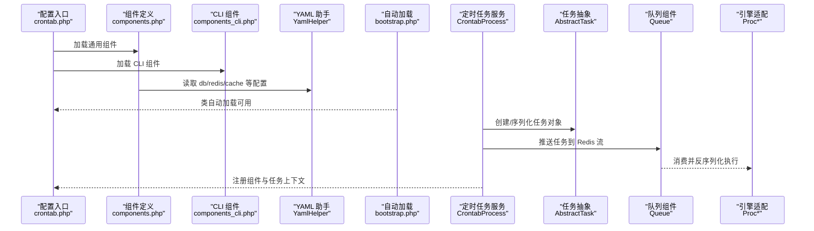
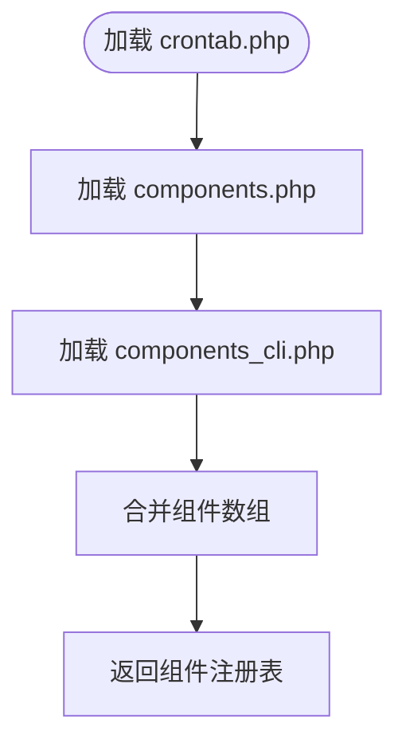
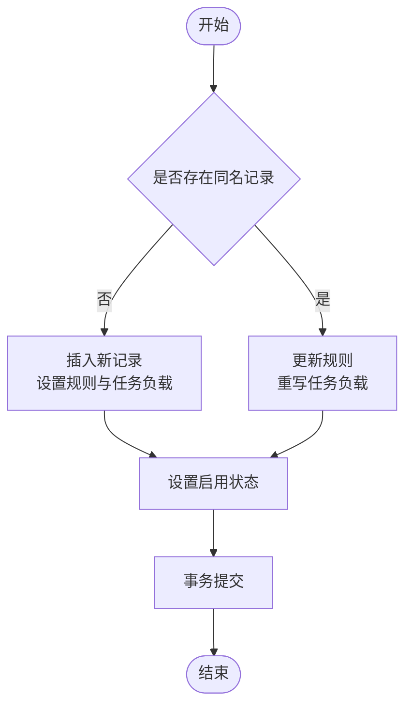
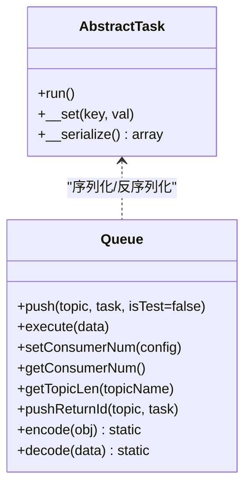
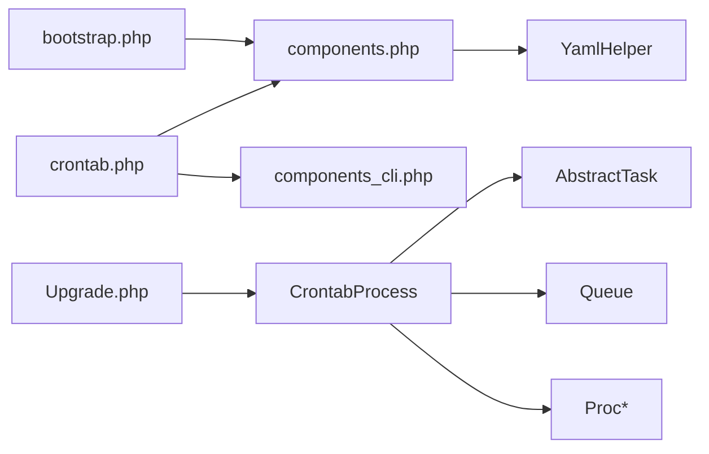

# 定时任务配置

<cite>
**本文引用的文件**
- [process\src\config\crontab.php](file://process\src\config\crontab.php)
- [process\src\config\components.php](file://process\src\config\components.php)
- [process\src\config\components_cli.php](file://process\src\config\components_cli.php)
- [process\src\services\crontab\CrontabProcess.php](file://process\src\services\crontab\CrontabProcess.php)
- [process\src\services\task\AbstractTask.php](file://process\src\services\task\AbstractTask.php)
- [process\src\components\Queue.php](file://process\src\components\Queue.php)
- [process\src\helpers\YamlHelper.php](file://process\src\helpers\YamlHelper.php)
- [process\src\bootstrap.php](file://process\src\bootstrap.php)
- [process\src\engine\ProcTask.php](file://process\src\engine\ProcTask.php)
- [process\src\engine\ProcExecute.php](file://process\src\engine\ProcExecute.php)
- [process\src\engine\ProcessInstance.php](file://process\src\engine\ProcessInstance.php)
- [process\src\http\system\Upgrade.php](file://process\src\http\system\Upgrade.php)
- [process_envs\uestc\product\crontab\Demo.php](file://process_envs\uestc\product\crontab\Demo.php)
- [process_envs\uestc\product\crontab\SendMessage1.php](file://process_envs\uestc\product\crontab\SendMessage1.php)
- [process_envs\uestc\product\crontab\SendMessage2.php](file://process_envs\uestc\product\crontab\SendMessage2.php)
- [process_envs\uestc\product\crontab\SendMessage3.php](file://process_envs\uestc\product\crontab\SendMessage3.php)
- [process_envs\uestc\product\crontab\SendMessage4.php](file://process_envs\uestc\product\crontab\SendMessage4.php)
- [process_envs\uestc\product\crontab\SendMessage5.php](file://process_envs\uestc\product\crontab\SendMessage5.php)
</cite>

## 目录
1. [引言](#引言)
2. [项目结构](#项目结构)
3. [核心组件](#核心组件)
4. [架构总览](#架构总览)
5. [详细组件分析](#详细组件分析)
6. [依赖关系分析](#依赖关系分析)
7. [性能考虑](#性能考虑)
8. [故障排查指南](#故障排查指南)
9. [结论](#结论)
10. [附录](#附录)

## 引言
本文件面向 htdNew 项目的“定时任务配置系统”，围绕以下目标展开：  
- 解释 crontab.php 配置文件的结构与加载流程、组件合并策略与 CLI 组件集成方式；  
- 说明 Crontab 数据模型（通过业务服务层体现）的任务字段、状态管理与生命周期控制；  
- 提供配置模板示例、参数校验规则与错误处理机制；  
- 给出配置开发指南与最佳实践。

## 项目结构
与定时任务配置相关的关键目录与文件如下：
- 配置层：process/src/config/crontab.php、components.php、components_cli.php
- 任务抽象与队列：services/task/AbstractTask.php、components/Queue.php
- 运行时引擎适配：engine/ProcTask.php、ProcExecute.php、ProcessInstance.php
- 配置加载辅助：helpers/YamlHelper.php、bootstrap.php
- 业务集成点：services/crontab/CrontabProcess.php、http/system/Upgrade.php
- 环境示例任务：process_envs/*/product/crontab/*.php

图表来源
- [process\src\config\crontab.php](file://process\src\config\crontab.php#L1-L10)
- [process\src\config\components.php](file://process\src\config\components.php#L1-L34)
- [process\src\config\components_cli.php](file://process\src\config\components_cli.php#L1-L3)
- [process\src\helpers\YamlHelper.php](file://process\src\helpers\YamlHelper.php#L1-L8)
- [process\src\bootstrap.php](file://process\src\bootstrap.php#L1-L40)
- [process\src\services\task\AbstractTask.php](file://process\src\services\task\AbstractTask.php#L1-L30)
- [process\src\components\Queue.php](file://process\src\components\Queue.php#L1-L173)
- [process\src\engine\ProcTask.php](file://process\src\engine\ProcTask.php#L1-L11)
- [process\src\engine\ProcExecute.php](file://process\src\engine\ProcExecute.php#L1-L11)
- [process\src\engine\ProcessInstance.php](file://process\src\engine\ProcessInstance.php#L1-L11)
- [process\src\services\crontab\CrontabProcess.php](file://process\src\services\crontab\CrontabProcess.php#L1-L200)

章节来源
- [process\src\config\crontab.php](file://process\src\config\crontab.php#L1-L10)
- [process\src\config\components.php](file://process\src\config\components.php#L1-L34)
- [process\src\config\components_cli.php](file://process\src\config\components_cli.php#L1-L3)
- [process\src\helpers\YamlHelper.php](file://process\src\helpers\YamlHelper.php#L1-L8)
- [process\src\bootstrap.php](file://process\src\bootstrap.php#L1-L40)

## 核心组件
- crontab.php 配置入口：聚合 components.php 与 components_cli.php 的组件定义，形成统一的组件注册表。
- 组件注册机制：components.php 基于 YAML 配置生成 db、cache、redis、notice、queue 等组件；components_cli.php 当前为空，便于后续扩展 CLI 专用组件。
- 任务抽象与序列化：AbstractTask 定义任务运行接口与可序列化属性集合；Queue 负责将任务推入 Redis 流并解码执行。
- 引擎适配：ProcTask/ProcExecute/ProcessInstance 作为引擎侧适配类，保持序列化兼容性。
- 业务服务：CrontabProcess 负责定时任务的调度与生命周期管理；HTTP 接口 Upgrade.php 将外部请求转换为 CrontabModel 记录。

章节来源
- [process\src\config\crontab.php](file://process\src\config\crontab.php#L1-L10)
- [process\src\config\components.php](file://process\src\config\components.php#L1-L34)
- [process\src\config\components_cli.php](file://process\src\config\components_cli.php#L1-L3)
- [process\src\services\task\AbstractTask.php](file://process\src\services\task\AbstractTask.php#L1-L30)
- [process\src\components\Queue.php](file://process\src\components\Queue.php#L1-L173)
- [process\src\engine\ProcTask.php](file://process\src\engine\ProcTask.php#L1-L11)
- [process\src\engine\ProcExecute.php](file://process\src\engine\ProcExecute.php#L1-L11)
- [process\src\engine\ProcessInstance.php](file://process\src\engine\ProcessInstance.php#L1-L11)
- [process\src\services\crontab\CrontabProcess.php](file://process\src\services\crontab\CrontabProcess.php#L1-L200)
- [process\src\http\system\Upgrade.php](file://process\src\http\system\Upgrade.php#L716-L753)

## 架构总览
定时任务从“配置加载”到“任务执行”的整体流程如下：

图表来源
- [process\src\config\crontab.php](file://process\src\config\crontab.php#L1-L10)
- [process\src\config\components.php](file://process\src\config\components.php#L1-L34)
- [process\src\config\components_cli.php](file://process\src\config\components_cli.php#L1-L3)
- [process\src\helpers\YamlHelper.php](file://process\src\helpers\YamlHelper.php#L1-L8)
- [process\src\bootstrap.php](file://process\src\bootstrap.php#L1-L40)
- [process\src\services\crontab\CrontabProcess.php](file://process\src\services\crontab\CrontabProcess.php#L1-L200)
- [process\src\services\task\AbstractTask.php](file://process\src\services\task\AbstractTask.php#L1-L30)
- [process\src\components\Queue.php](file://process\src\components\Queue.php#L1-L173)
- [process\src\engine\ProcTask.php](file://process\src\engine\ProcTask.php#L1-L11)
- [process\src\engine\ProcExecute.php](file://process\src\engine\ProcExecute.php#L1-L11)
- [process\src\engine\ProcessInstance.php](file://process\src\engine\ProcessInstance.php#L1-L11)

## 详细组件分析

### 配置文件 crontab.php 结构与加载流程
- 结构要点
  - 通过 include 分别加载 components.php 与 components_cli.php，并将两者合并为统一的组件数组返回。
  - components.php 由 YAML 配置驱动，生成 db、cache、redis、notice、queue 等组件定义；若存在环境覆盖文件则进行合并。
  - components_cli.php 当前为空，预留 CLI 专属组件扩展位。
- 加载流程
  - 配置入口在应用启动时被加载，随后由框架或服务层使用该组件注册表初始化运行时组件。
  - 自动加载 bootstrap.php 在运行期负责类路径解析，确保组件与任务类可被正确加载。
- 组件合并策略
  - components.php 与 components_cli.php 的键空间应避免冲突；当前实现采用数组展开合并，需保证键唯一性。
  - 若存在同名键，后者会覆盖前者，应在业务上明确区分“通用组件”与“CLI 组件”。

图表来源
- [process\src\config\crontab.php](file://process\src\config\crontab.php#L1-L10)
- [process\src\config\components.php](file://process\src\config\components.php#L1-L34)
- [process\src\config\components_cli.php](file://process\src\config\components_cli.php#L1-L3)
- [process\src\bootstrap.php](file://process\src\bootstrap.php#L1-L40)

章节来源
- [process\src\config\crontab.php](file://process\src\config\crontab.php#L1-L10)
- [process\src\config\components.php](file://process\src\config\components.php#L1-L34)
- [process\src\config\components_cli.php](file://process\src\config\components_cli.php#L1-L3)
- [process\src\bootstrap.php](file://process\src\bootstrap.php#L1-L40)

### 组件注册机制与 CLI 集成
- 通用组件注册：components.php 通过 YamlHelper 读取 YAML 中的 db/redis 等配置项，构造组件数组；同时支持环境覆盖文件合并。
- CLI 组件注册：components_cli.php 当前为空，可在其中声明 CLI 专用组件，如命令行任务处理器、日志组件等。
- 自动加载：bootstrap.php 的 spl_autoload_register 会根据命名空间与目录映射自动加载类文件，确保组件与任务类在运行时可用。

章节来源
- [process\src\config\components.php](file://process\src\config\components.php#L1-L34)
- [process\src\config\components_cli.php](file://process\src\config\components_cli.php#L1-L3)
- [process\src\helpers\YamlHelper.php](file://process\src\helpers\YamlHelper.php#L1-L8)
- [process\src\bootstrap.php](file://process\src\bootstrap.php#L1-L40)

### Crontab 数据模型与生命周期（通过服务层体现）
虽然仓库中未直接暴露 CrontabModel 类定义，但业务服务层对 Crontab 的使用体现了其数据模型与生命周期：
- 字段与语义
  - 名称、类型、规则、启用状态、任务负载（序列化后的任务对象）。
  - 规则字段包含“crontabs”数组，表示多个 cron 表达式。
- 生命周期
  - 创建：当不存在同名记录时插入新记录；若已存在则更新规则与任务负载。
  - 启用/禁用：通过 enable 字段切换任务状态。
  - 更新：在规则变更或任务内容变更时，重新序列化并保存。
- 事务与一致性
  - 业务层在更新/创建时使用事务，确保 CrontabModel 与关联模型的一致性。

图表来源
- [process\src\http\system\Upgrade.php](file://process\src\http\system\Upgrade.php#L716-L753)

章节来源
- [process\src\http\system\Upgrade.php](file://process\src\http\system\Upgrade.php#L716-L753)

### 任务定义语法与执行周期参数
- 任务定义
  - 任务必须继承 AbstractTask 并实现 run() 方法；任务对象可被序列化后存入数据库或队列。
- 执行周期参数
  - 规则字段中的“crontabs”为数组，元素为标准 cron 表达式；支持多表达式并行触发。
  - HTTP 接口在接收字符串形式的 crontabs 时，会将其按换行或逗号拆分为数组后再入库。
- 任务序列化与反序列化
  - Queue.push 使用 serialize 存储任务对象；消费端通过 unserialize 还原并调用 run()。
  - AbstractTask 提供 __serialize 以限定可序列化属性范围。

图表来源
- [process\src\services\task\AbstractTask.php](file://process\src\services\task\AbstractTask.php#L1-L30)
- [process\src\components\Queue.php](file://process\src\components\Queue.php#L1-L173)

章节来源
- [process\src\services\task\AbstractTask.php](file://process\src\services\task\AbstractTask.php#L1-L30)
- [process\src\components\Queue.php](file://process\src\components\Queue.php#L1-L173)
- [process\src\http\system\Upgrade.php](file://process\src\http\system\Upgrade.php#L716-L719)

### 配置模板示例与参数校验
- 配置模板要点
  - components.php 中的 db/redis/cache/notice/queue 等组件键需与实际实现匹配。
  - components_cli.php 用于声明 CLI 专属组件，当前为空。
- 参数校验规则
  - 规则字段中的“crontabs”应为合法 cron 表达式数组；HTTP 层会对字符串输入进行拆分与规范化。
  - 任务对象必须可序列化且构造函数参数需具备默认值，否则入队失败。
- 错误处理机制
  - 队列编码阶段若发现构造函数缺少必要参数，会抛出异常提示。
  - HTTP 层在事务中保存 CrontabModel，失败时回滚保证一致性。

章节来源
- [process\src\config\components.php](file://process\src\config\components.php#L1-L34)
- [process\src\config\components_cli.php](file://process\src\config\components_cli.php#L1-L3)
- [process\src\http\system\Upgrade.php](file://process\src\http\system\Upgrade.php#L716-L719)
- [process\src\components\Queue.php](file://process\src\components\Queue.php#L80-L100)

### 环境示例任务与 CLI 集成
- 环境示例任务位于 process_envs/*/product/crontab/*.php，展示如何编写独立的定时任务类并在环境中运行。
- CLI 集成：crontab.php 已将 components_cli.php 合并进组件注册表，未来可在其中注册 CLI 专用组件，配合命令行工具执行任务。

章节来源
- [process\src\config\crontab.php](file://process\src\config\crontab.php#L1-L10)
- [process_envs\uestc\product\crontab\Demo.php](file://process_envs\uestc\product\crontab\Demo.php#L1-L27)
- [process_envs\uestc\product\crontab\SendMessage1.php](file://process_envs\uestc\product\crontab\SendMessage1.php#L1-L200)
- [process_envs\uestc\product\crontab\SendMessage2.php](file://process_envs\uestc\product\crontab\SendMessage2.php#L1-L200)
- [process_envs\uestc\product\crontab\SendMessage3.php](file://process_envs\uestc\product\crontab\SendMessage3.php#L1-L200)
- [process_envs\uestc\product\crontab\SendMessage4.php](file://process_envs\uestc\product\crontab\SendMessage4.php#L1-L200)
- [process_envs\uestc\product\crontab\SendMessage5.php](file://process_envs\uestc\product\crontab\SendMessage5.php#L1-L200)

## 依赖关系分析
- 配置层依赖
  - crontab.php 依赖 components.php 与 components_cli.php；components.php 依赖 YamlHelper 读取 YAML。
  - bootstrap.php 提供类自动加载，确保组件与任务类在运行时可用。
- 任务层依赖
  - AbstractTask 为所有任务的基础；Queue 依赖 Redis 流进行任务投递与消费。
- 引擎层依赖
  - ProcTask/ProcExecute/ProcessInstance 作为引擎适配类，保持序列化兼容性。
- 业务层依赖
  - CrontabProcess 依赖任务抽象与队列组件；HTTP Upgrade.php 将外部请求转换为 CrontabModel 记录。

图表来源
- [process\src\config\crontab.php](file://process\src\config\crontab.php#L1-L10)
- [process\src\config\components.php](file://process\src\config\components.php#L1-L34)
- [process\src\config\components_cli.php](file://process\src\config\components_cli.php#L1-L3)
- [process\src\helpers\YamlHelper.php](file://process\src\helpers\YamlHelper.php#L1-L8)
- [process\src\bootstrap.php](file://process\src\bootstrap.php#L1-L40)
- [process\src\services\crontab\CrontabProcess.php](file://process\src\services\crontab\CrontabProcess.php#L1-L200)
- [process\src\services\task\AbstractTask.php](file://process\src\services\task\AbstractTask.php#L1-L30)
- [process\src\components\Queue.php](file://process\src\components\Queue.php#L1-L173)
- [process\src\engine\ProcTask.php](file://process\src\engine\ProcTask.php#L1-L11)
- [process\src\engine\ProcExecute.php](file://process\src\engine\ProcExecute.php#L1-L11)
- [process\src\engine\ProcessInstance.php](file://process\src\engine\ProcessInstance.php#L1-L11)
- [process\src\http\system\Upgrade.php](file://process\src\http\system\Upgrade.php#L716-L753)

章节来源
- [process\src\config\crontab.php](file://process\src\config\crontab.php#L1-L10)
- [process\src\config\components.php](file://process\src\config\components.php#L1-L34)
- [process\src\config\components_cli.php](file://process\src\config\components_cli.php#L1-L3)
- [process\src\bootstrap.php](file://process\src\bootstrap.php#L1-L40)
- [process\src\services\crontab\CrontabProcess.php](file://process\src\services\crontab\CrontabProcess.php#L1-L200)
- [process\src\services\task\AbstractTask.php](file://process\src\services\task\AbstractTask.php#L1-L30)
- [process\src\components\Queue.php](file://process\src\components\Queue.php#L1-L173)
- [process\src\engine\ProcTask.php](file://process\src\engine\ProcTask.php#L1-L11)
- [process\src\engine\ProcExecute.php](file://process\src\engine\ProcExecute.php#L1-L11)
- [process\src\engine\ProcessInstance.php](file://process\src\engine\ProcessInstance.php#L1-L11)
- [process\src\http\system\Upgrade.php](file://process\src\http\system\Upgrade.php#L716-L753)

## 性能考虑
- 任务序列化
  - 使用 serialize/unserialize 简化任务对象传输，但需确保任务对象不含不可序列化资源；必要时在任务内部释放资源。
- 队列消费
  - 通过 Redis 流实现异步消费，建议合理设置消费者数量与主题分区，避免积压。
- 组件初始化
  - components.php 通过 YamlHelper 读取配置，建议缓存常用配置以减少 IO 开销。
- 自动加载
  - bootstrap.php 的自动加载策略需避免过多目录扫描，确保生产环境类路径清晰。

## 故障排查指南
- 任务无法入队
  - 检查任务对象构造函数是否缺少必要参数；队列编码阶段会抛出异常提示。
- cron 表达式无效
  - 确认“crontabs”数组元素均为合法 cron 表达式；HTTP 层会将字符串按换行或逗号拆分。
- 组件未生效
  - 确认 crontab.php 是否正确合并 components.php 与 components_cli.php；检查键冲突与覆盖情况。
- 事务失败
  - HTTP Upgrade.php 在更新/创建 CrontabModel 时使用事务，若失败需检查外键与唯一约束。

章节来源
- [process\src\components\Queue.php](file://process\src\components\Queue.php#L80-L100)
- [process\src\http\system\Upgrade.php](file://process\src\http\system\Upgrade.php#L716-L753)
- [process\src\config\crontab.php](file://process\src\config\crontab.php#L1-L10)
- [process\src\config\components.php](file://process\src\config\components.php#L1-L34)

## 结论
htdNew 的定时任务配置系统通过“配置入口 + 组件注册 + 任务抽象 + 队列执行”的分层设计，实现了灵活、可扩展的任务编排能力。crontab.php 作为入口，聚合通用与 CLI 组件；AbstractTask 与 Queue 提供稳定的任务序列化与执行通道；业务层通过 CrontabProcess 与 HTTP 接口完成任务的创建、更新与生命周期管理。建议在实际开发中遵循参数校验与错误处理规范，确保任务的稳定性与可维护性。

## 附录
- 配置开发指南
  - 在 components.php 中新增组件时，确保键名唯一且与实现类匹配；如需 CLI 专属组件，在 components_cli.php 中补充。
  - 任务类需继承 AbstractTask 并实现 run()；避免在构造函数中使用不可序列化资源。
  - 规则字段使用“crontabs”数组，支持多表达式；HTTP 层会进行字符串拆分与规范化。
- 最佳实践
  - 将任务对象的公共属性设为可序列化，避免私有属性丢失。
  - 对高频任务使用队列异步执行，避免阻塞主流程。
  - 在生产环境启用组件缓存与自动加载优化，减少启动开销。
  - 使用事务更新 CrontabModel，保证数据一致性。