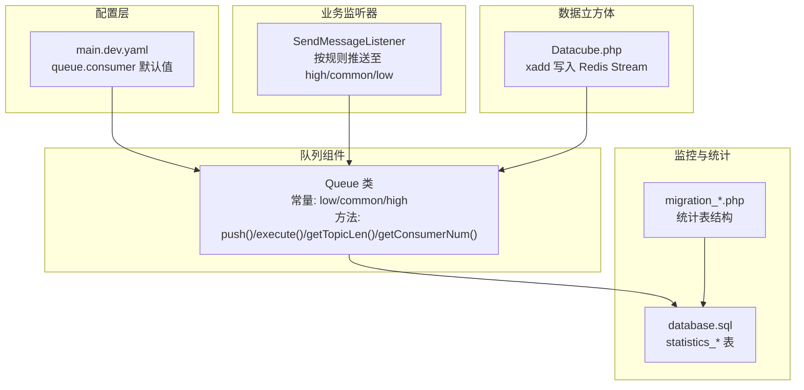
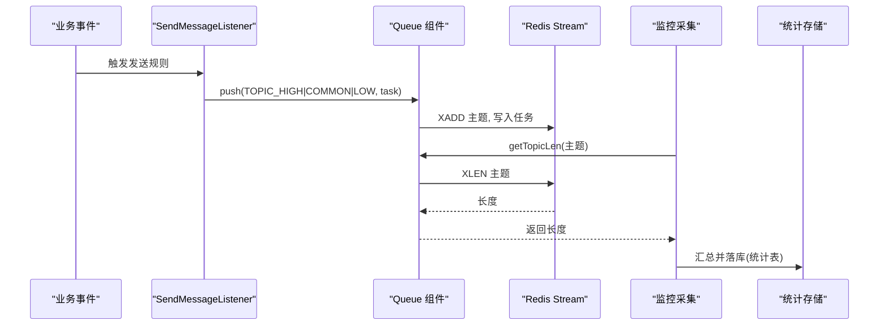
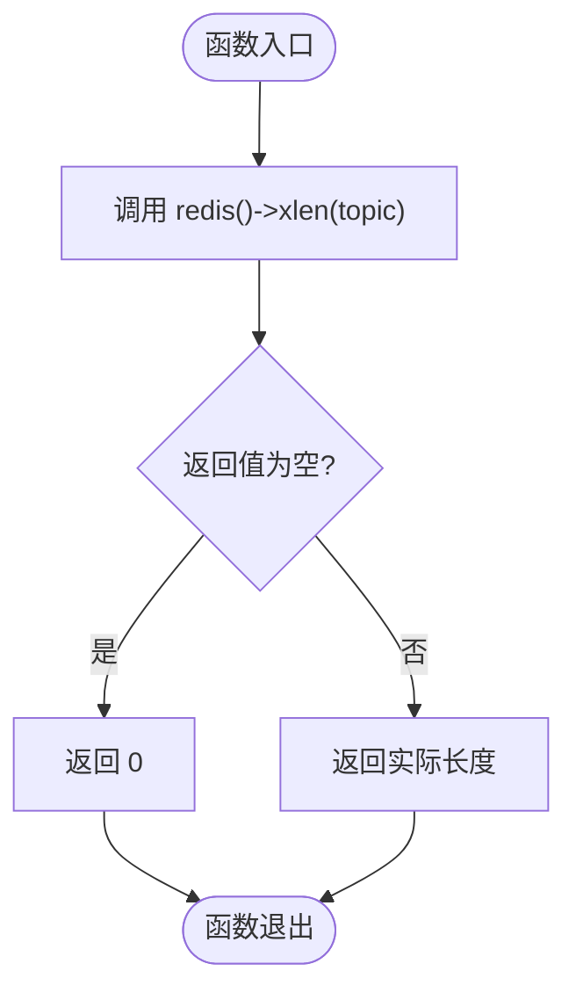
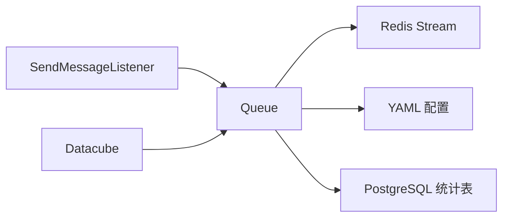

# 主题监控与统计

<cite>
**本文引用的文件**
- [process/src/components/Queue.php](file://process/src/components/Queue.php)
- [process/src/config/main.dev.yaml](file://process/src/config/main.dev.yaml)
- [process/src/services/listeners/SendMessageListener.php](file://process/src/services/listeners/SendMessageListener.php)
- [process/src/services/platform/Datacube.php](file://process/src/services/platform/Datacube.php)
- [process/docs/sql/database.sql](file://process/docs/sql/database.sql)
- [process/src/migrations/migration_20240716_170331_statistics.php](file://process/src/migrations/migration_20240716_170331_statistics.php)
- [process/src/migrations/migration_20251024_22050_sysu.php](file://process/src/migrations/migration_20251024_22050_sysu.php)
</cite>

## 目录
1. [引言](#引言)
2. [项目结构](#项目结构)
3. [核心组件](#核心组件)
4. [架构总览](#架构总览)
5. [详细组件分析](#详细组件分析)
6. [依赖关系分析](#依赖关系分析)
7. [性能考量](#性能考量)
8. [故障排查指南](#故障排查指南)
9. [结论](#结论)
10. [附录](#附录)

## 引言
本文件围绕 htdNew 项目的“队列主题监控与统计”展开，重点解释 getTopicLen 方法的实现原理与 Redis Stream 长度查询机制，覆盖低/普通/高三个主题的队列长度监控、性能指标采集、告警策略、积压检测、延迟监控、吞吐量统计、健康检查、异常处理以及监控数据存储方式。同时提供性能优化建议、容量规划思路与监控仪表板集成方案。

## 项目结构
- 队列核心位于 components 层，负责 Redis Stream 的入队、出队、长度查询与消费者数量管理。
- 配置层通过 YAML 提供默认消费者数量，运行时可通过 Redis 缓存覆盖。
- 业务监听器根据规则将任务推送到不同优先级的主题。
- 数据立方体模块通过 Redis Stream 接收异步数据回写任务。
- 统计数据库与迁移脚本提供历史指标与报表能力。

图表来源
- [process/src/components/Queue.php](file://process/src/components/Queue.php#L1-L173)
- [process/src/config/main.dev.yaml](file://process/src/config/main.dev.yaml#L58-L65)
- [process/src/services/listeners/SendMessageListener.php](file://process/src/services/listeners/SendMessageListener.php#L76-L105)
- [process/src/services/platform/Datacube.php](file://process/src/services/platform/Datacube.php#L141-L156)
- [process/docs/sql/database.sql](file://process/docs/sql/database.sql#L1313-L1345)
- [process/src/migrations/migration_20240716_170331_statistics.php](file://process/src/migrations/migration_20240716_170331_statistics.php#L34-L87)

章节来源
- [process/src/components/Queue.php](file://process/src/components/Queue.php#L1-L173)
- [process/src/config/main.dev.yaml](file://process/src/config/main.dev.yaml#L58-L65)

## 核心组件
- Queue 类
  - 定义三个主题常量：low、common、high。
  - 提供入队 push、反序列化执行 execute、长度查询 getTopicLen、消费者数量 getConsumerNum。
  - getTopicLen 使用 Redis XLEN 获取主题长度，空值返回 0，确保上层调用安全。
  - getConsumerNum 从 YAML 读取默认值，并合并 Redis 中的覆盖配置，支持动态调整。
- 配置层
  - main.dev.yaml 中定义 queue.consumer 的默认消费者数量，用于各主题并发拉取控制。
- 业务监听器
  - SendMessageListener 在事务成功后将任务推送到 high 主题，或根据规则调度到 common/low。
- 数据立方体
  - Datacube.php 通过 Redis Stream 接收异步数据回写任务，写入指定主题。

章节来源
- [process/src/components/Queue.php](file://process/src/components/Queue.php#L1-L173)
- [process/src/config/main.dev.yaml](file://process/src/config/main.dev.yaml#L58-L65)
- [process/src/services/listeners/SendMessageListener.php](file://process/src/services/listeners/SendMessageListener.php#L76-L105)
- [process/src/services/platform/Datacube.php](file://process/src/services/platform/Datacube.php#L141-L156)

## 架构总览
下图展示从业务事件到队列主题、长度监控、统计入库的整体流程。

图表来源
- [process/src/services/listeners/SendMessageListener.php](file://process/src/services/listeners/SendMessageListener.php#L76-L105)
- [process/src/components/Queue.php](file://process/src/components/Queue.php#L26-L30)
- [process/src/components/Queue.php](file://process/src/components/Queue.php#L62-L67)
- [process/docs/sql/database.sql](file://process/docs/sql/database.sql#L1313-L1345)

## 详细组件分析

### getTopicLen 实现原理与空值处理
- 调用链
  - 上层通过 Queue::getTopicLen(topic) 查询 Redis Stream 长度。
  - 内部调用 redis()->xlen(topic) 获取条目数量。
  - 若返回为空（如主题不存在），统一转为 0，避免上层分支判断复杂化。
- 复杂度
  - XLEN 时间复杂度为 O(1)，适合高频监控采样。
- 空值处理
  - 使用 empty 判断并返回 0，保证监控侧不会因异常值中断。

图表来源
- [process/src/components/Queue.php](file://process/src/components/Queue.php#L62-L67)

章节来源
- [process/src/components/Queue.php](file://process/src/components/Queue.php#L62-L67)

### 不同主题（low/common/high）的队列长度监控
- 主题划分
  - high：紧急/即时任务，消费者数量默认 3。
  - common：常规任务，消费者数量默认 3。
  - low：低优先级任务，消费者数量默认 3。
- 监控策略
  - 周期性采集各主题 XLEN，记录时间序列。
  - 对 high 设置更敏感的阈值，触发快速告警；对 low 设置宽松阈值，关注长期积压趋势。
  - 结合 getConsumerNum 的动态配置，观察消费者数量变化对积压的影响。

章节来源
- [process/src/config/main.dev.yaml](file://process/src/config/main.dev.yaml#L58-L65)
- [process/src/components/Queue.php](file://process/src/components/Queue.php#L50-L60)

### 性能指标收集与告警机制
- 指标
  - 队列长度（XLEN）、消费者数量、入队速率、出队速率、处理时延。
- 采集
  - 使用定时任务或后台进程周期性调用 getTopicLen 与 getConsumerNum。
  - 计算速率：(当前长度 - 历史长度) / 采样间隔。
- 告警
  - high 队列长度持续超过阈值且增长速率大于 0，触发紧急告警。
  - common 队列长度超过阈值且滞留时间超过目标 SLA，触发预警。
  - low 队列长度长期高位，触发容量规划提醒。

[本节为概念性说明，不直接分析具体文件，故无章节来源]

### 队列积压检测、延迟监控与吞吐量统计
- 积压检测
  - 通过 XLEN 与速率计算识别积压趋势；结合消费者数量评估是否需要扩容。
- 延迟监控
  - 在入队时打时间戳，在出队/完成时计算耗时，形成 P50/P95 延迟曲线。
- 吞吐量统计
  - 统计单位时间内完成的任务数，结合消费者数量计算每消费者吞吐，评估资源利用率。

[本节为概念性说明，不直接分析具体文件，故无章节来源]

### 队列健康检查、异常处理与监控数据存储
- 健康检查
  - 定期探测 Redis 连接可用性与 XLEN 可用性。
  - 检测消费者进程存活与拉取速率。
- 异常处理
  - getTopicLen 对空值统一返回 0，避免上层崩溃。
  - 对 Redis 异常进行重试与熔断，必要时降级为固定速率估算。
- 监控数据存储
  - 将指标写入 statistics_* 表或独立时序库，保留历史以便趋势分析。

章节来源
- [process/src/components/Queue.php](file://process/src/components/Queue.php#L62-L67)
- [process/docs/sql/database.sql](file://process/docs/sql/database.sql#L1313-L1345)
- [process/src/migrations/migration_20240716_170331_statistics.php](file://process/src/migrations/migration_20240716_170331_statistics.php#L34-L87)

### Redis Stream 长度查询与空值处理机制
- XLEN 行为
  - 若主题不存在，XLEN 返回空；Queue::getTopicLen 统一转换为 0。
- 适用场景
  - 适用于新主题或长时间无任务的主题，避免误判为异常。

章节来源
- [process/src/components/Queue.php](file://process/src/components/Queue.php#L62-L67)

### 主题路由与入队路径
- 业务监听器根据规则将任务推送到 high/common/low。
- Datacube 模块也通过 Redis Stream 接收异步任务，便于统一监控。

章节来源
- [process/src/services/listeners/SendMessageListener.php](file://process/src/services/listeners/SendMessageListener.php#L76-L105)
- [process/src/services/platform/Datacube.php](file://process/src/services/platform/Datacube.php#L141-L156)

## 依赖关系分析
- 组件耦合
  - Queue 依赖 Redis 扩展与 YAML 配置。
  - 业务监听器依赖 Queue 推送任务。
  - 统计模块依赖数据库表结构与迁移脚本。
- 外部依赖
  - Redis：Stream 命令集（XADD/XLEN）。
  - PostgreSQL：统计表结构与索引。

图表来源
- [process/src/services/listeners/SendMessageListener.php](file://process/src/services/listeners/SendMessageListener.php#L76-L105)
- [process/src/services/platform/Datacube.php](file://process/src/services/platform/Datacube.php#L141-L156)
- [process/src/components/Queue.php](file://process/src/components/Queue.php#L1-L173)
- [process/src/config/main.dev.yaml](file://process/src/config/main.dev.yaml#L58-L65)
- [process/docs/sql/database.sql](file://process/docs/sql/database.sql#L1313-L1345)

章节来源
- [process/src/components/Queue.php](file://process/src/components/Queue.php#L1-L173)
- [process/src/config/main.dev.yaml](file://process/src/config/main.dev.yaml#L58-L65)
- [process/src/services/listeners/SendMessageListener.php](file://process/src/services/listeners/SendMessageListener.php#L76-L105)
- [process/src/services/platform/Datacube.php](file://process/src/services/platform/Datacube.php#L141-L156)
- [process/docs/sql/database.sql](file://process/docs/sql/database.sql#L1313-L1345)

## 性能考量
- Redis 命令
  - XLEN 为 O(1)，适合高频采样；建议采样间隔不低于秒级，避免过度压力。
- 主题隔离
  - high/common/low 三通道隔离，避免相互影响；可根据业务波动动态调整消费者数量。
- 序列化开销
  - 入队使用 serialize/unserialize，注意对象构造参数与可序列化属性，避免复杂初始化带来的延迟。
- 监控开销
  - 仅在监控侧定期采样，避免在热路径频繁查询 XLEN。

[本节为通用指导，不直接分析具体文件，故无章节来源]

## 故障排查指南
- 现象：getTopicLen 返回 0
  - 可能原因：主题不存在或 Redis 连接异常。
  - 排查步骤：确认主题名称正确、Redis 可用、XLEN 可用。
- 现象：积压持续上升
  - 可能原因：消费者数量不足、处理耗时增加、上游入队速率过高。
  - 排查步骤：查看消费者数量、处理时延、速率对比；必要时扩容消费者或优化任务处理逻辑。
- 现象：告警频繁抖动
  - 可能原因：采样间隔过短、阈值设置不合理。
  - 排查步骤：延长采样间隔、引入滑动窗口与去抖策略、调整阈值。

章节来源
- [process/src/components/Queue.php](file://process/src/components/Queue.php#L62-L67)
- [process/src/config/main.dev.yaml](file://process/src/config/main.dev.yaml#L58-L65)

## 结论
通过 Queue::getTopicLen 与 Redis Stream 的组合，可以高效地实现多主题队列长度监控。配合动态消费者数量、完善的统计与告警体系，能够有效支撑高并发下的稳定性与可观测性。建议在生产环境持续优化采样策略、阈值与告警联动，并完善容量规划与仪表板集成。

[本节为总结性内容，不直接分析具体文件，故无章节来源]

## 附录

### 监控仪表板集成方案
- 指标面板
  - 主题长度折线图（high/common/low）。
  - 消费者数量与处理速率对比。
  - 延迟分布（P50/P95）与时序。
- 告警规则
  - high 队列长度超阈且增长速率>0，立即告警。
  - common 队列长度超阈且滞留时间>SLA，预警。
  - low 队列长度长期高位，容量提醒。
- 存储与查询
  - 使用 statistics_* 表或时序库保存指标，提供日/周/月趋势分析。

章节来源
- [process/docs/sql/database.sql](file://process/docs/sql/database.sql#L1313-L1345)
- [process/src/migrations/migration_20240716_170331_statistics.php](file://process/src/migrations/migration_20240716_170331_statistics.php#L34-L87)
- [process/src/migrations/migration_20251024_22050_sysu.php](file://process/src/migrations/migration_20251024_22050_sysu.php#L34-L57)