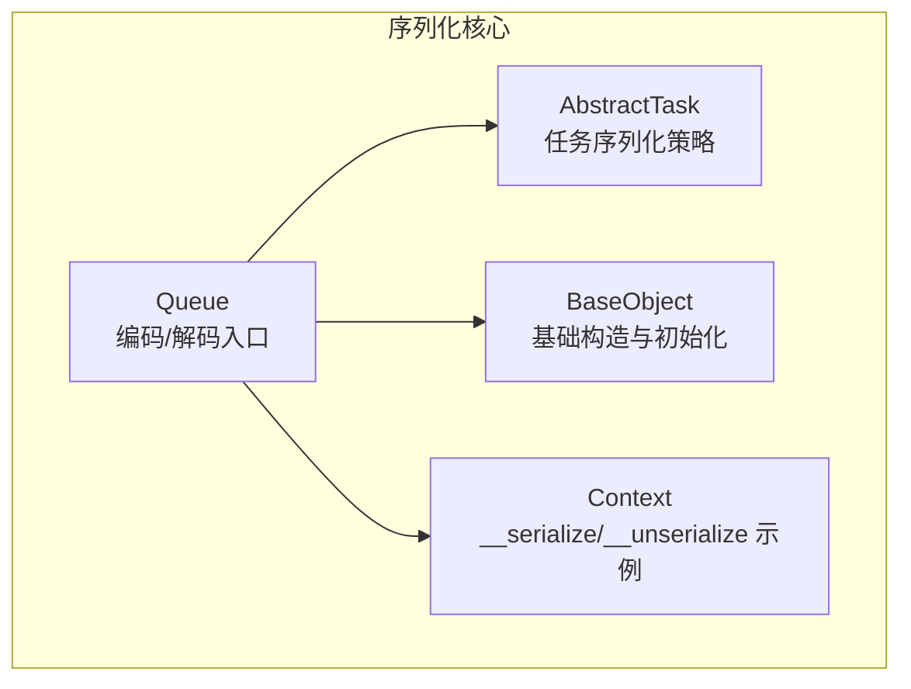
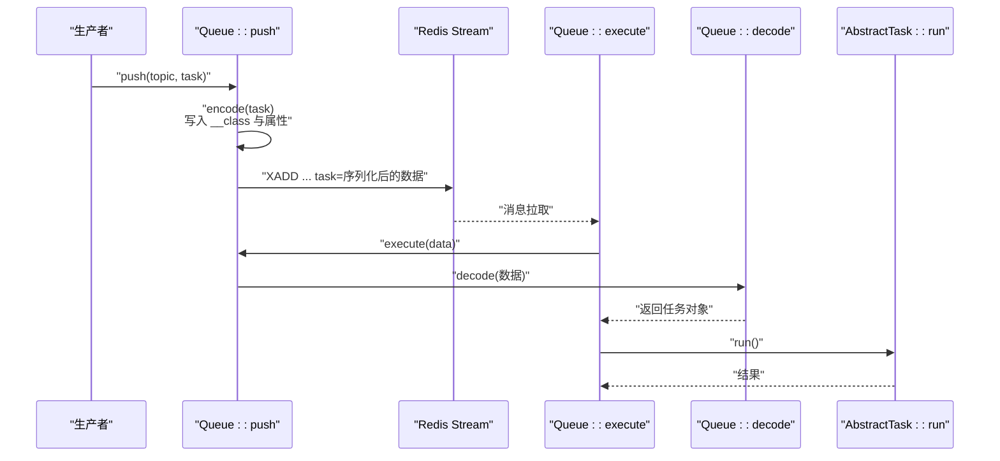
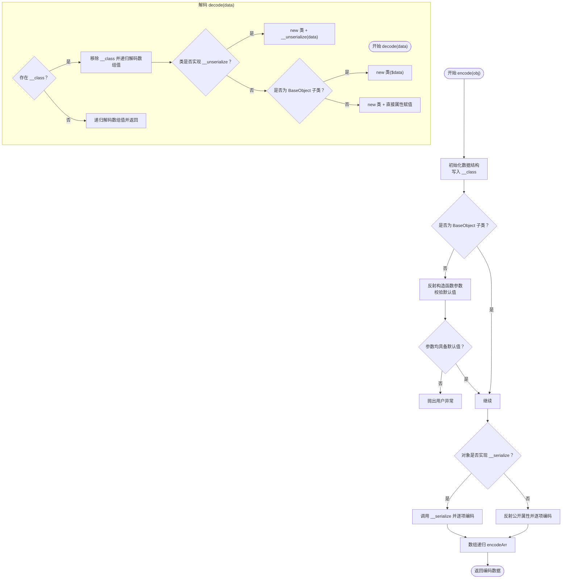
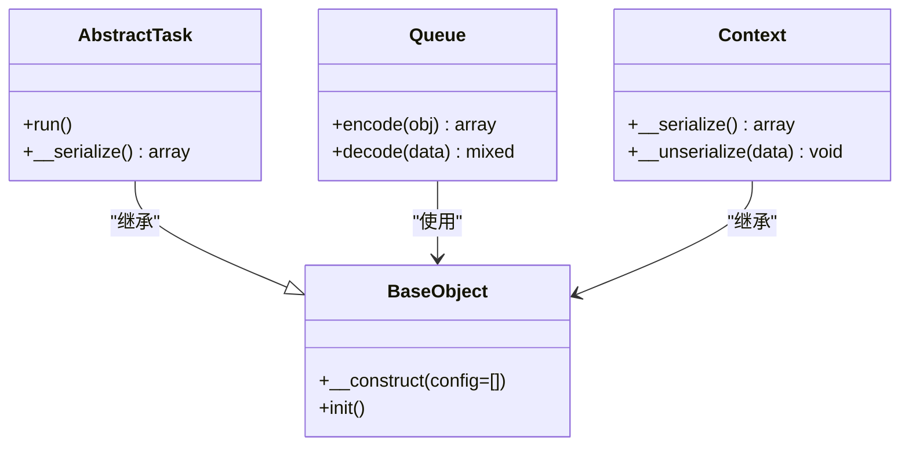
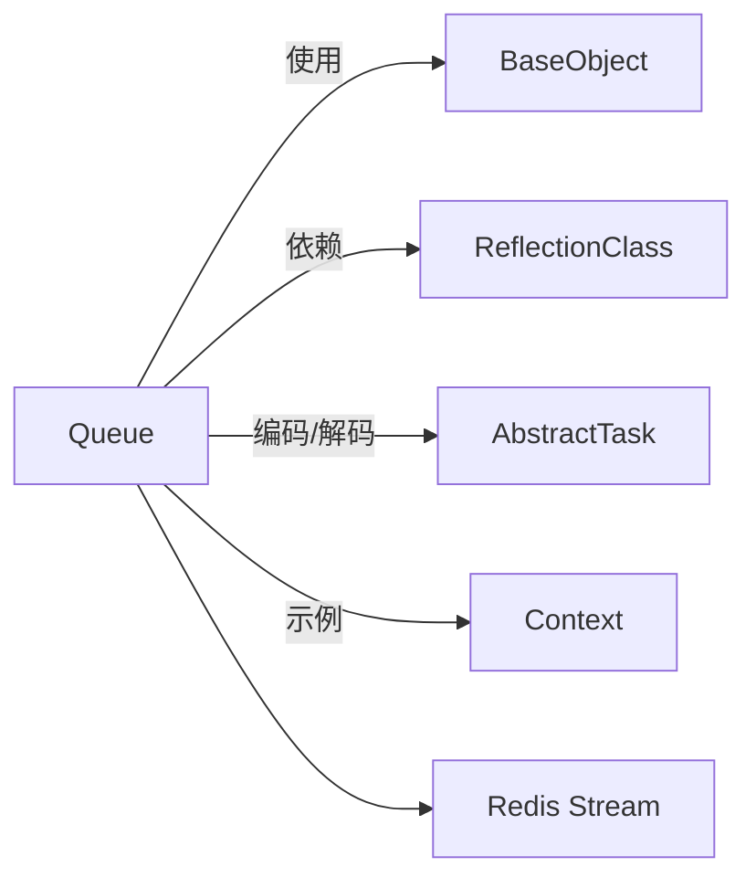

# 任务序列化机制

<cite>
**本文引用的文件**
- [Queue.php](file://process/src/components/Queue.php)
- [BaseObject.php](file://process/vendor/lifei/zl/src/base/BaseObject.php)
- [AbstractTask.php](file://process/src/services/task/AbstractTask.php)
- [Context.php](file://process/src/services/Context.php)
</cite>

## 目录
1. [引言](#引言)
2. [项目结构](#项目结构)
3. [核心组件](#核心组件)
4. [架构总览](#架构总览)
5. [详细组件分析](#详细组件分析)
6. [依赖关系分析](#依赖关系分析)
7. [性能考虑](#性能考虑)
8. [故障排查指南](#故障排查指南)
9. [结论](#结论)

## 引言
本文件系统性梳理 htdNew 项目中“任务序列化机制”的实现与使用，重点围绕以下目标展开：
- 深入解释 encode 与 decode 方法的实现原理：对象序列化算法、数组递归处理、反射机制的使用。
- 明确 __class 字段的作用、构造函数参数检查与异常处理机制。
- 阐述 __serialize/__unserialize 魔术方法的支持、BaseObject 类型的特殊处理与属性遍历逻辑。
- 解释序列化过程中的数据转换规则、类型判断与嵌套对象处理。
- 提供性能优化建议与常见问题解决方案。

## 项目结构
本次文档聚焦于与任务序列化直接相关的组件与基类，主要涉及：
- 队列组件：负责将任务对象编码为可持久化/传输的数据结构，并在消费端进行解码还原。
- 基类支持：提供统一的构造与初始化流程，便于 decode 还原时按需调用。
- 任务抽象基类：定义任务对象的序列化行为与公共属性遍历策略。
- 上下文对象：演示如何通过魔术方法 __serialize/__unserialize 控制序列化内容。

图表来源
- [Queue.php](file://process/src/components/Queue.php#L84-L165)
- [BaseObject.php](file://process/vendor/lifei/zl/src/base/BaseObject.php#L1-L23)
- [AbstractTask.php](file://process/src/services/task/AbstractTask.php#L1-L30)
- [Context.php](file://process/src/services/Context.php#L67-L77)

章节来源
- [Queue.php](file://process/src/components/Queue.php#L1-L173)
- [BaseObject.php](file://process/vendor/lifei/zl/src/base/BaseObject.php#L1-L23)
- [AbstractTask.php](file://process/src/services/task/AbstractTask.php#L1-L30)
- [Context.php](file://process/src/services/Context.php#L1-L77)

## 核心组件
- Queue 编码/解码器
  - encode：将对象转为带 __class 的数组结构；对数组递归编码；对魔术方法 __serialize 优先处理；否则反射遍历公开属性。
  - decode：根据 __class 动态实例化对象；优先尝试 __unserialize；否则对 BaseObject 子类使用构造注入；否则直接赋值属性。
- BaseObject 基类
  - 统一构造：支持以配置数组形式注入属性；自动调用 init 钩子。
- AbstractTask 任务基类
  - 定义 __serialize 行为：仅序列化公开非静态属性。
- Context 上下文
  - 实现 __serialize/__unserialize，控制序列化字段并执行必要的运行时设置。

章节来源
- [Queue.php](file://process/src/components/Queue.php#L84-L165)
- [BaseObject.php](file://process/vendor/lifei/zl/src/base/BaseObject.php#L1-L23)
- [AbstractTask.php](file://process/src/services/task/AbstractTask.php#L1-L30)
- [Context.php](file://process/src/services/Context.php#L67-L77)

## 架构总览
下图展示从任务入队到出队执行的整体流程，以及序列化/反序列化的关键节点。

图表来源
- [Queue.php](file://process/src/components/Queue.php#L26-L40)
- [Queue.php](file://process/src/components/Queue.php#L84-L165)

章节来源
- [Queue.php](file://process/src/components/Queue.php#L26-L40)
- [Queue.php](file://process/src/components/Queue.php#L84-L165)

## 详细组件分析

### Queue 编码/解码器（encode/decode）
- 编码流程（encode）
  - 写入 __class 字段，标识对象类型。
  - 对非 BaseObject 类型，检查其构造函数参数是否均有默认值，若缺失则抛出用户异常，防止不可恢复的任务状态进入队列。
  - 若对象实现 __serialize，则以该方法返回的数组为基准进行递归编码；否则通过反射获取所有公开属性逐项编码。
  - 数组递归处理：遇到数组则递归 encodeArr；遇到对象则递归 encode。
- 解码流程（decode）
  - 若存在 __class：移除该字段后，先对数组值进行递归解码。
  - 优先尝试 __unserialize；否则对继承自 BaseObject 的类使用构造注入（将剩余数据作为配置传入）；否则直接将键值对赋给新实例的同名属性。
  - 若不存在 __class：对数组值进行递归解码并返回原样数组。

图表来源
- [Queue.php](file://process/src/components/Queue.php#L84-L165)

章节来源
- [Queue.php](file://process/src/components/Queue.php#L84-L165)

### BaseObject 类型的特殊处理
- 构造注入：当 decode 遇到继承自 BaseObject 的类时，会以解码后的数组作为配置传入构造函数，从而完成属性注入与初始化钩子调用。
- 初始化钩子：构造函数内部会依次处理配置项，最终调用 init 钩子，便于派生类在构造完成后进行二次初始化。

图表来源
- [BaseObject.php](file://process/vendor/lifei/zl/src/base/BaseObject.php#L1-L23)
- [AbstractTask.php](file://process/src/services/task/AbstractTask.php#L1-L30)
- [Queue.php](file://process/src/components/Queue.php#L84-L165)
- [Context.php](file://process/src/services/Context.php#L67-L77)

章节来源
- [BaseObject.php](file://process/vendor/lifei/zl/src/base/BaseObject.php#L1-L23)
- [AbstractTask.php](file://process/src/services/task/AbstractTask.php#L1-L30)
- [Queue.php](file://process/src/components/Queue.php#L133-L165)
- [Context.php](file://process/src/services/Context.php#L67-L77)

### __serialize/__unserialize 魔术方法支持
- 对象编码：若对象实现了 __serialize，则优先使用其返回的数组进行编码，确保可控的序列化范围与数据形态。
- 对象解码：若类实现了 __unserialize，则优先使用该方法进行反序列化，允许自定义还原逻辑（如延迟加载、资源绑定等）。
- 任务基类示例：AbstractTask 的 __serialize 仅遍历公开非静态属性，避免将静态状态或不必要成员写入序列化数据。

章节来源
- [AbstractTask.php](file://process/src/services/task/AbstractTask.php#L1-L30)
- [Queue.php](file://process/src/components/Queue.php#L103-L113)
- [Queue.php](file://process/src/components/Queue.php#L145-L148)

### 属性遍历与类型判断
- 反射遍历：未实现 __serialize 的对象，通过反射获取公开属性集合，跳过静态属性，逐项判断类型并进行相应编码。
- 数组递归：encodeArr 对数组元素进行深度优先处理，遇到对象则递归 encode，保持嵌套结构完整。
- 类型判断：区分对象、数组与标量三类，分别采用不同的编码路径，保证序列化数据结构的一致性与可还原性。

章节来源
- [Queue.php](file://process/src/components/Queue.php#L115-L129)
- [Queue.php](file://process/src/components/Queue.php#L69-L79)

### __class 字段与异常处理
- __class 字段：作为对象类型的标识，decode 依据该字段动态实例化对象，是反序列化成功的关键。
- 异常处理：
  - 构造函数参数检查：非 BaseObject 类型的任务在 encode 时会检查构造函数参数是否都有默认值，缺失则抛出用户异常，避免不可恢复的状态进入队列。
  - __unserialize 设置：Context 在 __unserialize 中设置数据库读写策略，体现解码阶段的环境初始化。

章节来源
- [Queue.php](file://process/src/components/Queue.php#L90-L101)
- [Queue.php](file://process/src/components/Queue.php#L145-L148)
- [Context.php](file://process/src/services/Context.php#L72-L76)

## 依赖关系分析
- 组件耦合
  - Queue 依赖 zl/base/BaseObject 与 ReflectionClass，用于构造注入与属性遍历。
  - Queue 依赖 services/task/AbstractTask 以支持任务对象的编码/解码。
  - Queue 依赖上下文对象（如 Context）以演示 __serialize/__unserialize 的使用方式。
- 外部依赖
  - Redis：作为消息通道承载序列化后的任务数据。
  - PHP 扩展：反射能力用于属性扫描；魔术方法用于定制序列化行为。

图表来源
- [Queue.php](file://process/src/components/Queue.php#L1-L173)
- [AbstractTask.php](file://process/src/services/task/AbstractTask.php#L1-L30)
- [Context.php](file://process/src/services/Context.php#L1-L77)

章节来源
- [Queue.php](file://process/src/components/Queue.php#L1-L173)
- [AbstractTask.php](file://process/src/services/task/AbstractTask.php#L1-L30)
- [Context.php](file://process/src/services/Context.php#L1-L77)

## 性能考虑
- 优先使用 __serialize/__unserialize：减少不必要的属性扫描与赋值，降低序列化体积与时间开销。
- 控制嵌套层级：encodeArr 会对数组进行深度遍历，深层嵌套会增加递归成本；建议在业务层限制复杂度或拆分任务。
- 构造函数参数默认值：确保非 BaseObject 类型的任务在 encode 时不会因缺少默认值而失败，避免重复入队与失败重试带来的额外开销。
- Redis 序列化：当前使用 serialize/unserialize 直接序列化任务对象，避免 JSON 编解码的额外成本；但需注意对象间依赖与类加载一致性。
- 批量处理：对于多任务场景，尽量合并序列化批次，减少网络往返与 Redis 调用次数。

## 故障排查指南
- 入队失败：构造函数参数无默认值
  - 现象：encode 阶段抛出用户异常，提示某参数无法进入队列。
  - 排查：确认任务类构造函数参数是否都提供默认值；或在 __serialize 中显式排除不需要的字段。
  - 参考位置：[Queue.php](file://process/src/components/Queue.php#L90-L101)
- 反序列化失败：缺少 __class 或类未加载
  - 现象：decode 无法实例化对象。
  - 排查：确认编码阶段正确写入 __class；确保消费者侧类已加载且命名空间正确。
  - 参考位置：[Queue.php](file://process/src/components/Queue.php#L133-L165)
- __unserialize 未生效
  - 现象：对象还原后状态不一致。
  - 排查：确认类是否实现 __unserialize；或改为 BaseObject 子类使用构造注入。
  - 参考位置：[Queue.php](file://process/src/components/Queue.php#L145-L148)
- 属性未还原
  - 现象：对象属性为空或缺失。
  - 排查：若未实现 __serialize，需确保属性为公开且非静态；或在 __serialize 中显式导出。
  - 参考位置：[AbstractTask.php](file://process/src/services/task/AbstractTask.php#L1-L30)
- Redis 数据异常
  - 现象：消息体无法被 unserialize。
  - 排查：确认 push 使用 serialize；execute 使用 unserialize；避免混用 JSON 与 PHP 序列化。
  - 参考位置：[Queue.php](file://process/src/components/Queue.php#L26-L40)

章节来源
- [Queue.php](file://process/src/components/Queue.php#L26-L40)
- [Queue.php](file://process/src/components/Queue.php#L84-L165)
- [AbstractTask.php](file://process/src/services/task/AbstractTask.php#L1-L30)

## 结论
htdNew 项目的任务序列化机制通过 Queue 组件实现了统一的对象编码/解码流程：以 __class 为入口，结合 __serialize/__unserialize 与反射能力，既保证了灵活性，又兼顾了可维护性与性能。配合 BaseObject 的构造注入与 Context 的示例实现，整体方案能够稳定支撑任务在队列中的持久化与还原。实践中应重点关注构造函数参数默认值、__serialize 的可控性与嵌套结构的复杂度，以获得更优的稳定性与性能表现。