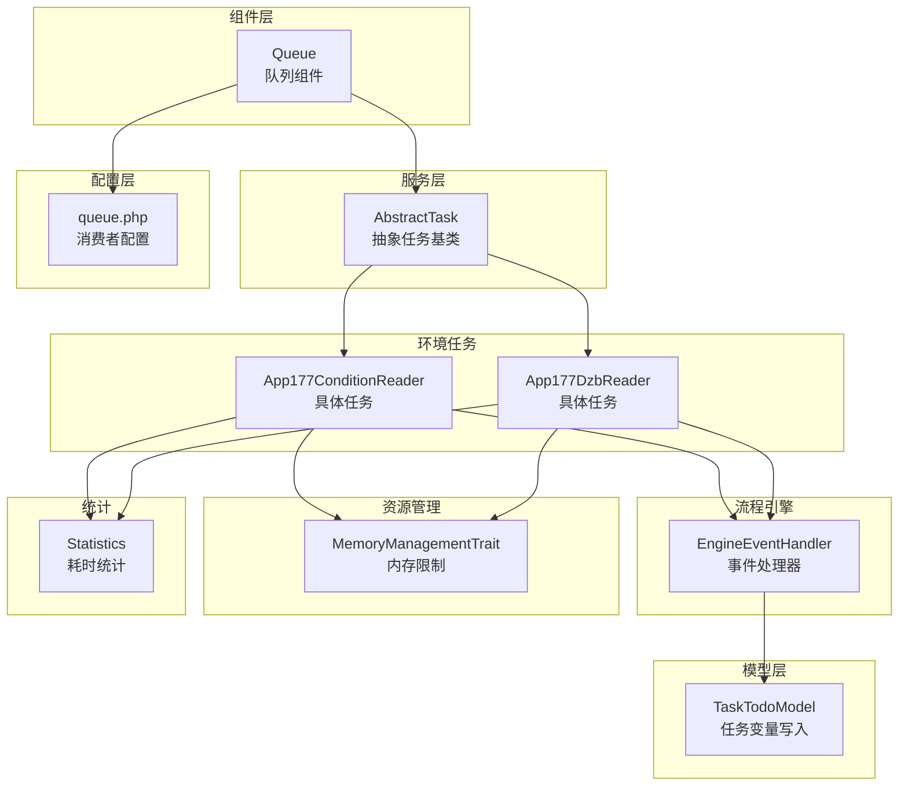
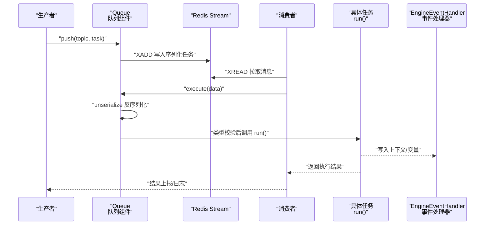
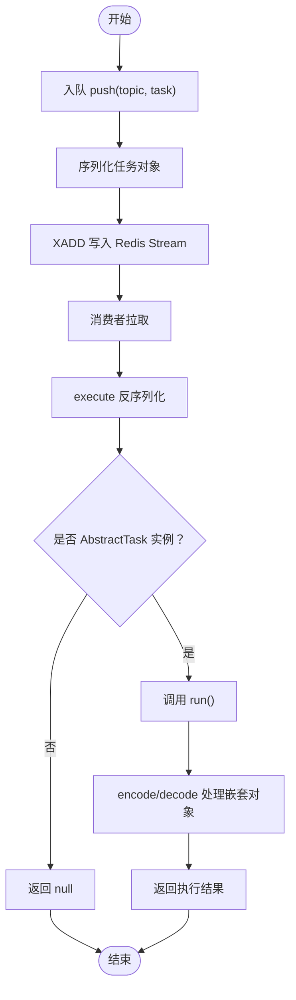
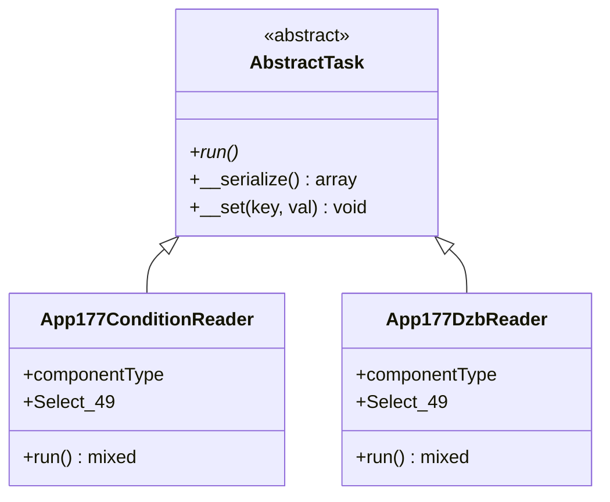
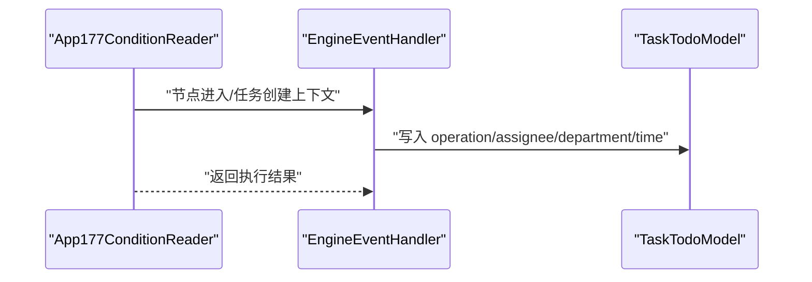
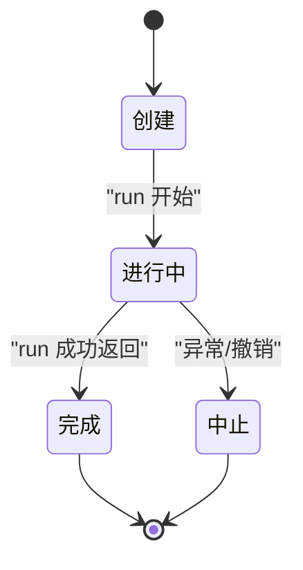
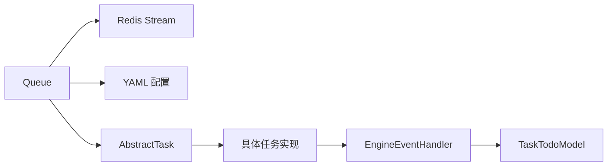

# 任务执行机制

<cite>
**本文引用的文件**
- [Queue.php](file://process/src/components/Queue.php)
- [AbstractTask.php](file://process/src/services/task/AbstractTask.php)
- [App177ConditionReader.php](file://process_envs/besti/product/task/App177ConditionReader.php)
- [App177DzbReader.php](file://process_envs/besti/product/task/App177DzbReader.php)
- [queue.php](file://process/src/config/queue.php)
- [EngineEventHandler.php](file://process/src/modules/process/EngineEventHandler.php)
- [TaskTodoModel.php](file://process/src/models/TaskTodoModel.php)
- [MemoryManagementTrait.php](file://process/src/services/trait/MemoryManagementTrait.php)
- [Statistics.php](file://process/src/services/Statistics.php)
</cite>

## 目录
1. [引言](#引言)
2. [项目结构](#项目结构)
3. [核心组件](#核心组件)
4. [架构总览](#架构总览)
5. [详细组件分析](#详细组件分析)
6. [依赖分析](#依赖分析)
7. [性能考量](#性能考量)
8. [故障排查指南](#故障排查指南)
9. [结论](#结论)
10. [附录](#附录)

## 引言
本文件围绕 htdNew 项目的队列任务执行机制展开，重点解析 Queue::execute 的实现原理与流程，涵盖任务反序列化、类型检查、run 方法调用、AbstractTask 基类要求、执行上下文管理、安全性与异常处理、生命周期与状态管理、结果返回、性能优化、并发控制与资源限制，并提供任务开发指南与最佳实践。

## 项目结构
与队列任务执行直接相关的核心代码分布如下：
- 组件层：队列组件负责任务入队与出队执行
- 服务层：抽象任务基类定义任务接口规范
- 环境任务：具体任务实现继承抽象任务并实现业务逻辑
- 配置层：队列消费者默认配置来源
- 流程引擎事件：与任务生命周期、状态变更联动
- 模型层：任务变量与上下文写入
- 资源管理：内存限制与恢复策略
- 统计：耗时与超时统计

**图表来源**
- [Queue.php](file://process/src/components/Queue.php#L1-L173)
- [AbstractTask.php](file://process/src/services/task/AbstractTask.php#L1-L30)
- [App177ConditionReader.php](file://process_envs/besti/product/task/App177ConditionReader.php#L1-L42)
- [App177DzbReader.php](file://process_envs/besti/product/task/App177DzbReader.php#L1-L43)
- [queue.php](file://process/src/config/queue.php#L1-L13)
- [EngineEventHandler.php](file://process/src/modules/process/EngineEventHandler.php#L275-L302)
- [TaskTodoModel.php](file://process/src/models/TaskTodoModel.php#L114-L149)
- [MemoryManagementTrait.php](file://process/src/services/trait/MemoryManagementTrait.php#L246-L282)
- [Statistics.php](file://process/src/services/Statistics.php#L979-L1006)

**章节来源**
- [Queue.php](file://process/src/components/Queue.php#L1-L173)
- [AbstractTask.php](file://process/src/services/task/AbstractTask.php#L1-L30)
- [App177ConditionReader.php](file://process_envs/besti/product/task/App177ConditionReader.php#L1-L42)
- [App177DzbReader.php](file://process_envs/besti/product/task/App177DzbReader.php#L1-L43)
- [queue.php](file://process/src/config/queue.php#L1-L13)

## 核心组件
- 队列组件（Queue）
  - 提供入队方法，将任务对象序列化后推送到 Redis Stream 主题
  - 提供执行方法，从消息体反序列化任务对象，进行类型校验后调用 run 方法
  - 提供消费者数量配置读取与覆盖能力
  - 提供编码/解码工具，支持复杂对象属性的递归序列化与还原
- 抽象任务基类（AbstractTask）
  - 定义 run 抽象方法作为任务执行入口
  - 自定义序列化钩子，仅导出公共非静态属性
  - 提供 __set 钩子忽略未知属性，降低反序列化风险
- 环境任务（具体实现）
  - 继承抽象任务，声明必要业务字段并在 run 中实现业务逻辑
  - 返回值用于流程推进或结果记录

**章节来源**
- [Queue.php](file://process/src/components/Queue.php#L26-L40)
- [AbstractTask.php](file://process/src/services/task/AbstractTask.php#L8-L30)
- [App177ConditionReader.php](file://process_envs/besti/product/task/App177ConditionReader.php#L12-L42)
- [App177DzbReader.php](file://process_envs/besti/product/task/App177DzbReader.php#L12-L43)

## 架构总览
队列任务执行的整体流程如下：
- 任务入队：业务侧构造具体任务对象，调用队列组件 push，序列化后写入 Redis Stream
- 消费端拉取：消费者从指定主题读取消息
- 执行阶段：队列组件 execute 反序列化消息中的任务对象，校验类型后调用 run
- 结果返回：run 返回值用于流程推进或结果记录
- 生命周期联动：流程引擎事件处理器在节点进入/任务创建等时机写入上下文与变量

**图表来源**
- [Queue.php](file://process/src/components/Queue.php#L26-L40)
- [EngineEventHandler.php](file://process/src/modules/process/EngineEventHandler.php#L275-L302)

## 详细组件分析

### 队列组件（Queue）分析
- 入队（push）
  - 使用 Redis Stream 的 XADD 写入，消息体包含序列化的任务对象
- 执行（execute）
  - 从消息体提取任务字段并反序列化
  - 类型校验确保对象为 AbstractTask 子类
  - 调用 run 并返回结果；否则返回空值
- 编码/解码（encode/decode）
  - encode 支持 __serialize/__unserialize 或反射导出公共属性
  - decode 支持 __unserialize/BaseObject 构造或直接属性赋值
  - 对嵌套对象与数组进行递归处理
- 消费者配置
  - 通过 YAML 默认配置与缓存覆盖合并，动态调整消费者数量

**图表来源**
- [Queue.php](file://process/src/components/Queue.php#L26-L40)
- [Queue.php](file://process/src/components/Queue.php#L81-L166)

**章节来源**
- [Queue.php](file://process/src/components/Queue.php#L26-L40)
- [Queue.php](file://process/src/components/Queue.php#L81-L166)

### 抽象任务基类（AbstractTask）分析
- 接口规范
  - run 抽象方法：所有具体任务必须实现
- 序列化行为
  - __serialize 仅导出公共非静态属性，避免静态状态进入队列
- 安全性
  - __set 钩子忽略未知属性，降低反序列化注入风险
- 与队列组件协作
  - encode/decode 由队列组件负责，确保跨进程/跨语言兼容

**图表来源**
- [AbstractTask.php](file://process/src/services/task/AbstractTask.php#L8-L30)
- [App177ConditionReader.php](file://process_envs/besti/product/task/App177ConditionReader.php#L12-L42)
- [App177DzbReader.php](file://process_envs/besti/product/task/App177DzbReader.php#L12-L43)

**章节来源**
- [AbstractTask.php](file://process/src/services/task/AbstractTask.php#L8-L30)
- [App177ConditionReader.php](file://process_envs/besti/product/task/App177ConditionReader.php#L12-L42)
- [App177DzbReader.php](file://process_envs/besti/product/task/App177DzbReader.php#L12-L43)

### 具体任务实现（App177ConditionReader / App177DzbReader）
- 字段约定
  - componentType：单条或多条列表标记
  - Select_49：输入参数，驱动业务分支
- run 行为
  - 读取输入字段，执行查询与逻辑判断
  - 返回结构化结果，供流程后续节点使用
- 与流程引擎联动
  - 在节点进入/任务创建等时机，事件处理器写入上下文变量

**图表来源**
- [App177ConditionReader.php](file://process_envs/besti/product/task/App177ConditionReader.php#L12-L42)
- [EngineEventHandler.php](file://process/src/modules/process/EngineEventHandler.php#L275-L302)
- [TaskTodoModel.php](file://process/src/models/TaskTodoModel.php#L114-L149)

**章节来源**
- [App177ConditionReader.php](file://process_envs/besti/product/task/App177ConditionReader.php#L12-L42)
- [App177DzbReader.php](file://process_envs/besti/product/task/App177DzbReader.php#L12-L43)
- [EngineEventHandler.php](file://process/src/modules/process/EngineEventHandler.php#L275-L302)
- [TaskTodoModel.php](file://process/src/models/TaskTodoModel.php#L114-L149)

### 执行上下文管理与生命周期
- 上下文写入
  - 事件处理器在创建个人任务时写入来源节点键、处理人、部门、时间等变量
- 生命周期节点
  - 节点进入时清理任务相关临时变量，避免脏数据影响
- 任务状态
  - 任务创建、完成、中止等状态在流程引擎中维护，与数据库模型协同

**图表来源**
- [EngineEventHandler.php](file://process/src/modules/process/EngineEventHandler.php#L275-L302)
- [TaskTodoModel.php](file://process/src/models/TaskTodoModel.php#L114-L149)

**章节来源**
- [EngineEventHandler.php](file://process/src/modules/process/EngineEventHandler.php#L275-L302)
- [TaskTodoModel.php](file://process/src/models/TaskTodoModel.php#L114-L149)

### 安全性、异常处理与错误恢复
- 安全性
  - 队列组件对入队对象进行严格初始化参数检查，防止缺少默认参数的对象进入队列
  - AbstractTask 的 __set 钩子忽略未知属性，降低反序列化风险
- 异常处理
  - 队列执行阶段仅做类型校验与调用 run，未在组件内捕获异常
  - 具体任务内部应自行捕获并抛出用户可理解的异常
- 错误恢复
  - 任务执行失败时，流程引擎可进行撤销、回收或跳转等操作
  - 通过日志与统计信息定位问题根因

**章节来源**
- [Queue.php](file://process/src/components/Queue.php#L81-L116)
- [AbstractTask.php](file://process/src/services/task/AbstractTask.php#L12-L16)

### 性能优化、并发控制与资源限制
- 性能优化
  - 使用 encode/decode 递归处理嵌套对象，减少序列化体积与复杂度
  - 任务对象仅导出必要公共属性，避免冗余状态进入队列
- 并发控制
  - 通过消费者数量配置动态调整并发度，结合 YAML 默认值与缓存覆盖
- 资源限制
  - MemoryManagementTrait 提供内存限制设置与恢复逻辑，避免任务执行期间内存溢出
  - 统计模块记录工作时长与超时情况，辅助容量规划

**章节来源**
- [Queue.php](file://process/src/components/Queue.php#L81-L166)
- [AbstractTask.php](file://process/src/services/task/AbstractTask.php#L17-L29)
- [queue.php](file://process/src/config/queue.php#L1-L13)
- [MemoryManagementTrait.php](file://process/src/services/trait/MemoryManagementTrait.php#L246-L282)
- [Statistics.php](file://process/src/services/Statistics.php#L979-L1006)

## 依赖分析
- 组件耦合
  - Queue 依赖 Redis Stream 与 YAML 配置，与 AbstractTask 形成弱耦合（仅类型校验）
  - 具体任务依赖模型与流程引擎事件处理器，形成业务链路
- 外部依赖
  - Redis 作为消息中间件
  - YAML 配置中心提供默认消费者数量
- 循环依赖
  - 未发现明显循环依赖；任务与引擎通过事件解耦

**图表来源**
- [Queue.php](file://process/src/components/Queue.php#L26-L40)
- [queue.php](file://process/src/config/queue.php#L1-L13)
- [EngineEventHandler.php](file://process/src/modules/process/EngineEventHandler.php#L275-L302)
- [TaskTodoModel.php](file://process/src/models/TaskTodoModel.php#L114-L149)

**章节来源**
- [Queue.php](file://process/src/components/Queue.php#L26-L40)
- [queue.php](file://process/src/config/queue.php#L1-L13)
- [EngineEventHandler.php](file://process/src/modules/process/EngineEventHandler.php#L275-L302)
- [TaskTodoModel.php](file://process/src/models/TaskTodoModel.php#L114-L149)

## 性能考量
- 序列化开销
  - encode/decode 递归处理嵌套对象，建议控制任务对象深度与大小
- 并发度调优
  - 通过 setConsumerNum 动态调整消费者数量，结合业务峰值与资源瓶颈评估
- 内存管理
  - 合理设置内存上限，避免长时间运行任务导致内存泄漏
- 统计与监控
  - 利用统计模块记录耗时与超时，持续优化任务执行路径

[本节为通用指导，无需列出具体文件来源]

## 故障排查指南
- 任务无法反序列化
  - 检查任务类是否在消费者侧可用，确认命名空间与自动加载
  - 确认任务对象构造函数参数均有默认值，避免 encode 参数校验失败
- 执行结果为空
  - execute 仅当对象为 AbstractTask 实例时调用 run，否则返回 null
- 消费者数量不生效
  - 确认缓存键与 YAML 默认配置合并逻辑，检查 reload 是否触发
- 内存溢出或超时
  - 使用 MemoryManagementTrait 设置/恢复内存限制，结合 Statistics 分析

**章节来源**
- [Queue.php](file://process/src/components/Queue.php#L81-L116)
- [Queue.php](file://process/src/components/Queue.php#L32-L40)
- [queue.php](file://process/src/config/queue.php#L1-L13)
- [MemoryManagementTrait.php](file://process/src/services/trait/MemoryManagementTrait.php#L246-L282)
- [Statistics.php](file://process/src/services/Statistics.php#L979-L1006)

## 结论
htdNew 项目的队列任务执行机制以 Queue 为核心，通过严格的序列化/反序列化与类型校验保障任务安全可靠地执行。AbstractTask 定义了清晰的任务接口规范，具体任务实现聚焦业务逻辑。配合流程引擎事件处理器、上下文写入与资源限制策略，系统实现了可扩展、可观测且可控的异步任务执行体系。

## 附录

### 任务开发指南与最佳实践
- 继承 AbstractTask 并实现 run
  - 仅声明必要的公共属性，避免携带冗余状态
  - 如需自定义序列化，实现 __serialize/__unserialize 并保证幂等
- 输入参数设计
  - 明确输入字段与默认值，避免 encode 校验失败
- 异常处理
  - 在 run 中捕获并抛出用户可理解的异常，便于排障
- 上下文与变量
  - 依赖流程引擎事件处理器写入上下文变量，避免手动污染
- 性能与资源
  - 控制任务对象规模与层级，合理设置内存限制
  - 关注统计指标，持续优化执行路径

[本节为通用指导，无需列出具体文件来源]