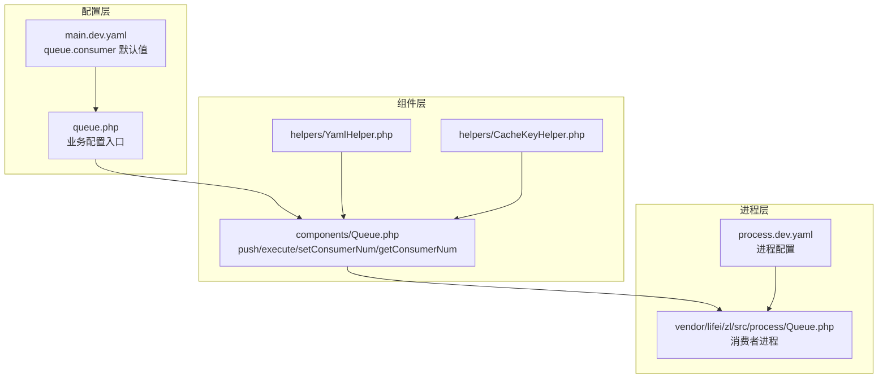
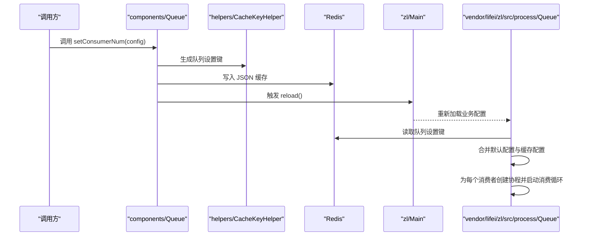
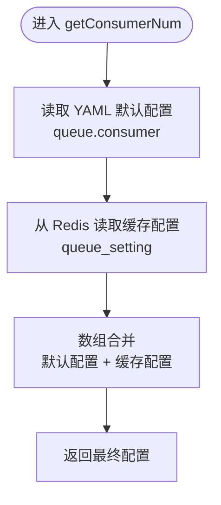
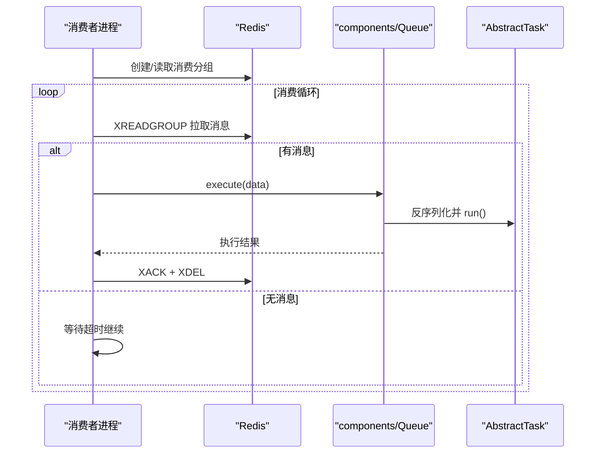
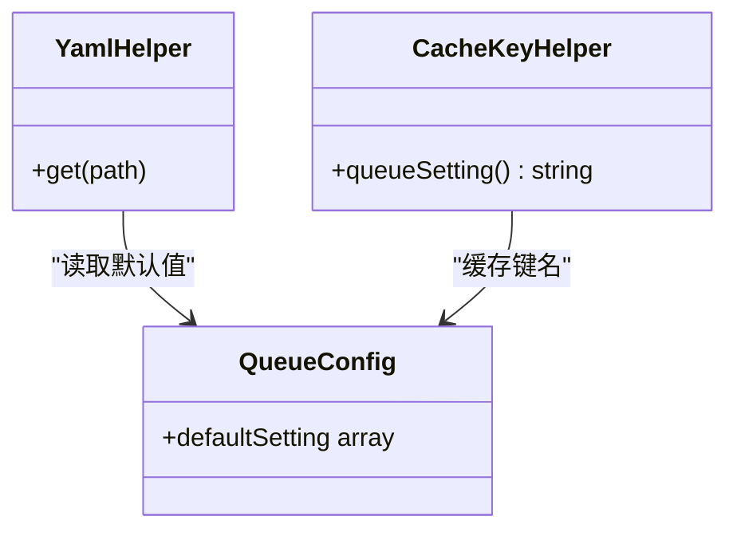
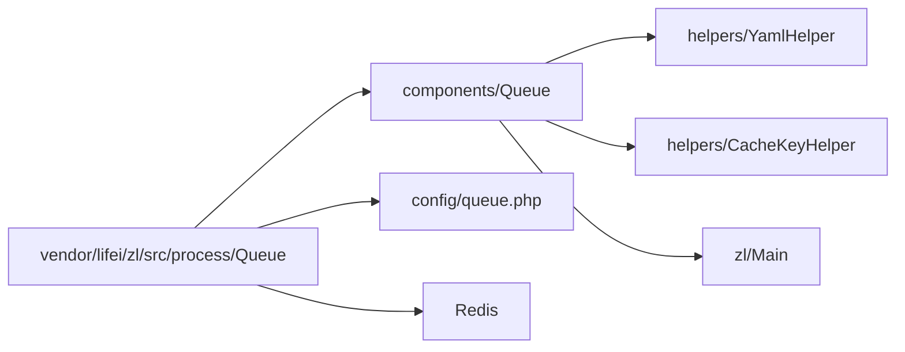

# 消费者管理

<cite>
**本文引用的文件**
- [process\src\components\Queue.php](file://process\src\components\Queue.php)
- [process\vendor\lifei\zl\src\process\Queue.php](file://process\vendor\lifei\zl\src\process\Queue.php)
- [process\src\config\main.dev.yaml](file://process\src\config\main.dev.yaml)
- [process\src\config\process.dev.yaml](file://process\src\config\process.dev.yaml)
- [process\src\config\queue.php](file://process\src\config\queue.php)
- [process\src\helpers\YamlHelper.php](file://process\src\helpers\YamlHelper.php)
- [process\src\helpers\CacheKeyHelper.php](file://process\src\helpers\CacheKeyHelper.php)
- [process\src\services\task\AbstractTask.php](file://process\src\services\task\AbstractTask.php)
</cite>

## 目录
1. [引言](#引言)
2. [项目结构](#项目结构)
3. [核心组件](#核心组件)
4. [架构总览](#架构总览)
5. [详细组件分析](#详细组件分析)
6. [依赖关系分析](#依赖关系分析)
7. [性能考量](#性能考量)
8. [故障排查指南](#故障排查指南)
9. [结论](#结论)

## 引言
本文件围绕 htdNew 项目的“队列消费者管理”展开，重点解释以下内容：
- setConsumerNum 与 getConsumerNum 的实现与协作：如何通过 Redis 缓存覆盖 YAML 默认配置，并触发主进程热重载。
- 默认配置与缓存配置的合并策略：优先级与覆盖规则。
- YAML 配置文件的读取与处理流程。
- 消费者数量对系统性能的影响、负载均衡与资源分配策略。
- 消费者进程生命周期、重启机制与配置热更新。
- 监控、故障检测与自动恢复机制。

## 项目结构
与消费者管理直接相关的模块分布如下：
- 队列组件：负责任务入队、出队执行、消费者数量设置与获取。
- 队列进程：基于 Swoole 协程的消费者进程，读取业务配置并按消费者数量并发拉取消息。
- 配置层：YAML 默认配置与业务配置入口。
- 辅助工具：YamlHelper、CacheKeyHelper 提供统一的配置读取与缓存键管理。

图表来源
- [process\src\config\main.dev.yaml](file://process\src\config\main.dev.yaml#L58-L65)
- [process\src\config\queue.php](file://process\src\config\queue.php#L1-L13)
- [process\src\components\Queue.php](file://process\src\components\Queue.php#L42-L60)
- [process\vendor\lifei\zl\src\process\Queue.php](file://process\vendor\lifei\zl\src\process\Queue.php#L19-L47)
- [process\src\config\process.dev.yaml](file://process\src\config\process.dev.yaml#L55-L62)

章节来源
- [process\src\config\main.dev.yaml](file://process\src\config\main.dev.yaml#L58-L65)
- [process\src\config\queue.php](file://process\src\config\queue.php#L1-L13)
- [process\src\components\Queue.php](file://process\src\components\Queue.php#L42-L60)
- [process\vendor\lifei\zl\src\process\Queue.php](file://process\vendor\lifei\zl\src\process\Queue.php#L19-L47)
- [process\src\config\process.dev.yaml](file://process\src\config\process.dev.yaml#L55-L62)

## 核心组件
- components/Queue：提供队列入队、执行、以及消费者数量的设置与获取；通过 Redis 键缓存覆盖 YAML 默认值，并触发主进程 reload。
- vendor/lifei/zl/src/process/Queue：消费者进程实现，按业务配置中的消费者数量并发拉取消息，支持 ACK/DEL 与异常日志记录。
- helpers/YamlHelper：封装 YAML 读取能力，供组件层调用。
- helpers/CacheKeyHelper：提供统一的 Redis 缓存键命名，其中包含队列设置键 queue_setting。
- config/main.dev.yaml：定义 queue.consumer 默认值。
- config/queue.php：业务配置入口，读取 YAML 中的默认值并导出给进程使用。
- config/process.dev.yaml：定义进程类型与每个进程的业务配置文件路径，其中包含队列进程的配置文件指向。

章节来源
- [process\src\components\Queue.php](file://process\src\components\Queue.php#L26-L60)
- [process\vendor\lifei\zl\src\process\Queue.php](file://process\vendor\lifei\zl\src\process\Queue.php#L19-L47)
- [process\src\helpers\YamlHelper.php](file://process\src\helpers\YamlHelper.php#L1-L8)
- [process\src\helpers\CacheKeyHelper.php](file://process\src\helpers\CacheKeyHelper.php#L312-L315)
- [process\src\config\main.dev.yaml](file://process\src\config\main.dev.yaml#L58-L65)
- [process\src\config\queue.php](file://process\src\config\queue.php#L1-L13)
- [process\src\config\process.dev.yaml](file://process\src\config\process.dev.yaml#L55-L62)

## 架构总览
下图展示从“设置消费者数量”到“消费者进程热更新”的完整链路：

图表来源
- [process\src\components\Queue.php](file://process\src\components\Queue.php#L42-L48)
- [process\src\helpers\CacheKeyHelper.php](file://process\src\helpers\CacheKeyHelper.php#L312-L315)
- [process\vendor\lifei\zl\src\process\Queue.php](file://process\vendor\lifei\zl\src\process\Queue.php#L41-L47)

## 详细组件分析

### 组件 A 分析：components/Queue（消费者数量设置与获取）
- setConsumerNum(config)
  - 将传入的配置写入 Redis 缓存键，键名由 CacheKeyHelper 提供。
  - 写入后立即触发主进程热重载，使业务配置与消费者数量变更生效。
- getConsumerNum()
  - 从 YAML 文件读取默认消费者数量配置。
  - 从 Redis 读取缓存的覆盖配置。
  - 使用数组合并策略将缓存配置覆盖默认配置，返回最终生效配置。
- execute(data)
  - 反序列化任务数据并执行，若对象是抽象任务类型则调用其 run()。

图表来源
- [process\src\components\Queue.php](file://process\src\components\Queue.php#L50-L60)
- [process\src\helpers\CacheKeyHelper.php](file://process\src\helpers\CacheKeyHelper.php#L312-L315)
- [process\src\config\main.dev.yaml](file://process\src\config\main.dev.yaml#L58-L65)

章节来源
- [process\src\components\Queue.php](file://process\src\components\Queue.php#L42-L60)
- [process\src\config\main.dev.yaml](file://process\src\config\main.dev.yaml#L58-L65)

### 组件 B 分析：vendor/lifei/zl/src/process/Queue（消费者进程）
- 生命周期
  - 进程启动时注册 SIGTERM 信号，收到信号后停止运行并退出。
  - 为每个消费者数量创建一个协程通道，用于控制并发度。
- 消费流程
  - 创建 Redis Stream 消费分组，使用 XREADGROUP 拉取消息。
  - 每条消息在独立协程中执行，成功后 ACK 并 DEL 消息。
  - 异常捕获并记录日志，不影响整体消费循环。
- 配置热更新
  - 启动时读取业务配置中的 defaultSetting 与 Redis 中的 queue_setting，合并后作为当前消费者的并发数。
  - 由于进程不主动轮询 Redis，消费者数量变更通过主进程 reload 触发重新加载配置。

图表来源
- [process\vendor\lifei\zl\src\process\Queue.php](file://process\vendor\lifei\zl\src\process\Queue.php#L41-L91)
- [process\src\components\Queue.php](file://process\src\components\Queue.php#L32-L40)
- [process\src\services\task\AbstractTask.php](file://process\src\services\task\AbstractTask.php#L1-L30)

章节来源
- [process\vendor\lifei\zl\src\process\Queue.php](file://process\vendor\lifei\zl\src\process\Queue.php#L19-L91)
- [process\src\components\Queue.php](file://process\src\components\Queue.php#L26-L40)
- [process\src\services\task\AbstractTask.php](file://process\src\services\task\AbstractTask.php#L1-L30)

### 组件 C 分析：配置与缓存键
- YAML 默认配置
  - 在 main.dev.yaml 中定义 queue.consumer 的默认值（如 common/high/low）。
- 业务配置入口
  - queue.php 读取 YAML 的默认值并导出 defaultSetting，供进程侧使用。
- 缓存键
  - CacheKeyHelper 提供统一的 queue_setting 键名，用于存储覆盖配置。

图表来源
- [process\src\config\main.dev.yaml](file://process\src\config\main.dev.yaml#L58-L65)
- [process\src\config\queue.php](file://process\src\config\queue.php#L1-L13)
- [process\src\helpers\YamlHelper.php](file://process\src\helpers\YamlHelper.php#L1-L8)
- [process\src\helpers\CacheKeyHelper.php](file://process\src\helpers\CacheKeyHelper.php#L312-L315)

章节来源
- [process\src\config\main.dev.yaml](file://process\src\config\main.dev.yaml#L58-L65)
- [process\src\config\queue.php](file://process\src\config\queue.php#L1-L13)
- [process\src\helpers\YamlHelper.php](file://process\src\helpers\YamlHelper.php#L1-L8)
- [process\src\helpers\CacheKeyHelper.php](file://process\src\helpers\CacheKeyHelper.php#L312-L315)

## 依赖关系分析
- components/Queue 依赖：
  - helpers/YamlHelper：读取 YAML 默认配置。
  - helpers/CacheKeyHelper：生成 Redis 缓存键。
  - zl/Main：触发主进程热重载。
- vendor/lifei/zl/src/process/Queue 依赖：
  - 业务配置文件（queue.php）提供的 defaultSetting。
  - Redis：Stream 消费、ACK/DEL、分组创建。
  - components/Queue：执行具体任务。

图表来源
- [process\src\components\Queue.php](file://process\src\components\Queue.php#L42-L60)
- [process\vendor\lifei\zl\src\process\Queue.php](file://process\vendor\lifei\zl\src\process\Queue.php#L19-L47)
- [process\src\config\queue.php](file://process\src\config\queue.php#L1-L13)

章节来源
- [process\src\components\Queue.php](file://process\src\components\Queue.php#L42-L60)
- [process\vendor\lifei\zl\src\process\Queue.php](file://process\vendor\lifei\zl\src\process\Queue.php#L19-L47)
- [process\src\config\queue.php](file://process\src\config\queue.php#L1-L13)

## 性能考量
- 并发度与资源分配
  - 每个消费者对应一个协程，消费者数量直接影响并发处理能力。
  - 高优先级主题（如 high）可适当提高消费者数量以降低积压。
- 资源隔离
  - 每个消费者进程使用独立的 Redis 客户端与消费分组，避免互相干扰。
- 负载均衡
  - 同一主题的多个消费者共享同一消费分组，消息被均匀分摊至不同消费者协程。
- 队列长度监控
  - 通过 getTopicLen 可查询主题长度，辅助判断是否需要增减消费者数量。

章节来源
- [process\vendor\lifei\zl\src\process\Queue.php](file://process\vendor\lifei\zl\src\process\Queue.php#L41-L91)
- [process\src\components\Queue.php](file://process\src\components\Queue.php#L62-L67)

## 故障排查指南
- 配置未生效
  - 确认已调用 setConsumerNum 并触发主进程 reload。
  - 检查 Redis 中是否存在 queue_setting 键及内容。
- 消费异常
  - 消费进程会捕获异常并记录日志，检查日志输出定位问题。
  - 确认任务对象可被正确反序列化且 run() 正常执行。
- 消费积压
  - 使用 getTopicLen 查看主题长度，必要时增加对应主题的消费者数量。
  - 检查任务执行耗时与外部依赖响应时间。

章节来源
- [process\vendor\lifei\zl\src\process\Queue.php](file://process\vendor\lifei\zl\src\process\Queue.php#L70-L91)
- [process\src\components\Queue.php](file://process\src\components\Queue.php#L26-L40)
- [process\src\components\Queue.php](file://process\src\components\Queue.php#L62-L67)

## 结论
- setConsumerNum 与 getConsumerNum 形成“写缓存 + 读合并”的闭环：通过 Redis 缓存覆盖 YAML 默认配置，并由主进程热重载驱动消费者进程即时生效。
- 消费者进程基于 Swoole 协程实现高并发消费，具备 ACK/DEL 与异常日志记录，保障可靠性。
- 通过主题维度的消费者数量配置，可在不重启主进程的情况下灵活调整资源分配，满足不同优先级场景的性能需求。