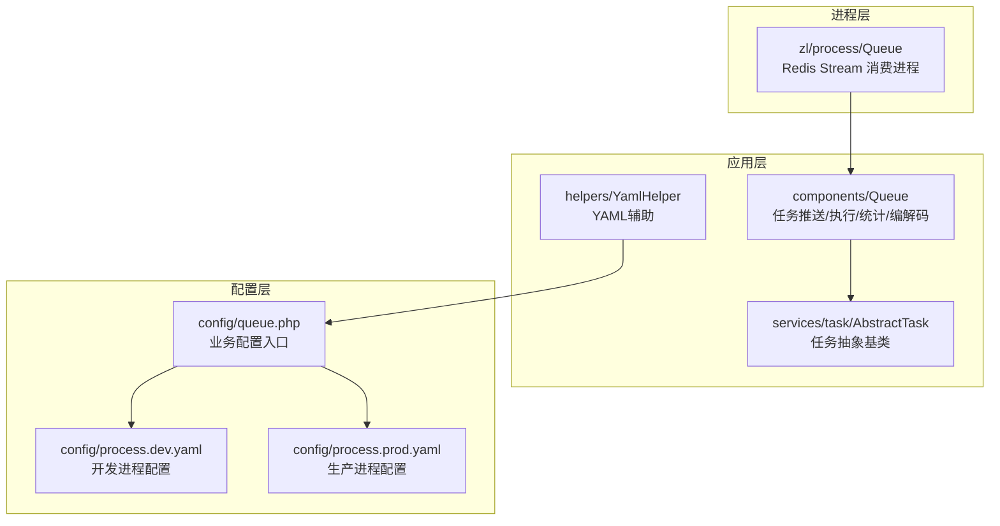
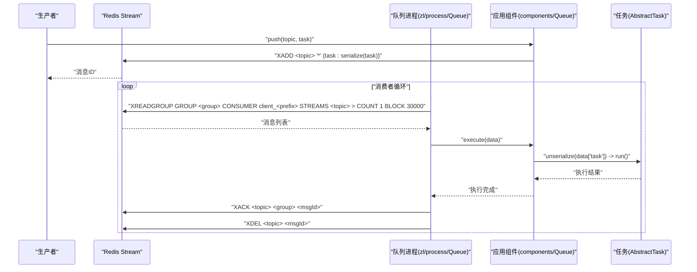
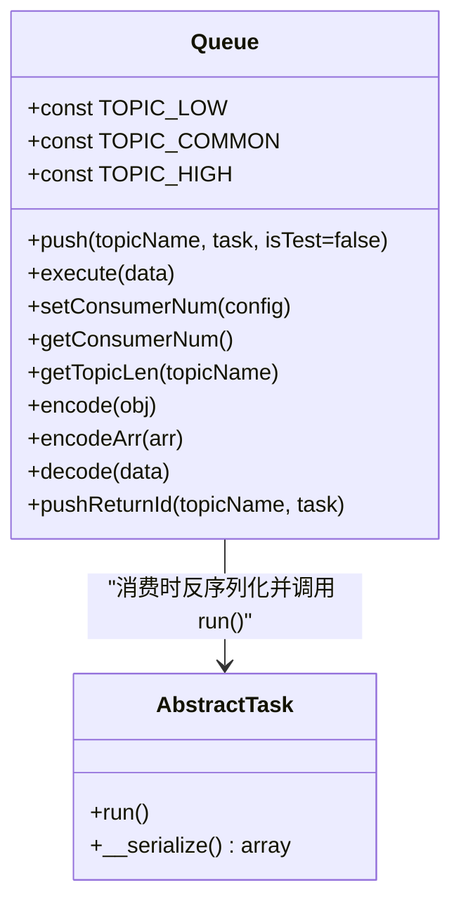
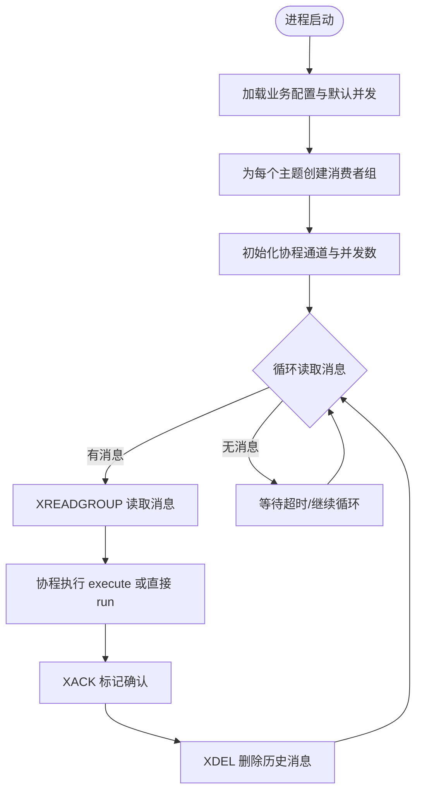
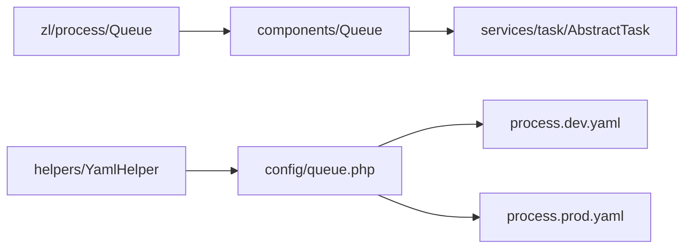

# 队列核心概念

<cite>
**本文引用的文件**
- [process\src\components\Queue.php](file://process\src\components\Queue.php)
- [process\vendor\lifei\zl\src\process\Queue.php](file://process\vendor\lifei\zl\src\process\Queue.php)
- [process\src\services\task\AbstractTask.php](file://process\src\services\task\AbstractTask.php)
- [process\src\config\queue.php](file://process\src\config\queue.php)
- [process\src\config\process.dev.yaml](file://process\src\config\process.dev.yaml)
- [process\src\config\process.prod.yaml](file://process\src\config\process.prod.yaml)
- [process\src\helpers\YamlHelper.php](file://process\src\helpers\YamlHelper.php)
</cite>

## 目录
1. [引言](#引言)
2. [项目结构](#项目结构)
3. [核心组件](#核心组件)
4. [架构总览](#架构总览)
5. [详细组件分析](#详细组件分析)
6. [依赖关系分析](#依赖关系分析)
7. [性能考量](#性能考量)
8. [故障排查指南](#故障排查指南)
9. [结论](#结论)

## 引言
本文件围绕 htdNew 项目的队列系统核心概念进行系统性梳理，重点解释基于 Redis Stream 的异步任务队列架构设计，涵盖主题分类（low/common/high）的理念与使用场景、任务推送与消费的完整流程、数据结构与存储格式、以及与 Redis Stream 的集成方式。文档同时提供整体架构图与关键组件说明，帮助读者快速理解并正确使用该队列系统。

## 项目结构
队列系统由“应用层组件”“进程层消费者”“配置层”三部分协同构成：
- 应用层组件：负责任务对象的序列化/反序列化、任务推送、消费者数量管理、队列长度查询等。
- 进程层消费者：基于 Swoole 协程的 Redis Stream 消费进程，支持 XREADGROUP、ACK、DEL、消费者分组等能力。
- 配置层：进程配置与业务配置分离，进程侧定义队列进程及业务配置文件路径，业务侧定义消费者并发数等。

图表来源
- [process\src\components\Queue.php](file://process\src\components\Queue.php#L1-L173)
- [process\vendor\lifei\zl\src\process\Queue.php](file://process\vendor\lifei\zl\src\process\Queue.php#L1-L95)
- [process\src\services\task\AbstractTask.php](file://process\src\services\task\AbstractTask.php#L1-L30)
- [process\src\config\queue.php](file://process\src\config\queue.php#L1-L13)
- [process\src\config\process.dev.yaml](file://process\src\config\process.dev.yaml#L1-L89)
- [process\src\config\process.prod.yaml](file://process\src\config\process.prod.yaml#L1-L80)
- [process\src\helpers\YamlHelper.php](file://process\src\helpers\YamlHelper.php#L1-L8)

章节来源
- [process\src\config\process.dev.yaml](file://process\src\config\process.dev.yaml#L1-L89)
- [process\src\config\process.prod.yaml](file://process\src\config\process.prod.yaml#L1-L80)
- [process\src\config\queue.php](file://process\src\config\queue.php#L1-L13)

## 核心组件
- 组件常量与主题
  - 低优先级主题：low
  - 中优先级主题：common
  - 高优先级主题：high
  - 设计理念：通过主题对任务进行逻辑分层，便于按优先级分配资源与消费并发，实现差异化处理策略。
- 任务推送
  - 使用 Redis Stream 的 XADD 将任务以二进制序列化形式写入指定主题。
  - 提供带返回消息 ID 的推送方法，便于后续跟踪或关联。
- 任务执行
  - 消费端从 Redis Stream 读取消息后，先进行反序列化，再调用任务对象的 run 方法执行。
  - 执行成功后通过 XACK 标记确认，随后使用 XDEL 清理历史消息，避免无限增长。
- 消费者数量管理
  - 通过 YAML 配置默认并发数，运行时可通过缓存覆盖并触发主进程热重载，动态调整消费者数量。
- 队列长度查询
  - 提供按主题查询队列长度的能力，便于监控与告警。

章节来源
- [process\src\components\Queue.php](file://process\src\components\Queue.php#L1-L173)
- [process\vendor\lifei\zl\src\process\Queue.php](file://process\vendor\lifei\zl\src\process\Queue.php#L1-L95)
- [process\src\config\queue.php](file://process\src\config\queue.php#L1-L13)

## 架构总览
下图展示了从任务生成到消费完成的全链路：

图表来源
- [process\vendor\lifei\zl\src\process\Queue.php](file://process\vendor\lifei\zl\src\process\Queue.php#L1-L95)
- [process\src\components\Queue.php](file://process\src\components\Queue.php#L1-L173)
- [process\src\services\task\AbstractTask.php](file://process\src\services\task\AbstractTask.php#L1-L30)

## 详细组件分析

### 组件 A：应用层队列组件（components/Queue）
职责与行为
- 主题常量：定义 low/common/high 三档主题，用于任务分类。
- 推送接口：将任务对象序列化后写入 Redis Stream。
- 执行接口：反序列化消息体中的任务对象并调用其 run 方法。
- 编解码工具：
  - encode/encodeArr：递归遍历对象属性，支持 __serialize/__unserialize 或反射读取公共非静态属性。
  - decode：根据 __class 字段还原对象实例，兼容不同生命周期方法。
- 消费者数量管理：读取 YAML 默认配置，结合 Redis 缓存覆盖，写入后触发主进程 reload。
- 队列长度查询：通过 XLEN 获取主题当前长度。

图表来源
- [process\src\components\Queue.php](file://process\src\components\Queue.php#L1-L173)
- [process\src\services\task\AbstractTask.php](file://process\src\services\task\AbstractTask.php#L1-L30)

章节来源
- [process\src\components\Queue.php](file://process\src\components\Queue.php#L1-L173)
- [process\src\services\task\AbstractTask.php](file://process\src\services\task\AbstractTask.php#L1-L30)

### 组件 B：进程层队列消费者（zl/process/Queue）
职责与行为
- 进程启动：注册组件、设置进程标题、初始化消费者前缀。
- 消费配置：从 Redis 读取消费者覆盖配置并与默认配置合并，形成每个主题的并发协程数。
- 分组与并发：
  - 为每个主题创建消费者组（XGROUP CREATE），确保消息只被组内一个消费者读取。
  - 为每个并发协程准备 Channel，实现“空闲协程池”复用。
- 消费循环：
  - 使用 XREADGROUP 以阻塞方式读取未消费消息（">" 表示只取新消息）。
  - 为每条消息启动协程处理，执行完成后 ACK 并 DEL。
  - 异常捕获并记录，不影响整体消费循环。
- 动态调整：通过 setConsumerNum 写入 Redis 后，主进程 reload 生效。

图表来源
- [process\vendor\lifei\zl\src\process\Queue.php](file://process\vendor\lifei\zl\src\process\Queue.php#L1-L95)

章节来源
- [process\vendor\lifei\zl\src\process\Queue.php](file://process\vendor\lifei\zl\src\process\Queue.php#L1-L95)

### 组件 C：任务抽象基类（services/task/AbstractTask）
- run 抽象方法：所有具体任务必须实现。
- __serialize：仅序列化公共非静态属性，便于稳定持久化与跨进程传递。
- 与 components/Queue 的协作：消费端通过反序列化得到任务实例并调用 run。

章节来源
- [process\src\services\task\AbstractTask.php](file://process\src\services\task\AbstractTask.php#L1-L30)

### 组件 D：配置入口与进程配置（config/queue.php、process.dev.yaml、process.prod.yaml）
- config/queue.php：引入 components.php 并读取 YAML 中的 queue.consumer 默认并发配置，作为业务配置入口。
- process.dev.yaml/process.prod.yaml：定义队列进程的类、名称、数量、业务配置文件路径等；生产环境与开发环境差异体现在进程数量与 CPU 亲和等。

章节来源
- [process\src\config\queue.php](file://process\src\config\queue.php#L1-L13)
- [process\src\config\process.dev.yaml](file://process\src\config\process.dev.yaml#L1-L89)
- [process\src\config\process.prod.yaml](file://process\src\config\process.prod.yaml#L1-L80)

## 依赖关系分析
- 组件耦合
  - zl/process/Queue 依赖 components/Queue 的 execute/run 能力。
  - components/Queue 依赖 services/task/AbstractTask 的 run 接口。
  - 配置层通过 config/queue.php 与 YAML 辅助类 helpers/YamlHelper 协作，提供默认并发配置。
- 外部依赖
  - Redis：XADD/XREADGROUP/XACK/XDEL/XLEN 等命令支撑流式队列。
  - Swoole：协程、信号、通道等能力支撑高并发消费。
- 潜在风险
  - 任务对象构造函数缺少默认参数可能导致 encode 时抛异常。
  - 消费者组创建与并发数配置需与实际资源匹配，避免饥饿或拥塞。

图表来源
- [process\vendor\lifei\zl\src\process\Queue.php](file://process\vendor\lifei\zl\src\process\Queue.php#L1-L95)
- [process\src\components\Queue.php](file://process\src\components\Queue.php#L1-L173)
- [process\src\services\task\AbstractTask.php](file://process\src\services\task\AbstractTask.php#L1-L30)
- [process\src\config\queue.php](file://process\src\config\queue.php#L1-L13)
- [process\src\config\process.dev.yaml](file://process\src\config\process.dev.yaml#L1-L89)
- [process\src\config\process.prod.yaml](file://process\src\config\process.prod.yaml#L1-L80)
- [process\src\helpers\YamlHelper.php](file://process\src\helpers\YamlHelper.php#L1-L8)

## 性能考量
- 并发模型
  - 每个主题独立消费者组，协程池复用 Channel，减少上下文切换开销。
  - 通过 setConsumerNum 动态调整并发，适配突发流量。
- 数据结构
  - 使用 Redis Stream 的 XADD/XREADGROUP/XACK/XDEL，天然支持消息幂等与确认删除，避免重复消费与堆积。
- 序列化策略
  - 采用 PHP 序列化，兼顾通用性与性能；编码器支持 __serialize/__unserialize 与反射两种路径，提升兼容性。
- 监控与治理
  - 通过 getTopicLen 获取队列长度，结合告警阈值控制扩容或降载。

[本节为通用指导，不直接分析具体文件]

## 故障排查指南
- 任务无法进入队列
  - 检查任务对象构造函数参数是否都具备默认值，否则 encode 会抛出异常。
  - 确认主题名称正确且 Redis Stream 已创建消费者组。
- 消费停滞或积压
  - 查看对应主题的队列长度与消费者并发数是否匹配。
  - 检查消费端日志中是否有异常堆栈，定位具体任务执行问题。
- 动态调整不生效
  - 确认 setConsumerNum 已写入 Redis 并触发主进程 reload。
  - 核对 YAML 默认配置与覆盖配置的合并逻辑。

章节来源
- [process\src\components\Queue.php](file://process\src\components\Queue.php#L1-L173)
- [process\vendor\lifei\zl\src\process\Queue.php](file://process\vendor\lifei\zl\src\process\Queue.php#L1-L95)

## 结论
htdNew 项目的队列系统以 Redis Stream 为核心，结合应用层组件与进程层消费者，实现了高可靠、可扩展、可动态调优的异步任务处理框架。通过 low/common/high 三档主题实现优先级分流，配合 XREADGROUP 的消费者组模型与 ACK/DEL 的确认删除机制，既保证了吞吐，也兼顾了稳定性。建议在生产环境中结合监控指标与弹性扩缩容策略，持续优化消费者并发与资源利用率。