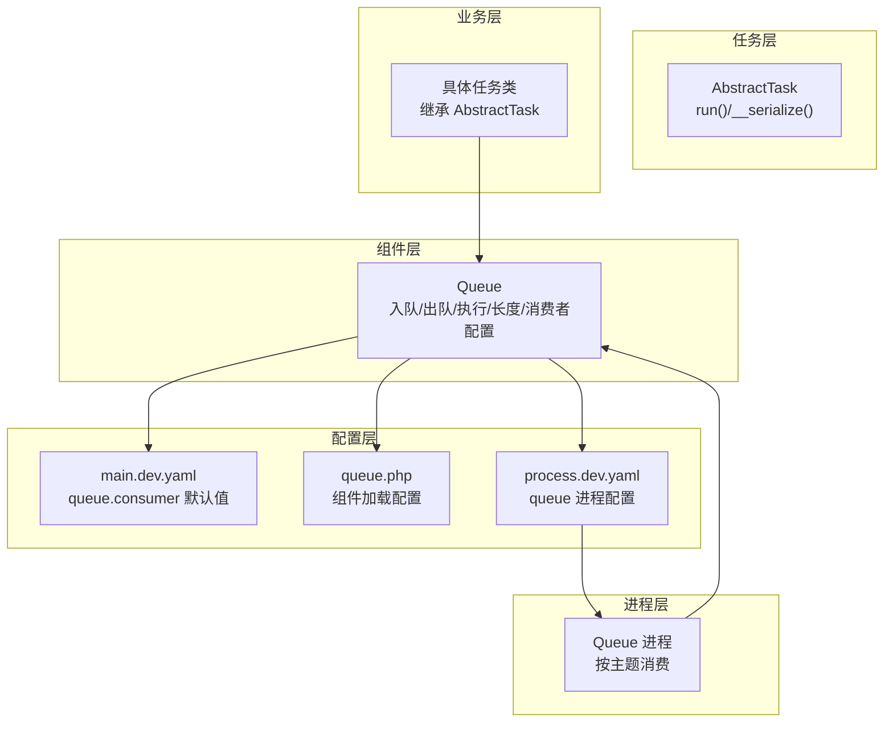
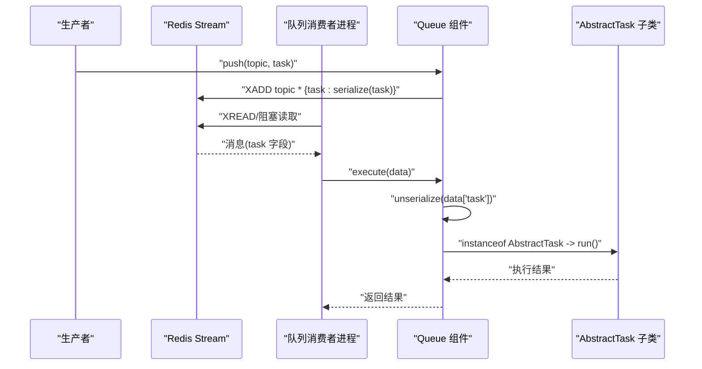
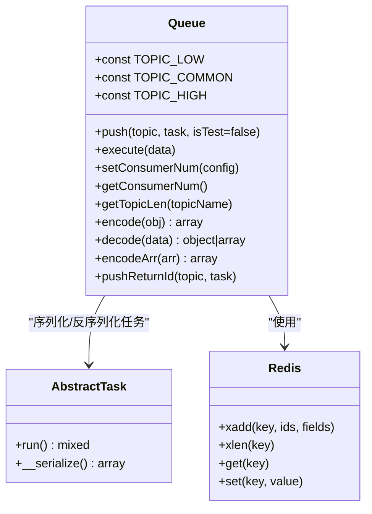
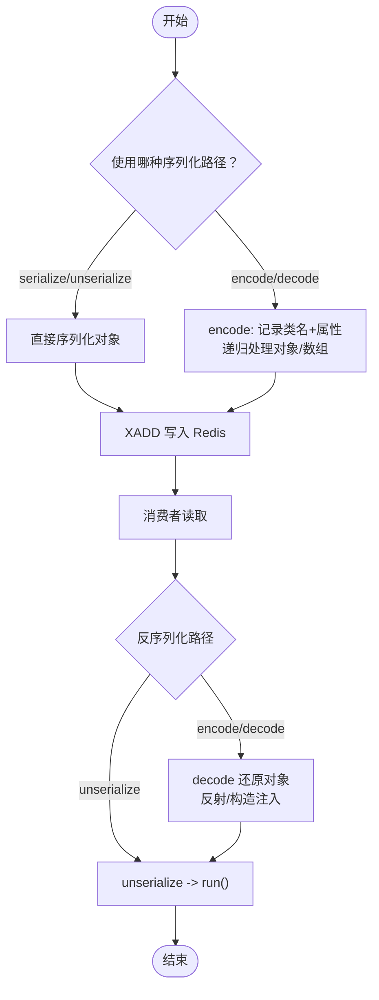
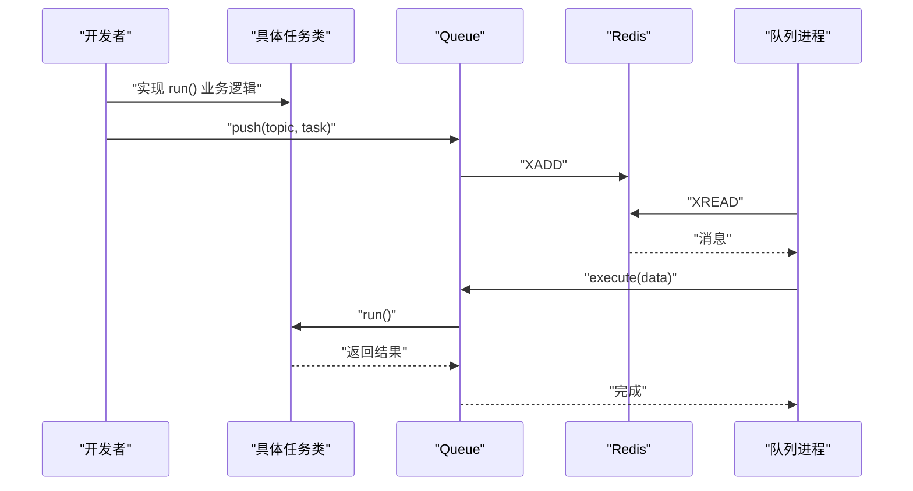
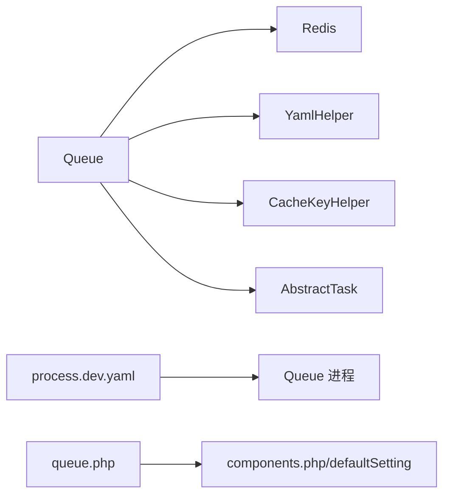

# 队列系统

<cite>
**本文引用的文件**
- [process/src/components/Queue.php](file://process/src/components/Queue.php)
- [process/src/services/task/AbstractTask.php](file://process/src/services/task/AbstractTask.php)
- [process/src/config/main.dev.yaml](file://process/src/config/main.dev.yaml)
- [process/src/config/process.dev.yaml](file://process/src/config/process.dev.yaml)
- [process/src/config/queue.php](file://process/src/config/queue.php)
- [process/src/modules/process/EngineEventHandler.php](file://process/src/modules/process/EngineEventHandler.php)
- [process/src/models/AbstractTaskModel.php](file://process/src/models/AbstractTaskModel.php)
- [process_envs/scnu/product/task/App263GroupListDataSource.php](file://process_envs/scnu/product/task/App263GroupListDataSource.php)
</cite>

## 目录
1. [简介](#简介)
2. [项目结构](#项目结构)
3. [核心组件](#核心组件)
4. [架构总览](#架构总览)
5. [详细组件分析](#详细组件分析)
6. [依赖关系分析](#依赖关系分析)
7. [性能考量](#性能考量)
8. [故障排查指南](#故障排查指南)
9. [结论](#结论)
10. [附录](#附录)

## 简介
本文件面向 htdNew 项目的“队列系统”，围绕基于 Redis Stream 的异步任务队列展开，系统性说明以下内容：
- 任务序列化机制：encode/unserialize 的双路径设计与反射使用
- 主题分类：low/common/high 三档优先级
- 消费者管理：默认配置、运行时覆盖与进程数量控制
- 任务推送流程：生产者如何入队、消费者如何出队并执行
- 队列长度监控与任务执行机制
- 编码解码算法、对象序列化规则与反射机制
- 配置参数、性能优化策略与故障处理方案
- 开发指南、调试技巧与最佳实践

## 项目结构
队列系统主要由以下模块构成：
- 组件层：队列组件负责任务入队、出队执行、消费者数量配置与队列长度查询
- 任务抽象层：任务基类定义序列化接口与运行入口
- 配置层：YAML 提供默认消费者数量；Redis 缓存可运行时覆盖
- 进程层：通过进程配置启动队列消费者进程，按主题分派消费
- 业务任务：继承任务抽象类的具体任务实现

图表来源
- [process/src/components/Queue.php](file://process/src/components/Queue.php#L1-L173)
- [process/src/services/task/AbstractTask.php](file://process/src/services/task/AbstractTask.php#L1-L30)
- [process/src/config/main.dev.yaml](file://process/src/config/main.dev.yaml#L58-L65)
- [process/src/config/process.dev.yaml](file://process/src/config/process.dev.yaml#L55-L62)
- [process/src/config/queue.php](file://process/src/config/queue.php#L1-L13)

章节来源
- [process/src/components/Queue.php](file://process/src/components/Queue.php#L1-L173)
- [process/src/services/task/AbstractTask.php](file://process/src/services/task/AbstractTask.php#L1-L30)
- [process/src/config/main.dev.yaml](file://process/src/config/main.dev.yaml#L58-L65)
- [process/src/config/process.dev.yaml](file://process/src/config/process.dev.yaml#L55-L62)
- [process/src/config/queue.php](file://process/src/config/queue.php#L1-L13)

## 核心组件
- 队列组件（Queue）
  - 主题常量：low/common/high
  - 入队：向 Redis Stream 主题写入任务字段
  - 出队执行：反序列化后调用任务 run()
  - 消费者数量：读取 YAML 默认值，支持 Redis 运行时覆盖
  - 队列长度：通过 Redis 获取主题长度
  - 编解码：支持 serialize/unserialize 与自定义 encode/decode（含反射）
- 任务抽象类（AbstractTask）
  - run() 抽象方法：每个任务必须实现
  - __serialize()：定义序列化字段范围
- 配置
  - main.dev.yaml：定义 queue.consumer 默认值
  - process.dev.yaml：定义 queue 进程 class/number/name/configFile
  - queue.php：组件加载入口

章节来源
- [process/src/components/Queue.php](file://process/src/components/Queue.php#L1-L173)
- [process/src/services/task/AbstractTask.php](file://process/src/services/task/AbstractTask.php#L1-L30)
- [process/src/config/main.dev.yaml](file://process/src/config/main.dev.yaml#L58-L65)
- [process/src/config/process.dev.yaml](file://process/src/config/process.dev.yaml#L55-L62)
- [process/src/config/queue.php](file://process/src/config/queue.php#L1-L13)

## 架构总览
队列系统采用“生产者-消费者”模式，结合 Redis Stream 实现可靠的任务投递与并发消费。

图表来源
- [process/src/components/Queue.php](file://process/src/components/Queue.php#L26-L40)
- [process/src/services/task/AbstractTask.php](file://process/src/services/task/AbstractTask.php#L1-L30)
- [process/src/config/process.dev.yaml](file://process/src/config/process.dev.yaml#L55-L62)

## 详细组件分析

### 队列组件（Queue）
职责与关键点：
- 主题常量：low/common/high 三档主题，便于差异化优先级
- 入队 push：使用 Redis XADD 写入任务字段
- 出队执行 execute：反序列化后调用任务 run()
- 消费者数量管理：
  - 读取 YAML 中 queue.consumer 默认值
  - 通过 Redis 键缓存运行时配置，并触发主进程 reload
- 队列长度监控：通过 Redis XLEN 获取主题长度
- 编解码扩展：
  - encode/decode：支持自定义对象序列化与反射还原
  - encodeArr：递归处理数组中的对象
  - 反射校验：构造函数参数必须可默认，否则抛异常
  - decode 支持 __unserialize、BaseObject 构造注入、或直接属性赋值

图表来源
- [process/src/components/Queue.php](file://process/src/components/Queue.php#L1-L173)
- [process/src/services/task/AbstractTask.php](file://process/src/services/task/AbstractTask.php#L1-L30)

章节来源
- [process/src/components/Queue.php](file://process/src/components/Queue.php#L1-L173)

### 任务抽象类（AbstractTask）
- run()：任务执行入口，子类必须实现
- __serialize()：仅序列化公共非静态属性，确保可稳定还原

章节来源
- [process/src/services/task/AbstractTask.php](file://process/src/services/task/AbstractTask.php#L1-L30)

### 编解码与反射机制
- serialize/unserialize：最简路径，直接写入 Redis
- encode/decode（高级路径）：
  - 记录 __class 并遍历对象属性
  - 支持 __unserialize 或 BaseObject 注入构造
  - 对数组递归 encode/decode
  - 反射检查构造函数参数默认值，避免不可恢复的构造失败

图表来源
- [process/src/components/Queue.php](file://process/src/components/Queue.php#L26-L40)
- [process/src/components/Queue.php](file://process/src/components/Queue.php#L84-L165)
- [process/src/services/task/AbstractTask.php](file://process/src/services/task/AbstractTask.php#L1-L30)

章节来源
- [process/src/components/Queue.php](file://process/src/components/Queue.php#L84-L165)
- [process/src/services/task/AbstractTask.php](file://process/src/services/task/AbstractTask.php#L1-L30)

### 主题分类与消费者管理
- 主题：low/common/high 三档，便于差异化优先级与资源分配
- 默认消费者数量：来自 YAML 的 queue.consumer
- 运行时覆盖：通过 Redis 缓存键存储覆盖配置，触发主进程 reload 生效
- 进程配置：process.dev.yaml 中定义 queue 进程 class/number/name/configFile

章节来源
- [process/src/components/Queue.php](file://process/src/components/Queue.php#L20-L23)
- [process/src/components/Queue.php](file://process/src/components/Queue.php#L42-L60)
- [process/src/config/main.dev.yaml](file://process/src/config/main.dev.yaml#L58-L65)
- [process/src/config/process.dev.yaml](file://process/src/config/process.dev.yaml#L55-L62)

### 任务推送流程与执行机制
- 推送：生产者调用 Queue::push(topic, task)，写入 Redis Stream
- 执行：消费者进程循环读取，调用 Queue::execute(data)，反序列化并执行任务
- 业务任务示例：继承 AbstractTask，实现 run()

图表来源
- [process/src/components/Queue.php](file://process/src/components/Queue.php#L26-L40)
- [process_envs/scnu/product/task/App263GroupListDataSource.php](file://process_envs/scnu/product/task/App263GroupListDataSource.php#L1-L38)

章节来源
- [process/src/components/Queue.php](file://process/src/components/Queue.php#L26-L40)
- [process_envs/scnu/product/task/App263GroupListDataSource.php](file://process_envs/scnu/product/task/App263GroupListDataSource.php#L1-L38)

### 队列长度监控
- 使用 Redis XLEN 获取指定主题当前长度
- 可用于告警阈值与容量规划

章节来源
- [process/src/components/Queue.php](file://process/src/components/Queue.php#L62-L67)

### 任务互斥与并发控制
- 任务模型提供互斥锁能力，防止重复执行
- 适合对同一任务实例加分布式锁

章节来源
- [process/src/models/AbstractTaskModel.php](file://process/src/models/AbstractTaskModel.php#L78-L92)

## 依赖关系分析
- 组件依赖
  - Queue 依赖 Redis 扩展提供的 XADD/XLEN/GET/SET
  - Queue 依赖 YAMLHelper 读取默认配置
  - Queue 依赖 CacheKeyHelper 生成缓存键
  - Queue 依赖 AbstractTask 作为任务契约
- 进程依赖
  - process.dev.yaml 中定义 queue 进程 class 为 Queue 进程类
  - queue.php 作为组件加载入口，包含 components.php 与默认配置

图表来源
- [process/src/components/Queue.php](file://process/src/components/Queue.php#L1-L173)
- [process/src/config/process.dev.yaml](file://process/src/config/process.dev.yaml#L55-L62)
- [process/src/config/queue.php](file://process/src/config/queue.php#L1-L13)

章节来源
- [process/src/components/Queue.php](file://process/src/components/Queue.php#L1-L173)
- [process/src/config/process.dev.yaml](file://process/src/config/process.dev.yaml#L55-L62)
- [process/src/config/queue.php](file://process/src/config/queue.php#L1-L13)

## 性能考量
- 序列化路径选择
  - serialize/unserialize：更高效，推荐用于高频任务
  - encode/decode：支持复杂对象与反射，但有额外开销
- 主题优先级
  - high > common > low，合理分配消费者数量与资源
- 消费者数量
  - 通过运行时覆盖与进程数量共同调节吞吐
- 队列长度监控
  - 建立阈值告警，及时扩容或降载
- 任务粒度
  - 将长耗时任务拆分为多个短任务，降低单次执行时间

## 故障排查指南
- 任务无法反序列化或类不存在
  - 检查 encode/decode 是否正确记录 __class
  - 确保任务类在消费者侧可用
- 构造函数参数缺失
  - 反射校验要求构造函数参数可默认，否则抛异常
- 消费者数量未生效
  - 确认 Redis 缓存键已更新且主进程已 reload
- 队列积压严重
  - 查看各主题 XLEN，评估消费者数量与任务耗时
- 重复执行问题
  - 使用任务互斥锁避免并发重复执行

章节来源
- [process/src/components/Queue.php](file://process/src/components/Queue.php#L84-L129)
- [process/src/components/Queue.php](file://process/src/components/Queue.php#L42-L60)
- [process/src/models/AbstractTaskModel.php](file://process/src/models/AbstractTaskModel.php#L78-L92)

## 结论
htdNew 的队列系统以 Redis Stream 为核心，结合 serialize/unserialize 与 encode/decode 的双路径设计，在保证高性能的同时提供了灵活的对象还原能力。通过 YAML 默认配置与 Redis 运行时覆盖，实现了消费者数量的动态调整；配合进程配置与队列长度监控，可满足不同优先级与负载场景的需求。建议在生产中优先使用 serialize/unserialize 路径，并严格遵循任务类的构造参数默认值约束，确保稳定性与可维护性。

## 附录

### 配置参数一览
- YAML 默认消费者数量
  - 路径：config/main.dev.yaml
  - 键：queue.consumer（common、high、low）
- 运行时覆盖
  - 缓存键：通过 CacheKeyHelper 生成
  - 更新后触发主进程 reload
- 进程配置
  - 路径：config/process.dev.yaml
  - 键：process.queue（class、number、name、configFile）

章节来源
- [process/src/config/main.dev.yaml](file://process/src/config/main.dev.yaml#L58-L65)
- [process/src/components/Queue.php](file://process/src/components/Queue.php#L42-L60)
- [process/src/config/process.dev.yaml](file://process/src/config/process.dev.yaml#L55-L62)

### 开发指南与最佳实践
- 任务实现
  - 继承 AbstractTask，实现 run() 与必要的公共属性
  - 如需 encode/decode，确保属性可被反射访问且构造函数参数可默认
- 入队规范
  - 明确主题：high/common/low
  - 控制任务粒度，避免单任务过长
- 消费者管理
  - 通过 setConsumerNum 动态调整各主题消费者数量
  - 结合队列长度监控与业务 SLA 设定阈值
- 调试技巧
  - 使用 getTopicLen 观察主题堆积
  - 在任务 run() 中增加日志，定位耗时环节
  - 使用任务互斥锁避免重复执行

章节来源
- [process/src/services/task/AbstractTask.php](file://process/src/services/task/AbstractTask.php#L1-L30)
- [process/src/components/Queue.php](file://process/src/components/Queue.php#L26-L40)
- [process/src/components/Queue.php](file://process/src/components/Queue.php#L62-L67)
- [process/src/models/AbstractTaskModel.php](file://process/src/models/AbstractTaskModel.php#L78-L92)