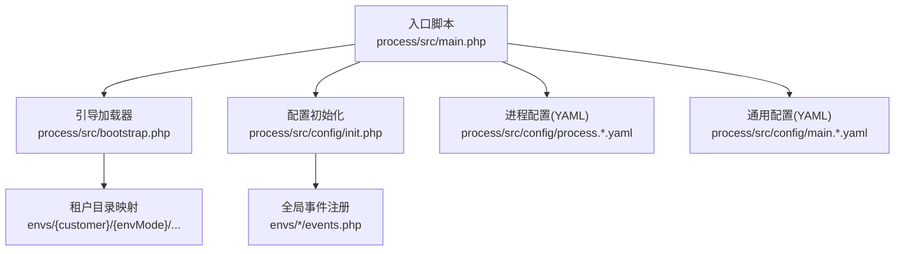
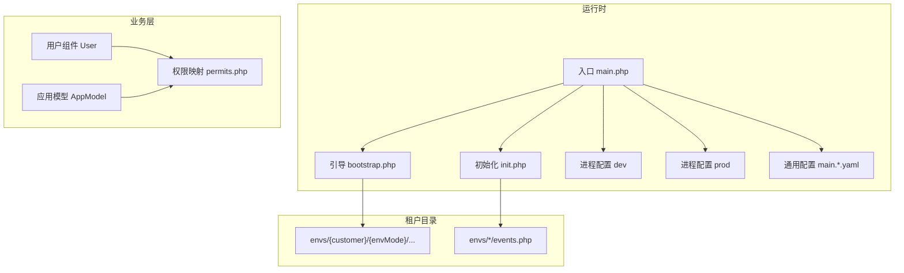
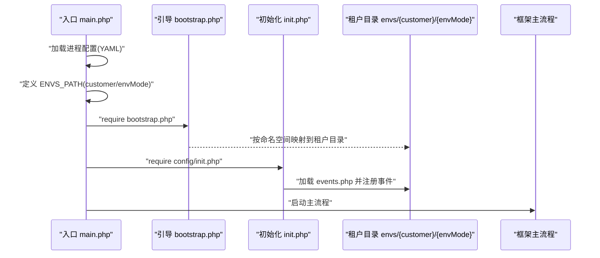
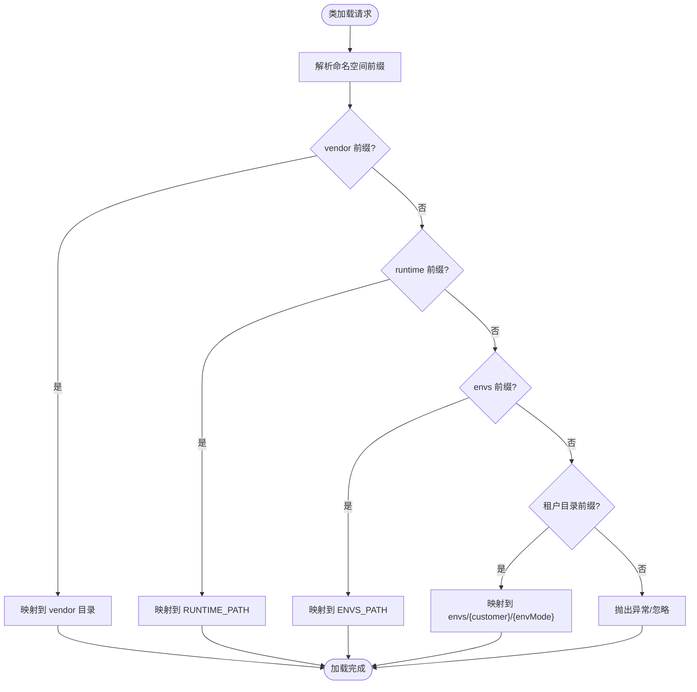
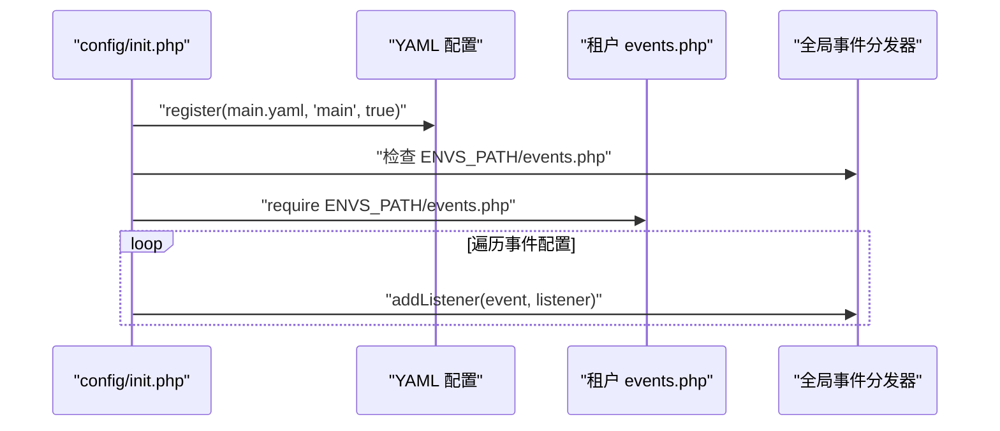
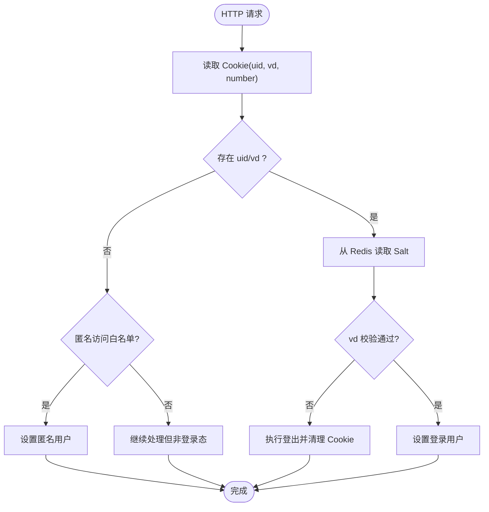
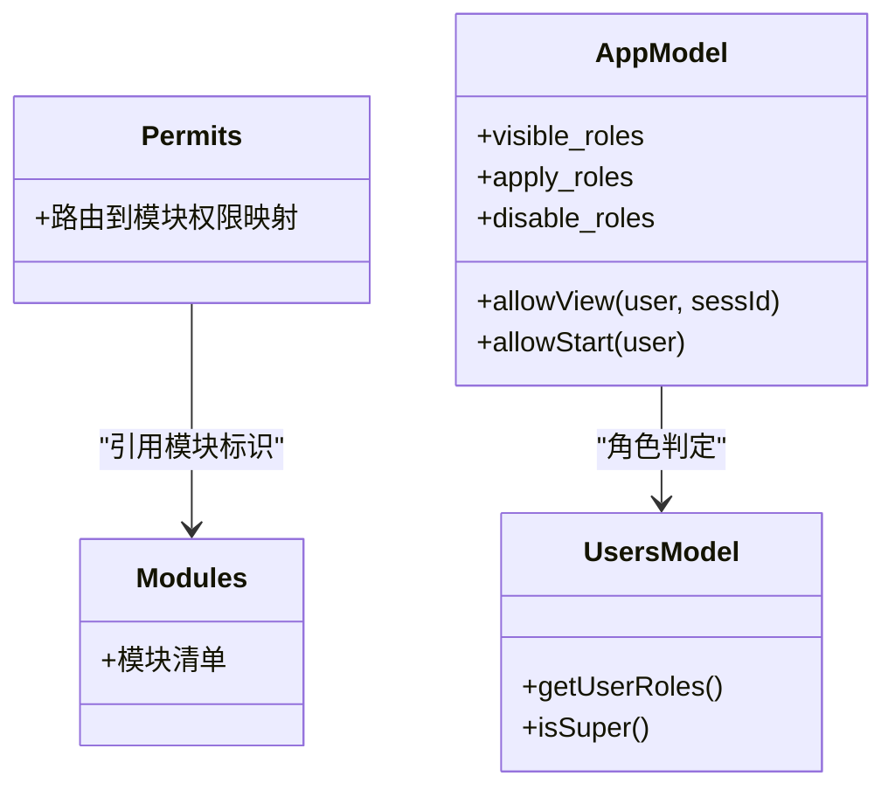
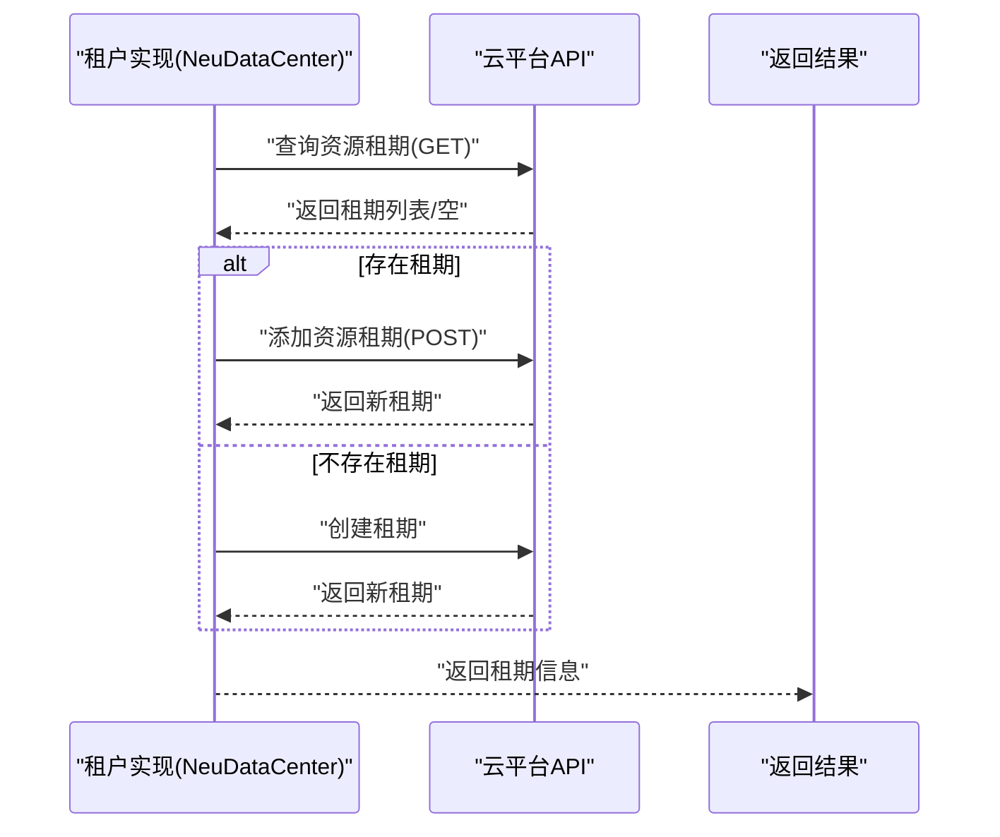
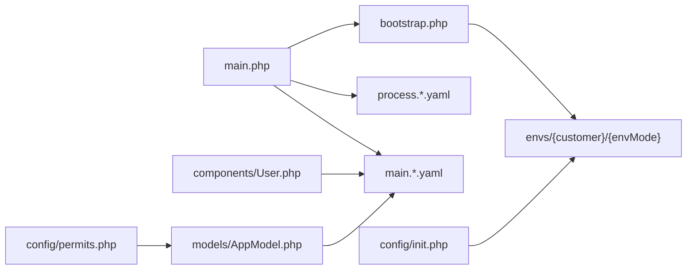

# 多租户架构

<cite>
**本文引用的文件**
- [process\src\main.php](file://process\src\main.php)
- [process\src\bootstrap.php](file://process\src\bootstrap.php)
- [process\src\config\init.php](file://process\src\config\init.php)
- [process\src\config\process.dev.yaml](file://process\src\config\process.dev.yaml)
- [process\src\config\process.prod.yaml](file://process\src\config\process.prod.yaml)
- [process\src\config\main.dev.yaml](file://process\src\config\main.dev.yaml)
- [process\README.MD](file://process\README.MD)
- [process\src\components\User.php](file://process\src\components\User.php)
- [process\src\models\AppModel.php](file://process\src\models\AppModel.php)
- [process\src\config\permits.php](file://process\src\config\permits.php)
- [process_envs\neu\product\task\NeuDataCenter.php](file://process_envs\neu\product\task\NeuDataCenter.php)
</cite>

## 目录
1. [引言](#引言)
2. [项目结构](#项目结构)
3. [核心组件](#核心组件)
4. [架构总览](#架构总览)
5. [详细组件分析](#详细组件分析)
6. [依赖关系分析](#依赖关系分析)
7. [性能考虑](#性能考虑)
8. [故障排除指南](#故障排除指南)
9. [结论](#结论)
10. [附录](#附录)

## 引言
本文件面向 htdNew 项目在多租户场景下的架构说明与实践指南，围绕“租户数据隔离、资源共享与配置管理”展开，结合仓库中的入口、引导加载、配置与鉴权组件，系统梳理租户维度的环境隔离、权限控制与扩展机制，并给出可落地的开发与运维建议。

## 项目结构
htdNew 采用“统一入口 + 自定义引导 + YAML 配置 + 多租户目录映射”的组织方式：
- 入口与引导
  - 入口脚本负责加载配置、设置运行时环境并启动框架主流程。
  - 自定义自动加载器按命名空间将类映射到 vendor、运行时与租户目录。
- 配置体系
  - 运行参数由 YAML 文件定义，包含运行路径、项目名、客户标识与环境类型。
  - 业务配置通过 YAML 注册到全局配置中心，支持运行时热更新。
- 多租户目录
  - 通过租户与环境组合的目录结构，实现租户专属代码与事件钩子的注入。

图表来源
- [process\src\main.php](file://process\src\main.php#L1-L25)
- [process\src\bootstrap.php](file://process\src\bootstrap.php#L1-L40)
- [process\src\config\init.php](file://process\src\config\init.php#L1-L48)
- [process\src\config\process.dev.yaml](file://process\src\config\process.dev.yaml#L1-L89)
- [process\src\config\main.dev.yaml](file://process\src\config\main.dev.yaml#L1-L97)

章节来源
- [process\src\main.php](file://process\src\main.php#L1-L25)
- [process\src\bootstrap.php](file://process\src\bootstrap.php#L1-L40)
- [process\src\config\init.php](file://process\src\config\init.php#L1-L48)
- [process\src\config\process.dev.yaml](file://process\src\config\process.dev.yaml#L1-L89)
- [process\src\config\main.dev.yaml](file://process\src\config\main.dev.yaml#L1-L97)
- [process\README.MD](file://process\README.MD#L120-L158)

## 核心组件
- 入口与运行时
  - 入口脚本设置协程运行模式、加载进程配置、定义租户与环境路径并启动主流程。
- 自动加载与租户映射
  - 自定义自动加载器根据命名空间将类映射至 vendor、运行时与租户目录，实现租户代码的动态注入。
- 配置初始化
  - 将通用配置注册到全局配置中心，设置日志级别，并按租户目录注册事件钩子。
- 用户与会话
  - 用户组件负责登录态校验、匿名访问控制、跨域与跨平台票据维护以及登出清理。
- 权限与模块
  - 权限映射表将路由与功能模块权限关联，配合模块清单实现细粒度的菜单与接口授权。
- 应用模型与可见性
  - 应用模型对“可见角色/申请角色/禁用角色”进行判定，支撑不同租户下事项的可见性与发起权限控制。

章节来源
- [process\src\main.php](file://process\src\main.php#L1-L25)
- [process\src\bootstrap.php](file://process\src\bootstrap.php#L1-L40)
- [process\src\config\init.php](file://process\src\config\init.php#L1-L48)
- [process\src\components\User.php](file://process\src\components\User.php#L1-L429)
- [process\src\config\permits.php](file://process\src\config\permits.php#L1-L385)
- [process\src\models\AppModel.php](file://process\src\models\AppModel.php#L1-L200)

## 架构总览
htdNew 的多租户架构以“入口 + 引导 + 配置 + 租户目录”为核心，通过以下要点实现：
- 环境隔离
  - 进程配置与通用配置分别定义运行路径、项目名、客户标识与环境类型，确保不同租户与环境的进程与资源独立。
- 客户化配置
  - 通用配置通过 YAML 注册到全局配置中心；租户目录下的事件文件在初始化阶段被加载，实现租户级事件钩子注入。
- 数据与会话
  - 用户登录态基于 Cookie 与 Redis Salt 校验，支持跨平台票据与登出清理，保障租户间会话隔离。
- 权限控制
  - 路由到模块权限映射与应用模型的角色判定共同构成多租户下的访问控制基线。

图表来源
- [process\src\main.php](file://process\src\main.php#L1-L25)
- [process\src\bootstrap.php](file://process\src\bootstrap.php#L1-L40)
- [process\src\config\init.php](file://process\src\config\init.php#L1-L48)
- [process\src\config\process.dev.yaml](file://process\src\config\process.dev.yaml#L1-L89)
- [process\src\config\process.prod.yaml](file://process\src\config\process.prod.yaml#L1-L80)
- [process\src\config\main.dev.yaml](file://process\src\config\main.dev.yaml#L1-L97)
- [process\src\components\User.php](file://process\src\components\User.php#L1-L429)
- [process\src\config\permits.php](file://process\src\config\permits.php#L1-L385)
- [process\src\models\AppModel.php](file://process\src\models\AppModel.php#L1-L200)

## 详细组件分析

### 入口与租户路径解析
- 入口脚本设置协程运行模式，加载进程配置并定义租户与环境路径，随后启动主流程。
- 租户路径由进程配置中的 customer 与 envModel 组合生成，用于后续自动加载与事件注册。

图表来源
- [process\src\main.php](file://process\src\main.php#L1-L25)
- [process\src\bootstrap.php](file://process\src\bootstrap.php#L1-L40)
- [process\src\config\init.php](file://process\src\config\init.php#L1-L48)

章节来源
- [process\src\main.php](file://process\src\main.php#L1-L25)
- [process\src\bootstrap.php](file://process\src\bootstrap.php#L1-L40)
- [process\src\config\init.php](file://process\src\config\init.php#L1-L48)

### 自动加载与租户代码注入
- 自动加载器根据类名前缀将类映射到 vendor、运行时与租户目录，实现租户专属代码的按需加载。
- 该机制为多租户扩展提供了“零侵入”的能力：租户只需在对应目录新增类文件即可生效。

图表来源
- [process\src\bootstrap.php](file://process\src\bootstrap.php#L1-L40)

章节来源
- [process\src\bootstrap.php](file://process\src\bootstrap.php#L1-L40)

### 配置初始化与事件注册
- 初始化阶段将通用配置注册到全局配置中心，并依据租户目录加载事件文件，逐条注册事件监听器。
- 该流程确保每个租户可在不修改核心代码的前提下，注入自定义事件处理逻辑。

图表来源
- [process\src\config\init.php](file://process\src\config\init.php#L1-L48)

章节来源
- [process\src\config\init.php](file://process\src\config\init.php#L1-L48)

### 用户登录态与会话隔离
- 登录态校验基于 Cookie 中的 uid 与 vd，结合 Redis 中的 Salt 值与 UA 进行签名验证。
- 支持匿名访问白名单、跨平台票据、临时登录与登出清理，确保租户间会话隔离与安全。

图表来源
- [process\src\components\User.php](file://process\src\components\User.php#L1-L429)

章节来源
- [process\src\components\User.php](file://process\src\components\User.php#L1-L429)

### 权限控制与模块授权
- 权限映射表将具体路由与模块权限标识关联，模块清单定义了所有可用功能模块。
- 应用模型在“可见角色/申请角色/禁用角色”上进行判定，结合用户角色与测试/模拟用户，决定访问与发起权限。

图表来源
- [process\src\config\permits.php](file://process\src\config\permits.php#L1-L385)
- [process\src\models\AppModel.php](file://process\src\models\AppModel.php#L1-L200)

章节来源
- [process\src\config\permits.php](file://process\src\config\permits.php#L1-L385)
- [process\src\models\AppModel.php](file://process\src\models\AppModel.php#L1-L200)

### 租户扩展机制与云资源租期管理
- 在特定租户实现中，通过调用云平台 API 查询与添加资源租期，体现多租户环境下对第三方资源的租户化管理。
- 该机制可用于为不同租户分配与回收云资源，实现资源维度的租户隔离与计费。

图表来源
- [process_envs\neu\product\task\NeuDataCenter.php](file://process_envs\neu\product\task\NeuDataCenter.php#L2751-L2866)

章节来源
- [process_envs\neu\product\task\NeuDataCenter.php](file://process_envs\neu\product\task\NeuDataCenter.php#L2751-L2866)

## 依赖关系分析
- 入口脚本依赖进程配置与通用配置，同时定义租户路径供引导加载器使用。
- 引导加载器依赖租户目录结构，实现租户代码的动态注入。
- 初始化阶段依赖租户事件文件，形成事件驱动的租户扩展点。
- 用户组件依赖配置中心与缓存组件，实现登录态与会话管理。
- 权限映射与应用模型共同构成访问控制闭环。

图表来源
- [process\src\main.php](file://process\src\main.php#L1-L25)
- [process\src\bootstrap.php](file://process\src\bootstrap.php#L1-L40)
- [process\src\config\process.dev.yaml](file://process\src\config\process.dev.yaml#L1-L89)
- [process\src\config\main.dev.yaml](file://process\src\config\main.dev.yaml#L1-L97)
- [process\src\config\init.php](file://process\src\config\init.php#L1-L48)
- [process\src\components\User.php](file://process\src\components\User.php#L1-L429)
- [process\src\models\AppModel.php](file://process\src\models\AppModel.php#L1-L200)
- [process\src\config\permits.php](file://process\src\config\permits.php#L1-L385)

章节来源
- [process\src\main.php](file://process\src\main.php#L1-L25)
- [process\src\bootstrap.php](file://process\src\bootstrap.php#L1-L40)
- [process\src\config\process.dev.yaml](file://process\src\config\process.dev.yaml#L1-L89)
- [process\src\config\main.dev.yaml](file://process\src\config\main.dev.yaml#L1-L97)
- [process\src\config\init.php](file://process\src\config\init.php#L1-L48)
- [process\src\components\User.php](file://process\src\components\User.php#L1-L429)
- [process\src\models\AppModel.php](file://process\src\models\AppModel.php#L1-L200)
- [process\src\config\permits.php](file://process\src\config\permits.php#L1-L385)

## 性能考虑
- 协程与异步
  - 入口启用协程运行模式，有助于提升高并发下的吞吐与资源利用率。
- 缓存与配置
  - 通用配置注册到全局配置中心，减少重复解析；应用列表等热点数据可通过缓存降低数据库压力。
- 进程与资源
  - 进程配置支持多进程与 CPU 亲和设置，生产环境可按核数调整进程数量以提升稳定性与性能。
- 事件与扩展
  - 通过事件钩子实现租户扩展，避免在核心流程中引入额外分支，保持路径简洁。

章节来源
- [process\src\main.php](file://process\src\main.php#L1-L25)
- [process\src\config\process.dev.yaml](file://process\src\config\process.dev.yaml#L1-L89)
- [process\src\config\process.prod.yaml](file://process\src\config\process.prod.yaml#L1-L80)
- [process\src\config\init.php](file://process\src\config\init.php#L1-L48)
- [process\src\models\AppModel.php](file://process\src\models\AppModel.php#L1-L200)

## 故障排除指南
- 启动与环境
  - 确认 Docker 开发环境已正确复制配置文件并启动容器；如需切换环境，注意 dev/prod 的差异。
- 登录与会话
  - 若出现登录态异常，检查 Cookie 与 Redis Salt 的一致性；关注跨域与 SameSite/Secure 配置。
- 权限与路由
  - 若接口不可访问，确认路由是否命中权限映射表；检查模块权限标识与用户角色是否匹配。
- 事件与租户扩展
  - 若租户扩展未生效，检查租户目录下的事件文件是否存在且类可加载；确认事件注册流程是否执行。

章节来源
- [process\README.MD](file://process\README.MD#L1-L158)
- [process\src\components\User.php](file://process\src\components\User.php#L1-L429)
- [process\src\config\permits.php](file://process\src\config\permits.php#L1-L385)
- [process\src\config\init.php](file://process\src\config\init.php#L1-L48)

## 结论
htdNew 的多租户架构以“入口 + 引导 + 配置 + 租户目录”为核心，通过自动加载与事件钩子实现租户级扩展，借助用户组件与权限映射构建访问控制基线，并在部分租户实现中引入云资源租期管理，形成“代码隔离 + 配置隔离 + 会话隔离 + 资源隔离”的多维多租户方案。该架构具备良好的可扩展性与可维护性，适合在多高校/多机构场景下推广。

## 附录
- 开发与部署建议
  - 使用 dev 环境进行本地开发，prod 环境用于生产部署；注意 dev/prod 的差异配置。
  - 通过进程配置调整进程数量与亲和，结合业务峰值评估资源分配。
- 最佳实践
  - 将租户差异化逻辑放入租户目录，避免污染核心代码。
  - 对热点数据使用缓存，对权限判定与角色计算进行索引优化。
  - 在事件钩子中实现最小可行扩展，避免在核心流程中增加复杂度。

章节来源
- [process\README.MD](file://process\README.MD#L1-L158)
- [process\src\config\process.dev.yaml](file://process\src\config\process.dev.yaml#L1-L89)
- [process\src\config\process.prod.yaml](file://process\src\config\process.prod.yaml#L1-L80)