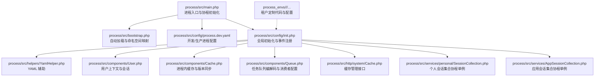
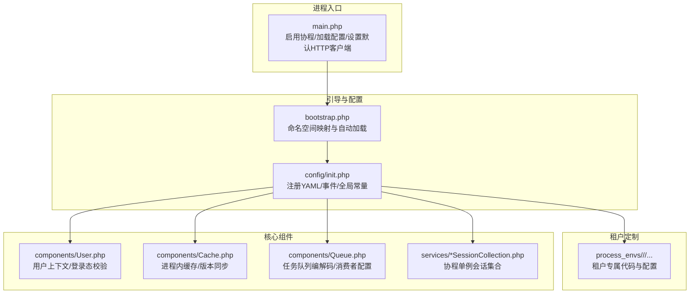
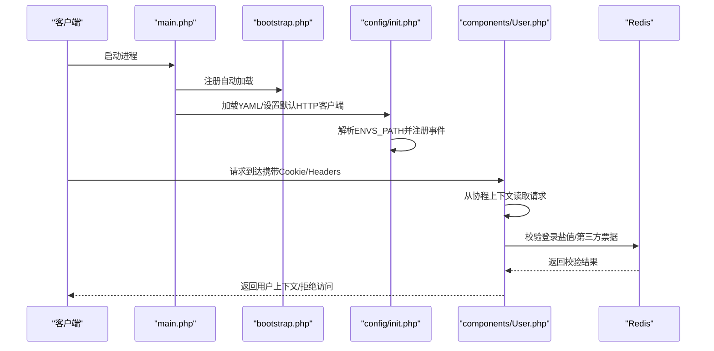
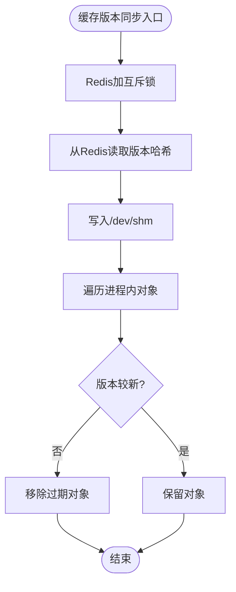
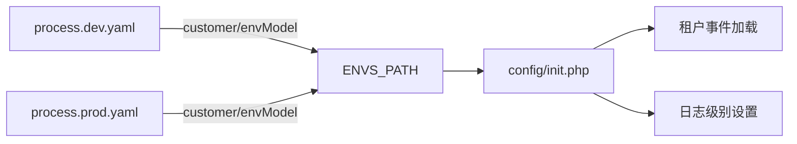
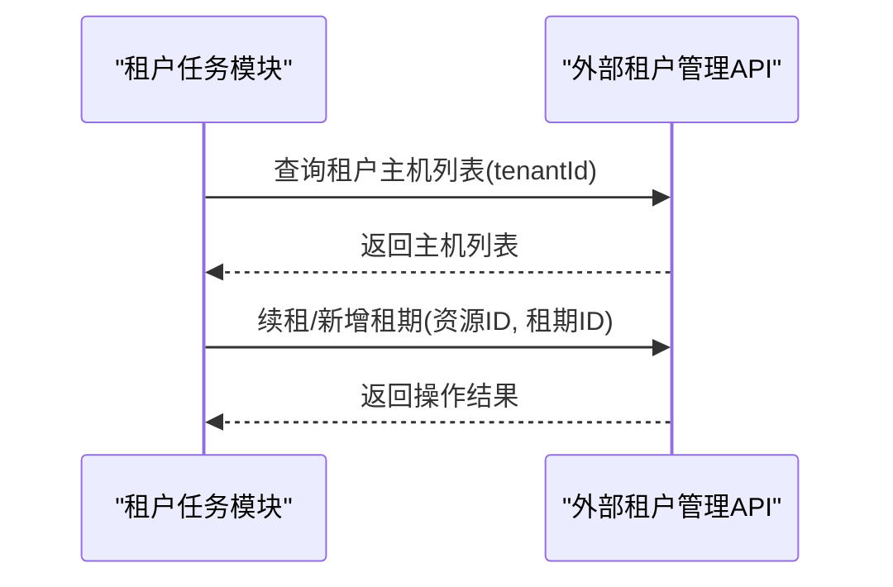
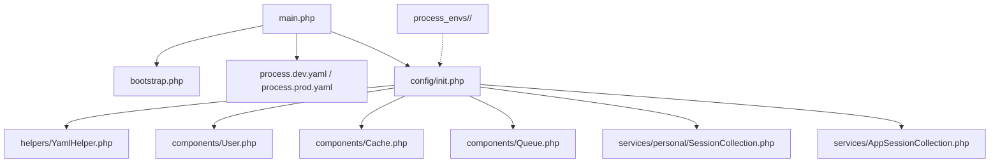

# 多租户设计原理

<cite>
**本文引用的文件**
- [process/main.php](file://process/src/main.php)
- [process/bootstrap.php](file://process/src/bootstrap.php)
- [process/config/process.dev.yaml](file://process/src/config/process.dev.yaml)
- [process/config/process.prod.yaml](file://process/src/config/process.prod.yaml)
- [process/config/init.php](file://process/src/config/init.php)
- [process/components/User.php](file://process/src/components/User.php)
- [process/components/Cache.php](file://process/src/components/Cache.php)
- [process/components/Queue.php](file://process/src/components/Queue.php)
- [process/http/system/Cache.php](file://process/src/http/system/Cache.php)
- [process/services/personal/SessionCollection.php](file://process/src/services/personal/SessionCollection.php)
- [process/services/AppSessionCollection.php](file://process/src/services/AppSessionCollection.php)
- [process/helpers/YamlHelper.php](file://process/src/helpers/YamlHelper.php)
- [process_envs/neu/product/task/NeuDataCenter.php](file://process_envs/neu/product/task/NeuDataCenter.php)
- [process_envs/sysu/product/listeners/QuanXianApiService.php](file://process_envs/sysu/product/listeners/QuanXianApiService.php)
- [process_envs/sysu_test2/product/listeners/QuanXianApiService.php](file://process_envs/sysu_test2/product/listeners/QuanXianApiService.php)
- [process/README.MD](file://process/README.MD)
</cite>

## 目录
1. [引言](#引言)
2. [项目结构](#项目结构)
3. [核心组件](#核心组件)
4. [架构总览](#架构总览)
5. [详细组件分析](#详细组件分析)
6. [依赖关系分析](#依赖关系分析)
7. [性能考量](#性能考量)
8. [故障排查指南](#故障排查指南)
9. [结论](#结论)
10. [附录](#附录)

## 引言
本文件系统性阐述 htdNew 项目在多租户场景下的设计原理与实现要点，重点覆盖以下方面：
- 租户标识与应用上下文管理
- 数据命名空间隔离与资源共享机制
- 配置管理与环境切换
- 多租户与单租户的差异及在 Swoole 协程环境中的特殊考虑
- 架构决策的技术背景、权衡与约束
- 扩展性与性能优化策略

## 项目结构
htdNew 采用“统一内核 + 环境定制”的分层组织方式：
- process/src：通用内核与公共组件（入口、引导、配置、组件、服务等）
- process_envs：按租户/环境划分的定制代码与配置，遵循 customer/env 的目录约定
- process/config：进程与运行时配置（进程模型、CPU 绑定、业务配置文件位置等）

图表来源
- [process/src/main.php](file://process/src/main.php#L1-L25)
- [process/src/bootstrap.php](file://process/src/bootstrap.php#L1-L40)
- [process/src/config/process.dev.yaml](file://process/src/config/process.dev.yaml#L1-L89)
- [process/src/config/init.php](file://process/src/config/init.php#L1-L48)
- [process/src/helpers/YamlHelper.php](file://process/src/helpers/YamlHelper.php#L1-L8)
- [process/src/components/User.php](file://process/src/components/User.php#L1-L429)
- [process/src/components/Cache.php](file://process/src/components/Cache.php#L1-L136)
- [process/src/components/Queue.php](file://process/src/components/Queue.php#L1-L173)
- [process/src/http/system/Cache.php](file://process/src/http/system/Cache.php#L1-L53)
- [process/src/services/personal/SessionCollection.php](file://process/src/services/personal/SessionCollection.php#L1-L26)
- [process/src/services/AppSessionCollection.php](file://process/src/services/AppSessionCollection.php#L1-L31)

章节来源
- [process/src/main.php](file://process/src/main.php#L1-L25)
- [process/src/bootstrap.php](file://process/src/bootstrap.php#L1-L40)
- [process/src/config/process.dev.yaml](file://process/src/config/process.dev.yaml#L1-L89)
- [process/src/config/process.prod.yaml](file://process/src/config/process.prod.yaml#L1-L80)
- [process/README.MD](file://process/README.MD#L151-L158)

## 核心组件
- 进程入口与协程初始化：在入口处启用协程钩子、加载 YAML 配置、设置默认 HTTP 客户端处理器，并基于配置确定租户与环境路径，随后引导框架主流程。
- 自动加载与命名空间映射：根据类名前缀动态定位到 vendor、runtime、envs 等不同目录，实现租户定制代码的无缝接入。
- 配置初始化：注册主 YAML，设置日志级别，构建全局事件分发器，并按租户/环境加载事件配置。
- 用户上下文与会话：在协程上下文中解析 Cookie/Headers，完成登录态校验、匿名访问控制、第三方票据校验与登出清理。
- 进程内缓存与版本同步：通过定时器与共享内存同步缓存版本，实现跨进程一致性与失效控制。
- 任务队列：对任务对象进行序列化/反序列化封装，支持消费者数量动态配置与主题长度查询。
- 个人与应用会话集合：协程单例模式管理用户与应用维度的会话实例，避免跨协程污染。

章节来源
- [process/src/main.php](file://process/src/main.php#L1-L25)
- [process/src/bootstrap.php](file://process/src/bootstrap.php#L1-L40)
- [process/src/config/init.php](file://process/src/config/init.php#L1-L48)
- [process/src/components/User.php](file://process/src/components/User.php#L1-L429)
- [process/src/components/Cache.php](file://process/src/components/Cache.php#L1-L136)
- [process/src/components/Queue.php](file://process/src/components/Queue.php#L1-L173)
- [process/src/services/personal/SessionCollection.php](file://process/src/services/personal/SessionCollection.php#L1-L26)
- [process/src/services/AppSessionCollection.php](file://process/src/services/AppSessionCollection.php#L1-L31)

## 架构总览
多租户架构的关键在于“租户标识 + 环境路径 + 进程内隔离 + 资源共享”的组合：
- 租户标识：由进程配置中的 customer/envModel 字段决定，入口据此拼装 ENVS_PATH，使后续加载的事件、路由、组件均来自该租户/环境目录。
- 应用上下文：User 组件在协程上下文中解析请求头与 Cookie，结合 Redis 校验与第三方票据，形成稳定的用户态上下文。
- 数据命名空间隔离：通过 ENVS_PATH 限定租户定制代码范围；同时在缓存与队列中引入版本键与消费者配置键，避免跨租户数据串扰。
- 资源共享：Redis 作为共享存储与锁，用于缓存版本同步、登录盐值、队列消费者配置等；NFS/共享内存用于跨进程缓存版本广播。

图表来源
- [process/src/main.php](file://process/src/main.php#L1-L25)
- [process/src/bootstrap.php](file://process/src/bootstrap.php#L1-L40)
- [process/src/config/init.php](file://process/src/config/init.php#L1-L48)
- [process/src/components/User.php](file://process/src/components/User.php#L1-L429)
- [process/src/components/Cache.php](file://process/src/components/Cache.php#L1-L136)
- [process/src/components/Queue.php](file://process/src/components/Queue.php#L1-L173)
- [process/src/services/personal/SessionCollection.php](file://process/src/services/personal/SessionCollection.php#L1-L26)
- [process/src/services/AppSessionCollection.php](file://process/src/services/AppSessionCollection.php#L1-L31)

## 详细组件分析

### 租户标识与应用上下文管理
- 租户标识：入口根据 YAML 中 customer/envModel 动态构造 ENVS_PATH，确保后续加载的事件、路由、组件均来自该租户/环境目录。
- 应用上下文：User 组件在协程上下文中解析 Cookie/Headers，执行登录态校验、匿名访问白名单匹配、第三方票据校验与登出清理，最终形成稳定用户态上下文。
- 协程单例：SessionCollection 与 AppSessionCollection 使用协程单例，避免跨协程共享状态引发的竞争问题。

图表来源
- [process/src/main.php](file://process/src/main.php#L1-L25)
- [process/src/bootstrap.php](file://process/src/bootstrap.php#L1-L40)
- [process/src/config/init.php](file://process/src/config/init.php#L1-L48)
- [process/src/components/User.php](file://process/src/components/User.php#L1-L429)

章节来源
- [process/src/main.php](file://process/src/main.php#L1-L25)
- [process/src/bootstrap.php](file://process/src/bootstrap.php#L1-L40)
- [process/src/config/init.php](file://process/src/config/init.php#L1-L48)
- [process/src/components/User.php](file://process/src/components/User.php#L1-L429)
- [process/src/services/personal/SessionCollection.php](file://process/src/services/personal/SessionCollection.php#L1-L26)
- [process/src/services/AppSessionCollection.php](file://process/src/services/AppSessionCollection.php#L1-L31)

### 数据命名空间隔离与资源共享
- 命名空间隔离：通过 ENVS_PATH 将租户定制代码与通用内核解耦，避免配置与业务逻辑相互污染。
- 共享资源：Redis 用于登录盐值、队列消费者配置、缓存版本广播；共享内存用于跨进程缓存版本同步。
- 缓存版本同步：Cache 组件通过互斥锁与共享内存定期拉取 Redis 中的对象版本，跨进程对比并剔除过期对象，保障缓存一致性。

图表来源
- [process/src/components/Cache.php](file://process/src/components/Cache.php#L1-L136)

章节来源
- [process/src/components/Cache.php](file://process/src/components/Cache.php#L1-L136)

### 配置管理与环境切换
- 进程配置：process.dev.yaml/process.prod.yaml 定义运行时路径、项目名、客户标识、环境类型、进程数量与 CPU 绑定等，影响进程模型与资源分配。
- 业务配置：各进程通过 configFile 指向 config 目录下的业务配置文件，修改无需重启主进程。
- 初始化：init.php 注册主 YAML，设置日志级别，构建全局事件分发器，并按 ENVS_PATH 加载租户事件。

图表来源
- [process/src/config/process.dev.yaml](file://process/src/config/process.dev.yaml#L1-L89)
- [process/src/config/process.prod.yaml](file://process/src/config/process.prod.yaml#L1-L80)
- [process/src/config/init.php](file://process/src/config/init.php#L1-L48)

章节来源
- [process/src/config/process.dev.yaml](file://process/src/config/process.dev.yaml#L1-L89)
- [process/src/config/process.prod.yaml](file://process/src/config/process.prod.yaml#L1-L80)
- [process/src/config/init.php](file://process/src/config/init.php#L1-L48)
- [process/README.MD](file://process/README.MD#L151-L158)

### 多租户与单租户的区别
- 单租户：所有租户共享同一套代码与配置，通过数据库 schema 或表前缀区分数据。
- 多租户：通过 ENVS_PATH 将租户定制代码与通用内核解耦，实现“代码级隔离”，同时在共享存储上做版本与键空间管理，实现“数据级隔离”。

章节来源
- [process/src/main.php](file://process/src/main.php#L1-L25)
- [process/src/bootstrap.php](file://process/src/bootstrap.php#L1-L40)
- [process/README.MD](file://process/README.MD#L151-L158)

### 在 Swoole 协程环境下的特殊考虑
- 协程上下文：用户态、会话、缓存等均需在协程上下文中读取与写入，避免跨协程共享状态。
- 协程单例：SessionCollection 与 AppSessionCollection 使用协程单例，确保每个协程拥有独立实例。
- 协程安全的缓存与队列：Cache 与 Queue 在协程环境中通过互斥锁与版本同步保障一致性。

章节来源
- [process/src/components/User.php](file://process/src/components/User.php#L1-L429)
- [process/src/services/personal/SessionCollection.php](file://process/src/services/personal/SessionCollection.php#L1-L26)
- [process/src/services/AppSessionCollection.php](file://process/src/services/AppSessionCollection.php#L1-L31)
- [process/src/components/Cache.php](file://process/src/components/Cache.php#L1-L136)
- [process/src/components/Queue.php](file://process/src/components/Queue.php#L1-L173)

### 多租户与外部系统的交互（以租户管理为例）
部分租户定制模块直接对接外部系统，例如某高校的云资源租户管理接口，通过外部 API 查询/续租资源，体现多租户在外部系统中的租户标识传递与资源隔离。

图表来源
- [process_envs/neu/product/task/NeuDataCenter.php](file://process_envs/neu/product/task/NeuDataCenter.php#L2640-L2866)

章节来源
- [process_envs/neu/product/task/NeuDataCenter.php](file://process_envs/neu/product/task/NeuDataCenter.php#L2640-L2866)

## 依赖关系分析
- 入口依赖：main.php 依赖 bootstrap.php 与 YAML 配置；init.php 依赖 YAML 辅助与事件分发器。
- 组件依赖：User 依赖协程上下文、Redis、YAML 配置；Cache 依赖 Redis 与共享内存；Queue 依赖 Redis 与 YAML 配置。
- 租户定制：process_envs 下的租户代码通过 ENVS_PATH 注入，与通用内核解耦。

图表来源
- [process/src/main.php](file://process/src/main.php#L1-L25)
- [process/src/bootstrap.php](file://process/src/bootstrap.php#L1-L40)
- [process/src/config/process.dev.yaml](file://process/src/config/process.dev.yaml#L1-L89)
- [process/src/config/process.prod.yaml](file://process/src/config/process.prod.yaml#L1-L80)
- [process/src/config/init.php](file://process/src/config/init.php#L1-L48)
- [process/src/helpers/YamlHelper.php](file://process/src/helpers/YamlHelper.php#L1-L8)
- [process/src/components/User.php](file://process/src/components/User.php#L1-L429)
- [process/src/components/Cache.php](file://process/src/components/Cache.php#L1-L136)
- [process/src/components/Queue.php](file://process/src/components/Queue.php#L1-L173)
- [process/src/services/personal/SessionCollection.php](file://process/src/services/personal/SessionCollection.php#L1-L26)
- [process/src/services/AppSessionCollection.php](file://process/src/services/AppSessionCollection.php#L1-L31)

章节来源
- [process/src/main.php](file://process/src/main.php#L1-L25)
- [process/src/bootstrap.php](file://process/src/bootstrap.php#L1-L40)
- [process/src/config/process.dev.yaml](file://process/src/config/process.dev.yaml#L1-L89)
- [process/src/config/process.prod.yaml](file://process/src/config/process.prod.yaml#L1-L80)
- [process/src/config/init.php](file://process/src/config/init.php#L1-L48)

## 性能考量
- 协程并发：启用协程钩子提升 I/O 并发能力，降低阻塞等待。
- 缓存一致性：通过 Redis 版本哈希与共享内存广播，减少跨进程缓存不一致带来的重复计算。
- 队列消费：支持动态调整消费者数量，结合主题长度监控，平衡吞吐与延迟。
- 事件与配置：业务配置文件热加载，避免频繁重启主进程。
- 登录态校验：Redis 快速校验登录盐值与第三方票据，减少数据库压力。

章节来源
- [process/src/main.php](file://process/src/main.php#L1-L25)
- [process/src/components/Cache.php](file://process/src/components/Cache.php#L1-L136)
- [process/src/components/Queue.php](file://process/src/components/Queue.php#L1-L173)
- [process/src/config/process.dev.yaml](file://process/src/config/process.dev.yaml#L1-L89)
- [process/src/config/process.prod.yaml](file://process/src/config/process.prod.yaml#L1-L80)

## 故障排查指南
- 缓存版本不一致：通过 http/system/Cache 接口查看缓存列表、详情、清理单条/全部缓存，并触发版本更新。
- 登录态异常：检查 Cookie/Headers 是否正确传递，确认 Redis 中登录盐值是否存在且未过期。
- 队列消费异常：检查队列消费者配置键与主题长度，必要时调整消费者数量并重载进程。
- 租户事件未生效：确认 ENVS_PATH 是否正确，事件文件是否存在且可被加载。

章节来源
- [process/src/http/system/Cache.php](file://process/src/http/system/Cache.php#L1-L53)
- [process/src/components/User.php](file://process/src/components/User.php#L1-L429)
- [process/src/components/Queue.php](file://process/src/components/Queue.php#L1-L173)
- [process/src/config/init.php](file://process/src/config/init.php#L1-L48)

## 结论
htdNew 的多租户设计以“租户标识 + 环境路径 + 协程上下文 + 共享存储”为核心，实现了代码级隔离与数据级隔离的协同。通过协程单例、缓存版本同步与队列编解码等机制，在保证性能的同时兼顾了扩展性与可维护性。在 Swoole 协程环境下，上述设计有效规避了跨协程共享状态与竞态风险，为多租户场景提供了稳健的工程实践。

## 附录
- 权限平台接口说明（租户定制示例）：部分租户通过监听器对接权限平台，提供 Token 获取、认证、用户/角色/资源/数据权限查询等接口，体现多租户在外部系统中的集成方式。

章节来源
- [process_envs/sysu/product/listeners/QuanXianApiService.php](file://process_envs/sysu/product/listeners/QuanXianApiService.php#L1-L19)
- [process_envs/sysu_test2/product/listeners/QuanXianApiService.php](file://process_envs/sysu_test2/product/listeners/QuanXianApiService.php#L1-L19)