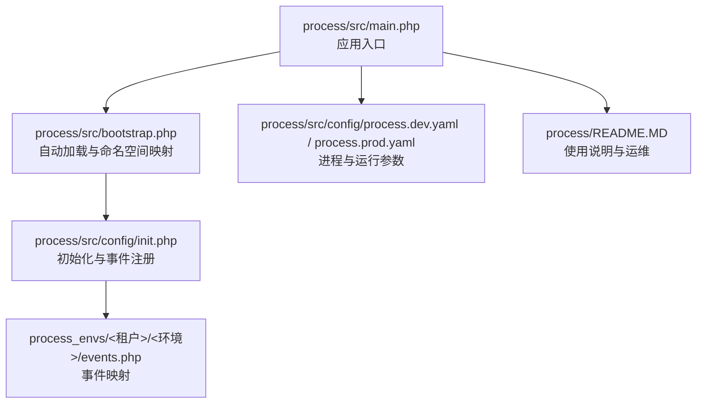
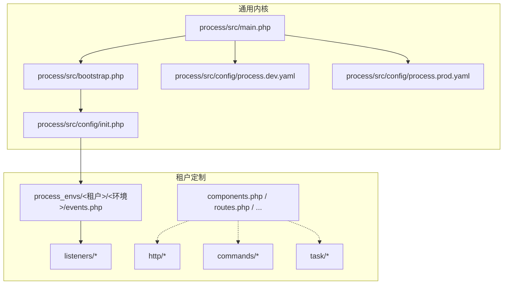
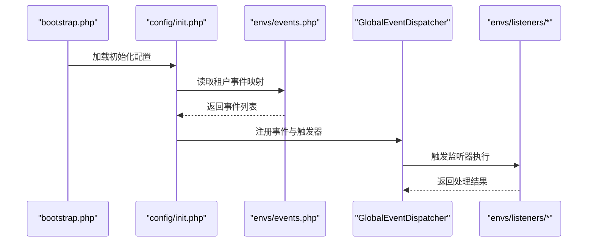
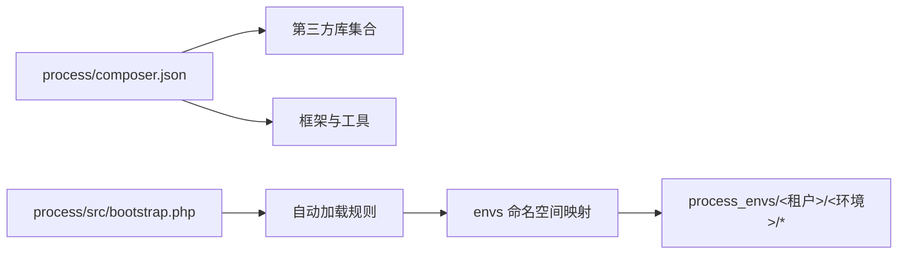

# 租户代码定制化

<cite>
**本文引用的文件**
- [process/src/main.php](file://process/src/main.php)
- [process/src/bootstrap.php](file://process/src/bootstrap.php)
- [process/composer.json](file://process/composer.json)
- [process/README.MD](file://process/README.MD)
- [process/src/config/init.php](file://process/src/config/init.php)
- [process/src/config/routes.php](file://process/src/config/routes.php)
- [process/src/config/process.dev.yaml](file://process/src/config/process.dev.yaml)
- [process/src/config/process.prod.yaml](file://process/src/config/process.prod.yaml)
- [process_envs/bistu/product/events.php](file://process_envs/bistu/product/events.php)
</cite>

## 目录
1. [引言](#引言)
2. [项目结构](#项目结构)
3. [核心组件](#核心组件)
4. [架构总览](#架构总览)
5. [详细组件分析](#详细组件分析)
6. [依赖分析](#依赖分析)
7. [性能考虑](#性能考虑)
8. [故障排查指南](#故障排查指南)
9. [结论](#结论)
10. [附录](#附录)

## 引言
本指南面向为不同租户（客户）进行代码定制化开发的工程师，围绕控制器扩展、监听器实现、任务类开发与命令行工具编写展开，系统讲解租户特定代码的组织结构、命名规范与版本管理策略；深入解析监听器模式在租户定制中的应用，包括事件处理、数据同步与业务流程扩展；同时给出第三方集成、API 扩展与 UI 定制的最佳实践，并提供测试策略、部署流程与维护指南。

## 项目结构
该仓库采用“通用内核 + 租户定制”的分层组织方式：
- 通用内核位于 process/src，包含入口、引导、配置、HTTP 控制器、服务、模型、工具与流程引擎等。
- 租户定制位于 process_envs/<租户>/<环境>/，按 customer/envModel 组织，覆盖命令、HTTP 控制器、监听器、任务、组件、事件映射等。
- process/src/main.php 作为统一入口，结合 ENVS_PATH 动态加载租户代码。

**图表来源**
- [process/src/main.php](file://process/src/main.php#L1-L25)
- [process/src/bootstrap.php](file://process/src/bootstrap.php#L1-L40)
- [process/src/config/init.php](file://process/src/config/init.php#L1-L48)
- [process/src/config/process.dev.yaml](file://process/src/config/process.dev.yaml#L1-L89)
- [process/src/config/process.prod.yaml](file://process/src/config/process.prod.yaml#L1-L80)
- [process/README.MD](file://process/README.MD#L1-L158)
- [process_envs/bistu/product/events.php](file://process_envs/bistu/product/events.php#L1-L37)

**章节来源**
- [process/src/main.php](file://process/src/main.php#L1-L25)
- [process/src/bootstrap.php](file://process/src/bootstrap.php#L1-L40)
- [process/src/config/init.php](file://process/src/config/init.php#L1-L48)
- [process/src/config/process.dev.yaml](file://process/src/config/process.dev.yaml#L1-L89)
- [process/src/config/process.prod.yaml](file://process/src/config/process.prod.yaml#L1-L80)
- [process/README.MD](file://process/README.MD#L1-L158)

## 核心组件
- 应用入口与运行时
  - 入口文件负责加载配置、设置 Swoole Hook、引入引导文件并启动主程序。
  - 运行参数由 YAML 配置决定，支持 dev/test/prod 环境差异。
- 自动加载与命名空间
  - bootstrap.php 实现基于命名空间的自动加载，支持 zl、runtime、envs 命名空间，以及 src 下模块的动态加载。
  - ENVS_PATH 由 customer 与 envModel 组合生成，确保租户代码优先被加载。
- 事件系统与监听器
  - init.php 在启动时读取 ENVS_PATH 下的 events.php，将事件与监听器类注册到全局事件分发器。
  - events.php 以数组形式声明事件、触发器与配置，支持同步/异步执行。
- 进程与运行参数
  - process.dev.yaml/process.prod.yaml 描述主进程、HTTP、队列、计划任务等进程的类、数量与业务配置文件路径。
- 命令行工具
  - README.MD 提供命令行工具的使用说明，如数据库迁移、模型生成、部署等。

**章节来源**
- [process/src/main.php](file://process/src/main.php#L1-L25)
- [process/src/bootstrap.php](file://process/src/bootstrap.php#L1-L40)
- [process/src/config/init.php](file://process/src/config/init.php#L1-L48)
- [process/src/config/process.dev.yaml](file://process/src/config/process.dev.yaml#L1-L89)
- [process/src/config/process.prod.yaml](file://process/src/config/process.prod.yaml#L1-L80)
- [process/README.MD](file://process/README.MD#L1-L158)

## 架构总览
下图展示了租户定制化在系统中的位置与交互关系：

**图表来源**
- [process/src/main.php](file://process/src/main.php#L1-L25)
- [process/src/bootstrap.php](file://process/src/bootstrap.php#L1-L40)
- [process/src/config/init.php](file://process/src/config/init.php#L1-L48)
- [process/src/config/process.dev.yaml](file://process/src/config/process.dev.yaml#L1-L89)
- [process/src/config/process.prod.yaml](file://process/src/config/process.prod.yaml#L1-L80)
- [process_envs/bistu/product/events.php](file://process_envs/bistu/product/events.php#L1-L37)

## 详细组件分析

### 监听器模式与事件处理
- 事件注册流程
  - 启动阶段，init.php 读取 ENVS_PATH 下的 events.php，逐条构造监听器对象并注册到全局事件分发器。
  - 支持内部触发器与同步/异步配置，便于解耦业务逻辑与执行时机。
- 示例映射
  - 以 bistu/product 为例，events.php 映射了登录校验、登录重定向、用户字段同步、流程连线等多个事件，分别对应不同的监听器类。
- 开发要点
  - 监听器类需遵循约定的签名与返回值规范，避免阻塞事件分发。
  - 对于耗时操作建议异步执行，减少对主流程的影响。

**图表来源**
- [process/src/bootstrap.php](file://process/src/bootstrap.php#L1-L40)
- [process/src/config/init.php](file://process/src/config/init.php#L1-L48)
- [process_envs/bistu/product/events.php](file://process_envs/bistu/product/events.php#L1-L37)

**章节来源**
- [process/src/config/init.php](file://process/src/config/init.php#L1-L48)
- [process_envs/bistu/product/events.php](file://process_envs/bistu/product/events.php#L1-L37)

### 控制器扩展与 API 扩展
- 命名空间与自动加载
  - bootstrap.php 支持 envs 命名空间直接映射到 ENVS_PATH，因此可在租户目录下新增 http/* 控制器，无需修改内核代码。
- 路由与站点
  - routes.php 当前为空，可按需扩展路由规则；站点与开放接口可分别放置在 site/open/system 等目录下，遵循现有命名。
- 最佳实践
  - 将租户特有的 API 放置于 http/<租户> 或 http/site/<租户> 下，避免与通用控制器冲突。
  - 对外开放接口建议增加鉴权与限流策略，确保安全与稳定性。

**章节来源**
- [process/src/bootstrap.php](file://process/src/bootstrap.php#L1-L40)
- [process/src/config/routes.php](file://process/src/config/routes.php#L1-L4)

### 任务类开发与计划任务
- 任务组织
  - 租户可在 task/ 下新增任务类，结合队列进程与计划任务进程实现定时与异步处理。
- 进程配置
  - process.dev.yaml 与 process.prod.yaml 定义了 HTTP、队列、计划任务等进程的数量与配置文件路径，便于按环境调整资源。
- 最佳实践
  - 任务类应具备幂等性与错误重试机制；对耗时任务建议拆分与并发化。
  - 通过配置文件区分不同租户的任务策略，避免相互影响。

**章节来源**
- [process/src/config/process.dev.yaml](file://process/src/config/process.dev.yaml#L1-L89)
- [process/src/config/process.prod.yaml](file://process/src/config/process.prod.yaml#L1-L80)

### 命令行工具编写
- 工具入口
  - README.MD 提供命令行工具的使用说明，如数据库迁移、模型生成、部署等。
- 命名规范
  - 命令类建议放置在 commands/<租户> 下，保持与通用命令分离。
- 最佳实践
  - 命令行工具应具备清晰的参数与帮助信息；对敏感操作增加确认提示与日志记录。

**章节来源**
- [process/README.MD](file://process/README.MD#L1-L158)

### 组件与 UI 定制
- 组件扩展
  - 可在租户目录下新增 components.php 以扩展通用组件行为，或在 listeners 中通过事件驱动实现 UI 侧的业务逻辑注入。
- UI 定制
  - 建议将前端构建产物放置于 server 同级目录，并通过路由或静态资源方式提供；后端可通过 API 输出动态配置以适配不同租户的界面需求。

**章节来源**
- [process/src/config/init.php](file://process/src/config/init.php#L1-L48)
- [process/README.MD](file://process/README.MD#L1-L158)

## 依赖分析
- 外部依赖
  - 项目通过 composer.json 管理第三方库，涵盖 HTTP、缓存、图像处理、MQTT、Kafka、邮件、验证码、PDF/Excel/Word 等能力。
- 内部依赖
  - 通用内核与租户定制通过命名空间与自动加载解耦；事件系统作为横切关注点连接通用与租户逻辑。
- 版本管理
  - README.MD 提供部署与维护说明，包括平滑重启、日志查看与调试端口；建议在 CI/CD 中固化依赖版本，避免运行时差异。

**图表来源**
- [process/composer.json](file://process/composer.json#L1-L70)
- [process/src/bootstrap.php](file://process/src/bootstrap.php#L1-L40)

**章节来源**
- [process/composer.json](file://process/composer.json#L1-L70)
- [process/src/bootstrap.php](file://process/src/bootstrap.php#L1-L40)
- [process/README.MD](file://process/README.MD#L1-L158)

## 性能考虑
- 协程与网络
  - 入口启用 Swoole 协程与 Guzzle Swoole Handler，提升并发与 I/O 性能。
- 进程与资源
  - 通过 process.dev.yaml/process.prod.yaml 调整 HTTP、队列、计划任务进程数量与 CPU 亲和，平衡吞吐与延迟。
- 事件与监听器
  - 对耗时逻辑采用异步监听器，避免阻塞主流程；合理拆分事件粒度，降低耦合度。
- 缓存与存储
  - 结合内置缓存组件与外部存储（Redis/Postgres），优化热点数据访问与持久化写入。

**章节来源**
- [process/src/main.php](file://process/src/main.php#L1-L25)
- [process/src/config/process.dev.yaml](file://process/src/config/process.dev.yaml#L1-L89)
- [process/src/config/process.prod.yaml](file://process/src/config/process.prod.yaml#L1-L80)

## 故障排查指南
- 启动与加载问题
  - 若监听器未生效，检查 ENVS_PATH 是否正确、events.php 是否存在且格式正确。
  - 若类未找到，确认命名空间与自动加载规则是否匹配。
- 运维与调试
  - 使用 README.MD 中提供的调试端口与日志查看方式定位问题。
  - 平滑重启可使用信号触发，避免中断业务。
- 事件处理异常
  - 监听器内部异常不应影响全局事件分发，建议在监听器中捕获并记录错误，必要时回退或重试。

**章节来源**
- [process/src/config/init.php](file://process/src/config/init.php#L1-L48)
- [process/src/bootstrap.php](file://process/src/bootstrap.php#L1-L40)
- [process/README.MD](file://process/README.MD#L1-L158)

## 结论
通过“通用内核 + 租户定制”的架构设计，系统实现了高内聚、低耦合的租户差异化能力。监听器模式作为横切机制，有效支撑了事件驱动的数据同步与业务流程扩展；配合命令行工具、任务类与进程配置，能够满足多样化的租户需求。建议在开发中严格遵循命名规范与版本管理策略，持续完善测试与部署流程，确保系统的可维护性与可扩展性。

## 附录
- 命名规范建议
  - 命名空间：envs\租户\环境\模块
  - 文件命名：大驼峰类名 + 功能语义，避免缩写
  - 目录划分：commands/http/listeners/task/components/routes/events
- 版本管理建议
  - 使用 Git 分支管理不同租户的定制版本，通过标签标记发布版本
  - 在 CI/CD 中固定依赖版本，避免运行时差异
- 测试策略
  - 单元测试：针对监听器与任务类的关键逻辑编写可执行用例
  - 集成测试：模拟事件触发与 API 调用，验证租户定制流程
  - 回归测试：每次发布前执行全量回归，确保通用功能不受影响
- 部署流程
  - 开发/测试：使用 dev 环境配置，快速迭代
  - 生产：使用 prod 环境配置，启用部署进程与资源亲和
  - 平滑重启：通过信号触发，保障业务连续性