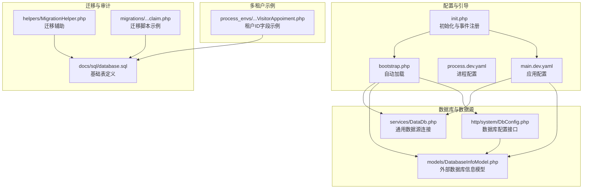
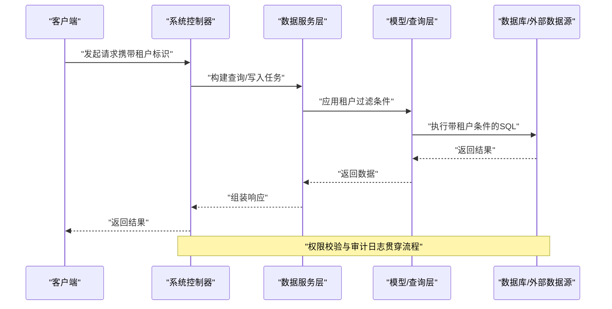
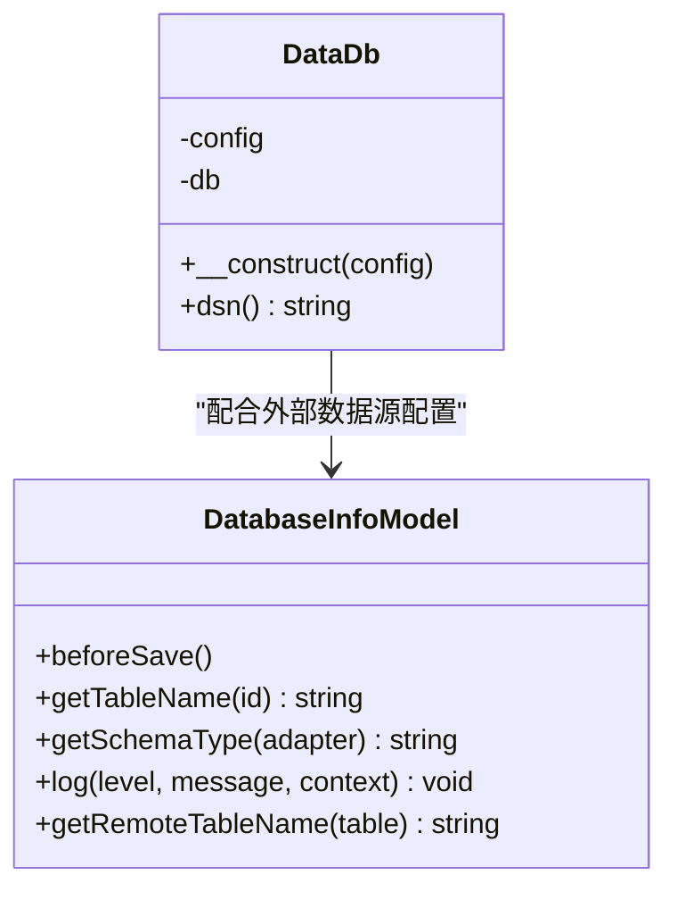
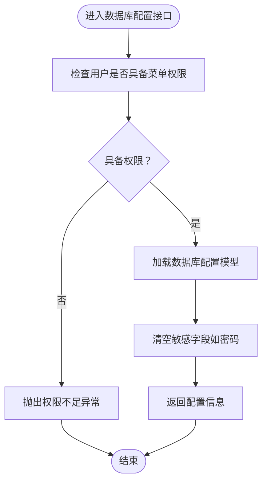
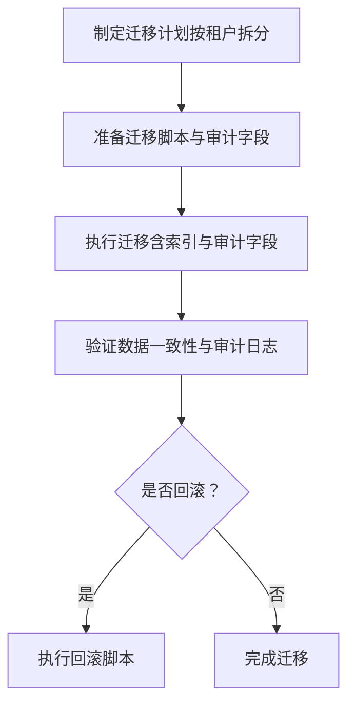
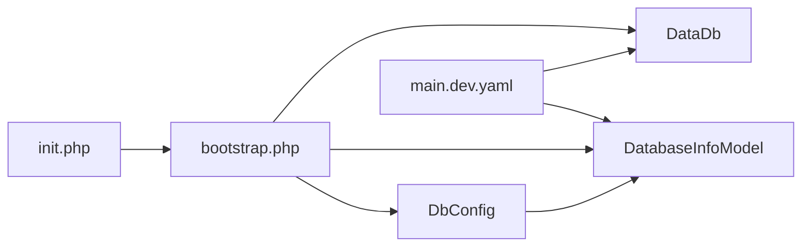

# 租户数据隔离

<cite>
**本文引用的文件**
- [process\src\config\init.php](file://process\src\config\init.php)
- [process\src\config\main.dev.yaml](file://process\src\config\main.dev.yaml)
- [process\src\config\process.dev.yaml](file://process\src\config\process.dev.yaml)
- [process\src\bootstrap.php](file://process\src\bootstrap.php)
- [process\src\services\DataDb.php](file://process\src\services\DataDb.php)
- [process\src\models\DatabaseInfoModel.php](file://process\src\models\DatabaseInfoModel.php)
- [process\src\http\system\DbConfig.php](file://process\src\http\system\DbConfig.php)
- [process\src\helpers\MigrationHelper.php](file://process\src\helpers\MigrationHelper.php)
- [process\docs\sql\database.sql](file://process\docs\sql\database.sql)
- [process\src\migrations\migration_20251120_104600_claim.php](file://process\src\migrations\migration_20251120_104600_claim.php)
- [process_envs\qtc\product\appoimenttools\people\VisitorAppoiment.php](file://process_envs\qtc\product\appoimenttools\people\VisitorAppoiment.php)
</cite>

## 目录
1. [引言](#引言)
2. [项目结构](#项目结构)
3. [核心组件](#核心组件)
4. [架构总览](#架构总览)
5. [详细组件分析](#详细组件分析)
6. [依赖关系分析](#依赖关系分析)
7. [性能考虑](#性能考虑)
8. [故障排查指南](#故障排查指南)
9. [结论](#结论)
10. [附录](#附录)

## 引言
本技术文档聚焦于多租户环境下的数据隔离实现，结合仓库中的配置、服务、模型与迁移脚本，系统化阐述以下主题：
- 数据库层面的隔离策略：表前缀策略、Schema 隔离与连接池管理现状与扩展建议
- 租户标识符在数据访问层的应用：模型层的数据过滤、查询条件自动添加与权限控制
- 跨租户数据访问的安全边界与访问控制列表
- 数据迁移、备份恢复与审计日志的多租户适配
- 性能影响分析与优化建议

说明：当前仓库中未发现显式的“表前缀”或“Schema 隔离”的直接实现代码；但提供了数据库连接抽象、外部数据库配置模型与访问控制逻辑，可作为扩展实现的基础。

## 项目结构
围绕租户数据隔离的关键文件分布如下：
- 配置与引导
  - 初始化与事件分发：[process\src\config\init.php](file://process\src\config\init.php)
  - 应用配置（数据库、Redis、日志等）：[process\src\config\main.dev.yaml](file://process\src\config\main.dev.yaml)
  - 进程与运行时配置：[process\src\config\process.dev.yaml](file://process\src\config\process.dev.yaml)
  - 自动加载与命名空间映射：[process\src\bootstrap.php](file://process\src\bootstrap.php)
- 数据库连接与外部数据源
  - 通用数据源连接封装：[process\src\services\DataDb.php](file://process\src\services\DataDb.php)
  - 外部数据库信息模型与日志：[process\src\models\DatabaseInfoModel.php](file://process\src\models\DatabaseInfoModel.php)
  - 系统数据库配置接口与鉴权：[process\src\http\system\DbConfig.php](file://process\src\http\system\DbConfig.php)
- 迁移与审计
  - 迁移辅助工具：[process\src\helpers\MigrationHelper.php](file://process\src\helpers\MigrationHelper.php)
  - SQL 基础表（含运行日志、敏感数据规则等）：[process\docs\sql\database.sql](file://process\docs\sql\database.sql)
  - 迁移脚本示例（含索引与审计字段）：[process\src\migrations\migration_20251120_104600_claim.php](file://process\src\migrations\migration_20251120_104600_claim.php)
- 多租户场景示例
  - 租户标识字段在第三方接口中的体现：[process_envs\qtc\product\appoimenttools\people\VisitorAppoiment.php](file://process_envs\qtc\product\appoimenttools\people\VisitorAppoiment.php)

**图表来源**
- [process\src\config\init.php](file://process\src\config\init.php#L1-L48)
- [process\src\config\main.dev.yaml](file://process\src\config\main.dev.yaml#L1-L97)
- [process\src\config\process.dev.yaml](file://process\src\config\process.dev.yaml#L1-L89)
- [process\src\bootstrap.php](file://process\src\bootstrap.php#L1-L40)
- [process\src\services\DataDb.php](file://process\src\services\DataDb.php#L1-L38)
- [process\src\models\DatabaseInfoModel.php](file://process\src\models\DatabaseInfoModel.php#L40-L285)
- [process\src\http\system\DbConfig.php](file://process\src\http\system\DbConfig.php#L92-L137)
- [process\src\helpers\MigrationHelper.php](file://process\src\helpers\MigrationHelper.php#L1-L38)
- [process\docs\sql\database.sql](file://process\docs\sql\database.sql#L802-L844)
- [process\src\migrations\migration_20251120_104600_claim.php](file://process\src\migrations\migration_20251120_104600_claim.php#L38-L62)
- [process_envs\qtc\product\appoimenttools\people\VisitorAppoiment.php](file://process_envs\qtc\product\appoimenttools\people\VisitorAppoiment.php#L145-L181)

**章节来源**
- [process\src\config\init.php](file://process\src\config\init.php#L1-L48)
- [process\src\config\main.dev.yaml](file://process\src\config\main.dev.yaml#L1-L97)
- [process\src\config\process.dev.yaml](file://process\src\config\process.dev.yaml#L1-L89)
- [process\src\bootstrap.php](file://process\src\bootstrap.php#L1-L40)

## 核心组件
- 数据库连接与外部数据源
  - 通用数据源连接封装：支持多种适配器（MySQL、PostgreSQL、Oracle 等），通过 DSN 动态构造与 PDO 连接，便于扩展不同租户的独立连接。
  - 外部数据库信息模型：提供数据库连接参数、可见用户/角色、日志记录等能力，可用于跨租户外部数据源的统一管理。
- 权限与访问控制
  - 系统数据库配置接口：对“可见角色”进行校验，限制非授权用户查看或修改外部数据库配置，形成基础的访问控制边界。
- 迁移与审计
  - 迁移辅助工具：遍历模块插件配置，支持对组件配置进行批量更新，为多租户场景下的统一迁移提供基础。
  - 基础表定义与迁移脚本：包含运行日志、敏感数据规则等审计相关表，迁移脚本示例展示了审计字段与索引的引入方式。

**章节来源**
- [process\src\services\DataDb.php](file://process\src\services\DataDb.php#L1-L38)
- [process\src\models\DatabaseInfoModel.php](file://process\src\models\DatabaseInfoModel.php#L40-L285)
- [process\src\http\system\DbConfig.php](file://process\src\http\system\DbConfig.php#L92-L137)
- [process\src\helpers\MigrationHelper.php](file://process\src\helpers\MigrationHelper.php#L1-L38)
- [process\docs\sql\database.sql](file://process\docs\sql\database.sql#L802-L844)
- [process\src\migrations\migration_20251120_104600_claim.php](file://process\src\migrations\migration_20251120_104600_claim.php#L38-L62)

## 架构总览
下图展示多租户数据隔离在系统中的关键交互路径：请求经由控制器进入，根据租户上下文选择对应的数据源或执行带租户过滤的查询，并通过权限控制与审计日志保障安全与可追溯性。

[本图为概念性流程示意，不直接映射具体源码文件，故不附“图表来源”]

## 详细组件分析

### 数据库连接与外部数据源（DataDb 与 DatabaseInfoModel）
- DataDb
  - 支持多种适配器的 DSN 构造与 PDO 连接，便于按租户切换连接参数。
  - 可作为扩展“按租户选择连接池/Schema”的基础封装。
- DatabaseInfoModel
  - 提供外部数据库信息的增删改查、可见用户/角色控制与调用日志记录。
  - 可用于“跨租户外部数据源”的统一管理与访问控制。

**图表来源**
- [process\src\services\DataDb.php](file://process\src\services\DataDb.php#L1-L38)
- [process\src\models\DatabaseInfoModel.php](file://process\src\models\DatabaseInfoModel.php#L40-L285)

**章节来源**
- [process\src\services\DataDb.php](file://process\src\services\DataDb.php#L1-L38)
- [process\src\models\DatabaseInfoModel.php](file://process\src\models\DatabaseInfoModel.php#L40-L285)

### 权限控制与访问控制列表（ACL）
- 系统数据库配置接口
  - 对“可见角色”进行交叉验证，非授权用户不可查看或修改外部数据库配置，形成基础 ACL 边界。
  - 结合“超级管理员”判定，可进一步细化权限矩阵。

**图表来源**
- [process\src\http\system\DbConfig.php](file://process\src\http\system\DbConfig.php#L92-L137)

**章节来源**
- [process\src\http\system\DbConfig.php](file://process\src\http\system\DbConfig.php#L92-L137)

### 租户标识符在数据访问层的应用
- 当前仓库未直接出现“模型层自动添加租户过滤条件”的实现代码。但可通过以下方式在现有框架上落地：
  - 在模型基类或查询构造器中注入租户条件（例如在 where 条件中默认追加 tenant_id 字段）。
  - 在服务层统一读取当前租户上下文，并在执行查询前拼接过滤条件。
  - 对于跨租户外部数据源，结合 DatabaseInfoModel 的可见角色控制，确保仅允许访问授权范围内的数据源。

[本节为概念性设计说明，未直接分析具体源码文件，故不附“章节来源”]

### 数据迁移、备份恢复与审计日志的多租户适配
- 迁移辅助工具
  - 提供遍历模块插件配置并批量更新的能力，可作为多租户环境下统一迁移的基础设施。
- 基础表与审计
  - 运行日志表包含请求/响应、错误信息与创建时间等字段，适合记录跨租户操作轨迹。
  - 敏感数据规则表用于脱敏策略管理，可按租户维度配置。
- 迁移脚本示例
  - 展示了审计字段（如 created/creator）与索引的引入方式，可作为多租户审计字段规范的参考。

**图表来源**
- [process\src\helpers\MigrationHelper.php](file://process\src\helpers\MigrationHelper.php#L1-L38)
- [process\docs\sql\database.sql](file://process\docs\sql\database.sql#L802-L844)
- [process\src\migrations\migration_20251120_104600_claim.php](file://process\src\migrations\migration_20251120_104600_claim.php#L38-L62)

**章节来源**
- [process\src\helpers\MigrationHelper.php](file://process\src\helpers\MigrationHelper.php#L1-L38)
- [process\docs\sql\database.sql](file://process\docs\sql\database.sql#L802-L844)
- [process\src\migrations\migration_20251120_104600_claim.php](file://process\src\migrations\migration_20251120_104600_claim.php#L38-L62)

### 多租户场景示例（租户标识字段）
- 在第三方接口中出现“tenantID”字段，表明系统存在跨租户资源的标识与分配逻辑，可作为后续在内部数据层引入租户隔离的参考。

**章节来源**
- [process_envs\qtc\product\appoimenttools\people\VisitorAppoiment.php](file://process_envs\qtc\product\appoimenttools\people\VisitorAppoiment.php#L145-L181)

## 依赖关系分析
- 组件耦合与职责
  - bootstrap.php 负责自动加载与命名空间映射，为 DataDb、DatabaseInfoModel、DbConfig 等提供统一入口。
  - init.php 注册全局事件与日志级别，为系统级行为提供基础。
  - main.dev.yaml 定义数据库、Redis、日志等全局配置，为 DataDb 与 DatabaseInfoModel 提供参数来源。
- 外部依赖与集成点
  - DataDb 通过 PDO 连接多种数据库，可作为扩展“按租户选择 Schema/连接池”的接入点。
  - DbConfig 与 DatabaseInfoModel 协作，实现外部数据源的访问控制与审计。

**图表来源**
- [process\src\bootstrap.php](file://process\src\bootstrap.php#L1-L40)
- [process\src\config\init.php](file://process\src\config\init.php#L1-L48)
- [process\src\config\main.dev.yaml](file://process\src\config\main.dev.yaml#L1-L97)
- [process\src\services\DataDb.php](file://process\src\services\DataDb.php#L1-L38)
- [process\src\models\DatabaseInfoModel.php](file://process\src\models\DatabaseInfoModel.php#L40-L285)
- [process\src\http\system\DbConfig.php](file://process\src\http\system\DbConfig.php#L92-L137)

**章节来源**
- [process\src\bootstrap.php](file://process\src\bootstrap.php#L1-L40)
- [process\src\config\init.php](file://process\src\config\init.php#L1-L48)
- [process\src\config\main.dev.yaml](file://process\src\config\main.dev.yaml#L1-L97)

## 性能考虑
- 连接池与并发
  - 建议为每个租户维护独立连接池或按租户路由至不同 Schema/实例，避免跨租户连接争用。
  - 对高频查询增加只读副本与缓存层，降低主库压力。
- 查询优化
  - 在模型层统一注入租户过滤条件时，确保相关字段建立合适索引，避免全表扫描。
  - 对跨租户外部数据源访问，采用批量拉取与异步处理，减少阻塞。
- 迁移与审计
  - 迁移阶段尽量避开业务高峰期，分批执行并监控慢查询。
  - 审计日志写入采用异步队列，避免影响主业务链路。

[本节为通用性能建议，不直接分析具体源码文件，故不附“章节来源”]

## 故障排查指南
- 权限不足
  - 若访问数据库配置接口报权限不足，检查当前用户的角色是否在可见角色列表中。
  - 参考路径：[process\src\http\system\DbConfig.php](file://process\src\http\system\DbConfig.php#L92-L137)
- 连接失败
  - 检查 main.dev.yaml 中的数据库配置与 DataDb 的 DSN 构造逻辑，确认主机、端口、数据库名与凭据正确。
  - 参考路径：[process\src\config\main.dev.yaml](file://process\src\config\main.dev.yaml#L1-L97)、[process\src\services\DataDb.php](file://process\src\services\DataDb.php#L1-L38)
- 审计缺失
  - 确认运行日志表已创建且迁移脚本执行成功，检查审计字段是否按规范写入。
  - 参考路径：[process\docs\sql\database.sql](file://process\docs\sql\database.sql#L802-L844)、[process\src\migrations\migration_20251120_104600_claim.php](file://process\src\migrations\migration_20251120_104600_claim.php#L38-L62)

**章节来源**
- [process\src\http\system\DbConfig.php](file://process\src\http\system\DbConfig.php#L92-L137)
- [process\src\config\main.dev.yaml](file://process\src\config\main.dev.yaml#L1-L97)
- [process\src\services\DataDb.php](file://process\src\services\DataDb.php#L1-L38)
- [process\docs\sql\database.sql](file://process\docs\sql\database.sql#L802-L844)
- [process\src\migrations\migration_20251120_104600_claim.php](file://process\src\migrations\migration_20251120_104600_claim.php#L38-L62)

## 结论
- 当前仓库未直接实现“表前缀”或“Schema 隔离”，但提供了数据库连接抽象、外部数据源模型与访问控制接口，具备良好的扩展基础。
- 建议在模型层统一注入租户过滤条件，在服务层按租户路由连接池/Schema，并完善权限与审计体系，以达成强隔离的多租户数据安全目标。
- 迁移与审计应纳入标准化流程，确保变更可控、可追溯。

[本节为总结性内容，不直接分析具体源码文件，故不附“章节来源”]

## 附录
- 关键配置项参考
  - 数据库连接参数与 Schema 类型：[process\src\config\main.dev.yaml](file://process\src\config\main.dev.yaml#L1-L97)
  - 进程与运行时路径：[process\src\config\process.dev.yaml](file://process\src\config\process.dev.yaml#L1-L89)
- 相关文件路径
  - 初始化与事件注册：[process\src\config\init.php](file://process\src\config\init.php#L1-L48)
  - 自动加载与命名空间映射：[process\src\bootstrap.php](file://process\src\bootstrap.php#L1-L40)

[本节为附录汇总，不直接分析具体源码文件，故不附“章节来源”]