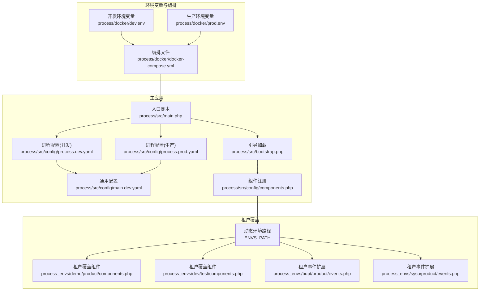
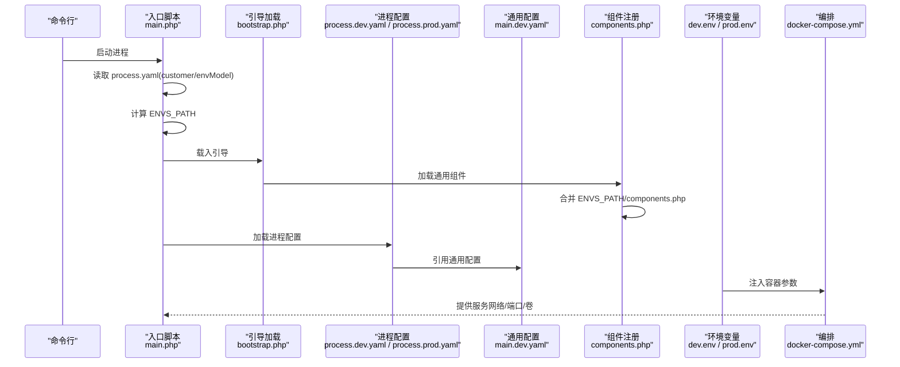
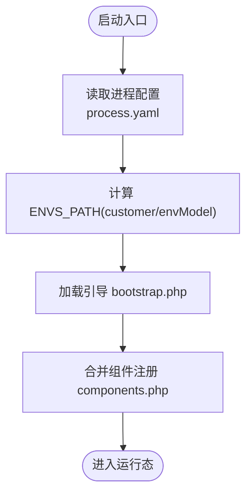
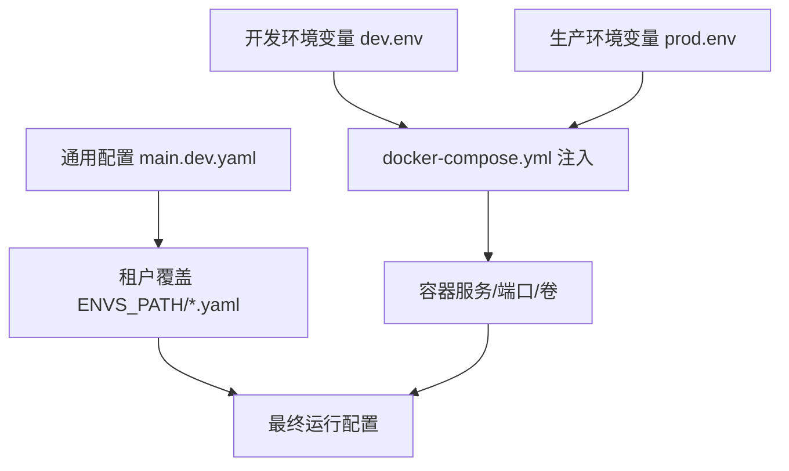
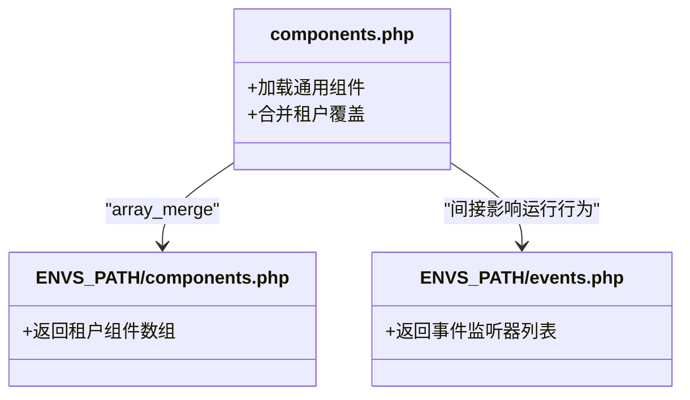
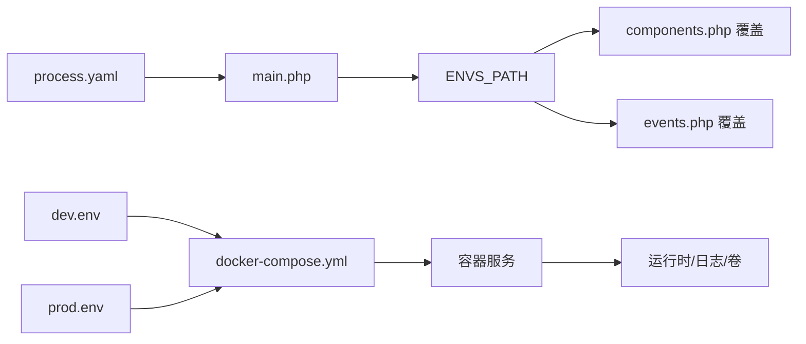

# 租户环境隔离

<cite>
**本文引用的文件**
- [process/docker/dev.env](file://process/docker/dev.env)
- [process/docker/prod.env](file://process/docker/prod.env)
- [process/docker/docker-compose.yml](file://process/docker/docker-compose.yml)
- [process/src/main.php](file://process/src/main.php)
- [process/src/bootstrap.php](file://process/src/bootstrap.php)
- [process/src/config/main.dev.yaml](file://process/src/config/main.dev.yaml)
- [process/src/config/process.dev.yaml](file://process/src/config/process.dev.yaml)
- [process/src/config/process.prod.yaml](file://process/src/config/process.prod.yaml)
- [process/src/config/components.php](file://process/src/config/components.php)
- [process_envs/demo/product/components.php](file://process_envs/demo/product/components.php)
- [process_envs/dev/test/components.php](file://process_envs/dev/test/components.php)
- [process_envs/bupt/product/events.php](file://process_envs/bupt/product/events.php)
- [process_envs/sysu/product/events.php](file://process_envs/sysu/product/events.php)
</cite>

## 目录
1. [引言](#引言)
2. [项目结构](#项目结构)
3. [核心组件](#核心组件)
4. [架构总览](#架构总览)
5. [详细组件分析](#详细组件分析)
6. [依赖关系分析](#依赖关系分析)
7. [性能考虑](#性能考虑)
8. [故障排查指南](#故障排查指南)
9. [结论](#结论)
10. [附录](#附录)

## 引言
本指南围绕“租户环境隔离”的目标，系统梳理开发、测试、生产等多环境的隔离策略与配置管理，重点解释以下方面：
- 环境切换机制与配置文件继承
- 环境特定组件注册与事件扩展
- 测试环境的模拟与假数据策略
- 环境间配置差异管理、部署流水线与发布策略
- 多环境监控、日志分离与故障排查

该工程通过“主配置 + 环境路径 + 租户覆盖”的方式实现租户级隔离，结合 Docker Compose 的环境变量注入与 YAML 配置，形成可复制、可演进的多环境体系。

## 项目结构
工程采用“主应用 + 多租户环境覆盖”的双层结构：
- 主应用层：统一的核心代码、公共配置与组件注册逻辑
- 环境层：按“租户/产品/测试”维度的覆盖配置与事件扩展

图示来源
- [process/src/main.php](file://process/src/main.php#L1-L25)
- [process/src/bootstrap.php](file://process/src/bootstrap.php#L1-L40)
- [process/src/config/components.php](file://process/src/config/components.php#L1-L34)
- [process/docker/dev.env](file://process/docker/dev.env#L1-L50)
- [process/docker/prod.env](file://process/docker/prod.env#L1-L46)
- [process/docker/docker-compose.yml](file://process/docker/docker-compose.yml#L1-L150)
- [process_envs/demo/product/components.php](file://process_envs/demo/product/components.php#L1-L7)
- [process_envs/dev/test/components.php](file://process_envs/dev/test/components.php#L1-L7)
- [process_envs/bupt/product/events.php](file://process_envs/bupt/product/events.php#L1-L12)
- [process_envs/sysu/product/events.php](file://process_envs/sysu/product/events.php#L1-L42)

章节来源
- [process/src/main.php](file://process/src/main.php#L1-L25)
- [process/src/bootstrap.php](file://process/src/bootstrap.php#L1-L40)
- [process/src/config/components.php](file://process/src/config/components.php#L1-L34)
- [process/docker/docker-compose.yml](file://process/docker/docker-compose.yml#L1-L150)

## 核心组件
- 入口与环境切换
  - 入口脚本根据 process.yaml 中 customer 与 envModel 动态拼接 ENVS_PATH，指向对应租户/环境的覆盖目录，实现“按租户、按环境”的差异化加载。
  - 引导加载器对命名空间进行分发：zl、runtime、envs 等，确保租户覆盖文件可被自动包含。

- 配置继承与组件注册
  - 通用配置 main.dev.yaml 提供基础连接、上传、日志、队列等默认值。
  - 进程配置 process.dev.yaml 与 process.prod.yaml 定义运行时进程模型与并发参数；生产环境启用部署进程与 CPU 亲和。
  - 组件注册 components.php 将通用组件与租户覆盖合并，支持按租户扩展自定义组件或覆盖默认组件。

- 环境变量与编排
  - dev.env 与 prod.env 分别定义开发与生产的镜像版本、端口映射、卷挂载与前端目录等，docker-compose.yml 通过环境变量注入容器，实现“同一编排、不同环境”的部署。

章节来源
- [process/src/main.php](file://process/src/main.php#L1-L25)
- [process/src/bootstrap.php](file://process/src/bootstrap.php#L1-L40)
- [process/src/config/main.dev.yaml](file://process/src/config/main.dev.yaml#L1-L97)
- [process/src/config/process.dev.yaml](file://process/src/config/process.dev.yaml#L1-L89)
- [process/src/config/process.prod.yaml](file://process/src/config/process.prod.yaml#L1-L80)
- [process/src/config/components.php](file://process/src/config/components.php#L1-L34)
- [process/docker/dev.env](file://process/docker/dev.env#L1-L50)
- [process/docker/prod.env](file://process/docker/prod.env#L1-L46)
- [process/docker/docker-compose.yml](file://process/docker/docker-compose.yml#L1-L150)

## 架构总览
下图展示从入口到租户覆盖的关键流程，以及环境变量如何驱动容器与配置：

图示来源
- [process/src/main.php](file://process/src/main.php#L1-L25)
- [process/src/bootstrap.php](file://process/src/bootstrap.php#L1-L40)
- [process/src/config/components.php](file://process/src/config/components.php#L1-L34)
- [process/src/config/process.dev.yaml](file://process/src/config/process.dev.yaml#L1-L89)
- [process/src/config/process.prod.yaml](file://process/src/config/process.prod.yaml#L1-L80)
- [process/src/config/main.dev.yaml](file://process/src/config/main.dev.yaml#L1-L97)
- [process/docker/dev.env](file://process/docker/dev.env#L1-L50)
- [process/docker/prod.env](file://process/docker/prod.env#L1-L46)
- [process/docker/docker-compose.yml](file://process/docker/docker-compose.yml#L1-L150)

## 详细组件分析

### 入口与环境切换机制
- 动态环境路径
  - 入口脚本读取进程配置中的 customer 与 envModel，计算 ENVS_PATH，指向对应租户/环境目录，从而实现“按租户、按环境”的差异化加载。
- 命名空间分发
  - 引导加载器对 zl、runtime、envs 等命名空间进行分发，确保租户覆盖文件可被自动包含，避免硬编码路径。

图示来源
- [process/src/main.php](file://process/src/main.php#L1-L25)
- [process/src/bootstrap.php](file://process/src/bootstrap.php#L1-L40)
- [process/src/config/components.php](file://process/src/config/components.php#L1-L34)

章节来源
- [process/src/main.php](file://process/src/main.php#L1-L25)
- [process/src/bootstrap.php](file://process/src/bootstrap.php#L1-L40)

### 配置文件继承与环境差异
- 通用配置 main.dev.yaml
  - 提供数据库、Redis、上传、日志、队列等通用项的默认值，作为所有租户/环境的基线。
- 进程配置 process.dev.yaml / process.prod.yaml
  - 开发环境侧重调试与轻量进程；生产环境启用部署进程、设置进程数量与 CPU 亲和，提升稳定性与吞吐。
- 环境变量 dev.env / prod.env
  - 差异化镜像版本、端口映射、卷挂载与前端目录，docker-compose.yml 通过环境变量注入容器，实现“同一编排、不同环境”。

图示来源
- [process/src/config/main.dev.yaml](file://process/src/config/main.dev.yaml#L1-L97)
- [process/src/config/process.dev.yaml](file://process/src/config/process.dev.yaml#L1-L89)
- [process/src/config/process.prod.yaml](file://process/src/config/process.prod.yaml#L1-L80)
- [process/docker/dev.env](file://process/docker/dev.env#L1-L50)
- [process/docker/prod.env](file://process/docker/prod.env#L1-L46)
- [process/docker/docker-compose.yml](file://process/docker/docker-compose.yml#L1-L150)

章节来源
- [process/src/config/main.dev.yaml](file://process/src/config/main.dev.yaml#L1-L97)
- [process/src/config/process.dev.yaml](file://process/src/config/process.dev.yaml#L1-L89)
- [process/src/config/process.prod.yaml](file://process/src/config/process.prod.yaml#L1-L80)
- [process/docker/dev.env](file://process/docker/dev.env#L1-L50)
- [process/docker/prod.env](file://process/docker/prod.env#L1-L46)
- [process/docker/docker-compose.yml](file://process/docker/docker-compose.yml#L1-L150)

### 环境特定组件注册与事件扩展
- 组件注册合并
  - components.php 优先加载通用组件，再合并 ENVS_PATH/components.php，允许租户按需新增或覆盖组件。
- 事件扩展
  - 各租户可在 ENVS_PATH 下提供 events.php，向全局事件分发器注册监听器，实现租户级功能增强（如登录前置处理、打印定制等）。

图示来源
- [process/src/config/components.php](file://process/src/config/components.php#L1-L34)
- [process_envs/demo/product/components.php](file://process_envs/demo/product/components.php#L1-L7)
- [process_envs/dev/test/components.php](file://process_envs/dev/test/components.php#L1-L7)
- [process_envs/bupt/product/events.php](file://process_envs/bupt/product/events.php#L1-L12)
- [process_envs/sysu/product/events.php](file://process_envs/sysu/product/events.php#L1-L42)

章节来源
- [process/src/config/components.php](file://process/src/config/components.php#L1-L34)
- [process_envs/demo/product/components.php](file://process_envs/demo/product/components.php#L1-L7)
- [process_envs/dev/test/components.php](file://process_envs/dev/test/components.php#L1-L7)
- [process_envs/bupt/product/events.php](file://process_envs/bupt/product/events.php#L1-L12)
- [process_envs/sysu/product/events.php](file://process_envs/sysu/product/events.php#L1-L42)

### 测试环境的模拟数据与自动化测试策略
- 测试环境定位
  - 通过 process.yaml 中的 envModel 指定 test，入口脚本据此计算 ENVS_PATH，加载 dev/test 或具体租户的 test 目录。
- 模拟与假数据
  - 在 ENVS_PATH 下提供 components.php 与 events.php，可注入测试专用组件或事件监听器，用于模拟外部依赖或构造测试场景。
- 自动化测试建议
  - 使用独立的测试配置文件与租户覆盖，避免污染生产数据；通过 docker-compose 的卷挂载与环境变量隔离测试数据卷与日志输出。

章节来源
- [process/src/main.php](file://process/src/main.php#L1-L25)
- [process_envs/dev/test/components.php](file://process_envs/dev/test/components.php#L1-L7)
- [process/docker/docker-compose.yml](file://process/docker/docker-compose.yml#L1-L150)

### 部署流水线与发布策略
- 开发到生产的差异
  - 生产环境启用部署进程与 CPU 亲和，减少热更新风险；开发环境强调快速迭代与调试能力。
- 发布建议
  - 以环境变量与编排文件为边界，通过 CI/CD 注入不同环境变量，实现“同一镜像、不同环境”的无侵入发布。
  - 对上传、缓存、日志等路径进行环境隔离，避免跨环境污染。

章节来源
- [process/src/config/process.prod.yaml](file://process/src/config/process.prod.yaml#L1-L80)
- [process/src/config/process.dev.yaml](file://process/src/config/process.dev.yaml#L1-L89)
- [process/docker/prod.env](file://process/docker/prod.env#L1-L46)
- [process/docker/docker-compose.yml](file://process/docker/docker-compose.yml#L1-L150)

## 依赖关系分析
- 入口脚本依赖进程配置与环境变量，进而决定 ENVS_PATH 与组件注册。
- 组件注册依赖通用配置与租户覆盖，形成“通用基线 + 租户扩展”的组合。
- 编排文件通过环境变量注入容器参数，确保服务网络、端口与卷的环境隔离。

图示来源
- [process/src/main.php](file://process/src/main.php#L1-L25)
- [process/src/config/components.php](file://process/src/config/components.php#L1-L34)
- [process/docker/dev.env](file://process/docker/dev.env#L1-L50)
- [process/docker/prod.env](file://process/docker/prod.env#L1-L46)
- [process/docker/docker-compose.yml](file://process/docker/docker-compose.yml#L1-L150)

章节来源
- [process/src/main.php](file://process/src/main.php#L1-L25)
- [process/src/config/components.php](file://process/src/config/components.php#L1-L34)
- [process/docker/docker-compose.yml](file://process/docker/docker-compose.yml#L1-L150)

## 性能考虑
- 生产环境进程数量与 CPU 亲和
  - 生产配置中增加 HTTP 进程数量并设置亲和，有助于提升并发与资源利用率。
- 日志与存储路径隔离
  - 通过环境变量控制日志与运行时目录，避免跨环境 IO 抖动。
- 上传与对象存储
  - 通用配置中定义上传端点与桶，租户可按需覆盖，避免共享存储带来的性能瓶颈。

章节来源
- [process/src/config/process.prod.yaml](file://process/src/config/process.prod.yaml#L1-L80)
- [process/src/config/main.dev.yaml](file://process/src/config/main.dev.yaml#L1-L97)
- [process/docker/dev.env](file://process/docker/dev.env#L1-L50)
- [process/docker/prod.env](file://process/docker/prod.env#L1-L46)

## 故障排查指南
- 环境路径与命名空间
  - 若租户覆盖未生效，检查 ENVS_PATH 是否正确由 process.yaml 的 customer/envModel 计算；确认引导加载器对 envs 命名空间的包含逻辑。
- 组件注册冲突
  - 若出现组件重复或覆盖异常，检查 components.php 的合并顺序与租户覆盖文件返回的键是否冲突。
- 事件监听器未触发
  - 检查 ENVS_PATH/events.php 返回的事件列表与监听器类是否存在，以及监听器的同步/异步配置是否符合预期。
- 端口与卷冲突
  - 开发与生产端口映射不同，若容器启动失败，优先核对 docker-compose 的端口与卷挂载是否与宿主机冲突。

章节来源
- [process/src/main.php](file://process/src/main.php#L1-L25)
- [process/src/bootstrap.php](file://process/src/bootstrap.php#L1-L40)
- [process/src/config/components.php](file://process/src/config/components.php#L1-L34)
- [process_envs/bupt/product/events.php](file://process_envs/bupt/product/events.php#L1-L12)
- [process_envs/sysu/product/events.php](file://process_envs/sysu/product/events.php#L1-L42)
- [process/docker/docker-compose.yml](file://process/docker/docker-compose.yml#L1-L150)

## 结论
本工程通过“入口动态计算环境路径 + 通用配置 + 租户覆盖”的模式，实现了租户级与环境级的双重隔离。配合 docker-compose 的环境变量注入与进程配置的差异化，能够稳定支撑开发、测试与生产的多环境协同。建议在 CI/CD 中以环境变量为边界，结合租户覆盖文件完成“同构部署、异构配置”的发布策略，并持续完善测试环境的模拟与假数据方案，确保多环境一致性与可验证性。

## 附录
- 环境变量关键项说明
  - REDIS/NGINX/PHP/POSTGRES/CHROME/FRONTEND 等端口与卷挂载在 dev.env 与 prod.env 中分别定义，docker-compose.yml 通过环境变量注入容器。
- 配置文件清单
  - 通用配置：main.dev.yaml
  - 进程配置：process.dev.yaml、process.prod.yaml
  - 组件注册：components.php
  - 环境覆盖：ENVS_PATH 下的 components.php 与 events.php

章节来源
- [process/docker/dev.env](file://process/docker/dev.env#L1-L50)
- [process/docker/prod.env](file://process/docker/prod.env#L1-L46)
- [process/docker/docker-compose.yml](file://process/docker/docker-compose.yml#L1-L150)
- [process/src/config/main.dev.yaml](file://process/src/config/main.dev.yaml#L1-L97)
- [process/src/config/process.dev.yaml](file://process/src/config/process.dev.yaml#L1-L89)
- [process/src/config/process.prod.yaml](file://process/src/config/process.prod.yaml#L1-L80)
- [process/src/config/components.php](file://process/src/config/components.php#L1-L34)
- [process_envs/demo/product/components.php](file://process_envs/demo/product/components.php#L1-L7)
- [process_envs/dev/test/components.php](file://process_envs/dev/test/components.php#L1-L7)
- [process_envs/bupt/product/events.php](file://process_envs/bupt/product/events.php#L1-L12)
- [process_envs/sysu/product/events.php](file://process_envs/sysu/product/events.php#L1-L42)