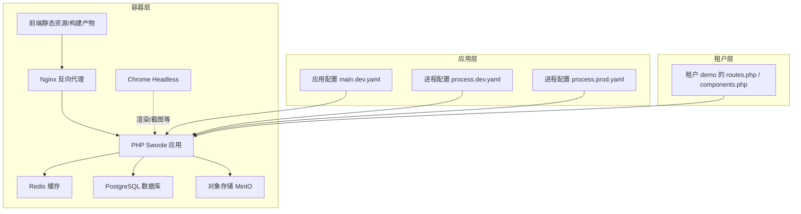
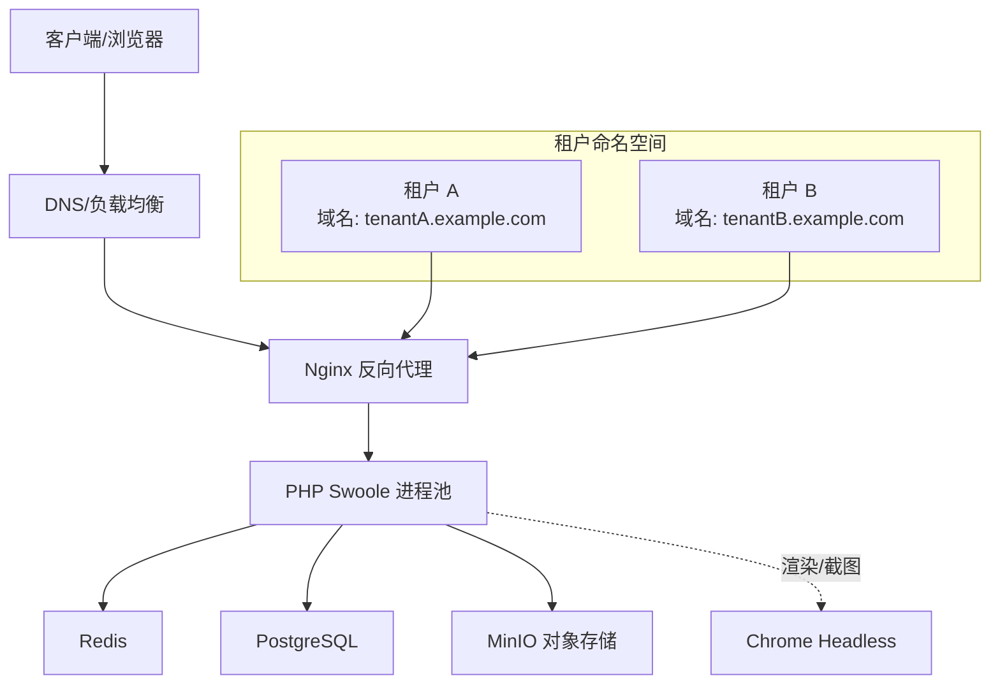
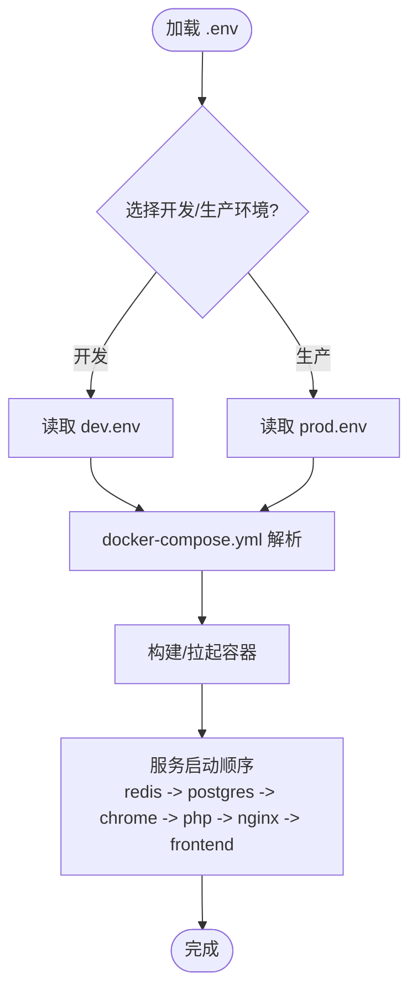
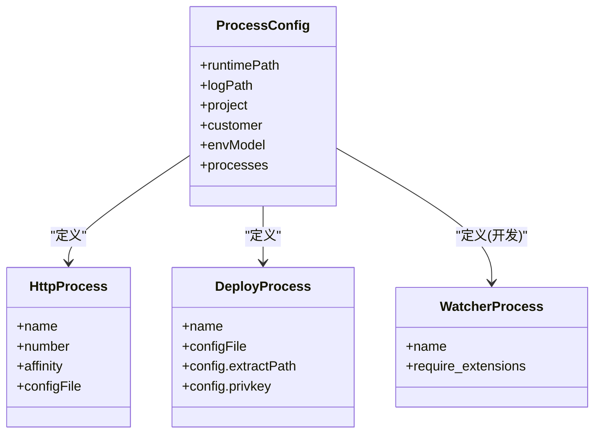
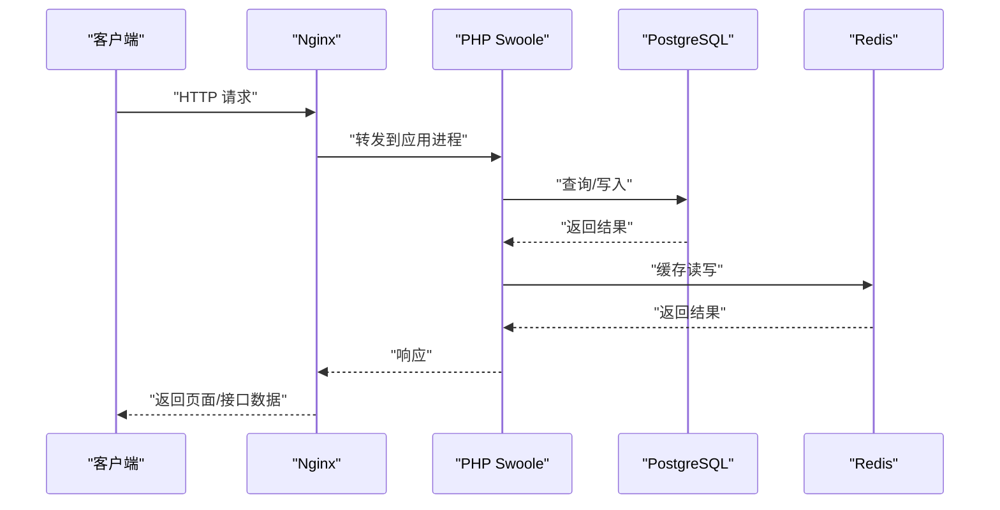
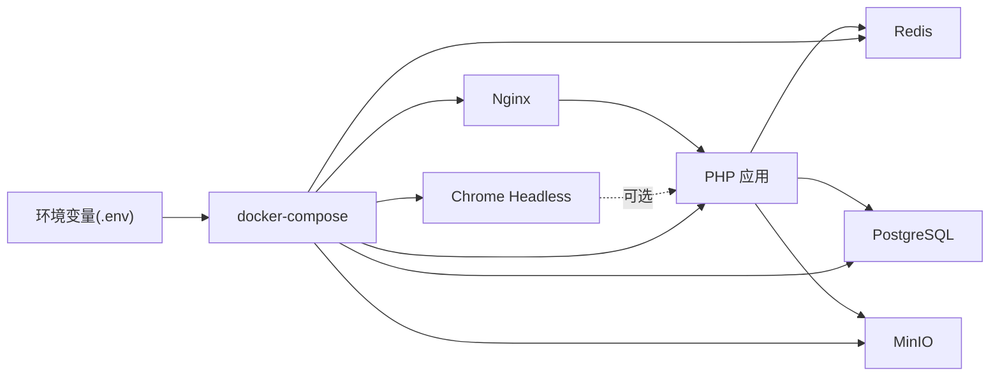

# 租户部署策略

<cite>
**本文引用的文件**
- [docker-compose.yml](file://process/docker/docker-compose.yml)
- [dev.env](file://process/docker/dev.env)
- [prod.env](file://process/docker/prod.env)
- [process.dev.yaml](file://process/src/config/process.dev.yaml)
- [process.prod.yaml](file://process/src/config/process.prod.yaml)
- [main.dev.yaml](file://process/src/config/main.dev.yaml)
- [README.MD](file://process/README.MD)
- [routes.php](file://process_envs/demo/product/routes.php)
- [components.php](file://process_envs/demo/product/components.php)
</cite>

## 目录
1. [引言](#引言)
2. [项目结构](#项目结构)
3. [核心组件](#核心组件)
4. [架构总览](#架构总览)
5. [详细组件分析](#详细组件分析)
6. [依赖关系分析](#依赖关系分析)
7. [性能考虑](#性能考虑)
8. [故障排查指南](#故障排查指南)
9. [结论](#结论)
10. [附录](#附录)

## 引言
本指南面向多租户应用的部署与运维，围绕该仓库的容器化与集群管理实践，系统梳理部署架构、容器编排、环境变量管理、服务发现、租户级资源分配、负载均衡与故障转移、CI/CD 与蓝绿/金丝雀发布、监控与健康检查、自动扩缩容以及最佳实践与性能优化建议。文档同时结合仓库中已有的 Docker Compose、环境变量与进程配置样例，给出可落地的实施路径。

## 项目结构
该项目采用“源码 + 容器编排 + 多租户环境隔离”的分层组织方式：
- process/docker：容器化与环境变量模板，包含开发与生产两套 .env 与 docker-compose 编排。
- process/src：PHP/Swoole 应用源码，包含进程模型配置与运行时配置。
- process_envs：按租户/客户维度的定制化代码与配置目录，体现多租户隔离与扩展能力。
- process/docs/sql：初始化数据库脚本，支撑租户级数据初始化。

图表来源
- [docker-compose.yml](file://process/docker/docker-compose.yml#L1-L150)
- [main.dev.yaml](file://process/src/config/main.dev.yaml#L1-L97)
- [process.dev.yaml](file://process/src/config/process.dev.yaml#L1-L89)
- [process.prod.yaml](file://process/src/config/process.prod.yaml#L1-L80)
- [routes.php](file://process_envs/demo/product/routes.php#L1-L9)
- [components.php](file://process_envs/demo/product/components.php#L1-L7)

章节来源
- [docker-compose.yml](file://process/docker/docker-compose.yml#L1-L150)
- [README.MD](file://process/README.MD#L1-L158)

## 核心组件
- 反向代理与入口：Nginx 提供统一入口、日志挂载与域名别名，便于多租户域名隔离与 TLS 终端。
- 应用进程：PHP 服务基于 Swoole，支持多进程模型与部署进程，开发与生产模式差异体现在进程数量、亲和性与部署能力。
- 数据与缓存：PostgreSQL 提供租户级数据存储；Redis 提供缓存与队列支持。
- 对象存储：MinIO 提供对象存储，配合应用配置实现多租户上传空间隔离。
- Chrome Headless：用于生成 PDF、截图等场景，独立容器便于资源隔离。
- 前端：前端构建产物放置于指定目录，由 Nginx 提供静态访问。

章节来源
- [docker-compose.yml](file://process/docker/docker-compose.yml#L1-L150)
- [process.dev.yaml](file://process/src/config/process.dev.yaml#L1-L89)
- [process.prod.yaml](file://process/src/config/process.prod.yaml#L1-L80)
- [main.dev.yaml](file://process/src/config/main.dev.yaml#L1-L97)

## 架构总览
下图展示多租户部署的典型拓扑：每个租户可拥有独立域名与命名空间，应用通过 Nginx 路由到对应 PHP 进程池；数据库与缓存按租户策略进行隔离；对象存储按租户桶或前缀隔离；Chrome Headless 作为共享渲染服务。

图表来源
- [docker-compose.yml](file://process/docker/docker-compose.yml#L66-L127)
- [main.dev.yaml](file://process/src/config/main.dev.yaml#L1-L97)

## 详细组件分析

### Docker 部署配置与环境变量管理
- 环境变量模板
  - 开发环境：dev.env 定义开发阶段的镜像版本、端口映射、日志与数据目录等。
  - 生产环境：prod.env 定义生产阶段的镜像版本、端口映射、运行目录与部署配置。
- 关键变量说明
  - 容器网络与别名：通过 networks.process 与容器 aliases 实现服务间 DNS 发现。
  - 端口映射：Nginx/Redis 等均配置外网映射，便于调试与运维。
  - 挂载卷：应用源码、公共目录、运行时与日志目录均挂载到容器内，便于热更新与日志采集。
- 服务依赖
  - PHP 依赖 Redis、PostgreSQL、Chrome；Nginx 依赖 PHP；前端容器独立运行并通过端口暴露。

图表来源
- [dev.env](file://process/docker/dev.env#L1-L50)
- [prod.env](file://process/docker/prod.env#L1-L46)
- [docker-compose.yml](file://process/docker/docker-compose.yml#L1-L150)

章节来源
- [dev.env](file://process/docker/dev.env#L1-L50)
- [prod.env](file://process/docker/prod.env#L1-L46)
- [docker-compose.yml](file://process/docker/docker-compose.yml#L1-L150)

### 进程模型与租户级资源分配
- 开发模式
  - 进程数量较少，适合本地调试；支持文件变更监听与工作进程平滑重启。
- 生产模式
  - HTTP 进程数量增加，并设置 CPU 亲和，确保主服务独占核心，提升稳定性与吞吐。
  - 新增部署进程，支持远程提取与部署能力，便于多租户快速上线与回滚。
- 资源分配建议
  - 主服务进程独占核心，其他进程按需分配 CPU 亲和位，避免争抢。
  - 根据租户规模与并发特征，动态调整 HTTP 进程数量与队列消费者数量。

图表来源
- [process.dev.yaml](file://process/src/config/process.dev.yaml#L1-L89)
- [process.prod.yaml](file://process/src/config/process.prod.yaml#L1-L80)

章节来源
- [process.dev.yaml](file://process/src/config/process.dev.yaml#L1-L89)
- [process.prod.yaml](file://process/src/config/process.prod.yaml#L1-L80)

### 应用配置与服务发现
- 应用配置 main.dev.yaml
  - HTTP 监听与端口、数据库连接、Redis 连接、上传存储（MinIO）等均通过配置集中管理。
  - 通过容器别名实现服务发现（如 postgres、redis），无需硬编码 IP。
- 多租户路由与组件
  - routes.php 支持租户自定义路由规则，便于将特定路径映射到租户专属控制器。
  - components.php 支持租户级组件注册与 YAML 配置加载，实现租户差异化功能。

图表来源
- [docker-compose.yml](file://process/docker/docker-compose.yml#L66-L127)
- [main.dev.yaml](file://process/src/config/main.dev.yaml#L1-L97)

章节来源
- [main.dev.yaml](file://process/src/config/main.dev.yaml#L1-L97)
- [routes.php](file://process_envs/demo/product/routes.php#L1-L9)
- [components.php](file://process_envs/demo/product/components.php#L1-L7)

### 负载均衡与故障转移
- 负载均衡
  - 在容器外部通过反向代理（Nginx）或云负载均衡器对 PHP 进程池进行分发。
  - 多租户可通过不同域名或子路径分流至不同进程池或实例。
- 故障转移
  - 应用层：Swoole 进程具备平滑重启能力，结合信号触发实现滚动更新。
  - 容器层：服务依赖链明确，容器重启后自动拉起依赖服务，降低人工干预。

章节来源
- [README.MD](file://process/README.MD#L47-L97)
- [docker-compose.yml](file://process/docker/docker-compose.yml#L1-L150)

### CI/CD 流水线与多租户发布策略
- 基础流水线
  - 构建：拉取代码、安装依赖、构建前端产物、打包镜像。
  - 部署：推送镜像至镜像仓库，拉起新版本容器，健康检查通过后切换流量。
- 蓝绿部署
  - 准备两套 PHP/Nginx 实例，交替承载流量；新版本先部署到备用实例，验证通过后切换。
- 金丝雀发布
  - 逐步将部分流量导入新版本实例，观察指标与日志后再扩大比例直至全量。
- 多租户适配
  - 以租户为粒度进行发布，优先发布测试租户，再逐步推广到生产租户。
  - 结合 routes.php 与 components.php 的租户配置，确保发布前后行为一致。

章节来源
- [process.prod.yaml](file://process/src/config/process.prod.yaml#L1-L80)
- [README.MD](file://process/README.MD#L1-L158)

### 部署监控、健康检查与自动扩缩容
- 健康检查
  - 应用层面：通过进程信号触发平滑重启与状态上报；容器层面：利用 Docker 健康检查探针探测端口与关键路径。
- 监控与日志
  - Nginx/应用日志挂载到宿主机，便于统一采集与分析。
  - 建议引入指标采集（如 Prometheus/Grafana）与分布式追踪，覆盖请求耗时、错误率与资源使用。
- 自动扩缩容
  - 基于 CPU/内存与请求延迟阈值，对 PHP 进程数量进行弹性调整。
  - 对于多租户场景，可按租户维度设置扩缩容策略，避免相互影响。

章节来源
- [docker-compose.yml](file://process/docker/docker-compose.yml#L66-L127)
- [README.MD](file://process/README.MD#L47-L97)

## 依赖关系分析
- 组件耦合
  - PHP 服务强依赖 Redis 与 PostgreSQL；Nginx 依赖 PHP；Chrome Headless 为可选依赖。
- 外部依赖
  - 镜像版本由环境变量控制，便于统一升级与回滚。
- 环境隔离
  - 通过 dev.env/prod.env 与 process.*.yaml 的差异，实现开发与生产的职责分离。

图表来源
- [docker-compose.yml](file://process/docker/docker-compose.yml#L1-L150)
- [dev.env](file://process/docker/dev.env#L1-L50)
- [prod.env](file://process/docker/prod.env#L1-L46)

章节来源
- [docker-compose.yml](file://process/docker/docker-compose.yml#L1-L150)
- [dev.env](file://process/docker/dev.env#L1-L50)
- [prod.env](file://process/docker/prod.env#L1-L46)

## 性能考虑
- 进程与亲和性
  - 生产模式下合理设置 HTTP 进程数量与 CPU 亲和，避免上下文切换开销。
- 存储与缓存
  - 将日志与运行时目录挂载到高性能磁盘；Redis 内存充足并开启持久化策略。
- 网络与 I/O
  - 前端静态资源由 Nginx 直接提供，减少 PHP 层压力；MinIO 与数据库置于内网，降低网络抖动。
- 资源限制
  - 为容器设置 CPU/内存限制，防止租户间资源抢占。

章节来源
- [process.prod.yaml](file://process/src/config/process.prod.yaml#L1-L80)
- [docker-compose.yml](file://process/docker/docker-compose.yml#L1-L150)

## 故障排查指南
- 常见问题定位
  - 容器无法启动：检查 .env 中端口冲突、镜像版本与依赖服务状态。
  - 应用 502/504：确认 PHP 是否监听正确端口、Nginx upstream 配置与容器别名。
  - 数据库连接失败：核对 main.dev.yaml 中数据库连接参数与容器网络。
  - 上传失败：核对 MinIO 端点、密钥与桶名配置。
- 平滑重启
  - 使用信号触发应用进程平滑重启，避免中断请求。
- 日志与调试
  - 查看 Nginx 与应用日志挂载目录；必要时临时开启更详细日志级别。

章节来源
- [README.MD](file://process/README.MD#L47-L158)
- [main.dev.yaml](file://process/src/config/main.dev.yaml#L1-L97)

## 结论
该仓库提供了多租户应用部署的良好基线：清晰的容器化编排、可区分的开发/生产配置、灵活的进程模型与租户级扩展点。结合蓝绿/金丝雀发布、健康检查与自动扩缩容，可在保障稳定性的同时实现快速迭代与租户隔离。后续建议完善监控告警体系与自动化运维工具链，进一步提升交付效率与可观测性。

## 附录
- 多租户目录结构参考
  - 租户代码与配置位于 process_envs/<租户>/<环境>/ 下，便于按租户维度进行定制与发布。
- 前端构建与部署
  - 前端构建产物放置于 dist 目录，按 README 指引复制到服务器同级目录后由 Nginx 提供服务。

章节来源
- [README.MD](file://process/README.MD#L145-L158)
- [routes.php](file://process_envs/demo/product/routes.php#L1-L9)
- [components.php](file://process_envs/demo/product/components.php#L1-L7)