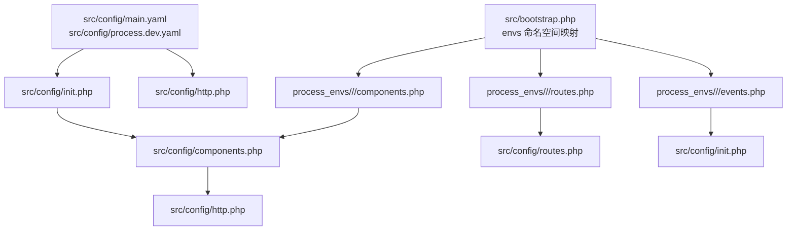
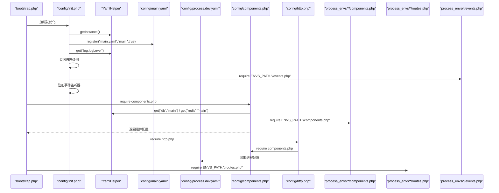
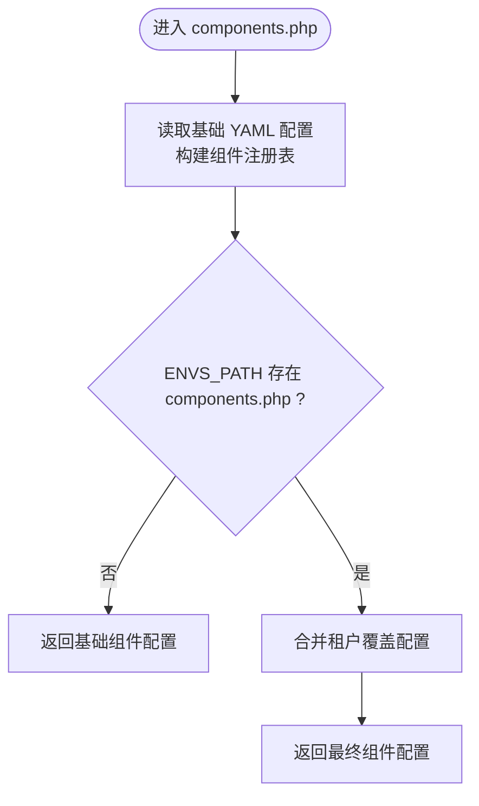
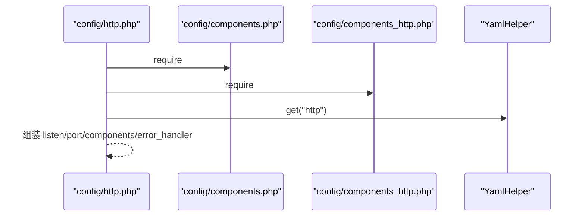
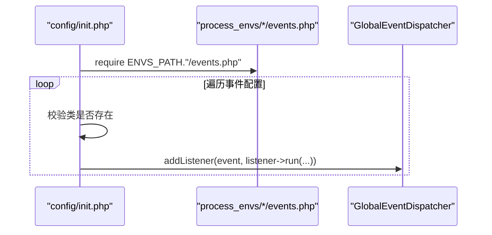
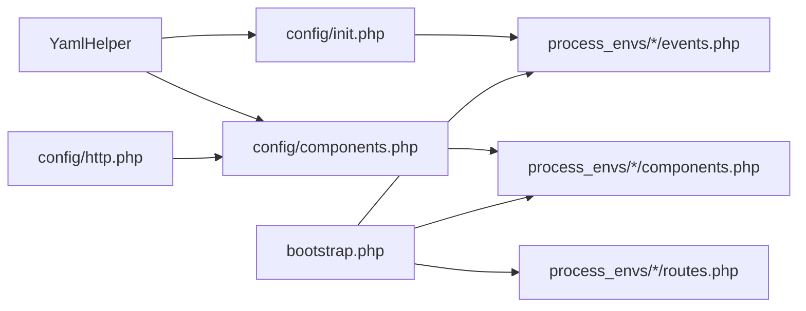

# 租户配置管理

<cite>
**本文引用的文件**
- [process\src\config\components.php](file://process\src\config\components.php)
- [process\src\config\routes.php](file://process\src\config\routes.php)
- [process\src\config\init.php](file://process\src\config\init.php)
- [process\src\helpers\YamlHelper.php](file://process\src\helpers\YamlHelper.php)
- [process\src\bootstrap.php](file://process\src\bootstrap.php)
- [process\src\config\main.dev.yaml](file://process\src\config\main.dev.yaml)
- [process\src\config\process.dev.yaml](file://process\src\config\process.dev.yaml)
- [process\src\config\http.php](file://process\src\config\http.php)
- [process\src\config\modules.php](file://process\src\config\modules.php)
- [process_envs\bit\product\components.php](file://process_envs\bit\product\components.php)
- [process_envs\bistu\product\events.php](file://process_envs\bistu\product\events.php)
- [process_envs\cupl\product\routes.php](file://process_envs\cupl\product\routes.php)
- [process\README.MD](file://process\README.MD)
</cite>

## 目录
1. [引言](#引言)
2. [项目结构](#项目结构)
3. [核心组件](#核心组件)
4. [架构总览](#架构总览)
5. [详细组件分析](#详细组件分析)
6. [依赖关系分析](#依赖关系分析)
7. [性能考虑](#性能考虑)
8. [故障排查指南](#故障排查指南)
9. [结论](#结论)
10. [附录](#附录)

## 引言
本文件围绕多租户环境下的配置管理进行系统化说明，重点覆盖以下方面：
- 配置文件组织结构：components.php、routes.php、events.php 等关键入口与租户特定配置文件的职责与协作方式
- YAML 配置读取机制：YamlHelper 的封装、注册与读取流程
- 环境变量注入与动态配置更新：通过 ENVS_PATH 的动态加载与事件驱动的监听器注册
- 租户特定配置的加载顺序、优先级与覆盖机制：基础配置与租户覆盖的合并策略
- 配置验证、热更新与回滚策略：平滑重启、进程级配置变更与回退建议
- 配置模板、最佳实践与常见错误的解决方案

## 项目结构
多租户配置采用“基础配置 + 租户覆盖”的分层设计：
- 基础配置位于 src/config 下，包含通用 YAML、HTTP 进程配置、组件初始化等
- 租户覆盖位于 process_envs/<custom>/<env>/ 下，按客户与环境模式组织，支持 components.php、routes.php、events.php 等文件的按需覆盖
- 自动加载通过 bootstrap.php 实现，支持 envs 命名空间映射到 ENVS_PATH 的动态加载

图表来源
- [process\src\config\init.php](file://process\src\config\init.php#L1-L48)
- [process\src\config\components.php](file://process\src\config\components.php#L1-L34)
- [process\src\config\http.php](file://process\src\config\http.php#L1-L27)
- [process\src\bootstrap.php](file://process\src\bootstrap.php#L1-L40)
- [process\README.MD](file://process\README.MD#L145-L158)

章节来源
- [process\README.MD](file://process\README.MD#L145-L158)
- [process\src\bootstrap.php](file://process\src\bootstrap.php#L1-L40)

## 核心组件
- YamlHelper 封装：对底层 YAML 读取能力进行轻量封装，供配置模块统一使用
- init.php 初始化：注册基础 YAML、设置日志级别、注册事件监听器、定义项目主机常量
- components.php 组件配置：聚合 db/cache/redis/notice/queue 等组件，并支持 ENVS_PATH 下的租户组件覆盖
- http.php HTTP 进程配置：合并基础组件与 HTTP 专属组件，形成最终 HTTP 进程配置
- routes.php 路由配置：租户可在此定义自定义路由映射
- events.php 事件监听：租户可在此声明事件与监听器，由 init.php 注册到全局事件分发器

章节来源
- [process\src\helpers\YamlHelper.php](file://process\src\helpers\YamlHelper.php#L1-L8)
- [process\src\config\init.php](file://process\src\config\init.php#L1-L48)
- [process\src\config\components.php](file://process\src\config\components.php#L1-L34)
- [process\src\config\http.php](file://process\src\config\http.php#L1-L27)
- [process\src\config\routes.php](file://process\src\config\routes.php#L1-L4)

## 架构总览
下图展示了多租户配置加载的关键路径与交互：

图表来源
- [process\src\bootstrap.php](file://process\src\bootstrap.php#L1-L40)
- [process\src\config\init.php](file://process\src\config\init.php#L1-L48)
- [process\src\config\components.php](file://process\src\config\components.php#L1-L34)
- [process\src\config\http.php](file://process\src\config\http.php#L1-L27)
- [process\src\config\main.dev.yaml](file://process\src\config\main.dev.yaml#L1-L97)
- [process\src\config\process.dev.yaml](file://process\src\config\process.dev.yaml#L1-L89)
- [process_envs\bit\product\components.php](file://process_envs\bit\product\components.php#L1-L7)
- [process_envs\bistu\product\events.php](file://process_envs\bistu\product\events.php#L1-L37)
- [process_envs\cupl\product\routes.php](file://process_envs\cupl\product\routes.php#L1-L11)

## 详细组件分析

### 组件配置加载与覆盖（components.php）
- 基础组件：从 YAML 读取 db、redis 等配置，构造组件注册表
- 租户覆盖：若 ENVS_PATH 下存在 components.php，则与基础配置进行合并，实现租户级组件扩展或覆盖
- 关键点：
  - YAML 注册与读取：通过 YamlHelper 的实例化与 get 方法读取键值
  - 合并策略：array_merge 将租户配置合并至基础配置，后者可被前者覆盖
  - 典型用途：为不同租户注册中心库、邮件库、用户库等专用连接

图表来源
- [process\src\config\components.php](file://process\src\config\components.php#L1-L34)
- [process_envs\bit\product\components.php](file://process_envs\bit\product\components.php#L1-L7)

章节来源
- [process\src\config\components.php](file://process\src\config\components.php#L1-L34)
- [process_envs\bit\product\components.php](file://process_envs\bit\product\components.php#L1-L7)

### HTTP 进程配置（http.php）
- 职责：整合基础组件与 HTTP 专属组件，生成 HTTP 进程配置
- 关键点：
  - 读取 YAML 中的 http.listen 与 http.port
  - 合并 components 与 components_http，形成最终组件集合
  - 提供统一的错误处理器配置

图表来源
- [process\src\config\http.php](file://process\src\config\http.php#L1-L27)

章节来源
- [process\src\config\http.php](file://process\src\config\http.php#L1-L27)

### 路由配置（routes.php 与租户 routes.php）
- 基础 routes.php：当前为空数组，作为占位符
- 租户 routes.php：可在 ENVS_PATH 下提供自定义路由映射，用于快速替换控制器路径
- 使用建议：通过注释示例了解路由占位符与控制器映射方式

章节来源
- [process\src\config\routes.php](file://process\src\config\routes.php#L1-L4)
- [process_envs\cupl\product\routes.php](file://process_envs\cupl\product\routes.php#L1-L11)

### 事件监听配置（events.php 与 init.php）
- init.php：在应用初始化阶段注册事件监听器
  - 读取 ENVS_PATH 下的 events.php
  - 校验监听器类是否存在，实例化后注册到全局事件分发器
- 租户 events.php：声明事件与监听器的映射关系，支持同步/异步两种触发方式
- 关键点：事件常量来自全局事件分发器；监听器类需存在于 envs 命名空间下

图表来源
- [process\src\config\init.php](file://process\src\config\init.php#L1-L48)
- [process_envs\bistu\product\events.php](file://process_envs\bistu\product\events.php#L1-L37)

章节来源
- [process\src\config\init.php](file://process\src\config\init.php#L1-L48)
- [process_envs\bistu\product\events.php](file://process_envs\bistu\product\events.php#L1-L37)

### YAML 配置读取与环境变量注入
- YAML 注册：init.php 在启动时注册 main.yaml，并设置日志级别
- YAML 读取：components.php 与租户 components.php 通过 YamlHelper 读取键值
- 环境变量注入：通过 ENVS_PATH 动态加载租户覆盖文件，实现“按租户覆盖”
- 注意：YAML 文件中未直接出现环境变量注入逻辑，覆盖主要通过文件合并实现

章节来源
- [process\src\config\init.php](file://process\src\config\init.php#L1-L48)
- [process\src\config\components.php](file://process\src\config\components.php#L1-L34)
- [process\src\helpers\YamlHelper.php](file://process\src\helpers\YamlHelper.php#L1-L8)
- [process\README.MD](file://process\README.MD#L145-L158)

### 自动加载与命名空间映射（bootstrap.php）
- 作用：为 envs 命名空间映射到 ENVS_PATH，使租户代码可通过 envs 命名空间访问
- 影响：events.php 中的监听器类需遵循 envs/<custom>/... 的路径约定

章节来源
- [process\src\bootstrap.php](file://process\src\bootstrap.php#L1-L40)

## 依赖关系分析
- 组件耦合
  - components.php 依赖 YamlHelper 与 ENVS_PATH 下的租户覆盖
  - http.php 依赖 components.php 与 components_http.php，并读取 YAML 中的 http 配置
  - init.php 依赖 YamlHelper、全局事件分发器与 ENVS_PATH 下的 events.php
- 外部依赖
  - YAML 解析能力由 YamlHelper 提供
  - 进程与运行时配置由 process.dev.yaml 管理

图表来源
- [process\src\helpers\YamlHelper.php](file://process\src\helpers\YamlHelper.php#L1-L8)
- [process\src\config\init.php](file://process\src\config\init.php#L1-L48)
- [process\src\config\components.php](file://process\src\config\components.php#L1-L34)
- [process\src\config\http.php](file://process\src\config\http.php#L1-L27)
- [process\src\bootstrap.php](file://process\src\bootstrap.php#L1-L40)
- [process_envs\bit\product\components.php](file://process_envs\bit\product\components.php#L1-L7)
- [process_envs\cupl\product\routes.php](file://process_envs\cupl\product\routes.php#L1-L11)
- [process_envs\bistu\product\events.php](file://process_envs\bistu\product\events.php#L1-L37)

章节来源
- [process\src\config\init.php](file://process\src\config\init.php#L1-L48)
- [process\src\config\components.php](file://process\src\config\components.php#L1-L34)
- [process\src\config\http.php](file://process\src\config\http.php#L1-L27)
- [process\src\bootstrap.php](file://process\src\bootstrap.php#L1-L40)

## 性能考虑
- YAML 读取与合并
  - 建议将频繁变更的配置项集中在租户覆盖文件，避免频繁重启主进程
  - 对于大量组件的合并，注意 array_merge 的开销，必要时拆分配置
- 事件监听
  - 监听器类应尽量轻量，避免阻塞事件循环
- 进程与配置
  - process.dev.yaml 中的进程配置修改需要重启对应进程
  - 业务配置文件（如 http.php）可在不重启主进程的情况下生效

## 故障排查指南
- 事件类不存在
  - 现象：初始化阶段输出事件类不存在提示
  - 排查：确认 events.php 中的监听器类是否存在于 envs 命名空间下，且路径正确
- 组件类未找到或配置缺失
  - 现象：组件注册失败或运行时报错
  - 排查：检查 ENVS_PATH 下的 components.php 是否正确注册 YAML 键值，确保类名与命名空间正确
- 路由映射无效
  - 现象：自定义路由未生效
  - 排查：确认 routes.php 返回数组中包含正确的路由规则与控制器映射
- 日志级别异常
  - 现象：日志输出不符合预期
  - 排查：检查 main.yaml 中的日志级别配置，以及 init.php 是否成功读取并设置

章节来源
- [process\src\config\init.php](file://process\src\config\init.php#L1-L48)
- [process_envs\bistu\product\events.php](file://process_envs\bistu\product\events.php#L1-L37)

## 结论
该多租户配置体系通过“基础配置 + 租户覆盖”的分层设计，结合 YamlHelper 的统一读取与 bootstrap.php 的动态加载，实现了灵活、可维护的配置管理。组件、路由与事件三大配置入口分别承担各自职责，配合进程配置与平滑重启机制，满足生产环境的稳定性与可演进性要求。

## 附录

### 配置加载顺序与优先级
- 初始化阶段
  - 注册 main.yaml
  - 设置日志级别
  - 注册事件监听器（来自 ENVS_PATH 下的 events.php）
- 组件阶段
  - 读取基础 YAML，构建组件注册表
  - 合并 ENVS_PATH 下的 components.php，实现租户覆盖
- HTTP 进程阶段
  - 合并基础组件与 HTTP 专属组件
  - 读取 YAML 中的 http.listen 与 http.port

章节来源
- [process\src\config\init.php](file://process\src\config\init.php#L1-L48)
- [process\src\config\components.php](file://process\src\config\components.php#L1-L34)
- [process\src\config\http.php](file://process\src\config\http.php#L1-L27)

### 动态配置更新与回滚策略
- 动态更新
  - 业务配置文件（如 http.php）修改后无需重启主进程
  - 进程配置（process.dev.yaml）修改需重启对应进程
- 回滚策略
  - 保留上一版本的 ENVS_PATH 覆盖文件，必要时回退
  - 对于进程配置，建议在变更前记录当前配置，以便快速恢复

章节来源
- [process\README.MD](file://process\README.MD#L53-L76)
- [process\src\config\process.dev.yaml](file://process\src\config\process.dev.yaml#L1-L89)

### 配置模板与最佳实践
- 配置模板
  - 基础 YAML：参考 main.dev.yaml 的结构，按需新增键值
  - 租户组件覆盖：参考 bit/product/components.php 的写法，先注册 main.yaml 再读取键值
  - 租户事件监听：参考 bistu/product/events.php 的结构，声明事件与监听器映射
  - 租户路由：参考 cupl/product/routes.php 的注释示例，定义路由占位符与控制器映射
- 最佳实践
  - 将易变配置放入 ENVS_PATH 覆盖文件，减少主进程重启
  - 事件监听器类保持无副作用与幂等性
  - 组件类名与命名空间保持一致，避免拼写错误
  - 对关键配置进行注释说明，便于后续维护

章节来源
- [process\src\config\main.dev.yaml](file://process\src\config\main.dev.yaml#L1-L97)
- [process_envs\bit\product\components.php](file://process_envs\bit\product\components.php#L1-L7)
- [process_envs\bistu\product\events.php](file://process_envs\bistu\product\events.php#L1-L37)
- [process_envs\cupl\product\routes.php](file://process_envs\cupl\product\routes.php#L1-L11)