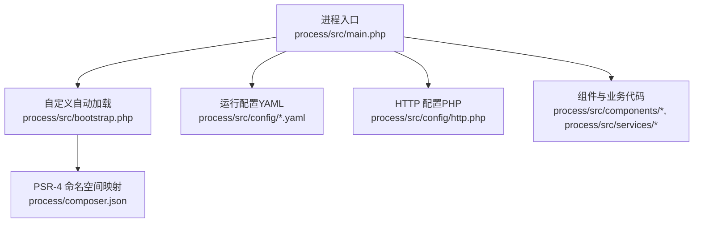
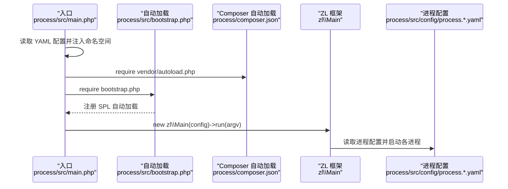
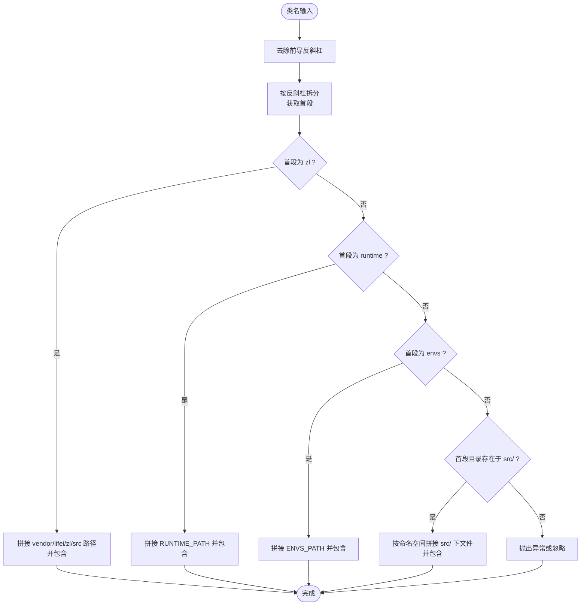
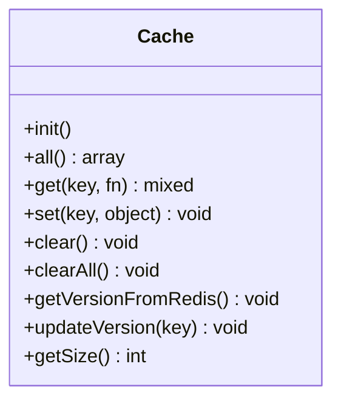
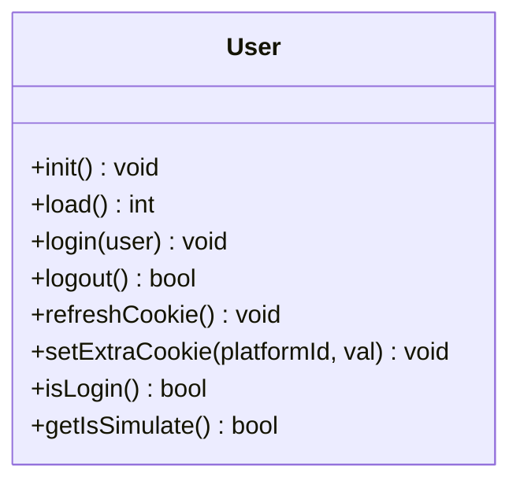
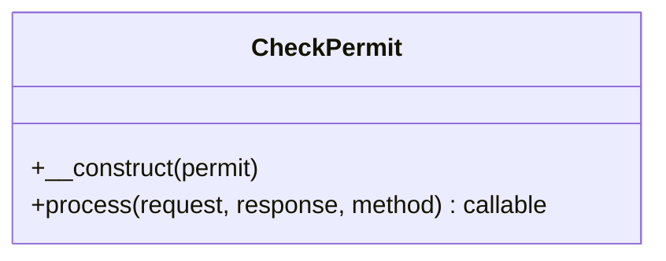
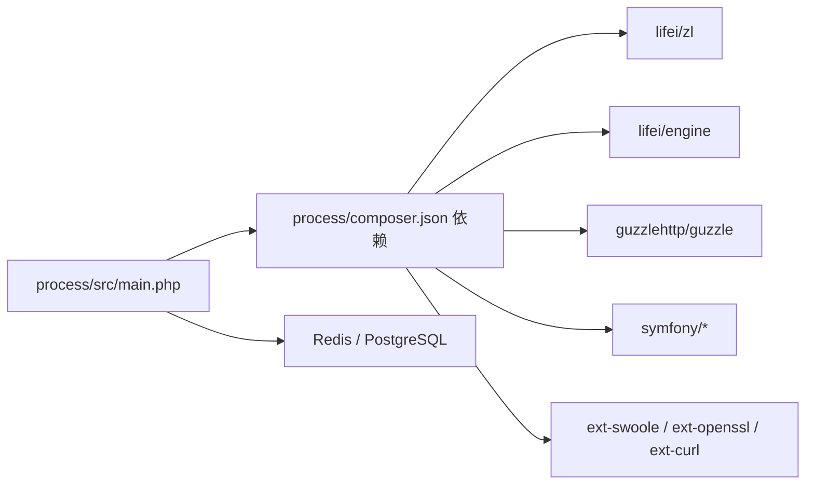

# 代码规范

<cite>
**本文引用的文件**
- [process\composer.json](file://process\composer.json)
- [process\src\bootstrap.php](file://process\src\bootstrap.php)
- [process\src\main.php](file://process\src\main.php)
- [process\src\config\process.dev.yaml](file://process\src\config\process.dev.yaml)
- [process\src\config\process.prod.yaml](file://process\src\config\process.prod.yaml)
- [process\src\config\http.php](file://process\src\config\http.php)
- [process\src\components\Cache.php](file://process\src\components\Cache.php)
- [process\src\components\User.php](file://process\src\components\User.php)
- [process\src\annotations\CheckPermit.php](file://process\src\annotations\CheckPermit.php)
- [process\src\config\api.php](file://process\src\config\api.php)
- [process\src\commands\Demo.php](file://process\src\commands\Demo.php)
- [process\src\helpers\UtilityHelper.php](file://process\src\helpers\UtilityHelper.php)
</cite>

## 目录
1. [引言](#引言)
2. [项目结构](#项目结构)
3. [核心组件](#核心组件)
4. [架构总览](#架构总览)
5. [详细组件分析](#详细组件分析)
6. [依赖分析](#依赖分析)
7. [性能考虑](#性能考虑)
8. [故障排查指南](#故障排查指南)
9. [结论](#结论)
10. [附录](#附录)

## 引言
本文件为 htdNew 项目的代码规范文档，面向 PHP 开发者，聚焦以下目标：
- 统一 PHP 代码编写标准、命名约定与文件组织规则
- 解释自动加载机制与类文件命名规范
- 明确代码注释标准、函数定义规范与变量命名约定
- 提供具体示例路径，展示正确的编码方式
- 说明与 ZL 框架集成的代码规范要求
- 给出 IDE 配置建议与代码格式化工具推荐

## 项目结构
htdNew 采用基于功能域的模块化组织方式，核心目录与职责概览如下：
- process/src：应用源码根目录
  - annotations：注解类
  - commands：命令行脚本与任务入口
  - components：通用组件（如缓存、用户、错误处理等）
  - config：运行配置（YAML/PHP）
  - helpers：通用工具与辅助方法
  - http：HTTP 控制器与路由分层
  - lib：第三方封装与工具库
  - models：数据模型
  - services：业务服务层
  - response：响应模型
  - bootstrap.php：自定义自动加载入口
  - main.php：进程入口与运行配置注入
- process/composer.json：Composer 自动加载与依赖声明
- process_envs：按客户/环境划分的业务实现与任务

**图表来源**
- [process\src\main.php](file://process\src\main.php#L1-L25)
- [process\src\bootstrap.php](file://process\src\bootstrap.php#L1-L40)
- [process\composer.json](file://process\composer.json#L1-L70)
- [process\src\config\process.dev.yaml](file://process\src\config\process.dev.yaml#L1-L89)
- [process\src\config\process.prod.yaml](file://process\src\config\process.prod.yaml#L1-L80)
- [process\src\config\http.php](file://process\src\config\http.php#L1-L27)

**章节来源**
- [process\src\main.php](file://process\src\main.php#L1-L25)
- [process\src\bootstrap.php](file://process\src\bootstrap.php#L1-L40)
- [process\composer.json](file://process\composer.json#L1-L70)
- [process\src\config\process.dev.yaml](file://process\src\config\process.dev.yaml#L1-L89)
- [process\src\config\process.prod.yaml](file://process\src\config\process.prod.yaml#L1-L80)
- [process\src\config\http.php](file://process\src\config\http.php#L1-L27)

## 核心组件
- 自动加载与命名空间
  - Composer PSR-4：将命名空间 osSP 映射到 src/ 目录
  - 自定义自动加载：优先处理 zl、runtime、envs 命名空间；其余按首段目录动态加载
- 进程与配置
  - main.php 注入运行配置（YAML），设置 Swoole Hook，加载 vendor autoload，并调用 zl\Main 运行
  - process.*.yaml 定义进程类型、数量、CPU 亲和、业务配置文件等
  - http.php 合并全局与 HTTP 组件配置，并注册错误处理器
- 组件
  - components\Cache：基于 Redis 的对象缓存与定时清理
  - components\User：用户登录态管理、Cookie 策略、匿名访问控制
- 注解
  - annotations\CheckPermit：基于属性的权限拦截器
- 工具
  - helpers\UtilityHelper：密码哈希、设备识别、并发执行、IP/CIDR 校验、Excel 列名转换等

**章节来源**
- [process\composer.json](file://process\composer.json#L1-L70)
- [process\src\bootstrap.php](file://process\src\bootstrap.php#L1-L40)
- [process\src\main.php](file://process\src\main.php#L1-L25)
- [process\src\config\process.dev.yaml](file://process\src\config\process.dev.yaml#L1-L89)
- [process\src\config\process.prod.yaml](file://process\src\config\process.prod.yaml#L1-L80)
- [process\src\config\http.php](file://process\src\config\http.php#L1-L27)
- [process\src\components\Cache.php](file://process\src\components\Cache.php#L1-L136)
- [process\src\components\User.php](file://process\src\components\User.php#L1-L429)
- [process\src\annotations\CheckPermit.php](file://process\src\annotations\CheckPermit.php#L1-L27)
- [process\src\helpers\UtilityHelper.php](file://process\src\helpers\UtilityHelper.php#L1-L596)

## 架构总览
htdNew 基于 ZL 框架与 Swoole 协程运行时，通过 main.php 初始化运行参数与 Hook，随后由 zl\Main 启动各进程（HTTP、队列、计划任务等）。自定义自动加载负责解析命名空间与文件路径，确保组件与业务代码可按需加载。

**图表来源**
- [process\src\main.php](file://process\src\main.php#L1-L25)
- [process\src\bootstrap.php](file://process\src\bootstrap.php#L1-L40)
- [process\composer.json](file://process\composer.json#L1-L70)
- [process\src\config\process.dev.yaml](file://process\src\config\process.dev.yaml#L1-L89)
- [process\src\config\process.prod.yaml](file://process\src\config\process.prod.yaml#L1-L80)

## 详细组件分析

### 自动加载与命名规范
- 命名空间与目录映射
  - Composer PSR-4：ossp\ → src/
  - 自定义加载：支持 zl、runtime、envs 前缀；其余按首段目录动态加载
- 类文件命名
  - 类文件名与类名一致，使用 PascalCase
  - 文件位于对应命名空间目录下
- 加载顺序
  - 优先匹配自定义加载规则，再回落到 Composer PSR-4

**图表来源**
- [process\src\bootstrap.php](file://process\src\bootstrap.php#L1-L40)
- [process\composer.json](file://process\composer.json#L1-L70)

**章节来源**
- [process\src\bootstrap.php](file://process\src\bootstrap.php#L1-L40)
- [process\composer.json](file://process\composer.json#L1-L70)

### 进程与配置规范
- 进程类型
  - main、watcher、http、queue、crontab、deploy、mqtt（可选）
- 进程数量与 CPU 亲和
  - 通过 YAML 配置 number 与 affinity 控制
- 业务配置文件
  - 各进程通过 configFile 指向 config/*.php，热更新无需重启主进程
- 错误处理
  - http.php 中注册统一错误处理器类

**章节来源**
- [process\src\config\process.dev.yaml](file://process\src\config\process.dev.yaml#L1-L89)
- [process\src\config\process.prod.yaml](file://process\src\config\process.prod.yaml#L1-L80)
- [process\src\config\http.php](file://process\src\config\http.php#L1-L27)

### 组件：Cache（对象缓存）
- 设计要点
  - 单例模式，基于内存数组与 Redis 维护版本一致性
  - 定时从 Redis 同步版本并清理过期对象
  - 通过共享内存缓存版本快照，降低 Redis 压力
- 关键方法
  - get/set/clear/clearAll/updateVersion/all/getSize
- 性能建议
  - 合理设置清理周期与缓存过期策略
  - 使用共享内存减少跨进程同步开销

**图表来源**
- [process\src\components\Cache.php](file://process\src\components\Cache.php#L1-L136)

**章节来源**
- [process\src\components\Cache.php](file://process\src\components\Cache.php#L1-L136)

### 组件：User（用户登录态）
- 设计要点
  - 协程单例，支持真实用户与模拟用户
  - Cookie 前缀统一，支持 SameSite/Secure 策略
  - 支持匿名访问白名单 URI
  - 支持第三方平台票据校验与退出
- 关键方法
  - init/load/login/logout/refreshCookie/setExtraCookie/isLogin
- 安全建议
  - 严格校验 UA 与盐值，防止 Cookie 伪造
  - 区分不同设备类型（APP/PC/Mobile/WeChat 等）

**图表来源**
- [process\src\components\User.php](file://process\src\components\User.php#L1-L429)

**章节来源**
- [process\src\components\User.php](file://process\src\components\User.php#L1-L429)

### 注解：CheckPermit（权限拦截）
- 设计要点
  - 基于 PHP 8 属性的前置拦截器
  - 从当前用户菜单权限中校验所需权限
- 使用建议
  - 在控制器方法上标注 #[CheckPermit(permit: "...")] 实现权限守卫

**图表来源**
- [process\src\annotations\CheckPermit.php](file://process\src\annotations\CheckPermit.php#L1-L27)

**章节来源**
- [process\src\annotations\CheckPermit.php](file://process\src\annotations\CheckPermit.php#L1-L27)

### 工具：UtilityHelper（通用工具）
- 功能概览
  - 密码哈希与校验、哈希校验
  - 设备识别（MiniApp/WeChat/WeCom/APP/Mobile/PC）
  - 手机号/邮箱/身份证正则校验
  - 树形结构构建、密码强度校验
  - 字符掩码、时间格式化、微秒时间戳
  - PostgreSQL 字段元数据获取、URL 白名单校验
  - 并发执行（协程+屏障）、本地 IPv4 获取
  - Excel 列名转换、中文日期、加解密、Oracle 数据清洗
  - IP/CIDR 校验、数组分组
- 性能与并发
  - parallel 使用 Channel 与 Barrier 控制并发度与异常回调

**章节来源**
- [process\src\helpers\UtilityHelper.php](file://process\src\helpers\UtilityHelper.php#L1-L596)

### 示例：命令行脚本（Demo）
- 示例路径
  - commands/Demo.php：演示数据库连接、异常捕获与任务执行
- 编码要点
  - 使用 try/catch 捕获业务异常与用户异常
  - 通过 services/* 执行具体任务
  - 返回统一响应模型（如 Success）

**章节来源**
- [process\src\commands\Demo.php](file://process\src\commands\Demo.php#L1-L100)

### API 文档配置（api.php）
- 用途
  - 定义开放接口分组、名称、值与环境限制
- 规范
  - 接口值使用点分层级命名，便于路由与鉴权
  - envs 字段用于按学校/环境过滤接口

**章节来源**
- [process\src\config\api.php](file://process\src\config\api.php#L1-L913)

## 依赖分析
- Composer 依赖
  - lifei/zl 与 lifei/engine：ZL 框架与引擎
  - Guzzle/Symfony 等 HTTP/工具库
  - Swoole 相关扩展与协程支持
- 运行时依赖
  - Swoole Runtime Hook（启用协程）
  - Redis（缓存与登录盐值存储）
  - PostgreSQL（元数据查询）

**图表来源**
- [process\composer.json](file://process\composer.json#L1-L70)
- [process\src\main.php](file://process\src\main.php#L1-L25)

**章节来源**
- [process\composer.json](file://process\composer.json#L1-L70)
- [process\src\main.php](file://process\src\main.php#L1-L25)

## 性能考虑
- 协程与并发
  - 使用 UtilityHelper::parallel 控制并发度，避免资源争用
  - 合理设置 Swoole Hook，提升 I/O 密集型性能
- 缓存策略
  - Cache 组件结合 Redis 与共享内存，降低重复计算与远程访问
  - 定时清理与版本同步，避免脏数据
- I/O 优化
  - 使用 Guzzle Swoole Handler，提升 HTTP 请求吞吐
  - 对外部资源（Oracle LOB）进行流式读取与类型转换

[本节为通用指导，无需列出具体文件来源]

## 故障排查指南
- 自动加载失败
  - 检查命名空间与目录是否一致
  - 确认自定义加载规则未覆盖 PSR-4 映射
- 权限拦截异常
  - 确认用户菜单权限是否正确注入
  - 检查注解使用位置与 permit 值
- 用户登录问题
  - 校验 Cookie 前缀、SameSite/Secure 配置
  - 检查 UA 与盐值匹配，Redis 登录盐值是否存在
- 并发执行异常
  - 查看 failedCallback 回传的异常栈
  - 调整并发度与资源上限

**章节来源**
- [process\src\bootstrap.php](file://process\src\bootstrap.php#L1-L40)
- [process\src\annotations\CheckPermit.php](file://process\src\annotations\CheckPermit.php#L1-L27)
- [process\src\components\User.php](file://process\src\components\User.php#L1-L429)
- [process\src\helpers\UtilityHelper.php](file://process\src\helpers\UtilityHelper.php#L350-L420)

## 结论
本规范明确了 htdNew 项目的 PHP 编码标准、命名与文件组织、自动加载机制、ZL 框架集成方式与组件使用规范。遵循上述约定有助于提升代码一致性、可维护性与运行效率。

[本节为总结性内容，无需列出具体文件来源]

## 附录

### 代码注释标准
- 类与方法
  - 使用 PHPDoc 注释描述用途、参数、返回值与异常
  - 对复杂算法与边界条件补充说明
- 变量
  - 使用语义化命名，必要时在注释中解释变量含义与取值范围
- 常量
  - 使用全大写下划线命名，集中定义于常量类或配置中

[本节为通用指导，无需列出具体文件来源]

### 函数定义规范
- 参数与返回值
  - 明确类型声明与默认值
  - 对可能抛出异常的方法，在注释中标注异常类型
- 异常处理
  - 使用 try/catch 捕获业务异常与用户异常
  - 将异常转换为统一响应模型

**章节来源**
- [process\src\commands\Demo.php](file://process\src\commands\Demo.php#L1-L100)

### 变量命名约定
- 类名：PascalCase
- 方法/属性：camelCase
- 常量：UPPER_CASE 或 PascalCase（静态常量）
- 文件名：与类名一致，PascalCase

**章节来源**
- [process\src\components\Cache.php](file://process\src\components\Cache.php#L1-L136)
- [process\src\components\User.php](file://process\src\components\User.php#L1-L429)
- [process\src\annotations\CheckPermit.php](file://process\src\annotations\CheckPermit.php#L1-L27)

### IDE 配置与代码格式化建议
- PHP 版本与扩展
  - PHP 8.x，启用 Swoole、OpenSSL、cURL、PCRE 扩展
- IDE 插件
  - PHP Intelephense（或 PHPStorm）启用代码补全与符号导航
  - PHP CS Fixer 或 PHP_CodeSniffer（PSR-12）
- 格式化工具
  - PHP-CS-Fixer：配置 rules 为 psr12
  - Pre-commit 钩子：在提交前自动格式化与静态检查
- 调试与协程
  - 使用 swoole/ide-helper 生成 IDE 辅助文件
  - 配置断点与日志级别，定位协程上下文问题

[本节为通用指导，无需列出具体文件来源]