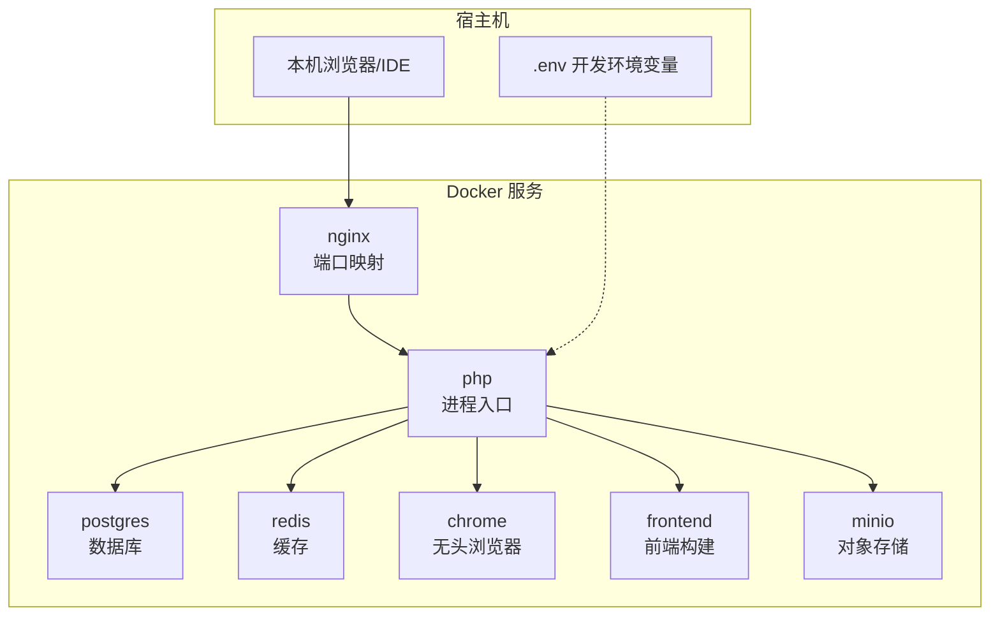
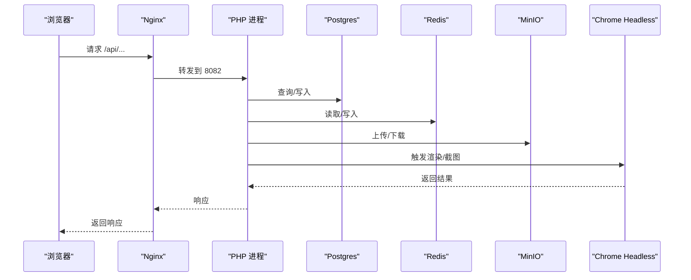
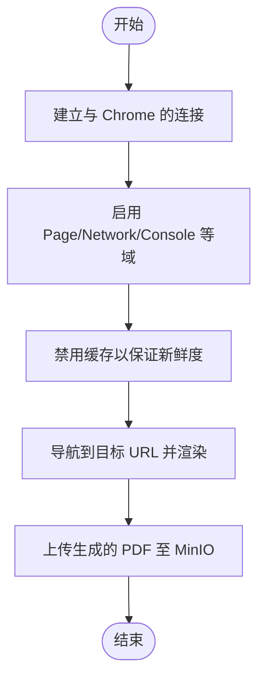
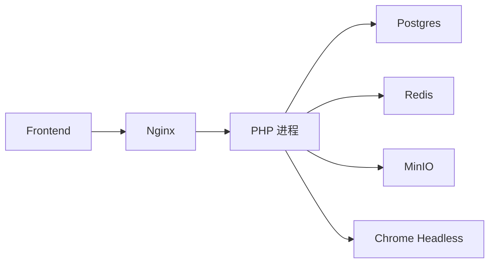

# 开发工具

<cite>
**本文引用的文件**
- [process/README.MD](file://process/README.MD)
- [process/docker/docker-compose.yml](file://process/docker/docker-compose.yml)
- [process/docker/dev.env](file://process/docker/dev.env)
- [process/src/config/main.dev.yaml](file://process/src/config/main.dev.yaml)
- [process/src/config/process.dev.yaml](file://process/src/config/process.dev.yaml)
- [process/composer.json](file://process/composer.json)
- [process/composer.lock](file://process/composer.lock)
- [process/src/bootstrap.php](file://process/src/bootstrap.php)
- [process/docs/sql/database.sql](file://process/docs/sql/database.sql)
- [process/src/helpers/PdfHelper.php](file://process/src/helpers/PdfHelper.php)
- [process/src/http/site/App.php](file://process/src/http/site/App.php)
- [process/src/http/open/Process.php](file://process/src/http/open/Process.php)
- [process_envs/xidian/product/Roma.php](file://process_envs/xidian/product/Roma.php)
- [process_envs/seu/product/listeners/DataSourceFrequency.php](file://process_envs/seu/product/listeners/DataSourceFrequency.php)
- [process_envs\upc\product\listeners\DataSourceFrequency.php](file://process_envs\upc\product\listeners\DataSourceFrequency.php)
- [process_envs\cufe\product\thirdparty\WebVpn.php](file://process_envs\cufe\product\thirdparty\WebVpn.php)
- [process_envs\zhongxi\product\commands\Demo.php](file://process_envs\zhongxi\product\commands\Demo.php)
- [process_envs\dlut\product\commands\Demo.php](file://process_envs\dlut\product\commands\Demo.php)
- [process_envs\buaa\product\task\QysSignCommonV1010.php](file://process_envs\buaa\product\task\QysSignCommonV1010.php)
</cite>

## 目录
1. [简介](#简介)
2. [项目结构](#项目结构)
3. [核心组件](#核心组件)
4. [架构总览](#架构总览)
5. [详细组件分析](#详细组件分析)
6. [依赖分析](#依赖分析)
7. [性能考量](#性能考量)
8. [故障排查指南](#故障排查指南)
9. [结论](#结论)
10. [附录](#附录)

## 简介
本文件面向 htdNew 项目的开发团队，提供一套完整的开发工具与工作流指南，覆盖 IDE 配置建议、Docker 开发环境、Composer 包管理、Git 工作流、调试与性能分析、以及代理与网络调试工具推荐。内容基于仓库现有配置与源码进行提炼，确保可操作、可落地。

## 项目结构
- 核心目录
  - process/docker：Docker 编排与环境变量
  - process/src：PHP 源码与配置
  - process/docs/sql：数据库初始化脚本
  - process_envs：按客户/环境隔离的业务扩展代码
- 关键入口
  - Docker Compose 服务：nginx、php、postgres、redis、chrome、frontend、minio
  - PHP 入口：通过 PHP 进程加载 src 目录并启动服务
  - 配置：main.dev.yaml、process.dev.yaml 提供运行期配置

图表来源
- [process/docker/docker-compose.yml](file://process/docker/docker-compose.yml#L1-L150)
- [process/docker/dev.env](file://process/docker/dev.env#L1-L50)

章节来源
- [process/README.MD](file://process/README.MD#L1-L158)
- [process/docker/docker-compose.yml](file://process/docker/docker-compose.yml#L1-L150)
- [process/docker/dev.env](file://process/docker/dev.env#L1-L50)

## 核心组件
- PHP 应用与进程模型
  - 进程配置由 process.dev.yaml 管理，包含主进程、HTTP 进程、队列进程、计划任务进程等
  - PHP 进程通过入口脚本加载 src 目录，并依赖 composer 自动加载与 vendor
- 数据库与缓存
  - Postgres 作为主数据库，初始化脚本位于 docs/sql/database.sql
  - Redis 作为缓存与队列中间件
- 反向代理与前端
  - Nginx 作为反向代理，暴露静态资源与路由转发
  - 前端服务通过 PM2 管理，端口映射到 3000
- 浏览器自动化
  - Chrome Headless 服务用于 PDF 渲染与截图等场景
- 对象存储
  - MinIO 作为对象存储服务，提供 S3 兼容接口

章节来源
- [process/src/config/process.dev.yaml](file://process/src/config/process.dev.yaml#L1-L89)
- [process/src/config/main.dev.yaml](file://process/src/config/main.dev.yaml#L1-L97)
- [process/docs/sql/database.sql](file://process/docs/sql/database.sql#L1-L800)
- [process/docker/docker-compose.yml](file://process/docker/docker-compose.yml#L1-L150)

## 架构总览
下图展示开发环境典型请求链路：浏览器经 Nginx 到达 PHP 进程，PHP 进程访问 Postgres、Redis、MinIO、Chrome 等服务。

图表来源
- [process/docker/docker-compose.yml](file://process/docker/docker-compose.yml#L36-L127)
- [process/src/config/main.dev.yaml](file://process/src/config/main.dev.yaml#L1-L97)

## 详细组件分析

### Docker 开发环境
- 启动步骤
  - 复制开发配置与环境变量文件，构建并启动容器
  - 本地 hosts 绑定开发域名，访问示例接口验证
- 端口与服务
  - Nginx：对外映射端口由 .env 控制
  - Postgres：默认 5432，开发映射 5555
  - Redis：默认 6379，开发映射 6380
  - PHP：监听 8082，容器内通过入口脚本启动
  - Frontend：PM2 管理，端口 3000
  - MinIO：控制台端口 9001
- 环境变量
  - 通过 dev.env 统一管理镜像版本、卷挂载、日志路径、域名等
- 平滑重启
  - 通过信号触发平滑重启工作进程

章节来源
- [process/README.MD](file://process/README.MD#L1-L158)
- [process/docker/docker-compose.yml](file://process/docker/docker-compose.yml#L1-L150)
- [process/docker/dev.env](file://process/docker/dev.env#L1-L50)

### PHP 进程与配置
- 进程模型
  - 主进程、HTTP 进程、队列进程、计划任务进程等由 process.dev.yaml 配置
  - 支持文件变更监控（开发环境），便于热更新
- 运行配置
  - main.dev.yaml 提供数据库、Redis、上传、日志、MQTT 等运行期配置
  - MinIO 作为上传存储后端，提供 S3 兼容访问

章节来源
- [process/src/config/process.dev.yaml](file://process/src/config/process.dev.yaml#L1-L89)
- [process/src/config/main.dev.yaml](file://process/src/config/main.dev.yaml#L1-L97)

### Composer 包管理与版本锁定
- 依赖声明
  - composer.json 声明生产与开发依赖，包含数据库、图像处理、HTTP 客户端、MQTT、Kafka、AWS SDK、二维码、PDF 等
  - 通过 VCS 源引入内部私有包
- 版本策略
  - 使用 composer.lock 锁定版本，确保团队一致性
  - 开发依赖包含 PHPUnit 与 Swoole IDE Helper
- 更新与安装
  - 建议在 CI/本地统一执行安装与更新，避免本地差异

章节来源
- [process/composer.json](file://process/composer.json#L1-L70)
- [process/composer.lock](file://process/composer.lock#L1-L200)

### 数据库初始化与迁移
- 初始化脚本
  - database.sql 定义了大量业务表结构与索引，首次启动由 Postgres 容器导入
- 迁移命令
  - README 提供创建与执行迁移的命令示例，便于数据库演进

章节来源
- [process/docs/sql/database.sql](file://process/docs/sql/database.sql#L1-L800)
- [process/README.MD](file://process/README.MD#L100-L130)

### 浏览器自动化与 PDF 渲染
- Chrome Headless
  - 通过独立容器提供无头浏览器能力，便于生成 PDF、截图等
- PDF 渲染流程
  - PdfHelper 通过 WebSocket 与 Chrome 通信，启用网络与控制台调试，设置超大包长，保障大文件传输

图表来源
- [process/src/helpers/PdfHelper.php](file://process/src/helpers/PdfHelper.php#L106-L138)

章节来源
- [process/docker/docker-compose.yml](file://process/docker/docker-compose.yml#L90-L127)
- [process/src/helpers/PdfHelper.php](file://process/src/helpers/PdfHelper.php#L106-L138)

### 事件与监听器模式
- 监听器
  - 不同客户/环境下的监听器对事件数据进行增强，如设置最大频率等
- 事件驱动
  - 通过事件系统扩展业务行为，便于按客户定制

章节来源
- [process_envs/seu/product/listeners/DataSourceFrequency.php](file://process_envs/seu/product/listeners/DataSourceFrequency.php#L1-L15)
- [process_envs/upc/product/listeners/DataSourceFrequency.php](file://process_envs\upc\product\listeners\DataSourceFrequency.php#L1-L15)

### 业务任务与命令
- 任务脚本
  - 某些学校实现复杂流程任务，包含多步骤与校验逻辑
- 命令示例
  - 各环境提供命令示例，便于快速验证 CLI 功能

章节来源
- [process_envs\buaa\product\task\QysSignCommonV1010.php](file://process_envs\buaa\product\task\QysSignCommonV1010.php#L1648-L1680)
- [process_envs\zhongxi\product\commands\Demo.php](file://process_envs\zhongxi\product\commands\Demo.php#L1-L10)
- [process_envs\dlut\product\commands\Demo.php](file://process_envs\dlut\product\commands\Demo.php#L1-L10)

### API 异常与事务处理
- 事务与异常
  - API 层对流程发起与审批等关键路径采用事务包裹，并针对特定异常进行标记与抛出
- 错误处理
  - 统一日志记录与用户友好提示，便于定位问题

章节来源
- [process/src/http/site/App.php](file://process/src/http/site/App.php#L222-L260)
- [process/src/http/open/Process.php](file://process/src/http/open/Process.php#L108-L140)

### 自动加载与运行时路径
- 自动加载
  - bootstrap.php 实现 PSR-4 风格的动态加载，支持 zl、runtime、envs 命名空间
- 运行时路径
  - process.dev.yaml 中 runtimePath/logPath 指定运行时与日志目录

章节来源
- [process/src/bootstrap.php](file://process/src/bootstrap.php#L1-L40)
- [process/src/config/process.dev.yaml](file://process/src/config/process.dev.yaml#L1-L10)

## 依赖分析
- 组件耦合
  - PHP 进程强依赖 Postgres、Redis、MinIO、Chrome；Nginx 作为单一入口
  - 前端服务独立于 PHP，通过端口映射提供静态资源
- 外部依赖
  - AWS SDK、Kafka、MQTT、二维码、PDF、图像处理等第三方库
- 版本锁定
  - composer.lock 保证依赖一致性，避免“在我机器上能跑”的问题

图表来源
- [process/docker/docker-compose.yml](file://process/docker/docker-compose.yml#L1-L150)
- [process/composer.json](file://process/composer.json#L1-L70)

章节来源
- [process/composer.json](file://process/composer.json#L1-L70)
- [process/composer.lock](file://process/composer.lock#L1-L200)

## 性能考量
- 进程与 CPU 亲和
  - process.dev.yaml 支持为不同进程设置 CPU 亲和，提升多核利用率
- 文件监控与热更新
  - 开发环境启用文件变更监控，减少手动重启成本
- 日志级别
  - main.dev.yaml 将日志级别设为 debug，便于定位问题但需注意生产环境调低

章节来源
- [process/src/config/process.dev.yaml](file://process/src/config/process.dev.yaml#L1-L89)
- [process/src/config/main.dev.yaml](file://process/src/config/main.dev.yaml#L60-L97)

## 故障排查指南
- 端口冲突
  - 若本地 80/5555/6380 等被占用，调整 .env 中映射端口
- 数据库初始化失败
  - 检查 database.sql 是否正确导入，确认 Postgres 容器日志
- PHP 进程卡顿
  - 查看 PHP 进程日志与 Nginx 访问日志，确认慢查询与阻塞 IO
- 浏览器自动化失败
  - 检查 Chrome 容器健康状态与端口暴露，确认 PdfHelper 的 WebSocket 连接链路
- 平滑重启
  - 使用 README 提供的信号方式触发平滑重启，避免中断请求

章节来源
- [process/README.MD](file://process/README.MD#L70-L120)
- [process/docker/docker-compose.yml](file://process/docker/docker-compose.yml#L1-L150)

## 结论
本指南基于仓库现有配置与源码，给出了从 IDE 到 Docker、从包管理到调试与性能优化的完整开发工具链。建议团队在本地与 CI 中统一使用 .env 与 composer.lock，严格遵循 README 的启动与维护流程，结合监听器与命令示例快速扩展业务。

## 附录

### IDE 配置与插件建议（通用）
- PHP 语言支持
  - 启用 PHP 语法高亮、代码补全、参数提示
  - 配置 PHP Interpreter 指向本地或容器内 PHP
- Docker 支持
  - 使用 Docker 插件可视化容器与日志
- Git 集成
  - 配置分支策略、提交模板与代码审查流程
- Lint 与格式化
  - 集成 PHP-CS-Fixer、PHPStan、Psalm 等工具，统一风格与质量

[本节为通用建议，不直接分析具体文件]

### Git 工作流与分支管理
- 分支模型
  - develop → feature/* → release/* → main/master
- 提交规范
  - 使用语义化提交信息，配合变更日志生成
- 代码审查
  - PR 必须通过 CI 与至少一名 Reviewer 同意
- 合并与回滚
  - 使用 squash 合并保持历史整洁；必要时准备回滚方案

[本节为通用建议，不直接分析具体文件]

### 调试工具与性能分析
- PHP 调试
  - Xdebug/IntelliDebugger：设置断点、变量检查、调用栈
  - Swoole IDE Helper：提升 Swoole 下的调试体验
- 性能分析
  - Blackfire/BBT：分析 CPU/内存热点
  - New Relic/APM：线上性能监控
- 日志分析
  - ELK/Grafana：集中化日志与指标可视化

[本节为通用建议，不直接分析具体文件]

### 监控与可观测性
- 指标采集
  - Prometheus Exporter：收集应用与系统指标
- 可视化
  - Grafana：仪表盘与告警
- 链路追踪
  - Jaeger/Zipkin：跨服务调用链路追踪

[本节为通用建议，不直接分析具体文件]

### 代理与网络调试工具
- 本地代理
  - Charles/Proxyman：抓包、重放、修改请求
- 网络连通性
  - curl/wget、tcping、dig/nslookup：诊断 DNS/端口/路由
- 容器网络
  - docker inspect、docker exec：进入容器排查网络与进程

[本节为通用建议，不直接分析具体文件]