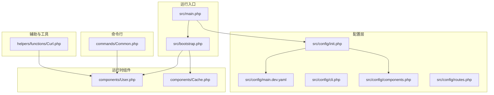
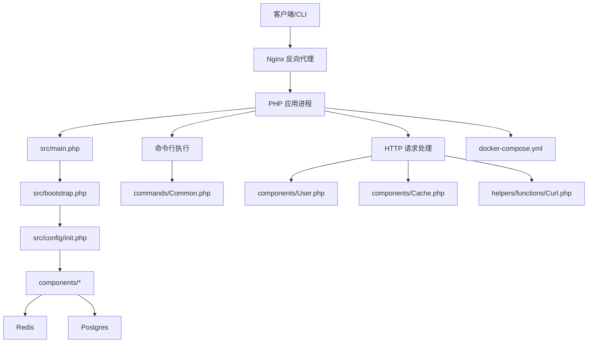
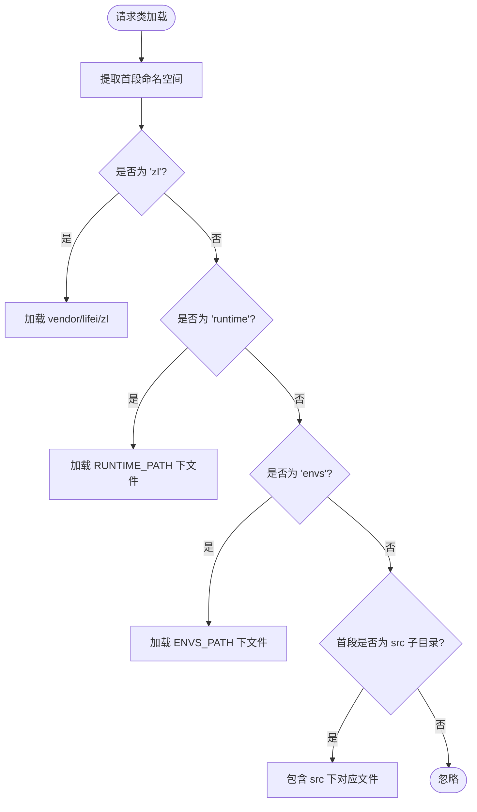
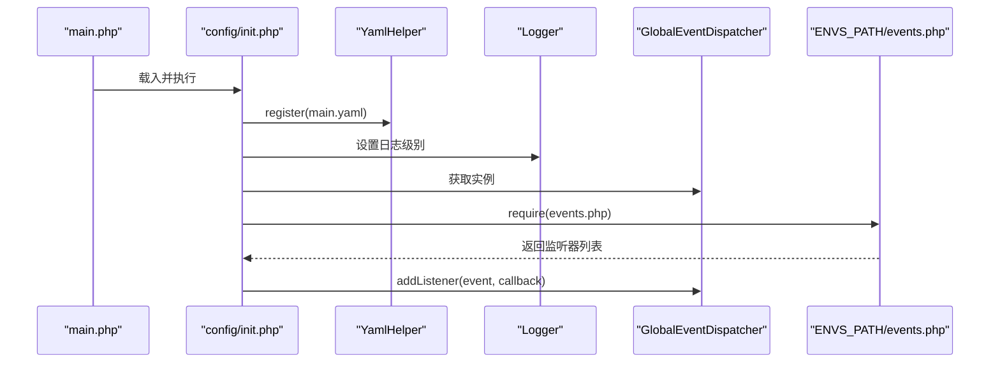
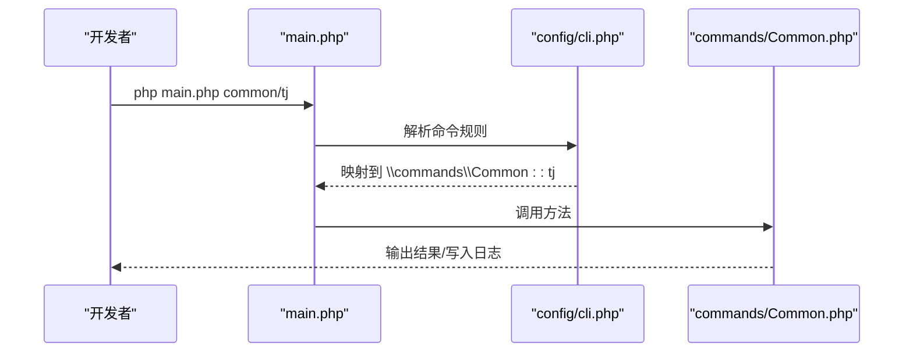
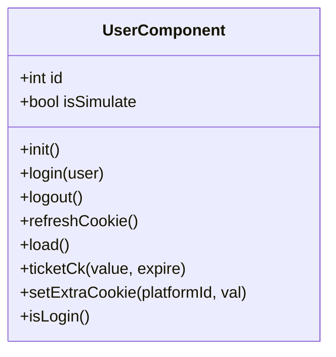
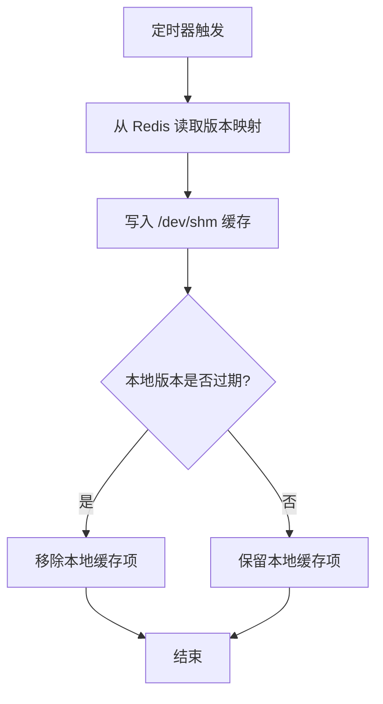
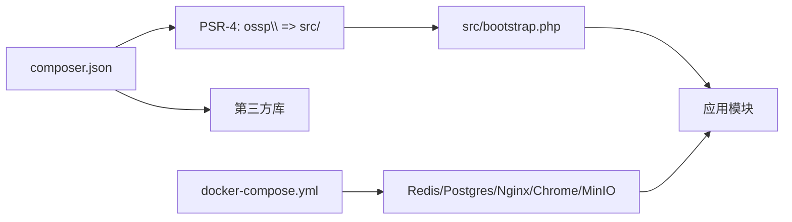

# 开发指南

<cite>
**本文引用的文件**
- [process/README.MD](file://process/README.MD)
- [process/composer.json](file://process/composer.json)
- [process/src/main.php](file://process/src/main.php)
- [process/src/bootstrap.php](file://process/src/bootstrap.php)
- [process/src/config/init.php](file://process/src/config/init.php)
- [process/src/config/main.dev.yaml](file://process/src/config/main.dev.yaml)
- [process/src/config/cli.php](file://process/src/config/cli.php)
- [process/src/config/components.php](file://process/src/config/components.php)
- [process/src/config/routes.php](file://process/src/config/routes.php)
- [process/src/helpers/functions/Curl.php](file://process/src/helpers/functions/Curl.php)
- [process/src/components/User.php](file://process/src/components/User.php)
- [process/src/components/Cache.php](file://process/src/components/Cache.php)
- [process/src/commands/Common.php](file://process/src/commands/Common.php)
- [process/docker/docker-compose.yml](file://process/docker/docker-compose.yml)
</cite>

## 目录
1. [简介](#简介)
2. [项目结构](#项目结构)
3. [核心组件](#核心组件)
4. [架构总览](#架构总览)
5. [详细组件分析](#详细组件分析)
6. [依赖分析](#依赖分析)
7. [性能考虑](#性能考虑)
8. [故障排查指南](#故障排查指南)
9. [结论](#结论)
10. [附录](#附录)

## 简介
本开发指南面向 htdNew 项目的开发者，聚焦于代码规范、开发流程与最佳实践，覆盖命令行脚本开发、辅助函数使用与自动加载机制、单元测试策略、调试技巧、性能优化、代码审查标准、版本控制与发布流程，并提供开发工具与 IDE 配置建议。文档基于仓库现有实现进行提炼，确保可操作与可落地。

## 项目结构
项目采用“多租户/多环境”分层组织方式，核心源码位于 src，容器编排位于 docker，配置按环境拆分，命令行脚本集中在 src/commands，组件与服务按职责划分，辅助函数与工具位于 src/helpers，HTTP 层控制器位于 src/http，模型位于 src/models，迁移脚本位于 src/migrations。

图表来源
- [process/src/main.php](file://process/src/main.php#L1-L25)
- [process/src/bootstrap.php](file://process/src/bootstrap.php#L1-L40)
- [process/src/config/init.php](file://process/src/config/init.php#L1-L48)
- [process/src/config/main.dev.yaml](file://process/src/config/main.dev.yaml#L1-L97)
- [process/src/config/cli.php](file://process/src/config/cli.php#L1-L17)
- [process/src/config/components.php](file://process/src/config/components.php#L1-L34)
- [process/src/config/routes.php](file://process/src/config/routes.php#L1-L4)
- [process/src/components/User.php](file://process/src/components/User.php#L1-L429)
- [process/src/components/Cache.php](file://process/src/components/Cache.php#L1-L136)
- [process/src/helpers/functions/Curl.php](file://process/src/helpers/functions/Curl.php#L1-L66)
- [process/src/commands/Common.php](file://process/src/commands/Common.php#L1-L65)

章节来源
- [process/README.MD](file://process/README.MD#L1-L158)
- [process/composer.json](file://process/composer.json#L1-L70)

## 核心组件
- 自动加载与命名空间
  - 通过自定义 SPL autoload 注册器实现 PSR-4 与特殊命名空间映射，支持 vendor、envs、runtime 等路径解析，避免硬编码路径，提升可移植性。
- 配置初始化
  - 在 init.php 中注册 YAML 配置、设置日志级别、构建全局事件分发器、注入环境事件，便于按租户/环境定制行为。
- 组件装配
  - components.php 将 db、cache、redis、notice、queue 等组件统一装配，支持按环境合并覆盖。
- 命令行路由
  - cli.php 定义命令行规则与组件合并，支持多层命名空间匹配，便于扩展自有命令。
- HTTP 辅助
  - helpers/functions/Curl.php 提供协程 HTTP 客户端封装与调用日志记录，统一请求/响应日志落库，便于问题定位。
- 用户态组件
  - components/User.php 实现登录态加载、匿名访问白名单、跨域/跨平台登出、Cookie 策略与设备维度盐值校验，保障安全与兼容。
- 缓存组件
  - components/Cache.php 基于 Redis hash 维护对象版本，定时拉取与清理，结合共享内存降低跨进程竞争，提升缓存命中与一致性。

章节来源
- [process/src/bootstrap.php](file://process/src/bootstrap.php#L1-L40)
- [process/src/config/init.php](file://process/src/config/init.php#L1-L48)
- [process/src/config/components.php](file://process/src/config/components.php#L1-L34)
- [process/src/config/cli.php](file://process/src/config/cli.php#L1-L17)
- [process/src/helpers/functions/Curl.php](file://process/src/helpers/functions/Curl.php#L1-L66)
- [process/src/components/User.php](file://process/src/components/User.php#L1-L429)
- [process/src/components/Cache.php](file://process/src/components/Cache.php#L1-L136)

## 架构总览
系统以 Swoole 协程为基础，通过 main.php 启动，加载 composer autoload 与自定义 bootstrap，随后初始化配置与组件，最终交由框架主控制器处理请求或执行命令。容器编排提供 Redis、Postgres、Nginx、Chrome、MinIO 等基础设施，便于本地与生产一致化运行。

图表来源
- [process/src/main.php](file://process/src/main.php#L1-L25)
- [process/src/bootstrap.php](file://process/src/bootstrap.php#L1-L40)
- [process/src/config/init.php](file://process/src/config/init.php#L1-L48)
- [process/src/components/User.php](file://process/src/components/User.php#L1-L429)
- [process/src/components/Cache.php](file://process/src/components/Cache.php#L1-L136)
- [process/src/helpers/functions/Curl.php](file://process/src/helpers/functions/Curl.php#L1-L66)
- [process/src/commands/Common.php](file://process/src/commands/Common.php#L1-L65)
- [process/docker/docker-compose.yml](file://process/docker/docker-compose.yml#L1-L150)

## 详细组件分析

### 自动加载与命名空间
- 设计要点
  - 通过 spl_autoload_register 注册闭包，按首段命名空间分派加载路径，支持 vendor、envs、runtime、src 下模块的自动包含。
  - 对 envs 命名空间，动态拼接 ENVS_PATH，实现多租户/多环境隔离。
- 最佳实践
  - 新增模块遵循 src 下一级目录即命名空间前缀的原则，减少手动 include。
  - 避免在 bootstrap 中引入过多外部依赖，保持加载链路清晰。

图表来源
- [process/src/bootstrap.php](file://process/src/bootstrap.php#L1-L40)

章节来源
- [process/src/bootstrap.php](file://process/src/bootstrap.php#L1-L40)

### 配置初始化与事件分发
- 设计要点
  - init.php 注册 main.yaml，设置日志级别，构建全局事件分发器，按 ENVS_PATH 加载 events.php 并注册监听器。
- 最佳实践
  - 将环境特定配置放在 envs/$customer/$env 下，避免污染公共配置。
  - 事件监听器应轻量且幂等，避免阻塞主流程。

图表来源
- [process/src/main.php](file://process/src/main.php#L1-L25)
- [process/src/config/init.php](file://process/src/config/init.php#L1-L48)

章节来源
- [process/src/config/init.php](file://process/src/config/init.php#L1-L48)

### 组件装配与配置覆盖
- 设计要点
  - components.php 从 YAML 读取 db/redis 配置，区分序列化/非序列化两种 Redis 实例；支持按环境合并覆盖。
- 最佳实践
  - 将组件配置与业务解耦，优先通过 YAML 管理，必要时在 envs 下局部覆盖。
  - 组件初始化顺序需保证依赖可用（如 Redis 先于队列）。

章节来源
- [process/src/config/components.php](file://process/src/config/components.php#L1-L34)

### 命令行脚本开发
- 设计要点
  - cli.php 定义命令行规则与组件合并，支持多层命名空间匹配，便于扩展自有命令。
  - commands/Common.php 提供常用任务入口，如统计、通知、同步等。
- 开发流程
  - 新建命令类：在 src/commands 下新增类文件，暴露静态或可调用方法作为入口。
  - 注册路由：在 cli.php 的 rules 中添加匹配规则，或复用现有规则。
  - 执行方式：通过 php main.php <命令> 调用，或在 Docker 环境中执行相应脚本。
- 最佳实践
  - 命令类内部尽量使用组件与服务层，避免直接操作底层资源。
  - 记录关键日志与耗时，便于监控与回溯。

图表来源
- [process/src/config/cli.php](file://process/src/config/cli.php#L1-L17)
- [process/src/commands/Common.php](file://process/src/commands/Common.php#L1-L65)
- [process/src/main.php](file://process/src/main.php#L1-L25)

章节来源
- [process/src/config/cli.php](file://process/src/config/cli.php#L1-L17)
- [process/src/commands/Common.php](file://process/src/commands/Common.php#L1-L65)

### HTTP 辅助与日志
- 设计要点
  - helpers/functions/Curl.php 提供协程 HTTP 客户端封装，统一记录请求/响应与状态码，便于问题定位。
- 最佳实践
  - 在调用第三方接口时统一走该封装，避免分散的日志记录逻辑。
  - 对敏感字段进行脱敏处理，避免日志泄露。

章节来源
- [process/src/helpers/functions/Curl.php](file://process/src/helpers/functions/Curl.php#L1-L66)

### 用户态组件与登录态管理
- 设计要点
  - components/User.php 实现登录态加载、匿名访问白名单、跨域/跨平台登出、Cookie 策略与设备维度盐值校验。
- 最佳实践
  - 在业务控制器中通过组件获取当前用户，避免重复校验。
  - 对 Cookie 的 SameSite/Secure 策略按环境配置，避免浏览器兼容问题。

图表来源
- [process/src/components/User.php](file://process/src/components/User.php#L1-L429)

章节来源
- [process/src/components/User.php](file://process/src/components/User.php#L1-L429)

### 缓存组件与版本一致性
- 设计要点
  - components/Cache.php 基于 Redis hash 维护对象版本，定时拉取与清理，结合共享内存降低跨进程竞争。
- 最佳实践
  - 对热点对象使用该缓存组件，避免重复构造。
  - 合理设置过期时间与清理周期，平衡内存与一致性。

图表来源
- [process/src/components/Cache.php](file://process/src/components/Cache.php#L1-L136)

章节来源
- [process/src/components/Cache.php](file://process/src/components/Cache.php#L1-L136)

## 依赖分析
- Composer 自动加载
  - 通过 PSR-4 将 ossp\ 映射到 src，配合自定义 bootstrap 支持 vendor/envs/runtime 等路径。
- 外部依赖
  - 使用 Guzzle/Symfony DomCrawler 等库处理 HTTP 与 DOM 解析；使用 Swoole 协程能力提升并发。
- 容器依赖
  - docker-compose 提供 Redis、Postgres、Nginx、Chrome、MinIO 等服务，便于本地与生产一致化运行。

图表来源
- [process/composer.json](file://process/composer.json#L1-L70)
- [process/src/bootstrap.php](file://process/src/bootstrap.php#L1-L40)
- [process/docker/docker-compose.yml](file://process/docker/docker-compose.yml#L1-L150)

章节来源
- [process/composer.json](file://process/composer.json#L1-L70)
- [process/docker/docker-compose.yml](file://process/docker/docker-compose.yml#L1-L150)

## 性能考虑
- 协程化与 Hook
  - 在 main.php 中启用协程 Hook，提升 I/O 密集型场景吞吐。
- 缓存与版本控制
  - 使用 Cache 组件与 Redis 版本映射，结合共享内存降低跨进程竞争，提升缓存命中率。
- 日志与监控
  - 通过 Curl 辅助记录请求/响应，结合日志级别与事件分发器，便于定位瓶颈。
- 容器资源
  - 合理设置 Redis/Postgres/MinIO 的资源限制与持久化策略，避免 I/O 抖动。

章节来源
- [process/src/main.php](file://process/src/main.php#L1-L25)
- [process/src/components/Cache.php](file://process/src/components/Cache.php#L1-L136)
- [process/src/helpers/functions/Curl.php](file://process/src/helpers/functions/Curl.php#L1-L66)

## 故障排查指南
- 环境与依赖
  - 确认 PHP 8.1+、Swoole 5.0+、Postgres/OpenGauss、Redis 5+ 已安装，扩展满足要求。
- 启动与访问
  - 使用 docker-compose 启动后，按 README 指引绑定 hosts 并访问示例接口验证。
- 平滑重启
  - 通过发送信号对工作进程进行平滑重启，避免中断服务。
- 数据库迁移
  - 使用命令行创建与执行迁移脚本，确保数据库结构一致。
- 日志与调试
  - 查看 Nginx/PHP/Redis/Postgres 日志，结合 Curl 辅助记录的请求/响应定位问题。

章节来源
- [process/README.MD](file://process/README.MD#L1-L158)

## 结论
本指南总结了 htdNew 项目的自动加载机制、配置初始化、组件装配、命令行开发、HTTP 辅助、用户态与缓存组件的设计与最佳实践，并提供了性能优化与故障排查建议。建议在日常开发中严格遵循命名空间与配置分离原则，充分利用组件与服务层，结合协程与缓存策略提升性能与稳定性。

## 附录

### 开发流程与规范
- 代码规范
  - 命名空间与文件结构保持一致，避免深层嵌套。
  - 命令类方法命名语义化，参数与返回值明确。
- 开发流程
  - 新功能先在本地 Docker 环境验证，再提交 PR。
  - 配置变更通过 YAML 管理，必要时在 envs 下局部覆盖。
- 代码审查标准
  - 关注安全性（Cookie/SameSite/Secure）、健壮性（异常处理/超时重试）、可观测性（日志/指标）。
- 版本控制与发布
  - 使用 Git 分支策略，发布前执行迁移与回归测试。
- 单元测试策略
  - 优先测试核心组件与工具函数，结合日志与事件验证集成行为。
- 调试技巧
  - 使用 Curl 辅助记录请求/响应，结合日志级别与事件分发器定位问题。
- 性能优化
  - 启用协程 Hook，合理使用缓存组件，优化数据库查询与索引。
- 开发工具与 IDE 配置
  - 推荐使用支持 PHP 8.1+ 与 Swoole 的 IDE，启用代码提示与静态检查。
  - Docker 环境下使用 VS Code Remote-Containers 或 PhpStorm Docker 插件，提升开发体验。

章节来源
- [process/README.MD](file://process/README.MD#L1-L158)
- [process/src/config/main.dev.yaml](file://process/src/config/main.dev.yaml#L1-L97)
- [process/src/config/cli.php](file://process/src/config/cli.php#L1-L17)
- [process/src/helpers/functions/Curl.php](file://process/src/helpers/functions/Curl.php#L1-L66)