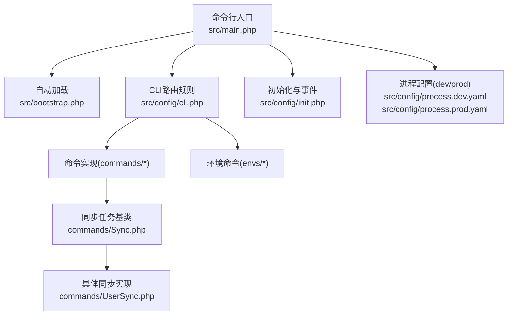
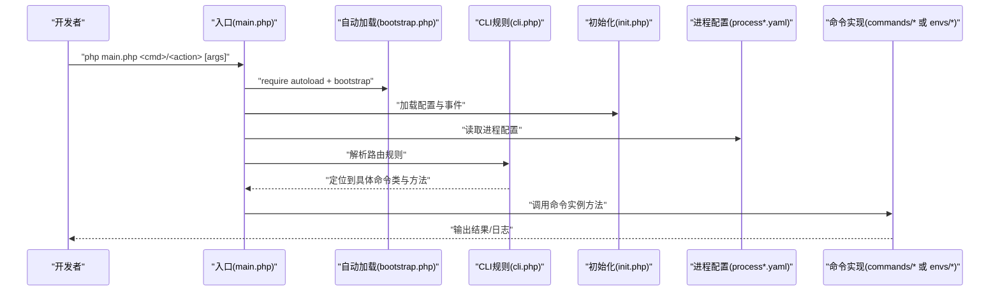
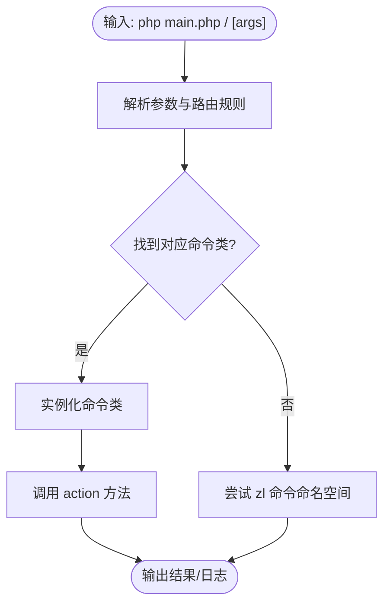
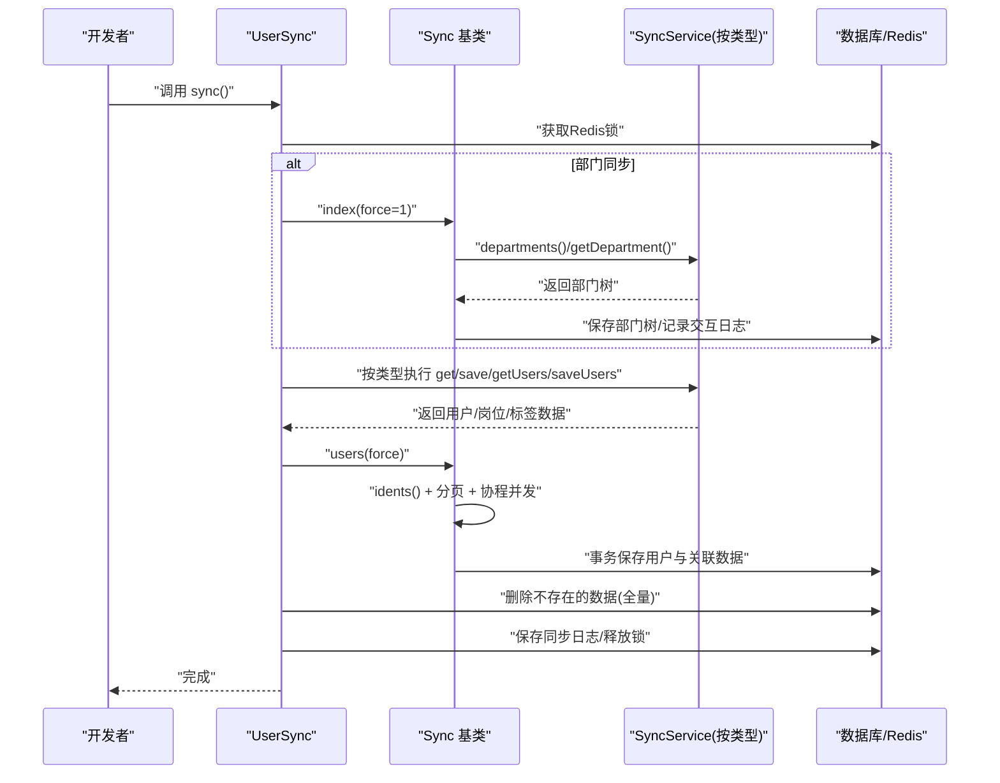
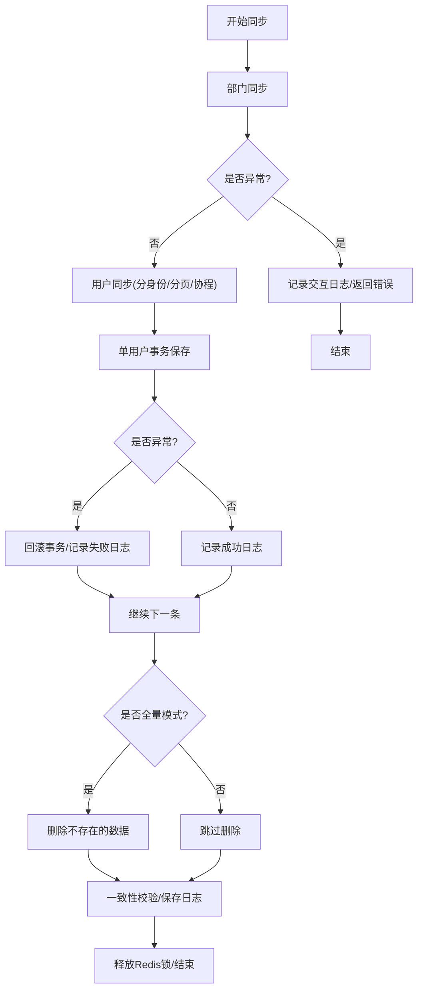
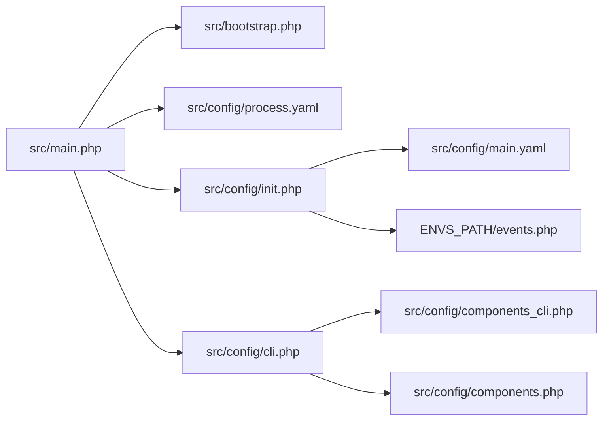

# 开发流程

<cite>
**本文引用的文件**
- [process/README.MD](file://process/README.MD)
- [process/composer.json](file://process/composer.json)
- [process/src/bootstrap.php](file://process/src/bootstrap.php)
- [process/src/main.php](file://process/src/main.php)
- [process/src/config/cli.php](file://process/src/config/cli.php)
- [process/src/config/init.php](file://process/src/config/init.php)
- [process/src/config/process.dev.yaml](file://process/src/config/process.dev.yaml)
- [process/src/config/process.prod.yaml](file://process/src/config/process.prod.yaml)
- [process/src/commands/Common.php](file://process/src/commands/Common.php)
- [process/src/commands/Demo.php](file://process/src/commands/Demo.php)
- [process/src/commands/Sync.php](file://process/src/commands/Sync.php)
- [process/src/commands/UserSync.php](file://process/src/commands/UserSync.php)
- [process_envs/demo/product/commands/Demo.php](file://process_envs/demo/product/commands/Demo.php)
</cite>

## 目录
1. [简介](#简介)
2. [项目结构](#项目结构)
3. [核心组件](#核心组件)
4. [架构总览](#架构总览)
5. [详细组件分析](#详细组件分析)
6. [依赖分析](#依赖分析)
7. [性能考量](#性能考量)
8. [故障排查指南](#故障排查指南)
9. [结论](#结论)
10. [附录](#附录)

## 简介
本文件面向 htdNew 项目的开发与维护团队，系统性梳理命令行脚本的开发模式、参数处理与执行机制；阐述同步任务（尤其是用户同步）的开发流程、数据处理与错误处理策略；给出开发环境搭建、本地调试与测试流程；提供完整的工作流图与最佳实践；说明版本控制分支策略与代码合并流程；并覆盖开发工具链配置与自动化构建要点。

## 项目结构
- 顶层目录包含 process 与 process_envs 两大模块：
  - process：核心源码与运行时配置，含命令行入口、配置、引擎、组件、HTTP 控制器、服务层、迁移脚本等。
  - process_envs：按“客户/环境”维度组织的定制化代码与命令实现，遵循 $custom/$envmode/ 的目录约定。
- 命令行入口与运行机制：
  - 入口文件负责加载配置、注册自动加载、初始化事件与日志，并将 CLI 参数交由框架处理。
  - CLI 路由规则支持 commands 与 envs 命名空间下的类方法调用。
- 开发与生产配置：
  - 通过 process.dev.yaml 与 process.prod.yaml 控制进程模型、业务配置文件路径与部署行为差异。
- Docker 与本地开发：
  - README 提供了基于 docker-compose 的一键启动、环境变量与调试端口说明，以及平滑重启与前端构建流程。

**图表来源**
- [process/src/main.php](file://process/src/main.php#L1-L25)
- [process/src/bootstrap.php](file://process/src/bootstrap.php#L1-L40)
- [process/src/config/cli.php](file://process/src/config/cli.php#L1-L17)
- [process/src/config/init.php](file://process/src/config/init.php#L1-L48)
- [process/src/config/process.dev.yaml](file://process/src/config/process.dev.yaml#L1-L89)
- [process/src/config/process.prod.yaml](file://process/src/config/process.prod.yaml#L1-L80)
- [process/src/commands/Sync.php](file://process/src/commands/Sync.php#L1-L587)
- [process/src/commands/UserSync.php](file://process/src/commands/UserSync.php#L1-L221)

**章节来源**
- [process/README.MD](file://process/README.MD#L1-L158)
- [process/src/main.php](file://process/src/main.php#L1-L25)
- [process/src/config/process.dev.yaml](file://process/src/config/process.dev.yaml#L1-L89)
- [process/src/config/process.prod.yaml](file://process/src/config/process.prod.yaml#L1-L80)

## 核心组件
- 自动加载与命名空间映射
  - bootstrap.php 注册 SPL 自动加载器，支持 vendor、runtime、envs 等命名空间映射，确保命令与业务类可被正确加载。
- CLI 路由与命令解析
  - cli.php 定义 CLI 规则，优先匹配 envs 命令，其次 commands 命令，最终回落到 zl 命令命名空间。
- 初始化与事件
  - init.php 加载 main.yaml，设置日志级别，注册全局事件监听器，支持按环境加载 events.php。
- 进程与配置
  - process.dev.yaml 与 process.prod.yaml 决定进程数量、CPU 亲和、是否启用部署与文件监控等。
- 命令样例
  - Demo 命令用于演示与调试；Common 命令封装常用任务入口。

**章节来源**
- [process/src/bootstrap.php](file://process/src/bootstrap.php#L1-L40)
- [process/src/config/cli.php](file://process/src/config/cli.php#L1-L17)
- [process/src/config/init.php](file://process/src/config/init.php#L1-L48)
- [process/src/commands/Demo.php](file://process/src/commands/Demo.php#L1-L100)
- [process/src/commands/Common.php](file://process/src/commands/Common.php#L1-L65)

## 架构总览
下图展示从命令行到具体业务执行的总体流程，包括自动加载、路由解析、事件初始化与进程配置对齐。

**图表来源**
- [process/src/main.php](file://process/src/main.php#L1-L25)
- [process/src/bootstrap.php](file://process/src/bootstrap.php#L1-L40)
- [process/src/config/cli.php](file://process/src/config/cli.php#L1-L17)
- [process/src/config/init.php](file://process/src/config/init.php#L1-L48)
- [process/src/config/process.dev.yaml](file://process/src/config/process.dev.yaml#L1-L89)
- [process/src/config/process.prod.yaml](file://process/src/config/process.prod.yaml#L1-L80)

## 详细组件分析

### 命令行脚本开发模式与参数处理
- 命令发现与路由
  - CLI 路由规则按顺序尝试 envs、commands、zl 命令命名空间，最终定位到具体类与静态方法。
- 命令实现位置
  - 通用命令位于 src/commands；按客户/环境定制的命令位于 process_envs/$custom/$envmode/commands。
- 示例：Demo 命令
  - 提供 index 方法作为默认入口，便于快速验证环境与流程。
- 示例：Common 命令
  - 聚合统计、通知、第三方平台同步等常用任务入口，便于统一调度。

**图表来源**
- [process/src/config/cli.php](file://process/src/config/cli.php#L1-L17)
- [process/src/commands/Demo.php](file://process/src/commands/Demo.php#L1-L100)
- [process_envs/demo/product/commands/Demo.php](file://process_envs/demo/product/commands/Demo.php#L1-L11)

**章节来源**
- [process/src/config/cli.php](file://process/src/config/cli.php#L1-L17)
- [process/src/commands/Demo.php](file://process/src/commands/Demo.php#L1-L100)
- [process_envs/demo/product/commands/Demo.php](file://process_envs/demo/product/commands/Demo.php#L1-L11)

### 同步任务开发流程（以用户同步为例）
- 抽象基类：Sync
  - 定义同步生命周期：部门同步 → 用户同步（分身份、分页、协程并发）。
  - 断点续传：通过 runtime 下的历史文件记录已处理的 ident.page，支持跨次执行的续传。
  - 日志与交互记录：统一通过 InteractionLog 与 userSyncLog 记录交互状态与明细。
  - 数据落库：事务包裹，逐用户落库，支持用户基础信息、身份专属表、部门、标签、岗位、关系等多维数据。
- 具体实现：UserSync
  - 依据配置类型（部门/岗位/标签等）选择对应的 SyncService 实现，执行全量或增量同步。
  - 使用 Redis 分布式锁避免重复执行；按同步模式设置不同锁时长。
  - 在全量模式下执行“删除源头不存在的数据”的清理步骤，并进行一致性校验。
- 并发与稳定性
  - 使用 Swoole 协程 Channel 与 Barrier 控制并发度与屏障等待，避免过度并发导致下游压力。
  - Crontab::$stop 支持外部中断信号，保障可控停止。

**图表来源**
- [process/src/commands/UserSync.php](file://process/src/commands/UserSync.php#L1-L221)
- [process/src/commands/Sync.php](file://process/src/commands/Sync.php#L1-L587)

**章节来源**
- [process/src/commands/Sync.php](file://process/src/commands/Sync.php#L1-L587)
- [process/src/commands/UserSync.php](file://process/src/commands/UserSync.php#L1-L221)

### 数据处理与错误处理策略
- 数据处理
  - 部门树：生成树形结构，去重校验 sn，防止重复编码导致脏数据。
  - 用户：逐用户格式化，分别写入 users、user_info、identity 专属表、user_department、team_user、user_job、user_relation 等。
  - 关系：根据 identity_type 与 relation_key 解析 relation_id，增删差集同步。
- 错误处理
  - 部门同步异常直接中断，记录交互日志并返回错误状态。
  - 用户同步单条失败回滚事务，记录失败详情与日志，不影响整体流程继续。
  - Redis 锁失败或异常统一记录并抛出，最终释放锁，保证幂等与一致性。
  - 交互日志与明细日志双通道记录，便于审计与追踪。

**图表来源**
- [process/src/commands/Sync.php](file://process/src/commands/Sync.php#L1-L587)
- [process/src/commands/UserSync.php](file://process/src/commands/UserSync.php#L1-L221)

**章节来源**
- [process/src/commands/Sync.php](file://process/src/commands/Sync.php#L1-L587)
- [process/src/commands/UserSync.php](file://process/src/commands/UserSync.php#L1-L221)

### 开发环境搭建、本地调试与测试流程
- 环境要求与初始化
  - PHP 8.1+、Swoole 5.0+、Postgres 12/Opengauss、Redis 5+；扩展：swoole、swoole_postgresql、redis、yaml、inotify、fileinfo。
  - 克隆后执行 composer update 安装依赖。
- Docker 开发环境
  - 复制配置文件、启动容器、绑定 hosts、访问示例接口验证。
  - 提供调试端口（Postgres 5555、Redis 6380）与平滑重启指令。
- 本地调试
  - 使用 main.php 作为入口，结合 Demo 命令快速验证。
  - init.php 支持按环境加载 events.php，便于事件驱动调试。
- 测试建议
  - 基于 Demo 命令扩展单元测试入口，结合断点与日志定位问题。
  - 利用同步任务的日志与交互记录进行回归验证。

**章节来源**
- [process/README.MD](file://process/README.MD#L1-L158)
- [process/src/config/init.php](file://process/src/config/init.php#L1-L48)
- [process/src/commands/Demo.php](file://process/src/commands/Demo.php#L1-L100)

### 版本控制分支策略与代码合并流程
- 分支策略
  - 建议采用 feature/fix/hotfix/develop/release 分支模型，主分支仅允许通过 Pull Request 合并。
- 合并流程
  - 提交前执行本地测试与 lint；创建 PR 并至少一名审查者批准；合并前确保 CI 通过与冲突解决。
- 环境隔离
  - 通过 process.dev.yaml 与 process.prod.yaml 区分开发与生产行为（如部署进程、watcher 进程、镜像大小等）。

**章节来源**
- [process/src/config/process.dev.yaml](file://process/src/config/process.dev.yaml#L1-L89)
- [process/src/config/process.prod.yaml](file://process/src/config/process.prod.yaml#L1-L80)

### 开发工具链配置与自动化构建
- Composer 依赖管理
  - PSR-4 自动加载与第三方库管理，dev 依赖包含 phpunit 与 swoole ide-helper。
- 前端构建
  - README 提供前端依赖安装与构建命令，构建产物拷贝至服务器同级目录。
- Docker 与镜像
  - README 提供镜像登录与推送示例，便于制品分发。

**章节来源**
- [process/composer.json](file://process/composer.json#L1-L70)
- [process/README.MD](file://process/README.MD#L1-L158)

## 依赖分析
- 自动加载依赖
  - bootstrap.php 依赖 src 目录扫描与命名空间映射，确保 commands 与 envs 命令可被加载。
- CLI 依赖
  - cli.php 依赖 components_cli.php 与 components.php 合并组件，形成命令可用的组件集合。
- 运行时依赖
  - main.php 依赖 process.yaml 与 ENVS_PATH，决定环境代码路径；init.php 依赖 main.yaml 与 events.php。

**图表来源**
- [process/src/main.php](file://process/src/main.php#L1-L25)
- [process/src/bootstrap.php](file://process/src/bootstrap.php#L1-L40)
- [process/src/config/init.php](file://process/src/config/init.php#L1-L48)
- [process/src/config/cli.php](file://process/src/config/cli.php#L1-L17)

**章节来源**
- [process/src/main.php](file://process/src/main.php#L1-L25)
- [process/src/bootstrap.php](file://process/src/bootstrap.php#L1-L40)
- [process/src/config/init.php](file://process/src/config/init.php#L1-L48)
- [process/src/config/cli.php](file://process/src/config/cli.php#L1-L17)

## 性能考量
- 并发与限速
  - Sync 中通过协程 Channel 限制并发度，避免下游服务过载；根据数据量与目标服务承载能力动态调整。
- 断点续传
  - 历史文件记录 ident.page，跨次执行可续传，减少重复工作量。
- 事务与批处理
  - 单用户事务保证一致性；部门树与用户列表按批次处理，降低内存峰值。
- 进程与 CPU 亲和
  - 通过 process.yaml 的 number 与 affinity 配置，合理分配 CPU 资源，提升吞吐与稳定性。

[本节为通用指导，无需列出具体文件来源]

## 故障排查指南
- 常见问题定位
  - 交互日志与明细日志：通过 Sync 与 UserSync 中的交互记录与明细日志定位失败节点。
  - Redis 锁：确认锁是否成功设置、是否超时未释放；必要时手动清理。
  - 部门重复编码：UserSync 在 getDepartment 阶段进行重复校验，需修正上游数据。
- 调试手段
  - 使用 Demo 命令快速验证环境；结合 init.php 的事件监听与日志级别调整。
  - Docker 环境下通过调试端口连接 Postgres/Redis 排查连接与权限问题。

**章节来源**
- [process/src/commands/Sync.php](file://process/src/commands/Sync.php#L1-L587)
- [process/src/commands/UserSync.php](file://process/src/commands/UserSync.php#L1-L221)
- [process/src/config/init.php](file://process/src/config/init.php#L1-L48)
- [process/README.MD](file://process/README.MD#L1-L158)

## 结论
本开发流程文档围绕命令行脚本与同步任务两条主线，给出了从环境搭建、参数处理、执行机制到数据与错误处理的全流程说明，并配套架构图、序列图与流程图帮助理解。建议在日常开发中严格遵循分支与合并规范，利用断点续传与日志体系提升稳定性与可观测性。

## 附录
- 快速参考
  - 启动与验证：README 中的 docker 启动、hosts 绑定与示例接口访问。
  - 命令入口：php main.php <cmd>/<action> [args]。
  - 同步任务：UserSync 与 Sync 的职责边界与调用关系。
  - 环境配置：process.dev.yaml 与 process.prod.yaml 的差异点。

**章节来源**
- [process/README.MD](file://process/README.MD#L1-L158)
- [process/src/commands/UserSync.php](file://process/src/commands/UserSync.php#L1-L221)
- [process/src/commands/Sync.php](file://process/src/commands/Sync.php#L1-L587)