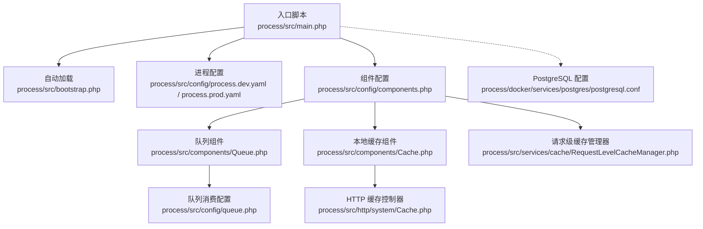
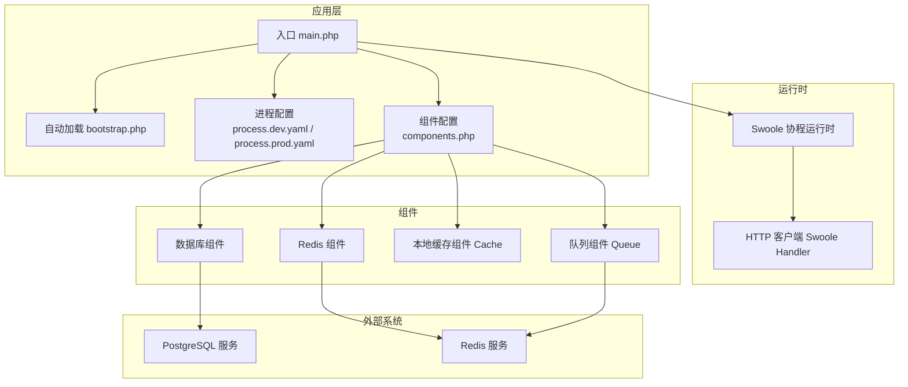
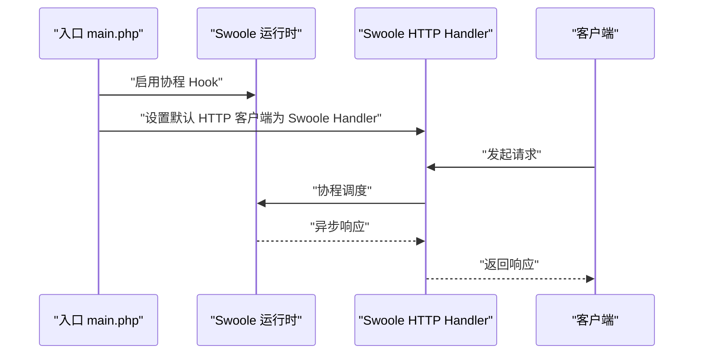
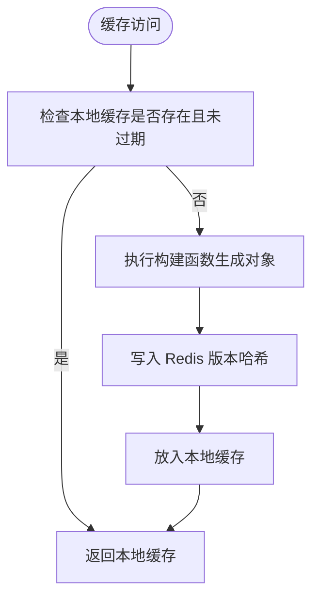
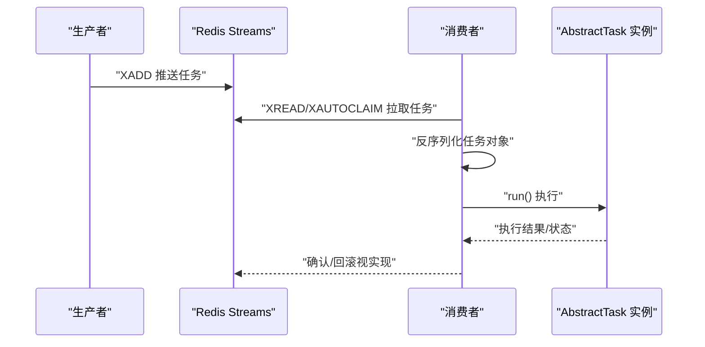
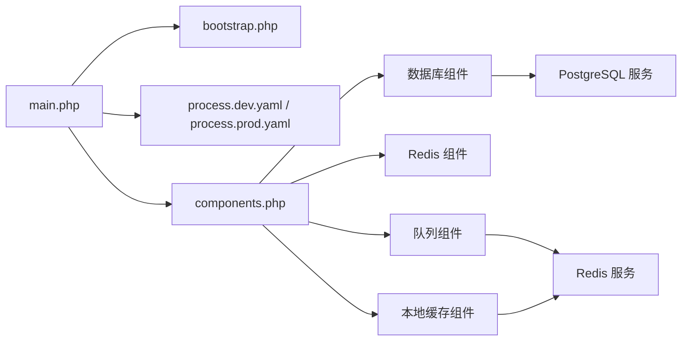

# 性能优化

<cite>
**本文引用的文件**
- [process/main.php](file://process/src/main.php)
- [process/bootstrap.php](file://process/src/bootstrap.php)
- [process/config/process.dev.yaml](file://process/src/config/process.dev.yaml)
- [process/config/process.prod.yaml](file://process/src/config/process.prod.yaml)
- [process/config/components.php](file://process/src/config/components.php)
- [process/config/queue.php](file://process/src/config/queue.php)
- [process/components/Queue.php](file://process/src/components/Queue.php)
- [process/components/Cache.php](file://process/src/components/Cache.php)
- [process/http/system/Cache.php](file://process/src/http/system/Cache.php)
- [process/services/cache/RequestLevelCacheManager.php](file://process/src/services/cache/RequestLevelCacheManager.php)
- [process/docker/services/postgres/postgresql.conf](file://process/docker/services/postgres/postgresql.conf)
</cite>

## 目录
1. [引言](#引言)
2. [项目结构](#项目结构)
3. [核心组件](#核心组件)
4. [架构总览](#架构总览)
5. [详细组件分析](#详细组件分析)
6. [依赖关系分析](#依赖关系分析)
7. [性能考量与优化策略](#性能考量与优化策略)
8. [故障排查指南](#故障排查指南)
9. [结论](#结论)
10. [附录](#附录)

## 引言
本性能优化文档面向 htdNew（process）子项目，聚焦于 Swoole 协程运行时、内存管理、CPU 使用、数据库查询与连接池、缓存策略、队列与任务调度、并发处理、性能监控与基准测试、以及生产环境调优参数与最佳实践。文档在不直接展示代码内容的前提下，基于仓库中的配置与实现文件进行系统性梳理，并提供可操作的优化建议与排障指引。

## 项目结构
- 启动入口与协程钩子：通过入口脚本启用 Swoole 协程并设置 HTTP 客户端为 Swoole Handler，确保网络 I/O 非阻塞。
- 进程模型：通过 YAML 配置定义主进程、HTTP 进程、队列进程、计划任务进程等，支持按环境切换（开发/生产）。
- 组件注册：通过组件配置集中声明数据库、Redis、本地缓存、队列等组件，便于统一管理与替换。
- 缓存与队列：本地对象缓存与 Redis Stream 队列，结合定时同步与版本控制，保障缓存一致性与任务可靠投递。
- 数据库：PostgreSQL 配置位于 Docker 服务目录，提供连接数、日志、统计等参数参考。

图表来源
- [process/main.php](file://process/src/main.php#L1-L25)
- [process/bootstrap.php](file://process/src/bootstrap.php#L1-L40)
- [process/config/process.dev.yaml](file://process/src/config/process.dev.yaml#L1-L89)
- [process/config/process.prod.yaml](file://process/src/config/process.prod.yaml#L1-L80)
- [process/config/components.php](file://process/src/config/components.php#L1-L34)
- [process/config/queue.php](file://process/src/config/queue.php#L1-L13)
- [process/components/Queue.php](file://process/src/components/Queue.php#L1-L173)
- [process/components/Cache.php](file://process/src/components/Cache.php#L1-L136)
- [process/http/system/Cache.php](file://process/src/http/system/Cache.php#L1-L53)
- [process/services/cache/RequestLevelCacheManager.php](file://process/src/services/cache/RequestLevelCacheManager.php#L102-L136)
- [process/docker/services/postgres/postgresql.conf](file://process/docker/services/postgres/postgresql.conf#L1-L529)

章节来源
- [process/main.php](file://process/src/main.php#L1-L25)
- [process/bootstrap.php](file://process/src/bootstrap.php#L1-L40)
- [process/config/process.dev.yaml](file://process/src/config/process.dev.yaml#L1-L89)
- [process/config/process.prod.yaml](file://process/src/config/process.prod.yaml#L1-L80)
- [process/config/components.php](file://process/src/config/components.php#L1-L34)

## 核心组件
- Swoole 协程运行时与 Hook
  - 在入口中启用协程 Hook，使 cURL 等阻塞 I/O 变为非阻塞，提升并发吞吐。
  - 默认 HTTP 客户端处理器切换为 Swoole Handler，减少线程切换成本。
- 组件体系
  - 数据库、Redis、本地缓存、队列等通过组件配置集中声明，支持按环境覆盖。
  - Redis 配置区分“序列化/非序列化”两类，满足不同数据结构存储需求。
- 队列与任务
  - 使用 Redis Streams 存储任务，支持高吞吐与持久化；提供消费者数量动态配置与热重载。
  - 任务对象采用自定义序列化/反序列化，兼容 BaseObject 与普通类，确保跨进程安全传递。
- 缓存策略
  - 本地对象缓存：基于内存对象池与版本同步，定期清理过期对象，降低重复构造成本。
  - 请求级缓存：按请求维度缓存计算结果，提供统计接口便于观测命中率与内存占用。
  - HTTP 缓存管理：提供列出、清空、单键失效、容量统计等运维接口。

章节来源
- [process/main.php](file://process/src/main.php#L1-L25)
- [process/config/components.php](file://process/src/config/components.php#L1-L34)
- [process/config/queue.php](file://process/src/config/queue.php#L1-L13)
- [process/components/Queue.php](file://process/src/components/Queue.php#L1-L173)
- [process/components/Cache.php](file://process/src/components/Cache.php#L1-L136)
- [process/http/system/Cache.php](file://process/src/http/system/Cache.php#L1-L53)
- [process/services/cache/RequestLevelCacheManager.php](file://process/src/services/cache/RequestLevelCacheManager.php#L102-L136)

## 架构总览
下图展示了从入口到进程、组件、缓存与队列的整体交互路径，以及数据库与外部服务的关系。

图表来源
- [process/main.php](file://process/src/main.php#L1-L25)
- [process/bootstrap.php](file://process/src/bootstrap.php#L1-L40)
- [process/config/process.dev.yaml](file://process/src/config/process.dev.yaml#L1-L89)
- [process/config/process.prod.yaml](file://process/src/config/process.prod.yaml#L1-L80)
- [process/config/components.php](file://process/src/config/components.php#L1-L34)
- [process/docker/services/postgres/postgresql.conf](file://process/docker/services/postgres/postgresql.conf#L1-L529)

## 详细组件分析

### Swoole 协程与并发优化
- 协程 Hook
  - 在入口启用全量 Hook，使 cURL、stream、socket 等阻塞调用变为协程友好，显著降低上下文切换开销。
  - 将默认 HTTP 客户端处理器切换为 Swoole Handler，避免多线程竞争与锁争用。
- 并发模型
  - 生产环境 HTTP 进程数量与 CPU 亲和配置可在 YAML 中调整，建议根据核数与业务负载合理分配。
  - 开发环境提供更少进程数量，便于调试与资源占用控制。

图表来源
- [process/main.php](file://process/src/main.php#L1-L25)

章节来源
- [process/main.php](file://process/src/main.php#L1-L25)
- [process/config/process.dev.yaml](file://process/src/config/process.dev.yaml#L1-L89)
- [process/config/process.prod.yaml](file://process/src/config/process.prod.yaml#L1-L80)

### 内存管理与本地缓存
- 对象缓存
  - 本地缓存组件以内存数组保存对象，配合 Redis 版本哈希与共享内存文件实现跨进程一致性。
  - 定时任务周期性拉取 Redis 中的对象版本，对比后清理过期对象，避免内存泄漏。
  - 提供清理全部、更新单键版本、统计大小等运维能力。
- 请求级缓存
  - 请求级缓存管理器支持键过期检测、过期键统计与内存使用统计，便于评估缓存命中与内存压力。
- 最佳实践
  - 控制缓存对象生命周期，避免大对象长期驻留。
  - 结合业务热点数据，优先使用请求级缓存降低全局共享成本。

图表来源
- [process/components/Cache.php](file://process/src/components/Cache.php#L1-L136)
- [process/http/system/Cache.php](file://process/src/http/system/Cache.php#L1-L53)
- [process/services/cache/RequestLevelCacheManager.php](file://process/src/services/cache/RequestLevelCacheManager.php#L102-L136)

章节来源
- [process/components/Cache.php](file://process/src/components/Cache.php#L1-L136)
- [process/http/system/Cache.php](file://process/src/http/system/Cache.php#L1-L53)
- [process/services/cache/RequestLevelCacheManager.php](file://process/src/services/cache/RequestLevelCacheManager.php#L102-L136)

### 队列系统与任务调度
- 队列实现
  - 使用 Redis Streams 存储任务，支持多主题（高/中/低优先级），具备持久化与顺序保证。
  - 任务对象采用自定义序列化/反序列化，兼容 BaseObject 与普通类，确保跨进程安全传递。
- 动态消费者配置
  - 通过缓存键记录消费者数量，支持热更新与动态扩缩容，更新后触发主进程重载。
- 任务执行
  - 消费端从指定主题拉取任务，反序列化后交由任务实例执行，异常与状态由任务自身处理。

图表来源
- [process/components/Queue.php](file://process/src/components/Queue.php#L1-L173)
- [process/config/queue.php](file://process/src/config/queue.php#L1-L13)

章节来源
- [process/components/Queue.php](file://process/src/components/Queue.php#L1-L173)
- [process/config/queue.php](file://process/src/config/queue.php#L1-L13)

### 数据库查询优化与连接池
- 连接池配置
  - 组件配置中声明数据库组件，具体连接参数来源于 YAML，建议在生产环境按最大并发与连接复用策略调优。
- PostgreSQL 参数参考
  - 可在 Docker 服务目录中调整连接数、日志、统计与自动清理等参数，以匹配应用并发与监控需求。
- 查询优化建议
  - 使用连接池减少连接建立开销；对高频查询建立索引与物化视图；避免 N+1 查询；使用批量插入与事务合并。
  - 合理设置超时与重试策略，避免长事务占用连接。

章节来源
- [process/config/components.php](file://process/src/config/components.php#L1-L34)
- [process/docker/services/postgres/postgresql.conf](file://process/docker/services/postgres/postgresql.conf#L1-L529)

## 依赖关系分析
- 入口依赖自动加载与进程配置，组件配置决定数据库、Redis、缓存、队列等依赖注入。
- 队列与缓存均依赖 Redis，需确保 Redis 连接池与序列化策略一致。
- HTTP 进程与 CLI 进程分别通过不同组件集，注意避免共享资源竞争。

图表来源
- [process/main.php](file://process/src/main.php#L1-L25)
- [process/bootstrap.php](file://process/src/bootstrap.php#L1-L40)
- [process/config/process.dev.yaml](file://process/src/config/process.dev.yaml#L1-L89)
- [process/config/process.prod.yaml](file://process/src/config/process.prod.yaml#L1-L80)
- [process/config/components.php](file://process/src/config/components.php#L1-L34)
- [process/docker/services/postgres/postgresql.conf](file://process/docker/services/postgres/postgresql.conf#L1-L529)

章节来源
- [process/main.php](file://process/src/main.php#L1-L25)
- [process/config/components.php](file://process/src/config/components.php#L1-L34)

## 性能考量与优化策略

### Swoole 协程性能优化
- 启用全量 Hook 与 Swoole Handler，减少阻塞 I/O 的等待时间。
- 合理设置 HTTP 进程数量与 CPU 亲和，避免过度上下文切换与 NUMA 亲和性问题。
- 使用连接池与批量操作，降低握手与序列化开销。

章节来源
- [process/main.php](file://process/src/main.php#L1-L25)
- [process/config/process.dev.yaml](file://process/src/config/process.dev.yaml#L1-L89)
- [process/config/process.prod.yaml](file://process/src/config/process.prod.yaml#L1-L80)

### 内存管理
- 本地对象缓存定期清理过期对象，避免内存无限增长；Redis 版本同步与共享内存文件降低跨进程一致性成本。
- 请求级缓存提供内存使用统计，便于定位内存热点与峰值。
- 建议限制单条缓存对象大小，避免大对象占用过多内存。

章节来源
- [process/components/Cache.php](file://process/src/components/Cache.php#L1-L136)
- [process/services/cache/RequestLevelCacheManager.php](file://process/src/services/cache/RequestLevelCacheManager.php#L102-L136)

### CPU 使用优化
- 通过进程数量与 CPU 亲和配置，将高负载进程绑定到独立核心，降低调度抖动。
- 避免在协程中执行长时间同步操作，必要时拆分为异步任务或队列。

章节来源
- [process/config/process.dev.yaml](file://process/src/config/process.dev.yaml#L1-L89)
- [process/config/process.prod.yaml](file://process/src/config/process.prod.yaml#L1-L80)

### 数据库查询优化与连接池
- 连接池参数与 PostgreSQL 调优（如 max_connections、autovacuum 等）应与应用并发相匹配。
- 查询层面：索引优化、批量操作、避免不必要的 JOIN 与子查询；事务粒度控制与超时设置。

章节来源
- [process/config/components.php](file://process/src/config/components.php#L1-L34)
- [process/docker/services/postgres/postgresql.conf](file://process/docker/services/postgres/postgresql.conf#L1-L529)

### 缓存策略
- 本地对象缓存：适合跨请求复用的稳定对象；通过版本哈希与共享内存文件实现跨进程一致性。
- 请求级缓存：适合短期热点数据；结合统计接口观察命中率与内存占用。
- Redis 缓存：适合分布式共享与持久化场景；注意序列化策略与键空间设计。

章节来源
- [process/components/Cache.php](file://process/src/components/Cache.php#L1-L136)
- [process/http/system/Cache.php](file://process/src/http/system/Cache.php#L1-L53)
- [process/services/cache/RequestLevelCacheManager.php](file://process/src/services/cache/RequestLevelCacheManager.php#L102-L136)

### 队列系统与任务调度
- 使用 Redis Streams 作为任务载体，支持多主题与持久化；通过消费者数量动态配置实现弹性伸缩。
- 任务对象自定义序列化/反序列化，确保跨进程安全；异常与重试策略应在任务内部实现。
- 建议对高优先级任务单独主题，避免阻塞低优先级任务。

章节来源
- [process/components/Queue.php](file://process/src/components/Queue.php#L1-L173)
- [process/config/queue.php](file://process/src/config/queue.php#L1-L13)

### 并发处理优化
- 协程 Hook 与 Swoole Handler 提升并发能力；避免在协程中执行 CPU 密集型任务。
- 对外调用尽量使用协程友好的客户端；对第三方限流与熔断策略进行适配。

章节来源
- [process/main.php](file://process/src/main.php#L1-L25)

### 性能监控指标与基准测试
- 监控指标建议
  - CPU 使用率、上下文切换次数、队列长度（按主题）、缓存命中率、请求级缓存内存使用、数据库连接池利用率。
  - Redis 命中率、延迟分布、Stream 队列积压。
- 基准测试方法
  - 使用并发场景模拟（如并发请求、队列推送/消费速率）；对比不同配置下的 P50/P95/P99 延迟与吞吐。
  - 关注内存峰值与 GC 抖动，避免长时间驻留的大对象。

章节来源
- [process/components/Queue.php](file://process/src/components/Queue.php#L1-L173)
- [process/components/Cache.php](file://process/src/components/Cache.php#L1-L136)
- [process/services/cache/RequestLevelCacheManager.php](file://process/src/services/cache/RequestLevelCacheManager.php#L102-L136)

### 生产环境调优参数与最佳实践
- 进程与 CPU 亲和
  - 生产环境 HTTP 进程数量与 CPU 亲和在 YAML 中配置，建议按核数与业务负载分配，确保主服务独占核心。
- Redis
  - 明确序列化策略（字符串/数字 vs 数组/对象），避免跨语言/跨组件不一致。
- PostgreSQL
  - 根据并发与查询特征调整连接数、统计开关与自动清理策略，开启必要的慢查询日志以便优化。

章节来源
- [process/config/process.prod.yaml](file://process/src/config/process.prod.yaml#L1-L80)
- [process/config/components.php](file://process/src/config/components.php#L1-L34)
- [process/docker/services/postgres/postgresql.conf](file://process/docker/services/postgres/postgresql.conf#L1-L529)

## 故障排查指南
- 协程未生效
  - 检查入口是否启用协程 Hook 与 Swoole Handler；确认 cURL 行为是否被替换。
- 队列积压
  - 查看各主题队列长度与消费者数量；检查任务执行耗时与异常回滚策略。
- 缓存不一致
  - 检查本地缓存版本同步逻辑与共享内存文件读写；确认 Redis 版本哈希是否更新。
- 内存增长
  - 观察请求级缓存内存使用统计；检查本地缓存清理定时器是否正常；避免大对象长期驻留。
- 数据库连接不足
  - 检查连接池参数与 PostgreSQL 最大连接数；关注慢查询与长事务。

章节来源
- [process/main.php](file://process/src/main.php#L1-L25)
- [process/components/Queue.php](file://process/src/components/Queue.php#L1-L173)
- [process/components/Cache.php](file://process/src/components/Cache.php#L1-L136)
- [process/http/system/Cache.php](file://process/src/http/system/Cache.php#L1-L53)
- [process/docker/services/postgres/postgresql.conf](file://process/docker/services/postgres/postgresql.conf#L1-L529)

## 结论
通过启用 Swoole 协程 Hook、合理配置进程与 CPU 亲和、优化数据库连接池与查询、实施本地与请求级缓存策略、以及基于 Redis Streams 的队列与任务调度，htdNew 项目可在高并发场景下获得稳定的吞吐与更低的延迟。结合监控指标与基准测试，持续迭代参数与策略，可进一步提升系统整体性能与稳定性。

## 附录
- 常用运维接口（HTTP 缓存）
  - 列出缓存键、查看缓存详情、按键清理、清空全部、容量统计、触发部署刷新等。
- 队列运维
  - 查看主题长度、动态调整消费者数量、热重载生效。

章节来源
- [process/http/system/Cache.php](file://process/src/http/system/Cache.php#L1-L53)
- [process/components/Queue.php](file://process/src/components/Queue.php#L1-L173)