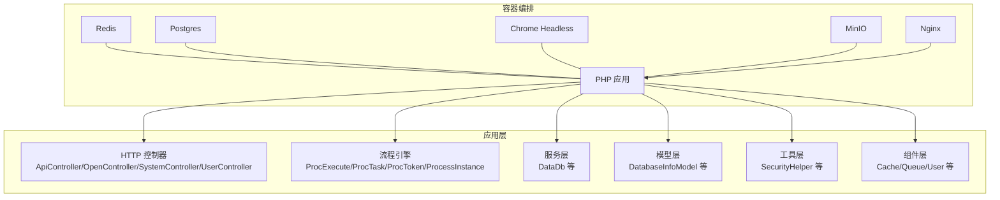
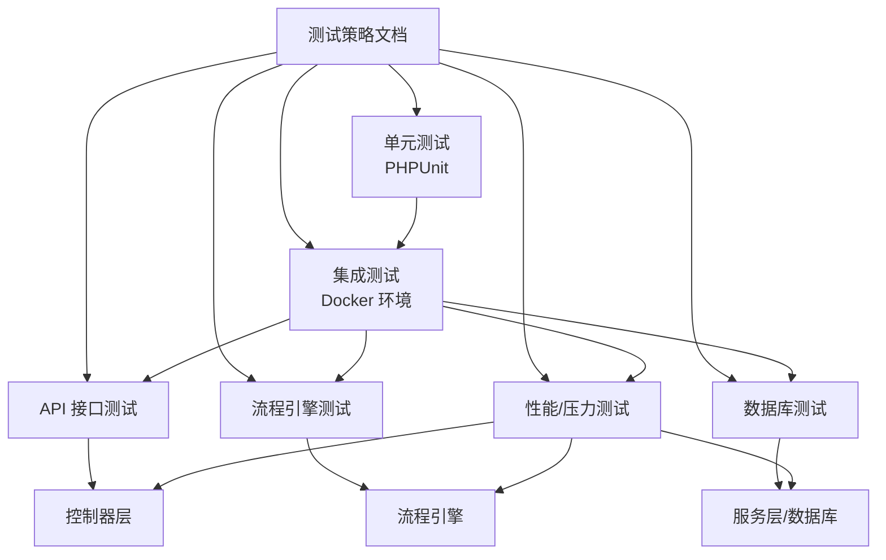
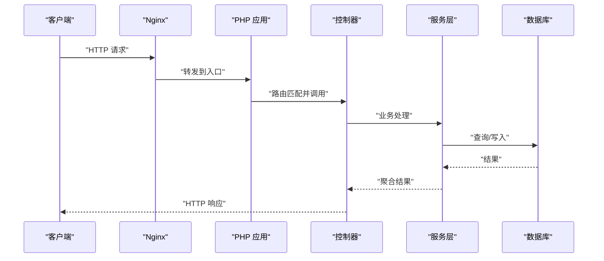
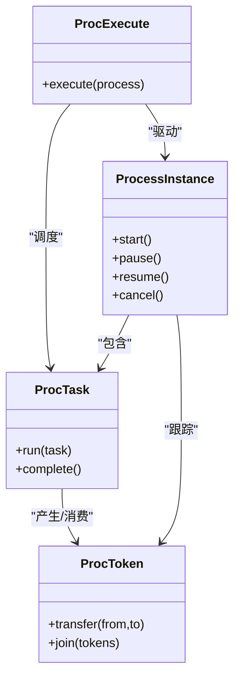
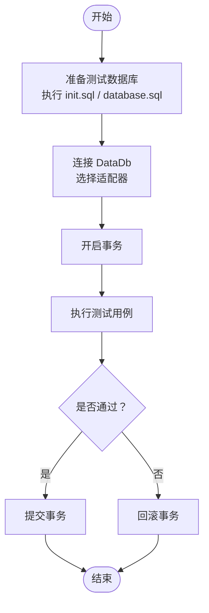
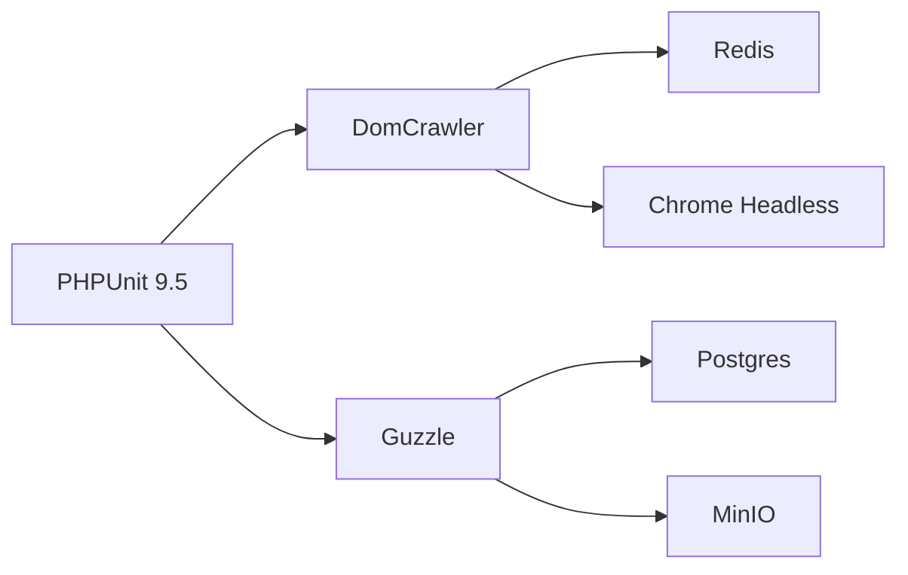

# 测试策略

<cite>
**本文引用的文件**
- [composer.json](file://process/composer.json)
- [docker-compose.yml](file://process/docker/docker-compose.yml)
- [README.MD](file://process/README.MD)
- [Base.php](file://process/src/phpunit/Base.php)
- [ZxPayTest.php](file://process/src/services/platform/ZxPayTest.php)
- [bootstrap.php](file://process/src/bootstrap.php)
- [DataDb.php](file://process/src/services/DataDb.php)
- [ProcExecute.php](file://process/src/engine/ProcExecute.php)
- [ProcTask.php](file://process/src/engine/ProcTask.php)
- [ProcToken.php](file://process/src/engine/ProcToken.php)
- [ProcessInstance.php](file://process/src/engine/ProcessInstance.php)
- [ApiController.php](file://process/src/http/ApiController.php)
- [OpenController.php](file://process/src/http/OpenController.php)
- [SystemController.php](file://process/src/http/SystemController.php)
- [UserController.php](file://process/src/http/UserController.php)
- [routes.php](file://process/src/config/routes.php)
- [database.sql](file://process/docs/sql/database.sql)
- [init.sql](file://process/docs/sql/init.sql)
- [Testorcal.php（sysu）](file://process_envs/sysu/product/task/Testorcal.php)
</cite>

## 目录
1. [引言](#引言)
2. [项目结构](#项目结构)
3. [核心组件](#核心组件)
4. [架构总览](#架构总览)
5. [详细组件分析](#详细组件分析)
6. [依赖分析](#依赖分析)
7. [性能考虑](#性能考虑)
8. [故障排查指南](#故障排查指南)
9. [结论](#结论)
10. [附录](#附录)

## 引言
本测试策略文档面向 htdNew 项目，目标是建立覆盖单元测试、集成测试、API 接口测试、流程引擎测试与数据库测试的完整测试体系，并明确测试覆盖率要求、质量门禁标准、测试数据准备、测试环境隔离以及在持续集成中的测试流程；同时给出性能测试与压力测试的实施方案建议。文档基于仓库中现有的 Composer、Docker 编排、PHP 单元测试基类、控制器与流程引擎等关键文件进行分析与落地。

## 项目结构
htdNew 采用多模块分层结构，核心目录包括：
- process/docker：容器化编排，包含 Redis、Postgres、PHP、Nginx、Chrome、MinIO 等服务
- process/src：源码主体，包含 engine（流程引擎）、http（控制器）、services（服务层）、models（模型）、helpers（工具）、components（通用组件）
- process_envs：按客户/环境划分的扩展代码与任务实现
- process/docs/sql：初始化与建库脚本
- process/README.MD：环境与运行说明

图表来源
- [docker-compose.yml](file://process/docker/docker-compose.yml#L1-L150)
- [ApiController.php](file://process/src/http/ApiController.php)
- [OpenController.php](file://process/src/http/OpenController.php)
- [SystemController.php](file://process/src/http/SystemController.php)
- [UserController.php](file://process/src/http/UserController.php)
- [ProcExecute.php](file://process/src/engine/ProcExecute.php#L1-L200)
- [ProcTask.php](file://process/src/engine/ProcTask.php#L1-L200)
- [ProcToken.php](file://process/src/engine/ProcToken.php#L1-L200)
- [ProcessInstance.php](file://process/src/engine/ProcessInstance.php#L1-L200)
- [DataDb.php](file://process/src/services/DataDb.php#L1-L120)

章节来源
- [README.MD](file://process/README.MD#L1-L158)
- [docker-compose.yml](file://process/docker/docker-compose.yml#L1-L150)

## 核心组件
- 单元测试基类：提供统一的引导与自动加载机制，便于在测试中访问应用代码与配置
- 控制器层：API、开放接口、系统与用户相关控制器，作为 API 测试的主要入口
- 流程引擎：包含执行、任务、令牌与实例等核心类，用于流程引擎测试
- 服务层：如数据库连接封装，支持多种适配器，用于数据库测试
- Docker 编排：提供稳定的测试环境，包含 Redis、Postgres、MinIO 等基础设施

章节来源
- [Base.php](file://process/src/phpunit/Base.php#L1-L16)
- [ApiController.php](file://process/src/http/ApiController.php)
- [OpenController.php](file://process/src/http/OpenController.php)
- [SystemController.php](file://process/src/http/SystemController.php)
- [UserController.php](file://process/src/http/UserController.php)
- [ProcExecute.php](file://process/src/engine/ProcExecute.php#L1-L200)
- [ProcTask.php](file://process/src/engine/ProcTask.php#L1-L200)
- [ProcToken.php](file://process/src/engine/ProcToken.php#L1-L200)
- [ProcessInstance.php](file://process/src/engine/ProcessInstance.php#L1-L200)
- [DataDb.php](file://process/src/services/DataDb.php#L1-L120)

## 架构总览
下图展示测试策略与系统组件的交互关系，强调测试环境隔离、测试数据准备与测试执行路径。

## 详细组件分析

### 单元测试编写方法与断言策略
- 测试基类与引导
  - 使用统一的测试基类以确保自动加载与引导逻辑一致，避免重复初始化
  - 建议在每个测试类构造函数中调用基类构造，确保 vendor autoload 与项目引导文件被正确加载
- 断言策略
  - 使用布尔断言验证返回值与状态
  - 对数组/对象结构使用结构断言，确保字段存在且类型正确
  - 对异常场景使用异常断言，捕获预期异常并校验消息或状态码
- 测试用例设计
  - 边界值：空输入、超长字符串、非法格式、越界索引
  - 异常分支：网络失败、权限不足、资源不存在
  - 正常路径：完整流程通过、幂等性、并发安全
- 可测试性增强
  - 将外部依赖注入可替换对象（如缓存、队列、存储），便于在测试中替换为内存实现或桩对象

章节来源
- [Base.php](file://process/src/phpunit/Base.php#L1-L16)

### API 接口测试
- 入口与路由
  - API 控制器位于 http 目录，包含 ApiController、OpenController、SystemController、UserController 等
  - 路由配置集中于 config/routes.php，建议基于路由表生成 API 测试清单
- 测试要点
  - 验证鉴权与权限控制（如注解 CheckPermit、CheckSuper）
  - 验证请求参数校验与错误响应
  - 验证响应格式一致性与状态码
  - 验证跨域与安全头设置
- 示例参考
  - 可参考平台支付测试样例的参数组织方式，构建结构化的请求体与断言

图表来源
- [docker-compose.yml](file://process/docker/docker-compose.yml#L66-L90)
- [ApiController.php](file://process/src/http/ApiController.php)
- [OpenController.php](file://process/src/http/OpenController.php)
- [SystemController.php](file://process/src/http/SystemController.php)
- [UserController.php](file://process/src/http/UserController.php)
- [routes.php](file://process/src/config/routes.php)

章节来源
- [ApiController.php](file://process/src/http/ApiController.php)
- [OpenController.php](file://process/src/http/OpenController.php)
- [SystemController.php](file://process/src/http/SystemController.php)
- [UserController.php](file://process/src/http/UserController.php)
- [routes.php](file://process/src/config/routes.php)

### 流程引擎测试
- 关键类
  - ProcExecute：流程执行器
  - ProcTask：任务节点
  - ProcToken：令牌流转
  - ProcessInstance：流程实例
- 测试维度
  - 节点执行顺序与条件判断
  - 令牌传播与汇聚
  - 实例状态变更与持久化
  - 并发与回滚场景
- 建议
  - 使用内存态的数据模型与服务，避免真实数据库与外部依赖
  - 构造典型流程图（串行、并行、分支、合并）进行回归测试

图表来源
- [ProcExecute.php](file://process/src/engine/ProcExecute.php#L1-L200)
- [ProcTask.php](file://process/src/engine/ProcTask.php#L1-L200)
- [ProcToken.php](file://process/src/engine/ProcToken.php#L1-L200)
- [ProcessInstance.php](file://process/src/engine/ProcessInstance.php#L1-L200)

章节来源
- [ProcExecute.php](file://process/src/engine/ProcExecute.php#L1-L200)
- [ProcTask.php](file://process/src/engine/ProcTask.php#L1-L200)
- [ProcToken.php](file://process/src/engine/ProcToken.php#L1-L200)
- [ProcessInstance.php](file://process/src/engine/ProcessInstance.php#L1-L200)

### 数据库测试
- 连接封装
  - DataDb 支持 MySQL、PostgreSQL、Oracle、Oracle SID 多种适配器，便于在测试中切换
- 测试策略
  - 使用 Postgres 容器作为测试数据库，初始化脚本位于 docs/sql
  - 在测试前执行初始化脚本，确保表结构与种子数据一致
  - 使用事务包裹测试用例，失败回滚，保证测试隔离
- 示例参考
  - process_envs 中存在直接使用 PDO 访问 Oracle 的测试样例，可用于验证跨库连接与 SQL 执行

图表来源
- [DataDb.php](file://process/src/services/DataDb.php#L1-L120)
- [database.sql](file://process/docs/sql/database.sql)
- [init.sql](file://process/docs/sql/init.sql)
- [Testorcal.php（sysu）](file://process_envs/sysu/product/task/Testorcal.php#L1-L47)

章节来源
- [DataDb.php](file://process/src/services/DataDb.php#L1-L120)
- [database.sql](file://process/docs/sql/database.sql)
- [init.sql](file://process/docs/sql/init.sql)
- [Testorcal.php（sysu）](file://process_envs/sysu/product/task/Testorcal.php#L1-L47)

### 集成测试与模拟对象
- 测试环境
  - 使用 docker-compose 启动 Redis、Postgres、MinIO、Chrome 等服务，确保与生产相近的依赖环境
- 模拟对象
  - 缓存：使用内存型缓存替代 Redis
  - 队列：使用内存队列或桩队列
  - 存储：使用本地临时目录或 MinIO 的测试桶
- 测试数据准备
  - 通过 init.sql 与 database.sql 提供标准化初始数据
  - 使用 fixtures 或工厂模式生成测试数据，确保可重复性
- 环境隔离
  - 每个测试套件独立数据库与命名空间，避免相互污染
  - 使用随机端口与容器别名，避免冲突

章节来源
- [docker-compose.yml](file://process/docker/docker-compose.yml#L1-L150)
- [README.MD](file://process/README.MD#L21-L38)

### 测试覆盖率与质量门禁
- 覆盖率要求（建议）
  - 单元测试：关键业务逻辑达到 80%+ 行覆盖率
  - API 测试：主要接口路径 100% 场景覆盖
  - 流程引擎测试：关键流程图 100% 分支覆盖
  - 数据库测试：DDL/DML 覆盖率达到 90%+
- 质量门禁（建议）
  - 未达覆盖率阈值的分支禁止合入
  - 严重缺陷（P0）必须修复并通过回归测试
  - 性能指标不达标（如平均响应时间、错误率）暂停发布

## 依赖分析
- 测试框架与工具
  - PHPUnit 9.5 作为核心测试框架
  - Symfony DomCrawler 用于 HTML 解析与断言
  - Guzzle 用于 HTTP 客户端测试
- 外部依赖
  - Redis、Postgres、MinIO、Chrome Headless 通过 Docker 提供
- 自动加载与引导
  - 通过 bootstrap.php 与 composer autoload 实现 PSR-4 自动加载

图表来源
- [composer.json](file://process/composer.json#L1-L70)
- [docker-compose.yml](file://process/docker/docker-compose.yml#L1-L150)
- [bootstrap.php](file://process/src/bootstrap.php#L1-L40)

章节来源
- [composer.json](file://process/composer.json#L1-L70)
- [bootstrap.php](file://process/src/bootstrap.php#L1-L40)

## 性能考虑
- 性能测试
  - 使用 ab、wrk 或 JMeter 对关键 API 进行并发压测，记录吞吐量、P95/P99 延迟与错误率
  - 对流程引擎的关键节点进行链路耗时分析，定位瓶颈
- 压力测试
  - 逐步提升并发与数据规模，观察数据库连接池、Redis 缓存命中率与 GC 行为
  - 结合 Grafana/日志监控评估系统稳定性
- 优化建议
  - 合理使用缓存与批量操作，减少数据库往返
  - 对热点接口启用连接复用与异步处理

## 故障排查指南
- 常见问题
  - 自动加载失败：确认 vendor autoload 已生成，测试基类正确引入引导文件
  - 数据库连接异常：检查 Postgres 容器状态、初始化脚本执行与凭据
  - Redis/缓存不可用：确认 Redis 容器端口映射与网络别名
- 排查步骤
  - 使用 docker-compose ps 查看容器状态
  - 查看容器日志以定位错误堆栈
  - 在测试中打印关键变量与 SQL，辅助定位

章节来源
- [README.MD](file://process/README.MD#L70-L97)
- [docker-compose.yml](file://process/docker/docker-compose.yml#L1-L150)

## 结论
本策略文档从测试基类、API、流程引擎、数据库与集成环境五个方面给出了可操作的测试方案，并结合现有仓库配置明确了覆盖率与质量门禁建议。建议在 CI 中自动化执行单元测试与集成测试，结合性能测试形成闭环，持续提升系统质量与稳定性。

## 附录
- 测试数据准备清单
  - 初始化 SQL：database.sql、init.sql
  - 种子数据：按模块准备最小可用数据集
  - fixtures：按需生成，确保可重复与可清理
- 测试环境配置
  - 使用 docker-compose 启动 Redis、Postgres、MinIO、Chrome
  - 本地 hosts 绑定与端口映射需与 README 保持一致
- API 测试清单模板
  - 路由表导出为测试清单，覆盖正常、异常、边界三种场景
- 流程引擎测试清单模板
  - 串行、并行、分支、汇聚、回滚等典型流程图逐一验证