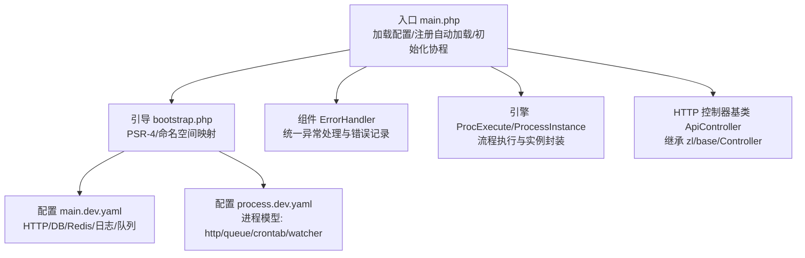
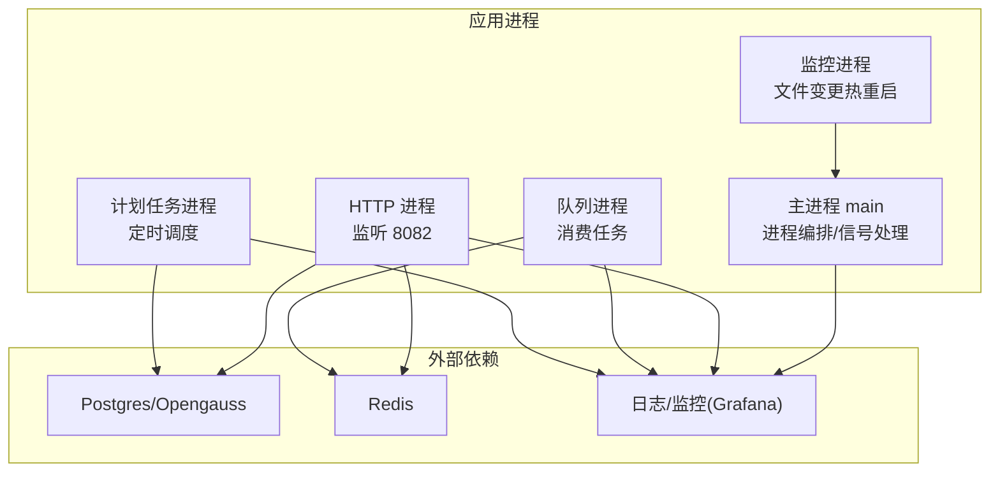
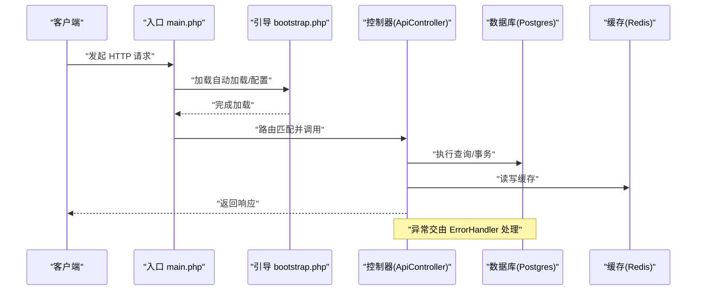
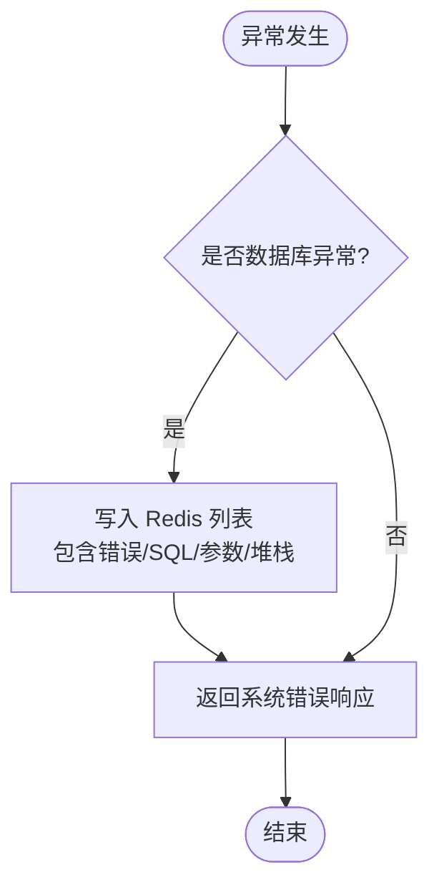
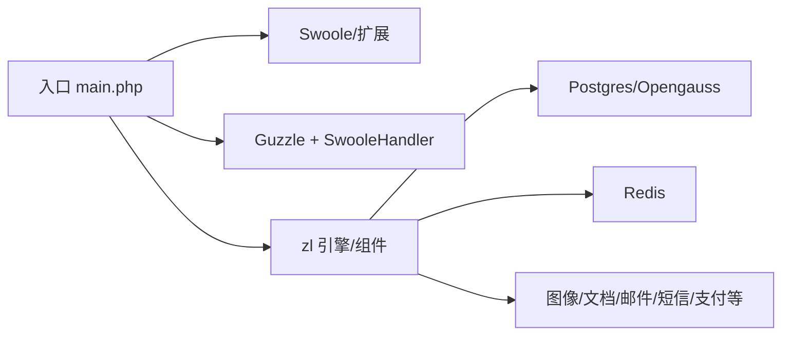

# 调试技巧

<cite>
**本文引用的文件**
- [process/README.MD](file://process/README.MD)
- [process/composer.json](file://process/composer.json)
- [process/src/main.php](file://process/src/main.php)
- [process/src/bootstrap.php](file://process/src/bootstrap.php)
- [process/src/config/main.dev.yaml](file://process/src/config/main.dev.yaml)
- [process/src/config/process.dev.yaml](file://process/src/config/process.dev.yaml)
- [process/src/config/process.prod.yaml](file://process/src/config/process.prod.yaml)
- [process/src/components/ErrorHandler.php](file://process/src/components/ErrorHandler.php)
- [process/src/engine/ProcExecute.php](file://process/src/engine/ProcExecute.php)
- [process/src/engine/ProcessInstance.php](file://process/src/engine/ProcessInstance.php)
- [process/src/http/ApiController.php](file://process/src/http/ApiController.php)
</cite>

## 目录
1. [简介](#简介)
2. [项目结构](#项目结构)
3. [核心组件](#核心组件)
4. [架构总览](#架构总览)
5. [详细组件分析](#详细组件分析)
6. [依赖分析](#依赖分析)
7. [性能考虑](#性能考虑)
8. [故障排查指南](#故障排查指南)
9. [结论](#结论)
10. [附录](#附录)

## 简介
本调试技巧文档面向 htdNew 项目，聚焦于 Swoole 协程调试、异步任务与队列调试、多进程调试策略，以及 HTTP 请求、流程引擎、数据库查询的调试方法。同时覆盖日志分析、错误追踪、性能瓶颈定位、常用工具使用、断点与变量检查、开发与生产环境差异及常见问题快速诊断。

## 项目结构
htdNew 采用 Swoole 驱动的多进程架构，结合 ZL 引擎与自研组件，支持协程化网络 I/O、异步队列与计划任务。核心入口加载配置并引导运行时，自动加载机制支持按命名空间分发加载 vendor、runtime 与 envs 代码。

图表来源
- [process/src/main.php](file://process/src/main.php#L1-L25)
- [process/src/bootstrap.php](file://process/src/bootstrap.php#L1-L40)
- [process/src/config/main.dev.yaml](file://process/src/config/main.dev.yaml#L1-L97)
- [process/src/config/process.dev.yaml](file://process/src/config/process.dev.yaml#L1-L89)
- [process/src/components/ErrorHandler.php](file://process/src/components/ErrorHandler.php#L1-L26)
- [process/src/engine/ProcExecute.php](file://process/src/engine/ProcExecute.php#L1-L11)
- [process/src/engine/ProcessInstance.php](file://process/src/engine/ProcessInstance.php#L1-L11)
- [process/src/http/ApiController.php](file://process/src/http/ApiController.php#L1-L9)

章节来源
- [process/src/main.php](file://process/src/main.php#L1-L25)
- [process/src/bootstrap.php](file://process/src/bootstrap.php#L1-L40)
- [process/src/config/main.dev.yaml](file://process/src/config/main.dev.yaml#L1-L97)
- [process/src/config/process.dev.yaml](file://process/src/config/process.dev.yaml#L1-L89)

## 核心组件
- 自动加载与命名空间映射：通过 bootstrap.php 的 spl_autoload_register 实现对 zl、runtime、envs 的动态加载，便于开发期热更新与多租户隔离。
- 错误处理器：ErrorHandler 将数据库异常写入 Redis 列表并返回系统错误响应，便于集中排查。
- 引擎适配层：ProcExecute/ProcessInstance 对上游引擎进行轻量封装，确保序列化对象兼容性。
- HTTP 基类：ApiController 统一控制器抽象，便于扩展中间件与拦截器。

章节来源
- [process/src/bootstrap.php](file://process/src/bootstrap.php#L1-L40)
- [process/src/components/ErrorHandler.php](file://process/src/components/ErrorHandler.php#L1-L26)
- [process/src/engine/ProcExecute.php](file://process/src/engine/ProcExecute.php#L1-L11)
- [process/src/engine/ProcessInstance.php](file://process/src/engine/ProcessInstance.php#L1-L11)
- [process/src/http/ApiController.php](file://process/src/http/ApiController.php#L1-L9)

## 架构总览
Swoole 协程 + 多进程模型，HTTP/Queue/Crontab/Watcher 等进程分工明确；DB/Redis 作为外部依赖；日志与错误集中管理。

图表来源
- [process/src/config/process.dev.yaml](file://process/src/config/process.dev.yaml#L1-L89)
- [process/README.MD](file://process/README.MD#L47-L65)

章节来源
- [process/src/config/process.dev.yaml](file://process/src/config/process.dev.yaml#L1-L89)
- [process/README.MD](file://process/README.MD#L47-L65)

## 详细组件分析

### Swoole 协程调试
- 启用协程钩子：入口启用全量 Hook，确保阻塞 I/O 非阻塞化，便于协程切换与并发调试。
- 断点与协程上下文：在 IDE 中设置断点，观察协程 ID 与切换轨迹；避免在协程中使用阻塞函数。
- 协程池与资源：关注协程并发度与资源占用，必要时限制并发或引入限流。
- 协程异常：捕获顶层异常并记录，结合日志定位协程内错误栈。

章节来源
- [process/src/main.php](file://process/src/main.php#L1-L25)

### 异步任务与队列调试
- 队列进程：process.dev.yaml 中定义队列进程，配置消费者数量与业务配置文件路径。
- 生产者与消费者：确认消息入队与出队链路，检查 Redis 队列键与消费者拉取逻辑。
- 重试与死信：为失败任务设计重试与死信处理，避免无限循环。
- 性能观测：监控队列积压、消费耗时与失败率。

章节来源
- [process/src/config/process.dev.yaml](file://process/src/config/process.dev.yaml#L55-L62)

### 多进程调试策略
- 进程拆分：HTTP/Queue/Crontab/Watcher 分工清晰，分别独立调试。
- CPU 亲和：可选配置 CPU 亲和，避免进程抢占导致抖动。
- 平滑重启：使用信号平滑重启工作进程，减少对线上影响。
- 文件监控：开发环境启用 inotify 监控，自动重启工作进程。

章节来源
- [process/src/config/process.dev.yaml](file://process/src/config/process.dev.yaml#L24-L31)
- [process/README.MD](file://process/README.MD#L93-L96)

### HTTP 请求调试
- 入口与路由：通过入口加载配置与自动加载，控制器基类统一处理请求。
- 请求链路：从入口到控制器，再到业务与外部依赖，逐段验证。
- 响应与错误：统一由错误处理器返回系统错误，便于前端与接口调试。

图表来源
- [process/src/main.php](file://process/src/main.php#L1-L25)
- [process/src/bootstrap.php](file://process/src/bootstrap.php#L1-L40)
- [process/src/http/ApiController.php](file://process/src/http/ApiController.php#L1-L9)
- [process/src/components/ErrorHandler.php](file://process/src/components/ErrorHandler.php#L1-L26)

章节来源
- [process/src/http/ApiController.php](file://process/src/http/ApiController.php#L1-L9)
- [process/src/components/ErrorHandler.php](file://process/src/components/ErrorHandler.php#L1-L26)

### 流程引擎调试
- 引擎适配：ProcExecute/ProcessInstance 对上游引擎进行轻量封装，保持序列化对象稳定。
- 调试要点：关注流程节点执行顺序、令牌流转与实例状态；结合日志与断点定位异常节点。
- 数据一致性：序列化存储时避免删除或重命名关键类，防止反序列化失败。

章节来源
- [process/src/engine/ProcExecute.php](file://process/src/engine/ProcExecute.php#L1-L11)
- [process/src/engine/ProcessInstance.php](file://process/src/engine/ProcessInstance.php#L1-L11)

### 数据库查询调试
- 连接与模式：Postgres/Opengauss，Schema 类型与连接类在配置中声明。
- 错误收集：数据库异常会被统一写入 Redis 列表，保留 SQL、参数与堆栈，便于回溯。
- 查询优化：结合慢查询日志与执行计划，定位热点 SQL。

图表来源
- [process/src/components/ErrorHandler.php](file://process/src/components/ErrorHandler.php#L1-L26)

章节来源
- [process/src/config/main.dev.yaml](file://process/src/config/main.dev.yaml#L23-L32)
- [process/src/components/ErrorHandler.php](file://process/src/components/ErrorHandler.php#L1-L26)

## 依赖分析
- 运行时与扩展：Swoole、swoole_postgresql、redis、yaml、inotify（开发）、fileinfo。
- HTTP 客户端：Guzzle + Swoole Handler，协程化网络请求。
- 工具与组件：Doctrine Cache、Intervention/Image、PhpOffice、MQTT/Kafka 客户端等。

图表来源
- [process/src/main.php](file://process/src/main.php#L1-L25)
- [process/composer.json](file://process/composer.json#L1-L70)

章节来源
- [process/composer.json](file://process/composer.json#L1-L70)

## 性能考虑
- 协程并发：合理设置并发度，避免过多协程导致上下文切换开销。
- I/O 非阻塞：确保所有网络与磁盘 I/O 在协程环境下非阻塞。
- 缓存命中：优先使用 Redis 缓存热点数据，降低数据库压力。
- 队列削峰：通过队列异步化突发请求，避免瞬时拥塞。
- 监控与告警：利用 Grafana 等平台观测 CPU、内存、QPS、错误率与队列积压。

## 故障排查指南
- 日志级别：开发环境建议 debug，生产环境按需调整，避免过量日志。
- 错误追踪：数据库异常写入 Redis 列表，结合堆栈与 SQL 参数快速定位。
- 平滑重启：使用信号重启工作进程，避免中断服务。
- 环境差异：
  - 开发：启用 inotify，便于热重启；可安装 vim 等工具。
  - 生产：禁用部分错误输出，镜像更精简，无 vim 等工具。
- 常见问题：
  - 协程阻塞：检查是否存在阻塞 I/O 或长耗时同步操作。
  - 队列积压：检查消费者数量、处理耗时与失败重试策略。
  - 进程卡死：通过信号重启或查看进程日志定位。
  - 数据库连接：确认连接参数与超时设置，避免连接池枯竭。

章节来源
- [process/src/config/main.dev.yaml](file://process/src/config/main.dev.yaml#L66-L68)
- [process/src/config/process.dev.yaml](file://process/src/config/process.dev.yaml#L24-L31)
- [process/README.MD](file://process/README.MD#L71-L76)
- [process/README.MD](file://process/README.MD#L93-L96)
- [process/src/components/ErrorHandler.php](file://process/src/components/ErrorHandler.php#L1-L26)

## 结论
通过协程化改造、多进程分工与统一错误处理，htdNew 在高并发场景下具备良好的可调试性与可观测性。建议在开发阶段充分利用自动加载与热重启能力，在生产阶段强化日志与监控，并建立完善的异常收集与恢复机制。

## 附录
- 常用调试工具
  - 日志：查看 runtime/log 目录日志，结合 Grafana 观测指标。
  - 数据库：使用 psql 连接 Postgres/Opengauss，执行 EXPLAIN/ANALYZE 分析慢查询。
  - 队列：检查 Redis 队列键与消费者状态，确认消息堆积情况。
  - 进程：使用进程名与信号进行平滑重启与状态检查。
- 断点与变量检查
  - 在 IDE 中为关键业务函数设置断点，观察协程上下文与变量。
  - 对数据库操作前后分别断点，核对 SQL 与参数。
- 开发与生产差异
  - 开发：启用 inotify，镜像包含开发工具；生产：禁用部分错误输出，镜像精简。
- 常见问题快速诊断
  - 页面 500：查看最近日志与 Redis 错误列表，定位异常 SQL 与堆栈。
  - 接口超时：检查协程并发与阻塞点，评估数据库与外部依赖延迟。
  - 队列不消费：核对消费者数量、失败重试与死信处理策略。