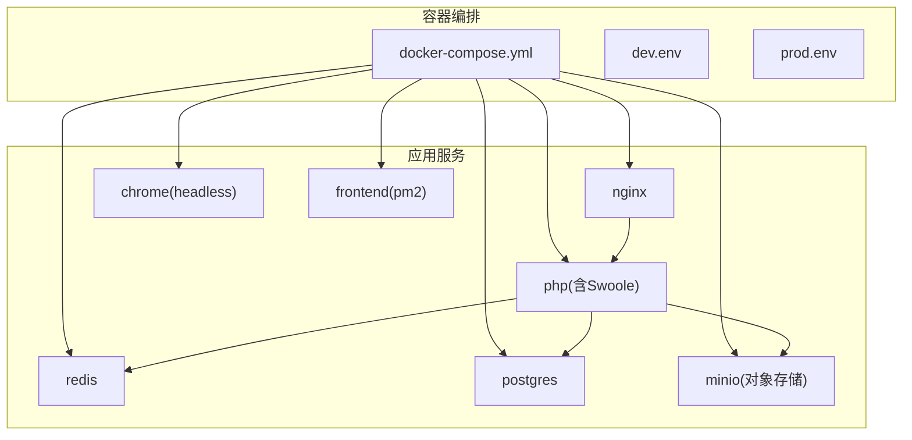
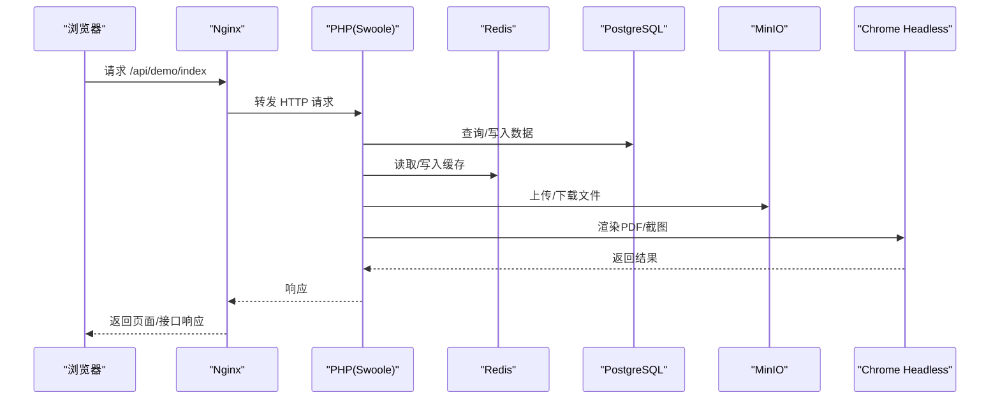
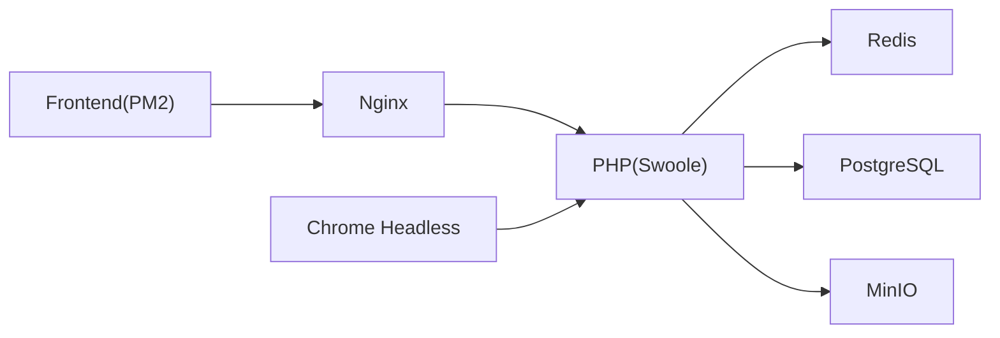

# 快速开始

<cite>
**本文引用的文件**
- [process/README.MD](file://process/README.MD)
- [process/composer.json](file://process/composer.json)
- [process/docker/dev.env](file://process/docker/dev.env)
- [process/docker/prod.env](file://process/docker/prod.env)
- [process/docker/docker-compose.yml](file://process/docker/docker-compose.yml)
- [process/docs/sql/database.sql](file://process/docs/sql/database.sql)
- [process/docs/sql/init.sql](file://process/docs/sql/init.sql)
- [process/src/config/main.dev.yaml](file://process/src/config/main.dev.yaml)
- [process/src/config/process.dev.yaml](file://process/src/config/process.dev.yaml)
- [process/src/bootstrap.php](file://process/src/bootstrap.php)
- [process/src/main.php](file://process/src/main.php)
- [process/src/config/http.php](file://process/src/config/http.php)
- [process/docker/services/php/Dockerfile](file://process/docker/services/php/Dockerfile)
- [process/docker/services/php.prod/Dockerfile](file://process/docker/services/php.prod/Dockerfile)
- [process/docker/services/php/php.ini](file://process/docker/services/php/php.ini)
</cite>

## 目录
1. [简介](#简介)
2. [项目结构](#项目结构)
3. [核心组件](#核心组件)
4. [架构总览](#架构总览)
5. [详细组件解析](#详细组件解析)
6. [依赖关系分析](#依赖关系分析)
7. [性能注意事项](#性能注意事项)
8. [故障排查指南](#故障排查指南)
9. [结论](#结论)
10. [附录](#附录)

## 简介
本指南面向首次接触 htdNew（htdNew）项目的开发者，帮助你在本地快速搭建并运行项目，完成首次启动与验证。你将获得：
- 环境要求与依赖安装步骤
- Docker 开发环境配置与启动流程
- 环境变量设置与数据库初始化
- 前端构建与静态资源准备
- 首次运行验证步骤与常见问题解决

## 项目结构
htdNew 采用“容器化 + Swoole + PostgreSQL/Redis”的技术栈，核心由以下部分组成：
- process/docker：Docker 编排与服务镜像构建配置
- process/src：PHP 应用源码与配置
- process/docs/sql：数据库初始化 SQL
- process/vendor：Composer 依赖

图表来源
- [process/docker/docker-compose.yml](file://process/docker/docker-compose.yml#L1-L150)
- [process/docker/dev.env](file://process/docker/dev.env#L1-L50)
- [process/docker/prod.env](file://process/docker/prod.env#L1-L46)

章节来源
- [process/docker/docker-compose.yml](file://process/docker/docker-compose.yml#L1-L150)
- [process/docker/dev.env](file://process/docker/dev.env#L1-L50)
- [process/docker/prod.env](file://process/docker/prod.env#L1-L46)

## 核心组件
- PHP + Swoole：作为 HTTP 服务器与业务进程承载者，负责路由、控制器、服务层与队列/定时任务等。
- PostgreSQL：持久化存储，包含大量业务表与初始数据。
- Redis：缓存与队列支撑。
- Nginx：反向代理与静态资源服务。
- Chrome Headless：用于 PDF 渲染与截图等场景。
- MinIO：兼容 S3 的对象存储，用于上传文件。
- 前端服务（PM2）：本地开发时提供静态资源服务。

章节来源
- [process/src/main.php](file://process/src/main.php#L1-L25)
- [process/src/config/main.dev.yaml](file://process/src/config/main.dev.yaml#L1-L97)
- [process/src/config/process.dev.yaml](file://process/src/config/process.dev.yaml#L1-L89)
- [process/docker/docker-compose.yml](file://process/docker/docker-compose.yml#L1-L150)

## 架构总览
下图展示了本地开发环境的典型交互路径：浏览器访问 Nginx，Nginx 将请求转发给 PHP（Swoole），PHP 通过配置连接 Redis 与 PostgreSQL，并调用 MinIO 与 Chrome Headless 完成业务处理。

图表来源
- [process/docker/docker-compose.yml](file://process/docker/docker-compose.yml#L1-L150)
- [process/src/config/main.dev.yaml](file://process/src/config/main.dev.yaml#L1-L97)
- [process/src/config/http.php](file://process/src/config/http.php#L1-L27)

## 详细组件解析

### 环境要求与依赖安装
- 语言与扩展
  - PHP 8.1+
  - Swoole 5.0+
  - PostgreSQL 12 或 OpenGauss
  - Redis 5+
  - 必需扩展：swoole、swoole_postgresql、redis、yaml、fileinfo
  - 可选扩展：inotify（开发环境提升热更新体验）
- Composer 依赖
  - 项目通过 Composer 管理第三方库与框架依赖，建议使用国内镜像加速（见仓库配置）。
- 前端构建
  - 需要 Node.js，执行安装与构建命令生成静态资源。

章节来源
- [process/README.MD](file://process/README.MD#L1-L158)
- [process/composer.json](file://process/composer.json#L1-L70)

### Docker 开发环境配置与启动
- 准备环境变量
  - 复制开发环境变量文件到项目根目录并按需调整。
  - 复制主配置文件到运行目录，确保 PHP 进程加载正确。
- 启动容器
  - 使用 docker-compose 构建并启动所有服务。
- 访问与验证
  - 在本机 hosts 中添加域名映射。
  - 浏览器访问示例接口，若返回成功文本则表示启动成功。

章节来源
- [process/README.MD](file://process/README.MD#L21-L38)
- [process/docker/dev.env](file://process/docker/dev.env#L1-L50)
- [process/docker/docker-compose.yml](file://process/docker/docker-compose.yml#L1-L150)

### 数据库初始化
- 初始化 SQL
  - 首次启动时，PostgreSQL 容器会执行初始化脚本，创建基础表与初始数据。
- 建库脚本
  - 提供完整的建库脚本，包含大量业务表定义与索引。
- 常用命令
  - 可通过命令行工具执行数据库迁移与升级脚本（如创建/执行迁移）。

章节来源
- [process/docs/sql/init.sql](file://process/docs/sql/init.sql#L1-L86)
- [process/docs/sql/database.sql](file://process/docs/sql/database.sql#L1-L200)
- [process/README.MD](file://process/README.MD#L105-L118)

### 前端构建与静态资源
- 本地开发
  - 安装 Node.js 后执行安装与构建命令，生成静态资源。
  - 将构建产物放置于与服务器同级目录，由前端服务或 Nginx 提供。
- 生产环境
  - 前端服务指向 dist 目录，提供静态资源。

章节来源
- [process/README.MD](file://process/README.MD#L145-L151)
- [process/docker/prod.env](file://process/docker/prod.env#L1-L46)

### 配置文件说明
- 主配置（main.dev.yaml）
  - 定义通用配置、HTTP 监听、数据库、Redis、上传、队列、日志等。
- 进程配置（process.dev.yaml）
  - 定义主进程、HTTP 工作进程、队列进程、计划任务进程等的运行参数。
- HTTP 组件配置
  - 合并通用组件与 HTTP 特定组件，统一注入到 Swoole HTTP 服务。
- 自动加载与入口
  - 入口文件加载 Composer 自动加载、引导文件与配置，启动主进程并处理命令行参数。

章节来源
- [process/src/config/main.dev.yaml](file://process/src/config/main.dev.yaml#L1-L97)
- [process/src/config/process.dev.yaml](file://process/src/config/process.dev.yaml#L1-L89)
- [process/src/config/http.php](file://process/src/config/http.php#L1-L27)
- [process/src/bootstrap.php](file://process/src/bootstrap.php#L1-L40)
- [process/src/main.php](file://process/src/main.php#L1-L25)

### PHP 镜像与扩展
- 开发镜像
  - 基于指定 Swoole + PHP 版本的基础镜像，安装必要扩展与依赖。
- 生产镜像
  - 针对生产环境优化，包含 Oracle 客户端等额外依赖。
- PHP 配置
  - 提供默认 php.ini，包含时区、上传限制、错误日志等基础配置。

章节来源
- [process/docker/services/php/Dockerfile](file://process/docker/services/php/Dockerfile#L1-L38)
- [process/docker/services/php.prod/Dockerfile](file://process/docker/services/php.prod/Dockerfile#L1-L82)
- [process/docker/services/php/php.ini](file://process/docker/services/php/php.ini#L1-L152)

## 依赖关系分析
- 组件耦合
  - PHP 进程依赖 Redis 与 PostgreSQL；Nginx 作为入口代理；MinIO 提供对象存储；Chrome Headless 支持渲染。
- 外部依赖
  - Composer 依赖集中于 vendor；Docker 依赖于官方镜像与自定义构建。
- 运行时配置
  - 通过环境变量控制端口、卷挂载、时区与域名等。

图表来源
- [process/docker/docker-compose.yml](file://process/docker/docker-compose.yml#L1-L150)
- [process/src/config/main.dev.yaml](file://process/src/config/main.dev.yaml#L1-L97)

章节来源
- [process/docker/docker-compose.yml](file://process/docker/docker-compose.yml#L1-L150)
- [process/src/config/main.dev.yaml](file://process/src/config/main.dev.yaml#L1-L97)

## 性能注意事项
- 进程数量与 CPU 亲和
  - 根据 CPU 核心数合理分配 HTTP 工作进程数量，确保主服务独占核心。
- 日志级别与上传大小
  - 开发环境可开启调试日志；生产环境建议降低日志级别并限制上传大小。
- 缓存与队列
  - 合理设置 Redis 与队列消费者数量，避免过载。

章节来源
- [process/src/config/process.dev.yaml](file://process/src/config/process.dev.yaml#L1-L89)
- [process/src/config/main.dev.yaml](file://process/src/config/main.dev.yaml#L1-L97)

## 故障排查指南
- 无法访问页面
  - 检查 hosts 是否正确映射域名。
  - 确认 Nginx 与 PHP 容器均处于健康状态。
- 数据库连接失败
  - 校验数据库端口、账号与密码是否与配置一致。
  - 查看初始化脚本是否执行成功。
- Redis 连接异常
  - 确认 Redis 端口与网络连通性。
- 文件上传失败
  - 检查 MinIO 端点、密钥与桶名配置。
- 平滑重启
  - 使用信号平滑重启 PHP 主进程，避免中断业务。

章节来源
- [process/README.MD](file://process/README.MD#L70-L104)
- [process/src/config/main.dev.yaml](file://process/src/config/main.dev.yaml#L1-L97)

## 结论
通过本指南，你可以基于 Docker 在本地快速搭建 htdNew 的开发环境，完成依赖安装、数据库初始化与前端构建，并通过示例接口验证项目已成功启动。后续可根据团队规范调整配置与部署策略。

## 附录

### 首次运行验证步骤
- 准备环境变量与配置
  - 复制开发环境变量文件与主配置文件到运行目录。
- 启动容器
  - 使用 docker-compose 启动所有服务。
- 配置本机 hosts
  - 将项目域名映射到 127.0.0.1。
- 访问示例接口
  - 打开浏览器访问示例地址，确认返回成功文本。
- 如需前端页面
  - 安装 Node.js 并执行构建命令，将产物放置于前端服务可访问目录。

章节来源
- [process/README.MD](file://process/README.MD#L21-L38)
- [process/docker/dev.env](file://process/docker/dev.env#L1-L50)
- [process/docker/docker-compose.yml](file://process/docker/docker-compose.yml#L1-L150)