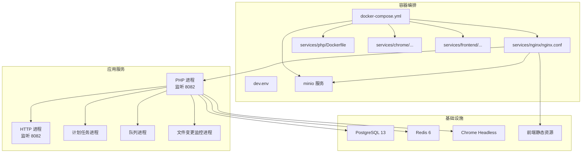
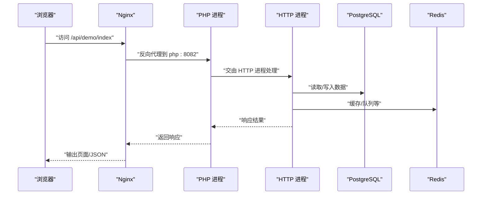
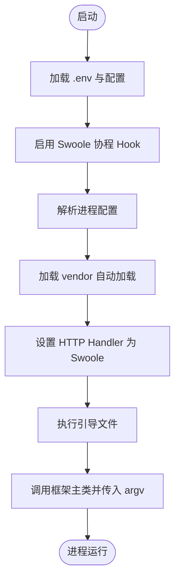

# 快速开始

<cite>
**本文引用的文件**
- [README.MD](file://process/README.MD)
- [composer.json](file://process/composer.json)
- [docker-compose.yml](file://process/docker/docker-compose.yml)
- [dev.env](file://process/docker/dev.env)
- [main.php](file://process/src/main.php)
- [process.dev.yaml](file://process/src/config/process.dev.yaml)
- [main.dev.yaml](file://process/src/config/main.dev.yaml)
- [http.php](file://process/src/config/http.php)
- [bootstrap.php](file://process/src/bootstrap.php)
- [database.sql](file://process/docs/sql/database.sql)
- [nginx.conf](file://process/docker/services/nginx/nginx.conf)
- [Dockerfile](file://process/docker/services/php/Dockerfile)
- [routes.php](file://process/src/config/routes.php)
</cite>

## 目录
1. [简介](#简介)
2. [项目结构](#项目结构)
3. [核心组件](#核心组件)
4. [架构总览](#架构总览)
5. [详细组件分析](#详细组件分析)
6. [依赖分析](#依赖分析)
7. [性能注意事项](#性能注意事项)
8. [故障排查指南](#故障排查指南)
9. [结论](#结论)
10. [附录](#附录)

## 简介
本指南面向初学者，带你从零开始完成海天达新流程引擎的安装与配置，涵盖环境要求、Docker 部署、本地开发环境搭建、数据库与 Redis 初始化、Chrome Headless 服务、项目启动流程、入口文件说明以及一个 Hello World 示例。同时提供常见问题排查建议，帮助你快速上手。

## 项目结构
该工程采用“源码 + Docker 编排 + 配置 + 文档”的分层组织方式：
- process/docker：容器编排与服务镜像构建（Nginx、PHP、PostgreSQL、Redis、Chrome Headless、MinIO、前端）
- process/src：PHP 源码与配置（入口、引导、路由、HTTP 组件、引擎、模型、服务等）
- process/docs/sql：数据库初始化 SQL
- process_envs：按客户/环境隔离的业务扩展代码

图表来源
- [docker-compose.yml](file://process/docker/docker-compose.yml#L1-L150)
- [dev.env](file://process/docker/dev.env#L1-L50)
- [nginx.conf](file://process/docker/services/nginx/nginx.conf#L62-L67)
- [Dockerfile](file://process/docker/services/php/Dockerfile#L1-L38)

章节来源
- [README.MD](file://process/README.MD#L119-L142)
- [docker-compose.yml](file://process/docker/docker-compose.yml#L1-L150)

## 核心组件
- 入口与引导
  - 入口文件负责加载配置、注册自动加载、设置 Swoole 协程 Hook，并启动主框架。
  - 引导文件负责 PSR-4 自动加载与运行时代码加载。
- 配置体系
  - 进程与业务配置分离：进程配置（process.dev.yaml）、通用配置（main.dev.yaml）、HTTP 组件配置（http.php）。
- 服务编排
  - 通过 docker-compose 启动 Nginx、PHP、PostgreSQL、Redis、Chrome Headless、MinIO、前端服务，并建立内部网络互通。

章节来源
- [main.php](file://process/src/main.php#L1-L25)
- [bootstrap.php](file://process/src/bootstrap.php#L1-L40)
- [process.dev.yaml](file://process/src/config/process.dev.yaml#L1-L89)
- [main.dev.yaml](file://process/src/config/main.dev.yaml#L1-L97)
- [http.php](file://process/src/config/http.php#L1-L27)

## 架构总览
下图展示了从浏览器到后端服务的典型请求链路，以及后端内部进程间的协作关系。

图表来源
- [nginx.conf](file://process/docker/services/nginx/nginx.conf#L86-L94)
- [process.dev.yaml](file://process/src/config/process.dev.yaml#L33-L53)
- [main.dev.yaml](file://process/src/config/main.dev.yaml#L13-L15)

## 详细组件分析

### 环境要求与安装准备
- 运行时要求
  - PHP 8.1+（推荐 8.2）
  - Swoole 5.0+
  - PostgreSQL 12 或 OpenGauss
  - Redis 5+
  - PHP 扩展：swoole、swoole_postgresql、redis、yaml、inotify（开发）、fileinfo
- 本地安装（非容器）
  - 安装 PHP 与扩展
  - 安装并启动 PostgreSQL 与 Redis
  - 安装 Composer 并执行依赖安装
  - 初始化数据库与 Redis
  - 启动 HTTP 进程监听端口
- Docker 部署（推荐）
  - 使用 docker-compose 启动所有服务
  - 通过 .env 文件设置环境变量
  - 通过 initdb 脚本初始化数据库

章节来源
- [README.MD](file://process/README.MD#L1-L14)
- [composer.json](file://process/composer.json#L9-L47)
- [Dockerfile](file://process/docker/services/php/Dockerfile#L17-L26)

### Docker 部署配置详解
- docker-compose.yml 关键点
  - 服务定义：redis、postgres、php、nginx、chrome、frontend、minio
  - 网络：统一名为 process 的内部网络，便于服务间通过主机名通信
  - 端口映射：Nginx 映射 80->80；PostgreSQL 映射 5555->5432；Redis 映射 6380->6379；MinIO 控制台 9001->9001
  - 挂载卷：源码、公共目录、运行时、日志目录、字体目录
  - 依赖关系：php 依赖 redis、postgres、chrome
  - PHP 命令：以 /www/src/server/src/main.php 作为入口
- dev.env 环境变量
  - 项目前缀、时区、Redis、Nginx、PHP、PostgreSQL、Chrome、前端路径等
  - 注意：Nginx 监听端口与 PHP 监听端口需保持一致（Nginx 代理到 php:8082）

章节来源
- [docker-compose.yml](file://process/docker/docker-compose.yml#L1-L150)
- [dev.env](file://process/docker/dev.env#L1-L50)

### 本地开发环境搭建
- 数据库初始化
  - 使用 docker-compose 启动后，PostgreSQL 会自动执行 initdb 中的 SQL 文件进行建表
  - 若需手动执行，可在容器内连接数据库并执行 SQL
- Redis 配置
  - 默认使用 redis:6379，可通过 main.dev.yaml 调整
- Chrome Headless
  - 通过 chrome 服务提供无头浏览器能力，用于 PDF 渲染等场景
- Nginx 反向代理
  - 将 /fe 前缀转发到前端服务，将 / 路径转发到 PHP 进程
  - 支持 MinIO 对象存储代理

章节来源
- [database.sql](file://process/docs/sql/database.sql#L1-L20)
- [nginx.conf](file://process/docker/services/nginx/nginx.conf#L72-L100)
- [main.dev.yaml](file://process/src/config/main.dev.yaml#L23-L37)

### 项目启动流程与入口文件
- 入口文件 main.php
  - 启用 Swoole 协程 Hook
  - 解析进程配置，设置基础路径与命名空间
  - 加载 vendor 自动加载
  - 设置默认 HTTP Handler 为 Swoole Handler
  - 调用框架主类并传入 CLI 参数
- 引导文件 bootstrap.php
  - 动态注册自动加载器，支持 zl、runtime、envs 命名空间
  - 通过扫描 src 目录实现模块级自动加载
- 进程配置 process.dev.yaml
  - 定义主进程、HTTP 进程、队列进程、计划任务进程、文件变更监控进程
  - HTTP 进程监听 8082 端口，数量可根据 CPU 核心数调整
- HTTP 组件配置 http.php
  - 合并通用组件与 HTTP 组件
  - 错误处理器使用自定义组件

图表来源
- [main.php](file://process/src/main.php#L7-L24)
- [bootstrap.php](file://process/src/bootstrap.php#L15-L39)
- [process.dev.yaml](file://process/src/config/process.dev.yaml#L18-L53)
- [http.php](file://process/src/config/http.php#L21-L26)

章节来源
- [main.php](file://process/src/main.php#L1-L25)
- [bootstrap.php](file://process/src/bootstrap.php#L1-L40)
- [process.dev.yaml](file://process/src/config/process.dev.yaml#L1-L89)
- [http.php](file://process/src/config/http.php#L1-L27)

### Hello World 示例（创建第一个流程应用）
以下为入门步骤，帮助你创建并访问一个简单的 API 接口：
- 创建控制器与路由
  - 在 HTTP 层新增一个控制器（如 DemoController），并在路由中注册
  - 路由配置文件位于 routes.php，可参考现有路由结构
- 编写接口逻辑
  - 在控制器中编写一个返回“ok”的方法
- 访问接口
  - 通过浏览器访问 http://local.process.campusapp.com.cn/api/demo/index
  - 若返回 ok，则表示服务正常

章节来源
- [routes.php](file://process/src/config/routes.php#L1-L4)
- [README.MD](file://process/README.MD#L33-L36)

## 依赖分析
- 外部依赖
  - 框架与组件：zl、engine、Guzzle、Symfony DomCrawler、FPDF、MQTT 客户端等
  - PHP 扩展：yaml、pdo_pgsql、gd、zip 等
- 内部模块
  - engine：流程引擎核心
  - http/open/system/site：HTTP 控制器层
  - services：业务服务
  - models：数据模型
  - helpers：工具集
  - components：通用组件（缓存、队列、错误处理等）

章节来源
- [composer.json](file://process/composer.json#L9-L47)
- [README.MD](file://process/README.MD#L119-L142)

## 性能注意事项
- 进程数量与 CPU 绑定
  - HTTP 进程数量建议与 CPU 核心数匹配，必要时为主服务独占核心
- Nginx 优化
  - 已开启 epoll、多连接、keepalive、open_file_cache 等参数
- PHP 扩展
  - 启用 yaml、gd、zip、pdo_pgsql 等扩展以提升性能与功能支持
- 监控与日志
  - 通过 main.dev.yaml 设置日志级别为 debug，便于定位问题

章节来源
- [process.dev.yaml](file://process/src/config/process.dev.yaml#L38-L53)
- [nginx.conf](file://process/docker/services/nginx/nginx.conf#L8-L55)
- [Dockerfile](file://process/docker/services/php/Dockerfile#L21-L26)
- [main.dev.yaml](file://process/src/config/main.dev.yaml#L66-L67)

## 故障排查指南
- 无法访问页面
  - 检查 hosts 是否正确指向本地域名
  - 确认 Nginx 与 PHP 进程均处于健康状态
  - 查看 Nginx 错误日志与访问日志
- 数据库连接失败
  - 确认 PostgreSQL 容器已启动且端口映射正确
  - 检查 initdb 脚本是否成功执行
  - 核对 main.dev.yaml 中的数据库连接参数
- Redis 连接异常
  - 确认 Redis 容器已启动且端口映射正确
  - 检查 main.dev.yaml 中的 Redis 主机与端口
- PHP 进程无法启动
  - 检查 PHP 扩展是否正确安装（yaml、gd、zip、pdo_pgsql）
  - 查看 PHP 进程日志与容器状态
- 平滑重启
  - 使用信号平滑重启工作进程，避免中断服务

章节来源
- [README.MD](file://process/README.MD#L29-L36)
- [README.MD](file://process/README.MD#L80-L96)
- [main.dev.yaml](file://process/src/config/main.dev.yaml#L23-L37)
- [database.sql](file://process/docs/sql/database.sql#L1-L20)
- [Dockerfile](file://process/docker/services/php/Dockerfile#L21-L26)

## 结论
通过本指南，你可以基于 Docker 快速搭建完整的开发环境，完成数据库与 Redis 初始化，理解入口文件与进程配置的工作原理，并成功创建第一个 Hello World 接口。遇到问题时，可依据故障排查章节逐步定位与解决。建议在生产环境中进一步完善安全策略、监控与备份方案。

## 附录
- 常用命令
  - 启动容器：cp ../src/config/main.dev.yaml ../src/config/main.yaml && cp dev.env .env && docker-compose build && docker-compose up
  - 平滑重启：docker kill --signal SIGUSR1 process_php
  - 执行迁移：php main.php deploy/up demo
- 目录说明
  - process/docker：容器与服务配置
  - process/src：源码与配置
  - process/docs/sql：数据库初始化脚本
  - process_envs：按客户/环境隔离的业务扩展

章节来源
- [README.MD](file://process/README.MD#L15-L36)
- [README.MD](file://process/README.MD#L100-L117)