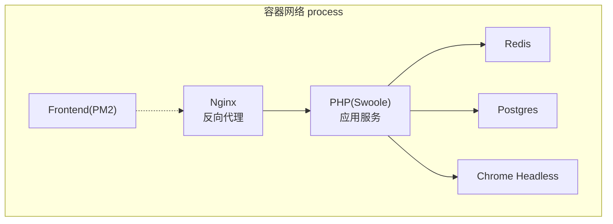
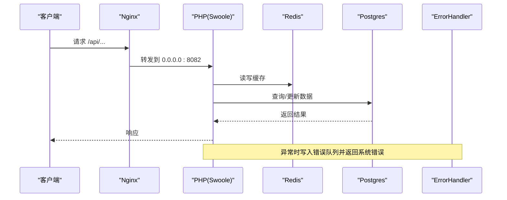
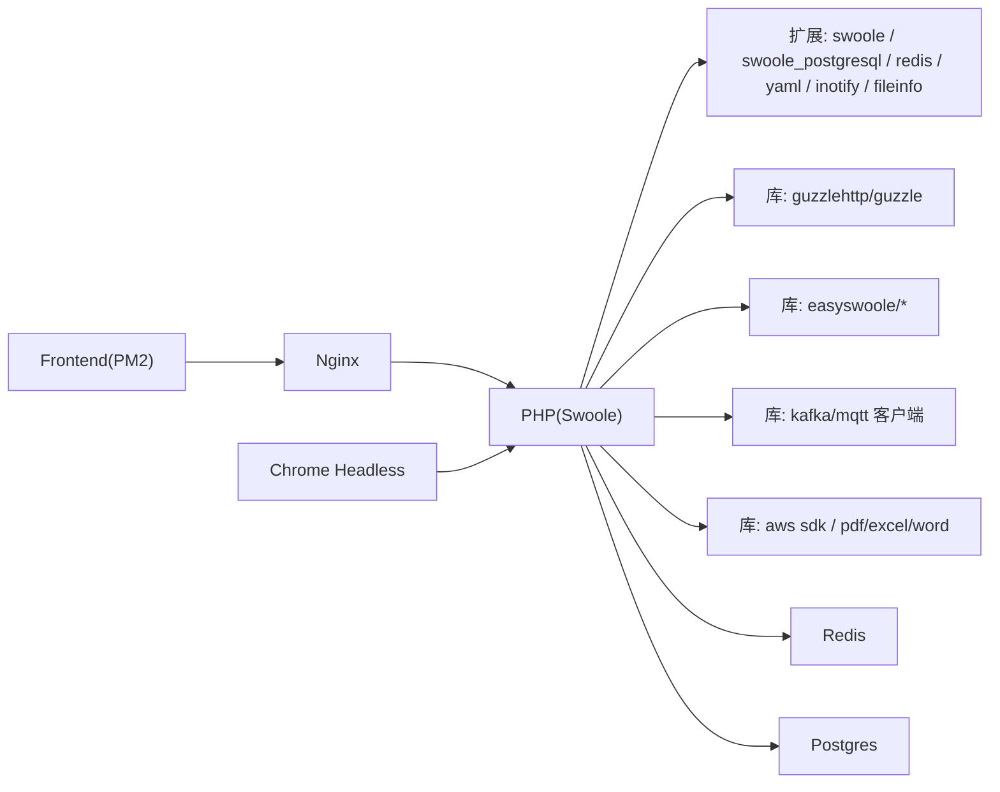
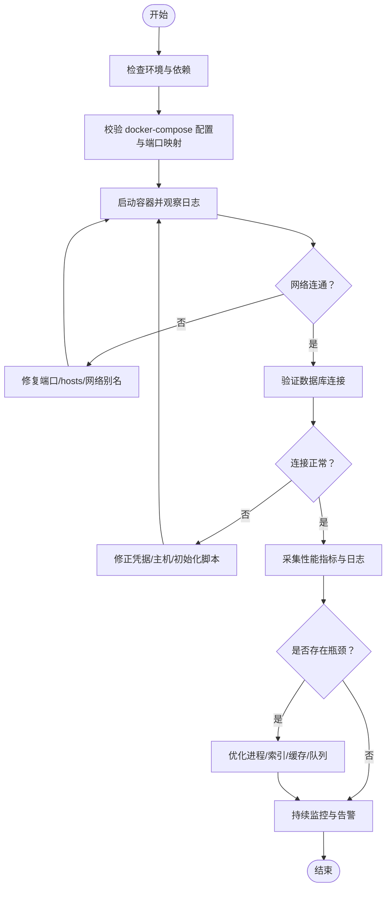

# 故障排除

<cite>
**本文引用的文件**
- [process/README.MD](file://process/README.MD)
- [process/docker/docker-compose.yml](file://process/docker/docker-compose.yml)
- [process/src/main.php](file://process/src/main.php)
- [process/src/bootstrap.php](file://process/src/bootstrap.php)
- [process/src/config/main.dev.yaml](file://process/src/config/main.dev.yaml)
- [process/src/config/process.dev.yaml](file://process/src/config/process.dev.yaml)
- [process/src/config/http.php](file://process/src/config/http.php)
- [process/src/components/ErrorHandler.php](file://process/src/components/ErrorHandler.php)
- [process/src/config/queue.php](file://process/src/config/queue.php)
- [process/composer.json](file://process/composer.json)
- [process/docker/services/postgres/postgresql.conf](file://process/docker/services/postgres/postgresql.conf)
</cite>

## 目录
1. [简介](#简介)
2. [项目结构](#项目结构)
3. [核心组件](#核心组件)
4. [架构总览](#架构总览)
5. [详细组件分析](#详细组件分析)
6. [依赖分析](#依赖分析)
7. [性能考虑](#性能考虑)
8. [故障排除指南](#故障排除指南)
9. [结论](#结论)
10. [附录](#附录)

## 简介
本故障排除文档面向 htdNew 项目的运维与开发人员，聚焦于环境配置、服务启动、数据库连接与性能问题的系统化诊断与解决。内容涵盖：
- 环境与依赖检查清单
- 启动失败的快速定位步骤
- 数据库连接异常的排查要点
- 性能瓶颈定位与优化建议
- 调试工具使用、日志分析与错误追踪策略
- 社区支持与问题反馈流程

## 项目结构
htdNew 采用 Docker 编排的多服务架构，核心由 Nginx、PHP（Swoole）、Postgres、Redis、Chrome Headless 与前端构建组成。开发环境通过 docker-compose 启动，入口位于 src/main.php，加载配置与引导器后交由 zl\Main 运行。

图表来源
- [process/docker/docker-compose.yml](file://process/docker/docker-compose.yml#L1-L150)

章节来源
- [process/README.MD](file://process/README.MD#L1-L158)
- [process/docker/docker-compose.yml](file://process/docker/docker-compose.yml#L1-L150)
- [process/src/main.php](file://process/src/main.php#L1-L25)

## 核心组件
- 应用入口与运行时
  - 入口脚本负责启用协程钩子、解析进程配置、设置默认 HTTP 客户端处理器、引入引导器并启动主进程。
- 引导器
  - 自动加载器按命名空间分派加载 vendor、runtime、envs 下的类文件，变更需重启主进程。
- 配置体系
  - main.dev.yaml 提供数据库、Redis、上传、队列、日志等运行参数；process.dev.yaml 描述进程模型与资源分配。
- 错误处理
  - HTTP 层通过 error_handler 指定 ErrorHandler，在捕获数据库异常时写入 Redis 队列并返回系统错误响应。

章节来源
- [process/src/main.php](file://process/src/main.php#L1-L25)
- [process/src/bootstrap.php](file://process/src/bootstrap.php#L1-L40)
- [process/src/config/main.dev.yaml](file://process/src/config/main.dev.yaml#L1-L97)
- [process/src/config/process.dev.yaml](file://process/src/config/process.dev.yaml#L1-L89)
- [process/src/config/http.php](file://process/src/config/http.php#L1-L27)
- [process/src/components/ErrorHandler.php](file://process/src/components/ErrorHandler.php#L1-L26)

## 架构总览
下图展示请求从 Nginx 到 PHP、再到数据库与缓存的关键路径，以及日志与错误处理的落点。

图表来源
- [process/docker/docker-compose.yml](file://process/docker/docker-compose.yml#L1-L150)
- [process/src/config/http.php](file://process/src/config/http.php#L1-L27)
- [process/src/components/ErrorHandler.php](file://process/src/components/ErrorHandler.php#L1-L26)

## 详细组件分析

### 组件A：错误处理与日志
- 错误处理策略
  - 捕获数据库异常时，将错误信息、SQL、参数与堆栈写入 Redis 列表，并限制保留条目数量，便于集中查看最近错误。
  - 其他异常统一返回系统错误响应。
- 日志与可观测性
  - 应用日志等级可配置；生产环境可通过 Grafana 探索日志与指标（见 README 中的链接）。
- 调试要点
  - 关注 Redis 中的错误队列键，结合请求上下文定位问题 SQL 与参数。
  - 结合 Postgres 日志级别与筛选条件，定位慢查询与异常事务。

章节来源
- [process/src/components/ErrorHandler.php](file://process/src/components/ErrorHandler.php#L1-L26)
- [process/src/config/main.dev.yaml](file://process/src/config/main.dev.yaml#L60-L97)
- [process/README.MD](file://process/README.MD#L47-L65)

### 组件B：进程与配置
- 进程模型
  - 主进程、HTTP 工作进程、队列进程、计划任务进程等，均通过 process.dev.yaml 配置类名、数量与业务配置文件路径。
- 配置热更新
  - 业务配置文件修改无需重启主进程；但涉及运行文件目录、日志目录、命令行配置等需重启主进程。
- CPU 亲和与核分配
  - 可按核数规划主服务与其它进程的独占核，提升稳定性与吞吐。

章节来源
- [process/src/config/process.dev.yaml](file://process/src/config/process.dev.yaml#L1-L89)
- [process/src/config/queue.php](file://process/src/config/queue.php#L1-L13)
- [process/src/config/http.php](file://process/src/config/http.php#L1-L27)

### 组件C：数据库与缓存
- 数据库连接
  - 默认使用 Postgres，主机名与端口在 main.dev.yaml 中配置；容器编排中暴露端口与卷挂载。
- Redis 连接
  - 主机与端口在 main.dev.yaml 中配置；容器编排中暴露端口与持久化卷。
- Postgres 配置
  - 支持通过 conf 文件调整日志级别、慢查询阈值等；修改后需重载或重启生效。

章节来源
- [process/src/config/main.dev.yaml](file://process/src/config/main.dev.yaml#L20-L40)
- [process/docker/docker-compose.yml](file://process/docker/docker-compose.yml#L1-L150)
- [process/docker/services/postgres/postgresql.conf](file://process/docker/services/postgres/postgresql.conf#L1-L40)
- [process/docker/services/postgres/postgresql.conf](file://process/docker/services/postgres/postgresql.conf#L368-L400)

## 依赖分析
- 运行时与扩展
  - PHP 版本、Swoole、Postgres 扩展、Redis 扩展、YAML、inotify（开发）、fileinfo 等。
- Composer 依赖
  - 包含 Guzzle、EasySwoole 工具集、MQTT/Kafka 客户端、AWS SDK、Excel/Word/PDF 工具链等。
- 容器依赖
  - Nginx、PHP、Postgres、Redis、Chrome Headless、MinIO、PM2 前端。

图表来源
- [process/composer.json](file://process/composer.json#L1-L70)
- [process/README.MD](file://process/README.MD#L1-L20)
- [process/docker/docker-compose.yml](file://process/docker/docker-compose.yml#L1-L150)

章节来源
- [process/composer.json](file://process/composer.json#L1-L70)
- [process/README.MD](file://process/README.MD#L1-L20)

## 性能考虑
- 进程与并发
  - 合理设置 HTTP 工作进程数量与队列消费者数量；根据 CPU 核心数分配亲和性，避免争抢。
- 数据库性能
  - 调整 Postgres 日志级别与慢查询阈值；对热点查询建立索引；避免大事务与长锁。
- 缓存命中
  - 优先使用 Redis 缓存热点数据；注意键空间设计与过期策略。
- I/O 与网络
  - 减少不必要的磁盘写入；批量处理与异步队列；合理设置超时与重试。
- 前端与静态资源
  - 前端构建产物放置于服务器同级目录，确保 Nginx 可直接服务静态资源。

章节来源
- [process/src/config/process.dev.yaml](file://process/src/config/process.dev.yaml#L30-L89)
- [process/src/config/main.dev.yaml](file://process/src/config/main.dev.yaml#L50-L97)
- [process/docker/docker-compose.yml](file://process/docker/docker-compose.yml#L1-L150)

## 故障排除指南

### 一、环境配置问题
- 症状
  - 启动报错提示缺少扩展或版本不匹配。
- 诊断步骤
  - 核对 README 中的环境要求与扩展清单。
  - 检查 PHP 扩展是否已安装并启用。
  - 确认 Docker 环境变量与端口映射正确。
- 解决方案
  - 安装缺失扩展并重启 PHP 容器。
  - 使用 README 提供的示例命令复制环境文件并重建镜像。

章节来源
- [process/README.MD](file://process/README.MD#L1-L20)
- [process/README.MD](file://process/README.MD#L21-L46)

### 二、服务启动失败
- 症状
  - Nginx/PHP/Postgres/Redis 任一服务无法访问或频繁重启。
- 诊断步骤
  - 查看容器日志与健康状态。
  - 确认端口未被占用，且 hosts 已正确绑定。
  - 检查 main.dev.yaml 与 process.dev.yaml 的监听地址与端口。
- 解决方案
  - 修改端口或释放冲突端口。
  - 修正配置文件后重启对应容器。
  - 如需平滑重启，参考 README 的信号方式。

章节来源
- [process/README.MD](file://process/README.MD#L29-L38)
- [process/README.MD](file://process/README.MD#L93-L97)
- [process/src/config/main.dev.yaml](file://process/src/config/main.dev.yaml#L10-L20)
- [process/src/config/process.dev.yaml](file://process/src/config/process.dev.yaml#L10-L25)

### 三、数据库连接异常
- 症状
  - 应用侧报连接失败、认证错误或超时。
- 诊断步骤
  - 使用 README 提供的 psql 连接参数验证连通性与凭据。
  - 检查 Postgres 容器日志与配置文件。
  - 确认 main.dev.yaml 中的主机名、端口、数据库名与凭据一致。
- 解决方案
  - 修复凭据与网络别名；必要时重建初始化脚本。
  - 调整 Postgres 配置并重载服务。

章节来源
- [process/README.MD](file://process/README.MD#L80-L91)
- [process/src/config/main.dev.yaml](file://process/src/config/main.dev.yaml#L23-L33)
- [process/docker/docker-compose.yml](file://process/docker/docker-compose.yml#L18-L35)
- [process/docker/services/postgres/postgresql.conf](file://process/docker/services/postgres/postgresql.conf#L1-L30)

### 四、性能问题定位
- 症状
  - 响应延迟升高、CPU/内存占用高、队列堆积。
- 诊断步骤
  - 观察进程数量与 CPU 亲和配置，评估是否需要扩容或迁移进程。
  - 检查 Redis 队列消费速率与积压情况。
  - 分析 Postgres 慢查询日志与锁等待。
- 解决方案
  - 调整进程与消费者数量；优化热点 SQL 与索引。
  - 限流与重试策略；拆分任务与批量处理。

章节来源
- [process/src/config/process.dev.yaml](file://process/src/config/process.dev.yaml#L30-L89)
- [process/src/config/queue.php](file://process/src/config/queue.php#L1-L13)
- [process/src/config/main.dev.yaml](file://process/src/config/main.dev.yaml#L58-L68)
- [process/docker/services/postgres/postgresql.conf](file://process/docker/services/postgres/postgresql.conf#L368-L400)

### 五、调试工具与日志分析
- 调试端口
  - psql 与 Redis 端口已在 README 中列出，可直接连接验证。
- 日志与错误追踪
  - 应用层错误通过 ErrorHandler 写入 Redis 错误队列，结合请求上下文定位。
  - 生产环境可通过 Grafana 探索日志与指标。
- 建议流程
  - 先抓取错误队列与最近错误记录，再回溯 SQL 与参数。
  - 使用 Postgres 慢查询日志定位热点语句，配合索引优化。

章节来源
- [process/README.MD](file://process/README.MD#L47-L65)
- [process/src/components/ErrorHandler.php](file://process/src/components/ErrorHandler.php#L1-L26)
- [process/src/config/main.dev.yaml](file://process/src/config/main.dev.yaml#L60-L97)

### 六、系统性排查流程

图表来源
- [process/README.MD](file://process/README.MD#L21-L46)
- [process/docker/docker-compose.yml](file://process/docker/docker-compose.yml#L1-L150)
- [process/src/config/main.dev.yaml](file://process/src/config/main.dev.yaml#L20-L40)

### 七、社区支持与问题反馈
- 社区与监控
  - README 提供 Grafana 探索链接与账号信息，可用于日常监控与问题回溯。
- 问题反馈流程建议
  - 收集环境信息（PHP/Swoole/Postgres/Redis 版本与扩展）、配置片段、错误队列快照、Postgres 慢查询日志与最近日志片段。
  - 提交 Issue 时附上最小复现步骤与期望行为，便于维护者快速定位。

章节来源
- [process/README.MD](file://process/README.MD#L47-L65)

## 结论
通过规范的环境准备、严格的配置校验、完善的日志与错误追踪机制，以及系统化的性能优化策略，可有效降低 htdNew 项目的故障率与恢复成本。建议在开发与生产环境中均建立标准化的巡检与演练流程，确保问题早发现、早处理。

## 附录
- 常用命令与入口
  - 启动开发环境、执行自定义脚本、创建与执行数据库迁移等命令详见 README。
- 配置文件位置
  - main.dev.yaml、process.dev.yaml、http.php、queue.php 等位于 src/config 目录。

章节来源
- [process/README.MD](file://process/README.MD#L98-L158)
- [process/src/config/main.dev.yaml](file://process/src/config/main.dev.yaml#L1-L97)
- [process/src/config/process.dev.yaml](file://process/src/config/process.dev.yaml#L1-L89)
- [process/src/config/http.php](file://process/src/config/http.php#L1-L27)
- [process/src/config/queue.php](file://process/src/config/queue.php#L1-L13)