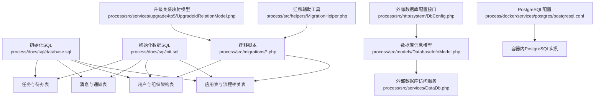
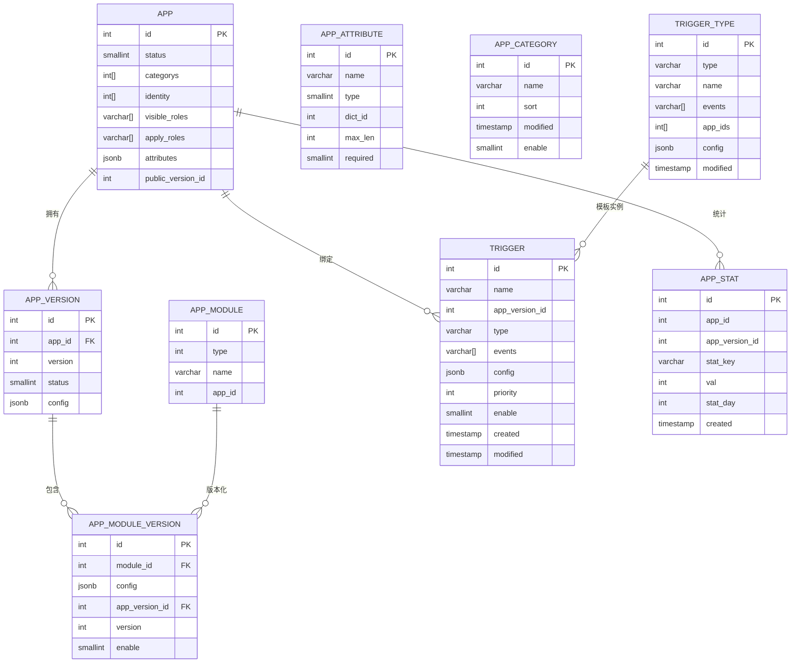
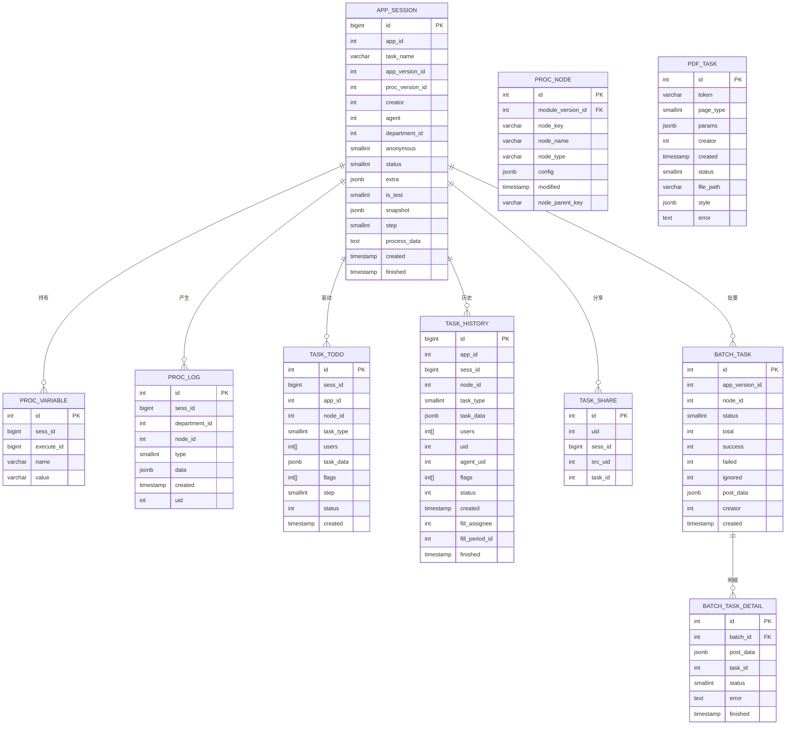
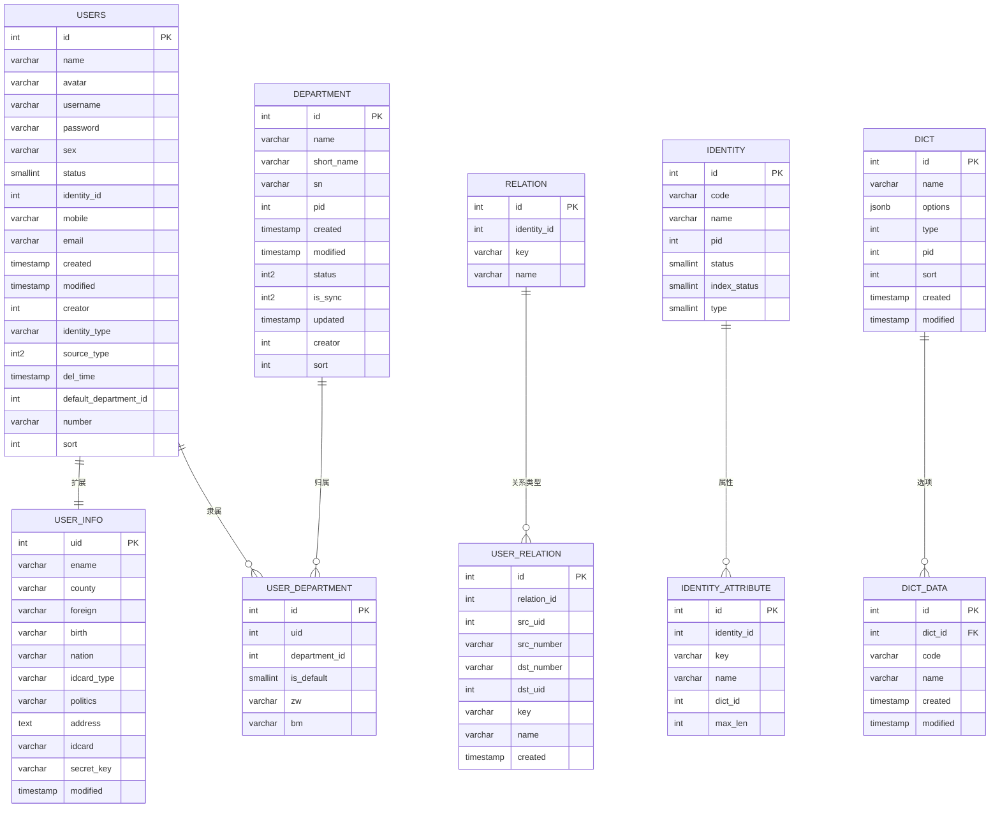
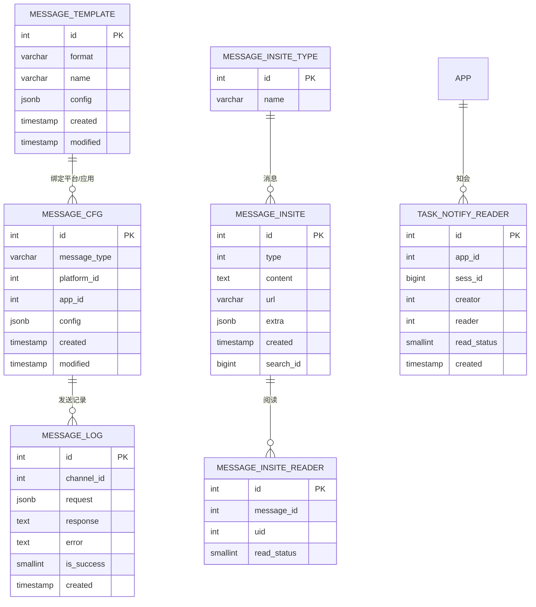
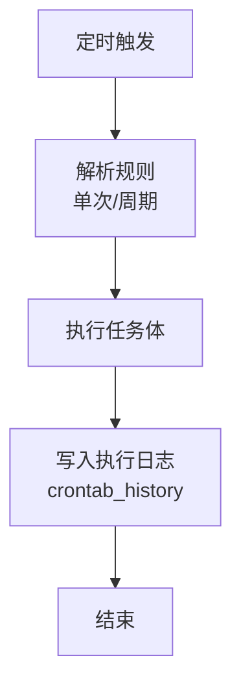
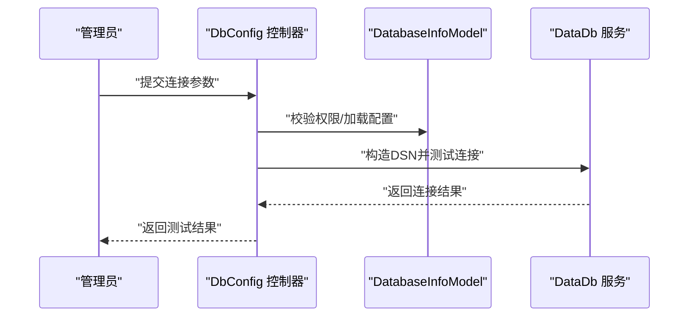
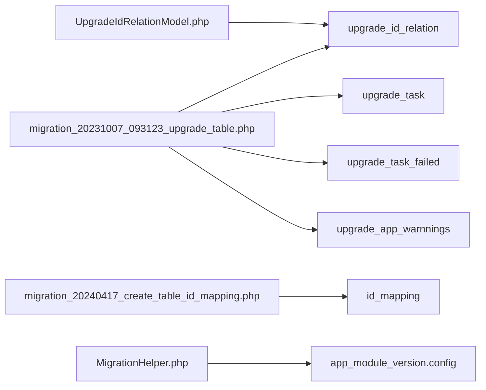

# 数据库设计

<cite>
**本文引用的文件**
- [process/docs/sql/database.sql](file://process/docs/sql/database.sql)
- [process/docs/sql/init.sql](file://process/docs/sql/init.sql)
- [process/src/migrations/migration_20231007_093123_upgrade_table.php](file://process/src/migrations/migration_20231007_093123_upgrade_table.php)
- [process/src/migrations/migration_20240417_create_table_id_mapping.php](file://process/src/migrations/migration_20240417_create_table_id_mapping.php)
- [process/src/helpers/MigrationHelper.php](file://process/src/helpers/MigrationHelper.php)
- [process/src/services/upgrade4to5/UpgradeIdRelationModel.php](file://process/src/services/upgrade4to5/UpgradeIdRelationModel.php)
- [process/src/http/system/DbConfig.php](file://process/src/http/system/DbConfig.php)
- [process/src/models/DatabaseInfoModel.php](file://process/src/models/DatabaseInfoModel.php)
- [process/src/services/DataDb.php](file://process/src/services/DataDb.php)
- [process/docker/services/postgres/postgresql.conf](file://process/docker/services/postgres/postgresql.conf)
</cite>

## 目录
1. [简介](#简介)
2. [项目结构](#项目结构)
3. [核心组件](#核心组件)
4. [架构总览](#架构总览)
5. [详细组件分析](#详细组件分析)
6. [依赖分析](#依赖分析)
7. [性能考量](#性能考量)
8. [故障排查指南](#故障排查指南)
9. [结论](#结论)
10. [附录](#附录)

## 简介
本文件面向 htdNew 项目的数据库设计，基于仓库中的 SQL 初始化脚本、迁移文件与后端模型/服务代码，系统梳理数据库架构、表结构、索引与约束、关系映射策略，并补充数据迁移机制、版本管理与升级策略、性能优化建议、备份与恢复方案以及数据字典与 ER 图。

## 项目结构
数据库相关资源主要分布在以下位置：
- 初始化与基础表结构：process/docs/sql/database.sql、process/docs/sql/init.sql
- 迁移与升级：process/src/migrations/*.php、process/src/helpers/MigrationHelper.php、process/src/services/upgrade4to5/UpgradeIdRelationModel.php
- 外部数据库对接：process/src/http/system/DbConfig.php、process/src/models/DatabaseInfoModel.php、process/src/services/DataDb.php
- PostgreSQL 运行配置：process/docker/services/postgres/postgresql.conf



图表来源
- [process/docs/sql/database.sql](file://process/docs/sql/database.sql#L1-L2137)
- [process/docs/sql/init.sql](file://process/docs/sql/init.sql#L1-L86)
- [process/src/migrations/migration_20231007_093123_upgrade_table.php](file://process/src/migrations/migration_20231007_093123_upgrade_table.php#L1-L81)
- [process/src/migrations/migration_20240417_create_table_id_mapping.php](file://process/src/migrations/migration_20240417_create_table_id_mapping.php#L1-L26)
- [process/src/helpers/MigrationHelper.php](file://process/src/helpers/MigrationHelper.php#L1-L38)
- [process/src/services/upgrade4to5/UpgradeIdRelationModel.php](file://process/src/services/upgrade4to5/UpgradeIdRelationModel.php#L1-L34)
- [process/src/http/system/DbConfig.php](file://process/src/http/system/DbConfig.php#L1-L137)
- [process/src/models/DatabaseInfoModel.php](file://process/src/models/DatabaseInfoModel.php#L40-L85)
- [process/src/services/DataDb.php](file://process/src/services/DataDb.php#L1-L76)
- [process/docker/services/postgres/postgresql.conf](file://process/docker/services/postgres/postgresql.conf#L1-L449)

章节来源
- [process/docs/sql/database.sql](file://process/docs/sql/database.sql#L1-L2137)
- [process/docs/sql/init.sql](file://process/docs/sql/init.sql#L1-L86)

## 核心组件
- 应用与事项：app、app_version、app_category、app_attribute、app_module、app_module_version、app_node_stat、app_form_auth、trigger_type、trigger、app_stat
- 会话与流程：app_session、proc_node、proc_variable、proc_log、task_todo、task_history、task_share、batch_task、batch_task_detail、pdf_task
- 用户与组织：users、user_info、department、user_department、relation、user_relation、job、user_notice、identity、identity_attribute、dict、dict_data
- 消息与通知：message_template、message_cfg、message_log、message_insite_type、message_insite、message_insite_reader、task_notify_reader
- 计划任务：crontab、crontab_history
- 开发与第三方：developer、developer_request_log、thirdparty_platform、wechat_agent、thirdparty_api、thirdparty_script、user_openid
- 其他：form_data、form_data_change、form_draft、serial_rule、serial_unique_value、user_start_department、user_examine_department、filter、map_config（初始化数据）

章节来源
- [process/docs/sql/database.sql](file://process/docs/sql/database.sql#L1-L2137)
- [process/docs/sql/init.sql](file://process/docs/sql/init.sql#L1-L86)

## 架构总览
htdNew 采用 PostgreSQL 作为主数据库，围绕“应用-流程-任务-用户-组织-消息-计划任务”构建核心业务数据域。数据库层通过迁移脚本与辅助工具保证结构演进与数据一致性；同时提供外部数据库对接能力，便于跨库集成。

```mermaid
erDiagram
APP {
int id PK
jsonb name
jsonb short_name
varchar icon
smallint type
int public_version_id
smallint status
varchar[] keywords
int depart_id
int[] categorys
int[] identity
varchar[] visible_roles
varchar[] apply_roles
varchar[] disable_roles
text description
jsonb attributes
numeric star
int sort
int agent_id
int flags
int creator
timestamp created
timestamp modified
}
APP_VERSION {
int id PK
int app_id FK
int version
varchar alias
smallint status
jsonb config
timestamp created
timestamp modified
int operator
varchar remarks
}
APP_MODULE {
int id PK
int type
varchar name
int app_id
}
APP_MODULE_VERSION {
int id PK
int module_id FK
jsonb config
int app_version_id FK
int version
smallint enable
varchar alias
timestamp created
timestamp modified
}
USERS {
int id PK
varchar name
varchar avatar
varchar username
varchar password
varchar sex
smallint status
int identity_id
varchar mobile
varchar email
timestamp created
timestamp modified
int creator
varchar identity_type
int2 source_type
timestamp del_time
int default_department_id
varchar number
int sort
}
USER_INFO {
int uid PK
varchar ename
varchar county
varchar foreign
varchar birth
varchar nation
varchar idcard_type
varchar politics
text address
varchar idcard
varchar secret_key
timestamp modified
}
DEPARTMENT {
int id PK
varchar name
varchar short_name
varchar sn
int pid
timestamp created
timestamp modified
int2 status
int2 is_sync
timestamp updated
int creator
int sort
}
USER_DEPARTMENT {
int id PK
int uid
int department_id
smallint is_default
varchar zw
varchar bm
}
MESSAGE_INSITE_TYPE {
int id PK
varchar name
}
MESSAGE_INSITE {
int id PK
int type
text content
varchar url
jsonb extra
timestamp created
bigint search_id
}
MESSAGE_INSITE_READER {
int id PK
int message_id
int uid
smallint read_status
}
TASK_TODO {
int id PK
bigint sess_id
int app_id
int node_id
smallint task_type
int[] users
jsonb task_data
int[] flags
smallint step
int status
timestamp created
}
TASK_HISTORY {
bigint id PK
int app_id
bigint sess_id
int node_id
smallint task_type
jsonb task_data
int[] users
int uid
int agent_uid
int[] flags
int status
timestamp created
int fill_assignee
int fill_period_id
timestamp finished
}
CRONTAB {
int id PK
varchar name
smallint type
jsonb rule
smallint last_state
smallint enable
text task
timestamp created
timestamp modified
int creator
}
CRONTAB_HISTORY {
int id PK
int crontab_id FK
text content
smallint is_system
timestamp created
timestamp finished
smallint status
}
APP --o{ APP_VERSION : "拥有"
APP_VERSION ||--o{ APP_MODULE_VERSION : "包含"
APP_MODULE ||--o{ APP_MODULE_VERSION : "版本化"
USERS ||--o{ USER_INFO : "扩展信息"
USERS ||--o{ USER_DEPARTMENT : "多部门"
DEPARTMENT ||--o{ USER_DEPARTMENT : "归属"
MESSAGE_INSITE ||--o{ MESSAGE_INSITE_READER : "阅读记录"
APP ||--o{ TASK_TODO : "产生"
APP ||--o{ TASK_HISTORY : "历史"
CRONTAB ||--o{ CRONTAB_HISTORY : "执行日志"
```

图表来源
- [process/docs/sql/database.sql](file://process/docs/sql/database.sql#L1-L2137)

## 详细组件分析

### 应用与事项域
- 应用表 app：存储事项元数据、状态、权限、评分、排序、创建/修改时间等；支持多语言字段（jsonb）与数组字段（关键词、身份、可见/申请角色等）。
- 事项版本 app_version：按 app_id 维度管理版本，包含别名、状态、配置、操作人与备注。
- 事项模块 app_module 与模块版本 app_module_version：支撑表单/流程/触发器等组件的版本化管理。
- 事项属性 app_attribute、分类 app_category、码表 dict/dict_data：支撑动态属性与枚举配置。
- 触发器 trigger_type/trigger：模板与实例，支持事件、优先级、启用状态与配置。
- 统计 app_stat：按天统计事项/版本维度指标，供运营分析使用。



图表来源
- [process/docs/sql/database.sql](file://process/docs/sql/database.sql#L1-L2137)

章节来源
- [process/docs/sql/database.sql](file://process/docs/sql/database.sql#L1-L2137)

### 会话与流程域
- 会话 app_session：记录一次申请的上下文，包含发起人、代发起人、部门、状态、快照、步骤、流程数据、创建/完成时间等。
- 流程节点 proc_node：按模块版本组织节点，包含节点键、名称、类型、配置与父子关系。
- 变量 proc_variable：运行期环境变量，按会话+变量名索引。
- 日志 proc_log：记录节点操作日志，包含类型、数据与操作人。
- 任务 todo/history：待办任务与历史任务，支持多用户、标志位、状态与业务数据。
- 分享 task_share：任务共享记录。
- 批量任务 batch_task/batch_task_detail：批量执行与明细。
- PDF 打印 pdf_task：打印任务令牌、参数、样式、状态与错误信息。



图表来源
- [process/docs/sql/database.sql](file://process/docs/sql/database.sql#L1-L2137)

章节来源
- [process/docs/sql/database.sql](file://process/docs/sql/database.sql#L1-L2137)

### 用户与组织域
- 用户 users：登录凭据、基本信息、状态、来源、默认部门、外部标识等。
- 用户扩展信息 user_info：加密存储敏感字段（如身份证号）与密钥。
- 部门 department：树形结构（pid）、唯一标识 sn、排序与状态。
- 用户部门 user_department：多对多关系，支持默认部门与岗位信息。
- 关系 relation/user_relation：个人关系（如辅导员、导师）与双向映射。
- 身份 identity/identity_attribute：身份类型与属性配置。
- 码表 dict/dict_data：分类与选项。



图表来源
- [process/docs/sql/database.sql](file://process/docs/sql/database.sql#L1-L2137)

章节来源
- [process/docs/sql/database.sql](file://process/docs/sql/database.sql#L1-L2137)

### 消息与通知域
- 模板 message_template、配置 message_cfg、日志 message_log。
- 站内消息类型 message_insite_type、消息 message_insite、阅读状态 message_insite_reader。
- 知会阅读 task_notify_reader。



图表来源
- [process/docs/sql/database.sql](file://process/docs/sql/database.sql#L1-L2137)

章节来源
- [process/docs/sql/database.sql](file://process/docs/sql/database.sql#L1-L2137)

### 计划任务域
- crontab：任务名称、类型、规则（单次/周期）、启用状态、任务体、创建/修改时间与创建人。
- crontab_history：执行内容、是否系统、创建/完成时间与状态。



图表来源
- [process/docs/sql/database.sql](file://process/docs/sql/database.sql#L1-L2137)

章节来源
- [process/docs/sql/database.sql](file://process/docs/sql/database.sql#L1-L2137)

### 外部数据库对接
- DbConfig 控制器：提供数据库列表、详情、权限校验与连接测试。
- DatabaseInfoModel：数据库配置模型，含适配器、主机、端口、用户名、密码、可见用户/角色等。
- DataDb 服务：根据适配器生成 DSN 并执行查询，支持 MySQL、PostgreSQL、Oracle、SQL Server 等。



图表来源
- [process/src/http/system/DbConfig.php](file://process/src/http/system/DbConfig.php#L1-L137)
- [process/src/models/DatabaseInfoModel.php](file://process/src/models/DatabaseInfoModel.php#L40-L85)
- [process/src/services/DataDb.php](file://process/src/services/DataDb.php#L1-L76)

章节来源
- [process/src/http/system/DbConfig.php](file://process/src/http/system/DbConfig.php#L1-L137)
- [process/src/models/DatabaseInfoModel.php](file://process/src/models/DatabaseInfoModel.php#L40-L85)
- [process/src/services/DataDb.php](file://process/src/services/DataDb.php#L1-L76)

## 依赖分析
- 迁移与升级
  - migration_20231007_093123_upgrade_table：创建升级关系表 upgrade_id_relation、升级任务表与失败表、警告表，并重置 identity 主键序列。
  - migration_20240417_create_table_id_mapping：创建 id_mapping 表与复合索引，用于跨系统/跨库 ID 映射。
  - MigrationHelper：遍历表单插件并更新配置，配合迁移脚本批量修复/增强组件配置。
  - UpgradeIdRelationModel：提供新旧 ID 查询与冲突插入逻辑，支撑版本升级与数据迁移。



图表来源
- [process/src/migrations/migration_20231007_093123_upgrade_table.php](file://process/src/migrations/migration_20231007_093123_upgrade_table.php#L1-L81)
- [process/src/migrations/migration_20240417_create_table_id_mapping.php](file://process/src/migrations/migration_20240417_create_table_id_mapping.php#L1-L26)
- [process/src/helpers/MigrationHelper.php](file://process/src/helpers/MigrationHelper.php#L1-L38)
- [process/src/services/upgrade4to5/UpgradeIdRelationModel.php](file://process/src/services/upgrade4to5/UpgradeIdRelationModel.php#L1-L34)

章节来源
- [process/src/migrations/migration_20231007_093123_upgrade_table.php](file://process/src/migrations/migration_20231007_093123_upgrade_table.php#L1-L81)
- [process/src/migrations/migration_20240417_create_table_id_mapping.php](file://process/src/migrations/migration_20240417_create_table_id_mapping.php#L1-L26)
- [process/src/helpers/MigrationHelper.php](file://process/src/helpers/MigrationHelper.php#L1-L38)
- [process/src/services/upgrade4to5/UpgradeIdRelationModel.php](file://process/src/services/upgrade4to5/UpgradeIdRelationModel.php#L1-L34)

## 性能考量
- 索引策略
  - 高频查询字段建立单列/复合索引：如 app_session 的 creator、agent、form_data 的 sess_id/form_id、task_todo 的 users/node_id、task_history 的 uid/node_id/sess_id/fill_period_id、message_insite 的 search_id、message_insite_reader 的 uid/message_id 等。
  - GIN 索引用于数组/JSONB 字段：如 app.users、task_todo.flags、app_module_version.config、trigger.events 等。
- 数据类型选择
  - 使用 jsonb 存储动态配置与富文本，结合 GIN/索引提升查询效率。
  - 使用数组字段存储多值（如角色、分类），配合 @>、&& 等操作符。
- 统计与归档
  - app_stat 按天统计，建议定期归档历史数据，避免热表膨胀。
- 连接池与并发
  - 外部数据库 DataDb 通过 PDO 连接，建议在应用侧统一连接池与超时控制。
- PostgreSQL 参数
  - 可根据负载调整 shared_buffers、work_mem、effective_cache_size 等参数，结合容器内 postgresql.conf 进行调优。

章节来源
- [process/docs/sql/database.sql](file://process/docs/sql/database.sql#L1-L2137)
- [process/docker/services/postgres/postgresql.conf](file://process/docker/services/postgres/postgresql.conf#L1-L449)

## 故障排查指南
- 外部数据库连接
  - 使用 DbConfig::connect 进行连通性测试，检查适配器类型、主机、端口、用户名、密码与可见角色限制。
- 迁移与升级
  - 若升级后出现 ID 冲突，检查 upgrade_id_relation 与 id_mapping 表，确认映射关系是否正确。
  - 使用 MigrationHelper.walkComponents 对表单插件进行批量修复，避免配置缺失导致的异常。
- 任务与日志
  - 查看 crontab_history 判断计划任务执行状态与错误信息。
  - 检查 task_todo/task_history 的 flags 与 users 字段，定位任务状态异常原因。
- 用户与权限
  - 核对 users/identity/identity_attribute 的配置，确保身份与可见/申请角色映射正确。
- 消息与通知
  - message_log 中 is_success 为 0 时，检查请求/响应与错误字段，定位消息发送失败原因。

章节来源
- [process/src/http/system/DbConfig.php](file://process/src/http/system/DbConfig.php#L1-L137)
- [process/src/models/DatabaseInfoModel.php](file://process/src/models/DatabaseInfoModel.php#L40-L85)
- [process/src/services/DataDb.php](file://process/src/services/DataDb.php#L1-L76)
- [process/src/migrations/migration_20231007_093123_upgrade_table.php](file://process/src/migrations/migration_20231007_093123_upgrade_table.php#L1-L81)
- [process/src/migrations/migration_20240417_create_table_id_mapping.php](file://process/src/migrations/migration_20240417_create_table_id_mapping.php#L1-L26)
- [process/src/helpers/MigrationHelper.php](file://process/src/helpers/MigrationHelper.php#L1-L38)

## 结论
htdNew 的数据库设计围绕“应用-流程-任务-用户-组织-消息-计划任务”展开，采用 PostgreSQL 提供强一致与灵活的数据建模能力。通过迁移与升级工具链保障结构演进，借助索引与数据类型优化查询性能，并提供外部数据库对接能力满足跨系统集成需求。建议持续完善索引覆盖、定期归档与参数调优，确保系统在高并发场景下的稳定性与可维护性。

## 附录

### 数据字典（节选）
- 应用与版本
  - app：id、name、short_name、icon、type、public_version_id、status、keywords、depart_id、categorys、identity、visible_roles、apply_roles、disable_roles、description、attributes、star、sort、agent_id、flags、creator、created、modified
  - app_version：id、app_id、version、alias、status、config、created、modified、operator、remarks
  - app_module/app_module_version：模块与版本配置，支持启用/禁用与别名
- 会话与流程
  - app_session：id、app_id、task_name、app_version_id、proc_version_id、creator、agent、department_id、anonymous、status、extra、is_test、snapshot、step、process_data、created、finished
  - proc_node：id、module_version_id、node_key、node_name、node_type、config、modified、node_parent_key
  - proc_variable：id、sess_id、execute_id、name、value
  - proc_log：id、sess_id、department_id、node_id、type、data、created、uid
  - task_todo/task_history：id、app_id、sess_id、node_id、task_type、task_data、users、uid、agent_uid、flags、status、created、fill_assignee、fill_period_id、finished
  - task_share：id、uid、sess_id、src_uid、task_id
  - batch_task/batch_task_detail：批量任务与明细
  - pdf_task：id、token、page_type、params、creator、created、status、file_path、style、error
- 用户与组织
  - users：id、name、avatar、username、password、sex、status、identity_id、mobile、email、created、modified、creator、identity_type、source_type、del_time、default_department_id、number、sort
  - user_info：uid、ename、county、foreign、birth、nation、idcard_type、politics、address、idcard、secret_key、modified
  - department：id、name、short_name、sn、pid、created、modified、status、is_sync、updated、creator、sort
  - user_department：id、uid、department_id、is_default、zw、bm
  - relation/user_relation：关系类型与双向映射
  - identity/identity_attribute：身份与属性
  - dict/dict_data：码表与选项
- 消息与通知
  - message_template/message_cfg/message_log：模板、配置与发送日志
  - message_insite_type/message_insite/message_insite_reader：站内消息与阅读状态
  - task_notify_reader：知会阅读
- 计划任务
  - crontab/crontab_history：任务与执行日志
- 外部数据库
  - database_info：数据库配置与可见范围
  - DataDb：多适配器连接与查询

章节来源
- [process/docs/sql/database.sql](file://process/docs/sql/database.sql#L1-L2137)
- [process/docs/sql/init.sql](file://process/docs/sql/init.sql#L1-L86)
- [process/src/models/DatabaseInfoModel.php](file://process/src/models/DatabaseInfoModel.php#L40-L85)
- [process/src/services/DataDb.php](file://process/src/services/DataDb.php#L1-L76)

### 数据迁移机制与版本管理
- 迁移脚本命名规范：以时间戳+描述命名，确保执行顺序与可追溯性。
- 迁移工具链：
  - migration_20231007_093123_upgrade_table：创建升级关系与任务相关表，重置 identity 主键序列。
  - migration_20240417_create_table_id_mapping：创建 id_mapping 表与复合索引，支撑跨系统 ID 映射。
  - MigrationHelper：遍历表单插件配置并批量修复，减少人工干预。
  - UpgradeIdRelationModel：提供新旧 ID 查询与冲突插入，保障升级一致性。
- 升级策略：
  - 先创建/重命名表与索引，再迁移数据，最后重建约束与索引。
  - 对于大表，采用分批迁移与事务控制，避免长事务锁表。
  - 升级前备份关键表，升级后核对映射关系与统计数据。

章节来源
- [process/src/migrations/migration_20231007_093123_upgrade_table.php](file://process/src/migrations/migration_20231007_093123_upgrade_table.php#L1-L81)
- [process/src/migrations/migration_20240417_create_table_id_mapping.php](file://process/src/migrations/migration_20240417_create_table_id_mapping.php#L1-L26)
- [process/src/helpers/MigrationHelper.php](file://process/src/helpers/MigrationHelper.php#L1-L38)
- [process/src/services/upgrade4to5/UpgradeIdRelationModel.php](file://process/src/services/upgrade4to5/UpgradeIdRelationModel.php#L1-L34)

### 备份、恢复与迁移方案
- 备份
  - 使用 pg_dump/pg_restore 进行逻辑备份，按业务域拆分备份集（应用/流程/用户/消息/任务）。
  - 对大表（如 task_history、proc_log、message_log）进行分区或归档后备份。
- 恢复
  - 恢复顺序：先恢复结构（database.sql），再恢复初始化数据（init.sql），最后恢复业务数据。
  - 升级恢复：先执行迁移脚本，再恢复数据，最后重建索引与约束。
- 迁移
  - 跨系统/跨库迁移：使用 id_mapping 与 upgrade_id_relation 建立映射，迁移完成后清理冗余数据。
  - 外部数据库：通过 DataDb 服务进行增量同步与校验，确保一致性。

章节来源
- [process/docs/sql/database.sql](file://process/docs/sql/database.sql#L1-L2137)
- [process/docs/sql/init.sql](file://process/docs/sql/init.sql#L1-L86)
- [process/src/migrations/migration_20231007_093123_upgrade_table.php](file://process/src/migrations/migration_20231007_093123_upgrade_table.php#L1-L81)
- [process/src/migrations/migration_20240417_create_table_id_mapping.php](file://process/src/migrations/migration_20240417_create_table_id_mapping.php#L1-L26)
- [process/src/services/DataDb.php](file://process/src/services/DataDb.php#L1-L76)