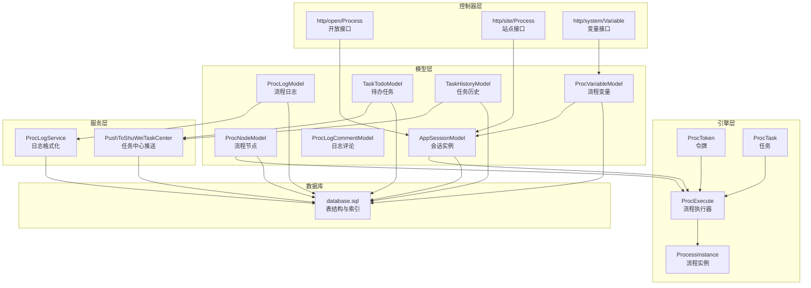
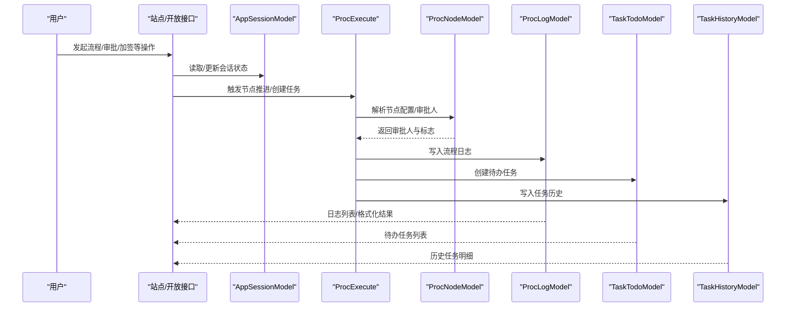
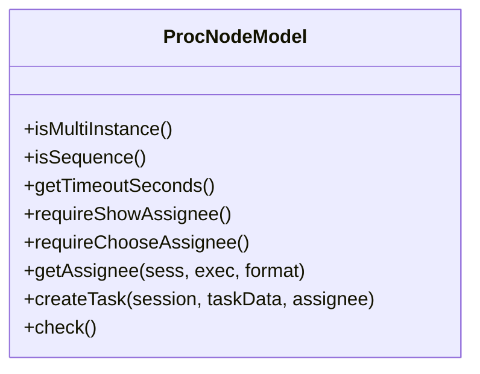
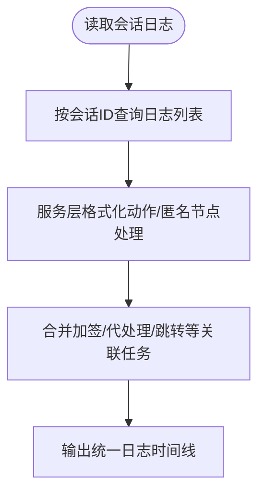
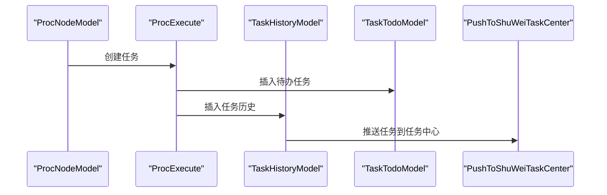
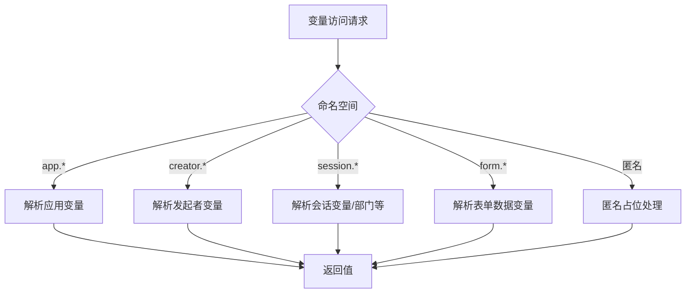
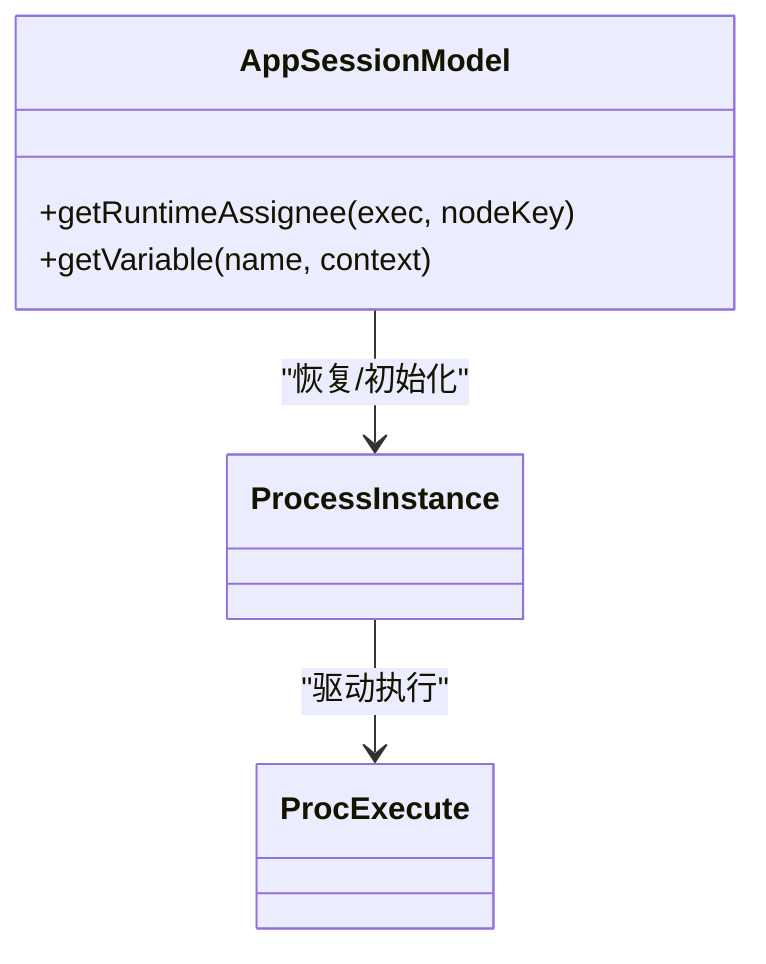
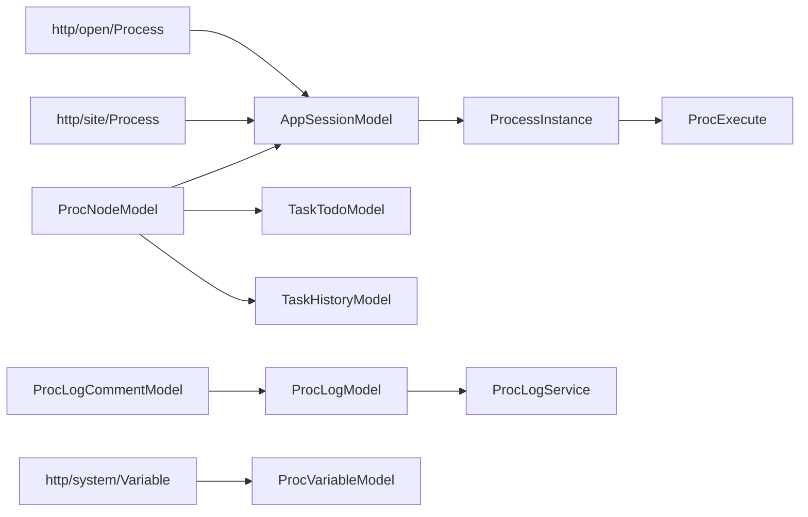

# 业务流程模型

<cite>
**本文引用的文件**
- [ProcExecute.php](file://process/src/engine/ProcExecute.php)
- [ProcTask.php](file://process/src/engine/ProcTask.php)
- [ProcToken.php](file://process/src/engine/ProcToken.php)
- [ProcessInstance.php](file://process/src/engine/ProcessInstance.php)
- [ProcNodeModel.php](file://process/src/models/ProcNodeModel.php)
- [AppSessionModel.php](file://process/src/models/AppSessionModel.php)
- [ProcLogModel.php](file://process/src/models/ProcLogModel.php)
- [ProcLogCommentModel.php](file://process/src/models/ProcLogCommentModel.php)
- [ProcVariableModel.php](file://process/src/models/ProcVariableModel.php)
- [ProcLogService.php](file://process/src/services/ProcLogService.php)
- [Process.php](file://process/src/modules/Process.php)
- [database.sql](file://process/docs/sql/database.sql)
- [init.sql](file://process/docs/sql/init.sql)
- [migration_20250805_add_proc_log_comment.php](file://process/src/migrations/migration_20250805_add_proc_log_comment.php)
- [AbstractSessionModel.php](file://process/src/models/AbstractSessionModel.php)
- [TaskHistoryModel.php](file://process/src/models/TaskHistoryModel.php)
- [TaskTodoModel.php](file://process/src/models/TaskTodoModel.php)
- [PushToShuWeiTaskCenter.php](file://process/src/services/task/PushToShuWeiTaskCenter.php)
- [PushCreateFillTaskListener.php（tmmu）](file://process_envs/tmmu/product/listeners/PushCreateFillTaskListener.php)
- [PushCreateFillTaskListener.php（gzucm)】](file://process_envs/gzucm/product/listeners/PushCreateFillTaskListener.php)
- [Demo.php（xjtu）](file://process_envs/xjtu/product/commands/Demo.php)
- [Variable.php（系统变量接口）](file://process/src/http/system/Variable.php)
- [Process（站点控制器）](file://process/src/http/site/Process.php)
- [Process（开放接口控制器）](file://process/src/http/open/Process.php)
- [api.php（统计接口清单）](file://process/src/config/api.php)
</cite>

## 目录
1. [简介](#简介)
2. [项目结构](#项目结构)
3. [核心组件](#核心组件)
4. [架构总览](#架构总览)
5. [详细组件分析](#详细组件分析)
6. [依赖分析](#依赖分析)
7. [性能考量](#性能考量)
8. [故障排查指南](#故障排查指南)
9. [结论](#结论)
10. [附录](#附录)

## 简介
本文件围绕业务流程引擎中的“流程节点模型、流程日志模型、任务历史模型”展开，系统梳理流程变量管理、会话状态存储与流程实例跟踪机制，并解释流程执行过程中的数据流转、状态变更与持久化策略。同时，结合流程设计器数据模型、节点配置与路径规则的数据结构，给出流程查询、统计分析与审计追踪的实现示例与最佳实践。

## 项目结构
- 引擎层：封装流程执行、令牌、任务与实例的核心类，负责流程推进与状态维护。
- 模型层：面向数据库表的领域模型，承载流程节点、日志、变量、会话等实体。
- 服务层：日志格式化、任务中心推送、变量解析等横切能力。
- 控制器层：站点与开放接口，提供流程查询、统计与审计能力。
- 数据库：定义流程节点、会话、日志、变量、任务历史等核心表结构及索引。

图表来源
- [ProcExecute.php](file://process/src/engine/ProcExecute.php#L1-L11)
- [ProcTask.php](file://process/src/engine/ProcTask.php#L1-L11)
- [ProcToken.php](file://process/src/engine/ProcToken.php#L1-L11)
- [ProcessInstance.php](file://process/src/engine/ProcessInstance.php#L1-L11)
- [ProcNodeModel.php](file://process/src/models/ProcNodeModel.php#L1-L120)
- [AppSessionModel.php](file://process/src/models/AppSessionModel.php#L1-L41)
- [ProcLogModel.php](file://process/src/models/ProcLogModel.php#L1-L60)
- [ProcVariableModel.php](file://process/src/models/ProcVariableModel.php#L1-L47)
- [ProcLogService.php](file://process/src/services/ProcLogService.php#L1-L44)
- [PushToShuWeiTaskCenter.php](file://process/src/services/task/PushToShuWeiTaskCenter.php#L82-L99)
- [database.sql](file://process/docs/sql/database.sql#L160-L210)

章节来源
- [database.sql](file://process/docs/sql/database.sql#L160-L210)
- [init.sql](file://process/docs/sql/init.sql#L1-L86)

## 核心组件
- 流程节点模型：承载节点元数据、节点配置、审批人计算、加签与超时等规则。
- 流程日志模型：记录流程生命周期关键动作，支持格式化展示与评论扩展。
- 任务历史模型：持久化所有任务（进行中与已完成），支撑查询、统计与审计。
- 流程变量模型：存储会话级流程变量，支持按会话与执行上下文检索。
- 会话实例模型：承载流程实例状态、匿名发起、部门信息与变量解析。
- 引擎适配层：对底层引擎类进行命名空间适配，确保序列化兼容。

章节来源
- [ProcNodeModel.php](file://process/src/models/ProcNodeModel.php#L1-L120)
- [ProcLogModel.php](file://process/src/models/ProcLogModel.php#L1-L103)
- [TaskHistoryModel.php](file://process/src/models/TaskHistoryModel.php#L340-L361)
- [ProcVariableModel.php](file://process/src/models/ProcVariableModel.php#L1-L47)
- [AppSessionModel.php](file://process/src/models/AppSessionModel.php#L1-L41)
- [ProcExecute.php](file://process/src/engine/ProcExecute.php#L1-L11)
- [ProcessInstance.php](file://process/src/engine/ProcessInstance.php#L1-L11)

## 架构总览
流程引擎通过“会话实例”驱动“流程实例”，在节点推进过程中生成“流程日志”和“待办/历史任务”。变量在会话维度持久化，供后续节点与表达式使用；日志与任务历史为统计分析与审计提供基础。

图表来源
- [Process.php](file://process/src/modules/Process.php#L1-L47)
- [ProcNodeModel.php](file://process/src/models/ProcNodeModel.php#L160-L241)
- [ProcLogModel.php](file://process/src/models/ProcLogModel.php#L70-L96)
- [TaskTodoModel.php](file://process/src/models/TaskTodoModel.php#L310-L361)
- [TaskHistoryModel.php](file://process/src/models/TaskHistoryModel.php#L340-L361)
- [Process（站点控制器）](file://process/src/http/site/Process.php#L456-L496)
- [Process（开放接口控制器）](file://process/src/http/open/Process.php#L1001-L1039)

## 详细组件分析

### 流程节点模型（ProcNodeModel）
- 数据结构要点
  - 关键字段：模块版本、节点键、节点名、节点类型、配置、父节点键、标签、修改时间。
  - 配置项：审批类型（竞争/并行会签/串行会签）、显示审批人策略、超时配置、加签规则、匿名配置、操作按钮等。
- 主要职责
  - 判断多实例/串行会签、超时秒数计算。
  - 计算审批人集合，支持加签合并、匿名用户处理、委托人识别。
  - 创建待办任务与历史任务，注入标志位（如加签、驳回、跳过等），并触发消息通知与定时超时任务。
  - 校验节点配置合法性（如表达式解析）。
- 复杂度与优化
  - 审批人计算涉及多源合并与上下文读取，建议缓存常用配置与用户集合。
  - 超时任务通过计划任务调度，避免阻塞主流程。

图表来源
- [ProcNodeModel.php](file://process/src/models/ProcNodeModel.php#L83-L127)
- [ProcNodeModel.php](file://process/src/models/ProcNodeModel.php#L166-L241)
- [ProcNodeModel.php](file://process/src/models/ProcNodeModel.php#L283-L428)

章节来源
- [ProcNodeModel.php](file://process/src/models/ProcNodeModel.php#L1-L120)
- [ProcNodeModel.php](file://process/src/models/ProcNodeModel.php#L160-L241)
- [ProcNodeModel.php](file://process/src/models/ProcNodeModel.php#L283-L428)
- [ProcNodeModel.php](file://process/src/models/ProcNodeModel.php#L444-L463)

### 流程日志模型（ProcLogModel）与评论扩展（ProcLogCommentModel）
- 数据结构要点
  - 日志表：会话ID、部门ID、节点ID、类型、数据、用户ID、创建时间。
  - 评论表：日志ID、会话ID、评论内容、创建人、创建时间。
- 主要职责
  - 记录流程关键动作（发起、审批、加签、移交、挂起/恢复、终止、撤销、删除、更换审批人、传阅、自动审批等）。
  - 提供格式化方法，将类型映射为可读的动作描述。
  - 支持评论表扩展，按可见范围控制评论可见性。
- 查询与展示
  - 服务层按会话聚合日志，合并加签/回执/代处理等关联任务，形成统一的时间线。

图表来源
- [ProcLogModel.php](file://process/src/models/ProcLogModel.php#L1-L103)
- [ProcLogCommentModel.php](file://process/src/models/ProcLogCommentModel.php#L1-L41)
- [ProcLogService.php](file://process/src/services/ProcLogService.php#L1-L44)

章节来源
- [ProcLogModel.php](file://process/src/models/ProcLogModel.php#L1-L103)
- [ProcLogCommentModel.php](file://process/src/models/ProcLogCommentModel.php#L1-L41)
- [ProcLogService.php](file://process/src/services/ProcLogService.php#L1-L44)
- [migration_20250805_add_proc_log_comment.php](file://process/src/migrations/migration_20250805_add_proc_log_comment.php#L1-L28)

### 任务历史模型（TaskHistoryModel）与待办任务（TaskTodoModel）
- 数据结构要点
  - 任务历史：主键与待办一致，记录任务类型、用户、状态、节点、业务数据、部门与完成时间等。
  - 待办任务：用户数组、标志位（加签、驳回、跳过等）、状态、创建时间等。
- 主要职责
  - 作为流程执行结果的最终落盘，支撑查询、统计与审计。
  - 与任务中心对接，推送任务至第三方任务中心。
- 与日志的关系
  - 日志记录动作，历史记录结果；两者共同构成审计轨迹。

图表来源
- [ProcNodeModel.php](file://process/src/models/ProcNodeModel.php#L283-L428)
- [TaskHistoryModel.php](file://process/src/models/TaskHistoryModel.php#L340-L361)
- [TaskTodoModel.php](file://process/src/models/TaskTodoModel.php#L310-L361)
- [PushToShuWeiTaskCenter.php](file://process/src/services/task/PushToShuWeiTaskCenter.php#L82-L99)

章节来源
- [TaskHistoryModel.php](file://process/src/models/TaskHistoryModel.php#L340-L361)
- [TaskTodoModel.php](file://process/src/models/TaskTodoModel.php#L310-L361)
- [PushToShuWeiTaskCenter.php](file://process/src/services/task/PushToShuWeiTaskCenter.php#L82-L99)

### 流程变量管理（ProcVariableModel）与会话变量解析（AppSessionModel）
- 数据结构要点
  - 流程变量表：会话ID、执行ID、变量名、变量值。
- 会话变量解析
  - 支持多命名空间：app.*、creator.*、session.*、form.* 等，匿名场景下的占位处理。
  - 引擎在条件判断与审批人选择时按命名空间解析变量。
- 持久化策略
  - 临时变量与持久变量分离；临时变量优先于持久变量。

图表来源
- [AppSessionModel.php](file://process/src/models/AppSessionModel.php#L873-L904)
- [ProcVariableModel.php](file://process/src/models/ProcVariableModel.php#L1-L47)
- [Variable.php（系统变量接口）](file://process/src/http/system/Variable.php#L39-L76)

章节来源
- [AppSessionModel.php](file://process/src/models/AppSessionModel.php#L873-L904)
- [ProcVariableModel.php](file://process/src/models/ProcVariableModel.php#L1-L47)
- [Variable.php（系统变量接口）](file://process/src/http/system/Variable.php#L39-L76)

### 会话状态存储与流程实例跟踪（AppSessionModel、ProcessInstance、ProcExecute）
- 会话状态
  - 字段覆盖：应用ID、版本、部门、发起人、代理、任务名、状态、步骤、匿名、流程版本等。
  - 运行时加载：从序列化字段恢复流程实例，初始化引擎与处理器。
- 实例跟踪
  - 引擎类适配：保持与底层引擎类一致的命名空间，确保序列化对象可被正确反序列化。
  - 节点推进：根据节点键定位节点，结合上下文与变量推进流程。

图表来源
- [AbstractSessionModel.php](file://process/src/models/AbstractSessionModel.php#L42-L72)
- [ProcessInstance.php](file://process/src/engine/ProcessInstance.php#L1-L11)
- [ProcExecute.php](file://process/src/engine/ProcExecute.php#L1-L11)

章节来源
- [AbstractSessionModel.php](file://process/src/models/AbstractSessionModel.php#L42-L72)
- [ProcessInstance.php](file://process/src/engine/ProcessInstance.php#L1-L11)
- [ProcExecute.php](file://process/src/engine/ProcExecute.php#L1-L11)

### 流程设计器数据模型、节点配置与路径规则
- 设计器数据模型
  - 节点表：包含节点键、节点名、节点类型、配置、父节点键等。
  - 路径规则：顺序流节点包含条件表达式，引擎在推进时评估表达式决定分支。
- 节点配置要点
  - 审批人配置、显示策略、超时、加签、匿名、操作按钮、交付范围、进度号等。
- 校验与评估
  - 对表达式进行解析校验，保证路径规则合法。

章节来源
- [database.sql](file://process/docs/sql/database.sql#L160-L172)
- [ProcNodeModel.php](file://process/src/models/ProcNodeModel.php#L444-L463)
- [ProcNodeModel.php](file://process/src/models/ProcNodeModel.php#L107-L127)

### 流程查询、统计分析与审计追踪
- 查询与展示
  - 站点接口提供流程日志V2接口，按会话聚合日志，支持匿名节点与加签/回执等关联任务合并。
- 统计分析
  - 开放接口清单包含“按时间筛选流程发起数量”、“每日发起次数/办理次数”、“各年/月发起次数/办理次数”等统计接口。
- 审计追踪
  - 日志表与任务历史表共同构成审计基础；评论表支持对审批意见的分级可见。
- 任务中心集成
  - 通过监听器与推送工具，将历史任务推送到第三方任务中心，便于跨系统追踪。

章节来源
- [Process（站点控制器）](file://process/src/http/site/Process.php#L456-L496)
- [api.php（统计接口清单）](file://process/src/config/api.php#L802-L832)
- [PushCreateFillTaskListener.php（tmmu）](file://process_envs/tmmu/product/listeners/PushCreateFillTaskListener.php#L54-L70)
- [PushCreateFillTaskListener.php（gzucm)】](file://process_envs/gzucm/product/listeners/PushCreateFillTaskListener.php#L54-L69)
- [Demo.php（xjtu）](file://process_envs/xjtu/product/commands/Demo.php#L141-L166)

## 依赖分析
- 组件耦合
  - ProcNodeModel 依赖会话模型与任务模型，承担审批人与任务创建职责。
  - AppSessionModel 依赖引擎对象与处理器，负责变量解析与运行时状态。
  - 日志与任务模型为服务层提供数据基础。
- 外部依赖
  - 数据库表结构与索引由 database.sql 定义，迁移脚本新增评论表。
  - 控制器层依赖模型与服务层，提供对外接口。

图表来源
- [ProcNodeModel.php](file://process/src/models/ProcNodeModel.php#L160-L241)
- [AppSessionModel.php](file://process/src/models/AppSessionModel.php#L1-L41)
- [Process.php](file://process/src/modules/Process.php#L1-L47)
- [ProcLogModel.php](file://process/src/models/ProcLogModel.php#L1-L103)
- [ProcLogCommentModel.php](file://process/src/models/ProcLogCommentModel.php#L1-L41)
- [ProcLogService.php](file://process/src/services/ProcLogService.php#L1-L44)
- [Process（站点控制器）](file://process/src/http/site/Process.php#L456-L496)
- [Process（开放接口控制器）](file://process/src/http/open/Process.php#L1001-L1039)
- [Variable.php（系统变量接口）](file://process/src/http/system/Variable.php#L39-L76)

章节来源
- [database.sql](file://process/docs/sql/database.sql#L160-L210)
- [migration_20250805_add_proc_log_comment.php](file://process/src/migrations/migration_20250805_add_proc_log_comment.php#L1-L28)

## 性能考量
- 索引优化
  - 会话、日志、变量、任务等高频查询字段建立索引，降低查询成本。
- 批量插入与事务
  - 任务创建与委托关系批量插入，减少往返开销。
- 异步通知
  - 消息发送在事务成功后异步触发，避免阻塞主流程。
- 缓存策略
  - 节点与用户信息采用缓存，减少重复查询。

## 故障排查指南
- 审批人为空
  - 检查节点配置的审批人来源与“禁止自审”策略，确认匿名与加签上下文。
- 路径条件不生效
  - 校验顺序流表达式语法，确保变量命名空间与值存在。
- 日志缺失
  - 确认日志类型是否被格式化忽略，检查评论表索引与可见范围。
- 任务未推送
  - 检查监听器与推送工具配置，核对历史任务查询与任务中心参数。

章节来源
- [ProcNodeModel.php](file://process/src/models/ProcNodeModel.php#L444-L463)
- [ProcLogModel.php](file://process/src/models/ProcLogModel.php#L70-L96)
- [ProcLogService.php](file://process/src/services/ProcLogService.php#L1-L44)
- [PushToShuWeiTaskCenter.php](file://process/src/services/task/PushToShuWeiTaskCenter.php#L82-L99)

## 结论
该流程引擎通过“节点-会话-日志-任务-变量”的完整数据链路，实现了流程推进、状态跟踪与审计留痕。节点配置与路径规则保障流程灵活性，变量解析与匿名处理提升用户体验。日志与历史任务为统计分析与审计提供了坚实基础，配合任务中心推送实现跨系统协同。

## 附录
- 数据库初始化与样例数据
  - 初始化计划任务、第三方平台、消息类型、字典与身份等基础数据。
- 任务中心对接示例
  - 监听器与推送工具将历史任务转换为任务中心所需字段并推送。

章节来源
- [init.sql](file://process/docs/sql/init.sql#L1-L86)
- [PushCreateFillTaskListener.php（tmmu）](file://process_envs/tmmu/product/listeners/PushCreateFillTaskListener.php#L54-L70)
- [PushCreateFillTaskListener.php（gzucm)】](file://process_envs/gzucm/product/listeners/PushCreateFillTaskListener.php#L54-L69)
- [Demo.php（xjtu）](file://process_envs/xjtu/product/commands/Demo.php#L141-L166)