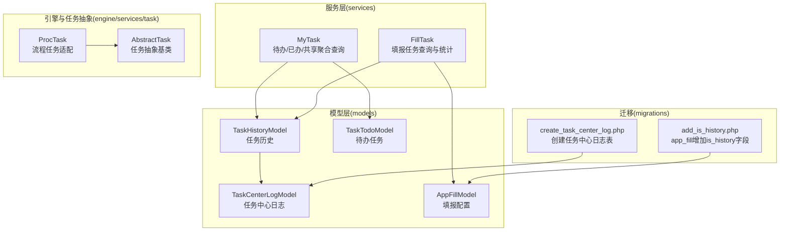
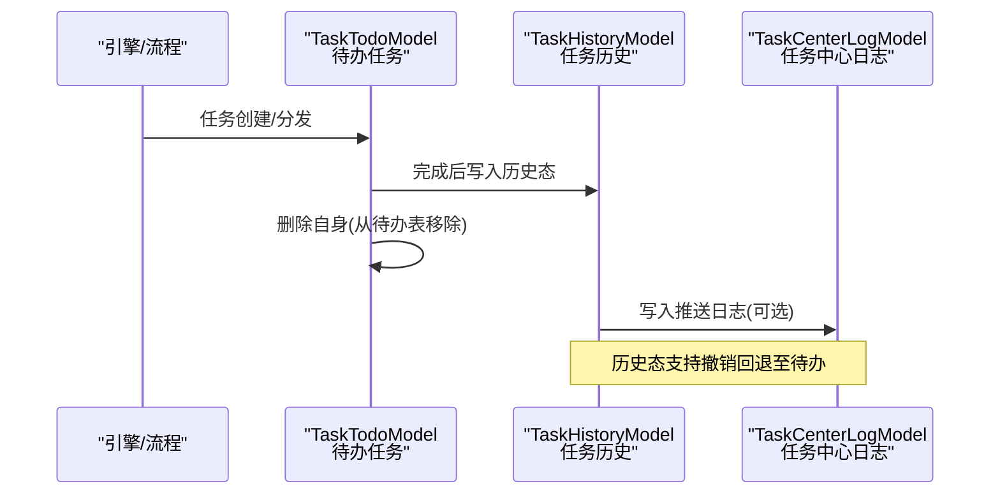
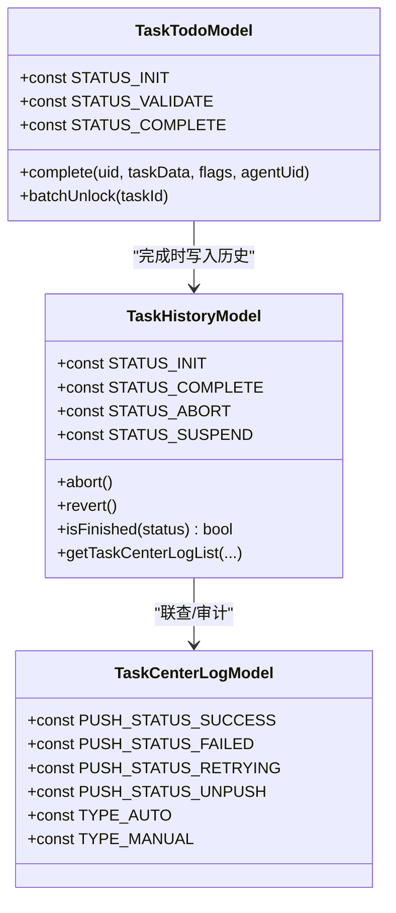
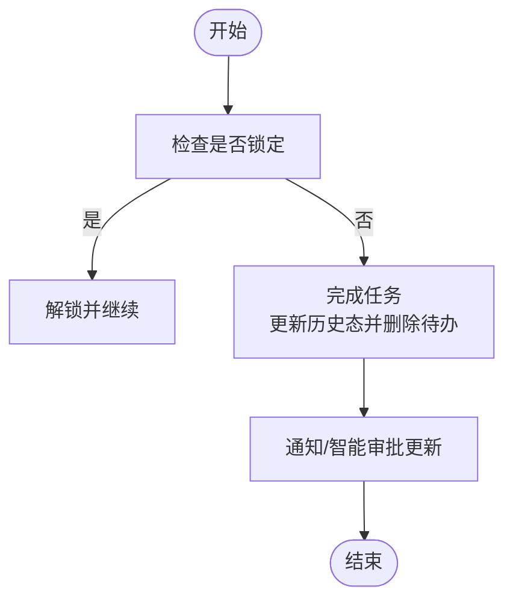
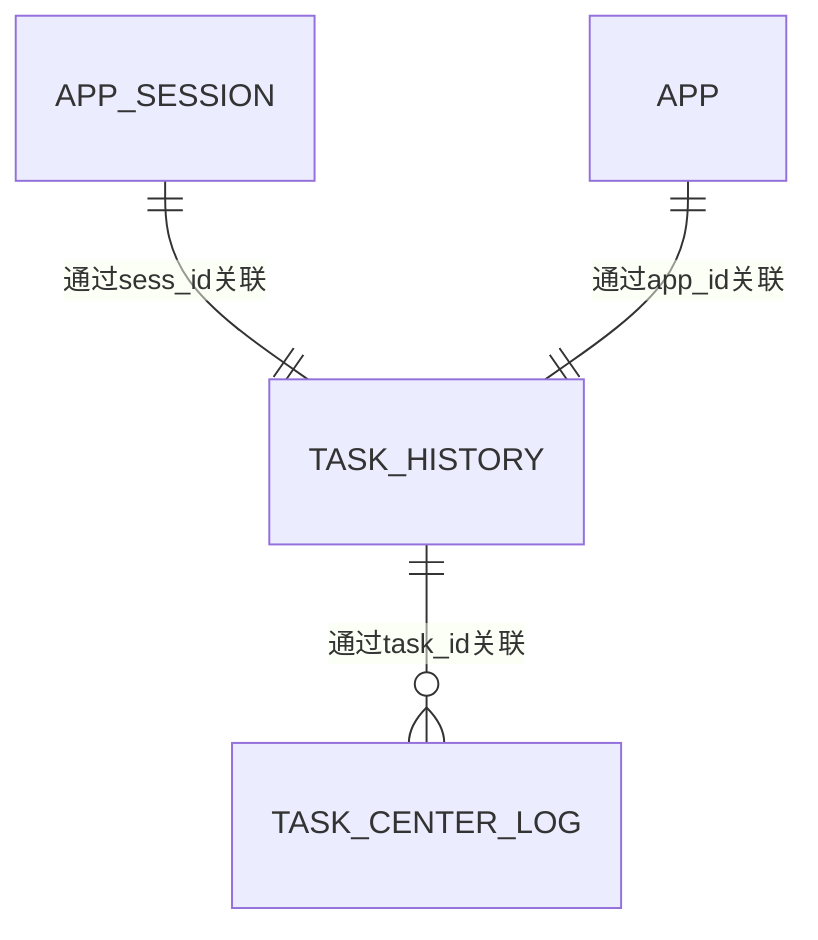
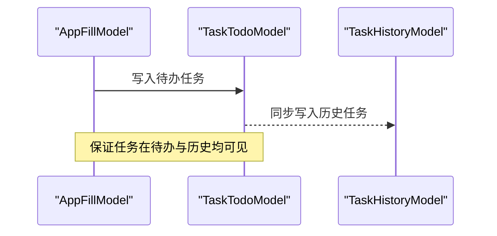
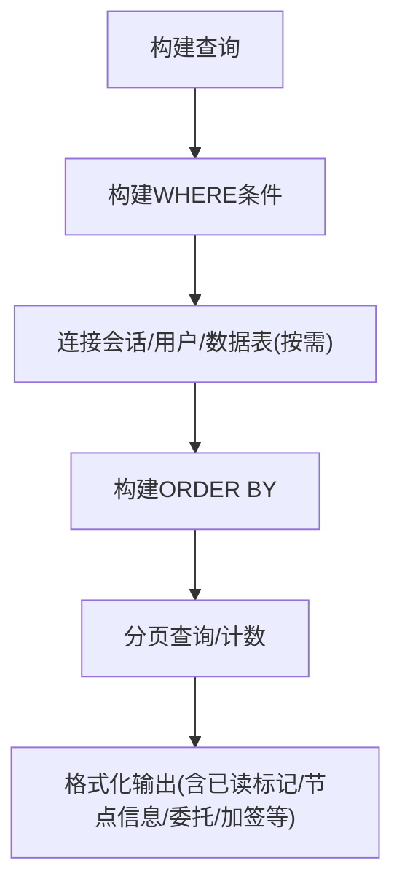
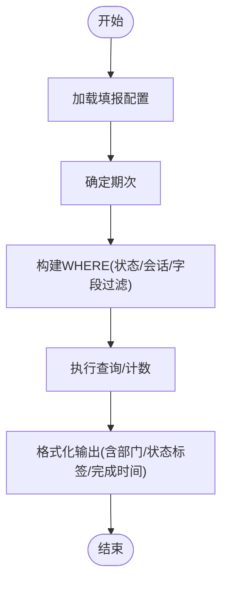
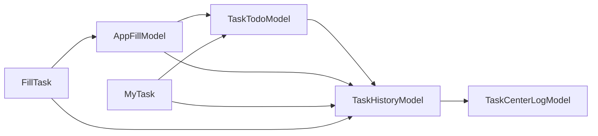

# 任务历史模型

<cite>
**本文引用的文件**
- [TaskHistoryModel.php](file://process/src/models/TaskHistoryModel.php)
- [TaskTodoModel.php](file://process/src/models/TaskTodoModel.php)
- [TaskCenterLogModel.php](file://process/src/models/TaskCenterLogModel.php)
- [MyTask.php](file://process/src/services/MyTask.php)
- [FillTask.php](file://process/src/services/FillTask.php)
- [AppFillModel.php](file://process/src/models/AppFillModel.php)
- [migration_20250820_171300_create_task_center_log.php](file://process/src/migrations/migration_20250820_171300_create_task_center_log.php)
- [migration_20250521_16037_add_is_history.php](file://process/src/migrations/migration_20250521_16037_add_is_history.php)
- [ProcTask.php](file://process/src/engine/ProcTask.php)
- [AbstractTask.php](file://process/src/services/task/AbstractTask.php)
</cite>

## 目录
1. [引言](#引言)
2. [项目结构](#项目结构)
3. [核心组件](#核心组件)
4. [架构总览](#架构总览)
5. [详细组件分析](#详细组件分析)
6. [依赖关系分析](#依赖关系分析)
7. [性能考量](#性能考量)
8. [故障排查指南](#故障排查指南)
9. [结论](#结论)
10. [附录](#附录)

## 引言
本文件聚焦于“任务历史”相关数据模型与业务流程，系统化解析以下主题：
- 任务历史模型、待办任务模型与任务中心日志模型的设计原理与实现细节
- 任务生命周期管理、历史记录保存与状态变更追踪机制
- 任务分发、接收、处理与完成的全流程记录
- 任务排序规则、自定义排序与优先级管理
- 任务历史查询、统计分析与报表生成的实现路径

## 项目结构
围绕任务历史与相关模型，本仓库的关键文件分布如下：
- 数据模型层（models）：任务历史、待办、任务中心日志、填报等
- 服务层（services）：待办/已办/共享任务聚合查询、填报任务查询与统计
- 引擎与抽象任务（engine/services/task）：任务执行与生命周期抽象
- 迁移脚本（migrations）：任务中心日志表、历史字段等数据库演进

图示来源
- [TaskHistoryModel.php](file://process/src/models/TaskHistoryModel.php#L1-L270)
- [TaskTodoModel.php](file://process/src/models/TaskTodoModel.php#L1-L288)
- [TaskCenterLogModel.php](file://process/src/models/TaskCenterLogModel.php#L1-L74)
- [MyTask.php](file://process/src/services/MyTask.php#L1-L617)
- [FillTask.php](file://process/src/services/FillTask.php#L1-L379)
- [AppFillModel.php](file://process/src/models/AppFillModel.php#L1-L220)
- [ProcTask.php](file://process/src/engine/ProcTask.php#L1-L11)
- [AbstractTask.php](file://process/src/services/task/AbstractTask.php#L1-L30)
- [migration_20250820_171300_create_task_center_log.php](file://process/src/migrations/migration_20250820_171300_create_task_center_log.php#L1-L79)
- [migration_20250521_16037_add_is_history.php](file://process/src/migrations/migration_20250521_16037_add_is_history.php#L1-L19)

章节来源
- [TaskHistoryModel.php](file://process/src/models/TaskHistoryModel.php#L1-L270)
- [TaskTodoModel.php](file://process/src/models/TaskTodoModel.php#L1-L288)
- [TaskCenterLogModel.php](file://process/src/models/TaskCenterLogModel.php#L1-L74)
- [MyTask.php](file://process/src/services/MyTask.php#L1-L617)
- [FillTask.php](file://process/src/services/FillTask.php#L1-L379)
- [AppFillModel.php](file://process/src/models/AppFillModel.php#L1-L220)
- [ProcTask.php](file://process/src/engine/ProcTask.php#L1-L11)
- [AbstractTask.php](file://process/src/services/task/AbstractTask.php#L1-L30)
- [migration_20250820_171300_create_task_center_log.php](file://process/src/migrations/migration_20250820_171300_create_task_center_log.php#L1-L79)
- [migration_20250521_16037_add_is_history.php](file://process/src/migrations/migration_20250521_16037_add_is_history.php#L1-L19)

## 核心组件
- 任务历史模型（TaskHistoryModel）
  - 职责：持久化已完成/异常/中止等历史态任务；提供历史态状态判断、撤销回退至待办、与任务中心日志联查等能力
  - 关键字段：任务标识、会话、应用、节点、任务类型、状态、创建/完成时间、填报期次与分配目标、测试标记等
  - 关键方法：撤销（abort）、回退（revert）、历史态判断（isFinished）、与任务中心日志联查（getTaskCenterLogList）

- 待办任务模型（TaskTodoModel）
  - 职责：承载进行中任务，支持完成、加签、移交、锁定、标志位管理与流程变量注入
  - 关键字段：任务标识、会话、节点、应用、任务类型、参与者、自定义排序、状态、创建时间、测试标记等
  - 关键方法：完成（complete）、撤销回退（revert调用历史模型）、锁定解锁（batchUnlock）、流程变量写入（addVariable/setVariable）

- 任务中心日志模型（TaskCenterLogModel）
  - 职责：记录任务向任务中心推送的明细、结果、重试次数与失败时间等
  - 关键字段：实例ID、任务ID、任务状态、推送状态、第三方平台ID、推送类型、数据与结果、创建/修改时间、创建人等
  - 关键枚举：推送状态（成功/失败/重试中/未推送）、推送类型（自动/手动）

- 填报配置模型（AppFillModel）
  - 职责：描述周期性/按期次的填报任务分发策略，支持“发到人/发到部门”，并创建历史态任务
  - 关键字段：周期规则、用户类型、职位/角色/范围、是否启用重报、期次、起止时间、历史标记等
  - 关键方法：创建任务（createTask）、计算下次发任务时间（getNextTime）、权限聚合（getFillIds）

- 服务组件
  - MyTask：聚合待办/已办/共享/委托任务，支持多种排序规则（收到时间、自定义排序、完成时间）与多维过滤
  - FillTask：面向填报任务的查询、统计与格式化输出，支持按期次、状态、会话状态、数据表字段过滤

章节来源
- [TaskHistoryModel.php](file://process/src/models/TaskHistoryModel.php#L1-L270)
- [TaskTodoModel.php](file://process/src/models/TaskTodoModel.php#L1-L288)
- [TaskCenterLogModel.php](file://process/src/models/TaskCenterLogModel.php#L1-L74)
- [AppFillModel.php](file://process/src/models/AppFillModel.php#L1-L220)
- [MyTask.php](file://process/src/services/MyTask.php#L1-L617)
- [FillTask.php](file://process/src/services/FillTask.php#L1-L379)

## 架构总览
任务从“待办”进入“历史”的典型流转如下：

图示来源
- [TaskTodoModel.php](file://process/src/models/TaskTodoModel.php#L164-L211)
- [TaskHistoryModel.php](file://process/src/models/TaskHistoryModel.php#L131-L168)
- [TaskCenterLogModel.php](file://process/src/models/TaskCenterLogModel.php#L1-L74)

## 详细组件分析

### 任务历史模型（TaskHistoryModel）
- 设计要点
  - 与TaskTodoModel共享任务ID，完成即迁移到历史表，保持查询一致性
  - 提供撤销（abort）与回退（revert）两类状态变更路径
  - 支持与任务中心日志联查，便于审计与对账
- 生命周期关键点
  - 完成：由待办完成接口更新历史态并删除待办记录
  - 中止/异常：提供中止接口，清理待办与代理记录
  - 回退：将历史态任务恢复为待办，并触发接收事件
- 关键接口路径
  - 撤销：[TaskHistoryModel::abort](file://process/src/models/TaskHistoryModel.php#L100-L107)
  - 回退：[TaskHistoryModel::revert](file://process/src/models/TaskHistoryModel.php#L132-L168)
  - 历史态判断：[TaskHistoryModel::isFinished](file://process/src/models/TaskHistoryModel.php#L125-L129)
  - 日志联查：[TaskHistoryModel::getTaskCenterLogList](file://process/src/models/TaskHistoryModel.php#L181-L269)

图示来源
- [TaskHistoryModel.php](file://process/src/models/TaskHistoryModel.php#L1-L270)
- [TaskTodoModel.php](file://process/src/models/TaskTodoModel.php#L164-L211)
- [TaskCenterLogModel.php](file://process/src/models/TaskCenterLogModel.php#L1-L74)

章节来源
- [TaskHistoryModel.php](file://process/src/models/TaskHistoryModel.php#L1-L270)

### 待办任务模型（TaskTodoModel）
- 设计要点
  - 支持完成、加签、移交、锁定、标志位管理
  - 通过流程变量接口注入上下文，支撑复杂审批场景
- 关键接口路径
  - 完成：[TaskTodoModel::complete](file://process/src/models/TaskTodoModel.php#L164-L211)
  - 锁定/解锁：[TaskTodoModel::batchUnlock](file://process/src/models/TaskTodoModel.php#L258-L265)
  - 流程变量：[TaskTodoModel::addVariable/setVariable](file://process/src/models/TaskTodoModel.php#L103-L146)
  - 权限校验：[TaskTodoModel::hasExaminePermit](file://process/src/models/TaskTodoModel.php#L213-L225)

图示来源
- [TaskTodoModel.php](file://process/src/models/TaskTodoModel.php#L164-L211)

章节来源
- [TaskTodoModel.php](file://process/src/models/TaskTodoModel.php#L1-L288)

### 任务中心日志模型（TaskCenterLogModel）
- 设计要点
  - 记录任务中心推送的明细、结果、重试次数与失败时间
  - 提供推送状态与类型映射，便于前端展示与统计
- 关键接口路径
  - 推送状态/类型映射：[TaskCenterLogModel](file://process/src/models/TaskCenterLogModel.php#L47-L67)
  - 历史联查入口：[TaskHistoryModel::getTaskCenterLogList](file://process/src/models/TaskHistoryModel.php#L181-L269)

图示来源
- [TaskHistoryModel.php](file://process/src/models/TaskHistoryModel.php#L181-L269)
- [TaskCenterLogModel.php](file://process/src/models/TaskCenterLogModel.php#L1-L74)

章节来源
- [TaskCenterLogModel.php](file://process/src/models/TaskCenterLogModel.php#L1-L74)
- [TaskHistoryModel.php](file://process/src/models/TaskHistoryModel.php#L181-L269)

### 填报配置模型（AppFillModel）
- 设计要点
  - 描述周期性/按期次的填报任务分发策略，支持“发到人/发到部门”
  - 创建任务时同时写入待办与历史两条记录，确保查询一致性
- 关键接口路径
  - 创建任务：[AppFillModel::createTask](file://process/src/models/AppFillModel.php#L181-L201)
  - 下次发任务时间：[AppFillModel::getNextTime](file://process/src/models/AppFillModel.php#L128-L169)

图示来源
- [AppFillModel.php](file://process/src/models/AppFillModel.php#L181-L201)
- [TaskTodoModel.php](file://process/src/models/TaskTodoModel.php#L1-L288)
- [TaskHistoryModel.php](file://process/src/models/TaskHistoryModel.php#L1-L270)

章节来源
- [AppFillModel.php](file://process/src/models/AppFillModel.php#L1-L220)

### 服务层：MyTask（待办/已办/共享聚合查询）
- 设计要点
  - 支持多种排序规则：收到时间升/降序、自定义排序升/降序、完成时间升/降序
  - 支持多维过滤：事项/节点/任务ID/发起人部门/关键词/时间范围/审批人/岗位等
  - 支持测试数据隔离与委托任务视图
- 关键接口路径
  - 列表查询与格式化：[MyTask::list/format](file://process/src/services/MyTask.php#L118-L149)
  - 过滤构建：[MyTask::buildWhere](file://process/src/services/MyTask.php#L344-L498)
  - 排序构建：[MyTask::buildOrderBy](file://process/src/services/MyTask.php#L500-L514)
  - 查询构造：[MyTask::getQuery](file://process/src/services/MyTask.php#L517-L585)

图示来源
- [MyTask.php](file://process/src/services/MyTask.php#L344-L585)

章节来源
- [MyTask.php](file://process/src/services/MyTask.php#L1-L617)

### 服务层：FillTask（填报任务查询与统计）
- 设计要点
  - 面向填报任务的查询、统计与格式化输出
  - 支持按期次、状态、会话状态、数据表字段过滤
  - 提供统计接口（按状态分组计数）
- 关键接口路径
  - 查询构建：[FillTask::getQuery](file://process/src/services/FillTask.php#L141-L208)
  - 统计接口：[FillTask::getStats](file://process/src/services/FillTask.php#L112-L139)
  - 格式化输出：[FillTask::format](file://process/src/services/FillTask.php#L210-L249)

图示来源
- [FillTask.php](file://process/src/services/FillTask.php#L141-L249)

章节来源
- [FillTask.php](file://process/src/services/FillTask.php#L1-L379)

### 引擎与任务抽象
- 引擎适配：ProcTask继承自底层引擎任务，保留序列化兼容性
- 任务抽象：AbstractTask提供统一的序列化与无效参数忽略逻辑

章节来源
- [ProcTask.php](file://process/src/engine/ProcTask.php#L1-L11)
- [AbstractTask.php](file://process/src/services/task/AbstractTask.php#L1-L30)

## 依赖关系分析
- 模型间依赖
  - TaskTodoModel → TaskHistoryModel：完成时写入历史并删除自身
  - TaskHistoryModel → TaskCenterLogModel：联查任务中心推送日志
  - AppFillModel → TaskTodoModel/TaskHistoryModel：创建任务时同时写入两条记录
- 服务层依赖
  - MyTask：依赖TaskTodoModel/TaskHistoryModel、AppSessionModel、UsersModel、TaskReadLogModel等
  - FillTask：依赖TaskHistoryModel、AppFillModel、AppFillPeriodModel、DataTableModel等

图示来源
- [TaskTodoModel.php](file://process/src/models/TaskTodoModel.php#L164-L211)
- [TaskHistoryModel.php](file://process/src/models/TaskHistoryModel.php#L131-L168)
- [AppFillModel.php](file://process/src/models/AppFillModel.php#L181-L201)
- [TaskCenterLogModel.php](file://process/src/models/TaskCenterLogModel.php#L1-L74)
- [MyTask.php](file://process/src/services/MyTask.php#L1-L617)
- [FillTask.php](file://process/src/services/FillTask.php#L1-L379)

章节来源
- [TaskTodoModel.php](file://process/src/models/TaskTodoModel.php#L1-L288)
- [TaskHistoryModel.php](file://process/src/models/TaskHistoryModel.php#L1-L270)
- [AppFillModel.php](file://process/src/models/AppFillModel.php#L1-L220)
- [TaskCenterLogModel.php](file://process/src/models/TaskCenterLogModel.php#L1-L74)
- [MyTask.php](file://process/src/services/MyTask.php#L1-L617)
- [FillTask.php](file://process/src/services/FillTask.php#L1-L379)

## 性能考量
- 查询优化
  - MyTask在构建查询时按需连接app_session/users，避免不必要的JOIN
  - FillTask支持基于数据表缓存键的字段过滤，减少无关列扫描
- 状态与索引
  - 迁移脚本中新增任务历史索引，有助于历史查询与统计
- 缓存与集合
  - 服务层广泛使用集合类（如UsersCollection、AppSessionCollection）减少重复查询
- 排序与分页
  - MyTask提供多种排序维度，建议结合业务选择合适索引与LIMIT/OFFSET策略

## 故障排查指南
- 历史记录缺失
  - 检查任务是否在完成时正确迁移到历史表（参考完成接口路径）
  - 排查是否存在测试数据隔离导致的历史记录过滤
- 推送日志异常
  - 核对任务中心日志表字段与推送状态映射
  - 使用历史联查接口核对推送明细与失败时间
- 填报任务未生成
  - 确认周期规则与期次配置是否有效
  - 检查创建任务接口是否同时写入待办与历史两条记录

章节来源
- [TaskTodoModel.php](file://process/src/models/TaskTodoModel.php#L164-L211)
- [TaskHistoryModel.php](file://process/src/models/TaskHistoryModel.php#L181-L269)
- [TaskCenterLogModel.php](file://process/src/models/TaskCenterLogModel.php#L1-L74)
- [AppFillModel.php](file://process/src/models/AppFillModel.php#L181-L201)

## 结论
本设计通过“待办-历史”双轨记录与任务中心日志联查，实现了任务生命周期的完整追踪与审计能力。服务层提供了灵活的查询、排序与统计接口，满足多场景下的任务历史分析与报表需求。迁移脚本保障了数据库结构的持续演进与性能优化。

## 附录
- 数据库迁移
  - 任务中心日志表创建与定时任务注册：[migration_20250820_171300_create_task_center_log.php](file://process/src/migrations/migration_20250820_171300_create_task_center_log.php#L1-L79)
  - app_fill增加历史标记字段：[migration_20250521_16037_add_is_history.php](file://process/src/migrations/migration_20250521_16037_add_is_history.php#L1-L19)