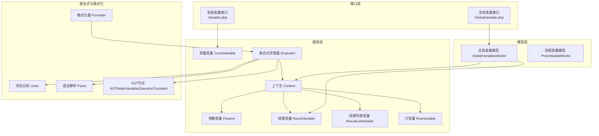
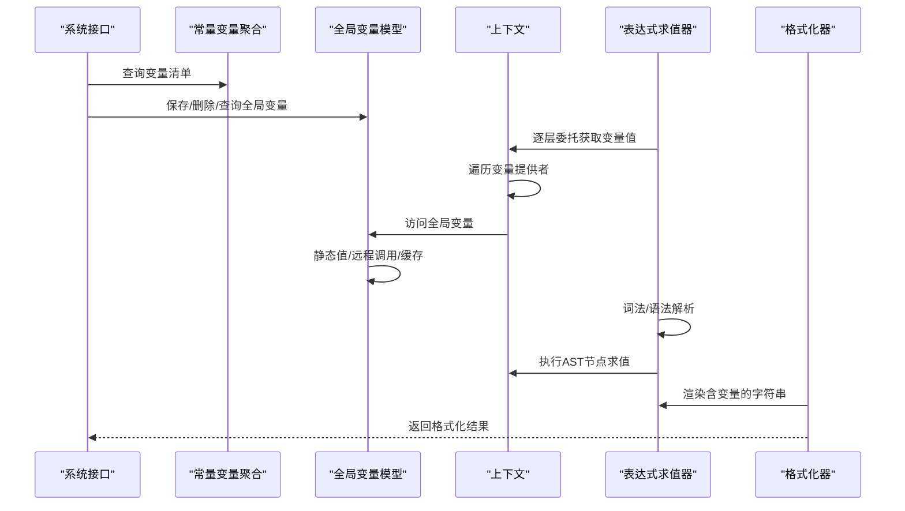
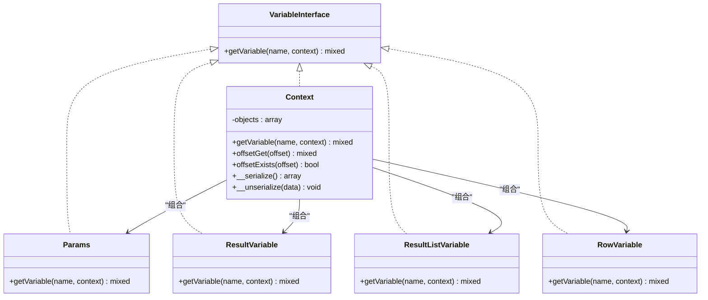
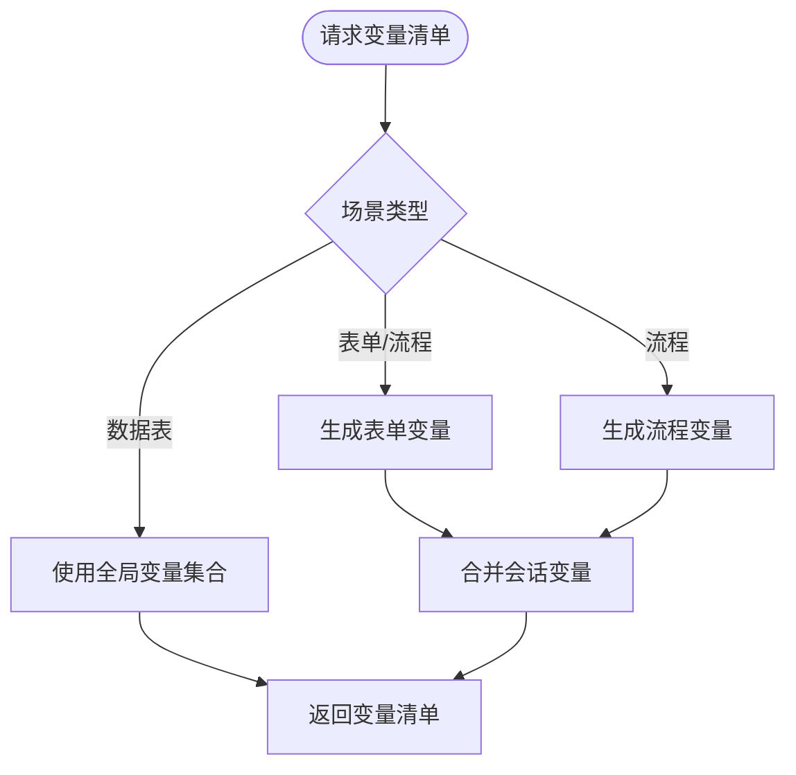
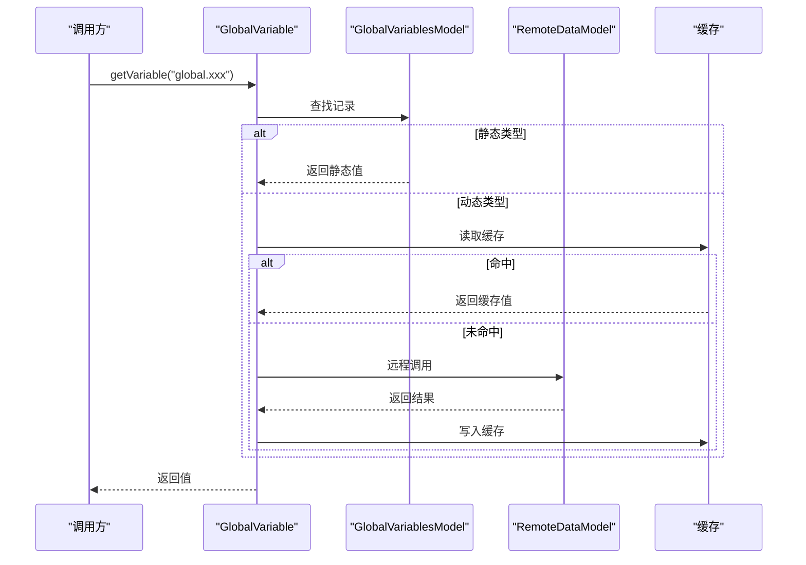
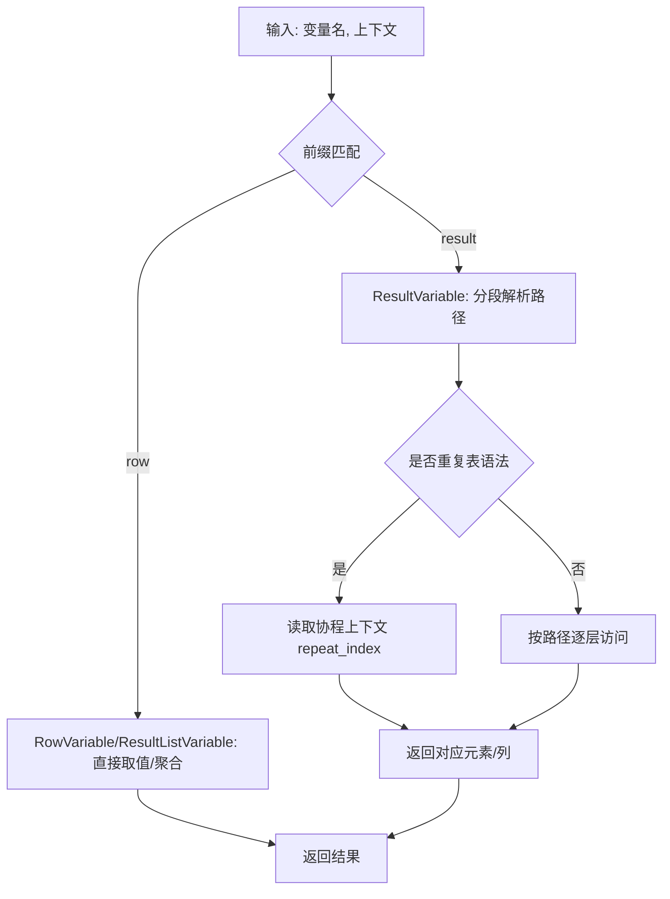
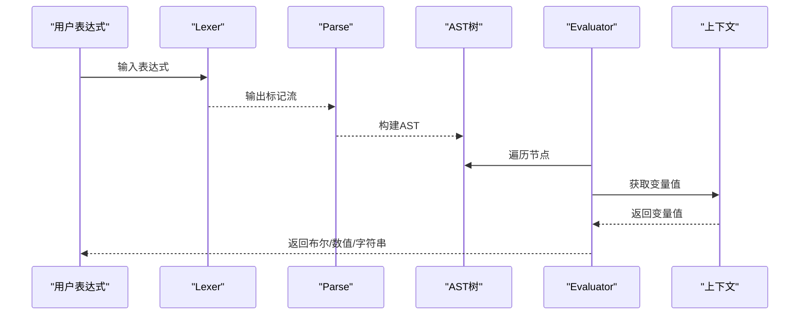
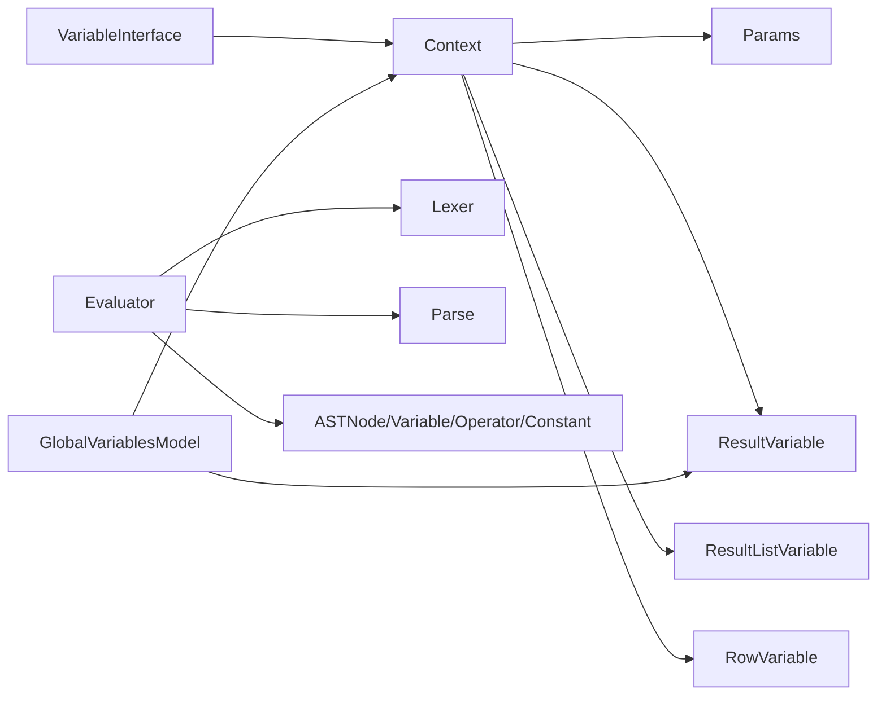

# 流程变量模型

<cite>
**本文引用的文件**
- [GlobalVariable.php](file://process/src/services/GlobalVariable.php)
- [GlobalVariablesModel.php](file://process/src/models/GlobalVariablesModel.php)
- [ConstVariable.php](file://process/src/services/ConstVariable.php)
- [Context.php](file://process/src/services/Context.php)
- [Params.php](file://process/src/services/Params.php)
- [ResultVariable.php](file://process/src/services/ResultVariable.php)
- [ResultListVariable.php](file://process/src/services/ResultListVariable.php)
- [RowVariable.php](file://process/src/services/RowVariable.php)
- [ProcVariableModel.php](file://process/src/models/ProcVariableModel.php)
- [Evaluator.php](file://process/src/services/expression/Evaluator.php)
- [Lexer.php](file://process/src/services/expression/Lexer.php)
- [Parse.php](file://process/src/services/expression/Parse.php)
- [ASTNode.php](file://process/src/services/expression/ASTNode.php)
- [Variable.php（表达式）](file://process/src/services/expression/Variable.php)
- [Operator.php](file://process/src/services/expression/Operator.php)
- [Constant.php](file://process/src/services/expression/Constant.php)
- [Formater.php](file://process/src/services/Formater.php)
- [Variable（系统接口）.php](file://process/src/http/system/Variable.php)
- [GlobalVariable（系统接口）.php](file://process/src/http/system/GlobalVariable.php)
- [VariableInterface.php](file://process/vendor/lifei/engine/src/VariableInterface.php)
</cite>

## 目录
1. [简介](#简介)
2. [项目结构](#项目结构)
3. [核心组件](#核心组件)
4. [架构总览](#架构总览)
5. [详细组件分析](#详细组件分析)
6. [依赖分析](#依赖分析)
7. [性能考量](#性能考量)
8. [故障排查指南](#故障排查指南)
9. [结论](#结论)
10. [附录](#附录)

## 简介
本文件围绕“流程变量模型”构建一套系统化的技术文档，聚焦以下目标：
- 流程变量模型与全局变量服务、结果变量服务的设计架构
- 变量的定义、存储、访问与生命周期管理机制
- 变量类型系统、表达式求值与数据转换功能
- 变量作用域管理、变量继承与冲突解决策略
- 最佳实践、性能优化与调试技巧

该仓库提供了从“常量变量集合”到“运行时上下文变量”的完整链路，并通过表达式引擎与格式化器实现变量的动态求值与渲染。

## 项目结构
围绕变量模型的关键目录与文件如下：
- 服务层：变量接口、上下文、参数、结果变量、行变量、常量变量聚合等
- 模型层：全局变量持久化、流程变量持久化
- 表达式与格式化：词法/语法解析、AST节点、求值器、格式化器
- 接口层：系统变量查询、全局变量维护接口

图表来源
- [Variable（系统接口）.php](file://process/src/http/system/Variable.php#L1-L76)
- [GlobalVariable（系统接口）.php](file://process/src/http/system/GlobalVariable.php#L42-L97)
- [ConstVariable.php](file://process/src/services/ConstVariable.php#L1-L393)
- [Context.php](file://process/src/services/Context.php#L1-L77)
- [Params.php](file://process/src/services/Params.php#L1-L24)
- [ResultVariable.php](file://process/src/services/ResultVariable.php#L1-L52)
- [ResultListVariable.php](file://process/src/services/ResultListVariable.php#L1-L34)
- [RowVariable.php](file://process/src/services/RowVariable.php#L1-L25)
- [Evaluator.php](file://process/src/services/expression/Evaluator.php#L1-L47)
- [Lexer.php](file://process/src/services/expression/Lexer.php#L1-L404)
- [Parse.php](file://process/src/services/expression/Parse.php#L1-L138)
- [ASTNode.php](file://process/src/services/expression/ASTNode.php#L1-L16)
- [Variable.php（表达式）](file://process/src/services/expression/Variable.php#L1-L16)
- [Operator.php](file://process/src/services/expression/Operator.php#L1-L25)
- [Constant.php](file://process/src/services/expression/Constant.php#L1-L16)
- [Formater.php](file://process/src/services/Formater.php#L1-L245)
- [GlobalVariablesModel.php](file://process/src/models/GlobalVariablesModel.php#L1-L53)
- [ProcVariableModel.php](file://process/src/models/ProcVariableModel.php#L1-L66)

章节来源
- [Variable（系统接口）.php](file://process/src/http/system/Variable.php#L1-L76)
- [GlobalVariablesModel.php](file://process/src/models/GlobalVariablesModel.php#L1-L53)

## 核心组件
- 变量接口与上下文
  - 变量接口定义统一的变量获取方法，供表达式与上下文消费
  - 上下文作为变量容器，支持嵌套变量提供者与数组式访问
- 常量变量聚合
  - 提供全局、会话、流程、表单、个人等维度的变量清单
- 动态变量服务
  - 全局变量模型支持静态值与远程数据动态值两类，具备缓存与上下文注入能力
  - 结果变量服务支持 result 与 row 的路径式访问，兼容循环/重复表场景
- 表达式与格式化
  - 词法/语法解析生成 AST，结合上下文变量求值
  - 格式化器支持函数与变量占位符混合渲染

章节来源
- [VariableInterface.php](file://process/vendor/lifei/engine/src/VariableInterface.php#L1-L12)
- [Context.php](file://process/src/services/Context.php#L1-L77)
- [ConstVariable.php](file://process/src/services/ConstVariable.php#L1-L393)
- [GlobalVariablesModel.php](file://process/src/models/GlobalVariablesModel.php#L1-L53)
- [ResultVariable.php](file://process/src/services/ResultVariable.php#L1-L52)
- [ResultListVariable.php](file://process/src/services/ResultListVariable.php#L1-L34)
- [RowVariable.php](file://process/src/services/RowVariable.php#L1-L25)
- [Evaluator.php](file://process/src/services/expression/Evaluator.php#L1-L47)
- [Lexer.php](file://process/src/services/expression/Lexer.php#L1-L404)
- [Parse.php](file://process/src/services/expression/Parse.php#L1-L138)
- [ASTNode.php](file://process/src/services/expression/ASTNode.php#L1-L16)
- [Variable.php（表达式）](file://process/src/services/expression/Variable.php#L1-L16)
- [Operator.php](file://process/src/services/expression/Operator.php#L1-L25)
- [Constant.php](file://process/src/services/expression/Constant.php#L1-L16)
- [Formater.php](file://process/src/services/Formater.php#L1-L245)

## 架构总览
变量体系由“定义—存储—访问—求值—渲染”闭环构成：

图表来源
- [Variable（系统接口）.php](file://process/src/http/system/Variable.php#L1-L76)
- [GlobalVariable（系统接口）.php](file://process/src/http/system/GlobalVariable.php#L42-L97)
- [ConstVariable.php](file://process/src/services/ConstVariable.php#L1-L393)
- [GlobalVariablesModel.php](file://process/src/models/GlobalVariablesModel.php#L1-L53)
- [Context.php](file://process/src/services/Context.php#L1-L77)
- [Evaluator.php](file://process/src/services/expression/Evaluator.php#L1-L47)
- [Formater.php](file://process/src/services/Formater.php#L1-L245)

## 详细组件分析

### 变量接口与上下文
- 变量接口
  - 统一的变量获取签名，支持带上下文的重载，便于在复杂流程中区分同名变量
- 上下文
  - 实现变量接口与数组访问，按注册顺序遍历变量提供者，优先返回首个非空值
  - 支持序列化/反序列化，便于跨协程/进程传递

图表来源
- [VariableInterface.php](file://process/vendor/lifei/engine/src/VariableInterface.php#L1-L12)
- [Context.php](file://process/src/services/Context.php#L1-L77)
- [Params.php](file://process/src/services/Params.php#L1-L24)
- [ResultVariable.php](file://process/src/services/ResultVariable.php#L1-L52)
- [ResultListVariable.php](file://process/src/services/ResultListVariable.php#L1-L34)
- [RowVariable.php](file://process/src/services/RowVariable.php#L1-L25)

章节来源
- [VariableInterface.php](file://process/vendor/lifei/engine/src/VariableInterface.php#L1-L12)
- [Context.php](file://process/src/services/Context.php#L1-L77)
- [Params.php](file://process/src/services/Params.php#L1-L24)
- [ResultVariable.php](file://process/src/services/ResultVariable.php#L1-L52)
- [ResultListVariable.php](file://process/src/services/ResultListVariable.php#L1-L34)
- [RowVariable.php](file://process/src/services/RowVariable.php#L1-L25)

### 常量变量聚合（ConstVariable）
- 定义范围
  - 全局变量、会话变量、流程变量、表单变量、个人变量、公开页面行内变量等
- 生成逻辑
  - 根据应用版本与场景动态拼装变量清单
  - 流程变量根据流程节点类型与服务任务回写变量生成
- 使用方式
  - 系统接口提供变量清单查询入口

图表来源
- [ConstVariable.php](file://process/src/services/ConstVariable.php#L1-L393)
- [Variable（系统接口）.php](file://process/src/http/system/Variable.php#L1-L76)

章节来源
- [ConstVariable.php](file://process/src/services/ConstVariable.php#L1-L393)
- [Variable（系统接口）.php](file://process/src/http/system/Variable.php#L1-L76)

### 全局变量服务（GlobalVariable + GlobalVariablesModel）
- 存储模型
  - 支持静态值与动态值两类；动态值通过远程数据模型调用并缓存
- 访问路径
  - 以 global.key 命名空间访问
- 生命周期
  - 静态值直接返回；动态值先查缓存，未命中则远程调用并写入缓存

图表来源
- [GlobalVariable.php](file://process/src/services/GlobalVariable.php#L1-L20)
- [GlobalVariablesModel.php](file://process/src/models/GlobalVariablesModel.php#L1-L53)

章节来源
- [GlobalVariable.php](file://process/src/services/GlobalVariable.php#L1-L20)
- [GlobalVariablesModel.php](file://process/src/models/GlobalVariablesModel.php#L1-L53)

### 结果变量服务（ResultVariable / ResultListVariable / RowVariable）
- 结果变量
  - 支持 result.path 与 result.#path 的路径访问；在循环/重复表中通过协程上下文定位当前索引
- 结果列表变量
  - 对 row.key 聚合返回某字段的逗号拼接结果
- 行变量
  - 对 row.key 直接取值，兼容数组/对象两种形态

图表来源
- [ResultVariable.php](file://process/src/services/ResultVariable.php#L1-L52)
- [ResultListVariable.php](file://process/src/services/ResultListVariable.php#L1-L34)
- [RowVariable.php](file://process/src/services/RowVariable.php#L1-L25)

章节来源
- [ResultVariable.php](file://process/src/services/ResultVariable.php#L1-L52)
- [ResultListVariable.php](file://process/src/services/ResultListVariable.php#L1-L34)
- [RowVariable.php](file://process/src/services/RowVariable.php#L1-L25)

### 表达式求值与数据转换（Evaluator + Lexer + Parse + ASTNode）
- 词法分析
  - 识别数字、字符串、运算符、标识符（含 result.row.params 等路径），并规范化括号与逗号
- 语法解析
  - 采用递归下降与运算符优先级，生成二元/一元/函数/常量/变量等 AST 节点
- 求值
  - 从根节点深度优先遍历，结合上下文变量与内置运算符得出布尔/数值/字符串结果
- 格式化
  - 支持在字符串中嵌入变量与函数，按顺序解析并替换

图表来源
- [Evaluator.php](file://process/src/services/expression/Evaluator.php#L1-L47)
- [Lexer.php](file://process/src/services/expression/Lexer.php#L1-L404)
- [Parse.php](file://process/src/services/expression/Parse.php#L1-L138)
- [ASTNode.php](file://process/src/services/expression/ASTNode.php#L1-L16)
- [Variable.php（表达式）](file://process/src/services/expression/Variable.php#L1-L16)
- [Operator.php](file://process/src/services/expression/Operator.php#L1-L25)
- [Constant.php](file://process/src/services/expression/Constant.php#L1-L16)
- [Formater.php](file://process/src/services/Formater.php#L1-L245)

章节来源
- [Evaluator.php](file://process/src/services/expression/Evaluator.php#L1-L47)
- [Lexer.php](file://process/src/services/expression/Lexer.php#L1-L404)
- [Parse.php](file://process/src/services/expression/Parse.php#L1-L138)
- [ASTNode.php](file://process/src/services/expression/ASTNode.php#L1-L16)
- [Variable.php（表达式）](file://process/src/services/expression/Variable.php#L1-L16)
- [Operator.php](file://process/src/services/expression/Operator.php#L1-L25)
- [Constant.php](file://process/src/services/expression/Constant.php#L1-L16)
- [Formater.php](file://process/src/services/Formater.php#L1-L245)

### 变量作用域、继承与冲突解决
- 作用域
  - params、result、row、global 等命名空间隔离，避免同名冲突
- 继承
  - 上下文可组合多个变量提供者，形成“就近优先”的继承链
- 冲突解决
  - 通过命名空间前缀与路径解析明确优先级；上下文中按注册顺序返回首个非空值

章节来源
- [Context.php](file://process/src/services/Context.php#L1-L77)
- [Params.php](file://process/src/services/Params.php#L1-L24)
- [ResultVariable.php](file://process/src/services/ResultVariable.php#L1-L52)
- [RowVariable.php](file://process/src/services/RowVariable.php#L1-L25)
- [GlobalVariable.php](file://process/src/services/GlobalVariable.php#L1-L20)

### 生命周期管理
- 全局变量
  - 静态值：瞬时可用
  - 动态值：带缓存，按需刷新
- 流程变量
  - 以 sess_id/execute_id/name 为维度持久化，支持计数/自增等扩展（注释中可见）

章节来源
- [GlobalVariablesModel.php](file://process/src/models/GlobalVariablesModel.php#L1-L53)
- [ProcVariableModel.php](file://process/src/models/ProcVariableModel.php#L1-L66)

## 依赖分析
- 组件耦合
  - 上下文对各变量提供者松耦合，通过接口统一访问
  - 表达式求值器依赖词法/语法与 AST 节点，与上下文解耦
- 外部依赖
  - 引擎变量接口来自 vendor，确保跨模块一致性
  - 全局变量动态值依赖远程数据模型与缓存

图表来源
- [VariableInterface.php](file://process/vendor/lifei/engine/src/VariableInterface.php#L1-L12)
- [Context.php](file://process/src/services/Context.php#L1-L77)
- [Evaluator.php](file://process/src/services/expression/Evaluator.php#L1-L47)
- [Lexer.php](file://process/src/services/expression/Lexer.php#L1-L404)
- [Parse.php](file://process/src/services/expression/Parse.php#L1-L138)
- [ASTNode.php](file://process/src/services/expression/ASTNode.php#L1-L16)
- [Variable.php（表达式）](file://process/src/services/expression/Variable.php#L1-L16)
- [Operator.php](file://process/src/services/expression/Operator.php#L1-L25)
- [Constant.php](file://process/src/services/expression/Constant.php#L1-L16)
- [GlobalVariablesModel.php](file://process/src/models/GlobalVariablesModel.php#L1-L53)

章节来源
- [VariableInterface.php](file://process/vendor/lifei/engine/src/VariableInterface.php#L1-L12)
- [Context.php](file://process/src/services/Context.php#L1-L77)
- [Evaluator.php](file://process/src/services/expression/Evaluator.php#L1-L47)
- [Lexer.php](file://process/src/services/expression/Lexer.php#L1-L404)
- [Parse.php](file://process/src/services/expression/Parse.php#L1-L138)
- [ASTNode.php](file://process/src/services/expression/ASTNode.php#L1-L16)
- [Variable.php（表达式）](file://process/src/services/expression/Variable.php#L1-L16)
- [Operator.php](file://process/src/services/expression/Operator.php#L1-L25)
- [Constant.php](file://process/src/services/expression/Constant.php#L1-L16)
- [GlobalVariablesModel.php](file://process/src/models/GlobalVariablesModel.php#L1-L53)

## 性能考量
- 缓存策略
  - 全局变量动态值使用缓存，减少远程调用开销
- 解析优化
  - 词法/语法解析一次性完成，AST复用可降低重复解析成本
- 上下文访问
  - 顺序遍历变量提供者，建议将常用提供者置于前部，缩短命中路径
- 表达式求值
  - 对简单条件表达式可短路返回（如常量 true），避免无谓求值

[本节为通用指导，无需列出具体文件来源]

## 故障排查指南
- 表达式解析失败
  - 检查表达式语法与括号匹配；确认变量命名空间正确
- 变量取值为空
  - 核对命名空间前缀（params/result/row/global/form/proc/data 等）
  - 在循环/重复表场景检查协程上下文中的 repeat_index
- 全局变量未生效
  - 确认类型为静态或动态；检查缓存键与远程数据调用是否成功
- 接口权限问题
  - 全局变量删除需校验创建者或超级权限

章节来源
- [Evaluator.php](file://process/src/services/expression/Evaluator.php#L1-L47)
- [ResultVariable.php](file://process/src/services/ResultVariable.php#L1-L52)
- [GlobalVariable（系统接口）.php](file://process/src/http/system/GlobalVariable.php#L42-L97)

## 结论
该变量模型通过“接口抽象—上下文组合—表达式求值—格式化渲染”的分层设计，实现了从常量到动态值的全栈覆盖。命名空间隔离与上下文继承机制保证了变量作用域清晰、冲突可控；表达式引擎与格式化器为业务规则与展示渲染提供了强大支撑。建议在实际使用中遵循命名规范、合理利用缓存与上下文顺序，以获得更优的性能与可维护性。

[本节为总结性内容，无需列出具体文件来源]

## 附录
- 变量命名规范
  - params.xxx：参数变量
  - result/path 或 result.#path：结果变量（支持重复表）
  - row.xxx：行变量
  - global.xxx：全局变量
  - form.{formId}.{fieldKey}：表单变量
  - proc.{nodeKey}.operation.*：流程变量
  - data.{field}：数据表字段变量
- 常用接口
  - 系统变量清单：系统接口提供 all/common/global 等查询
  - 全局变量维护：系统接口提供保存/删除/详情等操作

章节来源
- [Variable（系统接口）.php](file://process/src/http/system/Variable.php#L1-L76)
- [GlobalVariable（系统接口）.php](file://process/src/http/system/GlobalVariable.php#L42-L97)
- [ConstVariable.php](file://process/src/services/ConstVariable.php#L1-L393)