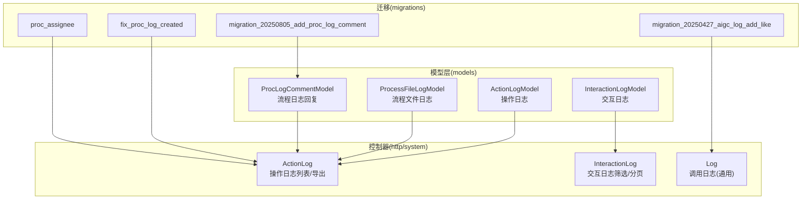
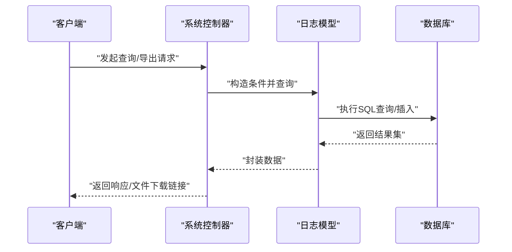
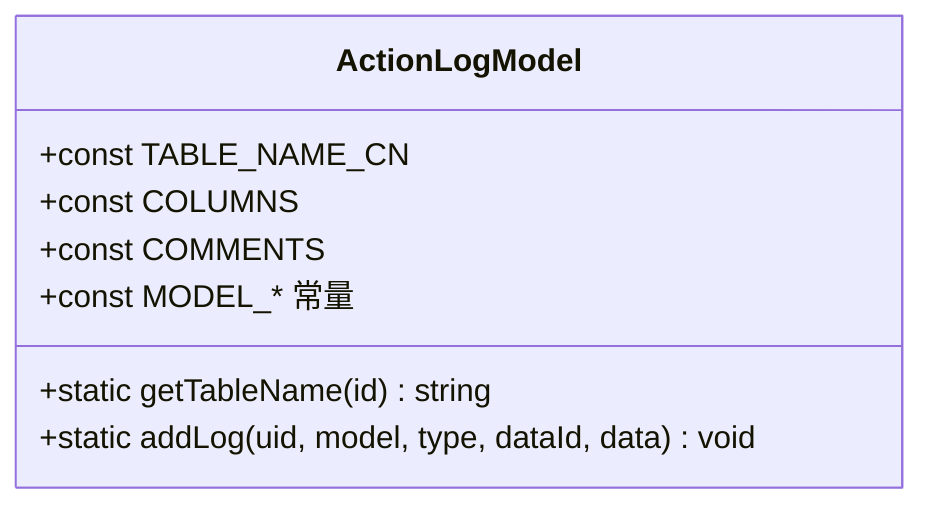
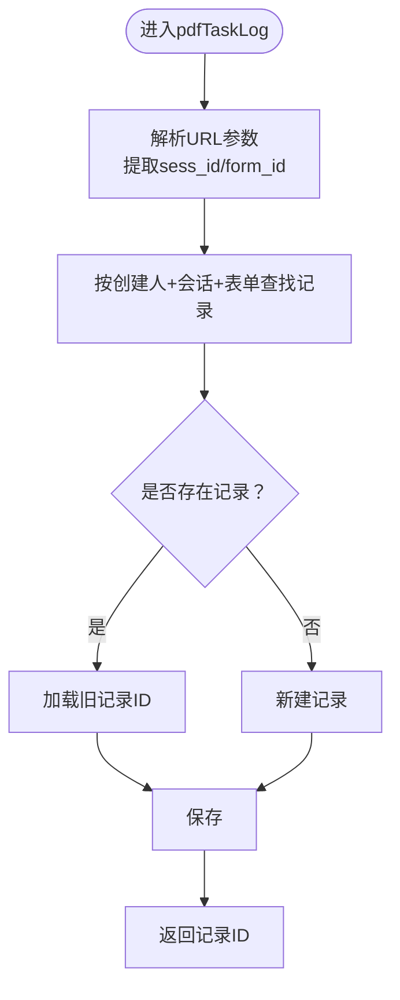
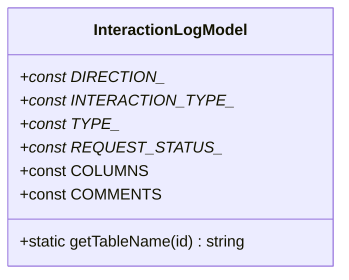
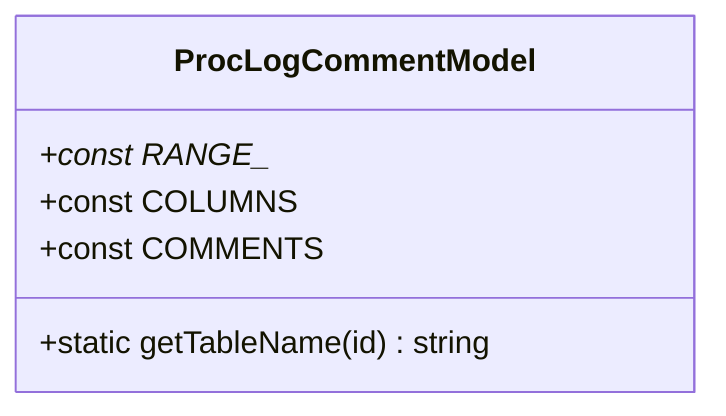
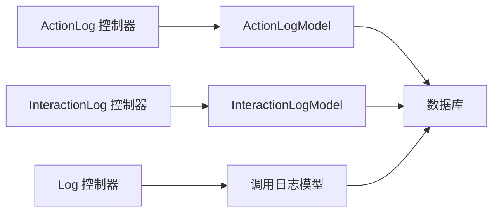

# 流程日志模型

<cite>
**本文引用的文件**
- [ActionLogModel.php](file://process/src/models/ActionLogModel.php)
- [ProcessFileLogModel.php](file://process/src/models/ProcessFileLogModel.php)
- [InteractionLogModel.php](file://process/src/models/InteractionLogModel.php)
- [ProcLogCommentModel.php](file://process/src/models/ProcLogCommentModel.php)
- [ActionLog.php](file://process/src/http/system/ActionLog.php)
- [InteractionLog.php](file://process/src/http/system/InteractionLog.php)
- [Log.php](file://process/src/http/system/Log.php)
- [migration_20250805_add_proc_log_comment.php](file://process/src/migrations/migration_20250805_add_proc_log_comment.php)
- [migration_20250427_aigc_log_add_like.php](file://process/src/migrations/migration_20250427_aigc_log_add_like.php)
- [migration_20250811_155935_fix_proc_log_created.php](file://process/src/migrations/migration_20250811_155935_fix_proc_log_created.php)
- [migration_20251119_090014_proc_assignee.php](file://process/src/migrations/migration_20251119_090014_proc_assignee.php)
</cite>

## 目录
1. [引言](#引言)
2. [项目结构](#项目结构)
3. [核心组件](#核心组件)
4. [架构总览](#架构总览)
5. [详细组件分析](#详细组件分析)
6. [依赖关系分析](#依赖关系分析)
7. [性能考虑](#性能考虑)
8. [故障排查指南](#故障排查指南)
9. [结论](#结论)
10. [附录](#附录)

## 引言
本文件围绕流程日志相关数据模型进行系统性梳理，重点覆盖以下三类模型：
- 流程日志模型：用于记录流程执行过程中的关键事件与状态变更，支撑审计与回溯。
- 文件日志模型：用于追踪流程中文件的生成、下载与来源（如云打印任务），便于合规与溯源。
- 评论日志模型：用于记录流程审批过程中的评论与回复，支持协作与责任界定。

同时，本文将深入解析日志记录机制、持久化策略、查询优化与审计能力，并给出日志级别的定义、聚合分析与异常追踪的实现思路，以及使用场景与性能优化建议。

## 项目结构
围绕日志主题的相关文件分布于 models 与 http/system 控制器层，配合迁移脚本完成表结构演进与索引优化。

图表来源
- [ActionLogModel.php](file://process/src/models/ActionLogModel.php#L1-L90)
- [ProcessFileLogModel.php](file://process/src/models/ProcessFileLogModel.php#L1-L94)
- [InteractionLogModel.php](file://process/src/models/InteractionLogModel.php#L1-L92)
- [ProcLogCommentModel.php](file://process/src/models/ProcLogCommentModel.php#L1-L41)
- [ActionLog.php](file://process/src/http/system/ActionLog.php#L1-L229)
- [InteractionLog.php](file://process/src/http/system/InteractionLog.php#L1-L78)
- [Log.php](file://process/src/http/system/Log.php#L1-L61)
- [migration_20250805_add_proc_log_comment.php](file://process/src/migrations/migration_20250805_add_proc_log_comment.php#L1-L28)
- [migration_20250427_aigc_log_add_like.php](file://process/src/migrations/migration_20250427_aigc_log_add_like.php#L1-L28)
- [migration_20250811_155935_fix_proc_log_created.php](file://process/src/migrations/migration_20250811_155935_fix_proc_log_created.php#L1-L33)
- [migration_20251119_090014_proc_assignee.php](file://process/src/migrations/migration_20251119_090014_proc_assignee.php#L1-L32)

章节来源
- [ActionLogModel.php](file://process/src/models/ActionLogModel.php#L1-L90)
- [ProcessFileLogModel.php](file://process/src/models/ProcessFileLogModel.php#L1-L94)
- [InteractionLogModel.php](file://process/src/models/InteractionLogModel.php#L1-L92)
- [ProcLogCommentModel.php](file://process/src/models/ProcLogCommentModel.php#L1-L41)
- [ActionLog.php](file://process/src/http/system/ActionLog.php#L1-L229)
- [InteractionLog.php](file://process/src/http/system/InteractionLog.php#L1-L78)
- [Log.php](file://process/src/http/system/Log.php#L1-L61)

## 核心组件
- 操作日志模型（ActionLogModel）：统一记录系统各模块的操作行为，包含模型类型、操作类型、关联数据ID与详情JSON等字段，提供便捷的写入接口与枚举常量。
- 流程文件日志模型（ProcessFileLogModel）：记录流程中文件的来源、下载令牌、表单控件、会话与表单ID等，支持对“云打印任务”来源的去重与更新。
- 交互日志模型（InteractionLogModel）：记录流程引擎或业务组件与外部系统之间的交互方向、类型、状态与请求/响应详情，便于问题定位与审计。
- 流程日志回复模型（ProcLogCommentModel）：记录流程审批过程中的评论与回复，支持可见范围控制与按会话ID索引。

章节来源
- [ActionLogModel.php](file://process/src/models/ActionLogModel.php#L1-L90)
- [ProcessFileLogModel.php](file://process/src/models/ProcessFileLogModel.php#L1-L94)
- [InteractionLogModel.php](file://process/src/models/InteractionLogModel.php#L1-L92)
- [ProcLogCommentModel.php](file://process/src/models/ProcLogCommentModel.php#L1-L41)

## 架构总览
下图展示日志模型在系统中的角色与交互路径，包括控制器如何组织查询、模型如何持久化，以及迁移脚本如何演进表结构。

图表来源
- [ActionLog.php](file://process/src/http/system/ActionLog.php#L1-L229)
- [InteractionLog.php](file://process/src/http/system/InteractionLog.php#L1-L78)
- [Log.php](file://process/src/http/system/Log.php#L1-L61)
- [ActionLogModel.php](file://process/src/models/ActionLogModel.php#L1-L90)
- [ProcessFileLogModel.php](file://process/src/models/ProcessFileLogModel.php#L1-L94)
- [InteractionLogModel.php](file://process/src/models/InteractionLogModel.php#L1-L92)
- [ProcLogCommentModel.php](file://process/src/models/ProcLogCommentModel.php#L1-L41)

## 详细组件分析

### 操作日志模型（ActionLogModel）
- 设计要点
  - 字段设计：包含创建人、模型类型、数据ID、操作类型、详情JSON、时间戳等，满足跨模块审计需求。
  - 模型枚举：通过常量与映射数组标识不同业务模块，便于前端展示与过滤。
  - 写入接口：提供统一的便捷方法，避免重复序列化与参数校验。
- 查询与导出
  - 控制器支持多维过滤（时间区间、用户名、模块、类型关键字等），并可导出为Excel，同时记录导出任务以供追溯。
- 审计与格式化
  - 列表时根据模型类型与操作类型动态拼接“操作内容”，并补充用户与部门信息，提升可读性。

图表来源
- [ActionLogModel.php](file://process/src/models/ActionLogModel.php#L1-L90)

章节来源
- [ActionLogModel.php](file://process/src/models/ActionLogModel.php#L1-L90)
- [ActionLog.php](file://process/src/http/system/ActionLog.php#L1-L229)

### 流程文件日志模型（ProcessFileLogModel）
- 设计要点
  - 字段设计：记录文件名、来源（普通附件/云打印任务）、下载令牌、表单控件、流程会话与表单ID、创建人与部门等。
  - 校验逻辑：在保存前对必填项进行参数校验，失败抛出参数异常。
  - 来源处理：针对“云打印任务”来源，从URL参数提取会话与表单ID，并基于创建人+会话+表单进行去重更新，确保同一来源仅保留最新文件记录。
- 使用场景
  - 流程中生成/下载文件的追踪，支持合规审计与问题回溯。

图表来源
- [ProcessFileLogModel.php](file://process/src/models/ProcessFileLogModel.php#L1-L94)

章节来源
- [ProcessFileLogModel.php](file://process/src/models/ProcessFileLogModel.php#L1-L94)

### 交互日志模型（InteractionLogModel）
- 设计要点
  - 字段设计：包含交互方向（推送/拉取/其他）、交互类型（接口/数据库/excel/其他）、监听类型（监听器/数据源/验证器/用户同步/其他）、请求状态（成功/失败）、请求与响应详情、时间戳等。
  - 控制器能力：支持多维筛选（应用ID、实例ID、会话ID、工号、方向、类型、状态、时间范围、关键字等），并分页返回。
- 审计价值
  - 面向流程引擎与业务组件的交互审计，便于定位异常请求与响应、统计成功率与耗时。

图表来源
- [InteractionLogModel.php](file://process/src/models/InteractionLogModel.php#L1-L92)

章节来源
- [InteractionLogModel.php](file://process/src/models/InteractionLogModel.php#L1-L92)
- [InteractionLog.php](file://process/src/http/system/InteractionLog.php#L1-L78)

### 流程日志回复模型（ProcLogCommentModel）
- 设计要点
  - 字段设计：记录审批日志ID、流程会话ID、回复内容JSON、创建人与时间。
  - 可见范围：提供可见范围常量，支持仅回复人可见、审批人与回复人可见、所有人可见等策略。
  - 迁移脚本：创建表并建立会话ID索引，便于按流程实例快速检索评论。
- 使用场景
  - 在流程审批过程中，对关键节点进行评论与回复，形成可追溯的协作记录。

图表来源
- [ProcLogCommentModel.php](file://process/src/models/ProcLogCommentModel.php#L1-L41)
- [migration_20250805_add_proc_log_comment.php](file://process/src/migrations/migration_20250805_add_proc_log_comment.php#L1-L28)

章节来源
- [ProcLogCommentModel.php](file://process/src/models/ProcLogCommentModel.php#L1-L41)
- [migration_20250805_add_proc_log_comment.php](file://process/src/migrations/migration_20250805_add_proc_log_comment.php#L1-L28)

### 调用日志（通用日志）与控制器（Log.php）
- 设计要点
  - 控制器支持按场景、关联条件、请求/响应关键字、状态与时间范围进行筛选，返回分页列表。
  - 提供场景枚举查询接口，便于前端选择与过滤。
- 应用场景
  - 作为通用调用日志入口，用于排查系统间调用链路与异常。

章节来源
- [Log.php](file://process/src/http/system/Log.php#L1-L61)

## 依赖关系分析
- 控制器到模型
  - 操作日志控制器依赖操作日志模型进行查询、格式化与导出。
  - 交互日志控制器依赖交互日志模型进行多维筛选与分页。
  - 通用日志控制器依赖调用日志模型进行查询。
- 模型到数据库
  - 各模型通过ORM基类与Schema定义映射到对应表，遵循统一的命名与注释规范。
- 迁移脚本到模型
  - 迁移脚本负责创建/变更表结构与索引，确保查询性能与数据完整性。

图表来源
- [ActionLog.php](file://process/src/http/system/ActionLog.php#L1-L229)
- [InteractionLog.php](file://process/src/http/system/InteractionLog.php#L1-L78)
- [Log.php](file://process/src/http/system/Log.php#L1-L61)
- [ActionLogModel.php](file://process/src/models/ActionLogModel.php#L1-L90)
- [InteractionLogModel.php](file://process/src/models/InteractionLogModel.php#L1-L92)

## 性能考虑
- 索引与查询优化
  - 为流程日志回复表建立会话ID索引，加速按流程实例检索评论。
  - 对操作日志与交互日志的关键过滤字段（如创建人、时间、类型、关键字）建立合适索引，减少全表扫描。
- 分页与批量处理
  - 控制器采用分页注解，避免一次性加载大量数据；导出时按需组装用户与部门信息，降低内存占用。
- JSON字段查询
  - 对JSON字段进行模糊匹配时，优先结合其他过滤条件缩小范围；必要时考虑将高频查询字段冗余至文本列以提升LIKE性能。
- 数据归档与清理
  - 建议对历史日志进行定期归档与清理，控制主表规模，保障查询性能。

章节来源
- [migration_20250805_add_proc_log_comment.php](file://process/src/migrations/migration_20250805_add_proc_log_comment.php#L1-L28)
- [ActionLog.php](file://process/src/http/system/ActionLog.php#L1-L229)
- [InteractionLog.php](file://process/src/http/system/InteractionLog.php#L1-L78)
- [Log.php](file://process/src/http/system/Log.php#L1-L61)

## 故障排查指南
- 参数校验失败
  - 流程文件日志在保存前进行参数校验，若缺失必填项将抛出参数异常。请检查文件名、来源、令牌、创建人与部门等字段是否正确传入。
- 关键字过滤无效
  - 操作日志与交互日志的关键词过滤依赖LIKE匹配，建议先确认过滤字段与值是否符合预期；对于JSON字段的模糊查询，注意字段类型与编码。
- 导出异常
  - 操作日志导出会合并用户与部门信息，若用户或部门不存在可能导致导出数据不完整。请核对用户ID与部门ID的有效性。
- 评论不可见或错位
  - 流程日志回复支持可见范围控制，请确认评论的可见范围设置与当前用户权限一致；同时检查会话ID是否正确。

章节来源
- [ProcessFileLogModel.php](file://process/src/models/ProcessFileLogModel.php#L1-L94)
- [ActionLog.php](file://process/src/http/system/ActionLog.php#L1-L229)
- [InteractionLog.php](file://process/src/http/system/InteractionLog.php#L1-L78)
- [ProcLogCommentModel.php](file://process/src/models/ProcLogCommentModel.php#L1-L41)

## 结论
本文系统梳理了流程日志相关数据模型的设计与实现，明确了操作日志、文件日志、交互日志与流程日志回复的职责边界与交互方式。通过迁移脚本与索引策略，模型具备良好的扩展性与查询性能。结合控制器提供的多维过滤与导出能力，能够有效支撑审计、合规与问题定位需求。建议在生产环境中持续关注索引维护、数据归档与查询优化，以保障长期稳定运行。

## 附录
- 日志级别与聚合建议
  - 级别划分：参考交互日志的状态枚举，将日志分为“成功/失败”两类，便于统计成功率与异常趋势。
  - 聚合分析：按时间、模块、类型、来源等维度进行聚合，输出趋势图与Top N异常。
  - 异常追踪：结合关键字过滤与时间窗口，定位异常请求与响应；对JSON字段的异常进行结构化解析与告警。
- 使用场景示例
  - 流程审计：通过操作日志与流程文件日志，还原流程关键节点与文件变更。
  - 交互诊断：通过交互日志定位引擎与外部系统的交互异常。
  - 协作留痕：通过流程日志回复模型，沉淀审批过程中的沟通记录。