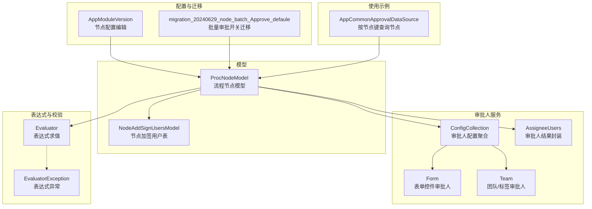
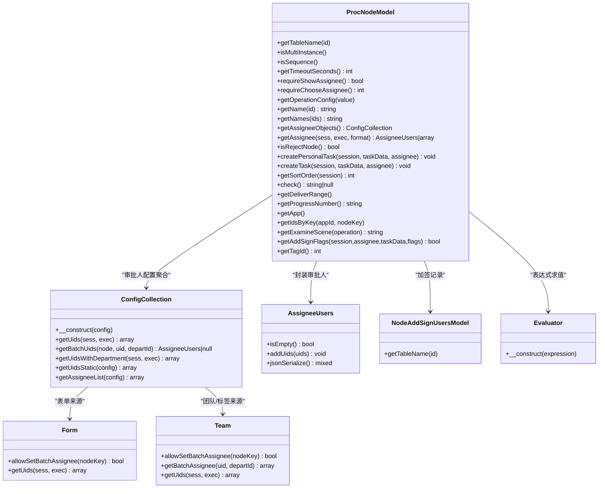
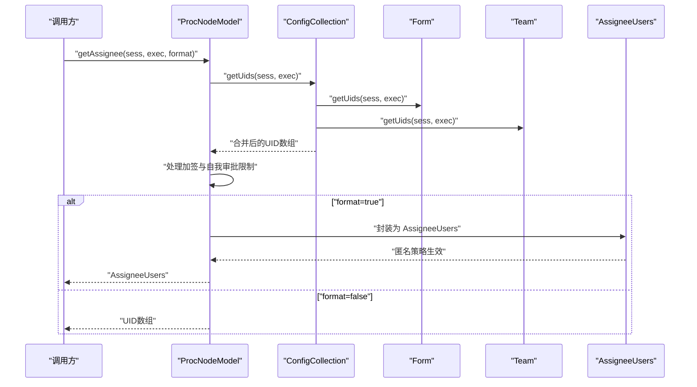
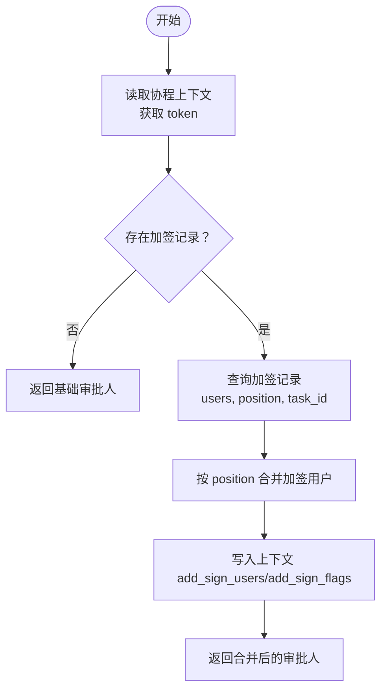
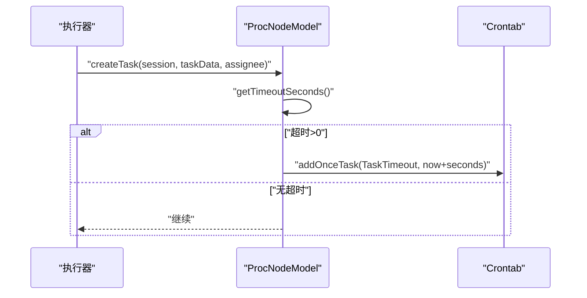
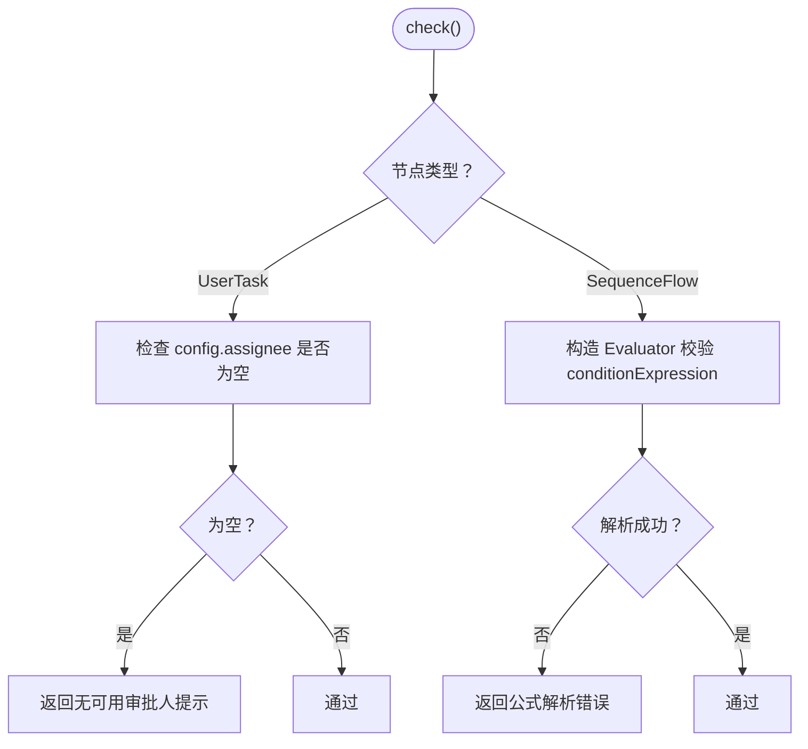
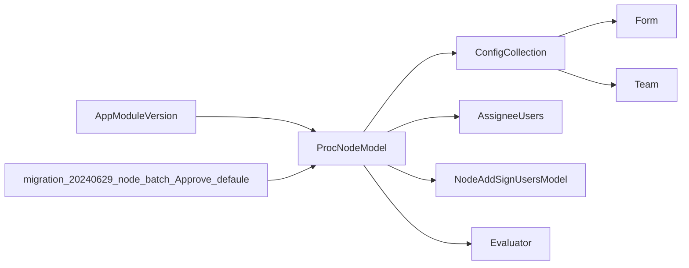

# 流程节点模型

<cite>
**本文引用的文件**
- [ProcNodeModel.php](file://process/src/models/ProcNodeModel.php)
- [ConfigCollection.php](file://process/src/services/assignee/ConfigCollection.php)
- [AssigneeUsers.php](file://process/src/services/assignee/AssigneeUsers.php)
- [Form.php](file://process/src/services/assignee/Form.php)
- [Team.php](file://process/src/services/assignee/Team.php)
- [NodeAddSignUsersModel.php](file://process/src/models/NodeAddSignUsersModel.php)
- [Evaluator.php](file://process/src/services/Evaluator.php)
- [EvaluatorException.php](file://process/src/services/expression/EvaluatorException.php)
- [AppModuleVersion.php](file://process/src/http/system/AppModuleVersion.php)
- [migration_20240629_node_batch_Approve_defaule.php](file://process/src/migrations/migration_20240629_node_batch_Approve_defaule.php)
- [AppCommonApprovalDataSource.php](file://process_envs/buaa/product/task/AppCommonApprovalDataSource.php)
</cite>

## 目录
1. [简介](#简介)
2. [项目结构](#项目结构)
3. [核心组件](#核心组件)
4. [架构总览](#架构总览)
5. [详细组件分析](#详细组件分析)
6. [依赖分析](#依赖分析)
7. [性能考虑](#性能考虑)
8. [故障排查指南](#故障排查指南)
9. [结论](#结论)
10. [附录](#附录)

## 简介
本文件系统性梳理流程节点模型 ProcNodeModel 的设计与实现，覆盖节点类型与配置、审批人获取与匿名审批、加签处理、超时与跳过机制、节点检查与表达式校验、进度与标签扩展、以及节点操作配置与使用实践。目标是帮助读者快速理解并正确使用该模型，同时为二次开发提供清晰的参考。

## 项目结构
围绕流程节点模型的关键文件组织如下：
- 模型层：ProcNodeModel（节点数据与业务逻辑）、NodeAddSignUsersModel（加签记录）
- 审批人服务：ConfigCollection（审批人配置聚合）、AssigneeUsers（审批人结果封装）、Form/Team（具体审批人来源）
- 表达式与校验：Evaluator（表达式求值）、EvaluatorException（异常）
- 配置与迁移：AppModuleVersion（节点配置编辑）、migration_20240629_node_batch_Approve_defaule（批量审批开关迁移）
- 使用示例：AppCommonApprovalDataSource（按节点键查询节点）

**图表来源**
- [ProcNodeModel.php](file://process/src/models/ProcNodeModel.php#L1-L525)
- [ConfigCollection.php](file://process/src/services/assignee/ConfigCollection.php#L1-L167)
- [AssigneeUsers.php](file://process/src/services/assignee/AssigneeUsers.php#L1-L54)
- [Form.php](file://process/src/services/assignee/Form.php#L1-L143)
- [Team.php](file://process/src/services/assignee/Team.php#L1-L22)
- [NodeAddSignUsersModel.php](file://process/src/models/NodeAddSignUsersModel.php#L1-L41)
- [Evaluator.php](file://process/src/services/Evaluator.php#L1-L13)
- [EvaluatorException.php](file://process/src/services/expression/EvaluatorException.php#L1-L6)
- [AppModuleVersion.php](file://process/src/http/system/AppModuleVersion.php#L277-L302)
- [migration_20240629_node_batch_Approve_defaule.php](file://process/src/migrations/migration_20240629_node_batch_Approve_defaule.php#L1-L24)
- [AppCommonApprovalDataSource.php](file://process_envs/buaa/product/task/AppCommonApprovalDataSource.php#L1-L44)

**章节来源**
- [ProcNodeModel.php](file://process/src/models/ProcNodeModel.php#L1-L525)
- [ConfigCollection.php](file://process/src/services/assignee/ConfigCollection.php#L1-L167)
- [AssigneeUsers.php](file://process/src/services/assignee/AssigneeUsers.php#L1-L54)
- [Form.php](file://process/src/services/assignee/Form.php#L1-L143)
- [Team.php](file://process/src/services/assignee/Team.php#L1-L22)
- [NodeAddSignUsersModel.php](file://process/src/models/NodeAddSignUsersModel.php#L1-L41)
- [Evaluator.php](file://process/src/services/Evaluator.php#L1-L13)
- [EvaluatorException.php](file://process/src/services/expression/EvaluatorException.php#L1-L6)
- [AppModuleVersion.php](file://process/src/http/system/AppModuleVersion.php#L277-L302)
- [migration_20240629_node_batch_Approve_defaule.php](file://process/src/migrations/migration_20240629_node_batch_Approve_defaule.php#L1-L24)
- [AppCommonApprovalDataSource.php](file://process_envs/buaa/product/task/AppCommonApprovalDataSource.php#L1-L44)

## 核心组件
- 节点类型与配置
  - 节点类型常量：普通用户任务、会签（并行/串行）、驳回节点、支付/确认等类型标识
  - 节点配置字段：节点键、名称、类型、JSON配置、父节点键、标签数组、修改时间
  - 子流程类型：普通、并行、顺序
- 审批人配置与获取
  - 审批人类型：禁用、显示、可选、可选且可全选
  - ConfigCollection 将多种审批人来源（表单、团队/标签、岗位、部门、关系、用户等）聚合为UID集合
  - AssigneeUsers 封装最终审批人列表及匿名显示控制
- 加签处理
  - NodeAddSignUsersModel 记录加签用户、位置、来源任务等
  - 运行时将加签用户按位置插入到审批人序列中
- 超时与跳过
  - getTimeoutSeconds 支持 d/h/m 单位的超时秒数
  - createTask 中支持“跳过任务”逻辑，结合上下文 skip_uids
- 节点检查与表达式
  - check 对 UserTask 无审批人进行检查；对 SequenceFlow 校验 conditionExpression
  - Evaluator 对表达式进行求值包装
- 进度与标签
  - 进度百分比：getProgressNumber
  - 标签：getTagId
- 节点操作配置
  - operations 列表中按 value 与 enable 过滤可用操作
  - AppModuleVersion 提供节点操作配置的增删改接口

**章节来源**
- [ProcNodeModel.php](file://process/src/models/ProcNodeModel.php#L16-L120)
- [ProcNodeModel.php](file://process/src/models/ProcNodeModel.php#L129-L148)
- [ProcNodeModel.php](file://process/src/models/ProcNodeModel.php#L161-L164)
- [ConfigCollection.php](file://process/src/services/assignee/ConfigCollection.php#L1-L167)
- [AssigneeUsers.php](file://process/src/services/assignee/AssigneeUsers.php#L1-L54)
- [NodeAddSignUsersModel.php](file://process/src/models/NodeAddSignUsersModel.php#L1-L41)
- [ProcNodeModel.php](file://process/src/models/ProcNodeModel.php#L409-L427)
- [ProcNodeModel.php](file://process/src/models/ProcNodeModel.php#L444-L463)
- [Evaluator.php](file://process/src/services/Evaluator.php#L1-L13)
- [ProcNodeModel.php](file://process/src/models/ProcNodeModel.php#L470-L473)
- [ProcNodeModel.php](file://process/src/models/ProcNodeModel.php#L520-L524)
- [AppModuleVersion.php](file://process/src/http/system/AppModuleVersion.php#L277-L302)

## 架构总览
ProcNodeModel 作为流程节点的核心模型，向上游提供节点配置、审批人、超时、跳过、检查、进度与标签等能力；向下游驱动任务创建、通知、历史归档与定时超时任务注册；在审批人链路中通过 ConfigCollection 聚合多种来源并在 AssigneeUsers 中完成匿名化渲染。

**图表来源**
- [ProcNodeModel.php](file://process/src/models/ProcNodeModel.php#L1-L525)
- [ConfigCollection.php](file://process/src/services/assignee/ConfigCollection.php#L1-L167)
- [AssigneeUsers.php](file://process/src/services/assignee/AssigneeUsers.php#L1-L54)
- [Form.php](file://process/src/services/assignee/Form.php#L1-L143)
- [Team.php](file://process/src/services/assignee/Team.php#L1-L22)
- [NodeAddSignUsersModel.php](file://process/src/models/NodeAddSignUsersModel.php#L1-L41)
- [Evaluator.php](file://process/src/services/Evaluator.php#L1-L13)

## 详细组件分析

### 节点类型与配置结构
- 节点类型
  - 用户任务、会签（并行/串行）、驳回、支付、确认等
  - 子流程类型：普通、并行、顺序
- 配置字段
  - 关键字段：node_key、node_name、node_type、config、node_parent_key、node_label、modified
  - config 为 JSON，承载审批人、超时、操作、匿名、进度、标签等配置
- 名称与批量名称
  - 提供单个与批量名称查询方法

**章节来源**
- [ProcNodeModel.php](file://process/src/models/ProcNodeModel.php#L16-L120)
- [ProcNodeModel.php](file://process/src/models/ProcNodeModel.php#L138-L157)

### 审批人配置与获取逻辑
- 审批人类型
  - 禁用、显示、可选、可选且可全选
- 获取流程
  - getAssigneeObjects 返回 ConfigCollection
  - ConfigCollection.getUids 聚合各来源UID并去重
  - 可选场景下支持批量审批的过滤与返回
  - getUidsWithDepartment 支持返回带部门的UID集合
  - getUidsStatic 支持静态解析简单来源（用户、岗位、部门、身份等）
- 匿名审批
  - AssigneeUsers 在渲染时根据匿名策略替换姓名、工号、部门显示
  - ProcNodeModel 在 getAssignee 中根据会话与节点配置设置匿名相关字段

**图表来源**
- [ProcNodeModel.php](file://process/src/models/ProcNodeModel.php#L161-L241)
- [ConfigCollection.php](file://process/src/services/assignee/ConfigCollection.php#L49-L98)
- [Form.php](file://process/src/services/assignee/Form.php#L22-L141)
- [Team.php](file://process/src/services/assignee/Team.php#L1-L22)
- [AssigneeUsers.php](file://process/src/services/assignee/AssigneeUsers.php#L1-L54)

**章节来源**
- [ProcNodeModel.php](file://process/src/models/ProcNodeModel.php#L107-L127)
- [ProcNodeModel.php](file://process/src/models/ProcNodeModel.php#L161-L241)
- [ConfigCollection.php](file://process/src/services/assignee/ConfigCollection.php#L1-L167)
- [AssigneeUsers.php](file://process/src/services/assignee/AssigneeUsers.php#L1-L54)
- [Form.php](file://process/src/services/assignee/Form.php#L1-L143)
- [Team.php](file://process/src/services/assignee/Team.php#L1-L22)

### 加签处理与匿名审批
- 加签记录
  - NodeAddSignUsersModel 记录 token_id、sess_id、node_id、users、position、creator、task_id
  - ProcNodeModel 在 getAssignee 中查询当前 token/sess/node 的加签记录，按 position 插入到审批人序列
- 匿名审批
  - ProcNodeModel 在 getAssignee 中根据会话与节点配置设置匿名UID、匿名用户列表、匿名全部、匿名部门等
  - AssigneeUsers 在序列化时依据上述策略替换显示信息

**图表来源**
- [ProcNodeModel.php](file://process/src/models/ProcNodeModel.php#L171-L204)
- [NodeAddSignUsersModel.php](file://process/src/models/NodeAddSignUsersModel.php#L1-L41)

**章节来源**
- [ProcNodeModel.php](file://process/src/models/ProcNodeModel.php#L171-L204)
- [NodeAddSignUsersModel.php](file://process/src/models/NodeAddSignUsersModel.php#L1-L41)
- [AssigneeUsers.php](file://process/src/services/assignee/AssigneeUsers.php#L1-L54)

### 超时处理与跳过机制
- 超时
  - getTimeoutSeconds 解析 timeout.val 与 unit（d/h/m），返回秒数
  - createTask 在有超时时注册一次性定时任务
- 跳过
  - createTask 中根据 enable_skip_task 与上下文 skip_uids 决定是否直接跳过任务并标记

**图表来源**
- [ProcNodeModel.php](file://process/src/models/ProcNodeModel.php#L99-L105)
- [ProcNodeModel.php](file://process/src/models/ProcNodeModel.php#L409-L427)

**章节来源**
- [ProcNodeModel.php](file://process/src/models/ProcNodeModel.php#L99-L105)
- [ProcNodeModel.php](file://process/src/models/ProcNodeModel.php#L409-L427)

### 节点检查与表达式求值
- 节点检查
  - UserTask：若无审批人配置则返回提示
  - SequenceFlow：校验 conditionExpression 是否可被 Evaluator 解析
- 表达式求值
  - Evaluator 对传入表达式进行预处理（去除花括号），委托底层表达式求值器

**图表来源**
- [ProcNodeModel.php](file://process/src/models/ProcNodeModel.php#L444-L463)
- [Evaluator.php](file://process/src/services/Evaluator.php#L1-L13)
- [EvaluatorException.php](file://process/src/services/expression/EvaluatorException.php#L1-L6)

**章节来源**
- [ProcNodeModel.php](file://process/src/models/ProcNodeModel.php#L444-L463)
- [Evaluator.php](file://process/src/services/Evaluator.php#L1-L13)
- [EvaluatorException.php](file://process/src/services/expression/EvaluatorException.php#L1-L6)

### 进度计算与标签管理
- 进度百分比
  - getProgressNumber 从 config.progress_number 读取
- 标签
  - getTagId 仅当 config.tag_is_open 为真时返回 config.tag_id，否则 0

**章节来源**
- [ProcNodeModel.php](file://process/src/models/ProcNodeModel.php#L470-L473)
- [ProcNodeModel.php](file://process/src/models/ProcNodeModel.php#L520-L524)

### 节点操作配置
- 操作过滤
  - getOperationConfig 根据 value 与 enable 过滤可用操作
- 配置编辑
  - AppModuleVersion 提供对节点操作配置的增删改与启用/禁用操作

**章节来源**
- [ProcNodeModel.php](file://process/src/models/ProcNodeModel.php#L129-L136)
- [AppModuleVersion.php](file://process/src/http/system/AppModuleVersion.php#L277-L302)

### 批量审批与默认开关
- 批量审批开关
  - migration_20240629_node_batch_Approve_defaule 将所有 UserTask 的 enable_batch_approval 设为 1

**章节来源**
- [migration_20240629_node_batch_Approve_defaule.php](file://process/src/migrations/migration_20240629_node_batch_Approve_defaule.php#L1-L24)

### 使用示例与最佳实践
- 示例：按节点键查询节点
  - AppCommonApprovalDataSource 展示了如何根据 sess_id 与 approval_node 查询 ProcNodeModel 的节点信息
- 最佳实践
  - 审批人配置：优先使用 ConfigCollection 聚合多种来源，避免在业务层重复拼接
  - 匿名审批：在节点配置中开启匿名或匿名全部，确保 AssigneeUsers 渲染一致
  - 表达式：在保存前通过 check 校验 conditionExpression，避免运行期失败
  - 超时：为关键节点设置合理超时，避免流程停滞
  - 批量审批：统一通过迁移脚本设置 enable_batch_approval，保持一致性

**章节来源**
- [AppCommonApprovalDataSource.php](file://process_envs/buaa/product/task/AppCommonApprovalDataSource.php#L1-L44)

## 依赖分析
- 组件耦合
  - ProcNodeModel 依赖 ConfigCollection 与 AssigneeUsers 完成审批人聚合与展示
  - 审批人来源通过抽象类与具体类解耦（如 Form、Team）
  - 表达式校验通过 Evaluator 与异常类型隔离
- 外部依赖
  - NodeAddSignUsersModel 用于持久化加签记录
  - AppModuleVersion 用于节点配置的动态维护
  - 迁移脚本用于批量调整节点配置

**图表来源**
- [ProcNodeModel.php](file://process/src/models/ProcNodeModel.php#L1-L525)
- [ConfigCollection.php](file://process/src/services/assignee/ConfigCollection.php#L1-L167)
- [AssigneeUsers.php](file://process/src/services/assignee/AssigneeUsers.php#L1-L54)
- [Form.php](file://process/src/services/assignee/Form.php#L1-L143)
- [Team.php](file://process/src/services/assignee/Team.php#L1-L22)
- [NodeAddSignUsersModel.php](file://process/src/models/NodeAddSignUsersModel.php#L1-L41)
- [Evaluator.php](file://process/src/services/Evaluator.php#L1-L13)
- [AppModuleVersion.php](file://process/src/http/system/AppModuleVersion.php#L277-L302)
- [migration_20240629_node_batch_Approve_defaule.php](file://process/src/migrations/migration_20240629_node_batch_Approve_defaule.php#L1-L24)

**章节来源**
- [ProcNodeModel.php](file://process/src/models/ProcNodeModel.php#L1-L525)
- [ConfigCollection.php](file://process/src/services/assignee/ConfigCollection.php#L1-L167)
- [AssigneeUsers.php](file://process/src/services/assignee/AssigneeUsers.php#L1-L54)
- [Form.php](file://process/src/services/assignee/Form.php#L1-L143)
- [Team.php](file://process/src/services/assignee/Team.php#L1-L22)
- [NodeAddSignUsersModel.php](file://process/src/models/NodeAddSignUsersModel.php#L1-L41)
- [Evaluator.php](file://process/src/services/Evaluator.php#L1-L13)
- [AppModuleVersion.php](file://process/src/http/system/AppModuleVersion.php#L277-L302)
- [migration_20240629_node_batch_Approve_defaule.php](file://process/src/migrations/migration_20240629_node_batch_Approve_defaule.php#L1-L24)

## 性能考虑
- 审批人聚合
  - ConfigCollection.getUids 采用数组合并与去重，建议在配置较少来源时使用
  - getUidsWithDepartment 与 getUidsStatic 提供不同粒度的查询路径，按需选择
- 表达式校验
  - check 在保存或发布流程时执行，避免运行期重复解析
- 任务创建
  - createTask 中批量插入委托代理与异步发送通知，注意数据库事务与回调时机

[本节为通用建议，无需列出具体文件来源]

## 故障排查指南
- 无可用审批人
  - 现象：UserTask 节点在 check 中返回“无可用审批人”
  - 排查：确认 config.assignee 是否配置，或通过 ConfigCollection.getAssigneeList 辅助核对
- 表达式解析错误
  - 现象：SequenceFlow 节点在 check 中返回“公式解析错误”
  - 排查：检查 conditionExpression 格式，确保可被 Evaluator 正确解析
- 加签位置异常
  - 现象：审批人顺序与预期不符
  - 排查：核对 NodeAddSignUsersModel 的 position 字段与 ProcNodeModel 的合并逻辑
- 匿名显示不一致
  - 现象：匿名策略未生效
  - 排查：确认 ProcNodeModel 的匿名配置与 AssigneeUsers 的匿名字段是否正确设置

**章节来源**
- [ProcNodeModel.php](file://process/src/models/ProcNodeModel.php#L444-L463)
- [Evaluator.php](file://process/src/services/Evaluator.php#L1-L13)
- [NodeAddSignUsersModel.php](file://process/src/models/NodeAddSignUsersModel.php#L1-L41)
- [AssigneeUsers.php](file://process/src/services/assignee/AssigneeUsers.php#L1-L54)

## 结论
ProcNodeModel 以清晰的职责划分与可扩展的审批人体系为核心，提供了完善的节点配置、审批人获取、加签与匿名、超时与跳过、表达式校验、进度与标签等能力。通过 ConfigCollection 与 AssigneeUsers 的配合，既保证了灵活性，也确保了渲染一致性。建议在实际使用中遵循本文的最佳实践，确保流程稳定性与可维护性。

[本节为总结性内容，无需列出具体文件来源]

## 附录
- 常用方法速查
  - 审批人：getAssigneeObjects、getAssignee
  - 超时：getTimeoutSeconds
  - 检查：check
  - 操作：getOperationConfig
  - 进度/标签：getProgressNumber、getTagId
- 相关迁移与配置
  - 批量审批开关迁移：migration_20240629_node_batch_Approve_defaule
  - 节点操作配置编辑：AppModuleVersion

**章节来源**
- [ProcNodeModel.php](file://process/src/models/ProcNodeModel.php#L1-L525)
- [migration_20240629_node_batch_Approve_defaule.php](file://process/src/migrations/migration_20240629_node_batch_Approve_defaule.php#L1-L24)
- [AppModuleVersion.php](file://process/src/http/system/AppModuleVersion.php#L277-L302)