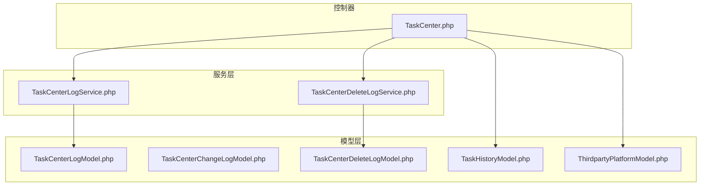
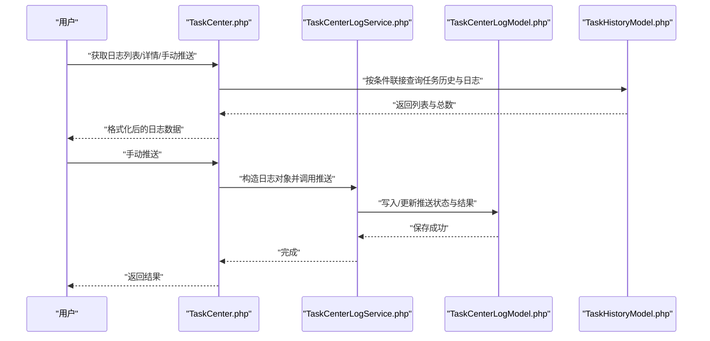
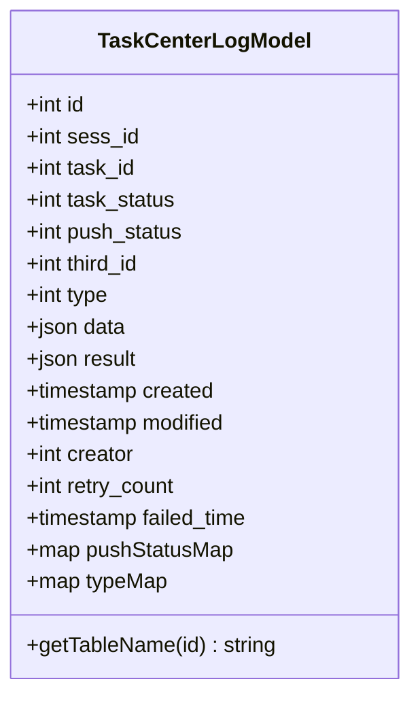
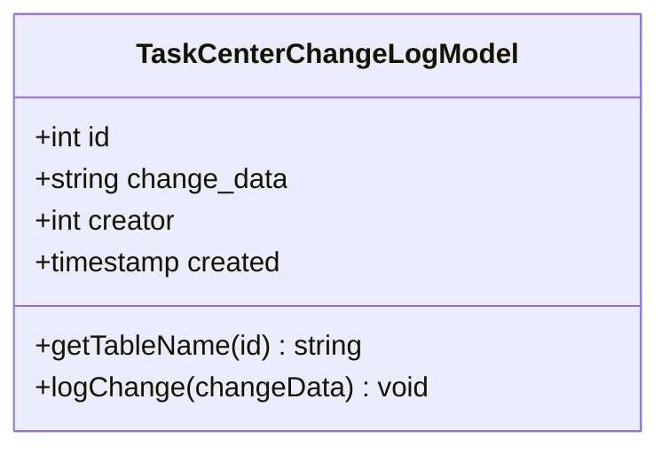
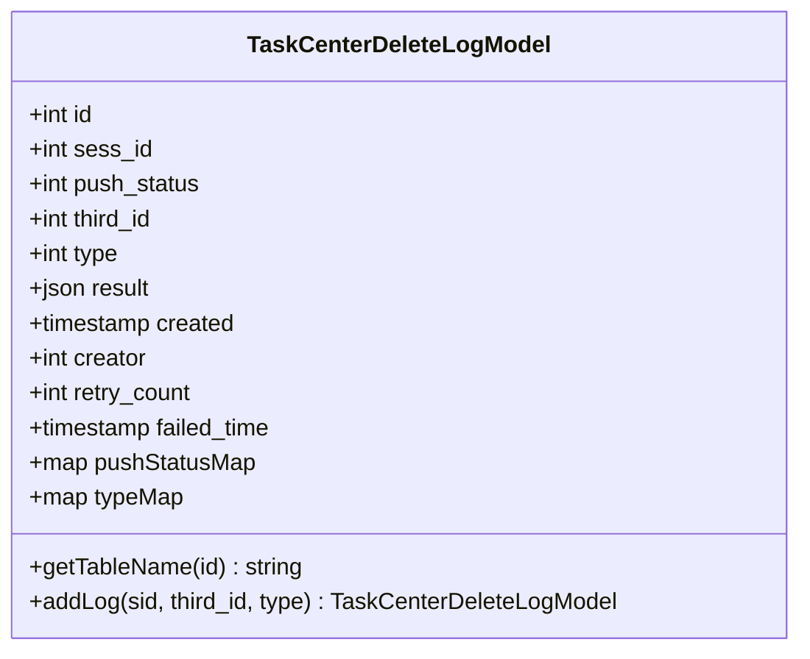
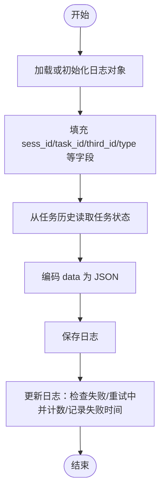
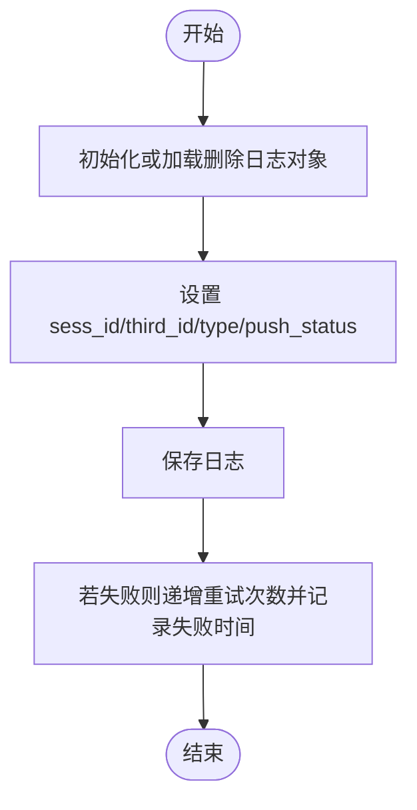
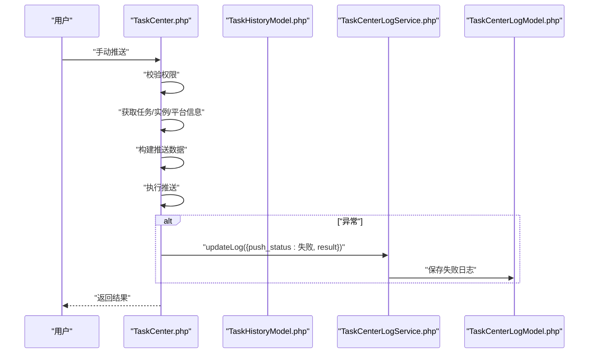
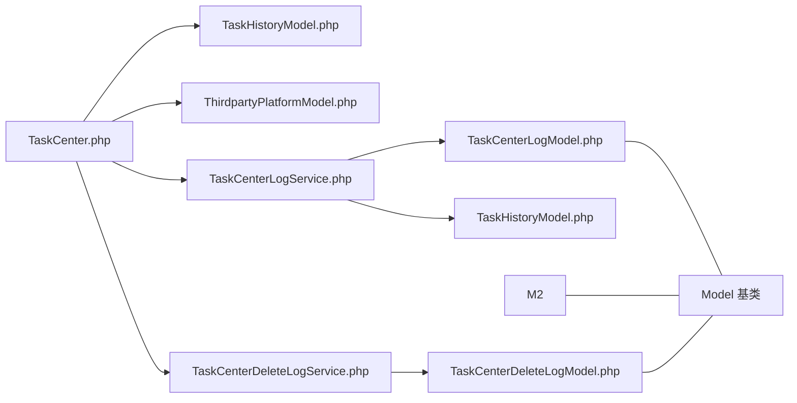

# 任务中心日志模型

<cite>
**本文引用的文件**
- [TaskCenterLogModel.php](file://process/src/models/TaskCenterLogModel.php)
- [TaskCenterChangeLogModel.php](file://process/src/models/TaskCenterChangeLogModel.php)
- [TaskCenterDeleteLogModel.php](file://process/src/models/TaskCenterDeleteLogModel.php)
- [TaskCenterLogService.php](file://process/src/services/taskCenter/TaskCenterLogService.php)
- [TaskCenterDeleteLogService.php](file://process/src/services/taskCenter/TaskCenterDeleteLogService.php)
- [TaskCenter.php](file://process/src/http/system/TaskCenter.php)
- [TaskHistoryModel.php](file://process/src/models/TaskHistoryModel.php)
- [ThirdpartyPlatformModel.php](file://process/src/models/ThirdpartyPlatformModel.php)
</cite>

## 目录
1. [简介](#简介)
2. [项目结构](#项目结构)
3. [核心组件](#核心组件)
4. [架构总览](#架构总览)
5. [组件详解](#组件详解)
6. [依赖关系分析](#依赖关系分析)
7. [性能与查询优化](#性能与查询优化)
8. [权限与数据安全](#权限与数据安全)
9. [日志查询、过滤与导出](#日志查询过滤与导出)
10. [日志清理与归档最佳实践](#日志清理与归档最佳实践)
11. [故障排查指南](#故障排查指南)
12. [结论](#结论)

## 简介
本文件围绕任务中心日志相关模型进行系统化技术文档整理，重点解析以下三类模型的作用与数据结构：
- TaskCenterLogModel：任务中心推送日志模型，记录任务在第三方平台的推送状态、明细与结果。
- TaskCenterChangeLogModel：任务中心变更记录模型，记录管理员对任务中心相关配置或规则的变更审计。
- TaskCenterDeleteLogModel：任务中心删除记录模型，记录事项删除事件的推送状态与结果。

同时，文档阐述任务中心的日志记录机制（创建、修改、删除）、存储格式、索引设计与查询优化策略，并给出权限控制与数据安全机制、查询过滤与导出实现示例，以及日志清理与归档的最佳实践。

## 项目结构
任务中心日志相关代码主要分布在以下模块：
- 模型层：TaskCenterLogModel、TaskCenterChangeLogModel、TaskCenterDeleteLogModel
- 服务层：TaskCenterLogService、TaskCenterDeleteLogService
- 控制器层：TaskCenter.php（提供日志列表、详情、手动推送等接口）
- 数据访问层：TaskHistoryModel（负责与任务历史表联接查询日志）
- 平台模型：ThirdpartyPlatformModel（用于获取第三方平台信息）

图表来源
- [TaskCenter.php](file://process/src/http/system/TaskCenter.php#L470-L669)
- [TaskCenterLogService.php](file://process/src/services/taskCenter/TaskCenterLogService.php#L1-L78)
- [TaskCenterDeleteLogService.php](file://process/src/services/taskCenter/TaskCenterDeleteLogService.php#L1-L60)
- [TaskCenterLogModel.php](file://process/src/models/TaskCenterLogModel.php#L1-L74)
- [TaskCenterChangeLogModel.php](file://process/src/models/TaskCenterChangeLogModel.php#L1-L43)
- [TaskCenterDeleteLogModel.php](file://process/src/models/TaskCenterDeleteLogModel.php#L1-L88)
- [TaskHistoryModel.php](file://process/src/models/TaskHistoryModel.php#L200-L270)
- [ThirdpartyPlatformModel.php](file://process/src/models/ThirdpartyPlatformModel.php)

章节来源
- [TaskCenter.php](file://process/src/http/system/TaskCenter.php#L470-L669)
- [TaskCenterLogService.php](file://process/src/services/taskCenter/TaskCenterLogService.php#L1-L78)
- [TaskCenterDeleteLogService.php](file://process/src/services/taskCenter/TaskCenterDeleteLogService.php#L1-L60)
- [TaskCenterLogModel.php](file://process/src/models/TaskCenterLogModel.php#L1-L74)
- [TaskCenterChangeLogModel.php](file://process/src/models/TaskCenterChangeLogModel.php#L1-L43)
- [TaskCenterDeleteLogModel.php](file://process/src/models/TaskCenterDeleteLogModel.php#L1-L88)
- [TaskHistoryModel.php](file://process/src/models/TaskHistoryModel.php#L200-L270)

## 核心组件
- TaskCenterLogModel：记录任务推送过程的关键字段包括会话标识、任务标识、任务状态、推送状态、第三方平台标识、推送类型、推送明细、推送结果、创建/修改时间、创建人、重试次数、失败时间等。提供推送状态与类型映射，便于前端展示。
- TaskCenterChangeLogModel：记录任务中心变更的审计日志，字段包含变更内容、操作人、创建时间等。
- TaskCenterDeleteLogModel：记录删除事件的推送日志，字段与推送状态、类型、结果、失败时间、重试次数等有关。

章节来源
- [TaskCenterLogModel.php](file://process/src/models/TaskCenterLogModel.php#L1-L74)
- [TaskCenterChangeLogModel.php](file://process/src/models/TaskCenterChangeLogModel.php#L1-L43)
- [TaskCenterDeleteLogModel.php](file://process/src/models/TaskCenterDeleteLogModel.php#L1-L88)

## 架构总览
任务中心日志体系通过控制器发起请求，服务层封装日志写入与更新逻辑，模型层定义表结构与常量，TaskHistoryModel负责与任务历史表联接查询，ThirdpartyPlatformModel提供平台信息。

图表来源
- [TaskCenter.php](file://process/src/http/system/TaskCenter.php#L470-L669)
- [TaskCenterLogService.php](file://process/src/services/taskCenter/TaskCenterLogService.php#L1-L78)
- [TaskCenterLogModel.php](file://process/src/models/TaskCenterLogModel.php#L1-L74)
- [TaskHistoryModel.php](file://process/src/models/TaskHistoryModel.php#L200-L270)

## 组件详解

### TaskCenterLogModel（任务中心推送日志）
- 表名与主键：固定表名为 task_center_log，主键为 id。
- 关键字段与含义：
  - sess_id：实例标识
  - task_id：任务标识
  - task_status：推送时的任务状态
  - push_status：推送状态（成功/失败/重试中/未推送）
  - third_id：第三方平台标识
  - type：推送类型（自动/手动）
  - data：推送明细（JSON）
  - result：推送结果（JSON）
  - created/modified：创建与修改时间
  - creator：创建人
  - retry_count：重试次数
  - failed_time：失败时间
- 常量与映射：
  - 推送状态常量与类型常量
  - pushStatusMap/typeMap 提供状态与类型的中文映射
- 用途：记录任务在第三方平台的推送过程与结果，支持查询、筛选与导出。

图表来源
- [TaskCenterLogModel.php](file://process/src/models/TaskCenterLogModel.php#L1-L74)

章节来源
- [TaskCenterLogModel.php](file://process/src/models/TaskCenterLogModel.php#L1-L74)

### TaskCenterChangeLogModel（任务中心变更记录）
- 表名与主键：固定表名为 task_center_change_log，主键为 id。
- 关键字段与含义：
  - change_data：变更内容（字符串）
  - creator：操作人 ID
  - created：创建时间
- 用途：记录管理员对任务中心配置或规则的变更审计，便于追溯。

图表来源
- [TaskCenterChangeLogModel.php](file://process/src/models/TaskCenterChangeLogModel.php#L1-L43)

章节来源
- [TaskCenterChangeLogModel.php](file://process/src/models/TaskCenterChangeLogModel.php#L1-L43)

### TaskCenterDeleteLogModel（任务中心删除记录）
- 表名与主键：固定表名为 task_center_delete_log，主键为 id。
- 关键字段与含义：
  - sess_id：实例标识
  - push_status：推送状态（成功/失败/重试中/未推送）
  - third_id：第三方平台标识
  - type：推送类型（自动/手动）
  - result：推送结果（JSON）
  - created/creator：创建与创建人
  - retry_count：重试次数
  - failed_time：失败时间
- 常量与映射：与推送状态、类型对应的常量与中文映射。
- 用途：记录删除事件的推送情况，支持查询与重试。

图表来源
- [TaskCenterDeleteLogModel.php](file://process/src/models/TaskCenterDeleteLogModel.php#L1-L88)

章节来源
- [TaskCenterDeleteLogModel.php](file://process/src/models/TaskCenterDeleteLogModel.php#L1-L88)

### TaskCenterLogService（任务中心日志服务）
- 功能概述：
  - 构造或加载日志对象（按 third_id 与 task_id 定位）
  - 写入日志：填充 sess_id、task_id、third_id、push_status、type、task_status、data 等字段并保存
  - 更新日志：兼容空 result 或重试中状态，失败则递增重试次数并记录失败时间，最后统一保存
- 关键点：
  - 从 TaskHistoryModel 读取任务状态
  - 将 data 编码为 JSON 存储
  - 对失败场景进行重试计数与失败时间记录

图表来源
- [TaskCenterLogService.php](file://process/src/services/taskCenter/TaskCenterLogService.php#L1-L78)
- [TaskCenterLogModel.php](file://process/src/models/TaskCenterLogModel.php#L1-L74)
- [TaskHistoryModel.php](file://process/src/models/TaskHistoryModel.php#L200-L270)

章节来源
- [TaskCenterLogService.php](file://process/src/services/taskCenter/TaskCenterLogService.php#L1-L78)
- [TaskCenterLogModel.php](file://process/src/models/TaskCenterLogModel.php#L1-L74)
- [TaskHistoryModel.php](file://process/src/models/TaskHistoryModel.php#L200-L270)

### TaskCenterDeleteLogService（任务中心删除日志服务）
- 功能概述：
  - 构造或加载删除日志对象（按 third_id 与 sess_id 定位）
  - 写入日志：设置 sess_id、third_id、push_status、type 并保存
  - 更新日志：失败则递增重试次数并记录失败时间
- 关键点：
  - 与 TaskCenterLogService 类似的失败处理与重试计数逻辑

图表来源
- [TaskCenterDeleteLogService.php](file://process/src/services/taskCenter/TaskCenterDeleteLogService.php#L1-L60)
- [TaskCenterDeleteLogModel.php](file://process/src/models/TaskCenterDeleteLogModel.php#L1-L88)

章节来源
- [TaskCenterDeleteLogService.php](file://process/src/services/taskCenter/TaskCenterDeleteLogService.php#L1-L60)
- [TaskCenterDeleteLogModel.php](file://process/src/models/TaskCenterDeleteLogModel.php#L1-L88)

### TaskCenter 控制器（日志查询与手动推送）
- 日志列表：
  - 权限校验：仅 devOpsCenter.taskCenterManage 可见
  - 支持筛选：第三方平台 id、起止时间、应用名、任务名、推送状态、sess_id、task_id
  - 调用 TaskHistoryModel 的联接查询方法，返回列表与总数，并做状态文本映射
- 日志详情：
  - 校验权限后返回指定日志的 data 字段
- 手动推送：
  - 校验权限
  - 解析 taskId 与 third_id，获取任务与实例信息
  - 构建推送数据并调用平台对象执行推送
  - 异常时记录失败日志并通过 TaskCenterLogService.updateLog 更新

图表来源
- [TaskCenter.php](file://process/src/http/system/TaskCenter.php#L610-L669)
- [TaskCenterLogService.php](file://process/src/services/taskCenter/TaskCenterLogService.php#L1-L78)
- [TaskCenterLogModel.php](file://process/src/models/TaskCenterLogModel.php#L1-L74)

章节来源
- [TaskCenter.php](file://process/src/http/system/TaskCenter.php#L470-L669)

## 依赖关系分析
- TaskCenter.php 依赖 TaskHistoryModel 进行联接查询，依赖 ThirdpartyPlatformModel 获取平台信息。
- TaskCenterLogService 依赖 TaskCenterLogModel 与 TaskHistoryModel。
- TaskCenterDeleteLogService 依赖 TaskCenterDeleteLogModel。
- TaskCenterLogModel/TaskCenterDeleteLogModel/TaskCenterChangeLogModel 均继承自通用 Model 基类，使用 Schema 定义列类型与注释。

图表来源
- [TaskCenter.php](file://process/src/http/system/TaskCenter.php#L470-L669)
- [TaskCenterLogService.php](file://process/src/services/taskCenter/TaskCenterLogService.php#L1-L78)
- [TaskCenterDeleteLogService.php](file://process/src/services/taskCenter/TaskCenterDeleteLogService.php#L1-L60)
- [TaskCenterLogModel.php](file://process/src/models/TaskCenterLogModel.php#L1-L74)
- [TaskCenterChangeLogModel.php](file://process/src/models/TaskCenterChangeLogModel.php#L1-L43)
- [TaskCenterDeleteLogModel.php](file://process/src/models/TaskCenterDeleteLogModel.php#L1-L88)
- [TaskHistoryModel.php](file://process/src/models/TaskHistoryModel.php#L200-L270)

章节来源
- [TaskCenter.php](file://process/src/http/system/TaskCenter.php#L470-L669)
- [TaskCenterLogService.php](file://process/src/services/taskCenter/TaskCenterLogService.php#L1-L78)
- [TaskCenterDeleteLogService.php](file://process/src/services/taskCenter/TaskCenterDeleteLogService.php#L1-L60)
- [TaskCenterLogModel.php](file://process/src/models/TaskCenterLogModel.php#L1-L74)
- [TaskCenterChangeLogModel.php](file://process/src/models/TaskCenterChangeLogModel.php#L1-L43)
- [TaskCenterDeleteLogModel.php](file://process/src/models/TaskCenterDeleteLogModel.php#L1-L88)
- [TaskHistoryModel.php](file://process/src/models/TaskHistoryModel.php#L200-L270)

## 性能与查询优化
- 查询路径：
  - TaskHistoryModel::getTaskCenterLogList 通过左联接 task_center_log 与 task_history，支持多维筛选（时间范围、应用名、任务名、推送状态、sess_id、task_id），并按任务 id 与日志 id 降序排序。
- 索引建议：
  - task_center_log.third_id：按第三方平台维度筛选
  - task_center_log.sess_id：按会话维度筛选
  - task_center_log.task_id：按任务维度筛选
  - task_center_log.created：按时间范围筛选
  - task_center_log.push_status：按推送状态筛选
  - task_history.id：联接排序与分页
- 分页与不分页：
  - 当 offset=0 且 limit=0 时采用不分页查询；否则使用分页查询，避免大结果集全量返回。
- JSON 字段：
  - data/result 为 JSON 字段，查询时建议尽量通过筛选条件限定范围，避免全表扫描 JSON 内容。

章节来源
- [TaskHistoryModel.php](file://process/src/models/TaskHistoryModel.php#L200-L270)
- [TaskCenter.php](file://process/src/http/system/TaskCenter.php#L470-L541)

## 权限与数据安全
- 权限控制：
  - 日志列表、日志详情、手动推送均要求用户具备 devOpsCenter.taskCenterManage 菜单权限，否则抛出无权限错误。
- 数据安全：
  - 日志中包含敏感信息（如推送明细 data、结果 result），应遵循最小可见原则与脱敏策略。
  - 服务层在失败时将错误信息编码为 JSON 写入 result，便于审计但需注意敏感信息保护。
- 审计追踪：
  - 手动推送完成后记录操作日志（ActionLogModel），便于后续审计。

章节来源
- [TaskCenter.php](file://process/src/http/system/TaskCenter.php#L470-L541)
- [TaskCenter.php](file://process/src/http/system/TaskCenter.php#L610-L669)

## 日志查询、过滤与导出
- 查询入口：
  - 控制器 TaskCenter.php::logList 提供统一入口，支持第三方平台 id、起止时间、应用名、任务名、推送状态、sess_id、task_id 等筛选条件。
- 过滤策略：
  - 未推送状态通过 task_center_log.id 是否为空判断。
  - 精确匹配 sess_id 与 task_id，模糊匹配应用名与任务名。
- 导出建议：
  - 在后端按筛选条件生成 CSV/Excel 文件，前端下载。
  - 导出时可增加导出字段映射（如推送状态文本、任务状态文本）。
- 列表格式化：
  - 控制器对返回字段进行格式化，包含应用名、任务名、推送状态文本、平台名称、任务状态等。

章节来源
- [TaskCenter.php](file://process/src/http/system/TaskCenter.php#L470-L541)
- [TaskHistoryModel.php](file://process/src/models/TaskHistoryModel.php#L200-L270)

## 日志清理与归档最佳实践
- 清理策略：
  - 按时间阈值定期清理过期日志（例如保留最近 90 天），避免表膨胀。
  - 对于大量失败且无需重试的日志，可先标记再批量清理。
- 归档策略：
  - 将历史日志迁移到独立归档库或冷存储，保留关键字段（如 sess_id、task_id、third_id、push_status、created、result）。
  - 归档后在在线库中保留必要的索引字段以便快速检索。
- 重试与失败处理：
  - 服务层在失败时自动递增 retry_count 并记录 failed_time，便于后续重试与统计。
- 配额与上限：
  - 对单个任务或会话的日志数量设置上限，防止异常场景产生海量日志。

章节来源
- [TaskCenterLogService.php](file://process/src/services/taskCenter/TaskCenterLogService.php#L57-L78)
- [TaskCenterDeleteLogService.php](file://process/src/services/taskCenter/TaskCenterDeleteLogService.php#L46-L60)
- [TaskCenterLogModel.php](file://process/src/models/TaskCenterLogModel.php#L1-L74)
- [TaskCenterDeleteLogModel.php](file://process/src/models/TaskCenterDeleteLogModel.php#L1-L88)

## 故障排查指南
- 常见问题与定位：
  - 无权限：确认用户是否具备 devOpsCenter.taskCenterManage 权限。
  - 日志不存在：检查传入的 id 是否正确，或是否存在跨平台/跨会话差异。
  - 手动推送失败：查看 result 字段中的错误信息，结合 failed_time 与 retry_count 分析。
  - 查询无结果：核对筛选条件（third_id、start/end、app_name、task_name、push_status、sess_id、task_id）是否合理。
- 排查步骤：
  - 通过 TaskCenter.php::logDetail 获取 data 字段，确认推送明细是否符合预期。
  - 检查 TaskHistoryModel 的联接条件与排序，确保返回数据顺序与业务一致。
  - 若存在异常，查看 ActionLogModel 中的操作记录，辅助定位问题。

章节来源
- [TaskCenter.php](file://process/src/http/system/TaskCenter.php#L470-L560)
- [TaskCenter.php](file://process/src/http/system/TaskCenter.php#L610-L669)
- [TaskHistoryModel.php](file://process/src/models/TaskHistoryModel.php#L200-L270)

## 结论
任务中心日志体系通过 TaskCenterLogModel、TaskCenterChangeLogModel、TaskCenterDeleteLogModel 三类模型分别覆盖推送、变更与删除场景，配合 TaskCenterLogService 与 TaskCenterDeleteLogService 的写入与更新逻辑，形成完整的审计与追踪能力。控制器层提供统一的查询与手动推送入口，TaskHistoryModel 负责高效联接查询。通过合理的索引设计、权限控制与数据安全策略，以及完善的清理与归档机制，能够满足生产环境对日志可观测性与合规性的需求。