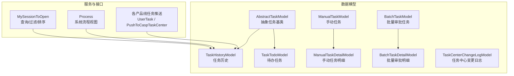
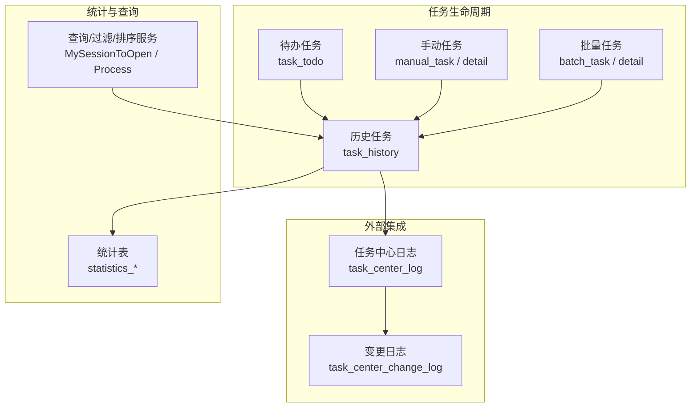
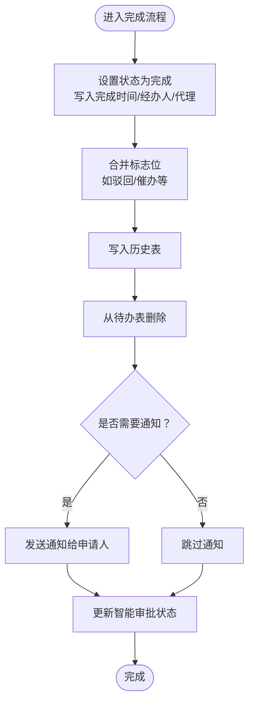
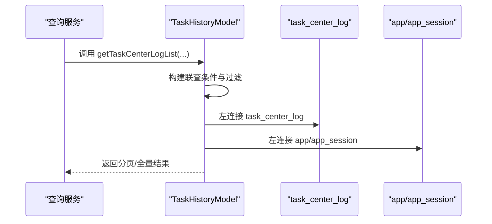
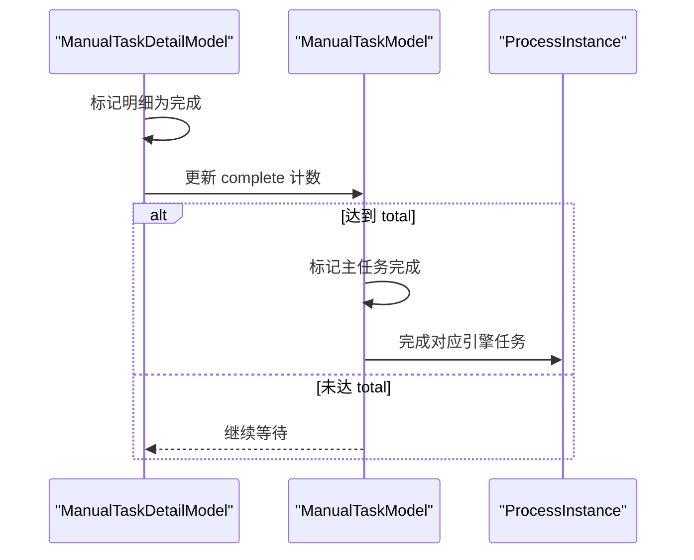
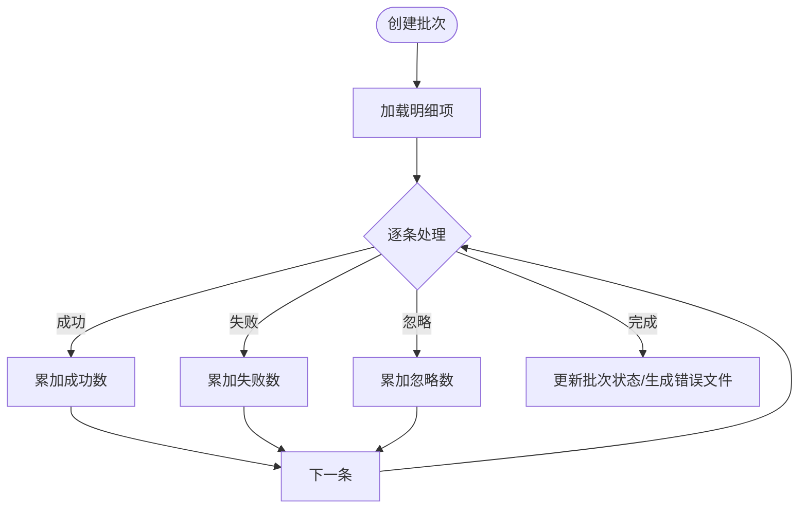
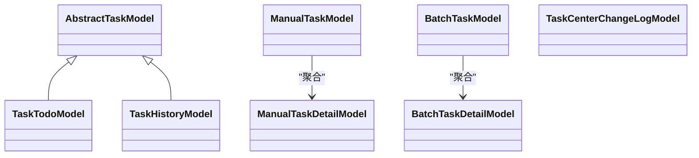
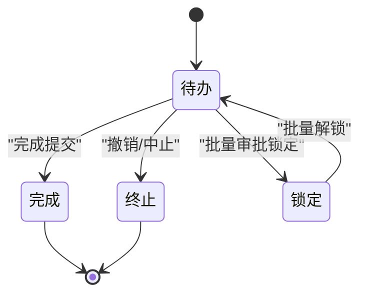

# 任务管理模型

<cite>
**本文引用的文件**
- [process/src/models/TaskTodoModel.php](file://process/src/models/TaskTodoModel.php)
- [process/src/models/TaskHistoryModel.php](file://process/src/models/TaskHistoryModel.php)
- [process/src/models/AbstractTaskModel.php](file://process/src/models/AbstractTaskModel.php)
- [process/src/models/ManualTaskModel.php](file://process/src/models/ManualTaskModel.php)
- [process/src/models/ManualTaskDetailModel.php](file://process/src/models/ManualTaskDetailModel.php)
- [process/src/models/BatchTaskModel.php](file://process/src/models/BatchTaskModel.php)
- [process/src/models/BatchTaskDetailModel.php](file://process/src/models/BatchTaskDetailModel.php)
- [process/src/models/TaskCenterChangeLogModel.php](file://process/src/models/TaskCenterChangeLogModel.php)
- [process/docs/sql/database.sql](file://process/docs/sql/database.sql)
- [process/src/migrations/migration_20240716_170331_statistics.php](file://process/src/migrations/migration_20240716_170331_statistics.php)
- [process/src/migrations/migration_20250730_102435_personal_v2.php](file://process/src/migrations/migration_20250730_102435_personal_v2.php)
- [process/src/services/MySessionToOpen.php](file://process/src/services/MySessionToOpen.php)
- [process/src/http/system/Process.php](file://process/src/http/system/Process.php)
- [process_envs/gdut/product/task/UserTask.php](file://process_envs/gdut/product/task/UserTask.php)
- [process_envs/hainanu/product/task/PushToCaspTaskCenter.php](file://process_envs/hainanu/product/task/PushToCaspTaskCenter.php)
- [process_envs/njust/product/task/PushToCaspTaskCenter.php](file://process_envs/njust/product/task/PushToCaspTaskCenter.php)
- [process_envs/saas/product/opencenter/MySessionToOpen.php](file://process_envs/saas/product/opencenter/MySessionToOpen.php)
</cite>

## 目录
1. [引言](#引言)
2. [项目结构](#项目结构)
3. [核心组件](#核心组件)
4. [架构总览](#架构总览)
5. [详细组件分析](#详细组件分析)
6. [依赖关系分析](#依赖关系分析)
7. [性能考量](#性能考量)
8. [故障排查指南](#故障排查指南)
9. [结论](#结论)
10. [附录](#附录)

## 引言
本文件聚焦于任务管理相关数据模型与实现，系统性梳理待办任务模型、任务历史（中心日志）模型、手动任务模型及其在任务生命周期、状态转换、优先级调度、批量任务处理、任务分发与通知、监控统计与性能追踪等方面的职责与交互。同时给出查询、过滤、排序与超时重试、异常恢复的实践路径，帮助读者快速理解并高效使用。

## 项目结构
任务管理相关的核心代码集中在以下模块：
- 数据模型层：task_todo、task_history、manual_task、manual_task_detail、batch_task、batch_task_detail、task_center_change_log 等
- 业务服务层：与任务查询、过滤、排序、统计相关的服务类
- 外部集成：向任务中心推送任务数据的适配器（不同学校/产品线）

**图表来源**
- [process/src/models/TaskTodoModel.php](file://process/src/models/TaskTodoModel.php#L1-L288)
- [process/src/models/TaskHistoryModel.php](file://process/src/models/TaskHistoryModel.php#L1-L270)
- [process/src/models/AbstractTaskModel.php](file://process/src/models/AbstractTaskModel.php#L1-L106)
- [process/src/models/ManualTaskModel.php](file://process/src/models/ManualTaskModel.php#L1-L84)
- [process/src/models/ManualTaskDetailModel.php](file://process/src/models/ManualTaskDetailModel.php#L1-L60)
- [process/src/models/BatchTaskModel.php](file://process/src/models/BatchTaskModel.php#L1-L115)
- [process/src/models/BatchTaskDetailModel.php](file://process/src/models/BatchTaskDetailModel.php#L1-L58)
- [process/src/models/TaskCenterChangeLogModel.php](file://process/src/models/TaskCenterChangeLogModel.php#L1-L43)
- [process/src/services/MySessionToOpen.php](file://process/src/services/MySessionToOpen.php#L284-L322)
- [process/src/http/system/Process.php](file://process/src/http/system/Process.php#L117-L141)
- [process_envs/gdut/product/task/UserTask.php](file://process_envs/gdut/product/task/UserTask.php#L143-L171)
- [process_envs/hainanu/product/task/PushToCaspTaskCenter.php](file://process_envs/hainanu/product/task/PushToCaspTaskCenter.php#L142-L171)
- [process_envs/njust/product/task/PushToCaspTaskCenter.php](file://process_envs/njust/product/task/PushToCaspTaskCenter.php#L141-L169)

**章节来源**
- [process/src/models/TaskTodoModel.php](file://process/src/models/TaskTodoModel.php#L1-L288)
- [process/src/models/TaskHistoryModel.php](file://process/src/models/TaskHistoryModel.php#L1-L270)
- [process/src/models/AbstractTaskModel.php](file://process/src/models/AbstractTaskModel.php#L1-L106)
- [process/src/models/ManualTaskModel.php](file://process/src/models/ManualTaskModel.php#L1-L84)
- [process/src/models/ManualTaskDetailModel.php](file://process/src/models/ManualTaskDetailModel.php#L1-L60)
- [process/src/models/BatchTaskModel.php](file://process/src/models/BatchTaskModel.php#L1-L115)
- [process/src/models/BatchTaskDetailModel.php](file://process/src/models/BatchTaskDetailModel.php#L1-L58)
- [process/src/models/TaskCenterChangeLogModel.php](file://process/src/models/TaskCenterChangeLogModel.php#L1-L43)

## 核心组件
- 待办任务模型（TaskTodoModel）
  - 职责：维护进行中的任务实例，支持状态流转、标志位标记、并发互斥、完成回调与通知、撤销/退回后的会话状态恢复等
  - 关键字段：id、sess_id、node_id、task_type、task_data、users、flags、status、created、finished 等
  - 关键能力：完成提交、加锁互斥、权限校验、跳转、统计总量等
- 任务历史模型（TaskHistoryModel）
  - 职责：持久化所有任务（含进行中），支持历史检索、任务中心日志联查、撤销/恢复、重报判定等
  - 关键字段：id、sess_id、app_id、node_id、users、task_type、task_data、flags、status、created、finished、fill_period_id、fill_assignee 等
  - 关键能力：历史查询、日志联查、撤销/恢复、重报判定
- 抽象任务模型（AbstractTaskModel）
  - 职责：统一任务的节点/会话/引擎上下文访问、环境变量设置、互斥锁、跳转等通用能力
- 手动任务模型（ManualTaskModel / ManualTaskDetailModel）
  - 职责：面向“人工复核/审核”场景，按总量与完成量推进整体任务完成；明细项完成时联动更新主任务
- 批量任务模型（BatchTaskModel / BatchTaskDetailModel）
  - 职责：批量审批任务的批次管理与明细执行，支持状态跟踪、错误记录、重试计数、导入失败处理
- 任务中心变更日志（TaskCenterChangeLogModel）
  - 职责：记录任务中心侧的变更行为，便于审计与追溯

**章节来源**
- [process/src/models/TaskTodoModel.php](file://process/src/models/TaskTodoModel.php#L1-L288)
- [process/src/models/TaskHistoryModel.php](file://process/src/models/TaskHistoryModel.php#L1-L270)
- [process/src/models/AbstractTaskModel.php](file://process/src/models/AbstractTaskModel.php#L1-L106)
- [process/src/models/ManualTaskModel.php](file://process/src/models/ManualTaskModel.php#L1-L84)
- [process/src/models/ManualTaskDetailModel.php](file://process/src/models/ManualTaskDetailModel.php#L1-L60)
- [process/src/models/BatchTaskModel.php](file://process/src/models/BatchTaskModel.php#L1-L115)
- [process/src/models/BatchTaskDetailModel.php](file://process/src/models/BatchTaskDetailModel.php#L1-L58)
- [process/src/models/TaskCenterChangeLogModel.php](file://process/src/models/TaskCenterChangeLogModel.php#L1-L43)

## 架构总览
任务系统围绕“待办—历史—手动/批量—日志—统计”的闭环展开。待办任务承载实时处理，历史模型沉淀全量轨迹；手动/批量模型支撑高吞吐的人工干预；任务中心日志与变更日志提供外部对接与审计；统计表提供运营视角的指标汇总。

**图表来源**
- [process/src/models/TaskTodoModel.php](file://process/src/models/TaskTodoModel.php#L164-L211)
- [process/src/models/TaskHistoryModel.php](file://process/src/models/TaskHistoryModel.php#L170-L269)
- [process/src/models/ManualTaskModel.php](file://process/src/models/ManualTaskModel.php#L38-L84)
- [process/src/models/ManualTaskDetailModel.php](file://process/src/models/ManualTaskDetailModel.php#L33-L60)
- [process/src/models/BatchTaskModel.php](file://process/src/models/BatchTaskModel.php#L63-L102)
- [process/src/models/BatchTaskDetailModel.php](file://process/src/models/BatchTaskDetailModel.php#L46-L58)
- [process/src/models/TaskCenterChangeLogModel.php](file://process/src/models/TaskCenterChangeLogModel.php#L31-L43)
- [process/src/migrations/migration_20240716_170331_statistics.php](file://process/src/migrations/migration_20240716_170331_statistics.php#L34-L62)
- [process/src/services/MySessionToOpen.php](file://process/src/services/MySessionToOpen.php#L284-L322)
- [process/src/http/system/Process.php](file://process/src/http/system/Process.php#L117-L141)

## 详细组件分析

### 待办任务模型（TaskTodoModel）
- 生命周期与状态转换
  - 初始化：STATUS_INIT
  - 完成：调用 complete 将状态置为完成并写入完成时间，同时写入经办人、代理经办人与标志位，随后从待办表删除并可能触发通知与智能审批状态更新
  - 撤销/终止：通过历史模型 abort 触发，将状态置为 ABORT 并清理待办与代理关系
  - 锁定：批量审批时可将任务锁定，解锁后恢复 INIT
- 标志位与优先级
  - 标志位：催办、驳回、加签、加签回执、超时、异常、重报、禁止收回、节点标记、会签加签等
  - 优先级：在任务中心推送时体现为紧急程度字段，用于门户筛选与展示
- 并发控制
  - 使用 Redis 键值互斥，避免并发重复处理
- 权限与代理
  - 支持对任务处理人的权限校验，以及代理关系的识别
- 通知与回调
  - 完成后根据节点配置向申请人发送通知
- 查询与统计
  - 提供按用户、类型、状态的统计方法，用于待办数量统计

**图表来源**
- [process/src/models/TaskTodoModel.php](file://process/src/models/TaskTodoModel.php#L164-L211)

**章节来源**
- [process/src/models/TaskTodoModel.php](file://process/src/models/TaskTodoModel.php#L1-L288)

### 任务历史模型（TaskHistoryModel）
- 职责边界
  - 作为所有任务的最终落盘，包含任务全生命周期数据
  - 提供历史检索、与任务中心日志联查、撤销/恢复、重报判定等能力
- 任务中心日志联查
  - 提供 getTaskCenterLogList 方法，支持按平台、时间范围、应用名、任务名、推送状态、会话/任务ID等多维过滤
- 撤销/恢复
  - abort：将任务置为终止并清理待办与代理
  - revert：将历史任务还原为待办任务，重置状态与字段，触发事件派发
- 重报判定
  - 结合填报周期、截止时间、会话状态等综合判断是否允许重报

**图表来源**
- [process/src/models/TaskHistoryModel.php](file://process/src/models/TaskHistoryModel.php#L170-L269)

**章节来源**
- [process/src/models/TaskHistoryModel.php](file://process/src/models/TaskHistoryModel.php#L1-L270)

### 抽象任务模型（AbstractTaskModel）
- 统一能力
  - 节点/会话/引擎上下文访问
  - 环境变量设置（支持会签/竞争两种模式）
  - 互斥锁（Redis）
  - 跳转（completeAndJump）
- 作用
  - 为待办/历史任务提供通用能力复用，降低重复代码

**章节来源**
- [process/src/models/AbstractTaskModel.php](file://process/src/models/AbstractTaskModel.php#L1-L106)

### 手动任务模型（ManualTaskModel / ManualTaskDetailModel）
- 设计要点
  - 主任务记录总条目与已完成条目，明细项完成时原子递增完成计数，达到阈值后触发主任务完成
  - 支持中止：中止主任务并同步更新明细状态，同时结束相关个人会话
- 适用场景
  - 人工复核、维度数据审核等需要“按条目推进”的场景

**图表来源**
- [process/src/models/ManualTaskDetailModel.php](file://process/src/models/ManualTaskDetailModel.php#L33-L60)
- [process/src/models/ManualTaskModel.php](file://process/src/models/ManualTaskModel.php#L38-L84)

**章节来源**
- [process/src/models/ManualTaskModel.php](file://process/src/models/ManualTaskModel.php#L1-L84)
- [process/src/models/ManualTaskDetailModel.php](file://process/src/models/ManualTaskDetailModel.php#L1-L60)

### 批量任务模型（BatchTaskModel / BatchTaskDetailModel）
- 设计要点
  - 批次维度记录总体统计（总数、成功、失败、忽略），明细维度记录每条任务的执行状态、错误信息、重试次数、完成时间等
  - 支持 Excel 导入与非导入两种模式，明细数据可独立存储
- 适用场景
  - 大规模待办任务的一致性处理与可视化追踪

**图表来源**
- [process/src/models/BatchTaskModel.php](file://process/src/models/BatchTaskModel.php#L63-L102)
- [process/src/models/BatchTaskDetailModel.php](file://process/src/models/BatchTaskDetailModel.php#L46-L58)

**章节来源**
- [process/src/models/BatchTaskModel.php](file://process/src/models/BatchTaskModel.php#L1-L115)
- [process/src/models/BatchTaskDetailModel.php](file://process/src/models/BatchTaskDetailModel.php#L1-L58)

### 任务中心日志模型（TaskCenterChangeLogModel）
- 职责：记录任务中心侧的变更行为，便于审计与问题定位
- 典型用途：变更记录、回溯与合规审计

**章节来源**
- [process/src/models/TaskCenterChangeLogModel.php](file://process/src/models/TaskCenterChangeLogModel.php#L1-L43)

## 依赖关系分析
- 模型间耦合
  - AbstractTaskModel 为 TaskTodoModel/TaskHistoryModel 提供通用能力
  - ManualTaskModel 依赖 ManualTaskDetailModel 进行条目级推进
  - BatchTaskModel 依赖 BatchTaskDetailModel 进行明细执行
  - TaskHistoryModel 与 task_center_log、app、app_session 存在联查依赖
- 外部依赖
  - 任务中心推送：UserTask、PushToCaspTaskCenter 等适配器负责将任务数据推送到任务中心，包含紧急程度、任务类型、处理人等字段映射
  - 统计表：statistics_* 提供应用/节点/用户的统计指标，供运营与看板使用

**图表来源**
- [process/src/models/AbstractTaskModel.php](file://process/src/models/AbstractTaskModel.php#L1-L106)
- [process/src/models/TaskTodoModel.php](file://process/src/models/TaskTodoModel.php#L1-L288)
- [process/src/models/TaskHistoryModel.php](file://process/src/models/TaskHistoryModel.php#L1-L270)
- [process/src/models/ManualTaskModel.php](file://process/src/models/ManualTaskModel.php#L1-L84)
- [process/src/models/ManualTaskDetailModel.php](file://process/src/models/ManualTaskDetailModel.php#L1-L60)
- [process/src/models/BatchTaskModel.php](file://process/src/models/BatchTaskModel.php#L1-L115)
- [process/src/models/BatchTaskDetailModel.php](file://process/src/models/BatchTaskDetailModel.php#L1-L58)
- [process/src/models/TaskCenterChangeLogModel.php](file://process/src/models/TaskCenterChangeLogModel.php#L1-L43)

**章节来源**
- [process/src/models/TaskTodoModel.php](file://process/src/models/TaskTodoModel.php#L1-L288)
- [process/src/models/TaskHistoryModel.php](file://process/src/models/TaskHistoryModel.php#L1-L270)
- [process/src/models/ManualTaskModel.php](file://process/src/models/ManualTaskModel.php#L1-L84)
- [process/src/models/ManualTaskDetailModel.php](file://process/src/models/ManualTaskDetailModel.php#L1-L60)
- [process/src/models/BatchTaskModel.php](file://process/src/models/BatchTaskModel.php#L1-L115)
- [process/src/models/BatchTaskDetailModel.php](file://process/src/models/BatchTaskDetailModel.php#L1-L58)
- [process/src/models/TaskCenterChangeLogModel.php](file://process/src/models/TaskCenterChangeLogModel.php#L1-L43)

## 性能考量
- 索引优化
  - task_todo 与 task_history 均建立多维索引，覆盖 uid、node_id、sess_id、fill_period_id 等高频查询字段
- 写入路径
  - 待办完成直接写历史并删除待办，减少跨表扫描
  - 手动任务明细采用原子计数更新，避免热点写放大
- 批量处理
  - 批量任务明细独立存储，便于异步处理与错误隔离
- 统计与查询
  - 统计表按日/节点/用户维度汇总，降低复杂查询成本

**章节来源**
- [process/docs/sql/database.sql](file://process/docs/sql/database.sql#L335-L368)
- [process/src/migrations/migration_20240716_170331_statistics.php](file://process/src/migrations/migration_20240716_170331_statistics.php#L34-L62)
- [process/src/models/ManualTaskDetailModel.php](file://process/src/models/ManualTaskDetailModel.php#L33-L60)
- [process/src/models/BatchTaskModel.php](file://process/src/models/BatchTaskModel.php#L63-L102)

## 故障排查指南
- 任务未完成或状态异常
  - 检查待办完成流程是否正确写入历史并删除待办
  - 核对 flags 中是否包含异常/超时标记
- 任务中心无推送或推送失败
  - 核对任务中心日志联查条件与过滤参数
  - 检查 task_center_log 的 push_status 字段与 third_id 映射
- 手动任务未完成
  - 确认明细完成计数是否达到 total，必要时手动触发主任务完成
- 批量任务失败过多
  - 查看 batch_task_detail 的错误信息与重试次数，定位导入/执行失败原因
- 重报不可用
  - 检查填报周期、截止时间与会话状态，确认是否满足重报条件

**章节来源**
- [process/src/models/TaskTodoModel.php](file://process/src/models/TaskTodoModel.php#L164-L211)
- [process/src/models/TaskHistoryModel.php](file://process/src/models/TaskHistoryModel.php#L170-L269)
- [process/src/models/ManualTaskDetailModel.php](file://process/src/models/ManualTaskDetailModel.php#L33-L60)
- [process/src/models/BatchTaskDetailModel.php](file://process/src/models/BatchTaskDetailModel.php#L46-L58)

## 结论
该任务管理模型以“待办—历史—手动/批量—日志—统计”为主线，既保证了流程任务的高并发处理能力，又提供了人工干预与批量处理的扩展空间。通过完善的标志位体系、通知机制与统计指标，系统能够有效支撑任务生命周期管理、状态转换与优先级调度，并为查询、过滤、排序与异常恢复提供清晰的实现路径。

## 附录

### 任务生命周期与状态转换（示意）

[此图为概念示意，无需图表来源]

### 任务查询、过滤与排序（实现路径）
- 历史任务与任务中心日志联查
  - 使用 TaskHistoryModel::getTaskCenterLogList，支持按平台、时间范围、应用名、任务名、推送状态、会话/任务ID等过滤
- 关键字段与排序
  - 支持按任务ID降序、日志ID降序等排序
- 示例路径
  - [process/src/models/TaskHistoryModel.php](file://process/src/models/TaskHistoryModel.php#L170-L269)
  - [process/src/services/MySessionToOpen.php](file://process/src/services/MySessionToOpen.php#L284-L322)
  - [process_envs/saas/product/opencenter/MySessionToOpen.php](file://process_envs/saas/product/opencenter/MySessionToOpen.php#L73-L112)

**章节来源**
- [process/src/models/TaskHistoryModel.php](file://process/src/models/TaskHistoryModel.php#L170-L269)
- [process/src/services/MySessionToOpen.php](file://process/src/services/MySessionToOpen.php#L284-L322)
- [process_envs/saas/product/opencenter/MySessionToOpen.php](file://process_envs/saas/product/opencenter/MySessionToOpen.php#L73-L112)

### 任务分发与通知（实现路径）
- 待办完成后的通知
  - 完成时根据节点配置向申请人发送通知
- 任务中心推送
  - 各产品线适配器将任务推送到任务中心，包含紧急程度、任务类型、处理人等字段
- 示例路径
  - [process/src/models/TaskTodoModel.php](file://process/src/models/TaskTodoModel.php#L194-L205)
  - [process_envs/gdut/product/task/UserTask.php](file://process_envs/gdut/product/task/UserTask.php#L143-L171)
  - [process_envs/hainanu/product/task/PushToCaspTaskCenter.php](file://process_envs/hainanu/product/task/PushToCaspTaskCenter.php#L142-L171)
  - [process_envs/njust/product/task/PushToCaspTaskCenter.php](file://process_envs/njust/product/task/PushToCaspTaskCenter.php#L141-L169)

**章节来源**
- [process/src/models/TaskTodoModel.php](file://process/src/models/TaskTodoModel.php#L194-L205)
- [process_envs/gdut/product/task/UserTask.php](file://process_envs/gdut/product/task/UserTask.php#L143-L171)
- [process_envs/hainanu/product/task/PushToCaspTaskCenter.php](file://process_envs/hainanu/product/task/PushToCaspTaskCenter.php#L142-L171)
- [process_envs/njust/product/task/PushToCaspTaskCenter.php](file://process_envs/njust/product/task/PushToCaspTaskCenter.php#L141-L169)

### 监控、统计与性能追踪（实现路径）
- 统计表
  - statistics_app_day、statistics_task_node、statistics_task_user 等表提供日/节点/用户维度的指标
- 查询服务
  - MySessionToOpen/Process 等服务提供基于时间、任务类型、关键词等的过滤与排序
- 示例路径
  - [process/src/migrations/migration_20240716_170331_statistics.php](file://process/src/migrations/migration_20240716_170331_statistics.php#L34-L62)
  - [process/src/http/system/Process.php](file://process/src/http/system/Process.php#L117-L141)
  - [process/src/services/MySessionToOpen.php](file://process/src/services/MySessionToOpen.php#L284-L322)

**章节来源**
- [process/src/migrations/migration_20240716_170331_statistics.php](file://process/src/migrations/migration_20240716_170331_statistics.php#L34-L62)
- [process/src/http/system/Process.php](file://process/src/http/system/Process.php#L117-L141)
- [process/src/services/MySessionToOpen.php](file://process/src/services/MySessionToOpen.php#L284-L322)

### 超时处理、重试机制与异常恢复
- 超时与异常标记
  - 待办任务支持超时与异常标志位，便于识别与后续处理
- 重试机制
  - 批量任务明细包含 retry_count 字段，支持失败后的重试计数
- 异常恢复
  - 历史模型提供 revert 恢复至待办的能力，便于人工介入后重新流转
- 示例路径
  - [process/src/models/TaskTodoModel.php](file://process/src/models/TaskTodoModel.php#L30-L34)
  - [process/src/models/BatchTaskDetailModel.php](file://process/src/models/BatchTaskDetailModel.php#L24-L33)
  - [process/src/models/TaskHistoryModel.php](file://process/src/models/TaskHistoryModel.php#L131-L168)

**章节来源**
- [process/src/models/TaskTodoModel.php](file://process/src/models/TaskTodoModel.php#L30-L34)
- [process/src/models/BatchTaskDetailModel.php](file://process/src/models/BatchTaskDetailModel.php#L24-L33)
- [process/src/models/TaskHistoryModel.php](file://process/src/models/TaskHistoryModel.php#L131-L168)