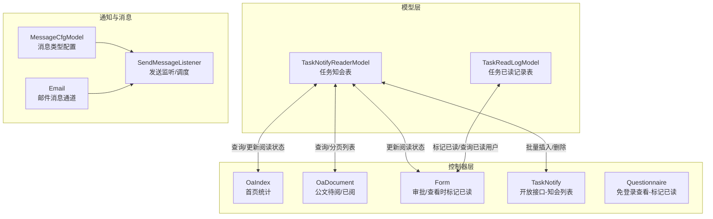
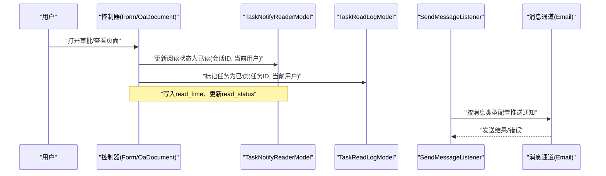
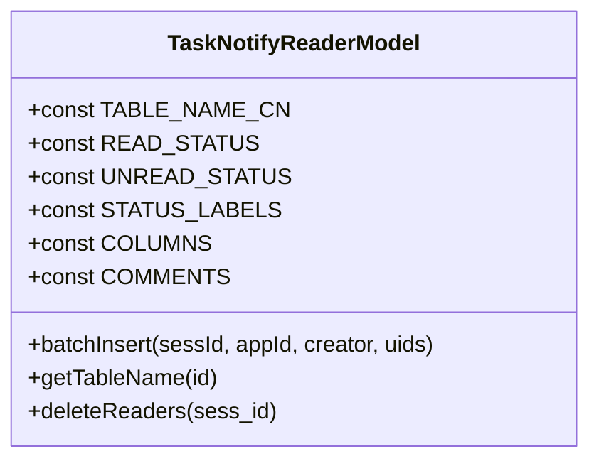
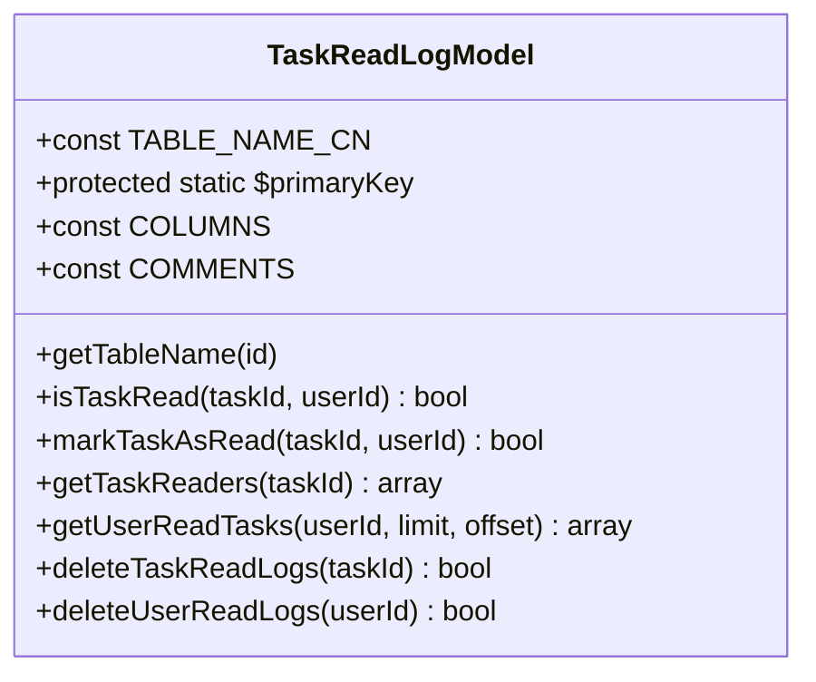
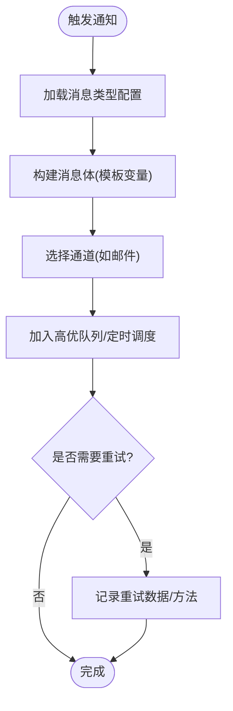
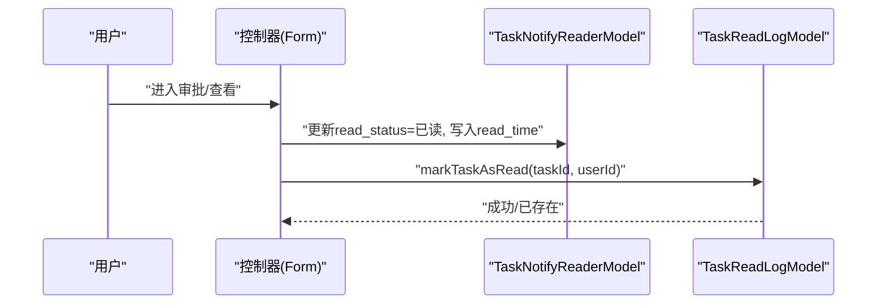
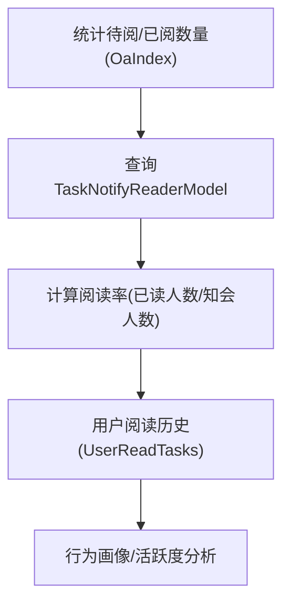
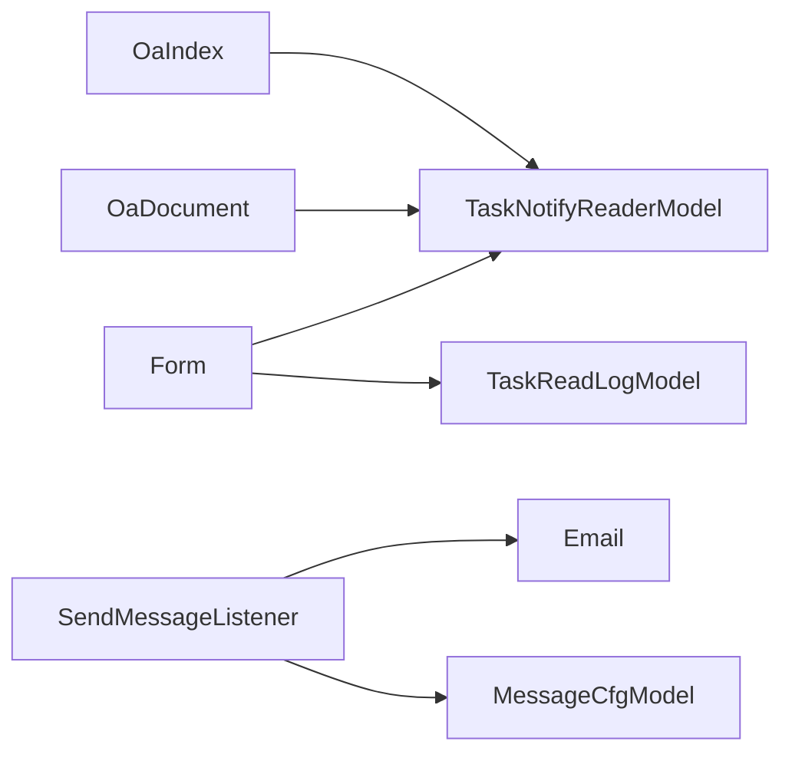

# 任务通知阅读模型

<cite>
**本文引用的文件**
- [TaskNotifyReaderModel.php](file://process/src/models/TaskNotifyReaderModel.php)
- [TaskReadLogModel.php](file://process/src/models/TaskReadLogModel.php)
- [OaIndex.php](file://process/src/http/site/OaIndex.php)
- [Form.php](file://process/src/http/site/Form.php)
- [TaskNotify.php](file://process/src/http/open/TaskNotify.php)
- [OaDocument.php](file://process/src/http/site/OaDocument.php)
- [Questionnaire.php](file://process/src/http/api/Questionnaire.php)
- [MessageCfgModel.php](file://process/src/models/MessageCfgModel.php)
- [Email.php](file://process/src/services/notice/message/Email.php)
- [SendMessageListener.php](file://process/src/services/listeners/SendMessageListener.php)
- [migration_20240912_154331_message_notify_up.php](file://process/src/migrations/migration_20240912_154331_message_notify_up.php)
- [migration_20250904_112321_login_config.php](file://process/src/migrations/migration_20250904_112321_login_config.php)
- [database.sql](file://process/docs/sql/database.sql)
</cite>

## 目录
1. [引言](#引言)
2. [项目结构](#项目结构)
3. [核心组件](#核心组件)
4. [架构总览](#架构总览)
5. [详细组件分析](#详细组件分析)
6. [依赖分析](#依赖分析)
7. [性能考虑](#性能考虑)
8. [故障排查指南](#故障排查指南)
9. [结论](#结论)
10. [附录](#附录)

## 引言
本文件聚焦于任务通知与阅读追踪系统中的两个关键模型：TaskNotifyReaderModel（任务知会阅读模型）与TaskReadLogModel（任务已读记录模型）。我们将从系统架构、数据结构、处理流程、通知机制、优先级与重试策略、统计分析与行为追踪等方面，全面解析这两个模型在实际业务中的职责与协作方式，并给出可视化图示与实践建议。

## 项目结构
围绕任务通知与阅读追踪的相关代码主要分布在以下模块：
- 模型层：TaskNotifyReaderModel、TaskReadLogModel
- 控制器层：站点控制器（如 OaIndex、OaDocument、Form）、开放接口（如 TaskNotify）、API 控制器（如 Questionnaire）
- 通知与消息：MessageCfgModel（消息类型配置）、Email（消息通道）、SendMessageListener（发送监听与调度）、数据库迁移（消息通知扩展字段）

图表来源
- [TaskNotifyReaderModel.php](file://process/src/models/TaskNotifyReaderModel.php#L1-L65)
- [TaskReadLogModel.php](file://process/src/models/TaskReadLogModel.php#L1-L133)
- [OaIndex.php](file://process/src/http/site/OaIndex.php#L93-L117)
- [OaDocument.php](file://process/src/http/site/OaDocument.php#L164-L233)
- [Form.php](file://process/src/http/site/Form.php#L482-L583)
- [TaskNotify.php](file://process/src/http/open/TaskNotify.php#L26-L76)
- [MessageCfgModel.php](file://process/src/models/MessageCfgModel.php#L68-L113)
- [Email.php](file://process/src/services/notice/message/Email.php#L1-L37)
- [SendMessageListener.php](file://process/src/services/listeners/SendMessageListener.php#L76-L105)

章节来源
- [TaskNotifyReaderModel.php](file://process/src/models/TaskNotifyReaderModel.php#L1-L65)
- [TaskReadLogModel.php](file://process/src/models/TaskReadLogModel.php#L1-L133)
- [OaIndex.php](file://process/src/http/site/OaIndex.php#L93-L117)
- [OaDocument.php](file://process/src/http/site/OaDocument.php#L164-L233)
- [Form.php](file://process/src/http/site/Form.php#L482-L583)
- [TaskNotify.php](file://process/src/http/open/TaskNotify.php#L26-L76)
- [MessageCfgModel.php](file://process/src/models/MessageCfgModel.php#L68-L113)
- [Email.php](file://process/src/services/notice/message/Email.php#L1-L37)
- [SendMessageListener.php](file://process/src/services/listeners/SendMessageListener.php#L76-L105)

## 核心组件
- TaskNotifyReaderModel
  - 职责：维护“任务知会阅读状态”，支持批量插入知会读者、按条件查询与统计、删除某会话的知会记录。
  - 关键字段：会话ID、应用ID、创建者、阅读者、阅读状态、创建时间、是否测试数据、阅读时间、日志ID、是否删除等。
  - 关键方法：批量插入、获取表名、删除知会。
- TaskReadLogModel
  - 职责：维护“任务已读记录”，支持检查是否已读、标记已读、查询已读用户列表、查询用户已读任务列表、删除任务/用户相关记录。
  - 关键字段：任务ID、创建人、创建时间。
  - 关键方法：isTaskRead、markTaskAsRead、getTaskReaders、getUserReadTasks、deleteTaskReadLogs、deleteUserReadLogs。

章节来源
- [TaskNotifyReaderModel.php](file://process/src/models/TaskNotifyReaderModel.php#L1-L65)
- [TaskReadLogModel.php](file://process/src/models/TaskReadLogModel.php#L1-L133)

## 架构总览
通知与阅读追踪的整体流程如下：
- 任务产生后，系统向目标用户批量插入“知会记录”（TaskNotifyReaderModel），并可基于消息类型配置（MessageCfgModel）触发通知发送。
- 用户在查看/审批页面时，系统将对应会话的“未读”记录更新为“已读”，并写入阅读时间；同时，TaskReadLogModel 记录该任务已被某用户阅读。
- 控制器层通过模型查询统计“待阅/已阅”数量、生成列表，并支持开放接口导出与筛选。
- 发送监听器负责将通知推送到不同渠道（如邮件），并支持定时/循环发送、重试与失败记录。

图表来源
- [Form.php](file://process/src/http/site/Form.php#L482-L583)
- [TaskNotifyReaderModel.php](file://process/src/models/TaskNotifyReaderModel.php#L46-L65)
- [TaskReadLogModel.php](file://process/src/models/TaskReadLogModel.php#L31-L70)
- [MessageCfgModel.php](file://process/src/models/MessageCfgModel.php#L68-L113)
- [Email.php](file://process/src/services/notice/message/Email.php#L1-L37)
- [SendMessageListener.php](file://process/src/services/listeners/SendMessageListener.php#L76-L105)

## 详细组件分析

### TaskNotifyReaderModel（任务知会阅读模型）
- 数据结构
  - 表名：task_notify_reader
  - 字段要点：sess_id、app_id、creator、reader、read_status、created、is_test、read_time、log_id、is_delete
  - 状态常量：READ_STATUS、UNREAD_STATUS、STATUS_LABELS
- 主要能力
  - 批量插入：为同一会话批量插入多个读者，便于通知广播
  - 删除知会：按会话ID清理知会记录
  - 查询与统计：配合控制器按用户、应用、状态、时间等条件查询与计数
- 使用场景
  - 审批/查看页面：将“未读”更新为“已读”，并记录read_time
  - 开放接口：按用户、应用、状态、时间范围、关键词等筛选知会列表
  - 首页统计：按应用集合统计“待阅/已阅”数量

图表来源
- [TaskNotifyReaderModel.php](file://process/src/models/TaskNotifyReaderModel.php#L1-L65)

章节来源
- [TaskNotifyReaderModel.php](file://process/src/models/TaskNotifyReaderModel.php#L1-L65)
- [OaIndex.php](file://process/src/http/site/OaIndex.php#L93-L117)
- [OaDocument.php](file://process/src/http/site/OaDocument.php#L164-L233)
- [TaskNotify.php](file://process/src/http/open/TaskNotify.php#L26-L76)
- [Form.php](file://process/src/http/site/Form.php#L482-L490)

### TaskReadLogModel（任务已读记录模型）
- 数据结构
  - 表名：task_read_log
  - 字段要点：task_id、creator、created
- 主要能力
  - isTaskRead：检查某任务是否已被某用户阅读
  - markTaskAsRead：幂等地插入一条已读记录
  - getTaskReaders：查询某任务的已读用户列表
  - getUserReadTasks：查询某用户已读的任务列表（支持分页）
  - 删除相关记录：按任务或按用户删除
- 使用场景
  - 审批/查看页面：在用户完成阅读后调用，避免重复统计
  - 统计分析：用于计算阅读率、用户行为画像

图表来源
- [TaskReadLogModel.php](file://process/src/models/TaskReadLogModel.php#L1-L133)

章节来源
- [TaskReadLogModel.php](file://process/src/models/TaskReadLogModel.php#L1-L133)
- [Form.php](file://process/src/http/site/Form.php#L581-L583)

### 通知发送机制与消息类型
- 消息类型配置
  - MessageCfgModel 定义了多种消息类型，包括“知会”、“待办”、“催办”、“超时”等，用于区分通知类别与模板变量。
- 通知通道
  - Email 通道支持主题、正文、抄送、附件等，消息体通过模板变量格式化。
- 发送监听与调度
  - SendMessageListener 支持按规则延时/定时/循环发送，以及重复发送策略拆分与队列推送。
- 数据库扩展
  - 迁移为 message_notify 表增加 type、link 字段，便于统一管理通知类型与跳转链接。
  - 迁移新增 notice_config_send_log 的 retry_data、retry_method 字段，支持失败重试与明细记录。

图表来源
- [MessageCfgModel.php](file://process/src/models/MessageCfgModel.php#L68-L113)
- [Email.php](file://process/src/services/notice/message/Email.php#L1-L37)
- [SendMessageListener.php](file://process/src/services/listeners/SendMessageListener.php#L76-L105)
- [migration_20240912_154331_message_notify_up.php](file://process/src/migrations/migration_20240912_154331_message_notify_up.php#L1-L25)
- [migration_20250904_112321_login_config.php](file://process/src/migrations/migration_20250904_112321_login_config.php#L33-L71)

章节来源
- [MessageCfgModel.php](file://process/src/models/MessageCfgModel.php#L68-L113)
- [Email.php](file://process/src/services/notice/message/Email.php#L1-L37)
- [SendMessageListener.php](file://process/src/services/listeners/SendMessageListener.php#L76-L105)
- [migration_20240912_154331_message_notify_up.php](file://process/src/migrations/migration_20240912_154331_message_notify_up.php#L1-L25)
- [migration_20250904_112321_login_config.php](file://process/src/migrations/migration_20250904_112321_login_config.php#L33-L71)

### 阅读状态追踪与用户行为
- 阅读状态更新
  - 在审批/查看页面，当用户完成阅读时，系统将对应会话的“未读”记录更新为“已读”，并写入阅读时间。
- 已读记录
  - TaskReadLogModel 记录“任务-用户”的已读事实，支持去重与查询。
- 行为追踪
  - 通过 TaskReadLogModel 的查询接口，可统计用户阅读历史、任务阅读分布，辅助分析用户行为与阅读效率。

图表来源
- [Form.php](file://process/src/http/site/Form.php#L482-L583)
- [TaskNotifyReaderModel.php](file://process/src/models/TaskNotifyReaderModel.php#L46-L65)
- [TaskReadLogModel.php](file://process/src/models/TaskReadLogModel.php#L31-L70)

章节来源
- [Form.php](file://process/src/http/site/Form.php#L482-L583)
- [TaskNotifyReaderModel.php](file://process/src/models/TaskNotifyReaderModel.php#L46-L65)
- [TaskReadLogModel.php](file://process/src/models/TaskReadLogModel.php#L31-L70)

### 通知统计、阅读率分析与用户行为追踪
- 统计入口
  - OaIndex 提供“待阅/已阅”数量统计，按应用集合与用户维度聚合。
- 阅读率分析
  - 可通过 TaskReadLogModel 的 getTaskReaders 获取任务已读用户列表，结合 TaskNotifyReaderModel 的读者清单，计算阅读率。
- 用户行为追踪
  - 通过 TaskReadLogModel 的 getUserReadTasks 可获取用户阅读历史，辅助分析用户活跃度与偏好。

图表来源
- [OaIndex.php](file://process/src/http/site/OaIndex.php#L93-L117)
- [TaskNotifyReaderModel.php](file://process/src/models/TaskNotifyReaderModel.php#L1-L65)
- [TaskReadLogModel.php](file://process/src/models/TaskReadLogModel.php#L72-L107)

章节来源
- [OaIndex.php](file://process/src/http/site/OaIndex.php#L93-L117)
- [TaskReadLogModel.php](file://process/src/models/TaskReadLogModel.php#L72-L107)

### 通知与任务状态的关联关系与业务逻辑
- 知会与任务生命周期
  - 知会记录随会话产生，阅读状态与任务处理进度解耦；用户完成阅读并不改变任务状态，但会影响“待阅/已阅”统计。
- 通知类型与业务场景
  - “知会”类型用于提醒用户查看；“待办/催办/超时”等类型用于推动任务流转；消息模板变量由 MessageCfgModel 统一管理。
- 数据一致性
  - TaskNotifyReaderModel 的批量插入与删除保证广播与清理的一致性；TaskReadLogModel 的幂等插入避免重复统计。

章节来源
- [MessageCfgModel.php](file://process/src/models/MessageCfgModel.php#L68-L113)
- [TaskNotifyReaderModel.php](file://process/src/models/TaskNotifyReaderModel.php#L46-L65)
- [TaskReadLogModel.php](file://process/src/models/TaskReadLogModel.php#L31-L70)

## 依赖分析
- 组件耦合
  - 控制器依赖模型进行数据读写；模型之间低耦合，分别承担“知会状态”和“已读事实”两类职责。
- 外部依赖
  - 队列与监听器负责异步通知推送；数据库迁移扩展通知表字段，支撑更丰富的通知管理。
- 潜在风险
  - 若批量插入未正确去重，可能导致统计偏高；若未及时清理旧知会记录，可能影响查询性能。

图表来源
- [OaIndex.php](file://process/src/http/site/OaIndex.php#L93-L117)
- [OaDocument.php](file://process/src/http/site/OaDocument.php#L164-L233)
- [Form.php](file://process/src/http/site/Form.php#L482-L583)
- [TaskNotifyReaderModel.php](file://process/src/models/TaskNotifyReaderModel.php#L1-L65)
- [TaskReadLogModel.php](file://process/src/models/TaskReadLogModel.php#L1-L133)
- [MessageCfgModel.php](file://process/src/models/MessageCfgModel.php#L68-L113)
- [Email.php](file://process/src/services/notice/message/Email.php#L1-L37)
- [SendMessageListener.php](file://process/src/services/listeners/SendMessageListener.php#L76-L105)

章节来源
- [OaIndex.php](file://process/src/http/site/OaIndex.php#L93-L117)
- [OaDocument.php](file://process/src/http/site/OaDocument.php#L164-L233)
- [Form.php](file://process/src/http/site/Form.php#L482-L583)
- [TaskNotifyReaderModel.php](file://process/src/models/TaskNotifyReaderModel.php#L1-L65)
- [TaskReadLogModel.php](file://process/src/models/TaskReadLogModel.php#L1-L133)
- [MessageCfgModel.php](file://process/src/models/MessageCfgModel.php#L68-L113)
- [Email.php](file://process/src/services/notice/message/Email.php#L1-L37)
- [SendMessageListener.php](file://process/src/services/listeners/SendMessageListener.php#L76-L105)

## 性能考虑
- 批量插入与清理
  - 使用批量插入减少多次往返；定期清理过期知会记录，避免表膨胀。
- 查询优化
  - 对常用查询条件（如 reader、read_status、app_id、is_test）建立索引，提升统计与分页性能。
- 异步推送
  - 将通知发送放入高优队列，结合定时/循环策略，降低峰值压力。
- 缓存与去重
  - 已读记录幂等插入，避免重复统计；必要时引入缓存加速高频查询。

## 故障排查指南
- 常见问题
  - 阅读状态未更新：检查控制器是否在用户完成阅读时调用更新接口。
  - 阅读率异常：核对 TaskNotifyReaderModel 与 TaskReadLogModel 的数据一致性。
  - 通知未送达：检查消息类型配置、通道参数与发送监听器的调度策略。
- 重试与日志
  - 查看 notice_config_send_log 的 retry_data 与 retry_method 字段，定位失败原因并复核。
- 数据库结构
  - 确认 message_notify 表已按迁移脚本添加 type、link 字段；message_log、message_insite 等表结构符合预期。

章节来源
- [migration_20250904_112321_login_config.php](file://process/src/migrations/migration_20250904_112321_login_config.php#L33-L71)
- [database.sql](file://process/docs/sql/database.sql#L502-L539)

## 结论
TaskNotifyReaderModel 与 TaskReadLogModel 分别承担“知会阅读状态”和“已读事实记录”的职责，二者协同实现了从通知到阅读追踪的闭环。通过消息类型配置与发送监听器，系统能够灵活地在多渠道推送通知，并具备定时/循环与重试能力。结合控制器层的统计与列表查询，可有效支撑阅读率分析与用户行为追踪，为企业运营与流程优化提供数据基础。

## 附录
- 通知类型参考
  - 知会、待办、催办、超时、审批通过/驳回、评价事项、问卷密码等。
- 数据库相关
  - message_cfg、message_log、message_insite、thirdparty_platform 等表结构与索引设计应满足高并发与可扩展需求。

章节来源
- [MessageCfgModel.php](file://process/src/models/MessageCfgModel.php#L68-L113)
- [database.sql](file://process/docs/sql/database.sql#L502-L539)