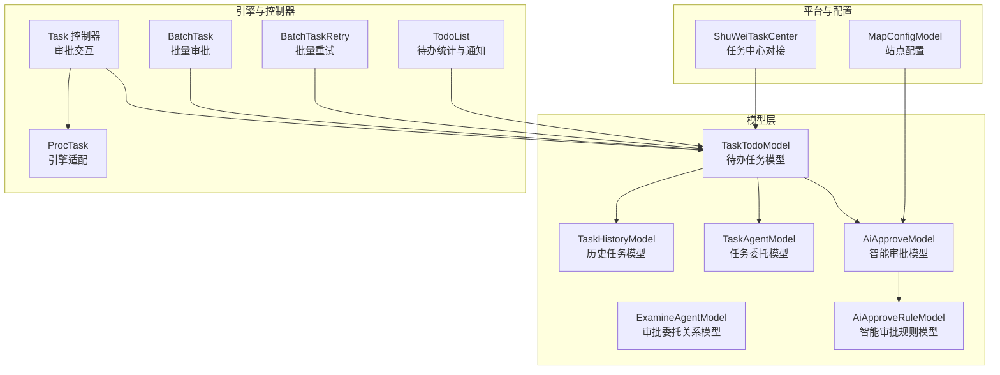
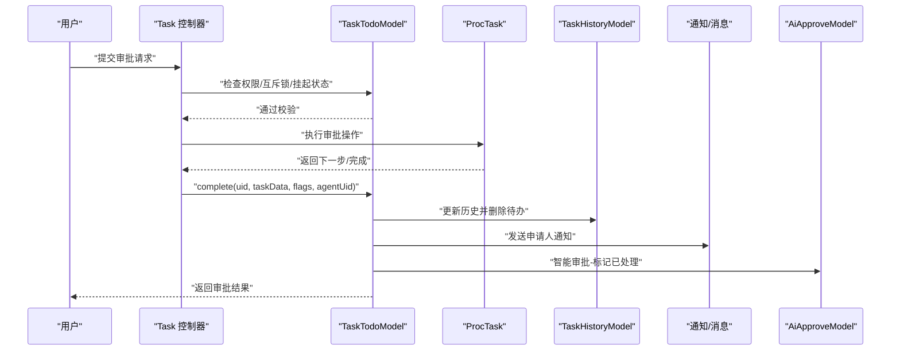
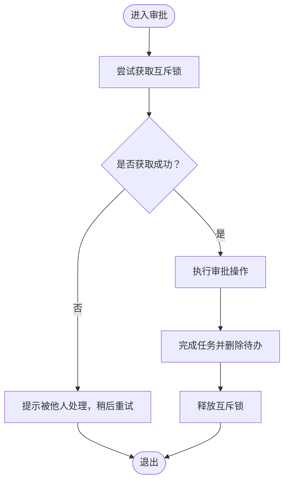
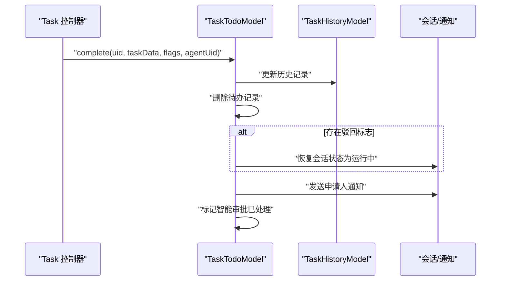
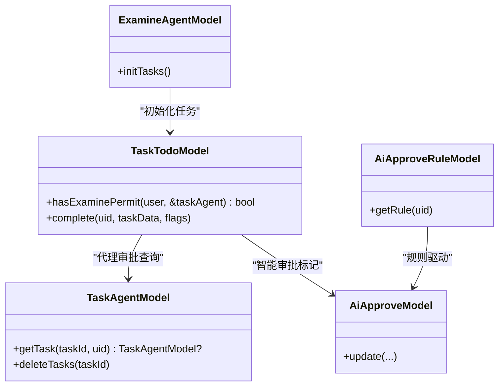
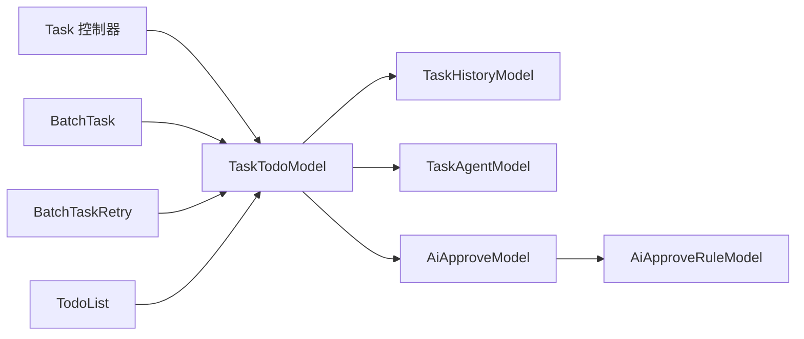

# 待办任务模型

<cite>
**本文引用的文件**
- [TaskTodoModel.php](file://process/src/models/TaskTodoModel.php)
- [AbstractTaskModel.php](file://process/src/models/AbstractTaskModel.php)
- [TaskHistoryModel.php](file://process/src/models/TaskHistoryModel.php)
- [TaskAgentModel.php](file://process/src/models/TaskAgentModel.php)
- [ExamineAgentModel.php](file://process/src/models/ExamineAgentModel.php)
- [AiApproveModel.php](file://process/src/models/AiApproveModel.php)
- [AiApproveRuleModel.php](file://process/src/models/AiApproveRuleModel.php)
- [ProcTask.php](file://process/src/engine/ProcTask.php)
- [Task.php](file://process/src/http/site/Task.php)
- [BatchTask.php](file://process/src/services/task/BatchTask.php)
- [BatchTaskRetry.php](file://process/src/services/task/BatchTaskRetry.php)
- [TodoList.php](file://process/src/services/task/TodoList.php)
- [database.sql](file://process/docs/sql/database.sql)
- [migration_20240307_103639_task_order.php](file://process/src/migrations/migration_20240307_103639_task_order.php)
- [migration_20230727_191323_create_index_on_task_history.php](file://process/src/migrations/migration_20230727_191323_create_index_on_task_history.php)
- [migration_20230822_094832_batch.php](file://process/src/migrations/migration_20230822_094832_batch.php)
- [migration_20240716_170331_statistics.php](file://process/src/migrations/migration_20240716_170331_statistics.php)
- [ShuWeiTaskCenter.php](file://process/src/services/platform/ShuWeiTaskCenter.php)
- [Common.php](file://process/src/http/system/Common.php)
</cite>

## 目录
1. [引言](#引言)
2. [项目结构](#项目结构)
3. [核心组件](#核心组件)
4. [架构总览](#架构总览)
5. [详细组件分析](#详细组件分析)
6. [依赖分析](#依赖分析)
7. [性能考虑](#性能考虑)
8. [故障排查指南](#故障排查指南)
9. [结论](#结论)
10. [附录](#附录)

## 引言
本文件围绕待办任务模型 TaskTodoModel 的设计与实现进行全面技术文档化，覆盖任务类型（流程任务、加签任务、填报任务）、状态管理（初始化、验证中、已完成、锁定、挂起）、标志位体系（催办、驳回、紧急、加签标记等），并深入解析任务数据结构 task_data 的存储与使用、参与者 users 数组的管理机制、任务互斥锁机制、任务完成流程与历史记录转移、权限验证与代理审批、智能审批集成，以及任务查询、统计与批量操作的实现要点与参考路径。

## 项目结构
- 模型层：TaskTodoModel、TaskHistoryModel、TaskAgentModel、ExamineAgentModel、AiApproveModel、AiApproveRuleModel 等。
- 引擎适配：ProcTask 对底层引擎的轻量封装。
- 控制器与服务：Task 控制器负责审批交互，BatchTask/BatchTaskRetry 负责批量审批与重试，TodoList 负责待办统计与通知。
- 数据库与索引：database.sql 定义 task_todo 与 task_history 结构；多处迁移脚本补充索引与字段。
- 平台集成：ShuWeiTaskCenter 等平台对接任务中心。

图表来源
- [TaskTodoModel.php](file://process/src/models/TaskTodoModel.php#L1-L288)
- [TaskHistoryModel.php](file://process/src/models/TaskHistoryModel.php#L1-L270)
- [TaskAgentModel.php](file://process/src/models/TaskAgentModel.php#L1-L47)
- [ExamineAgentModel.php](file://process/src/models/ExamineAgentModel.php#L1-L50)
- [AiApproveModel.php](file://process/src/models/AiApproveModel.php#L1-L386)
- [AiApproveRuleModel.php](file://process/src/models/AiApproveRuleModel.php#L1-L44)
- [ProcTask.php](file://process/src/engine/ProcTask.php#L1-L11)
- [Task.php](file://process/src/http/site/Task.php#L1-L200)
- [BatchTask.php](file://process/src/services/task/BatchTask.php#L64-L124)
- [BatchTaskRetry.php](file://process/src/services/task/BatchTaskRetry.php#L95-L126)
- [TodoList.php](file://process/src/services/task/TodoList.php#L1-L34)
- [ShuWeiTaskCenter.php](file://process/src/services/platform/ShuWeiTaskCenter.php#L1365-L1383)

章节来源
- [TaskTodoModel.php](file://process/src/models/TaskTodoModel.php#L1-L288)
- [database.sql](file://process/docs/sql/database.sql#L335-L368)

## 核心组件
- TaskTodoModel：待办任务核心模型，定义任务类型、状态、标志位、数据结构、互斥锁、完成流程、权限校验、跳转等。
- TaskHistoryModel：历史任务模型，记录已完成/中止/挂起等状态，并支持恢复至待办。
- TaskAgentModel / ExamineAgentModel：任务委托与审批委托关系模型，支撑代理审批。
- AiApproveModel / AiApproveRuleModel：智能审批规则与分析结果模型，支撑智能审批集成。
- ProcTask：引擎适配层，承载流程令牌与活动控制。
- Task 控制器：审批交互入口，执行权限校验、互斥锁、完成流程与通知。
- 批量服务：BatchTask/BatchTaskRetry，批量审批与失败重试，含锁定与解锁逻辑。
- TodoList：基于 task_todo 的待办统计与通知。

章节来源
- [TaskTodoModel.php](file://process/src/models/TaskTodoModel.php#L1-L288)
- [TaskHistoryModel.php](file://process/src/models/TaskHistoryModel.php#L1-L270)
- [TaskAgentModel.php](file://process/src/models/TaskAgentModel.php#L1-L47)
- [ExamineAgentModel.php](file://process/src/models/ExamineAgentModel.php#L1-L50)
- [AiApproveModel.php](file://process/src/models/AiApproveModel.php#L1-L386)
- [AiApproveRuleModel.php](file://process/src/models/AiApproveRuleModel.php#L1-L44)
- [ProcTask.php](file://process/src/engine/ProcTask.php#L1-L11)
- [Task.php](file://process/src/http/site/Task.php#L1-L200)
- [BatchTask.php](file://process/src/services/task/BatchTask.php#L64-L124)
- [BatchTaskRetry.php](file://process/src/services/task/BatchTaskRetry.php#L95-L126)
- [TodoList.php](file://process/src/services/task/TodoList.php#L1-L34)

## 架构总览
下图展示待办任务从创建、审批、完成到历史转移的关键交互：

图表来源
- [Task.php](file://process/src/http/site/Task.php#L140-L196)
- [TaskTodoModel.php](file://process/src/models/TaskTodoModel.php#L164-L211)
- [AiApproveModel.php](file://process/src/models/AiApproveModel.php#L1-L386)

## 详细组件分析

### 任务类型与状态管理
- 任务类型
  - 流程任务：TYPE_PROCESS
  - 加签任务：TYPE_ADDSIGN
  - 填报任务：TYPE_FILL
- 状态
  - 初始化：STATUS_INIT
  - 验证中：STATUS_VALIDATE
  - 已完成：STATUS_COMPLETE
  - 锁定（批量审批）：STATUS_LOCK
  - 挂起：STATUS_SUSPEND
- 标志位（部分）
  - 催办：FLAG_REMIND
  - 驳回：FLAG_REJECT
  - 加签标记：FLAG_SIGNING
  - 加签回执：FLAG_SIGN_RETURN
  - 超时：FLAG_TIMEOUT
  - 错误：FLAG_EXCEPTION
  - 重报：FLAG_REFILL
  - 禁止收回：FLAG_DISABLE_UNDO
  - 节点标记：FLAG_NODE_SIGN
  - 会签加签：FLAG_SIGNING_COUNTERSIGN
  - 催办状态：REMIND_STATUS_NONE/DONE/WAIT

章节来源
- [TaskTodoModel.php](file://process/src/models/TaskTodoModel.php#L12-L44)

### 任务数据结构 task_data 与参与者 users
- task_data（JSON/JSONB）
  - 记录流程运行中的动态数据，如引擎 task_id、加签/移交来源与目标、操作序列化对象、节点标记等。
  - 支持在完成时合并增量数据，避免覆盖已有字段。
- users（整型数组）
  - 存储任务参与者/候选人的用户 ID 列表，用于权限校验与统计。
- sort_order（排序字段）
  - 新增排序字段与索引，支持按业务自定义排序。

章节来源
- [TaskTodoModel.php](file://process/src/models/TaskTodoModel.php#L46-L72)
- [database.sql](file://process/docs/sql/database.sql#L335-L368)
- [migration_20240307_103639_task_order.php](file://process/src/migrations/migration_20240307_103639_task_order.php#L1-L22)

### 任务互斥锁机制
- 使用 Redis 分布式锁，键名规则为 task_mutex_{id}，超时时间固定。
- 仅持有锁的用户可提交审批，避免并发冲突。
- 释放锁在完成流程或异常时清理。

图表来源
- [AbstractTaskModel.php](file://process/src/models/AbstractTaskModel.php#L78-L92)
- [TaskTodoModel.php](file://process/src/models/TaskTodoModel.php#L148-L163)
- [Task.php](file://process/src/http/site/Task.php#L213-L224)

章节来源
- [AbstractTaskModel.php](file://process/src/models/AbstractTaskModel.php#L78-L92)
- [TaskTodoModel.php](file://process/src/models/TaskTodoModel.php#L148-L163)
- [Task.php](file://process/src/http/site/Task.php#L213-L224)

### 任务完成流程与历史记录转移
- 完成时更新状态为已完成、记录完成时间、写入处理人与代理信息。
- 将待办记录写入历史表 task_history，随后删除待办记录。
- 若存在驳回标志，恢复会话状态为运行中。
- 触发对申请人的通知（如配置）。
- 智能审批：将对应任务的 AI 分析结果标记为已处理。

图表来源
- [TaskTodoModel.php](file://process/src/models/TaskTodoModel.php#L164-L211)
- [TaskHistoryModel.php](file://process/src/models/TaskHistoryModel.php#L100-L107)

章节来源
- [TaskTodoModel.php](file://process/src/models/TaskTodoModel.php#L164-L211)
- [TaskHistoryModel.php](file://process/src/models/TaskHistoryModel.php#L100-L107)

### 权限验证、代理审批与智能审批集成
- 权限验证
  - 参与者在 users 中或具备流程监控权限即有权限。
  - 测试数据场景下，需满足应用测试用户条件。
  - 代理审批：通过 TaskAgentModel 查询当前任务的代理关系，若存在则授权。
- 代理审批
  - ExamineAgentModel 维护审批委托关系，支持按应用范围与状态初始化任务。
- 智能审批
  - AiApproveModel 维护智能审批分析结果，TaskTodoModel 完成时将其置为已处理。
  - AiApproveRuleModel 维护规则与重点信息，支持按节点启用与默认策略。

图表来源
- [TaskTodoModel.php](file://process/src/models/TaskTodoModel.php#L213-L226)
- [TaskAgentModel.php](file://process/src/models/TaskAgentModel.php#L1-L47)
- [ExamineAgentModel.php](file://process/src/models/ExamineAgentModel.php#L1-L50)
- [AiApproveModel.php](file://process/src/models/AiApproveModel.php#L1-L386)
- [AiApproveRuleModel.php](file://process/src/models/AiApproveRuleModel.php#L1-L44)

章节来源
- [TaskTodoModel.php](file://process/src/models/TaskTodoModel.php#L213-L226)
- [TaskAgentModel.php](file://process/src/models/TaskAgentModel.php#L1-L47)
- [ExamineAgentModel.php](file://process/src/models/ExamineAgentModel.php#L1-L50)
- [AiApproveModel.php](file://process/src/models/AiApproveModel.php#L1-L386)
- [AiApproveRuleModel.php](file://process/src/models/AiApproveRuleModel.php#L1-L44)

### 任务查询、统计与批量操作
- 查询与格式化
  - MyTask 在 Task 控制器中构建查询条件，支持关键词、时间范围、应用、节点、标记等过滤，并对流程任务与填报任务分别格式化。
- 统计
  - TodoList 通过扫描 task_todo 的 users 字段进行并行统计，向用户发送待办数量通知。
- 批量审批
  - BatchTask 与 BatchTaskRetry 提供批量审批与失败重试，包含事务回滚、状态更新、批量解锁等逻辑。
- 任务中心对接
  - ShuWeiTaskCenter 提供任务中心字段映射，便于外部平台集成。

章节来源
- [Task.php](file://process/src/http/site/Task.php#L103-L196)
- [TodoList.php](file://process/src/services/task/TodoList.php#L1-L34)
- [BatchTask.php](file://process/src/services/task/BatchTask.php#L64-L124)
- [BatchTaskRetry.php](file://process/src/services/task/BatchTaskRetry.php#L95-L126)
- [ShuWeiTaskCenter.php](file://process/src/services/platform/ShuWeiTaskCenter.php#L1365-L1383)

## 依赖分析
- 模型间依赖
  - TaskTodoModel 依赖 TaskHistoryModel 进行完成后的历史转移。
  - TaskTodoModel 依赖 TaskAgentModel 与 ExamineAgentModel 支持代理审批。
  - TaskTodoModel 依赖 AiApproveModel/AiApproveRuleModel 支持智能审批。
- 控制器与服务
  - Task 控制器协调权限校验、互斥锁、引擎操作与完成流程。
  - 批量服务在事务内执行，失败时回滚并可能批量解锁。
- 数据库与索引
  - task_todo 与 task_history 的索引优化查询性能；task_todo 新增 sort_order 字段提升排序效率。

图表来源
- [TaskTodoModel.php](file://process/src/models/TaskTodoModel.php#L1-L288)
- [TaskHistoryModel.php](file://process/src/models/TaskHistoryModel.php#L1-L270)
- [TaskAgentModel.php](file://process/src/models/TaskAgentModel.php#L1-L47)
- [AiApproveModel.php](file://process/src/models/AiApproveModel.php#L1-L386)
- [AiApproveRuleModel.php](file://process/src/models/AiApproveRuleModel.php#L1-L44)
- [Task.php](file://process/src/http/site/Task.php#L1-L200)
- [BatchTask.php](file://process/src/services/task/BatchTask.php#L64-L124)
- [BatchTaskRetry.php](file://process/src/services/task/BatchTaskRetry.php#L95-L126)
- [TodoList.php](file://process/src/services/task/TodoList.php#L1-L34)

章节来源
- [TaskTodoModel.php](file://process/src/models/TaskTodoModel.php#L1-L288)
- [TaskHistoryModel.php](file://process/src/models/TaskHistoryModel.php#L1-L270)
- [TaskAgentModel.php](file://process/src/models/TaskAgentModel.php#L1-L47)
- [AiApproveModel.php](file://process/src/models/AiApproveModel.php#L1-L386)
- [AiApproveRuleModel.php](file://process/src/models/AiApproveRuleModel.php#L1-L44)
- [Task.php](file://process/src/http/site/Task.php#L1-L200)
- [BatchTask.php](file://process/src/services/task/BatchTask.php#L64-L124)
- [BatchTaskRetry.php](file://process/src/services/task/BatchTaskRetry.php#L95-L126)
- [TodoList.php](file://process/src/services/task/TodoList.php#L1-L34)

## 性能考虑
- 索引优化
  - task_todo/node_id、task_history/sess_id、task_history/node_id、task_history/fill_period_id 等索引提升查询效率。
- 排序与分页
  - sort_order 字段与索引支持业务自定义排序，配合分页接口降低前端压力。
- 并发控制
  - 互斥锁避免高并发下的重复审批与状态不一致。
- 统计与通知
  - TodoList 使用协程并行统计与发送通知，减少等待时间。

章节来源
- [database.sql](file://process/docs/sql/database.sql#L335-L368)
- [migration_20240307_103639_task_order.php](file://process/src/migrations/migration_20240307_103639_task_order.php#L1-L22)
- [migration_20230727_191323_create_index_on_task_history.php](file://process/src/migrations/migration_20230727_191323_create_index_on_task_history.php#L1-L18)
- [TodoList.php](file://process/src/services/task/TodoList.php#L1-L34)

## 故障排查指南
- 并发冲突
  - 现象：提示“任务正被他人处理”。
  - 处理：等待互斥锁释放或稍后重试；确认 Redis 锁是否正确释放。
- 权限不足
  - 现象：提示“没有审批权限”。
  - 处理：确认用户是否在 users 或具备流程监控权限；检查代理关系是否存在。
- 流程挂起
  - 现象：提示“流程已挂起，无法操作”。
  - 处理：等待流程恢复或联系管理员。
- 批量审批失败
  - 现象：批量任务失败或卡住。
  - 处理：查看 BatchTask/BatchTaskRetry 的错误日志与重试次数，必要时调用批量解锁接口。
- 智能审批未生效
  - 现象：智能审批未标记为已处理。
  - 处理：确认 AiApproveModel 的状态更新逻辑是否执行，检查规则配置。

章节来源
- [Task.php](file://process/src/http/site/Task.php#L207-L225)
- [BatchTask.php](file://process/src/services/task/BatchTask.php#L64-L124)
- [BatchTaskRetry.php](file://process/src/services/task/BatchTaskRetry.php#L95-L126)
- [TaskTodoModel.php](file://process/src/models/TaskTodoModel.php#L208-L211)

## 结论
TaskTodoModel 通过清晰的任务类型与状态管理、严谨的互斥锁机制、完善的权限与代理审批支持、以及与历史模型和智能审批的无缝衔接，构建了稳定高效的待办任务处理体系。配合索引优化、并行统计与批量服务，整体具备良好的扩展性与运维可观测性。

## 附录
- 任务查询与统计参考路径
  - 查询接口：[Task.php](file://process/src/http/site/Task.php#L53-L101)
  - 统计服务：[TodoList.php](file://process/src/services/task/TodoList.php#L1-L34)
- 批量操作参考路径
  - 批量审批：[BatchTask.php](file://process/src/services/task/BatchTask.php#L64-L124)
  - 批量重试与解锁：[BatchTaskRetry.php](file://process/src/services/task/BatchTaskRetry.php#L95-L126)
- 数据结构与索引参考路径
  - 表结构与索引：[database.sql](file://process/docs/sql/database.sql#L335-L368)
  - 排序字段与索引：[migration_20240307_103639_task_order.php](file://process/src/migrations/migration_20240307_103639_task_order.php#L1-L22)
  - 历史表索引：[migration_20230727_191323_create_index_on_task_history.php](file://process/src/migrations/migration_20230727_191323_create_index_on_task_history.php#L1-L18)
  - 批量任务表结构：[migration_20230822_094832_batch.php](file://process/src/migrations/migration_20230822_094832_batch.php#L35-L61)
  - 统计表结构：[migration_20240716_170331_statistics.php](file://process/src/migrations/migration_20240716_170331_statistics.php#L34-L87)
- 平台对接参考路径
  - 任务中心字段映射：[ShuWeiTaskCenter.php](file://process/src/services/platform/ShuWeiTaskCenter.php#L1365-L1383)
- 智能审批规则与配置参考路径
  - 规则模型：[AiApproveRuleModel.php](file://process/src/models/AiApproveRuleModel.php#L1-L44)
  - 配置说明：[Common.php](file://process/src/http/system/Common.php#L634-L681)