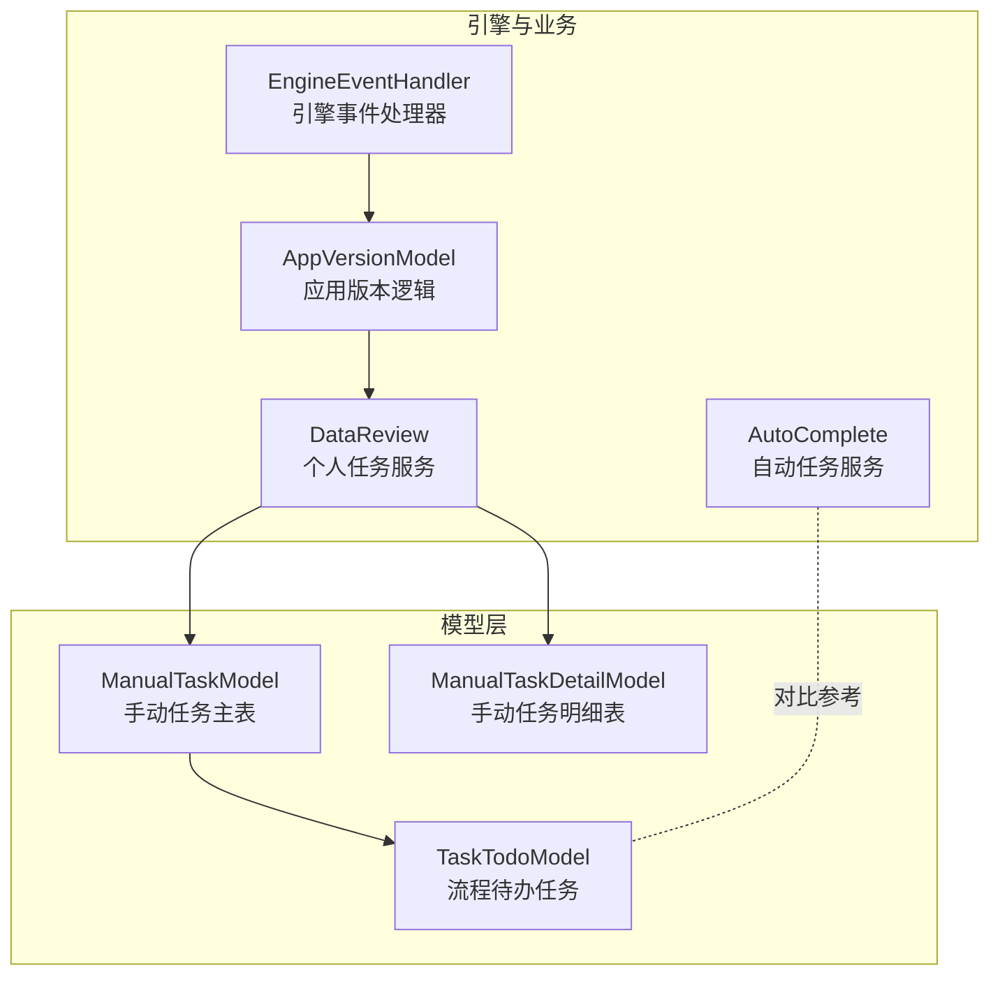
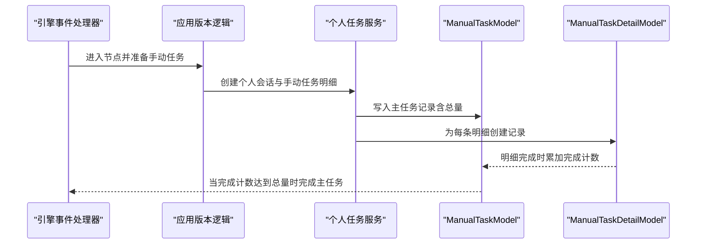
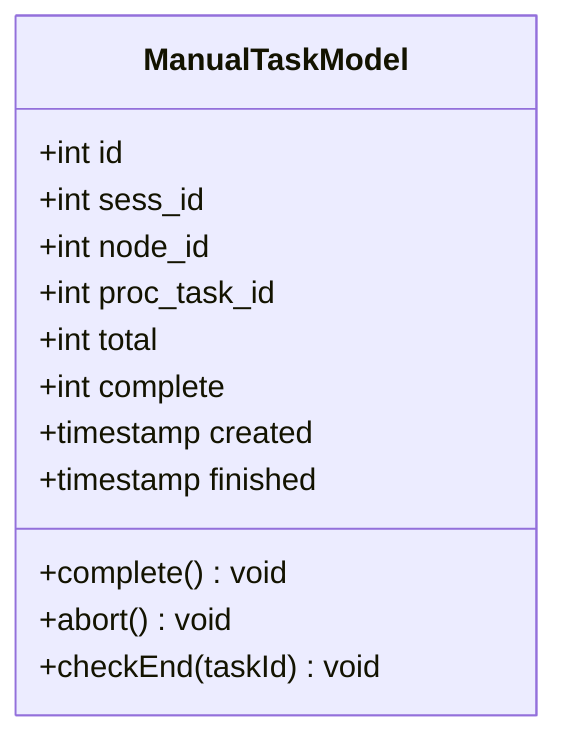
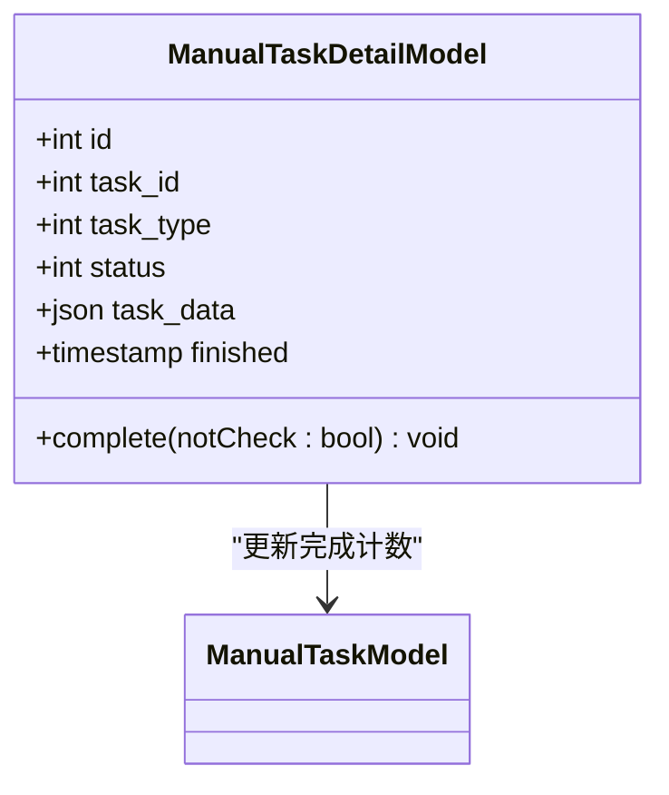
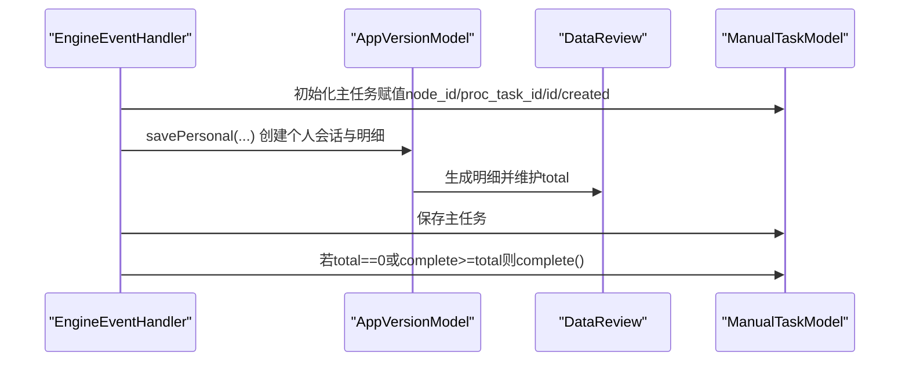
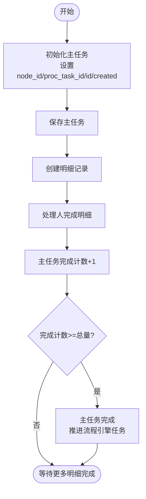
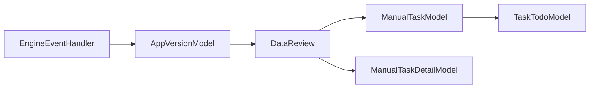

# 手动任务模型

<cite>
**本文引用的文件**
- [ManualTaskModel.php](file://process/src/models/ManualTaskModel.php)
- [ManualTaskDetailModel.php](file://process/src/models/ManualTaskDetailModel.php)
- [TaskTodoModel.php](file://process/src/models/TaskTodoModel.php)
- [EngineEventHandler.php](file://process/src/modules/process/EngineEventHandler.php)
- [AppVersionModel.php](file://process/src/models/AppVersionModel.php)
- [DataReview.php](file://process/src/services/personal/DataReview.php)
- [AutoComplete.php](file://process/src/services/task/AutoComplete.php)
</cite>

## 目录
1. [引言](#引言)
2. [项目结构](#项目结构)
3. [核心组件](#核心组件)
4. [架构总览](#架构总览)
5. [组件详解](#组件详解)
6. [依赖关系分析](#依赖关系分析)
7. [性能考量](#性能考量)
8. [故障排查指南](#故障排查指南)
9. [结论](#结论)
10. [附录](#附录)

## 引言
本文件围绕手动任务模型进行系统性技术文档整理，重点解析 ManualTaskModel 与 ManualTaskDetailModel 在手动任务处理系统中的设计与实现。文档覆盖手动任务的非流程驱动特性、手动分配与处理机制、任务详情的数据结构与状态管理，并给出创建、分配、执行与完成的全流程说明；同时提供查询、统计与报表生成的实现思路与参考路径，最后解释手动任务与自动任务的区别及集成方式。

## 项目结构
与手动任务模型直接相关的代码主要分布在以下模块：
- 模型层：ManualTaskModel、ManualTaskDetailModel、TaskTodoModel
- 引擎事件：EngineEventHandler（触发与初始化手动任务）
- 应用版本逻辑：AppVersionModel（结合审核策略与任务总数更新）
- 个人任务服务：DataReview（生成个人会话与手动任务明细）
- 自动任务服务：AutoComplete（对比自动任务处理流程，理解手动任务差异）

图表来源
- [ManualTaskModel.php](file://process/src/models/ManualTaskModel.php#L1-L84)
- [ManualTaskDetailModel.php](file://process/src/models/ManualTaskDetailModel.php#L1-L60)
- [TaskTodoModel.php](file://process/src/models/TaskTodoModel.php#L1-L288)
- [EngineEventHandler.php](file://process/src/modules/process/EngineEventHandler.php#L275-L302)
- [AppVersionModel.php](file://process/src/models/AppVersionModel.php#L1841-L1874)
- [DataReview.php](file://process/src/services/personal/DataReview.php#L1-L46)
- [AutoComplete.php](file://process/src/services/task/AutoComplete.php#L1-L45)

章节来源
- [ManualTaskModel.php](file://process/src/models/ManualTaskModel.php#L1-L84)
- [ManualTaskDetailModel.php](file://process/src/models/ManualTaskDetailModel.php#L1-L60)
- [TaskTodoModel.php](file://process/src/models/TaskTodoModel.php#L1-L288)
- [EngineEventHandler.php](file://process/src/modules/process/EngineEventHandler.php#L275-L302)
- [AppVersionModel.php](file://process/src/models/AppVersionModel.php#L1841-L1874)
- [DataReview.php](file://process/src/services/personal/DataReview.php#L1-L46)
- [AutoComplete.php](file://process/src/services/task/AutoComplete.php#L1-L45)

## 核心组件
- ManualTaskModel：承载手动任务主记录，包含任务关联的会话、节点、流程任务、总量与完成量、创建与完成时间等字段；提供完成与中止操作，并支持结束检查。
- ManualTaskDetailModel：承载手动任务明细，记录每个子任务的类型、状态、任务数据与完成时间；提供明细完成逻辑，并联动主任务计数。
- TaskTodoModel：流程待办任务模型，用于流程驱动的自动任务处理，与手动任务形成对比。
- EngineEventHandler：在引擎进入特定节点时触发手动任务初始化与保存，设置任务总量与上下文。
- AppVersionModel：根据配置决定是否对未变更数据也进行审核，影响手动任务总量统计。
- DataReview：个人任务服务，负责生成个人会话并创建手动任务明细，维护任务总数与完成计数。
- AutoComplete：自动任务服务，展示自动任务的处理流程，便于理解手动任务的人工干预差异。

章节来源
- [ManualTaskModel.php](file://process/src/models/ManualTaskModel.php#L1-L84)
- [ManualTaskDetailModel.php](file://process/src/models/ManualTaskDetailModel.php#L1-L60)
- [TaskTodoModel.php](file://process/src/models/TaskTodoModel.php#L1-L288)
- [EngineEventHandler.php](file://process/src/modules/process/EngineEventHandler.php#L275-L302)
- [AppVersionModel.php](file://process/src/models/AppVersionModel.php#L1841-L1874)
- [DataReview.php](file://process/src/services/personal/DataReview.php#L1-L46)
- [AutoComplete.php](file://process/src/services/task/AutoComplete.php#L1-L45)

## 架构总览
手动任务的生命周期由引擎事件触发，应用版本逻辑决定审核范围，个人任务服务生成明细，模型层负责持久化与状态推进。自动任务则由引擎与待办模型协作完成。

图表来源
- [EngineEventHandler.php](file://process/src/modules/process/EngineEventHandler.php#L275-L302)
- [AppVersionModel.php](file://process/src/models/AppVersionModel.php#L1841-L1874)
- [DataReview.php](file://process/src/services/personal/DataReview.php#L1-L46)
- [ManualTaskModel.php](file://process/src/models/ManualTaskModel.php#L1-L84)
- [ManualTaskDetailModel.php](file://process/src/models/ManualTaskDetailModel.php#L1-L60)

## 组件详解

### ManualTaskModel：手动任务主模型
- 关键字段
  - 会话标识、节点标识、流程任务标识、总量、完成量、创建与完成时间
- 核心方法
  - 完成：记录完成时间并尝试推进流程引擎对应任务
  - 中止：更新自身完成时间，将未完成明细标记为中止，并取消相关个人会话
  - 结束检查：当完成量达到总量时自动完成主任务
- 设计要点
  - 非流程驱动：主任务完成并不依赖引擎自动流转，而是由明细完成累计触发
  - 与引擎集成：在完成时调用会话持有的进程实例完成对应流程任务
  - 并发安全：通过会话集合与进程实例交互，确保只在运行态推进

图表来源
- [ManualTaskModel.php](file://process/src/models/ManualTaskModel.php#L1-L84)

章节来源
- [ManualTaskModel.php](file://process/src/models/ManualTaskModel.php#L1-L84)

### ManualTaskDetailModel：手动任务明细模型
- 关键字段
  - 所属主任务、任务类型、状态、任务数据（JSON）、完成时间
- 核心方法
  - 完成：更新明细状态与完成时间；可选择是否立即累加主任务完成计数，或延迟到主任务自行检查
- 设计要点
  - 明细粒度：每个被审核的条目对应一条明细记录
  - 状态机：初始、中止、完成三种状态
  - 与主任务联动：通过表达式或SQL更新主任务完成计数，并在必要时触发主任务结束检查

图表来源
- [ManualTaskDetailModel.php](file://process/src/models/ManualTaskDetailModel.php#L1-L60)
- [ManualTaskModel.php](file://process/src/models/ManualTaskModel.php#L1-L84)

章节来源
- [ManualTaskDetailModel.php](file://process/src/models/ManualTaskDetailModel.php#L1-L60)

### 引擎事件与任务初始化
- 触发点：引擎进入包含手动任务的节点时
- 行为：
  - 设置节点与流程任务ID
  - 生成主任务ID并写入创建时间
  - 调用应用版本逻辑创建个人会话与明细
  - 保存主任务；若总量为0或已完成数已达总量，则直接完成主任务

图表来源
- [EngineEventHandler.php](file://process/src/modules/process/EngineEventHandler.php#L275-L302)
- [AppVersionModel.php](file://process/src/models/AppVersionModel.php#L1841-L1874)
- [DataReview.php](file://process/src/services/personal/DataReview.php#L1-L46)
- [ManualTaskModel.php](file://process/src/models/ManualTaskModel.php#L1-L84)

章节来源
- [EngineEventHandler.php](file://process/src/modules/process/EngineEventHandler.php#L275-L302)
- [AppVersionModel.php](file://process/src/models/AppVersionModel.php#L1841-L1874)
- [DataReview.php](file://process/src/services/personal/DataReview.php#L1-L46)

### 任务创建、分配、执行与完成流程
- 创建
  - 引擎事件处理器初始化主任务并保存
  - 应用版本逻辑调用个人任务服务创建明细
- 分配
  - 个人会话创建后，明细状态为初始
- 执行
  - 处理人完成明细时，明细状态置为完成并记录完成时间
  - 主任务完成计数累加
- 完成
  - 当完成计数达到总量时，主任务完成并推进流程引擎对应任务

图表来源
- [EngineEventHandler.php](file://process/src/modules/process/EngineEventHandler.php#L275-L302)
- [ManualTaskModel.php](file://process/src/models/ManualTaskModel.php#L1-L84)
- [ManualTaskDetailModel.php](file://process/src/models/ManualTaskDetailModel.php#L1-L60)

章节来源
- [EngineEventHandler.php](file://process/src/modules/process/EngineEventHandler.php#L275-L302)
- [ManualTaskModel.php](file://process/src/models/ManualTaskModel.php#L1-L84)
- [ManualTaskDetailModel.php](file://process/src/models/ManualTaskDetailModel.php#L1-L60)

### 查询、统计与报表生成
- 查询
  - 通过主任务与明细表联合查询，按会话、节点、状态、时间等维度筛选
  - 参考路径：主任务与明细表的字段定义与过滤条件
- 统计
  - 按应用、部门、节点、状态统计任务总量、完成量、中止量
  - 可使用聚合查询与分组统计
- 报表
  - 将统计结果导出为表格或图表，支持按时间段、责任人、流程节点等维度钻取

章节来源
- [ManualTaskModel.php](file://process/src/models/ManualTaskModel.php#L1-L84)
- [ManualTaskDetailModel.php](file://process/src/models/ManualTaskDetailModel.php#L1-L60)

### 手动任务与自动任务的区别与集成
- 区别
  - 自动任务：由引擎与待办模型驱动，处理人只需点击完成，系统自动推进流程
  - 手动任务：人工干预为主，明细逐条完成，主任务通过完成计数达到总量后才完成
- 集成
  - 引擎事件统一触发两类任务的初始化
  - 流程推进逻辑在两类任务完成后均可生效，但手动任务额外依赖明细完成计数

章节来源
- [TaskTodoModel.php](file://process/src/models/TaskTodoModel.php#L1-L288)
- [AutoComplete.php](file://process/src/services/task/AutoComplete.php#L1-L45)
- [EngineEventHandler.php](file://process/src/modules/process/EngineEventHandler.php#L275-L302)

## 依赖关系分析
- ManualTaskModel 依赖会话集合与进程实例以推进流程任务
- ManualTaskDetailModel 依赖主任务模型进行计数更新
- 引擎事件处理器协调应用版本逻辑与个人任务服务，完成主任务与明细的初始化
- 应用版本逻辑根据配置决定是否对未变更数据也进行审核，从而影响主任务总量

图表来源
- [EngineEventHandler.php](file://process/src/modules/process/EngineEventHandler.php#L275-L302)
- [AppVersionModel.php](file://process/src/models/AppVersionModel.php#L1841-L1874)
- [DataReview.php](file://process/src/services/personal/DataReview.php#L1-L46)
- [ManualTaskModel.php](file://process/src/models/ManualTaskModel.php#L1-L84)
- [ManualTaskDetailModel.php](file://process/src/models/ManualTaskDetailModel.php#L1-L60)
- [TaskTodoModel.php](file://process/src/models/TaskTodoModel.php#L1-L288)

章节来源
- [EngineEventHandler.php](file://process/src/modules/process/EngineEventHandler.php#L275-L302)
- [AppVersionModel.php](file://process/src/models/AppVersionModel.php#L1841-L1874)
- [DataReview.php](file://process/src/services/personal/DataReview.php#L1-L46)
- [ManualTaskModel.php](file://process/src/models/ManualTaskModel.php#L1-L84)
- [ManualTaskDetailModel.php](file://process/src/models/ManualTaskDetailModel.php#L1-L60)
- [TaskTodoModel.php](file://process/src/models/TaskTodoModel.php#L1-L288)

## 性能考量
- 明细完成计数更新建议采用数据库表达式或原子更新，减少锁竞争与往返开销
- 主任务结束检查可在高频场景下延迟批处理，避免频繁触发引擎推进
- 个人会话与明细创建应尽量批量化，降低事务与锁持有时间
- 查询统计建议使用索引覆盖与物化视图，提升报表生成效率

## 故障排查指南
- 主任务未完成
  - 检查明细是否全部完成且状态正确
  - 确认完成计数是否正确累加
  - 参考路径：主任务完成与结束检查逻辑
- 引擎未推进
  - 确认会话处于运行态
  - 检查流程任务ID是否正确
  - 参考路径：主任务完成时推进流程引擎任务的调用
- 数据审核范围异常
  - 检查应用版本逻辑中是否对未变更数据也启用审核
  - 参考路径：应用版本逻辑对审核范围的配置

章节来源
- [ManualTaskModel.php](file://process/src/models/ManualTaskModel.php#L1-L84)
- [ManualTaskDetailModel.php](file://process/src/models/ManualTaskDetailModel.php#L1-L60)
- [AppVersionModel.php](file://process/src/models/AppVersionModel.php#L1942-L1973)

## 结论
ManualTaskModel 与 ManualTaskDetailModel 通过“明细驱动、主任务汇总”的模式实现了非流程驱动的手动任务处理，既保留了人工干预的灵活性，又通过计数与状态机确保任务闭环。配合引擎事件与个人任务服务，系统在保证一致性的同时提供了良好的扩展性与可维护性。

## 附录
- 字段与状态参考
  - 主任务字段：会话ID、节点ID、流程任务ID、总量、完成量、创建/完成时间
  - 明细字段：主任务ID、任务类型、状态、任务数据、完成时间
  - 明细状态：初始、中止、完成
- 常用查询与统计
  - 按会话与节点统计完成率
  - 按责任人统计处理时长分布
  - 按时间段统计任务总量与完成量趋势