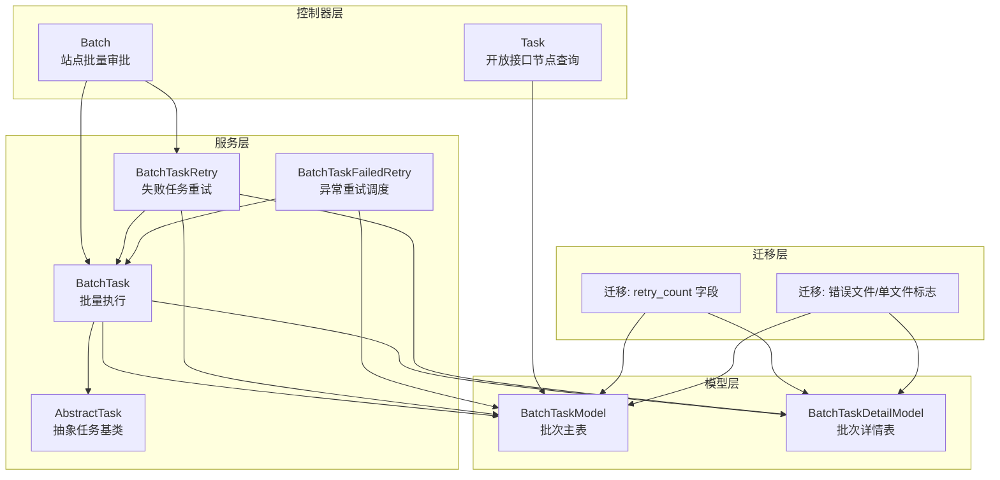
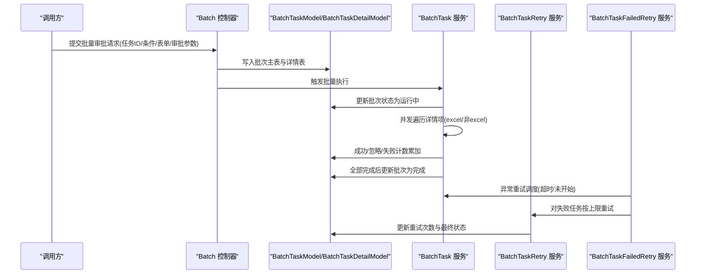
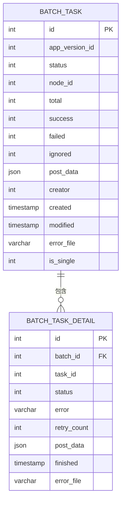
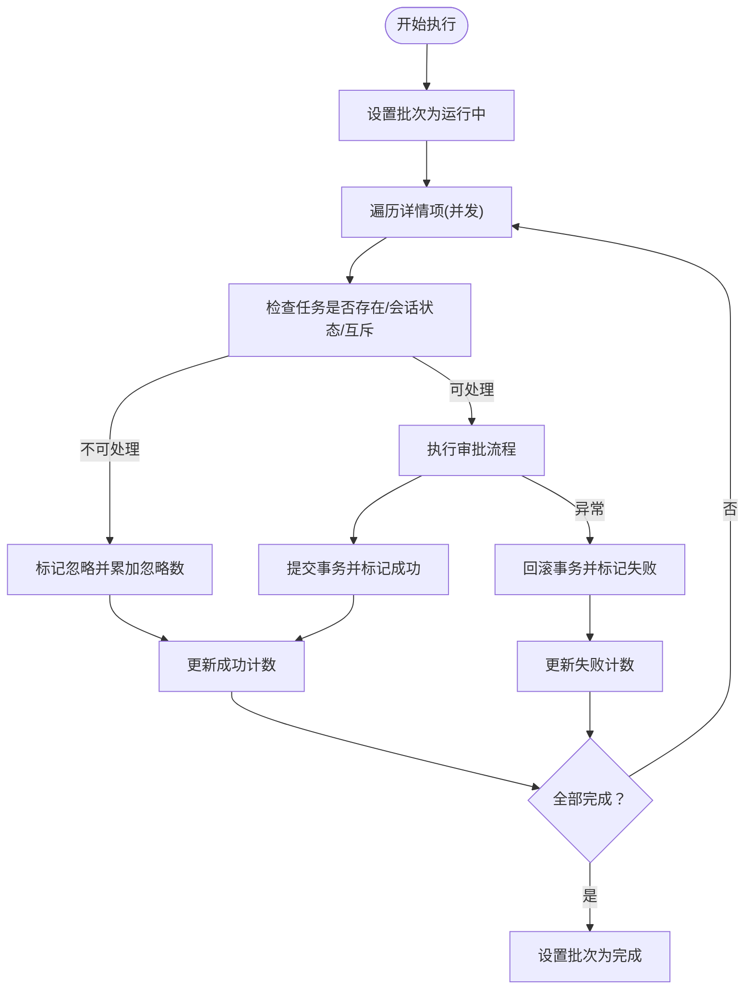
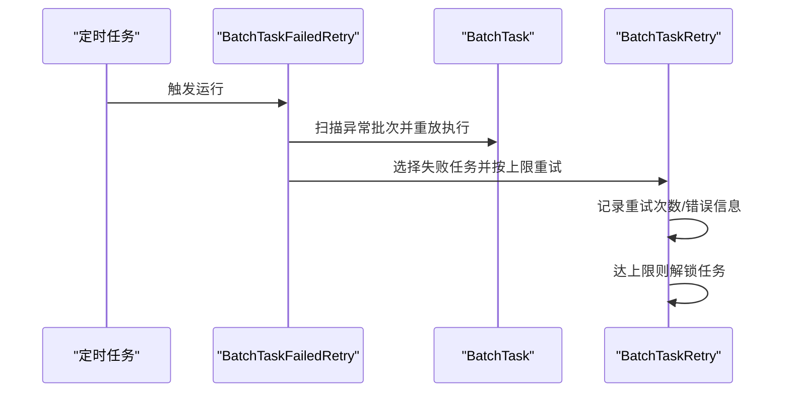
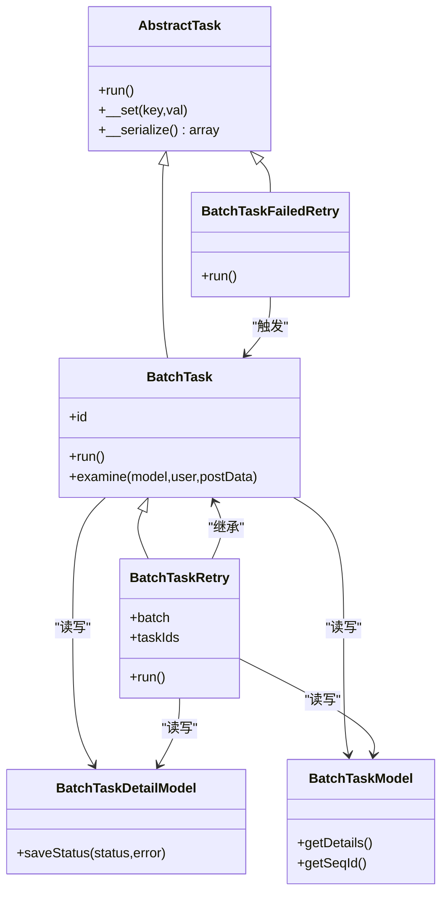

# 批量任务模型

<cite>
**本文档引用的文件**
- [BatchTaskModel.php](file://process/src/models/BatchTaskModel.php)
- [BatchTaskDetailModel.php](file://process/src/models/BatchTaskDetailModel.php)
- [BatchTask.php](file://process/src/services/task/BatchTask.php)
- [BatchTaskRetry.php](file://process/src/services/task/BatchTaskRetry.php)
- [BatchTaskFailedRetry.php](file://process/src/services/task/BatchTaskFailedRetry.php)
- [AbstractTask.php](file://process/src/services/task/AbstractTask.php)
- [Batch.php](file://process/src/http/site/Batch.php)
- [Task.php](file://process/src/http/open/Task.php)
- [migration_20250609_233624_batch_task_retry.php](file://process/src/migrations/migration_20250609_233624_batch_task_retry.php)
- [migration_20250826_095351_batch_task_add_error_file.php](file://process/src/migrations/migration_20250826_095351_batch_task_add_error_file.php)
</cite>

## 目录
1. [简介](#简介)
2. [项目结构](#项目结构)
3. [核心组件](#核心组件)
4. [架构总览](#架构总览)
5. [组件详解](#组件详解)
6. [依赖关系分析](#依赖关系分析)
7. [性能与并发](#性能与并发)
8. [故障排查指南](#故障排查指南)
9. [结论](#结论)
10. [附录](#附录)

## 简介
本文件面向“批量任务处理系统”的架构与实现，围绕 BatchTaskModel 与 BatchTaskDetailModel 的职责边界、数据结构与交互关系展开，系统性阐述批量任务的创建机制、模板与参数、执行计划、并发控制、资源管理、监控与重试、异常恢复等关键能力，并提供可操作的实现参考路径。

## 项目结构
批量任务相关代码主要分布在以下模块：
- 模型层：BatchTaskModel、BatchTaskDetailModel
- 服务层：BatchTask（执行）、BatchTaskRetry（失败重试）、BatchTaskFailedRetry（异常重试调度）
- 控制器层：Batch（站点侧批量审批入口）、Task（开放接口侧节点查询）
- 迁移层：为表结构新增字段与定时任务注册

图示来源
- [BatchTaskModel.php](file://process/src/models/BatchTaskModel.php#L1-L115)
- [BatchTaskDetailModel.php](file://process/src/models/BatchTaskDetailModel.php#L1-L58)
- [BatchTask.php](file://process/src/services/task/BatchTask.php#L1-L135)
- [BatchTaskRetry.php](file://process/src/services/task/BatchTaskRetry.php#L1-L143)
- [BatchTaskFailedRetry.php](file://process/src/services/task/BatchTaskFailedRetry.php#L1-L66)
- [AbstractTask.php](file://process/src/services/task/AbstractTask.php#L1-L30)
- [Batch.php](file://process/src/http/site/Batch.php#L1-L2284)
- [Task.php](file://process/src/http/open/Task.php#L1-L381)
- [migration_20250609_233624_batch_task_retry.php](file://process/src/migrations/migration_20250609_233624_batch_task_retry.php#L1-L37)
- [migration_20250826_095351_batch_task_add_error_file.php](file://process/src/migrations/migration_20250826_095351_batch_task_add_error_file.php#L1-L21)

章节来源
- [BatchTaskModel.php](file://process/src/models/BatchTaskModel.php#L1-L115)
- [BatchTaskDetailModel.php](file://process/src/models/BatchTaskDetailModel.php#L1-L58)
- [BatchTask.php](file://process/src/services/task/BatchTask.php#L1-L135)
- [BatchTaskRetry.php](file://process/src/services/task/BatchTaskRetry.php#L1-L143)
- [BatchTaskFailedRetry.php](file://process/src/services/task/BatchTaskFailedRetry.php#L1-L66)
- [AbstractTask.php](file://process/src/services/task/AbstractTask.php#L1-L30)
- [Batch.php](file://process/src/http/site/Batch.php#L1-L2284)
- [Task.php](file://process/src/http/open/Task.php#L1-L381)
- [migration_20250609_233624_batch_task_retry.php](file://process/src/migrations/migration_20250609_233624_batch_task_retry.php#L1-L37)
- [migration_20250826_095351_batch_task_add_error_file.php](file://process/src/migrations/migration_20250826_095351_batch_task_add_error_file.php#L1-L21)

## 核心组件
- BatchTaskModel：记录批次级任务的总体状态、计数与元数据，负责生成批次号、提供详情迭代器。
- BatchTaskDetailModel：记录每个子任务的执行状态、错误信息、重试次数、完成时间等。
- BatchTask：批量执行服务，负责并发调度、状态更新、事务控制与异常分支处理。
- BatchTaskRetry：失败任务重试服务，按需对指定任务或全部失败任务进行重试，支持自动重试上限与解锁。
- BatchTaskFailedRetry：异常重试调度器，定期扫描长时间未更新或未开始的批次，触发重试；同时对24小时内存在失败但未达重试上限的任务进行重试。
- AbstractTask：任务抽象基类，统一序列化与运行契约。
- 控制器 Batch/Task：站点与开放接口侧的入口，负责任务模板生成、参数校验、批次创建与节点查询。

章节来源
- [BatchTaskModel.php](file://process/src/models/BatchTaskModel.php#L1-L115)
- [BatchTaskDetailModel.php](file://process/src/models/BatchTaskDetailModel.php#L1-L58)
- [BatchTask.php](file://process/src/services/task/BatchTask.php#L1-L135)
- [BatchTaskRetry.php](file://process/src/services/task/BatchTaskRetry.php#L1-L143)
- [BatchTaskFailedRetry.php](file://process/src/services/task/BatchTaskFailedRetry.php#L1-L66)
- [AbstractTask.php](file://process/src/services/task/AbstractTask.php#L1-L30)
- [Batch.php](file://process/src/http/site/Batch.php#L1-L2284)
- [Task.php](file://process/src/http/open/Task.php#L1-L381)

## 架构总览
批量任务从“创建批次”到“并发执行”，再到“异常与失败重试”的全链路如下：

图示来源
- [Batch.php](file://process/src/http/site/Batch.php#L1-L2284)
- [BatchTask.php](file://process/src/services/task/BatchTask.php#L1-L135)
- [BatchTaskRetry.php](file://process/src/services/task/BatchTaskRetry.php#L1-L143)
- [BatchTaskFailedRetry.php](file://process/src/services/task/BatchTaskFailedRetry.php#L1-L66)
- [BatchTaskModel.php](file://process/src/models/BatchTaskModel.php#L1-L115)
- [BatchTaskDetailModel.php](file://process/src/models/BatchTaskDetailModel.php#L1-L58)

## 组件详解

### 数据模型与表结构
- 批次主表（batch_task）：保存批次ID、节点ID、状态、总数/成功/失败/忽略计数、创建者、创建/修改时间、错误文件、是否单文件等。
- 批次详情表（batch_task_detail）：保存子任务ID、批次ID、状态、错误信息、重试次数、提交数据、完成时间、错误文件等。
- 关键字段与含义由模型注释与迁移脚本共同定义，确保字段一致性与演进。

图示来源
- [BatchTaskModel.php](file://process/src/models/BatchTaskModel.php#L1-L115)
- [BatchTaskDetailModel.php](file://process/src/models/BatchTaskDetailModel.php#L1-L58)
- [migration_20250609_233624_batch_task_retry.php](file://process/src/migrations/migration_20250609_233624_batch_task_retry.php#L1-L37)
- [migration_20250826_095351_batch_task_add_error_file.php](file://process/src/migrations/migration_20250826_095351_batch_task_add_error_file.php#L1-L21)

章节来源
- [BatchTaskModel.php](file://process/src/models/BatchTaskModel.php#L1-L115)
- [BatchTaskDetailModel.php](file://process/src/models/BatchTaskDetailModel.php#L1-L58)
- [migration_20250609_233624_batch_task_retry.php](file://process/src/migrations/migration_20250609_233624_batch_task_retry.php#L1-L37)
- [migration_20250826_095351_batch_task_add_error_file.php](file://process/src/migrations/migration_20250826_095351_batch_task_add_error_file.php#L1-L21)

### 批量任务创建机制
- 任务模板与参数
  - 模板生成：站点控制器根据节点配置生成可填写的模板，支持“单文件多条”与“每实例一张表”的两种模式，导出Excel并附带下拉校验与必填标记。
  - 批量参数：控制器接收任务ID集合或查询条件，合并表单数据与审批参数，形成批次级 post_data 或在详情表中拆分存储（excel场景）。
- 执行计划
  - 批次号生成：通过序列获取全局唯一批次号，保证幂等与可追踪。
  - 详情写入：批量插入详情表，初始状态为待执行；若启用excel导入，则详情表中保存各自明细的post_data。
- 状态流转
  - 主表状态：初始化 → 运行中 → 完成；失败计数大于0时，整体状态可能显示异常。
  - 详情状态：初始化/成功/忽略/失败/导入失败。

章节来源
- [Batch.php](file://process/src/http/site/Batch.php#L1-L2284)
- [BatchTaskModel.php](file://process/src/models/BatchTaskModel.php#L1-L115)
- [BatchTaskDetailModel.php](file://process/src/models/BatchTaskDetailModel.php#L1-L58)

### 执行策略与并发控制
- 并发策略
  - 采用固定并发度（如5）对详情项进行并行处理，提升吞吐。
- 事务与锁
  - 每个子任务在独立事务内执行；遇到表单校验异常、用户异常或通用异常时回滚并记录失败；成功则提交并更新主表计数。
  - 在审批前检查会话与任务互斥状态，避免并发冲突。
- 进度与统计
  - 成功/忽略/失败分别累加，完成时间回填，便于前端展示与报表统计。

图示来源
- [BatchTask.php](file://process/src/services/task/BatchTask.php#L1-L135)
- [BatchTaskModel.php](file://process/src/models/BatchTaskModel.php#L1-L115)
- [BatchTaskDetailModel.php](file://process/src/models/BatchTaskDetailModel.php#L1-L58)

章节来源
- [BatchTask.php](file://process/src/services/task/BatchTask.php#L1-L135)

### 资源管理与互斥
- 互斥保护：在审批前检查会话与任务互斥，防止多人同时处理同一任务。
- 任务解锁：当发生异常或达到重试上限时，对任务进行批量解锁，避免死锁。
- 并发上限：通过固定并发度限制同时执行的子任务数量，平衡吞吐与资源占用。

章节来源
- [BatchTask.php](file://process/src/services/task/BatchTask.php#L1-L135)
- [BatchTaskRetry.php](file://process/src/services/task/BatchTaskRetry.php#L1-L143)

### 监控、暂停、恢复与取消
- 监控
  - 通过主表状态与计数字段反映整体进度；详情表记录错误与重试次数，支撑可视化看板。
- 暂停/恢复
  - 会话挂起或任务加签状态下，系统会拒绝处理并返回相应提示，避免在不稳定状态下继续执行。
- 取消
  - 异常分支中对任务进行解锁，确保后续可继续处理；开放接口侧提供任务回收能力（非批量），可作为补充手段。

章节来源
- [BatchTask.php](file://process/src/services/task/BatchTask.php#L1-L135)
- [Task.php](file://process/src/http/open/Task.php#L1-L381)

### 错误处理、重试与异常恢复
- 失败分类
  - 表单校验异常、用户异常、通用异常三类分支分别处理，均回滚事务并记录错误信息与失败计数。
- 自动重试
  - 详情表新增重试计数字段；失败重试服务对失败任务按上限重试，超过阈值后解锁任务。
- 异常恢复
  - 异常重试调度器定期扫描长时间未更新或未开始的批次，触发重试；同时对24小时内存在失败但未达重试上限的任务进行补救式重试。
- 错误文件
  - 支持记录错误文件路径，便于定位问题与二次处理。

图示来源
- [BatchTaskFailedRetry.php](file://process/src/services/task/BatchTaskFailedRetry.php#L1-L66)
- [BatchTaskRetry.php](file://process/src/services/task/BatchTaskRetry.php#L1-L143)
- [migration_20250609_233624_batch_task_retry.php](file://process/src/migrations/migration_20250609_233624_batch_task_retry.php#L1-L37)
- [migration_20250826_095351_batch_task_add_error_file.php](file://process/src/migrations/migration_20250826_095351_batch_task_add_error_file.php#L1-L21)

章节来源
- [BatchTaskRetry.php](file://process/src/services/task/BatchTaskRetry.php#L1-L143)
- [BatchTaskFailedRetry.php](file://process/src/services/task/BatchTaskFailedRetry.php#L1-L66)
- [migration_20250609_233624_batch_task_retry.php](file://process/src/migrations/migration_20250609_233624_batch_task_retry.php#L1-L37)
- [migration_20250826_095351_batch_task_add_error_file.php](file://process/src/migrations/migration_20250826_095351_batch_task_add_error_file.php#L1-L21)

## 依赖关系分析
- BatchTask 依赖 BatchTaskModel/BatchTaskDetailModel 进行状态与计数更新；依赖 TaskExamine/TaskTodoModel 完成审批流程；使用 UsersCollection 获取用户上下文。
- BatchTaskRetry 继承 BatchTask，复用审批逻辑，仅调整失败重试策略与统计口径。
- BatchTaskFailedRetry 依赖 BatchTask 与 BatchTaskRetry，作为调度器协调异常恢复。
- 控制器 Batch 作为入口，负责模板生成、参数校验、批次创建与详情写入。
- 迁移脚本为表结构演进提供保障，包括重试计数、错误文件与单文件标志等。

图示来源
- [AbstractTask.php](file://process/src/services/task/AbstractTask.php#L1-L30)
- [BatchTask.php](file://process/src/services/task/BatchTask.php#L1-L135)
- [BatchTaskRetry.php](file://process/src/services/task/BatchTaskRetry.php#L1-L143)
- [BatchTaskFailedRetry.php](file://process/src/services/task/BatchTaskFailedRetry.php#L1-L66)
- [BatchTaskModel.php](file://process/src/models/BatchTaskModel.php#L1-L115)
- [BatchTaskDetailModel.php](file://process/src/models/BatchTaskDetailModel.php#L1-L58)

章节来源
- [AbstractTask.php](file://process/src/services/task/AbstractTask.php#L1-L30)
- [BatchTask.php](file://process/src/services/task/BatchTask.php#L1-L135)
- [BatchTaskRetry.php](file://process/src/services/task/BatchTaskRetry.php#L1-L143)
- [BatchTaskFailedRetry.php](file://process/src/services/task/BatchTaskFailedRetry.php#L1-L66)
- [BatchTaskModel.php](file://process/src/models/BatchTaskModel.php#L1-L115)
- [BatchTaskDetailModel.php](file://process/src/models/BatchTaskDetailModel.php#L1-L58)

## 性能与并发
- 并发度：固定并发上限（如5）平衡吞吐与资源占用，避免过度竞争。
- 批量写入：详情表支持批量插入，降低I/O开销。
- 事务粒度：每个子任务独立事务，减少长事务锁竞争。
- 重试上限：失败任务重试次数上限（如3次）避免雪崩效应，超过后主动解锁。

章节来源
- [BatchTask.php](file://process/src/services/task/BatchTask.php#L1-L135)
- [BatchTaskRetry.php](file://process/src/services/task/BatchTaskRetry.php#L1-L143)
- [migration_20250609_233624_batch_task_retry.php](file://process/src/migrations/migration_20250609_233624_batch_task_retry.php#L1-L37)

## 故障排查指南
- 常见问题定位
  - 任务被他人处理：检查会话/任务互斥状态，避免并发冲突。
  - 流程挂起或加签中：系统会拒绝处理并提示，需等待状态恢复。
  - 表单校验失败：查看详情表错误信息，修正模板或参数。
  - 异常重试未生效：确认异常重试调度器是否运行、批次状态是否满足扫描条件。
- 重试策略验证
  - 查看详情表重试计数与最终状态，确认是否达到上限并已解锁。
- 错误文件定位
  - 若启用错误文件记录，可通过错误文件字段快速定位失败样本。

章节来源
- [BatchTask.php](file://process/src/services/task/BatchTask.php#L1-L135)
- [BatchTaskRetry.php](file://process/src/services/task/BatchTaskRetry.php#L1-L143)
- [BatchTaskFailedRetry.php](file://process/src/services/task/BatchTaskFailedRetry.php#L1-L66)
- [migration_20250826_095351_batch_task_add_error_file.php](file://process/src/migrations/migration_20250826_095351_batch_task_add_error_file.php#L1-L21)

## 结论
该批量任务模型通过清晰的主/细表分离、严谨的并发与事务控制、完善的异常与重试机制，实现了高可靠、可观测、可扩展的批量审批能力。结合模板生成与节点查询接口，能够覆盖从“创建-执行-监控-重试-恢复”的完整生命周期。

## 附录
- 关键实现路径参考
  - 批次创建与详情写入：[Batch.php](file://process/src/http/site/Batch.php#L1-L2284)
  - 批量执行服务：[BatchTask.php](file://process/src/services/task/BatchTask.php#L1-L135)
  - 失败重试服务：[BatchTaskRetry.php](file://process/src/services/task/BatchTaskRetry.php#L1-L143)
  - 异常重试调度：[BatchTaskFailedRetry.php](file://process/src/services/task/BatchTaskFailedRetry.php#L1-L66)
  - 数据模型定义：[BatchTaskModel.php](file://process/src/models/BatchTaskModel.php#L1-L115)、[BatchTaskDetailModel.php](file://process/src/models/BatchTaskDetailModel.php#L1-L58)
  - 表结构演进：[migration_20250609_233624_batch_task_retry.php](file://process/src/migrations/migration_20250609_233624_batch_task_retry.php#L1-L37)、[migration_20250826_095351_batch_task_add_error_file.php](file://process/src/migrations/migration_20250826_095351_batch_task_add_error_file.php#L1-L21)